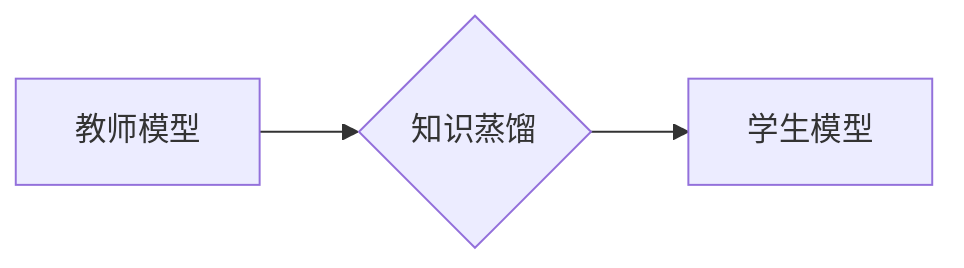

> 知识蒸馏，模型可解释性，深度学习，教师模型，学生模型，特征提取，注意力机制

## 1. 背景介绍

深度学习模型在图像识别、自然语言处理等领域取得了显著成就，但其内部工作机制往往难以理解，缺乏可解释性。这使得模型的应用受到限制，难以在安全关键领域得到广泛应用。

可解释性是指能够理解模型的决策过程，并解释其输出结果的原因。可解释的模型更容易被人类接受和信任，并且可以帮助我们发现模型的潜在问题和偏差。

知识蒸馏是一种迁移学习技术，它通过将知识从一个大型的教师模型转移到一个更小的学生模型中，来提高学生模型的性能。

## 2. 核心概念与联系

知识蒸馏的核心思想是将教师模型的知识，例如特征表示、决策边界等，通过一种特定的方式传递给学生模型。

**知识蒸馏流程图:**



**核心概念:**

* **教师模型:** 通常是一个大型、训练良好的模型，拥有丰富的知识和经验。
* **学生模型:** 通常是一个小型、轻量级的模型，需要学习教师模型的知识。
* **知识蒸馏损失函数:** 用于衡量学生模型与教师模型之间的差异，引导学生模型学习教师模型的知识。

## 3. 核心算法原理 & 具体操作步骤

### 3.1  算法原理概述

知识蒸馏算法的基本原理是通过最小化学生模型的输出与教师模型输出之间的差异来学习教师模型的知识。

**具体步骤:**

1. 训练一个大型的教师模型。
2. 使用教师模型对输入数据进行预测，并获得教师模型的输出。
3. 使用学生模型对输入数据进行预测，并获得学生模型的输出。
4. 计算学生模型输出与教师模型输出之间的差异，并使用知识蒸馏损失函数进行优化。
5. 重复步骤3和4，直到学生模型的性能达到预期水平。

### 3.2  算法步骤详解

1. **数据准备:** 首先需要准备一个用于训练教师模型和学生模型的数据集。
2. **教师模型训练:** 使用预先定义的网络架构和训练策略，训练一个大型的教师模型。
3. **学生模型初始化:** 使用教师模型的权重作为初始值，初始化一个小型学生模型。
4. **知识蒸馏训练:** 使用知识蒸馏损失函数，训练学生模型。知识蒸馏损失函数通常由两部分组成：
    * **分类损失:** 衡量学生模型的预测结果与真实标签之间的差异。
    * **知识蒸馏损失:** 衡量学生模型的输出与教师模型输出之间的差异。
5. **模型评估:** 在测试集上评估学生模型的性能，并根据需要调整模型参数和训练策略。

### 3.3  算法优缺点

**优点:**

* 可以有效提高学生模型的性能，即使学生模型比教师模型小得多。
* 可以将教师模型的知识迁移到不同的任务和领域。
* 可以减少模型训练的时间和资源消耗。

**缺点:**

* 需要一个大型的教师模型作为基础。
* 知识蒸馏过程可能比较复杂，需要一定的经验和技巧。
* 学生模型可能仍然缺乏教师模型的全部知识。

### 3.4  算法应用领域

知识蒸馏技术在以下领域有广泛的应用:

* **图像识别:** 将大型的图像识别模型的知识迁移到小型模型，用于移动设备上的图像识别。
* **自然语言处理:** 将大型的语言模型的知识迁移到小型模型，用于文本分类、机器翻译等任务。
* **语音识别:** 将大型的语音识别模型的知识迁移到小型模型，用于语音助手、语音搜索等应用。

## 4. 数学模型和公式 & 详细讲解 & 举例说明

### 4.1  数学模型构建

知识蒸馏的目标是学习一个学生模型，使得其输出与教师模型的输出尽可能接近。

**数学模型:**

* **教师模型输出:** $y_t = f_t(x)$
* **学生模型输出:** $y_s = f_s(x)$
* **知识蒸馏损失函数:** $L_{KD} = \sum_{i=1}^{N} KL(p_s(y_i) || p_t(y_i))$

其中:

* $f_t(x)$ 和 $f_s(x)$ 分别是教师模型和学生模型的输出函数。
* $y_t$ 和 $y_s$ 分别是教师模型和学生模型的预测结果。
* $p_s(y_i)$ 和 $p_t(y_i)$ 分别是学生模型和教师模型对第 $i$ 个样本的预测概率分布。
* $KL$ 表示KL散度。

### 4.2  公式推导过程

知识蒸馏损失函数的推导过程如下:

1. 假设教师模型的输出是一个概率分布，即 $p_t(y_i)$。
2. 学生模型的输出也应该是一个概率分布，即 $p_s(y_i)$。
3. KL散度可以衡量两个概率分布之间的差异。
4. 因此，知识蒸馏损失函数可以定义为所有样本的KL散度的平均值。

### 4.3  案例分析与讲解

**案例:**

假设我们有一个图像分类任务，使用一个大型的教师模型和一个小型学生模型。

**分析:**

* 教师模型的输出是一个包含10个类别的概率分布。
* 学生模型的输出也应该是一个包含10个类别的概率分布。
* 知识蒸馏损失函数可以衡量学生模型的输出与教师模型输出之间的差异。
* 通过最小化知识蒸馏损失函数，可以引导学生模型学习教师模型的知识，从而提高学生模型的分类性能。

## 5. 项目实践：代码实例和详细解释说明

### 5.1  开发环境搭建

* Python 3.7+
* PyTorch 1.7+
* CUDA 10.2+

### 5.2  源代码详细实现

```python
import torch
import torch.nn as nn
import torch.optim as optim

# 定义教师模型
class TeacherModel(nn.Module):
    # ...

# 定义学生模型
class StudentModel(nn.Module):
    # ...

# 加载预训练的教师模型
teacher_model = TeacherModel()
teacher_model.load_state_dict(torch.load('teacher_model.pth'))

# 初始化学生模型
student_model = StudentModel()

# 定义优化器和损失函数
optimizer = optim.Adam(student_model.parameters(), lr=0.001)
criterion = nn.CrossEntropyLoss()

# 训练循环
for epoch in range(num_epochs):
    for batch_idx, (data, target) in enumerate(train_loader):
        # 前向传播
        teacher_output = teacher_model(data)
        student_output = student_model(data)

        # 计算损失
        loss = criterion(student_output, target) + 0.1 * KL_divergence(student_output, teacher_output)

        # 反向传播
        optimizer.zero_grad()
        loss.backward()
        optimizer.step()

# 保存训练好的学生模型
torch.save(student_model.state_dict(), 'student_model.pth')
```

### 5.3  代码解读与分析

* 代码首先定义了教师模型和学生模型的架构。
* 然后加载预训练的教师模型权重。
* 使用Adam优化器和交叉熵损失函数训练学生模型。
* 知识蒸馏损失函数用于衡量学生模型输出与教师模型输出之间的差异。
* 最后保存训练好的学生模型权重。

### 5.4  运行结果展示

训练完成后，可以将学生模型在测试集上进行评估，并与教师模型和不使用知识蒸馏的模型进行比较。

## 6. 实际应用场景

### 6.1  医疗诊断

知识蒸馏可以用于将大型的医学图像分析模型的知识迁移到小型模型，用于移动设备上的疾病诊断。

### 6.2  金融风险评估

知识蒸馏可以用于将大型的金融数据分析模型的知识迁移到小型模型，用于金融风险评估和预测。

### 6.3  智能制造

知识蒸馏可以用于将大型的工业过程分析模型的知识迁移到小型模型，用于智能制造和工业自动化。

### 6.4  未来应用展望

随着深度学习技术的不断发展，知识蒸馏技术将在更多领域得到应用，例如自动驾驶、机器人控制、个性化推荐等。

## 7. 工具和资源推荐

### 7.1  学习资源推荐

* **论文:**
    * Hinton, G., Vinyals, O., & Dean, J. (2015). Distilling the knowledge in a neural network. arXiv preprint arXiv:1503.02531.
* **博客:**
    * https://towardsdatascience.com/knowledge-distillation-a-powerful-technique-for-deep-learning-model-compression-a3919609999b
* **课程:**
    * https://www.coursera.org/learn/deep-learning

### 7.2  开发工具推荐

* **PyTorch:** https://pytorch.org/
* **TensorFlow:** https://www.tensorflow.org/

### 7.3  相关论文推荐

* **Teacher-Student Generative Adversarial Networks**
* **Multi-Teacher Knowledge Distillation**
* **Progressive Knowledge Distillation**

## 8. 总结：未来发展趋势与挑战

### 8.1  研究成果总结

知识蒸馏技术取得了显著的成果，有效提高了模型的性能和效率。

### 8.2  未来发展趋势

* **更有效的知识蒸馏方法:** 研究更有效的知识蒸馏方法，例如基于注意力机制的知识蒸馏、多教师知识蒸馏等。
* **知识蒸馏的应用扩展:** 将知识蒸馏技术应用到更多领域，例如自然语言理解、机器翻译、语音识别等。
* **可解释性增强:** 研究如何结合知识蒸馏技术增强模型的可解释性。

### 8.3  面临的挑战

* **知识蒸馏的理论基础:** 知识蒸馏的理论基础尚不完善，需要进一步研究。
* **知识蒸馏的效率:** 知识蒸馏过程可能比较耗时，需要提高其效率。
* **知识蒸馏的泛化能力:** 知识蒸馏的泛化能力需要进一步提升。

### 8.4  研究展望

未来，知识蒸馏技术将继续发展，成为深度学习领域的重要研究方向。

## 9. 附录：常见问题与解答

**常见问题:**

* **知识蒸馏的原理是什么？**

**解答:** 知识蒸馏是一种迁移学习技术，它通过将知识从一个大型的教师模型转移到一个更小的学生模型中，来提高学生模型的性能。

* **知识蒸馏有哪些应用场景？**

**解答:** 知识蒸馏技术在图像识别、自然语言处理、语音识别等领域有广泛的应用。

* **如何选择合适的知识蒸馏方法？**

**解答:** 选择合适的知识蒸馏方法需要根据具体的应用场景和模型架构进行选择。

**作者：禅与计算机程序设计艺术 / Zen and the Art of Computer Programming**<end_of_turn>

<end_of_turn>