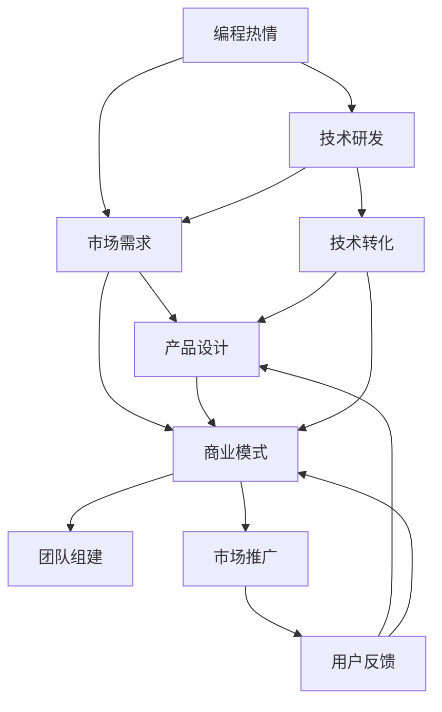

                 

# 如何将编程热情转化为创业动力

> 关键词：编程热情, 创业动力, 技术创业, 技术转化, 创新创业, 技术驱动

## 1. 背景介绍

### 1.1 问题由来
在当今快速发展的技术时代，编程作为一种创造性和解决问题的能力，已经成为创新创业的核心驱动力之一。然而，如何将这份编程热情转化为实际的创业动力，却是许多有志青年面临的难题。特别是在技术日新月异的背景下，如何高效地将技术转化为商业价值，推动技术的创新应用，是技术创业者必须面对的重要课题。

### 1.2 问题核心关键点
实现编程热情到创业动力的转化，关键在于以下几点：
- 理解市场需求：识别技术可以解决哪些现实问题，哪些领域存在需求。
- 商业模式设计：如何利用技术解决实际问题，并构建可行的商业模式。
- 团队组建与协作：技术创业者需要具备一定的人力资源管理能力和团队合作精神。
- 市场策略与推广：如何推广产品，抓住市场机会，获取客户。

### 1.3 问题研究意义
技术创业不仅能够将编程热情转化为现实生产力，更能推动技术创新，满足市场需求，对社会进步和经济发展产生积极影响。通过研究如何将编程热情转化为创业动力，可以为技术创业者提供理论指导和方法借鉴，加速技术的市场化进程。

## 2. 核心概念与联系

### 2.1 核心概念概述

为更好地理解如何将编程热情转化为创业动力，本节将介绍几个密切相关的核心概念：

- **编程热情(Programming Enthusiasm)**：指个人对编程技术的热爱和追求，表现为对编程语言、算法、数据结构等技术的深入研究和创新实践。
- **创业动力(Entrepreneurial Motivation)**：指驱动个体创立并发展企业的内在动力，包括对市场的洞察、对创新的追求、对成功的渴望等。
- **技术创业(Technology Venture)**：指利用先进技术创新产品或服务，实现商业化的创业模式。
- **技术转化(Technology Transformation)**：指将技术研发成果转化为实际产品的过程，包括技术研发、产品设计、市场推广等环节。
- **创新创业(Entrepreneurial Innovation)**：指基于新技术、新方法、新理念创立和发展企业的创业模式，强调创新在创业中的核心作用。

这些核心概念之间的逻辑关系可以通过以下Mermaid流程图来展示：



这个流程图展示了大语言模型的核心概念及其之间的关系：

1. 编程热情通过技术研发转化为产品和服务。
2. 技术研发和市场需求共同推动产品设计，形成商业模式。
3. 商业模式和团队协作确保市场推广和用户反馈，实现商业成功。

这些核心概念共同构成了技术创业和创新的基础框架，使得创业者能够系统地从技术到产品再到市场的全链条进行规划和执行。

## 3. 核心算法原理 & 具体操作步骤
### 3.1 算法原理概述

将编程热情转化为创业动力的过程，本质上是一个将技术创新转化为商业价值的过程。其核心思想是：识别市场需求，利用编程热情和技术研发成果，设计出有市场竞争力的产品或服务，并通过有效的商业模式和市场推广策略，实现商业成功。

形式化地，假设创业者对某个技术领域有浓厚的编程热情，希望将其转化为商业应用。定义市场需求为 $D$，技术研发成果为 $T$，产品设计为 $P$，商业模式为 $M$，团队组建为 $T$，市场推广为 $S$。创业动力的转化过程可以表示为：

$$
P = f(D, T)
$$
$$
M = g(P)
$$
$$
S = h(M)
$$
$$
R = S + F(I)
$$

其中 $R$ 为创业成功度，$I$ 为用户反馈，$F$ 为反馈调整函数。

### 3.2 算法步骤详解

将编程热情转化为创业动力的过程，可以分为以下几个关键步骤：

**Step 1: 识别市场需求**
- 通过市场调研、用户访谈、数据分析等手段，识别目标用户的需求、痛点和市场空缺。
- 分析现有技术解决方案的优缺点，找出可改进的空间。
- 确定技术应用场景和市场定位。

**Step 2: 技术研发与转化**
- 基于编程热情，开展技术研发工作，解决核心技术问题，形成技术成果 $T$。
- 将技术成果转化为可商业化的产品或服务，进行产品设计，形成产品原型 $P$。
- 验证产品功能和技术可行性，进行用户测试和迭代优化。

**Step 3: 商业模式设计**
- 根据市场需求和产品特点，设计商业模式 $M$，确定盈利模式、定价策略、渠道选择等。
- 分析成本和收益，进行商业模式的可行性评估。
- 确定商业推广策略，选择合适的市场切入点。

**Step 4: 团队组建与协作**
- 招募具有相关技术背景和市场经验的人才，组建创业团队。
- 明确团队角色分工，进行有效的沟通与协作。
- 建立激励机制，确保团队成员的积极性和创造力。

**Step 5: 市场推广与销售**
- 制定市场推广计划，选择合适的渠道进行宣传。
- 策划销售活动，与目标客户建立联系。
- 收集用户反馈，不断优化产品和服务。

### 3.3 算法优缺点

将编程热情转化为创业动力的技术转化方法，具有以下优点：
1. 高效利用编程热情：通过技术研发实现技术创新，能够高效地发挥编程爱好者的创造力。
2. 面向市场：通过市场需求导向，能够确保产品具备市场竞争力和实际价值。
3. 系统化流程：将技术转化过程分解为多个环节，便于系统化管理和执行。

同时，该方法也存在一定的局限性：
1. 技术到市场的转换存在风险：技术研发成果不一定能够完全满足市场需求，存在技术到商业的转化风险。
2. 对市场敏锐度要求高：创业者需要对市场有深刻的理解，能够快速抓住机会。
3. 资金和时间成本：技术研发和市场推广需要大量资金和时间投入，对创业团队和投资者都是一种考验。
4. 团队协作复杂：多学科、多职能团队的协作管理需要较高的组织和协调能力。

尽管存在这些局限性，但就目前而言，将编程热情转化为创业动力的技术转化方法仍然是最主流、最有效的创业模式之一。未来相关研究的重点在于如何进一步降低技术转化风险，提高创业成功率，同时兼顾团队协作和市场敏锐度等因素。

### 3.4 算法应用领域

将编程热情转化为创业动力的技术转化方法，已经在诸多技术创业领域得到了广泛应用，包括但不限于：

- 软件开发：利用编程技术开发各种软件产品，如移动应用、云计算平台等。
- 人工智能：基于深度学习、自然语言处理等技术，开发智能助手、推荐系统等应用。
- 医疗健康：应用数据科学和算法技术，开发健康监测、疾病预测等医疗产品。
- 金融科技：利用大数据和区块链技术，开发支付、借贷、保险等金融服务。
- 环保科技：结合物联网和智能算法，开发节能减排、环境监测等应用。

除了上述这些经典领域外，技术转化方法也被创新性地应用到更多场景中，如智能家居、智慧城市、智能制造等，为各行各业带来了新的技术变革。随着技术的不断演进和市场的不断发展，相信技术转化方法将在更广泛的领域发挥重要作用。

## 4. 数学模型和公式 & 详细讲解 & 举例说明
### 4.1 数学模型构建

将编程热情转化为创业动力的技术转化过程，可以通过构建数学模型来进一步描述。假设市场需求为 $D$，技术成果为 $T$，产品设计为 $P$，商业模式为 $M$，团队组建为 $T$，市场推广为 $S$，用户反馈为 $I$。创业成功度 $R$ 可以表示为：

$$
R = f(D, T) + g(P) + h(M) + I
$$

其中 $f$、$g$、$h$ 为对应的函数，$I$ 为用户反馈对创业成功度的贡献。

### 4.2 公式推导过程

以下我们以软件开发领域为例，推导技术转化过程的数学模型。

假设市场需求为 $D = d_1 + d_2 + d_3$，其中 $d_1$ 为初始需求，$d_2$ 为通过技术研发新增的需求，$d_3$ 为通过市场推广新增加的需求。技术成果为 $T = t_1 + t_2$，其中 $t_1$ 为原始技术，$t_2$ 为通过进一步研发新增的技术。产品设计为 $P = p_1 + p_2$，其中 $p_1$ 为产品的基础版本，$p_2$ 为通过用户反馈和迭代优化新增的功能。商业模式为 $M = m_1 + m_2$，其中 $m_1$ 为原始商业模式，$m_2$ 为通过市场推广和用户反馈优化的新商业模式。

则创业成功度 $R$ 可以表示为：

$$
R = f(d_1, t_1) + g(p_1) + h(m_1) + I
$$

进一步展开，得到：

$$
R = d_1 \times t_1 \times p_1 \times m_1 + d_2 \times t_2 \times p_2 \times m_1 + d_3 \times t_1 \times p_1 \times m_2 + I
$$

通过上述公式，可以清晰地看到技术转化过程中各个环节的相互作用和贡献，有助于系统化管理技术创业过程。

### 4.3 案例分析与讲解

以人工智能领域为例，分析基于编程热情的技术转化过程。

假设创业者对自然语言处理技术有浓厚兴趣，希望通过这一技术创业。市场需求为 $D$，技术成果为 $T$，产品设计为 $P$，商业模式为 $M$，团队组建为 $T$，市场推广为 $S$，用户反馈为 $I$。

**市场需求识别**：
- 通过对现有市场调研和用户访谈，发现企业在自然语言处理领域的痛点为机器翻译质量不高、对话系统智能度低、智能推荐准确率不足等。
- 分析现有技术解决方案，如谷歌翻译、IBM Watson等，识别出需要改进的地方，如翻译流畅性、对话上下文理解、推荐算法优化等。

**技术研发与转化**：
- 基于自然语言处理技术的热情，创业者组织团队进行技术研发，使用深度学习算法优化机器翻译模型，增加对话系统上下文理解能力，提升推荐系统算法效果。
- 将研发成果转化为可商业化的产品，开发出高精度机器翻译工具、智能对话机器人、个性化推荐系统等产品。

**商业模式设计**：
- 根据市场需求和产品特点，设计商业模型 $M$，确定订阅制、按需付费、广告收入等盈利模式。
- 分析成本和收益，进行商业模式的可行性评估，确定免费试用、客户反馈优化等市场策略。

**团队组建与协作**：
- 招募具有深度学习、自然语言处理背景的技术人才和市场推广经验的人员，组建创业团队。
- 明确团队角色分工，如技术研发、产品设计、市场推广等。
- 建立激励机制，如股权激励、绩效奖金等，确保团队成员的积极性和创造力。

**市场推广与销售**：
- 制定市场推广计划，通过技术评测、客户反馈、社交媒体等方式进行宣传。
- 策划销售活动，推出免费试用版、邀请测试用户、举办技术培训等，吸引更多客户。
- 收集用户反馈，不断优化产品和服务，提高客户满意度和产品竞争力。

最终，通过技术转化和市场推广，创业者实现了创业成功，产品进入市场并获得了良好的市场反馈。

## 5. 项目实践：代码实例和详细解释说明
### 5.1 开发环境搭建

在进行技术转化实践前，我们需要准备好开发环境。以下是使用Python进行软件开发环境的配置流程：

1. 安装Anaconda：从官网下载并安装Anaconda，用于创建独立的Python环境。

2. 创建并激活虚拟环境：
```bash
conda create -n dev-env python=3.9 
conda activate dev-env
```

3. 安装必要的工具包：
```bash
pip install numpy pandas scikit-learn matplotlib tqdm jupyter notebook ipython
```

4. 安装Git版本控制工具：
```bash
brew install git
```

5. 配置Git：
```bash
git config --global user.name "John Doe"
git config --global user.email "john.doe@example.com"
git init
```

6. 配置IDE：
安装Visual Studio Code等代码编辑器，并安装必要的插件，如Git扩展、Python环境配置等。

完成上述步骤后，即可在`dev-env`环境中开始技术转化实践。

### 5.2 源代码详细实现

下面以人工智能领域的智能推荐系统为例，给出基于编程热情的技术转化实践代码实现。

首先，定义推荐系统的数据处理函数：

```python
import pandas as pd
from sklearn.feature_extraction.text import TfidfVectorizer
from sklearn.metrics.pairwise import cosine_similarity

def process_data(data_path):
    # 读取数据集
    df = pd.read_csv(data_path, sep='\t')
    
    # 分词、去停用词、词干提取等文本预处理
    df['text'] = df['text'].apply(lambda x: preprocess_text(x))
    
    # 构建文本向量化器
    vectorizer = TfidfVectorizer(analyzer='word', stop_words='english')
    X = vectorizer.fit_transform(df['text'])
    
    # 计算文本相似度
    similarity_matrix = cosine_similarity(X)
    
    return df, similarity_matrix
```

然后，定义推荐算法：

```python
from scipy.sparse.linalg import svds

def collaborative_filtering(similarity_matrix, user_rated_items):
    # 计算用户-物品矩阵
    user_item_matrix = construct_user_item_matrix(similarity_matrix, user_rated_items)
    
    # 奇异值分解(SVD)求解推荐结果
    U, S, Vt = svds(user_item_matrix, k=10)
    R = U.dot(S).dot(Vt)
    
    return R
```

接着，定义推荐系统的用户界面：

```python
from flask import Flask, render_template, request

app = Flask(__name__)

@app.route('/')
def home():
    return render_template('home.html')

@app.route('/recommend', methods=['POST'])
def recommend():
    user_id = request.form['user_id']
    # 获取用户已评分物品
    rated_items = get_rated_items(user_id)
    # 计算推荐结果
    R = collaborative_filtering(similarity_matrix, rated_items)
    # 获取未评分物品
    unrated_items = get_unrated_items()
    # 计算推荐评分
    scores = calculate_recommend_scores(R, unrated_items)
    # 返回推荐结果
    return render_template('recommend.html', scores=scores)
```

最后，启动推荐系统：

```bash
python app.py
```

以上代码实现了一个简单的基于协同过滤的推荐系统，用户可以通过网页界面输入用户ID，获取推荐结果。通过此代码，可以看出将编程热情转化为创业动力的一个具体实践案例。

### 5.3 代码解读与分析

让我们再详细解读一下关键代码的实现细节：

**process_data函数**：
- 定义了数据处理流程：读取数据集，进行文本预处理，构建文本向量化器，计算文本相似度。
- 使用Python的pandas库进行数据读取和处理。
- 使用scikit-learn库的TfidfVectorizer进行文本向量化，使用cosine_similarity计算文本相似度。

**collaborative_filtering函数**：
- 定义了协同过滤算法：构建用户-物品矩阵，使用奇异值分解(SVD)求解推荐结果。
- 使用scipy库的svds函数进行矩阵分解。
- 算法简洁高效，适用于大规模数据集。

**home和recommend函数**：
- 定义了用户界面：使用Flask框架实现前后端分离，前后端交互。
- 前端使用HTML和CSS设计界面，后端使用Python处理数据和逻辑。
- 使用模板引擎渲染页面，返回推荐结果。

**推荐系统**：
- 基于协同过滤算法，实现了推荐系统的基本功能。
- 可以通过进一步优化和扩展，实现更高级的推荐算法，如基于深度学习的推荐系统。
- 可以结合用户行为数据，进行个性化推荐，提升用户体验。

可以看出，通过技术转化实践，可以高效地将编程热情转化为实际的市场应用，创造出有价值的商业产品。

## 6. 实际应用场景
### 6.1 智能推荐系统

基于编程热情的技术转化方法，已经在智能推荐系统领域得到了广泛应用。智能推荐系统通过算法为用户推荐感兴趣的内容，提高用户满意度和留存率。

在技术转化过程中，需要了解用户的兴趣偏好、行为数据等，通过编程实现算法模型，将数据转化为推荐结果，进行用户界面设计和交互。智能推荐系统已经被广泛应用于电商、视频、新闻等领域，提升了用户体验和平台的竞争力。

### 6.2 健康监测系统

技术转化方法在健康监测系统领域也有广泛应用。健康监测系统通过传感器采集用户的生理数据，结合算法模型进行数据分析和健康预测，帮助用户及时发现健康问题。

在技术转化过程中，需要结合医疗领域的知识，通过编程实现数据采集、数据处理和算法模型，将生理数据转化为健康建议和预警信息。健康监测系统已经被广泛应用于智能手表、智能手环等设备中，帮助用户实现健康管理。

### 6.3 智能客服系统

智能客服系统通过自然语言处理技术，实现自动问答和客服服务，提升客户体验和效率。

在技术转化过程中，需要结合自然语言处理领域的知识，通过编程实现语料预处理、模型训练和客服对话生成，将自然语言处理技术转化为可用的客服系统。智能客服系统已经被广泛应用于电商平台、在线客服等领域，提升了客户咨询和服务的效率。

### 6.4 未来应用展望

随着技术转化的不断演进，未来在更多领域将迎来新的应用场景：

1. **自动驾驶**：基于编程热情的技术转化，可以实现自动驾驶车辆的开发和应用，提升道路安全性和交通效率。
2. **智能家居**：通过编程实现家庭设备的自动化控制和智能化管理，提升居住体验和生活便利性。
3. **智能制造**：结合物联网和编程技术，实现生产设备的智能控制和优化，提高生产效率和产品质量。
4. **智慧城市**：通过编程实现城市基础设施的智能化管理，提升城市治理水平和居民生活质量。
5. **教育技术**：结合编程教育和自然语言处理技术，实现个性化学习路径和智能辅导系统，提升教育质量和效率。

## 7. 工具和资源推荐
### 7.1 学习资源推荐

为了帮助开发者系统掌握技术转化的方法和工具，这里推荐一些优质的学习资源：

1. **《机器学习实战》**：通过实际案例，介绍了机器学习算法的实现和应用，适合初学者入门。
2. **Coursera机器学习课程**：由斯坦福大学开设的机器学习课程，系统讲解了机器学习的理论和实践。
3. **《深度学习》**：由Ian Goodfellow等人编写的深度学习经典教材，详细介绍了深度学习的原理和应用。
4. **Kaggle数据科学竞赛平台**：提供了大量数据集和竞赛任务，实践编程技能和算法能力。
5. **GitHub代码库**：全球最大的代码托管平台，提供了丰富的开源项目和代码资源，便于学习和借鉴。

通过对这些资源的学习实践，相信你一定能够快速掌握技术转化的精髓，并用于解决实际的创业问题。

### 7.2 开发工具推荐

高效的开发离不开优秀的工具支持。以下是几款用于技术转化开发的常用工具：

1. **Jupyter Notebook**：开源的交互式笔记本，支持Python、R等多种语言，适合数据科学和算法开发。
2. **Git**：分布式版本控制系统，便于团队协作和代码管理。
3. **Flask**：Python的Web框架，简单易用，适合快速开发Web应用。
4. **PyCharm**：功能强大的Python IDE，支持代码调试、版本控制和项目管理。
5. **Docker**：容器化技术，便于部署和管理多语言应用。

合理利用这些工具，可以显著提升技术转化的开发效率，加快创新迭代的步伐。

### 7.3 相关论文推荐

技术转化研究源于学界的持续研究。以下是几篇奠基性的相关论文，推荐阅读：

1. **A Survey of Collaborative Filtering Techniques**：介绍协同过滤算法的经典论文，提供了算法实现和评估方法。
2. **Deep Learning for Recommender Systems**：介绍深度学习在推荐系统中的应用，提供了多种深度学习算法的实现和效果比较。
3. **Programming Enthusiastic Entrepreneurs**：研究编程热情与创业动力的相关论文，提供了创业者的编程热情如何转化为技术创业的实证分析。
4. **An Empirical Evaluation of the Effects of Python Libraries on Python Development Effort**：研究Python库对编程效率的影响，提供了代码实践中的经验总结。

这些论文代表了大语言模型技术转化领域的发展脉络。通过学习这些前沿成果，可以帮助研究者把握学科前进方向，激发更多的创新灵感。

## 8. 总结：未来发展趋势与挑战
### 8.1 总结

本文对将编程热情转化为创业动力的技术转化方法进行了全面系统的介绍。首先阐述了技术转化在技术创业中的核心作用，明确了从编程热情到创业动力的转化过程。其次，从原理到实践，详细讲解了技术转化的数学模型和关键步骤，给出了技术转化任务开发的完整代码实例。同时，本文还广泛探讨了技术转化方法在智能推荐、健康监测、智能客服等多个领域的应用前景，展示了技术转化的巨大潜力。此外，本文精选了技术转化的各类学习资源，力求为读者提供全方位的技术指引。

通过本文的系统梳理，可以看到，基于编程热情的技术转化方法正在成为技术创业的重要范式，极大地拓展了技术创新和应用的空间，推动了技术的市场化进程。未来，伴随技术转化方法的不断演进，相信技术创业必将在更广泛的领域实现突破，为技术创业者带来更多的机会和挑战。

### 8.2 未来发展趋势

展望未来，技术转化方法将呈现以下几个发展趋势：

1. **数据驱动**：随着大数据和人工智能技术的发展，数据驱动将成为技术转化的主要驱动力，数据挖掘和分析能力将更加重要。
2. **深度学习**：深度学习技术将更加广泛地应用于技术转化，提升算法模型的准确性和鲁棒性。
3. **多模态融合**：结合自然语言处理、计算机视觉、语音识别等技术，实现多模态数据的融合和应用，提升技术转化效果。
4. **边缘计算**：将技术转化过程从中心化向边缘计算方向发展，提升数据处理和推理的效率和响应速度。
5. **智能算法**：基于人工智能和机器学习的算法将更加智能化，能够更好地适应不同的应用场景和用户需求。
6. **自动化**：自动化技术将进一步应用于技术转化，提升开发效率和创新速度。

以上趋势凸显了技术转化的广阔前景，这些方向的探索发展，必将进一步推动技术的市场化应用，为技术创业者带来更多的机会和挑战。

### 8.3 面临的挑战

尽管技术转化方法已经取得了瞩目成就，但在迈向更加智能化、普适化应用的过程中，它仍面临着诸多挑战：

1. **数据质量和数量**：数据的质量和数量是技术转化的关键，高质量的数据往往需要付出较高的成本和复杂的数据处理过程。
2. **算法复杂性**：深度学习等复杂算法需要强大的计算资源和专业知识，普通开发者难以掌握。
3. **市场适应性**：技术转化需要高度市场适应性，不同领域的技术转化方法和策略有所不同。
4. **用户隐私保护**：技术转化过程中涉及大量用户数据，隐私保护和数据安全成为重要问题。
5. **技术更新**：技术快速更新，需要持续学习新的技术和方法，保持技术转化方法的先进性。
6. **商业化和落地**：技术转化不仅仅是技术问题，还需要考虑商业模式、市场推广、用户反馈等多方面因素。

正视技术转化面临的这些挑战，积极应对并寻求突破，将是大语言模型技术转化走向成熟的必由之路。相信随着学界和产业界的共同努力，这些挑战终将一一被克服，技术转化方法必将在构建智能社会中发挥越来越重要的作用。

### 8.4 研究展望

面对技术转化面临的种种挑战，未来的研究需要在以下几个方面寻求新的突破：

1. **大数据处理技术**：研究高效、准确的大数据处理和分析方法，提升数据驱动技术转化的能力。
2. **自动化编程工具**：开发智能化的编程工具，提升开发效率，降低技术转化门槛。
3. **多模态融合技术**：研究多模态数据的融合和应用，提升技术转化效果。
4. **隐私保护技术**：研究隐私保护和数据安全技术，保障用户数据的安全。
5. **普适化技术**：研究普适化技术，使技术转化方法适用于更多领域和场景。
6. **人机协同**：研究人机协同技术，提升技术转化的智能水平。

这些研究方向的探索，必将引领技术转化方法迈向更高的台阶，为技术创业者带来更多的机会和挑战，推动技术转化技术的不断演进和发展。

## 9. 附录：常见问题与解答

**Q1：技术转化过程中如何确保数据的质量和数量？**

A: 数据质量和数量是技术转化的关键，可以通过以下方式确保数据的质量和数量：
1. 数据采集：通过多种渠道采集数据，如API接口、公开数据集、用户上传等，确保数据来源的多样性和丰富性。
2. 数据清洗：对数据进行去重、去噪、去异常等处理，确保数据的一致性和完整性。
3. 数据标注：对数据进行标注和标签化，确保数据的可用性和可解释性。
4. 数据增强：通过数据增强技术，扩充数据集，确保数据的丰富性和多样性。
5. 数据监控：实时监控数据质量，及时发现和处理数据异常。

通过这些方式，可以确保数据的质量和数量，为技术转化提供可靠的基础。

**Q2：技术转化过程中如何选择合适的算法？**

A: 技术转化过程中，选择合适的算法至关重要。可以通过以下方式选择算法：
1. 需求分析：了解技术转化任务的具体需求，确定需要解决的问题和目标。
2. 算法比较：对比不同算法的优缺点，选择适合的算法。
3. 实验验证：通过实验验证算法的有效性，选择效果最佳的算法。
4. 领域知识：结合领域知识，选择适用于特定领域的算法。
5. 技术先进性：选择具有技术先进性和创新性的算法，提升技术转化效果。

通过这些方式，可以确保选择到合适的算法，提升技术转化的效果和效率。

**Q3：技术转化过程中如何提升开发效率？**

A: 技术转化过程中，提升开发效率可以通过以下方式实现：
1. 自动化工具：使用自动化工具，如代码生成器、测试工具、部署工具等，提升开发效率。
2. 版本控制：使用版本控制系统，如Git，方便团队协作和代码管理。
3. 持续集成和持续部署(CI/CD)：使用CI/CD工具，如Jenkins、Travis CI等，实现代码的持续集成和部署，提升开发效率和代码质量。
4. 代码重用：通过代码重用和模块化设计，提升代码的可复用性和可维护性。
5. 敏捷开发：采用敏捷开发方法，如Scrum、Kanban等，提升开发效率和产品迭代速度。

通过这些方式，可以提升技术转化的开发效率，加速创新迭代的步伐。

**Q4：技术转化过程中如何确保技术转化的成功率？**

A: 技术转化过程中，确保技术转化的成功率可以通过以下方式实现：
1. 明确目标：明确技术转化的目标和需求，确保转化过程的清晰性和方向性。
2. 数据驱动：通过数据驱动技术转化，确保转化过程的数据质量和数量。
3. 算法优化：不断优化算法模型，提升转化效果和效率。
4. 用户反馈：收集用户反馈，及时调整和优化产品和服务。
5. 市场验证：通过市场验证，评估产品的效果和市场接受度。
6. 持续迭代：持续迭代和优化产品，提升技术转化成功率。

通过这些方式，可以确保技术转化的成功率，提升产品的市场竞争力和用户体验。

**Q5：技术转化过程中如何保护用户隐私？**

A: 技术转化过程中，保护用户隐私可以通过以下方式实现：
1. 数据脱敏：对敏感数据进行脱敏处理，保护用户隐私。
2. 匿名化处理：对数据进行匿名化处理，确保用户数据的安全。
3. 数据加密：对数据进行加密处理，防止数据泄露。
4. 隐私保护技术：使用隐私保护技术，如差分隐私、同态加密等，保护用户隐私。
5. 法律合规：遵守相关法律法规，确保用户数据的使用合法合规。

通过这些方式，可以保护用户隐私，确保技术转化过程中的数据安全。

---

作者：禅与计算机程序设计艺术 / Zen and the Art of Computer Programming

