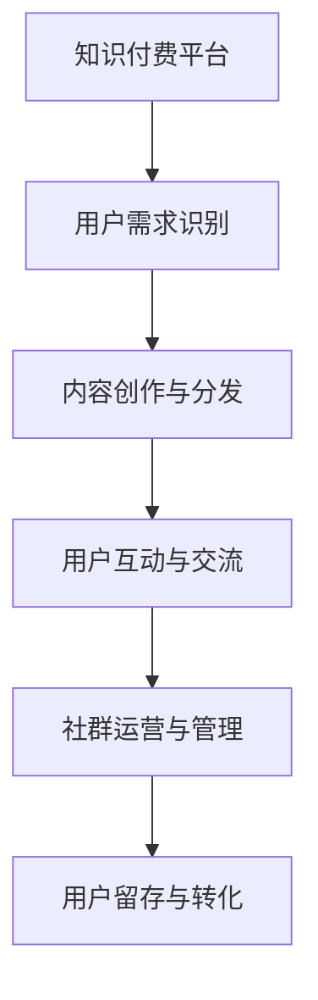

                 

# 如何建立和维护知识付费用户社群

## 1. 背景介绍

在知识爆炸的时代，用户获取知识的渠道愈发丰富，如何在众多资源中脱颖而出，成为每个知识付费平台面临的首要问题。用户社群的建立和维护，不仅能够显著提升平台的用户粘性，还能形成良好的口碑传播，进而吸引更多用户加入。本文将从社群构建、内容运营、技术支持等方面深入探讨，为你提供一套全面的知识付费用户社群建设方案。

## 2. 核心概念与联系

### 2.1 核心概念概述

知识付费用户社群，指通过特定的知识付费平台聚集具有相同兴趣或学习需求的用户群体，围绕特定主题进行交流、分享、学习的社区。其核心在于平台提供的知识产品，以及通过产品驱动用户之间的互动和交流。

社群建设需要考虑的核心要素包括：
- **平台载体**：知识付费平台作为社群的承载空间，决定社群的规模和交互方式。
- **用户需求**：识别和满足用户的多样化学习需求，是社群持续活跃的关键。
- **互动交流**：构建用户之间的互动机制，促进知识共享和交流。
- **运营管理**：通过精细化的运营手段，持续吸引和保留用户，实现社群的良性循环。

### 2.2 核心概念原理和架构的 Mermaid 流程图



## 3. 核心算法原理 & 具体操作步骤

### 3.1 算法原理概述

建立和维护知识付费用户社群，本质上是一个多目标优化问题。其核心在于通过合理的平台设计、内容策略和运营手段，最大化用户满意度、留存率和转化率。

从算法角度来看，社群构建可以分为以下几个阶段：
- **用户获取**：通过广告、推荐系统等手段，吸引新用户加入社群。
- **内容推荐**：根据用户兴趣和行为数据，个性化推荐知识产品，提高用户满意度和黏性。
- **互动交流**：建立用户之间的互动机制，促进知识共享和社群活力。
- **社群管理**：通过自动化和人工介入的方式，对社群进行持续管理，避免负面行为，确保社群健康发展。

### 3.2 算法步骤详解

#### 3.2.1 用户获取

1. **广告投放**：在各类平台投放精准广告，吸引潜在用户点击并注册。
2. **推荐系统**：基于用户兴趣和行为数据，推荐相关知识产品，提高用户注册转化率。
3. **激励机制**：通过免费试听、优惠折扣等激励措施，吸引用户注册。

#### 3.2.2 内容推荐

1. **用户画像构建**：收集和分析用户的基本信息、学习历史和行为数据，构建用户画像。
2. **内容标签化**：对知识产品进行标签化处理，提取关键词和主题。
3. **推荐算法**：采用协同过滤、基于内容的推荐算法，个性化推荐知识产品。
4. **动态调整**：根据用户反馈和行为数据，动态调整推荐算法，提高推荐效果。

#### 3.2.3 互动交流

1. **社群设计**：设计不同的社群类型，如学习小组、专题讨论、直播互动等，满足用户多样化的需求。
2. **互动机制**：建立评论、点赞、讨论等互动机制，促进用户之间的交流。
3. **激励措施**：通过积分奖励、徽章认证等方式，激励用户积极参与互动。

#### 3.2.4 社群管理

1. **内容审核**：建立严格的内容审核机制，过滤和屏蔽不适宜内容。
2. **行为监管**：监控社群行为，及时处理违规用户，保障社群健康。
3. **用户反馈**：收集用户反馈，持续优化社群管理策略。

### 3.3 算法优缺点

#### 3.3.1 优点

1. **用户粘性高**：通过个性化推荐和互动交流，显著提高用户满意度和黏性。
2. **运营效率高**：自动化管理工具和推荐算法，减轻人工运营负担，提高运营效率。
3. **效果可量化**：用户行为数据和反馈可以量化分析，评估运营效果，指导优化。

#### 3.3.2 缺点

1. **资源投入大**：高质量的内容创作和个性化推荐需要大量人力物力投入。
2. **用户需求多样**：用户兴趣和需求多样化，难以通过单一策略满足所有用户。
3. **内容质量参差不齐**：用户生成内容质量难以保证，可能影响社群整体水平。

### 3.4 算法应用领域

知识付费用户社群的应用领域广泛，包括但不限于：
- **在线教育**：如Coursera、Udacity等平台的课程讨论区。
- **科技资讯**：如36kr、TechCrunch等平台的读者社区。
- **职业培训**：如LinkedIn Learning、网易云课堂等平台的职场交流群。
- **健康生活**：如Keep、小来健康等平台的运动爱好者社群。

## 4. 数学模型和公式 & 详细讲解 & 举例说明

### 4.1 数学模型构建

知识付费用户社群的建设，可以从用户行为和互动数据中构建数学模型。主要包括以下几个方面：

- **用户行为模型**：表示用户行为和需求的关系，如学习时间、购买频率、知识分享等。
- **内容推荐模型**：基于用户行为和内容属性，推荐相关知识产品。
- **社群互动模型**：描述用户之间的互动行为，如评论、点赞、讨论等。

### 4.2 公式推导过程

以用户行为模型为例，假设用户行为数据为 $D=\{(x_i, y_i)\}_{i=1}^N$，其中 $x_i$ 表示用户行为，$y_i$ 表示用户需求。构建用户行为模型的目标是最小化预测误差：

$$
\min_{\theta} \frac{1}{N} \sum_{i=1}^N (y_i - f(x_i; \theta))^2
$$

其中 $f(x_i; \theta)$ 为预测函数，$\theta$ 为模型参数。通过梯度下降等优化算法，不断更新参数 $\theta$，使得模型能够准确预测用户行为。

### 4.3 案例分析与讲解

某在线教育平台的用户行为数据如下：
- $x_1 = 每天学习时间 > 4小时$
- $x_2 = 购买付费课程次数 > 5$
- $y = 学习兴趣 = 对编程语言学习有较高兴趣$
- $y = 学习兴趣 = 对数学建模有较高兴趣$

利用上述用户行为模型，可以构建不同用户的兴趣预测模型，如 $f(x; \theta)$。例如，对于 $x_1$，可以预测其对编程语言学习兴趣，通过最小化误差：

$$
\min_{\theta} \frac{1}{N} \sum_{i=1}^N (y_i - f(x_i; \theta))^2
$$

通过求解上述优化问题，可以得到最优参数 $\theta$，进而预测 $x_1$ 的学习兴趣。

## 5. 项目实践：代码实例和详细解释说明

### 5.1 开发环境搭建

1. **选择平台**：选择合适的知识付费平台，如Udemy、Coursera等。
2. **数据收集**：收集用户行为数据，如学习时间、购买记录、互动数据等。
3. **选择工具**：选择适合的编程语言和框架，如Python、TensorFlow、PyTorch等。

### 5.2 源代码详细实现

以下是一个基于TensorFlow构建用户行为模型的示例代码：

```python
import tensorflow as tf
import pandas as pd

# 数据预处理
data = pd.read_csv('user_behavior.csv')
X = data[['学习时间', '购买次数']]
y = data['学习兴趣']

# 构建模型
model = tf.keras.Sequential([
    tf.keras.layers.Dense(64, activation='relu', input_shape=(2,)),
    tf.keras.layers.Dense(32, activation='relu'),
    tf.keras.layers.Dense(2, activation='softmax')
])

# 编译模型
model.compile(optimizer='adam', loss='categorical_crossentropy', metrics=['accuracy'])

# 训练模型
model.fit(X, y, epochs=10, batch_size=32)
```

### 5.3 代码解读与分析

以上代码展示了基于TensorFlow构建和训练用户行为模型的过程：
- **数据预处理**：使用Pandas读取CSV文件，提取用户行为数据和兴趣标签。
- **模型构建**：使用Sequential模型，添加多层神经网络，构建预测函数。
- **模型编译**：使用Adam优化器和交叉熵损失函数，定义训练目标。
- **模型训练**：使用训练数据集，迭代训练模型，优化预测函数。

### 5.4 运行结果展示

模型训练完成后，可以对新用户进行兴趣预测：
```python
new_user = pd.DataFrame([[4, 5]], columns=['学习时间', '购买次数'])
predicted_interest = model.predict(new_user)
```

## 6. 实际应用场景

### 6.1 在线教育

某在线教育平台通过用户行为数据分析，构建用户兴趣模型，个性化推荐课程和学习资源。同时，平台提供学习小组和讨论区，促进用户之间的交流和学习，提高用户活跃度和满意度。

### 6.2 科技资讯

某科技资讯平台通过用户行为和内容互动数据，构建知识推荐模型，提高用户阅读体验。同时，平台定期举办读者问答和讨论活动，激发用户参与兴趣。

### 6.3 职业培训

某职业培训平台通过用户行为和职业发展数据，构建职业技能模型，推荐相关培训课程。平台还建立职业交流社群，分享职业发展经验和求职建议。

### 6.4 健康生活

某健康生活平台通过用户行为和健康数据，构建运动和饮食推荐模型，提高用户健康水平。平台还提供运动打卡和饮食记录功能，鼓励用户积极参与健康生活。

## 7. 工具和资源推荐

### 7.1 学习资源推荐

1. **在线课程**：Coursera、edX、Udemy等平台提供的机器学习和大数据课程。
2. **开源框架**：TensorFlow、PyTorch、Scikit-learn等，涵盖数据科学和机器学习的各个方面。
3. **社区论坛**：Stack Overflow、GitHub等，提供技术交流和代码分享平台。

### 7.2 开发工具推荐

1. **Python IDE**：PyCharm、Jupyter Notebook等，支持Python编程和数据可视化。
2. **数据处理工具**：Pandas、NumPy等，提供高效的数据处理和分析功能。
3. **可视化工具**：Matplotlib、Seaborn等，支持数据可视化分析。

### 7.3 相关论文推荐

1. **用户行为分析**：《Click-Through Modeling and Recommendation Systems》
2. **内容推荐算法**：《Collaborative Filtering》
3. **社群管理**：《Community Detection and Recommendation Systems》

## 8. 总结：未来发展趋势与挑战

### 8.1 研究成果总结

知识付费用户社群的建设，需要从用户需求、内容运营和社群管理等多个维度进行全面优化。通过个性化推荐和互动交流，显著提升用户满意度和黏性，实现社群的良性循环。未来，随着技术的不断进步，知识付费社群将更加智能化和个性化，促进用户学习和交流的深度融合。

### 8.2 未来发展趋势

1. **个性化推荐**：利用深度学习和大数据分析技术，构建更加精准的用户兴趣模型，实现个性化推荐。
2. **社交互动**：建立更加丰富多样的社交互动机制，促进用户之间的知识共享和交流。
3. **动态调整**：通过实时数据分析，动态调整推荐策略和互动机制，提高用户满意度和黏性。
4. **多平台融合**：实现跨平台的用户行为和内容数据整合，提供更加全面和连续的服务体验。

### 8.3 面临的挑战

1. **数据隐私**：用户行为数据的收集和处理需要严格遵守隐私保护法规，防止数据滥用。
2. **内容质量**：高质量内容创作和审核需要投入大量人力，提升内容质量是一大挑战。
3. **用户需求多样化**：用户需求多样，难以通过单一策略满足所有用户，需要持续优化和迭代。
4. **技术复杂性**：技术实现涉及多个领域，包括数据科学、自然语言处理等，技术门槛较高。

### 8.4 研究展望

未来，知识付费社群的建设需要更加智能化和个性化，利用人工智能和大数据分析技术，提供更加精准和高效的服务。同时，需要关注用户隐私和数据安全问题，构建可信任的社群环境。

## 9. 附录：常见问题与解答

**Q1: 如何构建用户画像？**

A: 用户画像可以通过收集用户的基本信息、行为数据和社交网络数据来构建。使用机器学习算法，如K-means聚类、神经网络等，对用户数据进行分析和建模，生成用户画像。

**Q2: 用户行为数据如何处理？**

A: 用户行为数据需要进行预处理，包括数据清洗、特征工程和归一化处理。使用Pandas、Scikit-learn等工具进行数据处理和分析，提取关键特征，构建预测模型。

**Q3: 如何构建内容推荐模型？**

A: 内容推荐模型可以通过协同过滤、基于内容的推荐算法构建。利用用户行为数据和内容属性，构建推荐函数，通过梯度下降等优化算法，不断优化推荐效果。

**Q4: 如何实现社群互动管理？**

A: 社群互动管理需要建立用户行为监控机制，通过评论、点赞、讨论等互动机制，促进用户之间的交流。同时，需要设置严格的社区规则，防止负面行为，维护社区健康。

**Q5: 社群运营的关键是什么？**

A: 社群运营的关键在于持续吸引和保留用户，提高用户满意度。通过个性化推荐、互动交流和社群活动，促进用户之间的深度交流和知识共享。同时，需要关注用户反馈，持续优化运营策略。

---

作者：禅与计算机程序设计艺术 / Zen and the Art of Computer Programming

