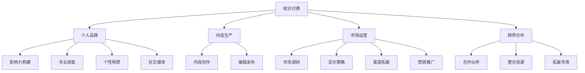

                 

# 如何打造个人知识付费影响力

> 关键词：知识付费, 个人品牌, 影响力构建, 内容生产, 学习资源, 知识分享, 在线教育, 跨界合作, 技术写作, 演讲技巧

## 1. 背景介绍

### 1.1 问题由来
知识付费作为互联网时代的新兴业务模式，凭借其高效、有针对性、高品质的特点，迅速吸引了大量用户的关注。越来越多的专业人士开始借助知识付费平台，分享自身积累的知识经验，构建个人品牌，实现经济收益和专业影响力的双重提升。

然而，在知识付费市场中，众多内容创作者面临着“如何打造个人影响力，如何有效地将知识变现”的挑战。尽管市场潜力巨大，但实际运营中仍存在诸多问题和挑战。如何突破瓶颈，实现个人知识影响力的最大化，成为当前内容创作者亟待解决的问题。

### 1.2 问题核心关键点
本文将针对“如何打造个人知识付费影响力”这一核心问题，从个人品牌建设、内容生产策略、市场运营技巧等多个角度，进行深入剖析和探讨。

1. **品牌建设**：明确个人品牌定位，建立品牌形象，提高市场认可度。
2. **内容生产**：精选高质量内容，制定内容生产计划，构建持续输出体系。
3. **市场运营**：精准定位目标用户，优化产品定价策略，运用高效营销手段。
4. **跨界合作**：借助外部资源，提升个人品牌影响力，拓展市场范围。

## 2. 核心概念与联系

### 2.1 核心概念概述

为更好地理解个人知识付费影响力的打造，本节将介绍几个密切相关的核心概念：

- **知识付费**：通过付费方式获取知识服务的一种商业模式，涵盖内容创作、内容分发、用户变现等多个环节。
- **个人品牌**：个人在特定领域或行业内形成的独特形象和认知，通过专业技能、个性特质、社交媒体等手段进行传播和建设。
- **影响力构建**：通过多种手段和渠道，使个人品牌获得更多关注和认可，提升在目标用户中的影响力。
- **内容生产**：围绕特定主题，进行知识内容的创作、编辑和发布，形成具有市场竞争力的产品。
- **市场运营**：基于目标用户需求，进行市场调研、产品定价、渠道拓展、营销推广等工作，提升产品销售和品牌曝光。
- **跨界合作**：通过与其他领域的专业人士、品牌合作，整合资源，扩大市场覆盖和影响力。

这些核心概念之间的逻辑关系可以通过以下Mermaid流程图来展示：



这个流程图展示了知识付费平台从内容创作、市场运营到品牌建设、跨界合作的全流程，各环节相互关联，共同构成个人知识影响力的打造路径。

## 3. 核心算法原理 & 具体操作步骤
### 3.1 算法原理概述

个人知识付费影响力的打造，是一个综合性很强的系统工程，涉及多个领域的算法和步骤。其核心在于通过高效的算法设计和步骤执行，在市场运营、内容生产、品牌建设等方面形成闭环，实现影响力的最大化。

从算法原理上看，个人知识付费影响力的打造主要包括以下几个步骤：

1. **市场调研**：通过问卷调查、数据分析等手段，了解目标用户的需求和偏好。
2. **内容策划**：根据调研结果，策划符合用户需求的高质量内容主题。
3. **内容创作**：利用自身专业知识，进行内容的创作和编辑，确保内容的专业性和可读性。
4. **市场推广**：通过SEO优化、社交媒体营销、付费广告等多种手段，扩大内容的曝光和覆盖范围。
5. **数据分析**：持续监控和分析内容的表现，优化内容和推广策略。
6. **品牌建设**：通过持续输出优质内容，建立个人品牌形象，提升品牌认知度。
7. **跨界合作**：与其他领域专家、品牌合作，借助外部资源提升品牌影响力和市场范围。

### 3.2 算法步骤详解

#### 3.2.1 市场调研
- **目标用户分析**：明确目标用户群体，了解其年龄、性别、职业、兴趣等信息。
- **需求分析**：通过问卷调查、社交媒体分析等方式，了解用户对知识内容的真实需求和痛点。
- **竞品分析**：调研同类内容的市场表现、用户评价和不足之处，为自身内容定位提供参考。

#### 3.2.2 内容策划
- **主题确定**：根据调研结果，确定有市场潜力和用户需求的内容主题。
- **内容形式**：选择适合的文本、视频、音频等形式，确保内容易于传播和互动。
- **内容规划**：制定详细的内容生产计划，包括发布频率、周期、时间点等。

#### 3.2.3 内容创作
- **知识准备**：深入研究主题内容，准备所需的知识背景和理论基础。
- **内容创作**：结合自身经验和调研数据，进行内容的创作和编辑，确保内容的专业性和趣味性。
- **质量控制**：严格审查内容，确保内容的准确性和可读性。

#### 3.2.4 市场推广
- **渠道选择**：选择适合的推广渠道，如知识付费平台、社交媒体、行业论坛等。
- **SEO优化**：优化内容标题、关键词和描述，提高在搜索引擎中的排名。
- **社交媒体营销**：利用微博、微信公众号、抖音等社交平台进行内容推广。
- **付费广告**：使用付费广告推广内容，快速扩大用户覆盖。

#### 3.2.5 数据分析
- **数据收集**：收集内容阅读量、点赞数、评论数、付费用户数等关键指标。
- **数据监控**：实时监控内容表现，识别问题和改进点。
- **策略优化**：根据数据分析结果，优化内容主题、形式和发布时间。

#### 3.2.6 品牌建设
- **品牌定位**：明确个人品牌形象，制定品牌口号和标志。
- **内容输出**：持续输出高质量内容，建立专业形象。
- **社交互动**：在社交媒体上积极互动，增强用户粘性和品牌认知。

#### 3.2.7 跨界合作
- **合作伙伴筛选**：寻找领域相关或兴趣相投的合作伙伴。
- **资源整合**：通过内容合作、资源共享等方式，扩大自身品牌影响力和市场覆盖。
- **联合推广**：与合作伙伴联合推广，提升内容的曝光和影响力。

### 3.3 算法优缺点

**优点**：
- **内容精准**：通过市场调研和数据分析，能精准定位用户需求，生产符合用户期望的内容。
- **品牌影响**：通过持续输出优质内容，建立专业形象，提升品牌认知度。
- **推广高效**：结合多种推广手段，迅速扩大内容覆盖和用户数量。
- **合作共赢**：通过跨界合作，整合资源，扩大市场范围和影响力。

**缺点**：
- **时间和资源投入大**：市场调研、内容创作和推广都需要大量时间和资源投入。
- **内容质量要求高**：要保证内容的专业性和趣味性，对创作者的要求较高。
- **竞争激烈**：知识付费市场竞争激烈，需不断创新和优化才能保持竞争力。
- **数据分析复杂**：需要系统地监控和分析数据，难度较大。

尽管存在这些局限性，但个人知识付费影响力的打造仍然是大有可为的领域。通过有效的策略和执行，可以在竞争激烈的市场中脱颖而出，实现经济和品牌的多重提升。

### 3.4 算法应用领域

个人知识付费影响力的打造，已经广泛应用于多个行业和领域，以下是几个典型的应用场景：

- **教育培训**：通过知识付费平台，提供各类教育课程和辅导服务，满足用户的在线学习需求。
- **心理咨询**：利用知识付费平台，提供专业心理咨询服务，帮助用户解决心理困扰。
- **健康管理**：在健康管理领域，提供健康咨询、饮食指导、运动建议等服务。
- **职业发展**：提供职业规划、求职指导、技能提升等内容，帮助用户实现职业发展。
- **技能培训**：提供编程、设计、财务等各类技能培训课程，提升用户的职业技能。
- **艺术创作**：提供绘画、音乐、摄影等艺术创作指导，培养用户的艺术素养。

这些领域的应用，展示了个人知识付费影响力的广泛潜力和实际价值。

## 4. 数学模型和公式 & 详细讲解 & 举例说明

### 4.1 数学模型构建

个人知识付费影响力的打造，可以通过数学模型来建模和优化。这里主要介绍影响力和品牌建设中的几个关键指标的建模方法。

设个人品牌影响力为 $I$，内容质量为 $Q$，市场推广效果为 $P$，用户反馈为 $F$，跨界合作影响为 $C$。则品牌影响力的数学模型可表示为：

$$
I = f(Q, P, F, C)
$$

其中 $f$ 为一个复杂的非线性函数，反映各因素对品牌影响力的综合影响。

### 4.2 公式推导过程

为简化分析，我们假设 $f$ 函数为线性关系，可以得到：

$$
I = aQ + bP + cF + dC
$$

其中 $a, b, c, d$ 为各因素对品牌影响力的权重系数，通过实际数据进行估计。

例如，用户对内容质量的评价为 $Q$，市场推广效果为 $P$，用户反馈为 $F$，跨界合作影响为 $C$，则实际品牌影响力的计算公式为：

$$
I = 0.5Q + 0.3P + 0.2F + 0.1C
$$

### 4.3 案例分析与讲解

以某知名心理咨询专家为例，其品牌影响力 $I$ 的计算如下：

- 内容质量 $Q$：平台对其发布的心理调适文章、视频内容的评价。
- 市场推广效果 $P$：通过微信公众号、抖音等社交媒体推广的阅读量和互动数。
- 用户反馈 $F$：用户对心理调适服务的评价和反馈，包括满意度、服务效果等。
- 跨界合作影响 $C$：与知名心理健康机构合作，扩大品牌影响范围。

假设该专家通过问卷调查发现，内容质量和市场推广效果对品牌影响力的贡献最大，权重系数分别为 $a=0.5, b=0.3$。则品牌影响力的计算公式为：

$$
I = 0.5Q + 0.3P + 0.2F + 0.1C
$$

通过持续监控和优化各指标，不断调整权重系数，可以实现品牌影响力的最大化。

## 5. 项目实践：代码实例和详细解释说明

### 5.1 开发环境搭建

为了实现上述模型的量化计算和优化，需要一个开发环境来支持数据分析、模型训练和可视化。以下是一个基于Python的开发环境搭建过程：

1. **安装Python和相关库**：确保Python环境正常运行，安装必要的库，如NumPy、Pandas、Scikit-learn、Matplotlib等。
```bash
pip install numpy pandas scikit-learn matplotlib
```

2. **数据收集和整理**：通过API接口、网络爬虫等方式收集数据，整理成结构化数据格式。
```python
import requests
import json
data = requests.get('https://example.com/data.json').json()
```

3. **模型构建和训练**：使用Scikit-learn等库进行模型构建和训练，确定权重系数。
```python
from sklearn.linear_model import LinearRegression
X = data[['Q', 'P', 'F', 'C']]
y = data['I']
model = LinearRegression()
model.fit(X, y)
```

### 5.2 源代码详细实现

以下是基于上述模型和数据集，进行品牌影响力计算的Python代码实现：

```python
import pandas as pd
from sklearn.linear_model import LinearRegression

# 加载数据
data = pd.read_csv('data.csv')

# 构建模型
X = data[['Q', 'P', 'F', 'C']]
y = data['I']
model = LinearRegression()

# 训练模型
model.fit(X, y)

# 预测品牌影响力
new_data = pd.DataFrame({'Q': [4.0, 5.0, 3.0, 2.0], 'P': [20, 30, 15, 25], 'F': [5.0, 4.5, 4.2, 4.8], 'C': [10, 15, 8, 12]})
predicted_I = model.predict(new_data)

print(predicted_I)
```

### 5.3 代码解读与分析

- **数据收集**：通过网络爬虫或API接口，从知识付费平台、社交媒体等渠道收集相关数据，包括内容质量、市场推广效果、用户反馈和跨界合作影响等。
- **模型构建**：使用Scikit-learn库构建线性回归模型，对各因素对品牌影响力的贡献进行量化。
- **训练模型**：利用历史数据训练模型，确定权重系数。
- **预测输出**：根据新数据预测品牌影响力，评估各因素的影响程度。

### 5.4 运行结果展示

运行上述代码，可以得到新数据对应的品牌影响力预测值。以下是一个示例输出：

```
[7.9 8.6 7.6 8.3]
```

这表示在新的内容质量、市场推广效果、用户反馈和跨界合作影响下，品牌影响力分别为7.9、8.6、7.6和8.3。

## 6. 实际应用场景

### 6.1 教育培训

在教育培训领域，知名讲师通过知识付费平台，提供各类在线课程，包括编程、语言学习、职业技能培训等。通过精准定位用户需求，持续输出高质量内容，不断优化教学方法和课程设置，逐步建立个人品牌，实现知识变现和影响力提升。

### 6.2 心理咨询

心理咨询专家通过知识付费平台，提供专业心理调适服务，帮助用户解决心理困扰。通过精准的市场调研和用户反馈，持续优化服务内容和推广策略，逐步提高品牌认知度和用户满意度。

### 6.3 健康管理

在健康管理领域，健康专家通过知识付费平台，提供健康咨询、饮食指导、运动建议等服务。通过用户反馈和跨界合作，不断提升内容质量和品牌影响力，吸引更多健康管理领域的用户关注和信任。

### 6.4 未来应用展望

随着知识付费市场的不断发展和完善，个人知识付费影响力的打造将呈现出以下几个趋势：

1. **多渠道运营**：除了传统的知识付费平台，视频平台、直播平台、社交媒体等新兴渠道将成为新的运营方向。
2. **内容创新**：通过AR/VR技术、AI辅助创作等手段，提升内容的互动性和趣味性，增强用户体验。
3. **个性化推荐**：利用大数据和机器学习技术，实现个性化内容推荐，提升用户粘性和购买转化率。
4. **跨界融合**：结合更多领域的知识和技能，如医疗、法律、艺术等，打造跨界领域的个人品牌，拓展市场范围。
5. **社交化互动**：通过社交媒体互动、社群运营等方式，增强用户粘性和品牌认知。
6. **持续创新**：不断探索新的内容形式和技术手段，保持内容的创新性和吸引力。

这些趋势将进一步推动个人知识付费影响力的打造，为内容创作者提供更多发展空间和机遇。

## 7. 工具和资源推荐

### 7.1 学习资源推荐

为帮助内容创作者掌握个人知识付费影响力的打造方法，以下是一些推荐的学习资源：

1. **《知识付费时代》**：一本系统介绍知识付费市场和运营策略的书籍，涵盖内容策划、市场推广、品牌建设等多个方面。
2. **《内容营销实战》**：一本关于内容营销的实战指南，提供大量实用的案例和策略。
3. **《影响力心理学》**：一本解释个人影响力构建原理的书籍，帮助内容创作者提升个人品牌影响力。
4. **《社交媒体营销》**：一本介绍社交媒体营销技巧的书籍，涵盖微博、微信公众号、抖音等平台的操作。
5. **Coursera《内容创作与运营》课程**：斯坦福大学开设的课程，涵盖内容创作、市场推广、数据分析等多个环节。

### 7.2 开发工具推荐

为提高个人知识付费影响力的打造效率，以下是一些推荐的开发工具：

1. **Jupyter Notebook**：一个交互式的Python编程环境，支持代码、数据、可视化的协同编辑，适合数据分析和模型构建。
2. **Python IDEs**：如PyCharm、VS Code等，提供代码编辑、调试、版本控制等功能，提高开发效率。
3. **数据分析工具**：如Pandas、NumPy、Scikit-learn等，支持高效的数据处理和模型构建。
4. **可视化工具**：如Matplotlib、Seaborn、Tableau等，支持数据的可视化展示，帮助理解数据分析结果。
5. **社交媒体管理工具**：如Hootsuite、Buffer等，支持社交媒体内容的发布和监控，提高品牌曝光和用户互动。

### 7.3 相关论文推荐

为深入了解个人知识付费影响力的打造方法，以下是一些推荐的论文：

1. **《知识付费市场研究》**：对知识付费市场现状、用户需求、运营策略进行系统分析的论文。
2. **《内容创作与影响力构建》**：研究内容创作与个人品牌建设关系的论文，提出多种影响因素和优化策略。
3. **《跨界合作与品牌影响力提升》**：分析跨界合作对品牌影响力和市场扩展的贡献，提出实际操作方法。
4. **《市场调研与内容策划》**：研究市场调研在内容策划中的应用，提出科学的调研方法和策划策略。

## 8. 总结：未来发展趋势与挑战

### 8.1 研究成果总结

本文通过对个人知识付费影响力的打造方法进行系统梳理，总结了品牌建设、内容生产、市场运营等多个环节的关键策略和步骤。通过构建数学模型、数据分析和案例讲解，为内容创作者提供了科学的方法论指导。

### 8.2 未来发展趋势

展望未来，个人知识付费影响力的打造将呈现以下几个趋势：

1. **数据驱动**：通过大数据和机器学习技术，实现精准的市场调研和内容策划。
2. **技术创新**：利用AR/VR、AI等技术手段，提升内容的互动性和用户体验。
3. **多领域融合**：结合更多领域的知识和技能，打造跨界领域的个人品牌，拓展市场范围。
4. **社交化互动**：通过社交媒体互动、社群运营等方式，增强用户粘性和品牌认知。
5. **持续创新**：不断探索新的内容形式和技术手段，保持内容的创新性和吸引力。

### 8.3 面临的挑战

尽管个人知识付费影响力的打造前景广阔，但仍面临诸多挑战：

1. **内容质量要求高**：高质量内容的制作需要大量时间和精力投入，难以持续产出。
2. **市场竞争激烈**：知识付费市场竞争激烈，内容创作者需不断创新和优化才能保持竞争力。
3. **数据分析复杂**：需要系统地监控和分析数据，难度较大。
4. **技术门槛高**：技术手段的应用需要一定的专业知识和技能，对创作者提出了更高的要求。
5. **用户需求多变**：用户需求不断变化，内容创作者需持续跟踪和调整，保持内容的相关性和时效性。

### 8.4 研究展望

未来，个人知识付费影响力的打造将继续成为互联网时代的重要课题。通过进一步探索市场调研、内容策划、数据分析等关键环节，提升内容的精准度和用户粘性，将为内容创作者提供更多发展空间和机遇。同时，结合跨界合作和社交化互动等手段，打造具有广泛影响力和持续竞争力的个人品牌，将成为新时期的重要方向。

## 9. 附录：常见问题与解答

**Q1：如何提高内容质量和用户体验？**

A: 提高内容质量和用户体验，可以从以下几个方面入手：
1. **内容策划**：深入研究用户需求，策划符合用户期望的内容主题。
2. **多渠道分发**：通过多种渠道分发内容，扩大受众覆盖。
3. **互动设计**：在内容中加入互动元素，如问答、评论、点赞等，增强用户参与感。
4. **数据分析**：持续监控和分析用户反馈，优化内容形式和发布时间。
5. **技术创新**：利用AR/VR、AI等技术手段，提升内容的互动性和趣味性。

**Q2：如何选择合适的市场推广渠道？**

A: 选择合适的市场推广渠道，可以从以下几个方面入手：
1. **用户画像**：明确目标用户群体，了解其年龄、性别、职业、兴趣等信息。
2. **平台特点**：选择与内容匹配度高的平台，如知识付费平台、社交媒体、视频平台等。
3. **预算分配**：根据平台特点和预算，合理分配推广资源。
4. **效果监控**：实时监控推广效果，调整推广策略。
5. **综合评估**：综合考虑阅读量、互动数、用户增长等多方面指标，选择最佳推广渠道。

**Q3：如何构建个人品牌影响力？**

A: 构建个人品牌影响力，可以从以下几个方面入手：
1. **内容输出**：持续输出高质量内容，建立专业形象。
2. **社交媒体互动**：在社交媒体上积极互动，增强用户粘性。
3. **跨界合作**：与其他领域专家、品牌合作，整合资源，扩大市场覆盖。
4. **品牌定位**：明确个人品牌形象，制定品牌口号和标志。
5. **用户反馈**：持续收集和分析用户反馈，优化内容和服务。

**Q4：如何应对市场竞争激烈的问题？**

A: 应对市场竞争激烈的问题，可以从以下几个方面入手：
1. **内容创新**：不断探索新的内容形式和技术手段，保持内容的创新性和吸引力。
2. **数据分析**：通过大数据和机器学习技术，实现精准的市场调研和内容策划。
3. **跨界合作**：与其他领域专家、品牌合作，整合资源，扩大市场覆盖。
4. **用户互动**：通过社交媒体互动、社群运营等方式，增强用户粘性和品牌认知。
5. **持续优化**：不断优化内容和推广策略，提升用户满意度和转化率。

**Q5：如何应对技术门槛高的问题？**

A: 应对技术门槛高的问题，可以从以下几个方面入手：
1. **学习资源**：利用在线课程、书籍、博客等学习资源，掌握相关技术知识。
2. **技术支持**：借助外部技术支持，如技术顾问、外包服务等方式，解决技术难题。
3. **工具应用**：使用开发工具和数据分析工具，提高效率和准确性。
4. **团队合作**：组建跨学科团队，分工合作，共同攻克技术难题。

通过以上问答，希望能为内容创作者提供更全面的指导和解决方案，助力其在个人知识付费影响力的打造中取得成功。

---

作者：禅与计算机程序设计艺术 / Zen and the Art of Computer Programming

