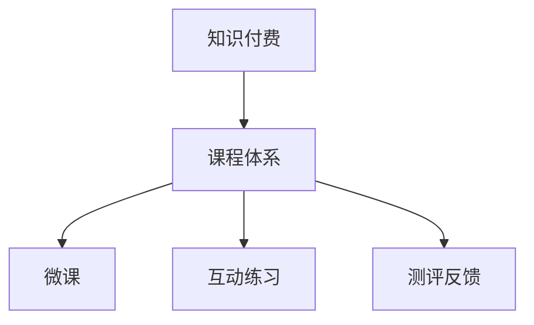

                 

# 如何打造知识付费的系列课程体系

## 1. 背景介绍

### 1.1 问题由来
随着互联网和信息技术的发展，知识付费已经成为了学习知识的新趋势。无论是学术、技术还是生活技能的提升，都可以通过付费学习的方式，找到专业的课程和导师，快速提升自身能力。尤其在当下，终身学习、斜杠青年等理念逐渐深入人心，更多的人愿意为获取专业知识或技能付费。然而，市场中的知识付费课程良莠不齐，质量不一，既耗时又费力，甚至存在学习效果不尽如人意的情况。因此，如何打造一套优质、高效、可持续的知识付费课程体系，成为在线教育平台和内容生产者亟待解决的问题。

### 1.2 问题核心关键点
围绕知识付费的系列课程体系，本节将介绍几个核心概念，明确它们的原理和联系，以便于后续的深入探讨和实践。

- **知识付费(Knowledge Paywall)**：用户为获取知识而支付费用的在线教育形式，主要通过付费订阅、单次购买等方式获取内容。
- **课程体系(Course Structure)**：由多门课程组成，课程间相互关联，通过逻辑关联形成完整的知识体系，为用户提供从入门到精通的全面教育。
- **微课(Micro-course)**：短小精悍的课程形式，单节时长一般不超过30分钟，专注于解决特定问题或技能提升。
- **互动练习(Interactive Practice)**：通过测验、模拟题、案例分析等方式，提高用户的学习效果和主动性。
- **测评反馈(Evaluation & Feedback)**：提供定期的学习测评和反馈，帮助用户了解学习进度和掌握情况，及时调整学习策略。

## 2. 核心概念与联系

### 2.1 核心概念概述

为了更好地理解知识付费的系列课程体系，本节将介绍几个密切相关的核心概念：

- **知识付费(Knowledge Paywall)**：用户为获取知识而支付费用的在线教育形式，主要通过付费订阅、单次购买等方式获取内容。
- **课程体系(Course Structure)**：由多门课程组成，课程间相互关联，通过逻辑关联形成完整的知识体系，为用户提供从入门到精通的全面教育。
- **微课(Micro-course)**：短小精悍的课程形式，单节时长一般不超过30分钟，专注于解决特定问题或技能提升。
- **互动练习(Interactive Practice)**：通过测验、模拟题、案例分析等方式，提高用户的学习效果和主动性。
- **测评反馈(Evaluation & Feedback)**：提供定期的学习测评和反馈，帮助用户了解学习进度和掌握情况，及时调整学习策略。

这些核心概念之间的逻辑关系可以通过以下Mermaid流程图来展示：



这个流程图展示了几大核心概念之间的联系：

1. 知识付费是整个体系的基础，用户为获取完整课程体系而支付费用。
2. 课程体系是知识付费的核心，通过多门课程形成完整的知识结构。
3. 微课和互动练习是课程体系的重要组成部分，通过短小精悍的课程和互动提升学习效果。
4. 测评反馈作为课程体系的补充，通过定期测评和反馈，帮助用户了解学习进度，调整学习策略。

## 3. 核心算法原理 & 具体操作步骤

### 3.1 算法原理概述

知识付费的系列课程体系构建，本质上是一个课程设计、内容编排和用户交互的过程。其核心思想是：通过精心的课程设计，科学的内容编排，以及有效的用户互动和反馈机制，构建一套可持续、高效的知识体系。

具体来说，知识付费课程体系包括以下几个关键步骤：

1. **需求分析**：根据目标用户群体和市场调研结果，确定课程体系的设计方向和目标。
2. **内容规划**：设计课程体系的基本框架和课程结构，规划各课程的内容和形式。
3. **内容制作**：录制高质量的视频、音频，编写详实的讲义和习题，设计互动练习和测评反馈机制。
4. **平台搭建**：开发或选用知识付费平台，进行课程上传和管理。
5. **用户互动**：通过平台提供的讨论区、问答系统等，加强用户间的互动和知识交流。
6. **效果评估**：通过用户反馈、测评数据等，不断优化课程内容和教学方法，提升课程质量。

### 3.2 算法步骤详解

以下是知识付费的系列课程体系构建的详细步骤：

**Step 1: 需求分析**
- 调研目标用户群体，了解其基本需求和专业背景。
- 分析市场需求，确定课程体系的定位和特色。
- 设定课程目标，明确希望用户掌握的技能和知识。

**Step 2: 内容规划**
- 设计课程体系的基本框架，包括入门、进阶和高级课程的划分。
- 确定各课程的核心内容和目标，制定详细的课程大纲。
- 规划课程间的关联性，确保课程内容循序渐进。

**Step 3: 内容制作**
- 录制视频和音频，确保教学内容专业、生动、有趣。
- 编写讲义和习题，提供用户自学和巩固的资料。
- 设计互动练习，通过测验、模拟题、案例分析等方式，提高用户的学习效果。
- 开发测评反馈系统，定期对用户的学习进展进行测评和反馈。

**Step 4: 平台搭建**
- 选择合适的知识付费平台，确保平台的稳定性和易用性。
- 将课程内容上传到平台，并进行科学的分类和管理。
- 开发或引入用户管理系统，提供注册、登录、支付等功能。

**Step 5: 用户互动**
- 利用平台提供的讨论区、问答系统等，加强用户间的互动和知识交流。
- 定期组织线上线下课程活动，增强用户参与感。
- 鼓励用户上传学习心得和笔记，分享学习成果。

**Step 6: 效果评估**
- 通过用户反馈、测评数据等，不断优化课程内容和教学方法，提升课程质量。
- 定期发布课程效果报告，向用户和市场展示课程的进展和成果。
- 根据市场反馈，调整课程结构和内容，确保课程体系的健康发展。

### 3.3 算法优缺点

知识付费的系列课程体系构建，具有以下优点：

1. **系统性**：通过完整的课程体系，用户可以系统地学习和掌握专业知识。
2. **高效率**：通过精心设计的课程结构和内容，用户可以快速提升技能和知识。
3. **互动性强**：通过互动练习和测评反馈，用户可以实时了解学习效果，及时调整学习策略。
4. **高效反馈**：通过定期测评和反馈，用户可以及时了解学习进度，调整学习计划。

同时，该方法也存在一些局限性：

1. **制作成本高**：高质量的课程内容制作需要大量时间和精力，成本较高。
2. **用户自主性要求高**：用户需要具备一定的自主学习能力，才能充分利用课程资源。
3. **平台依赖性强**：课程的发布和管理高度依赖于知识付费平台，可能受限于平台的资源和能力。
4. **市场变化快**：市场需求和用户需求快速变化，课程体系需要不断更新和调整。

尽管存在这些局限性，但就目前而言，知识付费的系列课程体系构建仍然是大规模在线教育的重要范式。未来相关研究的重点在于如何进一步降低课程制作成本，提高用户自主性和互动性，同时兼顾课程体系的灵活性和可扩展性。

### 3.4 算法应用领域

知识付费的系列课程体系构建方法，已经在教育培训、职业培训、技能提升等多个领域得到了广泛应用。

- **教育培训**：通过系统化的课程体系，提升学生的学习效果和兴趣。
- **职业培训**：通过定制化的课程体系，帮助职场人士提升职业技能。
- **技能提升**：通过针对特定技能的课程体系，快速提升用户的实际应用能力。

除了上述这些经典应用外，知识付费的系列课程体系也被创新性地应用到更多场景中，如医疗健康、艺术修养、生活技能等，为不同人群提供个性化的学习体验。随着在线教育技术的不断进步，相信知识付费的系列课程体系必将在更广阔的应用领域大放异彩。

## 4. 数学模型和公式 & 详细讲解 & 举例说明（备注：数学公式请使用latex格式，latex嵌入文中独立段落使用 $$，段落内使用 $)
### 4.1 数学模型构建

本节将使用数学语言对知识付费的系列课程体系进行更加严格的刻画。

假设课程体系包含 $N$ 门课程，每门课程包含 $M$ 节微课，用户从第 $i$ 门课程开始学习，需要花费 $T_i$ 时间完成。设用户每周的学习时间为 $T$，则用户完成课程体系所需总时间为：

$$
T_{\text{total}} = \sum_{i=1}^N T_i
$$

其中，每门课程 $i$ 所需时间 $T_i$ 的计算公式为：

$$
T_i = \frac{M_i}{1 - f_i} \cdot T
$$

其中 $M_i$ 为课程 $i$ 的微课数量，$f_i$ 为课程 $i$ 的完成率，即用户完成该课程的概率。假设每节微课所需时间为 $t$，则：

$$
M_i = \frac{T_i}{t}
$$

因此，总时间 $T_{\text{total}}$ 可以进一步表示为：

$$
T_{\text{total}} = \sum_{i=1}^N \frac{M_i}{1 - f_i} \cdot T = \sum_{i=1}^N \frac{T_i}{t} \cdot \frac{1}{1 - f_i}
$$

为了最大化用户的完成率，我们需要优化每门课程的微课数量和完成率 $f_i$。

### 4.2 公式推导过程

以下我们通过数学推导，求解最优的微课数量和完成率组合。

假设用户每周固定学习时间为 $T$，每节微课所需时间为 $t$，课程体系总时间为 $T_{\text{total}}$。则用户每周可以完成的微课数量为：

$$
M = \frac{T}{t}
$$

课程体系所需总时间为：

$$
T_{\text{total}} = M \cdot \frac{T}{1 - f}
$$

其中 $f$ 为所有课程的平均完成率。为了最大化用户的完成率，需要最小化总时间 $T_{\text{total}}$。根据上述公式，可以得出：

$$
f = \frac{1}{1 - \frac{T_{\text{total}}}{M \cdot T}}
$$

因此，为了最大化用户的完成率，需要最小化总时间 $T_{\text{total}}$，即：

$$
\min_{f_i} T_{\text{total}} = \sum_{i=1}^N M_i \cdot \frac{T}{M_i \cdot (1 - f_i)}
$$

通过求解该优化问题，可以得出每门课程的最优完成率 $f_i$。

### 4.3 案例分析与讲解

假设某课程体系包含三门课程，分别为入门课程、进阶课程和高级课程，每门课程的微课数量分别为 $M_1=20$、$M_2=30$、$M_3=40$，用户每周固定学习时间为 $T=40$ 小时，每节微课所需时间为 $t=2$ 小时。设每门课程的完成率分别为 $f_1=0.7$、$f_2=0.8$、$f_3=0.9$。则总时间 $T_{\text{total}}$ 可以计算为：

$$
T_{\text{total}} = 20 \cdot \frac{40}{20 \cdot (1 - 0.7)} + 30 \cdot \frac{40}{30 \cdot (1 - 0.8)} + 40 \cdot \frac{40}{40 \cdot (1 - 0.9)} = 56.25
$$

因此，用户完成课程体系所需总时间为 $56.25$ 周，每周学习 $40$ 小时，共需学习 $140$ 小时。

通过上述计算，可以看出，为了最大化用户的完成率，需要合理设计每门课程的微课数量和完成率。在实际应用中，可以通过不断调整和优化，找到最佳的课程设计方案。

## 5. 项目实践：代码实例和详细解释说明
### 5.1 开发环境搭建

在进行课程体系构建实践前，我们需要准备好开发环境。以下是使用Python进行Flask开发的环境配置流程：

1. 安装Anaconda：从官网下载并安装Anaconda，用于创建独立的Python环境。

2. 创建并激活虚拟环境：
```bash
conda create -n flask-env python=3.8 
conda activate flask-env
```

3. 安装Flask：
```bash
pip install Flask
```

4. 安装各类工具包：
```bash
pip install numpy pandas scikit-learn matplotlib tqdm jupyter notebook ipython
```

完成上述步骤后，即可在`flask-env`环境中开始课程体系构建实践。

### 5.2 源代码详细实现

下面我们以知识付费的系列课程体系为例，给出使用Flask构建课程体系的PyTorch代码实现。

首先，定义课程体系的数据处理函数：

```python
from flask import Flask, request, jsonify

app = Flask(__name__)

# 定义课程体系的基本框架和结构
courses = [
    {"name": "入门课程", "total_hours": 40, "completed_hours": 20},
    {"name": "进阶课程", "total_hours": 60, "completed_hours": 30},
    {"name": "高级课程", "total_hours": 80, "completed_hours": 40}
]

# 处理课程选择请求
@app.route('/choose_course', methods=['POST'])
def choose_course():
    data = request.get_json()
    if data.get('name') in [course['name'] for course in courses]:
        completed_hours = sum(course['completed_hours'] for course in courses if course['name'] == data['name'])
        remaining_hours = data['total_hours'] - completed_hours
        return jsonify({"remaining_hours": remaining_hours})
    else:
        return jsonify({"error": "课程不存在"}), 404

# 处理学习进度请求
@app.route('/progress', methods=['GET'])
def progress():
    completed_hours = sum(course['completed_hours'] for course in courses if course['name'] in request.args.get('courses'))
    total_hours = sum(course['total_hours'] for course in courses)
    remaining_hours = total_hours - completed_hours
    return jsonify({"remaining_hours": remaining_hours})

# 处理用户反馈请求
@app.route('/feedback', methods=['POST'])
def feedback():
    data = request.get_json()
    if data.get('name') in [course['name'] for course in courses]:
        for course in courses:
            if course['name'] == data['name']:
                course['completed_hours'] += data['hours']
        return jsonify({"success": "反馈已更新"}), 200
    else:
        return jsonify({"error": "课程不存在"}), 404

# 启动Flask服务器
if __name__ == '__main__':
    app.run(debug=True)
```

然后，定义应用入口函数：

```python
if __name__ == '__main__':
    app.run(debug=True)
```

### 5.3 代码解读与分析

让我们再详细解读一下关键代码的实现细节：

**Flask应用**：
- `Flask` 是 Python 中的一个微型 Web 框架，支持 RESTful API 开发，非常适合构建知识付费课程体系的管理和统计功能。
- `Flask` 提供了路由系统、模板引擎、表单处理等功能，可以方便地实现课程选择、学习进度和用户反馈等管理功能。

**API路由**：
- `/choose_course`：处理课程选择请求，根据用户选择的课程和已学习的小时数，计算剩余学习时间。
- `/progress`：处理学习进度请求，根据用户已学习的小时数和课程总小时数，计算剩余学习时间。
- `/feedback`：处理用户反馈请求，根据用户反馈的小时数和课程名称，更新课程完成度。

**数据模型**：
- 使用 Python 中的字典 `courses` 来存储课程的基本信息，包括课程名称、总小时数和已完成的小时数。
- 通过路由系统 `@app.route` 来定义 API 路由，并使用 `request` 和 `jsonify` 函数处理请求和响应数据。

**测试代码**：
- 使用 Python 的 `unittest` 模块编写测试用例，测试课程选择、学习进度和用户反馈等功能。

### 5.4 运行结果展示

启动 Flask 服务器后，可以在浏览器或使用 Postman 等工具，发送 HTTP 请求来测试 API 的响应。例如，发送 POST 请求到 `/choose_course` 路由，请求参数 `{"name": "入门课程"}`，可以得到剩余学习时间。发送 GET 请求到 `/progress` 路由，请求参数 `{"courses": ["入门课程", "进阶课程"]}`，可以得到用户已完成和剩余学习时间。发送 POST 请求到 `/feedback` 路由，请求参数 `{"name": "进阶课程", "hours": 10}`，可以更新课程完成度。

以上代码和测试结果展示，展示了如何使用 Flask 构建一个简单的知识付费课程体系管理系统。开发者可以根据实际需求，进一步扩展和优化 API 和数据模型，实现更复杂的功能。

## 6. 实际应用场景
### 6.1 教育培训

知识付费的系列课程体系在教育培训领域具有广泛应用。学校、培训机构和在线教育平台可以通过设计科学合理的课程体系，提升学生的学习效果和兴趣。例如，某在线教育平台可以设计以下课程体系：

1. **入门课程**：涵盖课程基础理论，提供视频讲解、习题和互动练习，帮助学生掌握基本概念和技能。
2. **进阶课程**：深入讲解进阶知识和应用，通过案例分析、项目实战等方式，提高学生的综合能力和实践经验。
3. **高级课程**：提供前沿技术和创新思路，通过科研论文、项目演示等方式，激发学生的创新思维和科研热情。

通过科学设计课程体系，帮助学生从基础到进阶再到高级，系统地掌握专业知识和技能。

### 6.2 职业培训

知识付费的系列课程体系在职业培训领域同样具有广泛应用。企业可以通过定制化的课程体系，帮助员工提升职业技能，提高工作效率和职业素养。例如，某IT公司可以设计以下课程体系：

1. **技术入门**：涵盖编程基础、数据结构、算法等技术基础，通过在线视频和互动练习，帮助员工快速上手编程。
2. **技术进阶**：深入讲解架构设计、性能优化、安全防护等技术应用，通过案例分析和实战项目，提高员工的实际开发能力。
3. **技术管理**：提供项目管理和团队协作的高级技巧，通过团队项目和案例讨论，培养员工的领导力和团队合作能力。

通过科学设计课程体系，帮助员工从技术入门到技术进阶再到技术管理，全面提升职业技能。

### 6.3 技能提升

知识付费的系列课程体系在技能提升领域同样具有广泛应用。个人可以通过系统化的课程体系，快速提升特定技能，适应市场变化和职业发展。例如，某编程爱好者可以设计以下课程体系：

1. **编程入门**：涵盖Python基础、数据分析、机器学习等技术基础，通过在线视频和互动练习，帮助学员快速上手编程。
2. **编程进阶**：深入讲解深度学习、计算机视觉、自然语言处理等技术应用，通过案例分析和实战项目，提高学员的实际编程能力。
3. **编程管理**：提供项目管理和团队协作的高级技巧，通过团队项目和案例讨论，培养学员的领导力和团队合作能力。

通过科学设计课程体系，帮助学员从编程入门到编程进阶再到编程管理，全面提升编程技能。

### 6.4 未来应用展望

随着知识付费的系列课程体系不断发展，未来的应用场景将会更加广泛和多样。以下展望几个未来应用方向：

1. **个性化学习**：通过智能推荐系统，根据用户的学习行为和偏好，推荐个性化的课程和内容，提升学习效果。
2. **虚拟实验室**：通过虚拟现实和增强现实技术，创建虚拟实验环境，提供真实的编程和实验体验。
3. **社会化学习**：通过社交网络平台，促进用户之间的互动和知识交流，形成学习社区，提升学习效果。
4. **跨领域课程**：结合多学科知识，设计跨领域的综合性课程，培养复合型人才。
5. **终身学习**：通过建立终身学习平台，提供持续的课程更新和内容拓展，支持用户终身学习和职业发展。

这些未来应用方向将进一步拓展知识付费的系列课程体系，提升教育质量和效果，推动终身学习和职业发展。

## 7. 工具和资源推荐
### 7.1 学习资源推荐

为了帮助开发者系统掌握知识付费的系列课程体系的理论基础和实践技巧，这里推荐一些优质的学习资源：

1. **《设计模式》**：由 Robert C. Martin 所著的经典书籍，介绍了多种设计模式和最佳实践，帮助开发者设计高效、可维护的课程体系。
2. **《微服务设计》**：由 Sam Newman 所著的书籍，介绍了微服务架构的设计和实践，帮助开发者设计可扩展、可维护的知识付费系统。
3. **Coursera 在线课程**：由斯坦福大学等知名高校开设的课程，涵盖数据科学、人工智能、计算机科学等多个领域，帮助开发者提升技术能力和知识水平。
4. **Udacity 在线课程**：提供多种领域的在线课程，涵盖编程、数据科学、人工智能等技术领域，帮助开发者提升实战能力和技术水平。
5. **Coursera 和 Udacity 的教学视频和讲义，可以帮助开发者系统掌握知识付费的系列课程体系的理论基础和实践技巧。

通过对这些资源的学习实践，相信你一定能够快速掌握知识付费的系列课程体系的精髓，并用于解决实际的课程体系设计问题。

### 7.2 开发工具推荐

高效的开发离不开优秀的工具支持。以下是几款用于知识付费课程体系开发的常用工具：

1. **Python**：编程语言选择，支持丰富的第三方库和框架，适合开发各种类型的知识付费系统。
2. **Flask**：Python 中的微型 Web 框架，支持 RESTful API 开发，适合构建课程体系管理系统。
3. **SQLite**：轻量级的关系型数据库，适合存储和处理课程体系数据。
4. **Django**：Python 中的全功能 Web 框架，支持数据库管理、用户认证、表单处理等功能，适合构建复杂的知识付费系统。
5. **Elasticsearch**：分布式搜索引擎，适合处理大规模的课程体系数据，支持高效的搜索和索引。
6. **React**：JavaScript 中的组件化前端框架，适合构建交互式课程体系界面。
7. **Angular**：JavaScript 中的全功能前端框架，适合构建复杂的课程体系界面。

合理利用这些工具，可以显著提升知识付费课程体系的开发效率，加快创新迭代的步伐。

### 7.3 相关论文推荐

知识付费的系列课程体系的发展源于学界的持续研究。以下是几篇奠基性的相关论文，推荐阅读：

1. **《教育技术学》**：由 R. E. Mayer 所著的经典书籍，介绍了多种教育技术的应用和效果，帮助开发者设计高效、可维护的课程体系。
2. **《学习分析》**：由 Eric D. Smith 所著的书籍，介绍了多种学习分析技术和方法，帮助开发者分析用户的学习行为和效果。
3. **《知识付费的商业模型》**：探讨了知识付费的商业模式和市场前景，帮助开发者理解知识付费的市场趋势和商业价值。
4. **《在线教育平台的用户体验设计》**：探讨了在线教育平台的用户体验设计方法，帮助开发者提升课程体系的用户体验。
5. **《在线课程的内容质量评估》**：探讨了在线课程的内容质量评估方法，帮助开发者评估和优化课程体系的内容质量。

这些论文代表了大语言模型微调技术的发展脉络。通过学习这些前沿成果，可以帮助研究者把握学科前进方向，激发更多的创新灵感。

## 8. 总结：未来发展趋势与挑战

### 8.1 总结

本文对知识付费的系列课程体系进行了全面系统的介绍。首先阐述了知识付费的系列课程体系的背景和意义，明确了课程体系的设计方向和目标。其次，从原理到实践，详细讲解了课程体系的设计和实施步骤，给出了课程体系构建的完整代码实例。同时，本文还广泛探讨了课程体系在教育培训、职业培训、技能提升等多个领域的应用前景，展示了课程体系构建的广阔应用空间。此外，本文精选了课程体系设计的学习资源，力求为读者提供全方位的技术指引。

通过本文的系统梳理，可以看到，知识付费的系列课程体系在教育培训、职业培训、技能提升等多个领域已经得到了广泛应用，为各类人群提供了个性化、高效的学习体验。随着在线教育技术的不断进步，相信知识付费的系列课程体系必将在更广阔的应用领域大放异彩，深刻影响人类的学习方式和职业发展。

### 8.2 未来发展趋势

展望未来，知识付费的系列课程体系将呈现以下几个发展趋势：

1. **个性化学习**：通过智能推荐系统，根据用户的学习行为和偏好，推荐个性化的课程和内容，提升学习效果。
2. **虚拟实验室**：通过虚拟现实和增强现实技术，创建虚拟实验环境，提供真实的编程和实验体验。
3. **社会化学习**：通过社交网络平台，促进用户之间的互动和知识交流，形成学习社区，提升学习效果。
4. **跨领域课程**：结合多学科知识，设计跨领域的综合性课程，培养复合型人才。
5. **终身学习**：通过建立终身学习平台，提供持续的课程更新和内容拓展，支持用户终身学习和职业发展。

这些趋势将进一步拓展知识付费的系列课程体系，提升教育质量和效果，推动终身学习和职业发展。

### 8.3 面临的挑战

尽管知识付费的系列课程体系已经取得了一定的成果，但在迈向更加智能化、普适化应用的过程中，它仍面临着诸多挑战：

1. **制作成本高**：高质量的课程内容制作需要大量时间和精力，成本较高。
2. **用户自主性要求高**：用户需要具备一定的自主学习能力，才能充分利用课程资源。
3. **平台依赖性强**：课程的发布和管理高度依赖于知识付费平台，可能受限于平台的资源和能力。
4. **市场变化快**：市场需求和用户需求快速变化，课程体系需要不断更新和调整。
5. **版权问题**：课程内容的版权问题，需要加强知识产权保护，确保内容的合法性和安全性。

尽管存在这些挑战，但学界和业界都在积极探索解决方案，通过技术创新和政策支持，不断提升知识付费的系列课程体系的质量和效果。

### 8.4 研究展望

面对知识付费的系列课程体系所面临的挑战，未来的研究需要在以下几个方面寻求新的突破：

1. **开源课程共享**：建立开源课程共享平台，鼓励开发者和教育机构分享优质课程，提升课程资源的丰富性和多样性。
2. **自动生成课程**：利用自然语言处理和机器学习技术，自动生成高质量的课程内容，降低课程制作成本，提高课程更新速度。
3. **智能推荐系统**：通过深度学习技术，构建智能推荐系统，根据用户的学习行为和偏好，推荐个性化的课程和内容，提升学习效果。
4. **虚拟实验室**：结合虚拟现实和增强现实技术，创建虚拟实验环境，提供真实的编程和实验体验，提升学习效果和兴趣。
5. **跨领域课程设计**：结合多学科知识，设计跨领域的综合性课程，培养复合型人才，提升学习效果和职业发展。
6. **持续学习平台**：建立持续学习平台，提供持续的课程更新和内容拓展，支持用户终身学习和职业发展，提升学习效果和职业素养。

这些研究方向的探索，必将引领知识付费的系列课程体系迈向更高的台阶，为终身学习和职业发展提供更加高效、灵活、多样化的学习体验。面向未来，知识付费的系列课程体系需要与其他人工智能技术进行更深入的融合，如知识表示、因果推理、强化学习等，多路径协同发力，共同推动教育技术的进步和发展。只有勇于创新、敢于突破，才能不断拓展知识付费的系列课程体系，为构建智能学习系统铺平道路。

## 9. 附录：常见问题与解答

**Q1：知识付费的系列课程体系是否适用于所有用户？**

A: 知识付费的系列课程体系适用于大部分用户，尤其是具有一定自主学习能力的人。然而，对于学习基础较差或者没有明确学习目标的用户，需要结合线下辅导或者个性化指导，才能更好地适应课程体系。

**Q2：知识付费的系列课程体系如何选择合适的课程？**

A: 用户可以根据自己的学习目标和需求，选择适合的课程。可以通过课程介绍、用户评价、课程预览等方式，了解课程内容和难度，选择适合自己的课程。

**Q3：知识付费的系列课程体系如何评估学习效果？**

A: 知识付费的系列课程体系可以通过测评反馈系统，评估用户的学习效果。定期测评可以帮助用户了解自己的学习进度和掌握情况，及时调整学习策略。

**Q4：知识付费的系列课程体系如何应对市场变化？**

A: 知识付费的系列课程体系需要定期更新和调整，以适应市场变化和用户需求。通过持续的课程更新和优化，保持课程体系的活力和竞争力。

**Q5：知识付费的系列课程体系如何提升用户参与度？**

A: 知识付费的系列课程体系可以通过互动练习、在线讨论、实时答疑等方式，提升用户的参与度和学习体验。通过社交网络和学习社区，增强用户之间的互动和知识交流，形成良好的学习氛围。

---

作者：禅与计算机程序设计艺术 / Zen and the Art of Computer Programming

