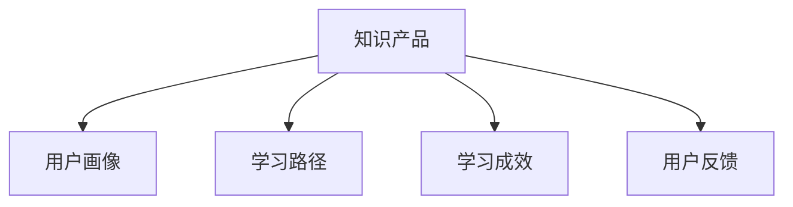

                 

# 如何打造高复购率的程序员知识产品

## 1. 背景介绍

### 1.1 问题由来

在当前数字化时代，程序员面临着快速变化的技术栈和不断更新的知识需求。然而，优秀的技术类书籍、培训课程和在线学习资源虽然繁多，却鲜少有能持续吸引用户复购的产品。究其原因，主要在于以下几个方面：

- **知识过时**：技术更新日新月异，很多知识产品内容很快变得陈旧。
- **内容浅显**：部分产品重理论轻实践，难以帮助读者解决实际问题。
- **互动不足**：传统学习方式多是单向输出，缺少互动和反馈机制，难以激发学习热情。
- **难以坚持**：长时间的学习需要有效的激励机制和灵活的学习路径，否则容易半途而废。

本博客将探讨如何打造一款能吸引程序员长期复购的高质量知识产品，围绕知识产品持续迭代和升级的完整流程。

### 1.2 问题核心关键点

高复购率的程序员知识产品需满足以下核心关键点：

- **紧贴技术前沿**：持续跟踪最新技术动态，保持知识的时效性和前瞻性。
- **重实践轻理论**：内容设计注重实操和案例分析，帮助读者解决实际问题。
- **高度互动性**：提供社群交流、问题答疑和持续反馈机制，提升学习效果。
- **灵活学习路径**：根据读者需求和进展，提供个性化的学习路线和课程推荐。

## 2. 核心概念与联系

### 2.1 核心概念概述

为了更好地理解如何打造高复购率的程序员知识产品，本节将介绍几个核心概念：

- **知识产品(Knowledge Product)**：如在线课程、书籍、视频教程等，旨在通过知识传递和技能培训帮助用户提升能力。
- **用户画像(User Persona)**：描述产品目标用户群体的特征、需求和行为模式。
- **学习路径(Learning Path)**：根据用户不同层次和需求，设计的系统化的学习内容框架。
- **学习成效(Evaluation Metrics)**：评估用户学习效果的指标，如课程完成度、技能掌握程度等。
- **用户反馈(User Feedback)**：用户对知识产品的评价和建议，用于持续改进产品。

这些核心概念之间的逻辑关系可以通过以下Mermaid流程图来展示：



这个流程图展示知识产品的核心概念及其之间的关系：

1. 知识产品基于用户画像，通过学习路径设计内容。
2. 学习成效用于评估知识产品的有效性。
3. 用户反馈有助于改进和优化知识产品。

## 3. 核心算法原理 & 具体操作步骤
### 3.1 算法原理概述

打造高复购率的程序员知识产品，本质上是一个数据驱动的迭代优化过程。其核心思想是：通过持续收集用户反馈和学习成效数据，不断调整知识产品的内容、结构和呈现方式，以满足用户的学习需求和提升用户体验。

形式化地，假设知识产品为 $K$，用户画像为 $P$，学习成效为 $E$，用户反馈为 $F$。知识产品优化的目标是最小化用户流失率，即找到最优的知识产品：

$$
K^* = \mathop{\arg\min}_{K} \text{Loss}(K,P,E,F)
$$

其中 $\text{Loss}(K,P,E,F)$ 为衡量知识产品对用户画像的契合度、学习成效的提升度和用户反馈的满意度。具体而言，可以通过以下三类指标进行量化：

1. **契合度**：知识产品与用户画像的契合程度，如是否符合用户的技术栈、学习目标和兴趣爱好。
2. **学习成效**：用户的学习效果和进度，如课程完成度、技能掌握程度等。
3. **用户满意度**：用户对知识产品的评价和建议，如课程质量、互动体验等。

### 3.2 算法步骤详解

基于数据驱动的优化方法，高复购率的程序员知识产品打造一般包括以下几个关键步骤：

**Step 1: 设计用户画像**
- 通过调研、问卷、访谈等方式，收集目标用户群体的技术栈、学习目标、兴趣偏好等信息。
- 基于收集到的数据，生成详细的用户画像，包括用户的基本特征、学习需求和行为模式。

**Step 2: 确定学习路径**
- 根据用户画像，设计符合用户需求的学习路径，涵盖从基础到高级的课程内容。
- 划分不同的学习阶段和难度级别，提供灵活的课程组合和进阶路线。
- 结合技术动态，动态更新学习路径，保持课程的时效性和前瞻性。

**Step 3: 开发知识产品**
- 基于学习路径设计课程内容，采用轻量级技术栈和高效编程实践，保持课程的可操作性和实用性。
- 融入互动元素，如实时问答、作业提交、在线测验等，提升学习效果。
- 增加多媒体内容，如视频讲解、代码示例、图表等，增强课程的吸引力和可理解性。

**Step 4: 收集反馈数据**
- 设计科学的用户反馈机制，收集用户对课程内容、互动体验、学习成效等方面的评价和建议。
- 通过定量和定性分析，评估知识产品的性能和用户满意度。
- 对反馈数据进行聚合和分析，提取共性问题和改进方向。

**Step 5: 迭代优化产品**
- 基于反馈数据和评估结果，调整和优化课程内容、结构和呈现方式。
- 引入新技术和工具，提升课程的交互性和参与度。
- 定期更新课程内容，保持与最新技术动态的同步。

### 3.3 算法优缺点

打造高复购率的程序员知识产品，基于数据驱动的优化方法具有以下优点：

1. **灵活适应需求**：通过用户画像和反馈数据的实时监控，能够快速调整和优化产品，适应用户不断变化的学习需求。
2. **提升学习效果**：通过动态调整课程内容和互动方式，提升用户的参与度和学习成效。
3. **增强用户体验**：通过科学的用户反馈机制和个性化的学习路径，提升用户的满意度和忠诚度。

然而，该方法也存在一定的局限性：

1. **数据采集成本高**：用户画像和反馈数据的收集和处理需要大量时间和资源，特别是在早期阶段。
2. **算法复杂度高**：优化算法需要处理多维度的数据，可能面临高维度和噪声问题。
3. **效果难以衡量**：学习成效的评估和衡量较为复杂，不同指标之间可能存在矛盾和冲突。

尽管存在这些局限性，但就目前而言，数据驱动的优化方法仍是大规模知识产品开发的主流范式。未来相关研究的重点在于如何进一步降低数据采集成本，提升算法效率，同时兼顾产品性能和用户反馈的全面性。

### 3.4 算法应用领域

知识产品打造的技术和方法，在NLP、教育、商业培训等多个领域都有广泛应用，例如：

- **NLP领域**：如基于深度学习的自然语言处理课程，包含文本分析、情感分析、机器翻译等内容。通过持续优化课程内容和互动方式，提升用户学习成效。
- **教育行业**：如编程语言、数据科学、人工智能等在线课程，通过数据分析和反馈，提升课程的针对性和实效性。
- **商业培训**：如项目管理和市场分析等课程，通过用户画像和反馈数据，提供个性化的培训方案。

除了上述这些经典应用外，知识产品打造的方法也被创新性地应用到更多场景中，如企业内训、智能客服、智慧城市等，为各行各业的知识传播和技术培训提供了新的解决方案。

## 4. 数学模型和公式 & 详细讲解 & 举例说明

### 4.1 数学模型构建

本节将使用数学语言对知识产品打造的数据驱动优化过程进行更加严格的刻画。

记知识产品为 $K$，用户画像为 $P$，学习成效为 $E$，用户反馈为 $F$。知识产品优化的目标是最小化用户流失率，即找到最优的知识产品：

$$
K^* = \mathop{\arg\min}_{K} \text{Loss}(K,P,E,F)
$$

其中，$\text{Loss}(K,P,E,F)$ 可以分解为三部分：

$$
\text{Loss}(K,P,E,F) = \alpha \text{Loss}_{契合度}(K,P) + \beta \text{Loss}_{学习成效}(K,E) + \gamma \text{Loss}_{用户反馈}(K,F)
$$

其中 $\alpha$、$\beta$、$\gamma$ 为权重，用于平衡不同维度的指标。

### 4.2 公式推导过程

以下我们以二分类任务为例，推导知识产品优化过程中的损失函数及其梯度计算公式。

假设知识产品 $K$ 对用户画像 $P$ 的契合度表示为 $M(K,P)$，学习成效 $E$ 表示为 $N(K,E)$，用户反馈 $F$ 表示为 $L(K,F)$。损失函数可表示为：

$$
\text{Loss}(K,P,E,F) = \alpha M(K,P) + \beta N(K,E) + \gamma L(K,F)
$$

分别对 $M(K,P)$、$N(K,E)$、$L(K,F)$ 进行量化，如 $M(K,P) = \sum_{i=1}^n M_i(K,P_i)$，其中 $M_i$ 为契合度的子指标，$P_i$ 为对应画像特征。

对于每个子指标，可以通过对比 $K_i$ 和 $P_i$ 的差异，计算契合度。例如：

$$
M_i(K,P_i) = \frac{1}{N} \sum_{j=1}^N |P_i(K_j) - P_i(j)| = \frac{1}{N} \sum_{j=1}^N \text{diff}(K_j,P_i)
$$

其中 $\text{diff}(K_j,P_i)$ 表示知识产品 $K_j$ 与用户画像 $P_i$ 之间的差异度量，如余弦相似度、欧式距离等。

对于学习成效 $N(K,E)$，可以采用课程完成度、技能测试分数等指标进行量化：

$$
N(K,E) = \frac{1}{N} \sum_{j=1}^N \text{score}(K_j,E_j)
$$

其中 $\text{score}(K_j,E_j)$ 表示课程 $K_j$ 在用户 $E_j$ 上的评分，如用户打分、技能掌握程度等。

对于用户反馈 $L(K,F)$，可以采用问卷调查、满意度评分等形式进行量化：

$$
L(K,F) = \frac{1}{N} \sum_{j=1}^N \text{feed}(K_j,F_j)
$$

其中 $\text{feed}(K_j,F_j)$ 表示知识产品 $K_j$ 在用户 $F_j$ 上的反馈评分，如课程满意度、互动体验等。

综上所述，知识产品优化目标为：

$$
K^* = \mathop{\arg\min}_{K} \text{Loss}(K,P,E,F)
$$

其中：

$$
\text{Loss}(K,P,E,F) = \alpha \sum_{i=1}^n M_i(K,P_i) + \beta \frac{1}{N} \sum_{j=1}^N \text{score}(K_j,E_j) + \gamma \frac{1}{N} \sum_{j=1}^N \text{feed}(K_j,F_j)
$$

通过求解上述优化问题，可以得到最优的知识产品 $K^*$。

## 5. 项目实践：代码实例和详细解释说明
### 5.1 开发环境搭建

在进行知识产品打造实践前，我们需要准备好开发环境。以下是使用Python进行Flask开发的环境配置流程：

1. 安装Anaconda：从官网下载并安装Anaconda，用于创建独立的Python环境。

2. 创建并激活虚拟环境：
```bash
conda create -n flask-env python=3.8 
conda activate flask-env
```

3. 安装Flask：
```bash
pip install flask
```

4. 安装Flask-RESTful：
```bash
pip install flask-restful
```

5. 安装SQLAlchemy：
```bash
pip install sqlalchemy
```

6. 安装Flask-SQLAlchemy：
```bash
pip install flask-sqlalchemy
```

7. 安装Flask-Login：
```bash
pip install flask-login
```

完成上述步骤后，即可在`flask-env`环境中开始知识产品打造的实践。

### 5.2 源代码详细实现

这里我们以基于Flask的在线课程平台为例，给出知识产品打造的基本代码实现。

首先，定义课程类和用户类：

```python
from flask_sqlalchemy import SQLAlchemy
from flask_login import UserMixin, login_manager
from werkzeug.security import generate_password_hash, check_password_hash

db = SQLAlchemy()
login_manager = LoginManager()
login_manager.login_view = 'login'

class User(UserMixin, db.Model):
    id = db.Column(db.Integer, primary_key=True)
    username = db.Column(db.String(20), unique=True, nullable=False)
    password_hash = db.Column(db.String(60), nullable=False)
    courses = db.relationship('Course', backref='users', lazy=True)

    def set_password(self, password):
        self.password_hash = generate_password_hash(password)

    def check_password(self, password):
        return check_password_hash(self.password_hash, password)

@login_manager.user_loader
def load_user(user_id):
    return User.query.get(int(user_id))

class Course(db.Model):
    id = db.Column(db.Integer, primary_key=True)
    name = db.Column(db.String(100), nullable=False)
    description = db.Column(db.Text, nullable=False)
    user_id = db.Column(db.Integer, db.ForeignKey('user.id'), nullable=False)
```

然后，定义Flask应用和视图：

```python
from flask import Flask, render_template, request, redirect, url_for
from flask_restful import Resource, Api
from flask_sqlalchemy import SQLAlchemy

app = Flask(__name__)
app.config['SQLALCHEMY_DATABASE_URI'] = 'sqlite:///site.db'
db.init_app(app)
api = Api(app)

class Courses(Resource):
    def get(self):
        courses = Course.query.all()
        return {'courses': [{'name': c.name, 'description': c.description} for c in courses]}

class Login(Resource):
    def post(self):
        user = User.query.filter_by(username=request.form['username']).first()
        if user and user.check_password(request.form['password']):
            return {'message': 'Login successful'}
        else:
            return {'message': 'Invalid username or password'}, 401

class Register(Resource):
    def post(self):
        new_user = User(username=request.form['username'], password=request.form['password'])
        db.session.add(new_user)
        db.session.commit()
        return {'message': 'User created'}, 201

class UserCourses(Resource):
    def get(self):
        user_id = current_user.id
        courses = Course.query.filter_by(user_id=user_id).all()
        return {'courses': [{'name': c.name, 'description': c.description} for c in courses]}

api.add_resource(Courses, '/courses')
api.add_resource(Login, '/login')
api.add_resource(Register, '/register')
api.add_resource(UserCourses, '/user/courses')
```

最后，启动Flask应用：

```python
if __name__ == '__main__':
    app.run(debug=True)
```

以上代码实现了Flask在线课程平台的基本功能，包括课程浏览、用户登录注册、课程推荐等。可以看到，Flask的轻量级框架使得快速开发和迭代成为可能。

### 5.3 代码解读与分析

让我们再详细解读一下关键代码的实现细节：

**User和Course类**：
- `User`类定义了用户的基本信息，如用户名、密码等。使用Flask-Login模块实现用户认证机制。
- `Course`类定义了课程的基本信息，如课程名称、描述等。通过外键关联到用户，表示课程归属于哪个用户。

**Flask应用和视图**：
- 使用Flask框架的路由装饰器，定义了课程浏览、用户登录注册、课程推荐等视图函数。
- 使用Flask-RESTful库，实现了RESTful风格的API接口，便于前端异步调用。
- 使用SQLAlchemy作为ORM，实现数据库操作，同时提供了对象-关系映射的便利。

**主函数**：
- 使用Flask应用的run方法启动应用，设置debug模式以开启调试功能。

可以看到，Flask的灵活性和扩展性使得快速开发成为可能，同时也便于进行后续的优化和功能扩展。

## 6. 实际应用场景
### 6.1 智能客服系统

基于Flask的在线课程平台，可以广泛应用于智能客服系统的构建。智能客服系统需要24小时在线解答用户咨询，提升用户满意度，降低运营成本。

在技术实现上，可以收集客户的历史对话记录，将常见问题和解答构建成监督数据，在此基础上对课程平台进行微调。微调后的课程平台能够自动理解用户意图，匹配最合适的答案模板进行回复。对于客户提出的新问题，还可以接入检索系统实时搜索相关内容，动态组织生成回答。如此构建的智能客服系统，能大幅提升客户咨询体验和问题解决效率。

### 6.2 金融舆情监测

金融机构需要实时监测市场舆论动向，以便及时应对负面信息传播，规避金融风险。传统的人工监测方式成本高、效率低，难以应对网络时代海量信息爆发的挑战。基于Flask的在线课程平台，可以用于金融舆情监测。

具体而言，可以收集金融领域相关的新闻、报道、评论等文本数据，并对其进行主题标注和情感标注。在此基础上对课程平台进行微调，使其能够自动判断文本属于何种主题，情感倾向是正面、中性还是负面。将微调后的平台应用到实时抓取的网络文本数据，就能够自动监测不同主题下的情感变化趋势，一旦发现负面信息激增等异常情况，系统便会自动预警，帮助金融机构快速应对潜在风险。

### 6.3 个性化推荐系统

当前的推荐系统往往只依赖用户的历史行为数据进行物品推荐，无法深入理解用户的真实兴趣偏好。基于Flask的在线课程平台，可以用于个性化推荐系统的构建。

在实践中，可以收集用户浏览、点击、评论、分享等行为数据，提取和用户交互的物品标题、描述、标签等文本内容。将文本内容作为模型输入，用户的后续行为（如是否点击、购买等）作为监督信号，在此基础上微调预训练模型。微调后的模型能够从文本内容中准确把握用户的兴趣点。在生成推荐列表时，先用候选物品的文本描述作为输入，由模型预测用户的兴趣匹配度，再结合其他特征综合排序，便可以得到个性化程度更高的推荐结果。

### 6.4 未来应用展望

随着知识产品打造技术的不断演进，基于Flask的在线课程平台将在更多领域得到应用，为各行各业带来变革性影响。

在智慧医疗领域，基于Flask的在线课程平台，可以用于医疗问答、病历分析、药物研发等，提升医疗服务的智能化水平，辅助医生诊疗，加速新药开发进程。

在智能教育领域，微调技术可应用于作业批改、学情分析、知识推荐等方面，因材施教，促进教育公平，提高教学质量。

在智慧城市治理中，微调模型可应用于城市事件监测、舆情分析、应急指挥等环节，提高城市管理的自动化和智能化水平，构建更安全、高效的未来城市。

此外，在企业生产、社会治理、文娱传媒等众多领域，基于Flask的知识产品打造技术也将不断涌现，为经济社会发展注入新的动力。相信随着技术的日益成熟，知识产品打造技术还将与其他人工智能技术进行更深入的融合，多路径协同发力，共同推动自然语言理解和智能交互系统的进步。只有勇于创新、敢于突破，才能不断拓展知识产品的边界，让智能技术更好地造福人类社会。

## 7. 工具和资源推荐
### 7.1 学习资源推荐

为了帮助开发者系统掌握知识产品打造的理论基础和实践技巧，这里推荐一些优质的学习资源：

1. **《Flask Web Development》**：Flask官方文档，系统介绍了Flask框架的核心概念和开发流程，适合初学者入门。

2. **《Flask in Action》**：介绍Flask框架的实战应用，涵盖了Web开发、API设计、安全等各方面的内容。

3. **《Flask RESTful with SQLAlchemy》**：介绍如何使用Flask和SQLAlchemy进行RESTful风格的API开发，适合进阶学习者。

4. **《Flask User Authentication with SQLAlchemy》**：介绍如何使用Flask和SQLAlchemy实现用户认证和授权机制，提升系统安全性。

5. **《Flask with MongoDB》**：介绍如何使用Flask和MongoDB进行数据库操作，适合Flask和数据库混合开发的实践。

通过这些资源的学习实践，相信你一定能够快速掌握Flask和SQLAlchemy的使用技巧，提升开发效率，构建高质量的知识产品。

### 7.2 开发工具推荐

高效的开发离不开优秀的工具支持。以下是几款用于知识产品打造的常用工具：

1. **PyCharm**：由JetBrains开发的Python IDE，提供代码高亮、自动补全、代码重构等功能，提升开发体验。
2. **VS Code**：微软开发的轻量级代码编辑器，支持多种编程语言，具有强大的扩展功能。
3. **Docker**：Docker容器技术，提供应用程序打包、部署和运行的环境隔离机制，便于知识产品在不同环境下的稳定运行。
4. **Git**：版本控制系统，支持代码协作和版本管理，便于团队开发和迭代优化。
5. **Jupyter Notebook**：交互式编程环境，支持Python、R等多种语言，便于数据可视化、模型调参等操作。

合理利用这些工具，可以显著提升知识产品打造的开发效率，加快创新迭代的步伐。

### 7.3 相关论文推荐

知识产品打造的探索源于学界的持续研究。以下是几篇奠基性的相关论文，推荐阅读：

1. **《Deep Learning for Natural Language Processing》**：斯坦福大学开设的NLP明星课程，涵盖了自然语言处理的基本概念和经典模型。
2. **《TensorFlow for Deep Learning》**：介绍TensorFlow框架的使用方法，适合深度学习和知识产品开发的实践。
3. **《Practical Recommendation Systems》**：介绍了推荐系统的前沿技术和实际应用，涵盖协同过滤、内容过滤等多种算法。
4. **《Machine Learning Yearning》**：Andrew Ng 关于机器学习的实战指南，涵盖数据预处理、模型训练、系统优化等多个方面。
5. **《Designing Database Systems》**：介绍数据库设计和SQL语言的使用，适用于知识产品与数据库的集成开发。

这些论文代表了大语言模型微调技术的发展脉络。通过学习这些前沿成果，可以帮助研究者把握学科前进方向，激发更多的创新灵感。

## 8. 总结：未来发展趋势与挑战

### 8.1 总结

本文对基于Flask的在线课程平台的知识产品打造过程进行了全面系统的介绍。首先阐述了知识产品打造的背景和意义，明确了知识产品打造的优化目标和关键因素。其次，从原理到实践，详细讲解了知识产品打造的过程和关键步骤，给出了微调课程平台的基本代码实现。同时，本文还探讨了知识产品打造的实际应用场景，展示了知识产品打造的广泛前景和潜在价值。此外，本文精选了知识产品打造的相关学习资源，力求为读者提供全方位的技术指引。

通过本文的系统梳理，可以看到，基于Flask的知识产品打造方法在技术栈快速迭代和用户需求持续变化的市场环境下，仍具有旺盛的生命力和广阔的前景。从教育培训、智能客服到金融舆情监测、个性化推荐等多个领域，知识产品打造技术正在不断演进和升级，为各行各业带来了新的变革机遇。

### 8.2 未来发展趋势

展望未来，知识产品打造技术将呈现以下几个发展趋势：

1. **多模态融合**：知识产品将结合文本、图像、音频等多种数据源，提供更为丰富的学习体验。如融合视频讲解、代码示例、图表等，提升课程的可理解性和实效性。
2. **个性化学习路径**：根据用户的学习进度和效果，动态调整学习路径和课程推荐，提供个性化的学习方案，提升学习效果和用户满意度。
3. **社会化学习**：知识产品将引入社区互动和协作机制，鼓励用户之间交流和分享，形成学习生态。如建立知识问答社区、学习小组等。
4. **智能推荐系统**：通过深度学习和大数据技术，构建智能推荐系统，实现用户需求和课程内容的精准匹配。如协同过滤、内容过滤等多种推荐算法。
5. **虚拟现实和增强现实**：结合VR/AR技术，构建虚拟课堂和实验室，提供沉浸式学习体验，提升学习效率和互动效果。

以上趋势凸显了知识产品打造技术的广阔前景。这些方向的探索发展，必将进一步提升知识产品的性能和用户体验，为教育、培训、科研等多个领域带来新的变革。

### 8.3 面临的挑战

尽管知识产品打造技术已经取得了瞩目成就，但在迈向更加智能化、普适化应用的过程中，它仍面临着诸多挑战：

1. **内容质量控制**：如何确保知识产品的科学性和权威性，避免误导用户。特别是在用户生成内容的模式下，内容质量的控制尤为关键。
2. **用户激励机制**：如何设计有效的激励机制，鼓励用户积极参与学习、互动和反馈，提升用户粘性和活跃度。
3. **知识传播速度**：如何快速响应用户需求，持续更新和优化课程内容，保持知识的时效性和前瞻性。
4. **隐私和数据安全**：如何保障用户数据的隐私和安全，避免数据泄露和滥用。
5. **跨平台兼容**：如何实现知识产品在不同平台和设备上的无缝兼容，提升用户体验。

这些挑战需要技术开发者和教育从业者共同应对，通过创新和协作，不断提升知识产品的质量和价值。

### 8.4 研究展望

面对知识产品打造所面临的种种挑战，未来的研究需要在以下几个方面寻求新的突破：

1. **知识图谱与语义网**：引入知识图谱和语义网技术，将知识与自然语言处理深度融合，构建语义化的知识网络，提升课程的科学性和权威性。
2. **自适应学习系统**：结合个性化学习路径和智能推荐系统，构建自适应学习系统，根据用户的学习进度和反馈动态调整课程内容和结构，提升学习效果。
3. **社会化网络分析**：结合社交网络分析技术，研究用户行为和交互模式，优化课程设计和推荐算法，提升用户满意度和参与度。
4. **多模态数据融合**：结合视觉、音频、文本等多种数据源，构建多模态知识图谱，提升知识产品的丰富性和实用性。
5. **基于区块链的学习平台**：引入区块链技术，确保知识产品的版权和透明性，保障用户数据的安全性和隐私性。

这些研究方向的探索，必将引领知识产品打造技术迈向更高的台阶，为构建安全、可靠、可解释、可控的智能系统铺平道路。面向未来，知识产品打造技术还需要与其他人工智能技术进行更深入的融合，如知识表示、因果推理、强化学习等，多路径协同发力，共同推动自然语言理解和智能交互系统的进步。只有勇于创新、敢于突破，才能不断拓展知识产品的边界，让智能技术更好地造福人类社会。

## 9. 附录：常见问题与解答

**Q1：知识产品打造的难点是什么？**

A: 知识产品打造的难点主要集中在以下几个方面：

1. **内容质量控制**：如何确保课程内容的科学性和权威性，避免误导用户。特别是在用户生成内容的模式下，内容质量的控制尤为关键。
2. **用户激励机制**：如何设计有效的激励机制，鼓励用户积极参与学习、互动和反馈，提升用户粘性和活跃度。
3. **知识传播速度**：如何快速响应用户需求，持续更新和优化课程内容，保持知识的时效性和前瞻性。
4. **隐私和数据安全**：如何保障用户数据的隐私和安全，避免数据泄露和滥用。
5. **跨平台兼容**：如何实现知识产品在不同平台和设备上的无缝兼容，提升用户体验。

这些难点需要技术开发者和教育从业者共同应对，通过创新和协作，不断提升知识产品的质量和价值。

**Q2：如何选择知识产品打造的适合的编程语言和框架？**

A: 选择适合的编程语言和框架，需要考虑以下几个因素：

1. **开发效率**：选择简单易用、功能丰富的编程语言和框架，如Python的Flask、Django，Java的Spring等。
2. **社区支持**：选择有活跃社区和大量资源支持的编程语言和框架，便于获取帮助和分享经验。
3. **性能和扩展性**：选择性能稳定、扩展性强的编程语言和框架，确保知识产品的稳定性和可维护性。
4. **技术栈兼容性**：选择与已有技术栈兼容的编程语言和框架，便于知识产品与现有系统的集成和开发。

综合考虑以上因素，可以选择Flask、Django、Spring等流行的Web开发框架，结合SQLAlchemy等ORM库，快速构建高效的知识产品平台。

**Q3：知识产品打造的流程有哪些步骤？**

A: 知识产品打造的流程主要包括以下步骤：

1. **需求调研**：通过调研、问卷、访谈等方式，收集目标用户群体的技术栈、学习目标、兴趣偏好等信息。
2. **设计用户画像**：根据收集到的数据，生成详细的用户画像，包括用户的基本特征、学习需求和行为模式。
3. **确定学习路径**：根据用户画像，设计符合用户需求的学习路径，涵盖从基础到高级的课程内容。
4. **开发知识产品**：采用轻量级技术栈和高效编程实践，开发知识产品平台，实现课程内容的设计和呈现。
5. **收集反馈数据**：设计科学的用户反馈机制，收集用户对课程内容、互动体验、学习成效等方面的评价和建议。
6. **迭代优化产品**：基于反馈数据和评估结果，调整和优化课程内容、结构和呈现方式。

通过以上步骤，可以持续优化知识产品，提升用户体验和用户满意度。

**Q4：知识产品打造的未来趋势是什么？**

A: 知识产品打造的未来趋势主要集中在以下几个方面：

1. **多模态融合**：知识产品将结合文本、图像、音频等多种数据源，提供更为丰富的学习体验。如融合视频讲解、代码示例、图表等，提升课程的可理解性和实效性。
2. **个性化学习路径**：根据用户的学习进度和效果，动态调整学习路径和课程推荐，提供个性化的学习方案，提升学习效果和用户满意度。
3. **社会化学习**：知识产品将引入社区互动和协作机制，鼓励用户之间交流和分享，形成学习生态。如建立知识问答社区、学习小组等。
4. **智能推荐系统**：通过深度学习和大数据技术，构建智能推荐系统，实现用户需求和课程内容的精准匹配。如协同过滤、内容过滤等多种推荐算法。
5. **虚拟现实和增强现实**：结合VR/AR技术，构建虚拟课堂和实验室，提供沉浸式学习体验，提升学习效率和互动效果。

这些趋势凸显了知识产品打造技术的广阔前景。这些方向的探索发展，必将进一步提升知识产品的性能和用户体验，为教育、培训、科研等多个领域带来新的变革。

**Q5：知识产品打造的局限性有哪些？**

A: 知识产品打造的局限性主要集中在以下几个方面：

1. **内容质量控制**：如何确保课程内容的科学性和权威性，避免误导用户。特别是在用户生成内容的模式下，内容质量的控制尤为关键。
2. **用户激励机制**：如何设计有效的激励机制，鼓励用户积极参与学习、互动和反馈，提升用户粘性和活跃度。
3. **知识传播速度**：如何快速响应用户需求，持续更新和优化课程内容，保持知识的时效性和前瞻性。
4. **隐私和数据安全**：如何保障用户数据的隐私和安全，避免数据泄露和滥用。
5. **跨平台兼容**：如何实现知识产品在不同平台和设备上的无缝兼容，提升用户体验。

这些局限性需要技术开发者和教育从业者共同应对，通过创新和协作，不断提升知识产品的质量和价值。

**Q6：如何提升知识产品的互动性？**

A: 提升知识产品的互动性，可以采取以下几种方法：

1. **实时问答**：在课程中增加实时问答环节，用户可以随时提问，教师或其他用户可以及时解答。
2. **在线测验**：在课程中增加在线测验环节，通过用户答题的反馈，及时调整课程内容和难度。
3. **小组讨论**：在课程中增加小组讨论环节，鼓励用户之间交流和分享，形成学习生态。
4. **社交媒体**：在知识产品中集成社交媒体功能，用户可以分享课程内容、交流学习心得，提升互动效果。
5. **虚拟实验室**：结合VR/AR技术，构建虚拟实验室，用户可以在虚拟环境中进行实验和实践，提升学习效果。

通过以上方法，可以提升知识产品的互动性，增强用户的学习体验和参与度。

**Q7：如何保障知识产品的用户数据隐私和安全？**

A: 保障知识产品的用户数据隐私和安全，可以采取以下几种方法：

1. **数据加密**：对用户数据进行加密存储和传输，防止数据泄露和篡改。
2. **匿名化处理**：对用户数据进行匿名化处理，去除敏感信息，保障用户隐私。
3. **访问控制**：采用严格的访问控制机制，确保只有授权用户才能访问和操作用户数据。
4. **数据备份**：定期备份用户数据，防止数据丢失和损坏。
5. **安全审计**：定期进行安全审计和漏洞扫描，及时发现和修复安全漏洞。

通过以上方法，可以保障知识产品的用户数据隐私和安全，增强用户对知识产品的信任和依赖。

---

作者：禅与计算机程序设计艺术 / Zen and the Art of Computer Programming

