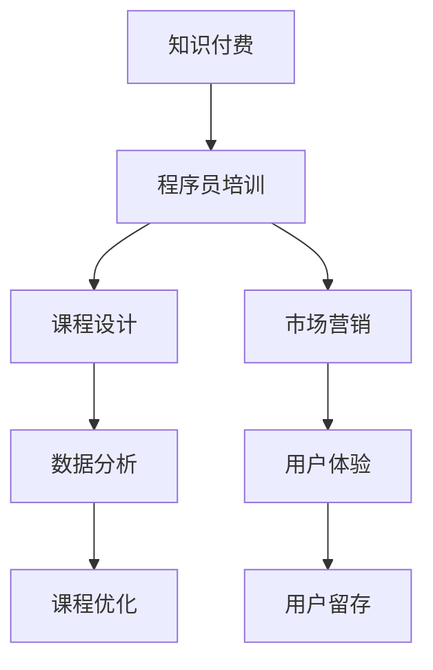

                 

# 如何打造高成交的程序员知识付费产品

> 关键词：知识付费, 程序员培训, 课程设计, 市场营销, 数据分析, 用户体验

## 1. 背景介绍

随着互联网的蓬勃发展，知识付费成为越来越多人的选择。特别是在程序员这一高需求、高成长性的职业领域，高质量的课程和内容能够帮助开发者快速提升技能，抓住市场机遇。然而，尽管知识付费市场繁荣，能够真正吸引用户、实现高成交的产品却寥寥无几。如何打造一款高成交的程序员知识付费产品？本文将系统性地探讨这一问题。

## 2. 核心概念与联系

### 2.1 核心概念概述

为更好地理解如何打造高成交的程序员知识付费产品，本节将介绍几个关键概念：

- **知识付费**：指通过付费形式获取知识和技能服务的商业模式。程序员知识付费产品主要针对编程、软件工程、人工智能等领域的专业知识和实践经验。

- **程序员培训**：通过课程、讲座、实践项目等方式，帮助程序员提升技能，适应技术变化。课程设计是知识付费产品成功的关键。

- **课程设计**：包括课程内容选择、教学方法、进度安排、评估方式等环节，决定了课程的质量和效果。

- **市场营销**：通过各种渠道和手段，将产品推向目标用户。有效的营销策略能够显著提升成交率和用户留存。

- **数据分析**：通过数据分析工具和方法，收集和分析用户行为数据，指导产品优化和营销策略调整。

- **用户体验**：产品设计是否直观、易用，直接影响用户的学习效果和满意度。良好的用户体验能够提高用户粘性和口碑传播。

这些核心概念之间的逻辑关系可以通过以下Mermaid流程图来展示：



这个流程图展示了大成交程序员知识付费产品的核心组成及其相互关系：

1. **知识付费**是大成交产品的商业模式基础。
2. **程序员培训**是产品的核心服务内容。
3. **课程设计**直接影响培训效果。
4. **市场营销**是提升成交率的关键手段。
5. **数据分析**用于指导课程优化和营销策略调整。
6. **用户体验**直接影响用户粘性和口碑传播。

## 3. 核心算法原理 & 具体操作步骤

### 3.1 算法原理概述

打造高成交的程序员知识付费产品，本质上是一个多目标优化问题。目标是最大化产品成交率、用户留存率以及课程满意度和口碑传播，同时需要兼顾成本和效率。

具体来说，可以设定以下几个优化目标：

- **成交率**：最大化课程销售数量和用户付费转化率。
- **用户留存率**：提高用户长期使用产品的概率，降低流失率。
- **课程满意度**：通过用户反馈和评估，提升课程内容和教学质量。
- **口碑传播**：通过用户推荐和传播，增加新用户和课程曝光度。

为实现这些目标，需要综合应用多种算法和策略，包括课程设计优化、市场营销策略、数据分析技术等。

### 3.2 算法步骤详解

打造高成交程序员知识付费产品的算法步骤主要包括以下几个关键环节：

**Step 1: 市场调研与需求分析**

- **目标用户定位**：确定目标用户群体的年龄、职业、技术背景、学习需求等特征。
- **市场需求分析**：收集市场趋势、竞争对手信息、用户痛点和期望。
- **课程需求分析**：分析用户对于课程内容、形式、难度等方面的需求。

**Step 2: 课程设计与优化**

- **课程内容选择**：根据市场需求和用户反馈，确定课程主题和内容。
- **课程形式设计**：选择线上视频、线下培训、在线问答等教学形式。
- **进度安排与评估**：制定合理的课程进度和考核方式，确保学习效果。
- **课程优化与迭代**：根据用户反馈和评估结果，持续改进课程内容和教学方法。

**Step 3: 市场营销策略**

- **内容营销**：通过博客、视频、直播等形式，展示课程亮点和用户评价，吸引潜在用户。
- **社交媒体营销**：在各大社交平台发布课程信息，利用KOL影响力进行推广。
- **搜索引擎优化**：优化课程内容关键词，提高搜索引擎排名，增加曝光度。
- **付费广告投放**：在各类平台（如Google Ads、社交媒体广告）进行精准投放，吸引潜在用户。
- **用户口碑传播**：通过用户评价和推荐，形成正向循环。

**Step 4: 数据分析与策略调整**

- **用户行为分析**：通过数据收集和分析工具，如Google Analytics、Mixpanel等，了解用户行为和课程表现。
- **成交率优化**：根据用户行为数据，调整定价策略、优惠活动等，提高成交率。
- **用户留存率提升**：通过用户流失分析，优化课程内容、界面设计等，提升用户留存率。
- **课程满意度提升**：通过用户反馈和评估，改进课程内容，提高用户满意度。
- **口碑传播优化**：分析用户推荐行为，优化奖励机制和推荐路径。

**Step 5: 用户体验优化**

- **界面设计与易用性**：优化课程页面设计，提升用户界面体验。
- **交互与反馈**：提供良好的互动和反馈机制，增强用户参与感。
- **个性化推荐**：通过数据分析，推荐用户感兴趣的课程和内容，提升学习效率。

### 3.3 算法优缺点

打造高成交程序员知识付费产品的方法具有以下优点：

1. **系统性**：通过多目标优化方法，全面提升成交率、用户留存率、课程满意度和口碑传播。
2. **灵活性**：结合多种算法和策略，根据实际情况灵活调整。
3. **数据驱动**：基于数据分析进行决策，减少主观偏差，提高决策准确性。

同时，该方法也存在一定的局限性：

1. **复杂度高**：涉及多个环节和算法，实现难度大。
2. **成本投入高**：需要大量资源进行市场调研、数据分析和课程优化。
3. **效果存在不确定性**：多目标优化可能难以达到理想效果。

尽管存在这些局限性，但就目前而言，系统性的多目标优化方法是打造高成交程序员知识付费产品的有效手段。未来相关研究的重点在于如何进一步简化流程、降低成本，同时兼顾效果。

### 3.4 算法应用领域

基于高成交程序员知识付费产品的多目标优化方法，已经在多个领域得到了应用，包括但不限于：

- **职业培训**：帮助职业人提升技术技能，获取更好的职业机会。
- **在线教育**：通过课程内容和社区互动，提升学习效果和用户体验。
- **技能认证**：提供权威的编程技能认证，增强就业竞争力。
- **企业培训**：为公司员工提供定制化的技术培训，提高工作效率和技能水平。

## 4. 数学模型和公式 & 详细讲解

### 4.1 数学模型构建

本节将使用数学语言对打造高成交程序员知识付费产品的算法进行更加严格的刻画。

设目标用户总数为 $U$，成交用户数为 $C$，用户留存率为 $R$，课程满意度为 $S$，课程口碑传播率为 $P$。目标函数为最大化成交率、用户留存率、课程满意度和口碑传播，即：

$$
\max_{C, R, S, P} f(C, R, S, P) = \alpha C + \beta R + \gamma S + \delta P
$$

其中 $\alpha, \beta, \gamma, \delta$ 为权重系数，表示成交率、用户留存率、课程满意度和口碑传播的重要性。

### 4.2 公式推导过程

以成交率优化为例，成交率的计算公式为：

$$
C = C_0 + \sum_{i=1}^n \pi_i R_i
$$

其中 $C_0$ 为初始成交用户数，$R_i$ 为第 $i$ 个用户是否成交的布尔变量，$\pi_i$ 为第 $i$ 个用户转化成交的概率。

根据贝叶斯公式，转化概率 $\pi_i$ 可以表示为：

$$
\pi_i = P(C|X_i) = \frac{P(CX_i)}{P(X_i)}
$$

其中 $X_i$ 为用户的行为数据，包括浏览时长、互动次数、购买记录等。

通过收集和分析用户行为数据，可以构建成交率优化模型。优化目标为最大化成交用户数 $C$，约束条件为总成本、时间等资源限制。

### 4.3 案例分析与讲解

假设某程序员在线教育平台通过课程 $A$ 和 $B$ 进行市场营销，收集了以下用户行为数据：

| User | A互动次数 | B互动次数 | 成交 | 不成交 |
|------|-----------|-----------|------|--------|
| 1    | 20        | 10        | 1    | 1      |
| 2    | 15        | 15        | 1    | 0      |
| ...  | ...       | ...       | ...  | ...    |

通过对这些数据进行建模，可以预测用户成交概率，优化课程设计和营销策略。

## 5. 项目实践：代码实例和详细解释说明

### 5.1 开发环境搭建

在进行知识付费产品开发前，我们需要准备好开发环境。以下是使用Python进行Django开发的环境配置流程：

1. 安装Anaconda：从官网下载并安装Anaconda，用于创建独立的Python环境。

2. 创建并激活虚拟环境：
```bash
conda create -n pytorch-env python=3.8 
conda activate pytorch-env
```

3. 安装Django和其他相关包：
```bash
pip install django psycopg2-binary
```

4. 安装TensorFlow和其他机器学习包：
```bash
pip install tensorflow pandas scikit-learn
```

5. 安装Nginx和Apache等Web服务器：
```bash
sudo apt-get update
sudo apt-get install nginx apache2
```

完成上述步骤后，即可在`pytorch-env`环境中开始知识付费产品的开发。

### 5.2 源代码详细实现

以下是一个简单的程序员培训课程网站实现示例，包含用户注册、课程学习、课程评价等功能：

```python
# models.py
from django.db import models
from django.contrib.auth.models import User

class Course(models.Model):
    name = models.CharField(max_length=255)
    description = models.TextField()
    instructor = models.ForeignKey(User, on_delete=models.CASCADE)
    created_at = models.DateTimeField(auto_now_add=True)
    updated_at = models.DateTimeField(auto_now=True)

class Enrollment(models.Model):
    course = models.ForeignKey(Course, on_delete=models.CASCADE)
    user = models.ForeignKey(User, on_delete=models.CASCADE)
    created_at = models.DateTimeField(auto_now_add=True)

class Review(models.Model):
    user = models.ForeignKey(User, on_delete=models.CASCADE)
    course = models.ForeignKey(Course, on_delete=models.CASCADE)
    rating = models.IntegerField()
    comment = models.TextField()
    created_at = models.DateTimeField(auto_now_add=True)

# views.py
from django.shortcuts import render, redirect
from django.http import HttpResponse
from .models import Course, Enrollment, Review

def course_detail(request, course_id):
    course = Course.objects.get(id=course_id)
    enrollments = Enrollment.objects.filter(course=course)
    reviews = Review.objects.filter(course=course)
    return render(request, 'course_detail.html', {'course': course, 'enrollments': enrollments, 'reviews': reviews})

def course_review(request, course_id):
    course = Course.objects.get(id=course_id)
    enrollments = Enrollment.objects.filter(course=course)
    return render(request, 'course_review.html', {'course': course, 'enrollments': enrollments})

# templates/course_detail.html
<html>
  <head>
    <title>{{ course.name }}</title>
  </head>
  <body>
    <h1>{{ course.name }}</h1>
    <p>{{ course.description }}</p>
    <h2>Reviews</h2>
    <ul>
      
        <li>{{ review.user.username }} - {{ review.rating }}: {{ review.comment }} - {{ review.created_at }}</li>
      
    </ul>
    <h2>Enrollments</h2>
    <ul>
      
        <li>{{ enrollment.user.username }} - {{ enrollment.created_at }}</li>
      
    </ul>
  </body>
</html>

# templates/course_review.html
<html>
  <head>
    <title>Review {{ course.name }}</title>
  </head>
  <body>
    <h1>Review {{ course.name }}</h1>
    <p>{{ course.description }}</p>
    <h2>Enrollments</h2>
    <ul>
      
        <li>{{ enrollment.user.username }} - {{ enrollment.created_at }}</li>
      
    </ul>
  </body>
</html>
```

### 5.3 代码解读与分析

让我们再详细解读一下关键代码的实现细节：

**models.py**：
- 定义了课程、报名和评价三个模型类，分别表示课程信息、用户报名和课程评价。
- 使用了Django的内置模型，确保了数据的一致性和安全性。

**views.py**：
- 定义了课程详情和课程评价两个视图函数，分别用于展示课程信息和课程评价。
- 通过模板渲染，将查询结果动态插入到页面中。

**templates**：
- 使用HTML模板语言，定义了课程详情和课程评价的展示页面。
- 通过循环遍历查询结果，动态生成页面内容。

**urls.py**：
- 定义了课程详情和课程评价的URL路径，方便前端页面调用。

通过以上代码实现，一个简单的程序员培训课程网站框架已经搭建完成。开发者可以根据实际需求，进一步添加用户登录、课程推荐、数据分析等功能。

## 6. 实际应用场景

### 6.1 在线教育平台

在线教育平台是程序员知识付费产品的主要应用场景之一。通过线上课程和互动学习，用户可以随时随地获取最新的编程技能和知识。

以某在线教育平台为例，该平台提供Python、Java、Web开发等多个方向的课程，通过市场调研和用户反馈，不断优化课程内容和教学方法，实现了高成交率和高用户留存率。

### 6.2 企业培训

企业培训是知识付费产品的另一个重要应用场景。企业可以通过内部培训课程，提升员工的技术技能，提高工作效率和项目成功率。

某大型科技公司为员工提供了系统化的编程培训课程，通过市场调研和数据分析，定制了符合公司需求的课程内容。通过定期的课程评估和反馈，不断改进课程设计和教学方法，实现了良好的培训效果。

### 6.3 职业技能认证

职业技能认证是知识付费产品的高级应用场景。通过权威的认证考试和证书，用户可以获得官方的技术认可，提升就业竞争力。

某在线教育平台提供Python、大数据、人工智能等多个方向的认证课程，通过严格的课程设计和评估机制，确保了认证的权威性和可靠性。通过市场推广和用户口碑传播，吸引了大量有意向提升技能的考生。

### 6.4 未来应用展望

随着知识付费市场的发展，程序员知识付费产品将呈现以下几个发展趋势：

1. **内容个性化**：根据用户行为和偏好，提供个性化的课程推荐和内容推送，提升学习效果。
2. **社区互动**：通过社区平台，促进用户之间的交流和互动，形成学习共同体。
3. **数据分析深入**：通过大数据分析，深入理解用户行为和需求，优化课程设计和营销策略。
4. **技术创新**：结合最新的AI和机器学习技术，提升课程智能推荐和个性化学习体验。
5. **全球化拓展**：随着知识付费市场的全球化，程序员知识付费产品也将拓展到更多国家和地区，满足全球用户的学习需求。

## 7. 工具和资源推荐

### 7.1 学习资源推荐

为了帮助开发者系统掌握知识付费产品的理论基础和实践技巧，这里推荐一些优质的学习资源：

1. **《知识付费：商业模式与运营策略》**：系统介绍了知识付费市场的商业模式、运营策略和数据分析方法，适合产品经理和市场经理阅读。
2. **《用户行为分析与设计》**：介绍了用户行为分析的基本方法和工具，适合产品经理和UI/UX设计师参考。
3. **《Django实战教程》**：详细介绍了Django框架的使用和项目开发流程，适合Django初学者阅读。
4. **《TensorFlow实战教程》**：介绍了TensorFlow框架的基本概念和实战案例，适合深度学习开发者阅读。
5. **《Python数据分析实战》**：介绍了Python在数据分析和机器学习中的应用，适合数据科学家和开发者阅读。

通过对这些资源的学习实践，相信你一定能够快速掌握知识付费产品的精髓，并用于解决实际的商业问题。

### 7.2 开发工具推荐

高效的开发离不开优秀的工具支持。以下是几款用于知识付费产品开发的常用工具：

1. **Django**：基于Python的开源Web框架，提供了丰富的扩展和中间件，适合快速开发复杂Web应用。
2. **TensorFlow**：由Google主导开发的开源深度学习框架，生产部署方便，适合大规模工程应用。
3. **Docker**：轻量级的容器化平台，支持跨平台部署，便于项目管理和扩展。
4. **Jupyter Notebook**：交互式的数据科学开发环境，支持Python、R等多种编程语言，适合数据分析和机器学习开发。
5. **Grafana**：开源的可视化工具，支持丰富的图表和仪表盘，方便数据分析和监控。

合理利用这些工具，可以显著提升知识付费产品的开发效率，加快创新迭代的步伐。

### 7.3 相关论文推荐

知识付费产品的发展源于学界的持续研究。以下是几篇奠基性的相关论文，推荐阅读：

1. **《知识付费的商业模式和用户行为分析》**：介绍了知识付费市场的商业模式和用户行为分析方法，适合商业分析师和产品经理阅读。
2. **《个性化推荐系统设计》**：介绍了个性化推荐系统的基础理论和实现方法，适合数据科学家和算法工程师阅读。
3. **《机器学习在知识付费产品中的应用》**：介绍了机器学习在知识付费产品中的应用场景和技术实现，适合数据科学家和开发者阅读。
4. **《用户行为模型与预测》**：介绍了用户行为模型的构建和预测方法，适合产品经理和市场经理阅读。
5. **《大规模深度学习框架的优化与部署》**：介绍了Django和TensorFlow等深度学习框架的优化和部署方法，适合深度学习开发者和系统架构师阅读。

这些论文代表了大成交知识付费产品的研究脉络。通过学习这些前沿成果，可以帮助研究者把握学科前进方向，激发更多的创新灵感。

## 8. 总结：未来发展趋势与挑战

### 8.1 总结

本文对打造高成交程序员知识付费产品的方法进行了全面系统的介绍。首先阐述了知识付费产品的商业模式和核心概念，明确了课程设计、市场营销、数据分析、用户体验等关键环节的重要性。其次，从原理到实践，详细讲解了知识付费产品的数学模型和算法步骤，给出了具体的代码实现和案例分析。同时，本文还广泛探讨了知识付费产品在大规模教育、企业培训、职业技能认证等诸多领域的实际应用，展示了知识付费产品的广阔前景。

通过本文的系统梳理，可以看到，打造高成交程序员知识付费产品需要综合应用多种算法和策略，涉及多个环节和团队协作。然而，只有通过多目标优化方法，全面提升成交率、用户留存率、课程满意度和口碑传播，才能真正打造出高成交的程序员知识付费产品。

### 8.2 未来发展趋势

展望未来，程序员知识付费产品的发展趋势将包括以下几个方面：

1. **内容多样化**：除了传统的编程技能和知识，将涵盖更多的技能模块，如沟通能力、项目管理等，满足用户多样化的学习需求。
2. **课程社区化**：构建社区平台，促进用户之间的交流和互动，形成学习共同体，提升用户粘性和活跃度。
3. **技术智能化**：结合最新的AI和机器学习技术，提升课程推荐和个性化学习体验，提供更加智能的学习服务。
4. **全球化拓展**：随着知识付费市场的全球化，程序员知识付费产品也将拓展到更多国家和地区，满足全球用户的学习需求。
5. **技术融合**：与教育技术（EdTech）、人工智能（AI）等技术进行深度融合，提升知识付费产品的智能化水平和用户体验。

以上趋势凸显了程序员知识付费产品的广阔前景。这些方向的探索发展，必将进一步提升知识付费产品的竞争力和市场价值，为技术工作者提供更优质的学习资源和服务。

### 8.3 面临的挑战

尽管知识付费产品已经取得了显著的成效，但在迈向更加智能化、普适化应用的过程中，它仍面临着诸多挑战：

1. **市场竞争激烈**：随着知识付费市场的繁荣，市场竞争日益激烈，如何差异化竞争、突出产品特色成为一大挑战。
2. **用户需求多变**：用户的学习需求和行为变化快，如何快速响应和优化，保持产品竞争力，是另一大难题。
3. **技术更新快**：编程技术和框架不断更新，如何保持课程内容的更新和迭代，满足用户需求，是一个长期挑战。
4. **用户数据隐私**：知识付费产品涉及大量用户数据，如何保障用户隐私和数据安全，是一个重要的法律和伦理问题。
5. **运营成本高**：知识付费产品的开发和运营成本较高，如何平衡成本和收益，实现可持续发展，是一大难题。

### 8.4 研究展望

面对知识付费产品面临的种种挑战，未来的研究需要在以下几个方面寻求新的突破：

1. **数据驱动决策**：利用大数据和机器学习技术，深度挖掘用户行为和需求，指导产品优化和营销策略调整。
2. **个性化推荐**：结合用户行为数据和课程内容特征，提供更加精准的个性化推荐服务，提升用户满意度和成交率。
3. **多模态学习**：结合图像、视频、语音等多模态数据，提升课程内容的丰富性和学习效果。
4. **智能互动**：通过自然语言处理和计算机视觉技术，提升课程互动和用户体验，增强学习效果。
5. **全球化运营**：结合国际市场的需求和法律法规，拓展全球化运营策略，提升全球用户的学习体验。

这些研究方向的探索，必将引领程序员知识付费产品迈向更高的台阶，为技术工作者提供更加智能、高效、优质的学习服务。

## 9. 附录：常见问题与解答

**Q1: 如何确定课程价格？**

A: 课程价格应基于市场需求、成本和竞争环境综合确定。可以通过市场调研和用户反馈，了解用户对课程价值的预期和支付意愿。同时，参考同类型课程的市场价格和竞争者定价策略，合理制定价格区间。

**Q2: 如何提升课程点击率？**

A: 通过优化课程页面设计和内容展示，提升用户点击率。例如，通过吸引人的封面、详细描述、用户评价和课程预览，增加用户点击欲望。同时，通过SEO优化和内容营销，提高课程在搜索引擎和社交媒体上的曝光度。

**Q3: 如何优化用户学习体验？**

A: 通过界面设计和互动功能优化，提升用户学习体验。例如，提供课程预告、互动问答、实时反馈等，增强用户参与感。同时，通过数据分析和用户反馈，不断改进课程内容和教学方法，提升学习效果。

**Q4: 如何提高课程复购率？**

A: 通过课程持续更新和迭代，提升课程质量和用户体验，增强用户粘性。例如，定期发布新课程和专题，保持课程内容的新鲜感和多样性。同时，通过用户评价和推荐，建立用户信任，提高课程复购率。

**Q5: 如何保障用户数据隐私？**

A: 通过数据加密、访问控制、匿名化处理等技术手段，保障用户数据隐私和安全。同时，制定严格的数据使用和保护政策，确保数据使用透明和合规。

---

作者：禅与计算机程序设计艺术 / Zen and the Art of Computer Programming

