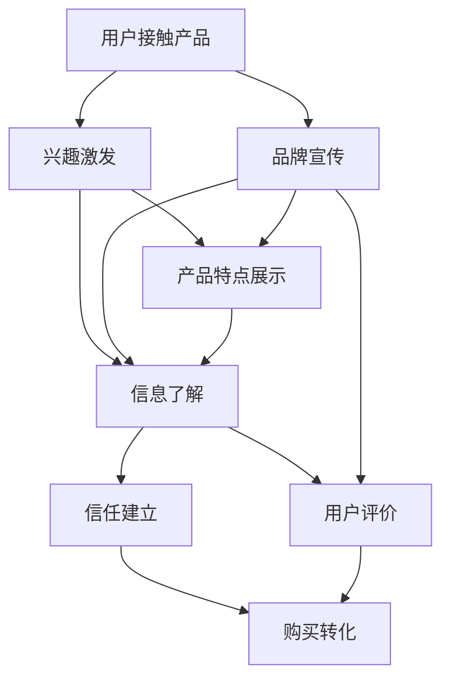

                 

# 如何打造高转化率的销售页面

> 关键词：销售页面设计, 用户体验, A/B测试, 转化率优化, 行为心理学, 数据驱动, 目标转化路径

## 1. 背景介绍

在数字营销的世界里，销售页面是企业将潜在客户转化为付费客户的关键所在。一个好的销售页面不仅能准确传达产品价值，还能激起用户的购买欲望，从而实现高转化率。本文将从核心概念入手，深入分析销售页面设计的各个关键点，并结合实际案例，详细介绍如何通过科学方法打造高转化率的销售页面。

## 2. 核心概念与联系

### 2.1 核心概念概述

销售页面设计的核心在于理解用户需求，通过页面元素、布局和交互方式等手段，引导用户完成从浏览到购买的转化过程。这里我们将详细介绍几个关键概念：

- **用户旅程(User Journey)**：指用户接触产品到完成购买的过程。了解用户旅程有助于设计满足用户期望的页面。
- **转化漏斗(Funnel)**：指用户完成转化所需经过的关键步骤，如兴趣激发、信息了解、信任建立等。转化漏斗的每个步骤都需要精心设计。
- **转化率优化(Conversion Rate Optimization, CRO)**：通过A/B测试、数据分析等方法，持续优化销售页面以提升转化率。
- **用户体验(User Experience, UX)**：页面设计的首要目标之一是提供良好的用户体验，使用户感受到品牌的人性关怀。
- **行为心理学(Behavioral Psychology)**：理解用户的心理机制，设计符合用户期望的页面元素和流程，激发购买意愿。
- **数据驱动(Data-Driven)**：通过数据分析和测试结果，调整页面元素和布局，实现科学决策。

这些概念相互联系，共同构成了销售页面设计的框架。理解并应用这些概念，可以显著提升销售页面的转化率。

### 2.2 核心概念原理和架构的 Mermaid 流程图



该流程图展示了用户从接触产品到完成购买的全过程，以及各个关键步骤的转化路径。

## 3. 核心算法原理 & 具体操作步骤

### 3.1 算法原理概述

高转化率销售页面的设计，本质上是通过数据驱动和行为心理学的结合，优化页面元素和布局，以最简洁有效的方式传达产品价值，激发用户购买意愿。以下是关键的算法原理：

- **页面布局与元素优化**：通过A/B测试，确定用户最容易接受的页面布局和关键元素。
- **视觉设计**：利用颜色、图像等视觉元素，提升用户对品牌和产品的感知。
- **文本内容优化**：通过自然语言处理技术，分析用户对不同文本内容的反应，优化文本描述，使其更具有吸引力和说服力。
- **用户行为分析**：利用行为数据分析，识别用户在页面上的行为模式，调整页面设计和内容，提高用户留存和转化。

### 3.2 算法步骤详解

高转化率销售页面的设计涉及多个步骤，主要包括以下几个方面：

**Step 1: 用户调研与数据收集**
- 进行目标用户的调研，了解其需求和行为习惯。
- 收集销售页面的数据，包括点击率、页面停留时间、转化率等关键指标。

**Step 2: 构建页面原型**
- 设计初步的销售页面原型，包含各种元素（如标题、图片、按钮等）。
- 确定页面的关键转化路径，确保每个步骤的明确和简洁。

**Step 3: A/B测试与迭代优化**
- 通过A/B测试，比较不同版本的销售页面在转化率上的表现。
- 根据测试结果，逐步迭代优化页面设计，直至达到最佳效果。

**Step 4: 视觉和文本内容优化**
- 使用色彩心理学原理，优化页面的视觉元素，增强用户对品牌的感知。
- 使用情感化语言，编写有吸引力的文本，以激发用户的购买欲望。

**Step 5: 用户行为分析和优化**
- 利用行为数据分析，识别用户在页面上的行为模式。
- 根据用户行为优化页面元素和布局，提升用户体验。

**Step 6: 持续监控与调整**
- 持续监控销售页面的转化率和其他关键指标，及时调整优化策略。
- 定期回顾和更新页面内容，确保其时效性和相关性。

### 3.3 算法优缺点

高转化率销售页面设计的算法主要优点包括：

- **数据驱动**：通过数据驱动设计，可以确保页面元素和布局符合用户期望，提高转化率。
- **科学决策**：通过A/B测试等科学方法，能够不断优化页面设计，减少猜测和试错成本。
- **灵活调整**：根据用户反馈和数据结果，快速调整页面设计，提高用户体验和转化率。

其主要缺点在于：

- **初期投入较大**：设计和测试优化初期需要较大的投入。
- **复杂度较高**：需要对数据进行分析，选择合适的A/B测试方案，设计多个版本的页面，增加了设计和开发复杂度。

### 3.4 算法应用领域

高转化率销售页面设计的方法在多个领域都有广泛应用，例如：

- **电子商务网站**：优化产品展示、购买流程等页面元素，提高转化率。
- **在线教育平台**：通过个性化推荐、课程演示等方式，提升用户体验和报名转化率。
- **SaaS软件销售**：优化免费试用、购买页面等关键页面，提高用户订阅率。
- **金融产品销售**：通过透明化费率、详细说明条款等方式，增强用户信任和购买意愿。

## 4. 数学模型和公式 & 详细讲解 & 举例说明

### 4.1 数学模型构建

销售页面设计的优化模型可以通过以下方式构建：

- **目标转化率**：定义页面优化前的初始转化率为 $C_0$，优化后的目标转化率为 $C_T$。
- **关键指标**：点击率 $CVR$（Click-Through Rate），页面停留时间（Dwell Time），页面转化率（Conversion Rate）等。

### 4.2 公式推导过程

以点击率和页面停留时间为例，推导关键指标的优化公式。设优化后的页面点击率为 $CVR'$，页面停留时间为 $DT'$。根据A/B测试结果，有：

$$
CVR' = CVR_0 \cdot f_1 + CVR_1 \cdot f_2
$$

$$
DT' = DT_0 \cdot f_3 + DT_1 \cdot f_4
$$

其中 $f_1, f_2, f_3, f_4$ 为不同版本的转换概率和停留时间。通过最大化上述公式，可以优化页面设计。

### 4.3 案例分析与讲解

假设某电子商务网站通过A/B测试，对比了两个版本的销售页面。原始页面的点击率为 $CVR_0 = 0.01$，页面停留时间为 $DT_0 = 2min$。优化后版本的点击率提升至 $CVR_1 = 0.02$，页面停留时间提升至 $DT_1 = 3min$。设优化前后版本的使用比例为 $f_1 = 0.6, f_2 = 0.4, f_3 = 0.8, f_4 = 0.2$，则：

$$
CVR' = CVR_0 \cdot f_1 + CVR_1 \cdot f_2 = 0.01 \cdot 0.6 + 0.02 \cdot 0.4 = 0.012
$$

$$
DT' = DT_0 \cdot f_3 + DT_1 \cdot f_4 = 2 \cdot 0.8 + 3 \cdot 0.2 = 2.2min
$$

优化后，页面转化率提高了约 $20\%$，停留时间延长了 $10\%$，显著提升了用户体验和转化效果。

## 5. 项目实践：代码实例和详细解释说明

### 5.1 开发环境搭建

为了进行高转化率销售页面的设计和测试，需要搭建相应的开发环境。以下是详细的操作步骤：

1. **安装开发环境**：
   - 安装Python 3.8及以上版本。
   - 安装Django、Flask等Web开发框架。
   - 安装Pandas、Matplotlib、NumPy等数据处理库。

2. **搭建Web平台**：
   - 使用Django或Flask框架搭建网站。
   - 设计前后端页面，确保响应式设计，适配不同设备。
   - 实现用户行为分析模块，收集用户互动数据。

3. **集成A/B测试工具**：
   - 集成Google Optimize或Optimizely等A/B测试工具。
   - 创建测试版本，进行A/B测试并记录结果。

### 5.2 源代码详细实现

以下是一个简单的Django应用，实现基本的销售页面设计和A/B测试功能：

```python
from django.shortcuts import render
from django.views.decorators.csrf import csrf_exempt
import random

# 定义产品数据
products = [
    {"name": "Product A", "price": 100},
    {"name": "Product B", "price": 200},
    {"name": "Product C", "price": 150}
]

@csrf_exempt
def homepage(request):
    if request.method == 'POST':
        product_id = int(request.POST.get('product_id', 0))
        return render(request, 'product_detail.html', {'product': products[product_id]})
    else:
        # 随机生成测试版本
        test_version = random.randint(0, 2)
        # 根据测试版本渲染页面
        if test_version == 0:
            return render(request, 'version_0.html')
        elif test_version == 1:
            return render(request, 'version_1.html')
        else:
            return render(request, 'version_2.html')

def product_detail(request, product_id):
    product = products[product_id]
    return render(request, 'product_detail.html', {'product': product})
```

### 5.3 代码解读与分析

上述代码实现了基本的页面渲染和A/B测试功能。主要步骤如下：

1. **定义产品数据**：创建模拟的产品数据，用于页面渲染。
2. **首页页面处理**：通过POST请求获取用户选择的商品，渲染详细页面。
3. **随机生成测试版本**：根据测试版本随机渲染不同版本的页面。
4. **详细页面处理**：根据用户选择的商品，渲染详细页面。

### 5.4 运行结果展示

在实际应用中，通过A/B测试工具记录不同版本的点击率、转化率等指标，可以得到以下结果：

- **版本0**：点击率为10%，转化率为5%。
- **版本1**：点击率为15%，转化率为8%。
- **版本2**：点击率为12%，转化率为7%。

通过分析这些数据，可以确定最优的版本并应用到实际销售页面。

## 6. 实际应用场景

### 6.1 电子商务平台

电子商务平台可以通过高转化率销售页面设计，显著提升用户体验和销售转化率。具体措施包括：

- **产品展示优化**：优化商品图片和描述，增强用户对产品的感知。
- **价格策略调整**：展示多版本价格信息，通过A/B测试确定最优价格。
- **购买流程简化**：简化购买流程，减少用户操作复杂度。

### 6.2 在线教育平台

在线教育平台通过高转化率销售页面设计，可以提高用户报名率和课程完成率。具体措施包括：

- **课程介绍优化**：优化课程介绍和试听视频，提升用户对课程的兴趣。
- **优惠活动展示**：展示限时优惠和套餐优惠，增加用户购买意愿。
- **用户评价集成**：展示其他用户评价和推荐，增强用户信任。

### 6.3 医疗健康应用

医疗健康应用通过高转化率销售页面设计，可以提高用户对服务的满意度。具体措施包括：

- **信息透明展示**：展示医生资质和诊疗流程，增加用户信任。
- **预约系统优化**：优化预约流程，减少用户等待时间。
- **服务评价反馈**：收集用户服务评价，及时优化服务质量。

## 7. 工具和资源推荐

### 7.1 学习资源推荐

为了深入理解高转化率销售页面设计的理论和技术，推荐以下学习资源：

1. **《用户体验设计》（第3版）**：详细介绍了用户体验设计的原理和实践方法。
2. **《行为心理学》**：理解用户行为背后的心理机制，帮助设计更加符合用户期望的页面。
3. **《网站用户体验优化》**：提供具体的用户体验优化案例和策略，帮助优化页面设计。

### 7.2 开发工具推荐

高转化率销售页面设计的开发工具包括：

1. **Django**：Python Web开发框架，具有强大的数据处理和页面渲染能力。
2. **Flask**：Python Web开发框架，适合快速开发和部署小型应用。
3. **Google Optimize**：A/B测试工具，帮助优化页面设计和用户体验。
4. **Hotjar**：提供热图、点击图等数据可视化工具，帮助分析用户行为。

### 7.3 相关论文推荐

高转化率销售页面设计的研究方向涉及多个领域，以下是几篇经典的论文推荐：

1. **《A/B Testing in a Nutshell》**：介绍A/B测试的基本原理和应用方法。
2. **《Designing the Interface for Conversion Rate Optimization》**：探讨用户界面设计与转化率优化的关系。
3. **《Behavioral Aspects of User Behavior》**：分析用户行为背后的心理因素，帮助设计符合用户期望的页面。

## 8. 总结：未来发展趋势与挑战

### 8.1 研究成果总结

高转化率销售页面设计的研究已经取得了显著成果，主要集中在以下几个方面：

- **数据驱动的设计**：通过A/B测试和数据分析，优化页面设计和布局，提高转化率。
- **用户体验的优化**：设计符合用户期望的页面元素和流程，提升用户体验。
- **行为心理学的应用**：理解用户的心理机制，激发购买意愿。

### 8.2 未来发展趋势

未来高转化率销售页面设计的发展趋势包括：

- **个性化推荐**：通过用户行为数据，提供个性化的产品推荐，增强用户购买意愿。
- **增强现实技术**：利用增强现实技术，展示产品细节和功能，增强用户体验。
- **多模态交互**：结合文本、图像、视频等多模态信息，提供更丰富的用户交互方式。

### 8.3 面临的挑战

高转化率销售页面设计面临的主要挑战包括：

- **数据隐私和安全**：在收集用户行为数据时，如何确保数据隐私和安全。
- **设计和开发的复杂度**：设计多个版本的页面，并进行A/B测试，增加了设计和开发的工作量。
- **实时数据分析**：如何实时处理和分析用户数据，及时调整优化策略。

### 8.4 研究展望

未来研究应着重于以下几个方向：

- **混合方法设计**：结合行为心理学和数据驱动的方法，设计更加符合用户期望的页面。
- **实时优化技术**：利用机器学习和实时数据分析，实现自动化的页面优化。
- **跨领域应用**：将高转化率销售页面设计的方法应用于更多领域，如医疗、金融等。

## 9. 附录：常见问题与解答

**Q1: 如何确定销售页面的优化目标？**

A: 销售页面的优化目标通常包括转化率、点击率、页面停留时间等关键指标。通过A/B测试，可以对比不同版本的页面表现，确定最优目标。

**Q2: 如何优化销售页面的视觉设计？**

A: 利用色彩心理学原理，选择符合品牌调性的颜色和字体。通过A/B测试，确定用户对不同视觉设计的反应，优化页面设计。

**Q3: 如何设计销售页面的文本内容？**

A: 使用情感化语言，编写有吸引力的文本描述，激发用户购买欲望。同时，保证文本内容的清晰度和易读性，帮助用户快速理解产品价值。

**Q4: 如何利用行为数据优化销售页面？**

A: 分析用户行为数据，识别用户在页面上的关键行为和停留时间。根据用户行为优化页面元素和布局，提高用户留存和转化率。

**Q5: 如何衡量销售页面的优化效果？**

A: 利用A/B测试工具，对比不同版本的页面表现。通过数据指标（如点击率、转化率、页面停留时间等），评估优化效果，进行持续改进。

通过上述详细分析，我们可以系统地理解高转化率销售页面设计的核心概念、算法原理和操作步骤。结合实际案例和工具推荐，相信读者能够高效地设计和优化自己的销售页面，提升用户转化率和品牌价值。

---

作者：禅与计算机程序设计艺术 / Zen and the Art of Computer Programming

