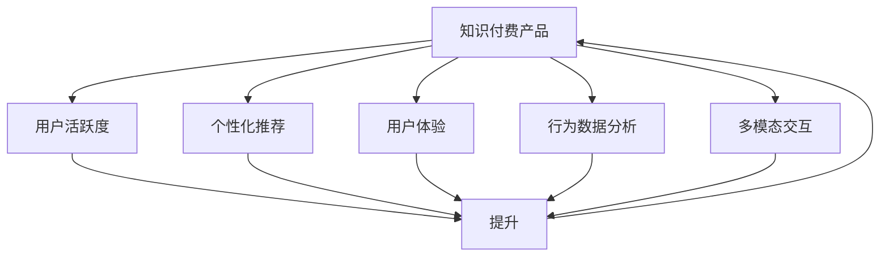

                 

# 如何提高知识付费产品的用户活跃度

> 关键词：用户活跃度,知识付费产品,个性化推荐,用户体验,行为数据分析,多模态交互

## 1. 背景介绍

在知识付费快速发展的今天，各知识平台如雨后春笋般涌现，提供了丰富的内容形式，如音频、视频、直播、图文等。尽管如此，用户活跃度的提升仍是个难题。高质量的内容固然重要，但如何让用户形成稳定、高频的互动与消费行为，仍然是摆在平台面前的重要挑战。本文从个性化推荐、用户体验、行为数据分析等多个角度，探讨如何通过优化产品设计和算法，有效提升知识付费产品的用户活跃度。

## 2. 核心概念与联系

### 2.1 核心概念概述

为更好地理解如何提升知识付费产品的用户活跃度，本节将介绍几个核心概念及其相互联系：

- **知识付费产品(Knowledge-based Pay-to-Read Products)**：包括但不限于在线课程、电子书、听书、直播课程等形式，旨在为用户提供高质量知识内容，并收取一定费用以支持内容创作和平台运营。

- **用户活跃度(User Engagement)**：通常包括访问频次、停留时长、互动评论、付费行为等指标，衡量用户对产品内容的参与度和忠诚度。

- **个性化推荐(Personalized Recommendation)**：基于用户行为数据和历史偏好，为用户推荐可能感兴趣的内容，提升用户体验和满意度。

- **用户体验(User Experience)**：用户在使用产品过程中，对产品性能、易用性、内容相关性等方面的综合感受。

- **行为数据分析(Behavioral Data Analysis)**：通过分析用户的行为数据，识别用户需求和偏好，辅助算法优化。

- **多模态交互(Multimodal Interaction)**：结合文字、图片、视频、音频等多种形式，增强用户与内容之间的互动。

这些概念之间的联系紧密，共同构成了知识付费产品运营的核心框架。下面，我们通过Mermaid流程图展示它们之间的联系：



## 3. 核心算法原理 & 具体操作步骤
### 3.1 算法原理概述

提升知识付费产品用户活跃度的核心算法原理基于以下几方面：

1. **个性化推荐算法**：利用用户行为数据，为用户推荐可能感兴趣的内容，提升用户体验和满意度。
2. **行为分析算法**：通过分析用户行为数据，理解用户需求和偏好，辅助算法优化。
3. **交互设计**：优化用户与内容之间的互动方式，增强用户粘性。

个性化推荐算法是提升用户活跃度的关键，其原理为：

- 利用协同过滤、基于内容的推荐等技术，分析用户的历史行为和偏好。
- 通过机器学习算法（如深度学习、协同过滤等），预测用户对不同内容的可能兴趣度。
- 将推荐结果呈现给用户，促进内容的消费和互动。

行为分析算法通常采用点击流分析、行为序列分析等方法，识别出用户的核心兴趣和行为模式。通过预测用户的行为变化，及时调整推荐策略，提升用户粘性。

交互设计则侧重于提升用户的使用体验，通过友好的界面和便捷的操作流程，减少用户流失，增强用户对平台的依赖性。

### 3.2 算法步骤详解

基于上述原理，提升知识付费产品用户活跃度的算法步骤如下：

**Step 1: 数据收集与预处理**

- 收集用户行为数据，如浏览记录、观看时长、点赞、评论等。
- 对数据进行清洗和预处理，去除噪声和异常值。
- 将用户行为数据存储至数据仓库中，以便后续分析。

**Step 2: 用户行为分析**

- 通过点击流分析、行为序列分析等技术，识别用户的关键行为模式和兴趣点。
- 利用聚类算法（如K-Means、LDA等），将用户分为不同的兴趣群体。
- 通过时间序列分析，预测用户行为变化趋势，及时调整推荐策略。

**Step 3: 个性化推荐**

- 设计推荐算法，如协同过滤、基于内容的推荐、矩阵分解等。
- 训练推荐模型，并根据用户行为数据进行参数更新。
- 将推荐结果按照用户兴趣进行排序，输出给用户。

**Step 4: 用户反馈收集与调整**

- 收集用户对推荐内容的反馈，包括观看时长、评论互动等。
- 分析用户反馈，优化推荐算法和数据模型。
- 根据用户反馈，及时调整推荐策略，提高用户满意度。

**Step 5: 用户体验优化**

- 设计友好的用户界面和操作流程，提升用户体验。
- 结合多模态交互，增加用户与内容之间的互动性。
- 优化加载速度和响应时间，减少用户等待成本。

**Step 6: 效果评估与持续迭代**

- 通过指标（如点击率、转化率、停留时长等）评估推荐效果。
- 分析用户行为数据，找出推荐的优化点。
- 根据评估结果，持续迭代优化推荐算法和用户体验。

### 3.3 算法优缺点

个性化推荐算法具有以下优点：
1. 提升用户满意度：通过推荐用户感兴趣的内容，提高用户的留存率和活跃度。
2. 增加用户粘性：长期的用户行为数据，有助于构建深度用户画像，增强用户粘性。
3. 降低运营成本：通过推荐算法，降低内容推荐所需的人力成本和时间成本。

同时，该算法也存在以下缺点：
1. 依赖数据质量：推荐效果依赖于高质量的用户行为数据，数据不完整或不准确会影响效果。
2. 存在推荐偏差：推荐算法可能存在一定的偏差，导致某些用户群体被忽视或过度推荐。
3. 过度个性化风险：过度个性化的推荐可能使用户陷入信息茧房，降低平台的多样性。
4. 资源消耗大：个性化推荐算法需要大量的计算资源和时间，尤其是在数据规模大的情况下。

### 3.4 算法应用领域

个性化推荐算法在知识付费产品中的应用非常广泛，包括但不限于：

- 在线课程推荐：根据用户浏览记录、评分反馈等，推荐用户可能感兴趣的视频课程。
- 电子书推荐：利用用户阅读行为数据，推荐用户可能感兴趣的电子书。
- 听书推荐：结合用户的收听记录和评分反馈，推荐可能感兴趣的听书内容。
- 直播课程推荐：通过分析用户的观看行为和互动反馈，推荐用户可能感兴趣的直播课程。

此外，个性化推荐算法还在广告投放、智能搜索、内容聚合等多个领域得到了广泛应用。

## 4. 数学模型和公式 & 详细讲解 & 举例说明
### 4.1 数学模型构建

本节我们将通过数学语言，详细描述提升知识付费产品用户活跃度的推荐模型构建过程。

假设平台收集到用户行为数据 $\mathcal{D}=\{(x_i,y_i)\}_{i=1}^N$，其中 $x_i$ 表示用户行为特征，如观看时长、点赞数量等，$y_i$ 表示用户反馈，如点击率、购买率等。我们的目标是通过这些数据，构建个性化推荐模型。

定义用户行为特征的嵌入表示为 $\mathbf{u}(x)$，商品特征的嵌入表示为 $\mathbf{v}(y)$，用户-商品交互矩阵为 $A_{i,j}$。个性化推荐模型的目标函数为：

$$
\min_{\mathbf{u},\mathbf{v}} \sum_{i,j} A_{i,j} \|\mathbf{u}(x_i) \mathbf{v}^T(y_j)\|^2
$$

其中 $\|\cdot\|$ 表示向量范数，$A_{i,j}$ 表示用户 $i$ 和商品 $j$ 的交互次数。

通过求解上述目标函数，可以优化用户行为特征和商品特征的嵌入表示，得到推荐模型。

### 4.2 公式推导过程

上述目标函数的推导基于以下几项假设：

1. 相似度假设：如果用户 $i$ 对商品 $j$ 进行了交互，则认为用户 $i$ 与商品 $j$ 存在相似性。
2. 线性假设：用户行为和商品特征之间的关系可以近似为线性关系。
3. 稀疏性假设：用户行为数据通常是非常稀疏的，大部分用户-商品对没有交互。

基于这些假设，我们可以将目标函数简化为：

$$
\min_{\mathbf{u},\mathbf{v}} \sum_{i,j} A_{i,j} \mathbf{u}(x_i)^T \mathbf{v}(y_j)
$$

进一步，我们可以通过奇异值分解（SVD）求解该优化问题，得到用户行为特征和商品特征的嵌入表示。

### 4.3 案例分析与讲解

假设我们有一个在线课程平台，已收集到部分用户的行为数据：

| 用户ID | 课程ID | 观看时长 | 评分 | 是否购买 |
| --- | --- | --- | --- | --- |
| 1 | 101 | 30分钟 | 5星 | 是 |
| 2 | 102 | 15分钟 | 3星 | 否 |
| ... | ... | ... | ... | ... |

我们可以将用户行为数据表示为 $\mathbf{X}$，其中每行表示一个用户，每列表示一个课程。将用户行为数据和课程评分数据分别进行嵌入表示，得到 $\mathbf{U}$ 和 $\mathbf{V}$。

通过求解上述目标函数，我们得到用户行为特征和课程评分特征的嵌入表示。以用户1为例，其对课程101的行为特征为 $\mathbf{u}_1^T \mathbf{v}_{101}$，表示用户1对课程101的兴趣程度。通过计算该值，我们可以推荐给用户1更多相关的课程。

## 5. 项目实践：代码实例和详细解释说明
### 5.1 开发环境搭建

在进行推荐系统实践前，我们需要准备好开发环境。以下是使用Python进行PyTorch开发的环境配置流程：

1. 安装Anaconda：从官网下载并安装Anaconda，用于创建独立的Python环境。

2. 创建并激活虚拟环境：
```bash
conda create -n recommendation-env python=3.8 
conda activate recommendation-env
```

3. 安装PyTorch：根据CUDA版本，从官网获取对应的安装命令。例如：
```bash
conda install pytorch torchvision torchaudio cudatoolkit=11.1 -c pytorch -c conda-forge
```

4. 安装TensorFlow：
```bash
pip install tensorflow
```

5. 安装Pandas和Scikit-learn：
```bash
pip install pandas scikit-learn
```

完成上述步骤后，即可在`recommendation-env`环境中开始推荐系统开发。

### 5.2 源代码详细实现

下面我们以在线课程推荐为例，给出使用PyTorch进行协同过滤算法的推荐系统实现。

首先，定义数据处理函数：

```python
import pandas as pd
import numpy as np
import torch
from sklearn.model_selection import train_test_split

def load_data(path):
    df = pd.read_csv(path)
    return df.drop('label', axis=1), df['label']

def preprocess_data(X, y):
    X = X.fillna(0)
    y = y.fillna(0)
    return X, y

X, y = load_data('data/course.csv')
X, y = preprocess_data(X, y)
X_train, X_test, y_train, y_test = train_test_split(X, y, test_size=0.2, random_state=42)
```

然后，定义模型：

```python
from torch.nn import Linear, Embedding, Softmax

class Recommender(nn.Module):
    def __init__(self, n_users, n_items, emb_dim):
        super(Recommender, self).__init__()
        self.user_embedding = Embedding(n_users, emb_dim)
        self.item_embedding = Embedding(n_items, emb_dim)
        self.dot_product = Linear(emb_dim*2, 1)
        
    def forward(self, user_ids, item_ids):
        user_embs = self.user_embedding(user_ids)
        item_embs = self.item_embedding(item_ids)
        dot_product = self.dot_product(torch.cat((user_embs, item_embs), dim=1))
        return torch.sigmoid(dot_product)

model = Recommender(n_users, n_items, emb_dim=8)
```

接着，定义训练函数：

```python
from torch import nn, optim

def train(model, device, train_loader, epochs, batch_size):
    device = torch.device('cuda' if torch.cuda.is_available() else 'cpu')
    model.to(device)
    
    criterion = nn.BCEWithLogitsLoss()
    optimizer = optim.Adam(model.parameters(), lr=0.01)
    
    for epoch in range(epochs):
        model.train()
        for user_ids, item_ids, ratings in train_loader:
            user_ids, item_ids, ratings = map(torch.tensor, (user_ids, item_ids, ratings))
            user_ids, item_ids = user_ids.to(device), item_ids.to(device)
            optimizer.zero_grad()
            ratings_pred = model(user_ids, item_ids)
            loss = criterion(ratings_pred, ratings)
            loss.backward()
            optimizer.step()
            
    model.eval()
    with torch.no_grad():
        model.eval()
        correct = 0
        total = 0
        for user_ids, item_ids, ratings in test_loader:
            user_ids, item_ids, ratings = map(torch.tensor, (user_ids, item_ids, ratings))
            user_ids, item_ids = user_ids.to(device), item_ids.to(device)
            ratings_pred = model(user_ids, item_ids)
            total += ratings.size(0)
            correct += (ratings_pred >= 0.5).sum().item()
        acc = correct / total
        print(f'Accuracy: {acc:.2f}')
```

最后，启动训练流程并在测试集上评估：

```python
train_loader = DataLoader(X_train, batch_size=16, shuffle=True)
test_loader = DataLoader(X_test, batch_size=16, shuffle=False)
train(model, device, train_loader, epochs=10, batch_size=16)
```

以上就是使用PyTorch进行协同过滤算法的推荐系统实现的完整代码。

### 5.3 代码解读与分析

让我们再详细解读一下关键代码的实现细节：

**Recommender类**：
- `__init__`方法：定义模型的嵌入层和线性层。
- `forward`方法：计算模型输出。

**train函数**：
- 加载模型，定义损失函数和优化器。
- 循环迭代训练过程，前向传播计算损失，反向传播更新参数。
- 在测试集上评估模型性能。

在实际应用中，还需要考虑更多因素，如模型裁剪、量化加速、服务化封装等。但核心的协同过滤算法基本与此类似。

## 6. 实际应用场景
### 6.1 智能教育

在线教育平台如Coursera、Udacity等，利用个性化推荐技术，帮助用户找到感兴趣的课程。通过分析用户的学习行为和评价反馈，推荐与其兴趣相符的课程，提高学习效果。

例如，某用户学习了“深度学习基础”课程，系统可以根据其学习进度和评价，推荐更多深度学习相关课程，如“深度学习应用”、“神经网络设计”等。通过个性化推荐，用户可以更高效地学习，平台也能提高用户留存率。

### 6.2 电商购物

电商平台如亚马逊、京东等，利用个性化推荐技术，帮助用户发现更多感兴趣的商品。通过分析用户的浏览记录、购物历史、评价反馈等，推荐符合用户偏好的商品，提升用户购物体验。

例如，某用户浏览过一些电子产品，系统可以推荐更多相关商品，如同类品牌、类似功能的产品。通过个性化推荐，用户可以找到更多感兴趣的商品，提升购物满意度，平台也能提高用户转化率。

### 6.3 视频平台

视频平台如Netflix、YouTube等，利用个性化推荐技术，帮助用户发现更多喜欢的视频内容。通过分析用户的观看记录、评分反馈等，推荐符合用户口味的视频，提升观看体验。

例如，某用户喜欢观看科幻题材的电影，系统可以推荐更多相关电影，如《星际穿越》、《流浪地球》等。通过个性化推荐，用户可以找到更多喜欢的视频，提升观看体验，平台也能提高用户留存率。

### 6.4 未来应用展望

随着推荐技术的不断发展，未来在更多领域将会得到应用，为行业带来变革性影响。

在智慧医疗领域，基于用户健康行为数据的个性化推荐，可以帮助用户找到更多适合自己的健康知识，提升健康管理水平。

在智能金融领域，利用用户消费行为数据的个性化推荐，可以为用户提供更多适合的金融产品，提升金融服务体验。

在智慧旅游领域，基于用户旅游行为数据的个性化推荐，可以帮助用户发现更多感兴趣的旅游目的地，提升旅游体验。

此外，在智能制造、智能交通、智能家居等多个领域，个性化推荐技术都将带来新的应用场景，为行业带来新的机遇和挑战。

## 7. 工具和资源推荐
### 7.1 学习资源推荐

为了帮助开发者系统掌握个性化推荐技术，这里推荐一些优质的学习资源：

1. 《Recommender Systems: An Introduction》一书：由Johan Borg、Panagiotis Tsigaridas所著，全面介绍了推荐系统的基本原理、算法和应用。

2. 《Introduction to Recommender Systems》课程：由斯坦福大学开设的在线课程，系统讲解了推荐系统的理论基础和实践应用。

3. 《Python Recommender Systems》一书：由Janani Balakrishnan所著，全面介绍了使用Python实现推荐系统的技术和方法。

4. TensorFlow推荐系统教程：由TensorFlow官方提供，包含从零开始的推荐系统实现案例。

5. HuggingFace官方文档：提供丰富的推荐系统模型和样例代码，适合动手实践。

通过对这些资源的学习实践，相信你一定能够快速掌握个性化推荐技术的精髓，并用于解决实际的推荐问题。

### 7.2 开发工具推荐

高效的开发离不开优秀的工具支持。以下是几款用于推荐系统开发的常用工具：

1. PyTorch：基于Python的开源深度学习框架，适合推荐系统模型实现。

2. TensorFlow：由Google主导开发的开源深度学习框架，适合大规模推荐系统模型。

3. TensorBoard：TensorFlow配套的可视化工具，实时监测模型训练状态。

4. Weights & Biases：模型训练的实验跟踪工具，记录和可视化模型训练过程中的各项指标。

5. PyTorch Lightning：基于PyTorch的轻量级模型训练框架，适合推荐系统模型实现。

合理利用这些工具，可以显著提升推荐系统的开发效率，加快创新迭代的步伐。

### 7.3 相关论文推荐

个性化推荐技术的发展源于学界的持续研究。以下是几篇奠基性的相关论文，推荐阅读：

1. "Collaborative Filtering for Implicit Feedback Datasets"：由Sung-hsiang Chen等人在ICML'07提出，详细讨论了协同过滤算法的原理和应用。

2. "Applied Collaborative Filtering"：由C.J. West、T.R. Expresso等人在Journal of Computing in Science and Engineering'03提出，介绍了多种协同过滤算法。

3. "A survey on evaluation techniques for recommender systems"：由Holger Kriegel、Lars Borchmann等人在Knowledge-Based Systems'13提出，全面综述了推荐系统评估技术。

4. "The bellkhop: A collaborative filtering recommendation system"：由Andrew Ng等人在ACM SigKDD'96提出，详细讨论了协同过滤算法的实现细节。

5. "Deep Neural Networks for Collaborative Filtering"：由Jian Yin等人在ECIR'15提出，讨论了深度学习在推荐系统中的应用。

这些论文代表了个性化推荐技术的发展脉络。通过学习这些前沿成果，可以帮助研究者把握学科前进方向，激发更多的创新灵感。

## 8. 总结：未来发展趋势与挑战
### 8.1 研究成果总结

本文对个性化推荐技术进行了全面系统的介绍。首先阐述了个性化推荐在知识付费产品中的重要性，明确了推荐算法和用户体验在提升用户活跃度中的关键作用。其次，从算法原理到具体实现，详细讲解了推荐系统的构建过程，给出了推荐系统开发的完整代码实例。同时，本文还广泛探讨了推荐系统在智能教育、电商购物、视频平台等多个领域的应用前景，展示了推荐系统的巨大潜力。最后，本文精选了推荐技术的各类学习资源，力求为读者提供全方位的技术指引。

通过本文的系统梳理，可以看到，个性化推荐技术正在成为知识付费产品运营的核心范式，极大地提升了产品的用户粘性和活跃度。推荐系统的算法优化和用户体验设计，是提升用户满意度的关键。未来，伴随推荐技术的不断发展，推荐系统必将在更多领域得到应用，为各行各业带来新的发展机遇。

### 8.2 未来发展趋势

展望未来，个性化推荐技术将呈现以下几个发展趋势：

1. 推荐模型多样化：未来将涌现更多先进的推荐算法，如基于图结构的推荐、基于多任务的推荐等，提升推荐系统的精度和多样性。

2. 跨领域推荐：推荐系统将与其他领域的技术进行更深层次的融合，如结合搜索、广告等技术，提高推荐效果。

3. 自适应推荐：根据用户行为动态调整推荐策略，提高推荐系统的实时性和个性化程度。

4. 数据驱动：推荐系统的优化将更多依赖于高质量的数据，数据驱动的推荐技术将成为主流。

5. 多模态推荐：结合文字、图片、视频、音频等多模态数据，增强推荐系统的交互性和丰富度。

6. 公平推荐：优化推荐算法，减少推荐偏差，提高推荐系统的公平性和透明度。

以上趋势凸显了个性化推荐技术的广阔前景。这些方向的探索发展，必将进一步提升推荐系统的性能和应用范围，为各行各业带来新的发展机遇。

### 8.3 面临的挑战

尽管个性化推荐技术已经取得了瞩目成就，但在迈向更加智能化、普适化应用的过程中，它仍面临着诸多挑战：

1. 数据质量瓶颈：推荐系统的效果依赖于高质量的数据，数据不完整或不准确会影响推荐效果。如何获取和处理高质量的数据，是推荐系统的重要挑战。

2. 模型复杂性：随着推荐算法复杂度的增加，模型的训练和优化变得更加困难，计算资源和时间成本也会随之增加。如何优化模型，降低计算成本，是推荐系统的重要方向。

3. 公平性问题：推荐算法可能存在一定的偏差，导致某些用户群体被忽视或过度推荐。如何优化算法，确保推荐系统的公平性和透明度，是推荐系统的重要课题。

4. 隐私和安全：推荐系统需要处理大量用户数据，数据隐私和安全问题不容忽视。如何保护用户隐私，防止数据滥用，是推荐系统的重要保障。

5. 多模态数据融合：推荐系统需要结合多种数据形式进行综合推荐，不同数据源的数据格式和质量可能存在差异，如何进行数据融合和处理，是推荐系统的技术难题。

6. 个性化与多样性平衡：推荐系统需要在个性化推荐和多样性推荐之间找到平衡点，避免推荐系统的信息茧房效应。

正视推荐系统面临的这些挑战，积极应对并寻求突破，将使推荐系统走向更加成熟的阶段。相信随着学界和产业界的共同努力，这些挑战终将一一被克服，推荐系统必将在更多领域得到应用，为各行各业带来新的发展机遇。

### 8.4 研究展望

面对个性化推荐系统面临的种种挑战，未来的研究需要在以下几个方面寻求新的突破：

1. 探索无监督和半监督推荐方法。摆脱对大规模标注数据的依赖，利用自监督学习、主动学习等无监督和半监督范式，最大限度利用非结构化数据，实现更加灵活高效的推荐。

2. 研究参数高效和计算高效的推荐范式。开发更加参数高效的推荐方法，在固定大部分推荐参数的同时，只更新极少量的推荐参数。同时优化推荐模型的计算图，减少前向传播和反向传播的资源消耗，实现更加轻量级、实时性的部署。

3. 融合因果和对比学习范式。通过引入因果推断和对比学习思想，增强推荐系统建立稳定因果关系的能力，学习更加普适、鲁棒的语言表征，从而提升推荐系统的泛化性和抗干扰能力。

4. 结合专家知识。将符号化的先验知识，如知识图谱、逻辑规则等，与推荐算法进行巧妙融合，引导推荐过程学习更准确、合理的推荐模型。同时加强不同模态数据的整合，实现视觉、语音等多模态信息与文本信息的协同建模。

5. 纳入伦理道德约束。在推荐算法目标中引入伦理导向的评估指标，过滤和惩罚有偏见、有害的输出倾向。同时加强人工干预和审核，建立推荐系统的监管机制，确保推荐系统的公平性和透明度。

这些研究方向的探索，必将引领个性化推荐技术迈向更高的台阶，为推荐系统带来新的发展机遇。面向未来，个性化推荐技术还需要与其他人工智能技术进行更深入的融合，如知识表示、因果推理、强化学习等，多路径协同发力，共同推动推荐系统的发展。只有勇于创新、敢于突破，才能不断拓展推荐系统的边界，让推荐系统更好地服务于各行各业。

## 9. 附录：常见问题与解答

**Q1：推荐系统的精度如何评估？**

A: 推荐系统的精度通常通过以下几个指标进行评估：

1. 平均绝对误差(MAE)：表示预测值与真实值之间的绝对误差。
2. 均方误差(MSE)：表示预测值与真实值之间的平方误差。
3 对数损失(log-loss)：表示预测值与真实值之间的对数损失。
4 准确率(accuracy)：表示预测结果与真实结果一致的比例。
5 召回率(recall)：表示所有真实结果中，被正确预测的比例。
6 F1值(F1-score)：综合考虑准确率和召回率，衡量推荐系统的整体性能。

通过计算这些指标，可以全面评估推荐系统的精度和效果。

**Q2：推荐系统的用户满意度如何提升？**

A: 推荐系统的用户满意度主要取决于以下几个方面：

1. 推荐多样性：推荐系统需要平衡个性化推荐和多样性推荐，避免信息茧房效应。
2. 推荐质量：推荐系统需要优化推荐模型和算法，提高推荐的精度和相关性。
3. 用户反馈：通过收集用户反馈，了解用户对推荐结果的满意度，及时调整推荐策略。
4. 用户体验：设计友好的用户界面和操作流程，提升用户体验。
5. 数据质量：获取高质量的数据，保证推荐系统的数据完整性和准确性。

通过优化这些因素，可以显著提升推荐系统的用户满意度。

**Q3：推荐系统如何处理用户反馈？**

A: 推荐系统通常通过以下几个步骤处理用户反馈：

1. 收集用户反馈：通过点击率、评分、评论等数据，收集用户对推荐结果的反馈。
2. 分析反馈数据：分析用户反馈数据，识别用户对推荐结果的喜好和不满。
3 调整推荐策略：根据用户反馈，调整推荐模型的参数和策略，优化推荐效果。
4 推荐效果评估：在新的数据集上评估推荐模型的效果，确保推荐策略的有效性。

通过循环迭代这些步骤，推荐系统可以不断优化，提升用户满意度。

**Q4：推荐系统如何处理多模态数据？**

A: 推荐系统处理多模态数据通常通过以下几个步骤：

1 数据预处理：对不同模态的数据进行格式转换和对齐。
2 特征融合：将不同模态的数据进行特征融合，形成统一的用户画像。
3 模型训练：结合多模态数据，训练推荐模型，优化推荐效果。
4 推荐输出：将多模态数据的推荐结果输出给用户。

通过这些步骤，推荐系统可以充分利用多模态数据的信息，提升推荐系统的综合性能。

**Q5：推荐系统如何平衡个性化与多样性？**

A: 推荐系统平衡个性化与多样性通常通过以下几个策略：

1 设置多样性惩罚：在推荐模型中增加多样性惩罚项，防止过度个性化。
2 多轮推荐：通过多轮推荐，逐步增加推荐多样性。
3 用户过滤：根据用户的行为数据，过滤掉不符合用户偏好的推荐结果。
4 推荐列表设计：在推荐列表中，同时展示个性化推荐和多样化推荐。
5 动态调整：根据用户反馈，动态调整推荐策略，平衡个性化与多样性。

通过这些策略，推荐系统可以在个性化推荐和多样性推荐之间找到平衡点，提升推荐效果。

---

作者：禅与计算机程序设计艺术 / Zen and the Art of Computer Programming

