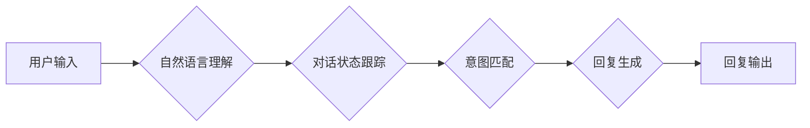

> 聊天机器人、AI代理、工作流分析、自然语言处理、对话系统、机器学习、深度学习

## 1. 背景介绍

近年来，随着人工智能技术的飞速发展，聊天机器人作为一种新型的人机交互方式，已逐渐走进人们的生活。从简单的问答系统到复杂的对话代理，聊天机器人的功能和应用场景不断拓展。然而，在构建高性能、智能化的聊天机器人时，如何有效地分析和优化其背后的工作流程，是亟待解决的关键问题。

本篇文章将深入探讨聊天机器人的工作原理，重点分析其背后的AI代理工作流，并结合具体的算法、模型和案例，阐述如何通过工作流分析提升聊天机器人的性能和用户体验。

## 2. 核心概念与联系

### 2.1 聊天机器人

聊天机器人是一种能够与人类进行自然语言交互的计算机程序。它通常通过自然语言处理（NLP）技术，理解用户的输入，并生成相应的回复。

### 2.2 AI代理

AI代理是一种能够自主执行任务的智能体，它可以根据预设的目标和环境信息，做出决策并执行相应的行动。在聊天机器人领域，AI代理扮演着核心角色，负责理解用户的意图，并生成符合语境的回复。

### 2.3 工作流分析

工作流分析是一种用于分析和优化业务流程的方法。它通过识别流程中的关键步骤、数据流和控制流，帮助我们理解流程的运作机制，并找出潜在的改进点。

### 2.4 聊天机器人工作流

聊天机器人的工作流程可以概括为以下几个步骤：

1. **用户输入:** 用户向聊天机器人发送文本或语音消息。
2. **自然语言理解:** 聊天机器人使用NLP技术分析用户的输入，识别用户的意图和实体。
3. **对话状态跟踪:** 聊天机器人跟踪对话的历史信息，理解当前对话的上下文。
4. **意图匹配:** 聊天机器人将用户的意图与预定义的意图模板进行匹配。
5. **回复生成:** 聊天机器人根据用户的意图和对话上下文，生成相应的回复。
6. **回复输出:** 聊天机器人将回复发送给用户。

**Mermaid 流程图**



## 3. 核心算法原理 & 具体操作步骤

### 3.1 算法原理概述

聊天机器人的核心算法主要包括自然语言处理、对话状态跟踪和回复生成。

* **自然语言处理 (NLP):** NLP技术用于理解和处理人类语言。常见的NLP算法包括词嵌入、词性标注、依存句法分析和命名实体识别等。

* **对话状态跟踪 (DST):** DST技术用于跟踪对话的历史信息，理解当前对话的上下文。常见的DST算法包括隐马尔可夫模型、条件随机场和循环神经网络等。

* **回复生成 (Text Generation):** 回复生成算法用于根据用户的意图和对话上下文，生成相应的回复。常见的回复生成算法包括序列到序列模型、Transformer模型和强化学习等。

### 3.2 算法步骤详解

**1. 自然语言理解:**

* **词嵌入:** 将单词映射到向量空间，捕捉单词之间的语义关系。
* **词性标注:** 识别每个单词的词性，例如名词、动词、形容词等。
* **依存句法分析:** 分析句子结构，识别单词之间的依存关系。
* **命名实体识别:** 识别句子中的实体，例如人名、地名、组织名等。

**2. 对话状态跟踪:**

* **状态表示:** 将对话历史信息表示为状态向量，包含对话参与者、对话主题、用户意图等信息。
* **状态更新:** 根据用户的输入，更新对话状态向量。
* **状态预测:** 根据对话状态向量，预测用户的意图和下一个对话动作。

**3. 回复生成:**

* **编码器-解码器架构:** 使用编码器将对话上下文编码为向量，解码器根据编码向量生成回复。
* **Transformer模型:** 使用注意力机制捕捉对话上下文中的关键信息，生成更流畅、更自然的回复。
* **强化学习:** 使用奖励机制训练回复生成模型，使其生成更符合用户期望的回复。

### 3.3 算法优缺点

**优点:**

* **自动化:** 聊天机器人可以自动处理用户请求，提高效率。
* **24/7可用:** 聊天机器人可以全天候运行，提供及时服务。
* **个性化:** 聊天机器人可以根据用户的历史交互记录，提供个性化的服务。

**缺点:**

* **理解能力有限:** 聊天机器人的理解能力仍然有限，难以理解复杂的语言和语义。
* **缺乏情感理解:** 聊天机器人的情感理解能力不足，难以提供情感支持。
* **数据依赖:** 聊天机器人的性能依赖于训练数据的质量。

### 3.4 算法应用领域

聊天机器人已广泛应用于各个领域，例如：

* **客服:** 自动处理客户咨询和投诉。
* **教育:** 提供个性化的学习辅导和答疑服务。
* **娱乐:** 提供游戏、聊天和互动娱乐服务。
* **医疗:** 提供医疗咨询和健康信息服务。

## 4. 数学模型和公式 & 详细讲解 & 举例说明

### 4.1 数学模型构建

在聊天机器人领域，常用的数学模型包括：

* **词嵌入模型:** 将单词映射到向量空间，例如Word2Vec和GloVe。
* **循环神经网络 (RNN):** 用于处理序列数据，例如LSTM和GRU。
* **Transformer模型:** 使用注意力机制捕捉对话上下文，例如BERT和GPT。

### 4.2 公式推导过程

**词嵌入模型:**

Word2Vec模型使用负采样方法训练词嵌入向量。目标函数为：

$$
J(\theta) = \sum_{i=1}^{N} \sum_{j \in \mathcal{C}(w_i)} \log \sigma(v_w^T v_{c_j}) + \sum_{i=1}^{N} \sum_{j \notin \mathcal{C}(w_i)} \log \sigma(-v_w^T v_{c_j})
$$

其中：

* $\theta$ 是模型参数。
* $N$ 是训练语料库的大小。
* $w_i$ 是第 $i$ 个单词。
* $\mathcal{C}(w_i)$ 是 $w_i$ 的上下文单词集合。
* $v_w$ 是 $w_i$ 的词嵌入向量。
* $v_{c_j}$ 是 $c_j$ 的词嵌入向量。
* $\sigma$ 是sigmoid函数。

**循环神经网络:**

RNN模型使用隐藏状态来存储对话历史信息。隐藏状态的更新公式为：

$$
h_t = f(W_{xh}x_t + W_{hh}h_{t-1} + b_h)
$$

其中：

* $h_t$ 是第 $t$ 个时间步的隐藏状态。
* $x_t$ 是第 $t$ 个时间步的输入。
* $W_{xh}$ 和 $W_{hh}$ 是权重矩阵。
* $b_h$ 是偏置项。
* $f$ 是激活函数。

### 4.3 案例分析与讲解

**词嵌入模型:**

Word2Vec模型可以捕捉单词之间的语义关系。例如，"king" 和 "queen" 两个单词的词嵌入向量相近，因为它们具有相似的语义。

**循环神经网络:**

RNN模型可以用于对话状态跟踪。通过跟踪对话历史信息，RNN模型可以预测用户的下一个对话动作。

## 5. 项目实践：代码实例和详细解释说明

### 5.1 开发环境搭建

* Python 3.x
* TensorFlow 或 PyTorch
* NLTK 或 spaCy

### 5.2 源代码详细实现

```python
# 使用 TensorFlow 实现简单的聊天机器人

import tensorflow as tf

# 定义模型
model = tf.keras.Sequential([
    tf.keras.layers.Embedding(input_dim=10000, output_dim=128),
    tf.keras.layers.LSTM(units=64),
    tf.keras.layers.Dense(units=10000, activation='softmax')
])

# 编译模型
model.compile(optimizer='adam', loss='sparse_categorical_crossentropy', metrics=['accuracy'])

# 训练模型
model.fit(x_train, y_train, epochs=10)

# 生成回复
def generate_response(text):
    # 将文本转换为词向量
    text_vector = model.layers[0].embeddings.get_weights()[0][vocab_index[text]]
    # 使用 LSTM 生成回复
    response_vector = model.layers[1].predict(tf.expand_dims(text_vector, axis=0))
    # 将回复向量转换为文本
    response = vocab_index_reverse[tf.argmax(response_vector[0]).numpy()]
    return response
```

### 5.3 代码解读与分析

* **词嵌入层:** 将单词映射到向量空间。
* **LSTM层:** 用于处理对话历史信息。
* **全连接层:** 生成回复。
* **训练过程:** 使用训练数据训练模型，优化模型参数。
* **回复生成:** 将用户输入转换为词向量，使用LSTM生成回复向量，最后将回复向量转换为文本。

### 5.4 运行结果展示

运行代码后，可以与聊天机器人进行对话。例如：

**用户:** 你好吗？

**聊天机器人:** 我很好，谢谢！

## 6. 实际应用场景

### 6.1 客服机器人

客服机器人可以自动处理客户咨询和投诉，例如：

* 回答常见问题
* 提供产品信息
* 预约服务
* 处理退换货

### 6.2 教育机器人

教育机器人可以提供个性化的学习辅导和答疑服务，例如：

* 讲解课程内容
* 练习习题
* 提供学习建议

### 6.3 娱乐机器人

娱乐机器人可以提供游戏、聊天和互动娱乐服务，例如：

* 聊天游戏
* 故事生成
* 音乐推荐

### 6.4 未来应用展望

聊天机器人将在未来应用于更广泛的领域，例如：

* 医疗保健
* 金融服务
* 人工智能助手

## 7. 工具和资源推荐

### 7.1 学习资源推荐

* **书籍:**
    * 《深度学习》
    * 《自然语言处理》
    * 《聊天机器人技术》
* **在线课程:**
    * Coursera
    * edX
    * Udacity

### 7.2 开发工具推荐

* **TensorFlow:** 开源机器学习框架
* **PyTorch:** 开源机器学习框架
* **NLTK:** 自然语言处理工具包
* **spaCy:** 自然语言处理工具包

### 7.3 相关论文推荐

* **BERT: Pre-training of Deep Bidirectional Transformers for Language Understanding**
* **GPT-3: Language Models are Few-Shot Learners**
* **Transformer: Attention Is All You Need**

## 8. 总结：未来发展趋势与挑战

### 8.1 研究成果总结

近年来，聊天机器人技术取得了显著进展，特别是深度学习技术的应用，使得聊天机器人的理解能力和生成能力大幅提升。

### 8.2 未来发展趋势

* **更强大的理解能力:** 聊天机器人将能够理解更复杂的语言和语义。
* **更自然的交互体验:** 聊天机器人将能够进行更流畅、更自然的对话。
* **更个性化的服务:** 聊天机器人将能够根据用户的喜好和需求提供个性化的服务。

### 8.3 面临的挑战

* **数据安全和隐私保护:** 聊天机器人需要处理大量用户数据，因此数据安全和隐私保护是一个重要挑战。
* **伦理问题:** 聊天机器人可能会被用于恶意目的，例如传播虚假信息或进行欺诈。
* **可解释性:** 聊天机器人的决策过程往往难以理解，这可能会导致信任问题。

### 8.4 研究展望

未来，研究人员将继续致力于