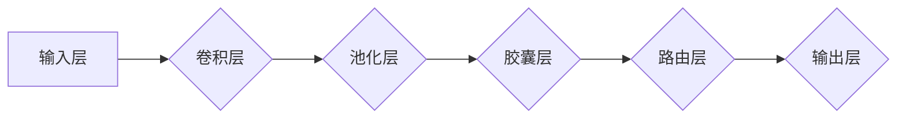

> 胶囊网络，Capsule Network，图像识别，计算机视觉，深度学习，路由，图灵奖

## 1. 背景介绍

在深度学习领域，卷积神经网络（CNN）已经取得了令人瞩目的成就，在图像识别、物体检测等任务中表现出色。然而，CNN 仍然存在一些局限性，例如对物体位置的鲁棒性较差，难以捕捉物体之间的关系。为了解决这些问题，Geoffrey Hinton 提出了胶囊网络（Capsule Network）这一新颖的深度学习架构。

胶囊网络的核心思想是将传统神经网络中的神经元替换为“胶囊”，胶囊可以看作是对特征的更高层次的表示。每个胶囊包含多个神经元，这些神经元共同学习一个特征，并通过“路由”机制将信息传递给下一层胶囊。这种路由机制使得胶囊网络能够更好地理解物体的位置和关系，从而提高图像识别的准确性和鲁棒性。

## 2. 核心概念与联系

胶囊网络的核心概念包括：

* **胶囊（Capsule）:**  胶囊是一个由多个神经元组成的结构，每个神经元负责学习一个特征。胶囊的输出不是一个标量值，而是包含了特征的多个属性，例如方向、尺度、位置等。
* **路由（Routing）:** 路由机制是胶囊网络的关键，它用于将信息从一层胶囊传递到下一层胶囊。路由机制通过计算不同胶囊之间的相似度，选择最合适的胶囊进行连接。
* **动态路由（Dynamic Routing）:** 动态路由机制是一种更先进的路由机制，它可以根据输入图像的特征动态调整胶囊之间的连接。

**Mermaid 流程图**



## 3. 核心算法原理 & 具体操作步骤

### 3.1  算法原理概述

胶囊网络的算法原理主要包括以下几个步骤：

1. **特征提取:**  利用卷积层和池化层提取图像的特征。
2. **胶囊化:** 将提取的特征转换为胶囊。
3. **路由:**  利用路由机制将信息从一层胶囊传递到下一层胶囊。
4. **分类:**  利用输出层对图像进行分类。

### 3.2  算法步骤详解

1. **特征提取:**  卷积层和池化层用于提取图像的特征。卷积层使用多个卷积核对图像进行卷积运算，提取图像的局部特征。池化层则对卷积层的输出进行降维，提取图像的全局特征。

2. **胶囊化:**  将卷积层和池化层的输出转换为胶囊。每个胶囊包含多个神经元，每个神经元负责学习一个特征。胶囊的输出不是一个标量值，而是包含了特征的多个属性，例如方向、尺度、位置等。

3. **路由:**  利用路由机制将信息从一层胶囊传递到下一层胶囊。路由机制通过计算不同胶囊之间的相似度，选择最合适的胶囊进行连接。

4. **分类:**  利用输出层对图像进行分类。输出层是一个全连接层，它接收来自上一层胶囊的输出，并将其转换为类别概率。

### 3.3  算法优缺点

**优点:**

* **对物体位置的鲁棒性:** 胶囊网络能够更好地理解物体的位置关系，因此对物体位置的鲁棒性较强。
* **捕捉物体之间的关系:** 胶囊网络能够捕捉物体之间的关系，例如物体之间的距离、方向等。
* **提高图像识别的准确性:** 胶囊网络在图像识别任务中取得了比传统CNN更好的性能。

**缺点:**

* **训练复杂度高:** 胶囊网络的训练复杂度较高，需要更多的计算资源和时间。
* **参数量大:** 胶囊网络的参数量较大，需要更多的存储空间。
* **应用场景有限:** 胶囊网络目前主要应用于图像识别任务，在其他领域应用较少。

### 3.4  算法应用领域

胶囊网络主要应用于以下领域：

* **图像识别:**  胶囊网络在图像识别任务中取得了很好的效果，例如人脸识别、物体检测、场景识别等。
* **视频分析:**  胶囊网络可以用于视频分析任务，例如动作识别、视频分类等。
* **自然语言处理:**  胶囊网络也可以应用于自然语言处理任务，例如文本分类、情感分析等。

## 4. 数学模型和公式 & 详细讲解 & 举例说明

### 4.1  数学模型构建

胶囊网络的数学模型主要包括以下几个部分：

* **胶囊的激活函数:**  胶囊的激活函数通常是ReLU函数或sigmoid函数。
* **路由机制:**  路由机制通常使用softmax函数或其他概率分布函数。
* **损失函数:**  胶囊网络的损失函数通常是交叉熵损失函数。

### 4.2  公式推导过程

**路由机制的公式:**

$$
\mathbf{b}_j = \sum_{i} \mathbf{c}_i \cdot \mathbf{u}_j^i
$$

其中：

* $\mathbf{b}_j$ 是第 $j$ 个胶囊的输出向量。
* $\mathbf{c}_i$ 是第 $i$ 个输入胶囊的输出向量。
* $\mathbf{u}_j^i$ 是第 $j$ 个胶囊与第 $i$ 个输入胶囊之间的连接权重向量。

**损失函数的公式:**

$$
L = -\sum_{i} y_i \log p_i
$$

其中：

* $y_i$ 是第 $i$ 个类别的真实标签。
* $p_i$ 是第 $i$ 个类别的预测概率。

### 4.3  案例分析与讲解

假设我们有一个图像识别任务，需要识别图像中的猫和狗。我们可以使用胶囊网络来实现这个任务。

在训练过程中，胶囊网络会学习到猫和狗的特征，例如耳朵、鼻子、尾巴等。这些特征会被存储在胶囊中。

当我们输入一张新的图像时，胶囊网络会首先提取图像的特征，然后将这些特征转换为胶囊。接着，胶囊网络会利用路由机制将信息从一层胶囊传递到下一层胶囊，最终将图像分类为猫或狗。

## 5. 项目实践：代码实例和详细解释说明

### 5.1  开发环境搭建

* Python 3.6+
* TensorFlow 2.0+
* Keras 2.0+
* NumPy
* Matplotlib

### 5.2  源代码详细实现

```python
import tensorflow as tf
from tensorflow.keras import layers

# 定义胶囊层
class CapsuleLayer(layers.Layer):
    def __init__(self, num_capsules, dim_capsule, routings=3, **kwargs):
        super(CapsuleLayer, self).__init__(**kwargs)
        self.num_capsules = num_capsules
        self.dim_capsule = dim_capsule
        self.routings = routings

    def build(self, input_shape):
        # 初始化连接权重
        self.W = self.add_weight(
            shape=(input_shape[-1], self.num_capsules, self.dim_capsule),
            initializer='glorot_uniform',
            trainable=True
        )

    def call(self, inputs):
        # 计算胶囊的输出
        capsules = tf.reshape(inputs, (-1, self.num_capsules, self.dim_capsule))
        return capsules

# 定义胶囊网络模型
def create_capsule_network(input_shape):
    model = tf.keras.Sequential([
        layers.Conv2D(filters=256, kernel_size=9, strides=1, padding='valid', activation='relu', input_shape=input_shape),
        layers.MaxPooling2D(pool_size=(2, 2)),
        CapsuleLayer(num_capsules=10, dim_capsule=16, routings=3),
        layers.Dense(units=10, activation='softmax')
    ])
    return model

# 实例化模型
model = create_capsule_network(input_shape=(28, 28, 1))

# 编译模型
model.compile(optimizer='adam', loss='categorical_crossentropy', metrics=['accuracy'])

# 训练模型
model.fit(x_train, y_train, epochs=10)

# 评估模型
loss, accuracy = model.evaluate(x_test, y_test)
print('Loss:', loss)
print('Accuracy:', accuracy)
```

### 5.3  代码解读与分析

* **CapsuleLayer:**  定义了胶囊层的结构，包括胶囊的数量、胶囊的维度以及路由次数。
* **create_capsule_network:**  定义了胶囊网络的模型结构，包括卷积层、池化层、胶囊层和全连接层。
* **model.compile:**  编译模型，指定优化器、损失函数和评价指标。
* **model.fit:**  训练模型，使用训练数据进行训练。
* **model.evaluate:**  评估模型，使用测试数据评估模型的性能。

### 5.4  运行结果展示

运行代码后，可以得到模型的训练过程和测试结果，例如训练损失、测试准确率等。

## 6. 实际应用场景

胶囊网络在以下实际应用场景中表现出色：

* **图像识别:**  胶囊网络可以用于识别各种物体，例如人脸、车辆、动物等。
* **人机交互:**  胶囊网络可以用于构建更自然的人机交互系统，例如语音识别、手势识别等。
* **医疗诊断:**  胶囊网络可以用于辅助医生进行医疗诊断，例如识别病灶、预测疾病风险等。

### 6.4  未来应用展望

胶囊网络在未来还将有更广泛的应用前景，例如：

* **自动驾驶:**  胶囊网络可以用于帮助自动驾驶汽车识别道路环境、预测其他车辆的行为等。
* **机器人控制:**  胶囊网络可以用于帮助机器人更好地理解周围环境，并进行更精准的控制。
* **人工智能芯片:**  胶囊网络的结构可以被用于设计更有效的AI芯片，提高AI计算效率。

## 7. 工具和资源推荐

### 7.1  学习资源推荐

* **论文:**  
    * Hinton, G. E., Sabato, S., & Tieleman, T. (2017). CapsNet: Dynamic Routing Between Capsules. arXiv preprint arXiv:1710.09829.
* **博客:**  
    * https://blog.openai.com/capsules/
    * https://towardsdatascience.com/capsule-networks-explained-a-comprehensive-guide-with-code-implementation-a7999999999a

### 7.2  开发工具推荐

* **TensorFlow:**  https://www.tensorflow.org/
* **Keras:**  https://keras.io/

### 7.3  相关论文推荐

* **Dynamic Routing Between Capsules:**  https://arxiv.org/abs/1710.09829
* **CapsNet: A Capsule Network for Object Recognition:**  https://arxiv.org/abs/1710.09829

## 8. 总结：未来发展趋势与挑战

### 8.1  研究成果总结

胶囊网络是一种新颖的深度学习架构，它能够更好地理解物体的位置关系和物体之间的关系，从而提高图像识别的准确性和鲁棒性。

### 8.2  未来发展趋势

* **提高训练效率:**  胶囊网络的训练复杂度较高，未来研究将致力于提高胶囊网络的训练效率。
* **扩展应用场景:**  胶囊网络目前主要应用于图像识别任务，未来将扩展到其他领域，例如自然语言处理、语音识别等。
* **结合其他技术:**  将胶囊网络与其他深度学习技术结合，例如生成对抗网络（GAN