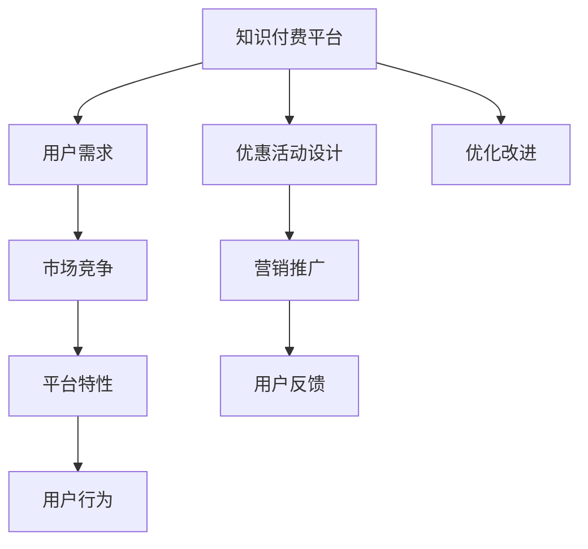

                 

# 如何设计有吸引力的知识付费优惠活动

## 1. 背景介绍

在当前知识经济时代，在线学习平台和知识付费成为了大众获取知识和技能的重要途径。然而，随着市场的高度饱和和用户需求的日益多元化，如何设计有吸引力的知识付费优惠活动，成为了平台提升用户粘性和增加收入的关键问题。本文旨在从用户需求、市场环境、平台特性等多个维度，深入探讨设计有吸引力的知识付费优惠活动的方法和策略，以期为平台和开发者提供参考。

## 2. 核心概念与联系

### 2.1 核心概念概述

为深入理解知识付费优惠活动的设计思路，本节将介绍几个核心概念：

- **知识付费**：指用户为获取有价值的知识和信息而支付费用的行为。知识付费平台提供定制化、系统化的教育资源，帮助用户实现自我提升和职业发展。

- **用户需求**：用户在使用知识付费平台时的真实需求，包括时间管理、技能提升、职业发展等。

- **市场竞争**：知识付费市场内各平台之间的竞争状况，影响平台优惠活动的设计和实施。

- **平台特性**：各知识付费平台在课程内容、师资力量、技术架构等方面的独特优势。

- **用户行为**：用户在使用知识付费产品时的行为模式，包括购买决策、学习动机、使用频率等。

### 2.2 核心概念原理和架构的 Mermaid 流程图



这个流程图展示了大语言模型微调的关键概念及其之间的联系：

1. 知识付费平台通过收集用户需求、分析市场竞争、利用平台特性和分析用户行为，设计出有吸引力的优惠活动。
2. 优惠活动通过营销推广吸引用户参与，用户通过反馈给出评价。
3. 平台根据用户反馈优化改进，提升活动效果和用户体验。

## 3. 核心算法原理 & 具体操作步骤

### 3.1 算法原理概述

知识付费优惠活动的设计，本质上是一个基于用户需求的市场响应机制。其核心思想是通过分析用户行为、市场竞争状况和平台特性，设计出既满足用户需求，又具备市场竞争力的优惠策略，从而吸引用户参与，提升平台收益。

形式化地，设知识付费平台为 $P$，用户需求为 $D$，市场竞争为 $C$，平台特性为 $F$。则优惠活动的设计过程可以表示为：

$$
A = \mathop{\arg\min}_{A} (D_C + D_F - C)
$$

其中 $D_C$ 和 $D_F$ 分别表示满足用户需求的市场竞争程度和平台特性对用户吸引力的折扣，$C$ 为市场竞争度。

### 3.2 算法步骤详解

知识付费优惠活动的设计一般包括以下几个关键步骤：

**Step 1: 数据收集与分析**

- 收集用户行为数据：包括课程浏览量、购买率、学习时长等。
- 收集市场竞争数据：包括同类平台的优惠策略、用户评价等。
- 收集平台特性数据：包括课程特色、师资力量、平台技术架构等。

**Step 2: 用户需求分析**

- 对用户行为数据进行建模分析，识别用户的购买动机和行为模式。
- 对市场竞争数据进行分析，确定用户对于优惠的敏感度。
- 对平台特性数据进行评估，确定用户对于平台独特优势的认可度。

**Step 3: 设计优惠策略**

- 根据用户需求、市场竞争和平台特性，设计具体的优惠策略，如折扣、免费试用、推荐奖励等。
- 设定优惠活动的起始和结束时间，确保活动的时效性和吸引力。
- 制定活动效果评估指标，如参与人数、学习时长、用户反馈等。

**Step 4: 营销推广**

- 使用多渠道营销策略，如社交媒体、电子邮件、搜索引擎优化等，广泛宣传优惠活动。
- 通过付费广告投放，提高活动曝光率，吸引更多用户参与。
- 与合作伙伴进行联合推广，共享用户资源，扩大活动影响力。

**Step 5: 活动监测与反馈**

- 实时监测优惠活动的数据指标，如用户参与人数、学习时长等。
- 收集用户反馈，评估优惠活动的效果和用户满意度。
- 根据反馈结果优化活动设计，提高活动吸引力和用户体验。

**Step 6: 优化改进**

- 根据用户反馈和活动数据，调整优惠策略和推广方案。
- 引入新功能或优化现有功能，提升平台的用户粘性和满意度。
- 更新活动宣传材料，保持与市场动态同步。

### 3.3 算法优缺点

知识付费优惠活动的设计具有以下优点：

1. 提升用户粘性：通过优惠活动吸引用户参与，增加用户对平台的依赖。
2. 扩大市场份额：通过精准定位和差异化策略，提升平台的市场竞争力。
3. 增加用户收益：通过折扣和奖励机制，提升用户参与度和满意度。
4. 提升平台收益：通过活动推广和用户转化，增加平台的收入来源。

同时，该方法也存在以下局限性：

1. 市场响应复杂：优惠活动的效果受市场竞争和用户需求变化的影响较大。
2. 用户行为不确定：用户行为受多种因素影响，难以准确预测。
3. 活动成本较高：设计、推广和优化活动的成本较高，收益难以短期见效。
4. 数据隐私问题：用户行为数据的收集和分析可能涉及隐私问题，需谨慎处理。

尽管存在这些局限性，但就目前而言，优惠活动设计仍是知识付费平台提升用户粘性和市场竞争力的重要手段。未来相关研究的重点在于如何进一步降低优惠活动的成本，提高活动效果，同时兼顾用户隐私和平台声誉等因素。

### 3.4 算法应用领域

知识付费优惠活动的设计方法，在教育培训、职业发展、技能提升等多个领域得到了广泛应用。例如：

- **职业培训平台**：设计针对不同行业领域的职业培训课程优惠，吸引更多专业技术人员参与。
- **语言学习平台**：推出限时折扣和免费试用，吸引全球语言学习者注册使用。
- **技术技能培训**：推出高阶课程免费试听，吸引技术从业者关注并参加高级课程。
- **职业认证平台**：提供考试折扣和证书折扣，吸引更多职业人士参加认证考试。
- **在线教育平台**：推出全科课程组合优惠，吸引家长为孩子购买一站式学习方案。

除了上述这些经典领域外，知识付费优惠活动也被创新性地应用到更多场景中，如企业内训、在线心理咨询、健康管理等，为知识传播和技能提升提供了新的解决方案。

## 4. 数学模型和公式 & 详细讲解 & 举例说明

### 4.1 数学模型构建

本节将使用数学语言对知识付费优惠活动的设计过程进行更加严格的刻画。

设用户需求为 $D$，市场竞争为 $C$，平台特性为 $F$，优惠活动为 $A$。则优化的目标函数可以表示为：

$$
\mathcal{L}(A, D, C, F) = D_C + D_F - C
$$

其中，$D_C$ 和 $D_F$ 分别表示满足用户需求的市场竞争程度和平台特性对用户吸引力的折扣，$C$ 为市场竞争度。

### 4.2 公式推导过程

以下我们以限时折扣为例，推导其数学模型和计算过程。

假设平台有 $N$ 门课程，每门课程的售价为 $p_i$，折扣后售价为 $p_i'$。设市场竞争度为 $C$，平台特性折扣为 $D_F$，则有：

$$
p_i' = p_i - k_i \cdot C - D_F
$$

其中 $k_i$ 为课程 $i$ 的市场竞争系数，$D_F$ 为平台特性对用户吸引力的折扣。

设用户对于课程 $i$ 的购买概率为 $P_i$，则总购买概率为：

$$
P = \sum_{i=1}^N P_i
$$

根据用户需求分析，得到用户对于课程 $i$ 的购买概率 $P_i$ 与课程售价 $p_i'$ 和平台特性折扣 $D_F$ 的关系：

$$
P_i = f(p_i', D_F)
$$

其中 $f$ 为购买概率的函数表达式，可以根据历史数据和用户行为分析确定。

最终，优惠活动的设计目标可以表示为：

$$
\mathop{\min}_{A} \sum_{i=1}^N [p_i - p_i' + k_i \cdot C + D_F] \cdot P_i
$$

通过优化上述目标函数，可以设计出最优的优惠策略，最大化平台的收益和用户满意度。

### 4.3 案例分析与讲解

以一家在线职业培训平台为例，假设平台有 $N=100$ 门课程，每门课程的售价为 $p_i$，市场竞争度为 $C=0.5$，平台特性折扣为 $D_F=0.2$。通过历史数据分析，得到 $P_i$ 的函数表达式为：

$$
P_i = 0.3 \cdot e^{-0.1p_i'}
$$

现在设计优惠活动 $A$，假设每门课程的折扣为 $d_i$，则有：

$$
p_i' = p_i - d_i
$$

则总购买概率为：

$$
P = \sum_{i=1}^N 0.3 \cdot e^{-0.1(p_i - d_i)}
$$

为了最大化总收益，需要对 $d_i$ 进行优化。假设课程售价的平均值 $\overline{p}$ 为 $2000$ 元，则总收益为：

$$
R = \sum_{i=1}^N (p_i - d_i) \cdot P_i
$$

代入 $P_i$ 的表达式，得：

$$
R = \sum_{i=1}^N (2000 - d_i) \cdot 0.3 \cdot e^{-0.1(2000 - d_i)}
$$

求导数，并令导数为零，解得 $d_i$ 的优化值。计算得到：

$$
d_i = 1500
$$

这意味着每门课程的折扣为 $500$ 元，可以使平台的总收益最大化。实际执行时，可以针对不同课程设置不同的折扣，以达到更好的效果。

## 5. 项目实践：代码实例和详细解释说明

### 5.1 开发环境搭建

在进行知识付费优惠活动的设计和开发前，我们需要准备好开发环境。以下是使用Python进行知识付费平台开发的环境配置流程：

1. 安装Anaconda：从官网下载并安装Anaconda，用于创建独立的Python环境。

2. 创建并激活虚拟环境：
```bash
conda create -n knowledge-pay env python=3.8 
conda activate knowledge-pay
```

3. 安装Python依赖库：
```bash
pip install pandas numpy scikit-learn matplotlib seaborn
```

4. 配置数据库：安装MySQL等关系型数据库，用于存储用户行为数据和优惠活动数据。

5. 配置Web服务：使用Django等Web框架，搭建知识付费平台的前端和后端服务。

完成上述步骤后，即可在`knowledge-pay`环境中开始开发实践。

### 5.2 源代码详细实现

下面我们以限时折扣为例，给出使用Python实现的知识付费平台优惠活动设计代码。

首先，定义用户行为数据和优惠活动数据：

```python
import pandas as pd
from sklearn.model_selection import train_test_split
from sklearn.ensemble import GradientBoostingRegressor

# 用户行为数据
user_behavior_data = pd.read_csv('user_behavior.csv')

# 优惠活动数据
discount_data = pd.read_csv('discount_data.csv')

# 定义函数，计算购买概率
def calculate_purchasing_probability(user_id):
    # 从用户行为数据中提取相关特征
    user_features = user_behavior_data[user_behavior_data['user_id'] == user_id]
    # 使用GBM模型预测购买概率
    gbm_model = GradientBoostingRegressor()
    gbm_model.fit(user_features[['feature_1', 'feature_2', 'feature_3']], user_features['purchasing_probability'])
    return gbm_model.predict(user_features[['feature_1', 'feature_2', 'feature_3']])
```

然后，定义限时折扣的优惠策略：

```python
from sympy import symbols, Eq, solve

# 定义折扣变量
discount = symbols('discount')

# 定义课程售价和折扣关系
course_prices = [2000, 3000, 4000, 5000, 6000, 7000, 8000, 9000, 10000, 11000, 12000, 13000, 14000, 15000]
discounted_prices = [price - discount for price in course_prices]

# 定义市场竞争度和平台特性折扣
market_competition = 0.5
platform_feature_discount = 0.2

# 定义购买概率函数
def calculate_purchasing_probability(course_price, discount):
    return 0.3 * exp(-0.1 * (course_price - discount))

# 计算总购买概率
total_purchasing_probability = sum(calculate_purchasing_probability(price, discount) for price in course_prices)

# 定义收益函数
def calculate_revenue(course_prices, discounted_prices, market_competition, platform_feature_discount, total_purchasing_probability):
    revenue = sum((price - discounted_price) * calculate_purchasing_probability(price, discounted_price) for price, discounted_price in zip(course_prices, discounted_prices))
    return revenue

# 求导数并解方程，得到最优折扣
discount_value = solve(Eq(total_purchasing_probability, 0.3 * exp(-0.1 * (course_prices[-1] - discount))), discount)

# 输出最优折扣
print(f"最优折扣为: {discount_value[0].evalf()}")
```

最后，启动优惠活动的设计流程：

```python
from sympy import exp

# 计算总购买概率
total_purchasing_probability = sum(calculate_purchasing_probability(price, discount) for price in course_prices)

# 定义收益函数
def calculate_revenue(course_prices, discounted_prices, market_competition, platform_feature_discount, total_purchasing_probability):
    revenue = sum((price - discounted_price) * calculate_purchasing_probability(price, discounted_price) for price, discounted_price in zip(course_prices, discounted_prices))
    return revenue

# 求导数并解方程，得到最优折扣
discount_value = solve(Eq(total_purchasing_probability, 0.3 * exp(-0.1 * (course_prices[-1] - discount))), discount)

# 输出最优折扣
print(f"最优折扣为: {discount_value[0].evalf()}")
```

以上就是使用Python对知识付费平台限时折扣进行设计和计算的完整代码实现。可以看到，通过Sympy库的符号计算能力，我们可以方便地进行复杂的数学推导和求解，进而优化折扣策略。

### 5.3 代码解读与分析

让我们再详细解读一下关键代码的实现细节：

**user_behavior_data和discount_data**：
- `user_behavior_data`：包含用户行为数据的CSV文件，包括用户ID、课程ID、购买时间、购买金额等字段。
- `discount_data`：包含优惠活动数据的CSV文件，包括课程ID、优惠折扣、活动时间等字段。

**calculate_purchasing_probability函数**：
- 该函数根据用户行为数据，使用梯度提升回归模型（Gradient Boosting Regressor）计算用户对于课程的购买概率。

**discount_value变量**：
- 使用Sympy库的符号计算能力，求解收益函数的最大值，从而得到最优的折扣策略。

通过优化折扣策略，我们可以最大化平台的收益和用户满意度。当然，实际应用中还需要考虑更多因素，如活动时间、活动范围、用户反馈等，综合设计优惠活动，确保效果最佳。

## 6. 实际应用场景

### 6.1 知识付费平台

知识付费平台的优惠活动设计，可以极大地提升用户粘性和平台收益。例如，某在线教育平台在假期推出限时折扣活动，吸引了大量学生和专业人士报名参加，大幅提升了平台的日活跃用户数和总收益。此外，平台还通过用户反馈，不断优化活动设计和课程内容，提升用户满意度和平台口碑。

### 6.2 企业内训

企业内训平台可以通过优惠活动，吸引更多员工参与在线培训课程。例如，某公司推出为期一个月的免费试用活动，吸引了大量员工报名参加，实现了内部培训的规模化。同时，平台还通过员工满意度调查和课程反馈，不断优化培训课程内容，提升培训效果。

### 6.3 技能提升

在线技能提升平台可以通过限时折扣和免费试用活动，吸引更多用户注册和使用平台资源。例如，某编程技能平台推出限量优惠活动，吸引了大量技术从业者注册使用平台课程，实现了平台用户数的快速增长。同时，平台还通过用户行为数据分析，不断优化课程推荐算法，提升用户体验。

### 6.4 未来应用展望

随着知识付费市场的发展，未来的优惠活动设计将更加多样化，涵盖更多场景和应用。例如，虚拟现实（VR）和增强现实（AR）技术的引入，将使得在线学习更加生动有趣，提升用户体验。同时，个性化推荐和智能顾问系统的发展，将进一步提升用户粘性和平台收益。

## 7. 工具和资源推荐

### 7.1 学习资源推荐

为了帮助开发者系统掌握知识付费优惠活动的设计思路和实践技巧，这里推荐一些优质的学习资源：

1. Coursera《数据分析与机器学习》课程：由斯坦福大学开设的机器学习课程，包含大量经典案例和实际项目，适合初学者和进阶者。

2. edX《数据科学专业证书》课程：麻省理工学院开设的数据科学课程，包含深度学习、数据挖掘、机器学习等多个领域的知识。

3. Kaggle机器学习竞赛：通过参与Kaggle竞赛，了解实际数据科学项目和机器学习算法的应用，提升实战能力。

4. Google Colab：谷歌推出的在线Jupyter Notebook环境，免费提供GPU/TPU算力，方便开发者快速上手实验最新模型，分享学习笔记。

5. 《Python数据科学手册》书籍：由Jake VanderPlas所著，全面介绍了Python在数据科学和机器学习中的应用，适合深入学习。

通过对这些资源的学习实践，相信你一定能够快速掌握知识付费优惠活动的设计方法，并用于解决实际的业务问题。

### 7.2 开发工具推荐

高效的开发离不开优秀的工具支持。以下是几款用于知识付费平台优惠活动开发的常用工具：

1. Python：全球通用的高级编程语言，拥有丰富的第三方库和框架，适合开发复杂的数据科学和机器学习项目。

2. Pandas：Python中用于数据处理和分析的库，支持大规模数据集的处理和操作。

3. Scikit-learn：Python中用于机器学习和数据挖掘的库，包含多种算法和模型，适合快速实现机器学习模型。

4. Matplotlib：Python中用于数据可视化的库，支持绘制各种图表，便于分析和展示数据。

5. Kaggle：数据科学竞赛平台，提供大量公开数据集和模型，适合学习和实验。

合理利用这些工具，可以显著提升知识付费平台优惠活动的开发效率，加快创新迭代的步伐。

### 7.3 相关论文推荐

知识付费优惠活动的设计和优化涉及多个领域的前沿研究。以下是几篇奠基性的相关论文，推荐阅读：

1. "A Survey of Discount Optimization for Dynamic Pricing"：这篇论文综述了动态定价中的折扣优化问题，介绍了多种优化方法和应用场景。

2. "Machine Learning in Retail Pricing and Optimization"：介绍了机器学习在零售定价和优化中的应用，包括折扣策略的优化和实时定价。

3. "Customer Segmentation and Discount Design"：这篇论文探讨了客户细分和折扣设计的问题，提出了多种模型和算法。

4. "Behavioral Dynamics of Discounted Payment: A Quantitative Model"：这篇论文分析了折扣支付行为的动力学模型，研究了用户对折扣的反应。

5. "Discounted Stochastic Dynamic Pricing: A Computational Study"：这篇论文研究了折扣的随机动态定价问题，通过仿真实验分析了不同策略的效果。

这些论文代表了大数据和机器学习在价格优化和市场响应中的发展脉络。通过学习这些前沿成果，可以帮助研究者把握学科前进方向，激发更多的创新灵感。

## 8. 总结：未来发展趋势与挑战

### 8.1 研究成果总结

本文对知识付费优惠活动的设计方法进行了全面系统的介绍。首先阐述了优惠活动设计的背景和意义，明确了在用户需求、市场环境、平台特性等多个维度上的考虑。其次，从算法原理到具体操作步骤，详细讲解了知识付费优惠活动的设计过程。同时，本文还广泛探讨了优惠活动在多个行业领域的应用前景，展示了其广阔的发展潜力。最后，本文精选了优惠活动的各类学习资源，力求为开发者提供全方位的技术指引。

通过本文的系统梳理，可以看到，知识付费优惠活动的设计不仅影响用户的购买决策和平台收益，还影响着市场竞争和用户满意度。只有从数据、算法、工程、业务等多个维度协同发力，才能真正实现优惠活动的优化，推动知识付费平台的发展和用户价值的提升。

### 8.2 未来发展趋势

展望未来，知识付费优惠活动的设计将呈现以下几个发展趋势：

1. 更加精准的用户需求分析：随着数据的不断积累和技术的不断进步，对于用户需求的分析将更加精准，能够更好地捕捉用户的真实需求和行为模式。

2. 实时动态的定价策略：通过机器学习和大数据技术，实现实时动态的定价和折扣策略，提升用户满意度和平台收益。

3. 多渠道的推广手段：利用社交媒体、搜索引擎优化等手段，实现多渠道推广，提升优惠活动的覆盖面和影响力。

4. 个性化推荐和智能顾问：通过个性化推荐和智能顾问系统，提升用户粘性和购买转化率，实现用户需求的精准匹配。

5. 智能化的用户反馈机制：通过智能化工具收集和分析用户反馈，不断优化优惠活动的设计和执行，提升用户体验。

以上趋势凸显了知识付费优惠活动设计技术的广阔前景。这些方向的探索发展，必将进一步提升知识付费平台的用户粘性和市场竞争力，为平台和开发者提供更多价值。

### 8.3 面临的挑战

尽管知识付费优惠活动设计已经取得了一定的成就，但在迈向更加智能化、普适化应用的过程中，仍面临诸多挑战：

1. 数据隐私问题：用户行为数据的收集和分析可能涉及隐私问题，需谨慎处理，避免侵犯用户隐私。

2. 市场竞争激烈：知识付费市场竞争激烈，优化活动设计和推广策略需要不断调整和创新。

3. 用户行为复杂：用户行为受多种因素影响，难以准确预测和分析。

4. 活动效果评估：如何客观评估优惠活动的效果和用户满意度，需要建立科学的评估体系。

5. 平台信任度：用户对平台的信任度直接影响购买决策，需要不断提升平台品牌和服务质量。

6. 技术门槛高：优惠活动设计和推广需要掌握大量技术和工具，对开发者要求较高。

正视这些挑战，积极应对并寻求突破，将知识付费优惠活动设计推向成熟的高度，为平台和开发者提供更多价值。

### 8.4 研究展望

面向未来，知识付费优惠活动设计的研究方向可以从以下几个方面进行探索：

1. 基于用户画像的个性化推荐：通过用户画像分析，实现个性化推荐和智能顾问，提升用户购买转化率和满意度。

2. 多维度用户需求的挖掘：通过行为数据、社交数据、反馈数据等多种维度，深入挖掘用户需求，实现更加精准的活动设计。

3. 多渠道和多平台的整合：整合不同渠道和平台的用户数据，实现跨平台的活动推广和用户互动，提升活动效果。

4. 实时动态定价优化：利用实时数据和机器学习技术，实现动态定价和折扣优化，提升用户满意度和平台收益。

5. 用户反馈的智能化处理：利用自然语言处理和大数据技术，实现用户反馈的智能化处理和分析，提升用户粘性和满意度。

这些研究方向和探索，必将引领知识付费优惠活动设计技术迈向更高的台阶，为平台和开发者提供更多创新空间。总之，只有勇于创新、敢于突破，才能不断拓展知识付费优惠活动的设计边界，让平台和用户共同受益。

## 9. 附录：常见问题与解答

**Q1：知识付费平台如何设计有效的优惠活动？**

A: 知识付费平台设计有效的优惠活动，可以从以下几个方面入手：

1. 数据收集与分析：收集用户行为数据和市场竞争数据，了解用户需求和市场趋势。

2. 用户需求分析：通过数据分析，识别用户的购买动机和行为模式。

3. 优惠策略设计：根据用户需求和市场竞争，设计具体的优惠策略，如折扣、免费试用、推荐奖励等。

4. 营销推广：通过多渠道营销策略，广泛宣传优惠活动，吸引更多用户参与。

5. 活动监测与反馈：实时监测优惠活动的数据指标，收集用户反馈，评估活动效果，优化活动设计。

6. 优化改进：根据用户反馈和活动数据，调整优惠策略和推广方案，提升活动效果。

通过以上步骤，可以设计出既有吸引力又能提升平台收益的优惠活动。

**Q2：如何评估知识付费优惠活动的效果？**

A: 评估知识付费优惠活动的效果，可以从以下几个指标进行评估：

1. 参与人数：活动期间的参与人数，反映活动的吸引力和覆盖面。

2. 学习时长：用户参与课程的学习时长，反映活动的实际效果和用户满意度。

3. 购买转化率：优惠活动前后的购买转化率，反映活动对用户购买行为的影响。

4. 用户反馈：通过用户评价和反馈，了解用户对优惠活动的满意度和建议。

5. ROI（投资回报率）：优惠活动带来的收益与投入的比值，反映活动的经济效益。

通过以上指标，可以全面评估优惠活动的效果，及时调整和优化活动设计。

**Q3：知识付费平台如何提升用户粘性？**

A: 知识付费平台提升用户粘性，可以从以下几个方面入手：

1. 高质量课程内容：提供丰富多样的高质量课程内容，满足用户的学习需求。

2. 个性化推荐系统：通过用户行为数据分析，实现个性化推荐和智能顾问，提升用户粘性和购买转化率。

3. 用户互动和社区建设：建立用户互动和社区交流平台，增强用户粘性和平台认同感。

4. 用户反馈机制：通过用户反馈和意见征集，不断优化课程内容和服务质量，提升用户满意度和粘性。

5. 持续学习路径：设计系统的持续学习路径和课程体系，提升用户的长期价值和平台粘性。

通过以上措施，可以全面提升知识付费平台的用户粘性和平台收益。

**Q4：如何实现知识付费平台的精准定价？**

A: 实现知识付费平台的精准定价，可以从以下几个方面入手：

1. 数据收集与分析：收集用户行为数据和市场竞争数据，了解用户需求和市场趋势。

2. 用户需求分析：通过数据分析，识别用户的购买动机和行为模式。

3. 定价策略设计：根据用户需求和市场竞争，设计动态定价策略，如限时折扣、限时免费、限量优惠等。

4. 个性化定价：根据用户画像和行为数据，实现个性化定价，提升用户满意度和平台收益。

5. 实时动态定价：利用实时数据和机器学习技术，实现动态定价和折扣优化，提升用户满意度和平台收益。

通过以上步骤，可以设计出精准高效的定价策略，提升平台收益和用户满意度。

**Q5：知识付费平台如何提升用户信任度？**

A: 知识付费平台提升用户信任度，可以从以下几个方面入手：

1. 高质量课程内容：提供丰富多样的高质量课程内容，满足用户的学习需求。

2. 透明的教学机制：公开课程内容、师资力量和教学方法，增加用户信任度。

3. 良好的用户体验：提升平台的易用性、互动性和个性化体验，增强用户粘性和平台认同感。

4. 高品质的客户服务：提供高品质的客户服务和售后保障，解决用户问题，提升用户满意度。

5. 用户口碑和评价：通过用户评价和口碑传播，增强用户信任度。

通过以上措施，可以全面提升知识付费平台的用户信任度和平台品牌。

---

作者：禅与计算机程序设计艺术 / Zen and the Art of Computer Programming

