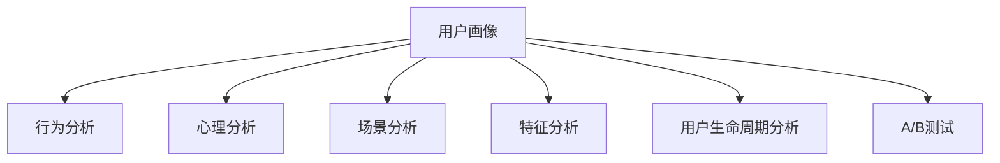

                 

# 如何进行有效的用户分析

## 1. 背景介绍

### 1.1 问题由来

在数字化转型的浪潮中，企业愈发重视用户体验（User Experience, UX）的重要性。如何通过数据驱动的方式，深入理解用户行为、偏好和需求，已成为提升用户体验、优化业务流程的关键问题。用户分析（User Analysis）作为用户体验设计的核心环节，通过采集、处理和分析用户数据，获取用户画像，为产品设计、运营优化、市场策略等决策提供数据支撑。

### 1.2 问题核心关键点

用户分析的关键在于构建准确的**用户画像**（User Persona），即对特定用户群体的行为特征、心理特征和需求动机进行提炼，形成可操作、可量化的分析结果。这不仅能帮助企业更精准地定位目标用户，还能指导产品和服务的设计与优化，提升用户满意度和忠诚度。

用户分析的难点在于数据量巨大且异构，且用户行为具有复杂性、多样性和动态性，如何从海量数据中挖掘出有价值的用户行为模式，并形成有效的操作指南，是一项具有挑战性的任务。

## 2. 核心概念与联系

### 2.1 核心概念概述

用户分析涉及多个核心概念，通过以下表格梳理其基本概念和关联：

| 概念         | 定义                                                         | 作用                                                         |
| ------------ | ------------------------------------------------------------ | ------------------------------------------------------------ |
| 用户画像     | 基于特定用户群体的行为特征、心理特征和需求动机提炼出的可操作、可量化的分析结果。 | 帮助企业更精准地定位目标用户，指导产品和服务的设计与优化。     |
| 行为分析     | 对用户的操作行为、使用路径、停留时间等行为数据进行分析。           | 挖掘用户行为模式，识别关键操作节点，优化产品用户体验。         |
| 心理分析     | 通过调查问卷、访谈等方式收集用户的心理特征、需求动机等信息。         | 深入理解用户深层次需求，指导产品功能和内容的创新。             |
| 场景分析     | 在特定情境下，对用户的行为和心理进行分析。                       | 帮助企业模拟用户使用场景，提升产品决策的准确性。                |
| 特征分析     | 对用户的基本属性、兴趣偏好、设备使用情况等进行分析。               | 构建多维度的用户特征，辅助用户细分和群体识别。                 |
| 用户生命周期分析 | 对用户在不同阶段的行为变化进行跟踪分析，识别各阶段的转化点和流失原因。 | 优化用户留存和转化策略，提升用户生命周期价值。                  |
| A/B测试       | 对两种或以上版本的产品或服务进行对比测试，分析不同版本的用户反馈。 | 评估产品改进效果，优化产品功能和性能。                         |

### 2.2 核心概念原理和架构的 Mermaid 流程图



这个流程图展示了用户分析的基本流程，各概念相互关联，共同支撑用户画像的构建。

## 3. 核心算法原理 & 具体操作步骤

### 3.1 算法原理概述

用户分析的算法原理主要包括数据预处理、特征工程、模型训练与评估、用户画像构建等环节。这些环节通过数学模型、算法和工具，对用户数据进行深入分析，形成有意义的洞察。

### 3.2 算法步骤详解

#### 3.2.1 数据预处理

数据预处理是用户分析的第一步，主要包含以下步骤：

1. **数据采集**：通过用户行为日志、调查问卷、社交媒体等渠道收集用户数据。
2. **数据清洗**：去除噪音数据、填补缺失值、处理异常值，确保数据质量。
3. **数据标注**：对数据进行标签化处理，便于后续分析。

#### 3.2.2 特征工程

特征工程是用户分析的核心环节，主要包含以下步骤：

1. **特征提取**：从原始数据中提取有意义的特征，如行为特征（点击次数、停留时间等）、心理特征（年龄、性别、兴趣爱好等）。
2. **特征选择**：选择对用户分析有价值的特征，去除冗余特征。
3. **特征转换**：通过归一化、标准化等方法，将特征转换为适合模型训练的形式。

#### 3.2.3 模型训练与评估

模型训练与评估是用户分析的落脚点，主要包含以下步骤：

1. **模型选择**：选择适合用户分析的机器学习模型，如分类模型、聚类模型、回归模型等。
2. **模型训练**：使用训练集数据训练模型，调整超参数，确保模型性能。
3. **模型评估**：使用测试集数据评估模型性能，选择最优模型。

#### 3.2.4 用户画像构建

用户画像构建是用户分析的最终目标，主要包含以下步骤：

1. **用户细分**：将用户分为不同的细分群体，便于深入分析。
2. **画像生成**：根据分析结果，生成用户画像，如人口属性、行为偏好、心理动机等。
3. **画像可视化**：使用图表、仪表盘等方式，展示用户画像，便于理解和应用。

### 3.3 算法优缺点

#### 3.3.1 优点

1. **数据驱动决策**：基于数据构建的用户画像，能提供客观、科学的决策依据，减少主观偏见。
2. **精准用户定位**：通过用户细分和画像，能更精准地定位目标用户，提升用户体验。
3. **优化运营策略**：通过分析用户行为和心理，能优化产品设计、营销策略和运营方案。

#### 3.3.2 缺点

1. **数据质量问题**：数据采集和清洗难度大，数据质量难以保证。
2. **模型复杂性**：用户行为复杂，模型选择和参数调整难度大，易出现过拟合问题。
3. **隐私保护问题**：用户数据敏感，隐私保护需重视，数据处理需合规。

### 3.4 算法应用领域

用户分析广泛应用于多个领域，包括但不限于：

- **产品设计**：通过用户画像和行为分析，指导产品功能和内容的创新。
- **市场营销**：通过用户画像和心理分析，制定精准的市场营销策略。
- **用户运营**：通过用户生命周期分析和场景分析，优化用户留存和转化策略。
- **客户服务**：通过用户画像和场景分析，提升客户服务质量和效率。
- **风险管理**：通过用户特征分析和行为分析，识别潜在风险用户，防范金融风险。

## 4. 数学模型和公式 & 详细讲解 & 举例说明

### 4.1 数学模型构建

用户分析的数学模型主要包括以下几个方面：

- **分类模型**：用于分类用户行为，如用户活跃度、用户流失率等。常用的模型包括逻辑回归、决策树、随机森林等。
- **聚类模型**：用于将用户分为不同的细分群体，便于深入分析。常用的模型包括K-Means、层次聚类等。
- **回归模型**：用于预测用户行为，如用户生命周期、用户价值等。常用的模型包括线性回归、岭回归、Lasso回归等。

### 4.2 公式推导过程

以分类模型为例，介绍逻辑回归模型的推导过程。

逻辑回归是一种常用的分类模型，其概率密度函数为：

$$
P(y=1|x;\theta) = \sigma(\theta^Tx)
$$

其中，$x$ 为输入特征，$\theta$ 为模型参数，$\sigma$ 为Sigmoid函数。

将概率密度函数转换为对数几率函数（Logit）：

$$
\log\frac{P(y=1|x;\theta)}{P(y=0|x;\theta)} = \theta^Tx
$$

两边同时取对数：

$$
\log P(y=1|x;\theta) - \log P(y=0|x;\theta) = \theta^Tx
$$

假设样本总数为 $N$，其中 $y_i=1$ 的样本数为 $N_1$，则：

$$
\frac{1}{N} \sum_{i=1}^N \log \frac{P(y_i=1|x_i;\theta)}{P(y_i=0|x_i;\theta)} = \frac{N_1}{N} \log \sigma(\theta^T x_i) + \frac{N-N_1}{N} \log (1-\sigma(\theta^T x_i))
$$

令 $J(\theta)$ 为损失函数：

$$
J(\theta) = -\frac{1}{N} \sum_{i=1}^N [y_i \log \sigma(\theta^T x_i) + (1-y_i) \log (1-\sigma(\theta^T x_i))]
$$

通过梯度下降等优化算法，最小化损失函数 $J(\theta)$，得到模型参数 $\theta$。

### 4.3 案例分析与讲解

以电商平台为例，展示如何通过用户分析提升用户体验和转化率。

#### 4.3.1 数据采集与清洗

通过电商平台的用户行为日志（如浏览记录、购买记录、评分记录等），采集用户数据。清洗数据时，去除噪音数据和异常值，填补缺失值，确保数据质量。

#### 4.3.2 特征提取与选择

从用户行为数据中提取行为特征，如浏览时长、购买频次、商品评分等。选择对用户分析有价值的特征，去除冗余特征。

#### 4.3.3 模型训练与评估

使用分类模型，如逻辑回归、随机森林等，对用户数据进行训练和评估。选择最优模型，得到用户行为分类结果。

#### 4.3.4 用户画像构建

根据模型训练结果，生成用户画像。例如，将用户分为高价值用户和低价值用户，根据画像进行精准营销和个性化推荐。

## 5. 项目实践：代码实例和详细解释说明

### 5.1 开发环境搭建

#### 5.1.1 安装Python环境

1. 安装Anaconda：
```bash
wget https://repo.anaconda.com/miniconda/Miniconda3-latest-Linux-x86_64.sh
bash Miniconda3-latest-Linux-x86_64.sh
```

2. 创建虚拟环境：
```bash
conda create -n user_analysis python=3.8
conda activate user_analysis
```

3. 安装必要的Python库：
```bash
conda install pandas numpy scikit-learn matplotlib seaborn jupyter notebook
```

#### 5.1.2 安装机器学习库

1. 安装Scikit-learn：
```bash
pip install scikit-learn
```

2. 安装TensorFlow：
```bash
pip install tensorflow
```

3. 安装Pandas：
```bash
pip install pandas
```

### 5.2 源代码详细实现

#### 5.2.1 数据预处理

```python
import pandas as pd
from sklearn.preprocessing import StandardScaler
from sklearn.model_selection import train_test_split

# 读取数据
data = pd.read_csv('user_data.csv')

# 数据清洗
data.dropna(inplace=True)

# 数据标注
data['label'] = data['active'].map({True: 1, False: 0})

# 特征选择
features = data.drop(['id', 'active'], axis=1)

# 特征标准化
scaler = StandardScaler()
features = scaler.fit_transform(features)

# 划分数据集
X_train, X_test, y_train, y_test = train_test_split(features, data['label'], test_size=0.2, random_state=42)
```

#### 5.2.2 特征工程

```python
from sklearn.feature_extraction.text import TfidfVectorizer
from sklearn.ensemble import RandomForestClassifier

# 特征提取
vectorizer = TfidfVectorizer()
X_train = vectorizer.fit_transform(X_train)
X_test = vectorizer.transform(X_test)

# 特征选择
clf = RandomForestClassifier()
clf.fit(X_train, y_train)
```

#### 5.2.3 模型训练与评估

```python
from sklearn.metrics import accuracy_score

# 模型训练
clf = RandomForestClassifier()
clf.fit(X_train, y_train)

# 模型评估
y_pred = clf.predict(X_test)
accuracy = accuracy_score(y_test, y_pred)
print('Accuracy:', accuracy)
```

#### 5.2.4 用户画像构建

```python
# 用户画像生成
top_features = clf.feature_importances_
important_features = features.columns[top_features > 0.01]
user_profile = pd.DataFrame({'feature': important_features, 'importance': top_features[important_features > 0.01]})
user_profile.to_csv('user_profile.csv', index=False)

# 用户画像可视化
import matplotlib.pyplot as plt
plt.barh(user_profile['feature'], user_profile['importance'], color='blue')
plt.title('User Profile')
plt.xlabel('Importance')
plt.ylabel('Feature')
plt.show()
```

### 5.3 代码解读与分析

#### 5.3.1 数据预处理

- 读取数据：使用Pandas库读取数据集。
- 数据清洗：使用dropna方法去除缺失值，确保数据质量。
- 数据标注：通过map函数将标签转换为数值型。
- 特征选择：使用drop方法去除不相关的特征。
- 特征标准化：使用StandardScaler对特征进行标准化处理。
- 数据集划分：使用train_test_split方法划分训练集和测试集。

#### 5.3.2 特征工程

- 特征提取：使用TfidfVectorizer对文本特征进行提取。
- 特征选择：使用RandomForestClassifier训练模型，选择特征重要性高的特征。

#### 5.3.3 模型训练与评估

- 模型训练：使用RandomForestClassifier训练模型。
- 模型评估：使用accuracy_score评估模型性能。

#### 5.3.4 用户画像构建

- 用户画像生成：选择特征重要性高的特征，生成用户画像。
- 用户画像可视化：使用Matplotlib库绘制用户画像，展示特征和重要性关系。

## 6. 实际应用场景

### 6.1 智能客服系统

在智能客服系统中，通过用户分析，可以构建用户画像，实时监测用户行为，识别高频问题，优化知识库和回答策略。例如，通过分析用户常见问题，自动优化FAQ库，提升客服响应速度和用户满意度。

### 6.2 金融理财平台

在金融理财平台中，通过用户分析，可以构建用户画像，识别高价值用户，进行精准营销和个性化理财建议。例如，根据用户行为和偏好，推荐适合的理财产品，提高用户黏性和转化率。

### 6.3 电子商务平台

在电子商务平台中，通过用户分析，可以构建用户画像，优化推荐算法，提升用户购买体验和转化率。例如，根据用户浏览记录和购买行为，推荐相关商品，提高销售额。

### 6.4 未来应用展望

随着大数据和人工智能技术的发展，用户分析将更加深入和精准。未来展望如下：

1. **多模态数据融合**：将用户的多模态数据（如文本、语音、图像等）进行融合，构建更全面、准确的用户画像。
2. **深度学习应用**：利用深度学习模型（如神经网络、卷积神经网络等），提升用户行为和心理的预测准确性。
3. **实时分析**：利用流计算和大数据技术，实现用户行为的实时分析和预警，提升用户体验和运营效率。
4. **隐私保护**：加强用户隐私保护，采用匿名化、加密等技术，确保用户数据安全。
5. **跨领域应用**：将用户分析技术应用于更多领域，如医疗、教育、交通等，提升各行业的运营效率和服务质量。

## 7. 工具和资源推荐

### 7.1 学习资源推荐

1. **Coursera**：提供NLP和数据分析课程，涵盖用户分析的基础知识和技术细节。
2. **Kaggle**：提供大量用户数据分析竞赛，练习和提升用户分析技能。
3. **Google Cloud Platform**：提供丰富的数据分析和机器学习工具，支持用户分析的实践应用。
4. **Python Data Science Handbook**：一本优秀的Python数据分析和机器学习书籍，涵盖用户分析的常用工具和算法。
5. **User Analysis for Business**：一本用户分析领域的经典书籍，提供系统全面的理论知识和实践指南。

### 7.2 开发工具推荐

1. **Anaconda**：Python数据分析和机器学习环境的快速搭建工具。
2. **Jupyter Notebook**：Python代码开发和数据分析的交互式环境。
3. **Scikit-learn**：Python数据分析和机器学习的常用库，提供多种数据预处理、特征工程、模型训练等功能。
4. **TensorFlow**：深度学习框架，提供丰富的神经网络模型和优化算法。
5. **Matplotlib**：Python数据可视化的常用库，支持复杂图表的绘制。

### 7.3 相关论文推荐

1. **"User Analysis: A Survey"**：一篇系统性综述用户分析技术的论文，涵盖多个方向的研究进展。
2. **"User Behavior Analysis and Mining"**：一本用户行为分析领域的经典书籍，提供深入的理论和实践指南。
3. **"Predictive Analytics for Customer Lifetime Value"**：一篇关于用户生命周期价值预测的论文，提供基于数据驱动的用户画像构建方法。
4. **"Deep Learning for Natural Language Processing"**：一本深度学习在自然语言处理领域的经典书籍，涵盖深度学习在用户分析中的应用。

## 8. 总结：未来发展趋势与挑战

### 8.1 总结

用户分析是用户体验设计的重要环节，通过构建准确的用户画像，企业可以更精准地定位目标用户，优化产品和服务的设计与运营。本文从用户画像的定义和构建流程、核心算法原理、操作步骤等方面，详细介绍了用户分析的技术和方法。通过系统梳理，本文提供了完整的用户分析实践指南，帮助读者全面掌握用户分析的核心技术和应用方法。

### 8.2 未来发展趋势

1. **多模态数据融合**：未来，用户分析将更多地应用多模态数据，融合文本、语音、图像等多种数据源，提升用户画像的全面性和准确性。
2. **深度学习应用**：深度学习技术将广泛应用于用户行为和心理的预测，提升用户分析的精度和实时性。
3. **实时分析**：利用流计算和大数据技术，实现用户行为的实时分析和预警，提升用户体验和运营效率。
4. **隐私保护**：加强用户隐私保护，采用匿名化、加密等技术，确保用户数据安全。
5. **跨领域应用**：将用户分析技术应用于更多领域，如医疗、教育、交通等，提升各行业的运营效率和服务质量。

### 8.3 面临的挑战

1. **数据质量和隐私问题**：用户数据采集和清洗难度大，数据质量难以保证；用户隐私保护需重视，数据处理需合规。
2. **模型复杂性和过拟合问题**：用户行为复杂，模型选择和参数调整难度大，易出现过拟合问题。
3. **跨部门协作**：用户分析需要跨部门协作，如何协调各方资源，提升数据和分析的效率，是一大挑战。

### 8.4 研究展望

1. **多模态数据融合技术**：研究如何融合文本、语音、图像等多种数据源，构建更全面、准确的用户画像。
2. **深度学习应用**：研究深度学习在用户分析中的应用，提升用户行为和心理的预测准确性。
3. **实时分析技术**：研究利用流计算和大数据技术，实现用户行为的实时分析和预警，提升用户体验和运营效率。
4. **隐私保护技术**：研究如何加强用户隐私保护，采用匿名化、加密等技术，确保用户数据安全。
5. **跨领域应用**：研究将用户分析技术应用于更多领域，提升各行业的运营效率和服务质量。

## 9. 附录：常见问题与解答

### 9.1 Q1: 如何选择合适的用户分析工具？

A: 选择用户分析工具时，应考虑其数据处理能力、模型库的丰富性、可视化效果、易用性等多个方面。常用的工具包括Python的Scikit-learn、TensorFlow、Pandas等，Google Cloud Platform、Kaggle等平台也提供了丰富的用户分析工具。

### 9.2 Q2: 用户分析中的特征工程有哪些技巧？

A: 用户分析中的特征工程技巧包括：
1. 特征提取：提取有意义的特征，如行为特征、心理特征等。
2. 特征选择：选择对用户分析有价值的特征，去除冗余特征。
3. 特征转换：通过归一化、标准化等方法，将特征转换为适合模型训练的形式。

### 9.3 Q3: 如何评估用户分析模型的效果？

A: 用户分析模型的评估指标包括准确率、召回率、F1-score、AUC等。通过模型在测试集上的表现，评估模型的效果，选择最优模型。

### 9.4 Q4: 用户分析中的数据隐私和安全问题如何处理？

A: 用户分析中的数据隐私和安全问题需从数据采集、存储、处理和共享等多个环节进行严格控制，确保数据合规和用户隐私保护。采用匿名化、加密等技术，防止数据泄露和滥用。

### 9.5 Q5: 用户分析中如何处理异常数据？

A: 用户分析中的异常数据处理方法包括：
1. 异常值检测：使用统计方法或机器学习算法检测异常值。
2. 数据清洗：通过插值、删除或替换等方式处理异常值。
3. 数据平滑：通过插值、移动平均等方法平滑异常值。

---

作者：禅与计算机程序设计艺术 / Zen and the Art of Computer Programming

