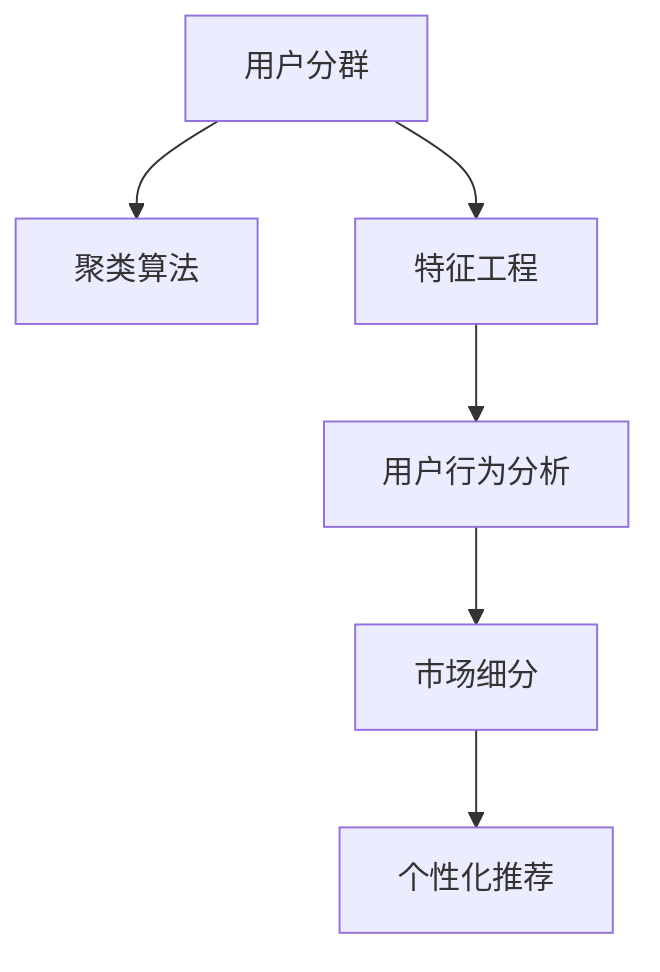

                 

# 如何进行有效的用户分群管理

> 关键词：用户分群, 聚类算法, 特征工程, 用户行为分析, 市场细分, 个性化推荐

## 1. 背景介绍

### 1.1 问题由来

在现代互联网时代，用户群体多样性日益突出，企业运营需要针对不同的用户群体提供差异化的服务。传统的用户分析方法，如用户细分、用户画像等，由于缺乏有效的数据驱动的决策支持，难以满足快速变化的市场需求。用户分群管理通过聚类算法对用户行为数据进行深入分析，实现了对用户分类的科学化和自动化，为个性化服务提供了坚实的依据。

### 1.2 问题核心关键点

- 数据收集：用户行为数据的准确性和全面性直接影响分群的有效性。
- 聚类算法选择：不同的聚类算法适用于不同的数据特征和业务场景。
- 特征工程：优化用户特征提取，提高分群的精准度。
- 评估与调整：基于评估指标持续优化分群结果，保证分群的动态适应性。
- 应用场景：分群结果的实际应用，如个性化推荐、精准营销等。

## 2. 核心概念与联系

### 2.1 核心概念概述

为更好地理解用户分群管理的原理和流程，本节将介绍几个核心概念：

- 用户分群(User Segmentation)：将具有相似行为特征的用户划分为一个群体，以便进行精细化管理。
- 聚类算法(Clustering Algorithm)：将数据集划分为不同的子集，使得同一子集内的数据尽可能相似，不同子集间的差异最大化。
- 特征工程(Feature Engineering)：从原始数据中提取、构造新的特征，以提高分群的精确度和泛化能力。
- 用户行为分析(User Behavior Analysis)：对用户的行为模式进行统计分析，发现用户行为规律。
- 市场细分(Market Segmentation)：将市场划分为多个细分市场，实现差异化营销策略。
- 个性化推荐(Personalized Recommendation)：根据用户分群结果，为用户推荐最适合的产品或服务。

这些概念之间的逻辑关系可以通过以下Mermaid流程图来展示：



这个流程图展示了的核心概念及其之间的关系：

1. 用户分群是整个流程的起点，通过聚类算法和特征工程实现。
2. 聚类算法将用户分为不同的群体。
3. 特征工程优化输入数据，提高分群的准确性。
4. 用户行为分析对分群结果进行进一步验证和优化。
5. 市场细分结合用户分群结果，进行差异化营销。
6. 个性化推荐利用分群结果，提供定制化服务。

这些概念共同构成了用户分群管理的框架，使企业能够更好地理解用户行为，优化产品和服务，提高市场竞争力。

## 3. 核心算法原理 & 具体操作步骤
### 3.1 算法原理概述

用户分群管理本质上是一个数据驱动的用户分类过程。其核心思想是通过聚类算法将用户数据划分为不同的子集，每个子集内的用户具有相似的特征，而子集间特征差异明显。通过分析这些特征，企业能够为不同的用户群体设计针对性的营销策略和产品推荐，提升用户体验和运营效率。

### 3.2 算法步骤详解

用户分群管理的流程主要包括以下几个关键步骤：

**Step 1: 数据收集与预处理**

- 收集用户行为数据，包括但不限于点击、浏览、购买、评论等行为记录。
- 对数据进行清洗和预处理，去除噪声和异常值，确保数据质量和完整性。
- 将数据标准化，如统一时间格式、去除重复记录等。

**Step 2: 特征工程**

- 提取和构造新的用户特征，如用户年龄、性别、购买频率、浏览时长等。
- 应用特征选择算法，筛选出对用户分群有贡献的关键特征。
- 对特征进行编码和归一化处理，确保所有特征在相同的尺度上进行比较。

**Step 3: 聚类算法选择**

- 根据业务需求选择合适的聚类算法，如K-means、层次聚类、DBSCAN等。
- 针对不同的数据特征和业务场景，调整聚类算法的参数，如簇数、距离度量等。
- 评估不同聚类算法的分群效果，选择最优的算法进行后续分析。

**Step 4: 用户分群**

- 使用选定的聚类算法对处理后的数据进行聚类分析。
- 根据聚类结果将用户划分为不同的群体，生成用户分群报告。
- 对每个用户群体进行特征描述，分析不同群体的行为差异。

**Step 5: 结果评估与优化**

- 基于业务目标和评估指标（如聚类中心距离、轮廓系数、Silhouette系数等）对分群结果进行评估。
- 对不理想的聚类结果进行调整，如合并或拆分群体。
- 定期对分群结果进行更新和迭代，保持分群的动态适应性。

**Step 6: 应用与反馈**

- 结合用户分群结果，设计个性化推荐、精准营销等策略。
- 实时收集用户反馈，验证分群结果的有效性，进行持续优化。
- 利用用户分群结果进行市场细分，制定差异化营销计划。

### 3.3 算法优缺点

用户分群管理具有以下优点：

- 科学性和自动化：基于数据驱动的聚类分析，提高了分群的科学性和客观性。
- 动态适应性：分群结果能够随着时间变化和数据更新进行动态调整。
- 精准度：通过特征工程和聚类算法优化，提高了分群的精准度。

同时，该方法也存在一些局限性：

- 数据依赖性强：聚类结果高度依赖于输入数据的质量和完整性。
- 算法复杂度高：不同聚类算法的实现复杂度较高，需要较强的数据分析能力。
- 解释性不足：聚类结果往往缺乏明确的解释，难以进行人工干预和调整。
- 应用场景限制：某些聚类算法对数据分布有严格要求，难以适用于所有业务场景。

尽管存在这些局限性，但就目前而言，基于聚类算法的用户分群管理仍是企业实现精准化运营的重要手段。未来相关研究的重点在于如何进一步降低数据依赖，提高算法效率，增强分群的解释性和适用性，以及探索更多用户分群的应用场景。

### 3.4 算法应用领域

用户分群管理技术已经在诸多领域得到广泛应用，包括但不限于以下几个方面：

- 电子商务：通过分群分析用户的购买行为和偏好，实现个性化推荐和精准营销。
- 金融服务：根据用户分群进行风险评估和客户管理，提升用户体验和业务效率。
- 媒体广告：对用户行为数据进行分析，实现广告投放的精细化和个性化。
- 在线教育：对学生行为进行分群，提供差异化的教学内容和个性化辅导。
- 智能家居：根据用户的生活习惯和偏好，实现智能设备功能的个性化设置。

除了这些传统领域外，用户分群管理还被创新性地应用于智能城市、智慧医疗、智能客服等多个新兴场景，为各行各业带来了全新的客户管理和运营模式。

## 4. 数学模型和公式 & 详细讲解  
### 4.1 数学模型构建

本节将使用数学语言对用户分群管理的原理和流程进行更加严格的刻画。

记用户行为数据为 $\mathbf{X} = [x_1, x_2, \ldots, x_n]$，其中 $x_i$ 表示第 $i$ 个用户的行为特征。假设用户分群过程使用 $K$ 个簇，每个簇的中心为 $\mathbf{c}_k = [c_{k1}, c_{k2}, \ldots, c_{kn}]$，$k \in [1, K]$。聚类算法的目标是最小化簇内距离，即：

$$
\min_{\mathbf{c}} \sum_{k=1}^K \sum_{i=1}^n ||x_i - \mathbf{c}_k||^2
$$

其中 $||.||$ 表示欧几里得距离。

### 4.2 公式推导过程

以K-means算法为例，其分群过程可以通过以下步骤进行：

**Step 1: 随机初始化**

- 随机选择 $K$ 个初始聚类中心 $\mathbf{c}_k^{(0)}$。

**Step 2: 迭代更新聚类中心**

- 对于每个用户 $x_i$，计算其到各个聚类中心的距离，选择最近的聚类中心，将其划入该中心对应的簇。
- 更新聚类中心，计算每个簇内所有用户数据的均值，作为新的聚类中心。

**Step 3: 收敛判断**

- 当聚类中心的更新幅度小于预设阈值时，聚类过程收敛，停止迭代。

K-means算法的主要损失函数为簇内平方和损失（SSE），定义如下：

$$
SSE = \sum_{k=1}^K \sum_{i=1}^n ||x_i - \mathbf{c}_k||^2
$$

K-means算法的目标是最小化 SSE，通过迭代优化实现聚类中心的更新。

### 4.3 案例分析与讲解

假设某电商平台收集了用户的购买行为数据，包括商品ID、购买时间、购买金额等。为了进行用户分群，我们首先将数据进行预处理，去除无效记录和噪声数据。接着，进行特征工程，提取用户购买频率、平均购买金额、购买时段等特征。然后，使用K-means算法对处理后的数据进行聚类分析，将用户分为高价值用户、中价值用户和低价值用户三类。最后，对每类用户进行特征描述，分析不同群体间的行为差异，实现精准化的营销策略。

通过用户分群管理，电商平台能够针对不同用户群体提供差异化的推荐和服务，提升用户体验和销售额。

## 5. 项目实践：代码实例和详细解释说明
### 5.1 开发环境搭建

在进行用户分群管理的开发实践中，我们需要准备好开发环境。以下是使用Python进行Scikit-learn开发的环境配置流程：

1. 安装Anaconda：从官网下载并安装Anaconda，用于创建独立的Python环境。

2. 创建并激活虚拟环境：
```bash
conda create -n clustering_env python=3.8 
conda activate clustering_env
```

3. 安装Scikit-learn：
```bash
pip install scikit-learn
```

4. 安装Pandas、NumPy等工具包：
```bash
pip install pandas numpy matplotlib seaborn
```

完成上述步骤后，即可在`clustering_env`环境中开始用户分群管理的开发。

### 5.2 源代码详细实现

我们以K-means算法为例，给出一个使用Scikit-learn进行用户分群管理的Python代码实现。

首先，导入必要的库和数据集：

```python
import pandas as pd
import numpy as np
from sklearn.cluster import KMeans
import matplotlib.pyplot as plt

# 读取数据集
df = pd.read_csv('user_behavior_data.csv')

# 提取特征
features = df[['purchase_frequency', 'average_purchase_amount', 'purchase_time']]
```

然后，定义聚类模型并进行训练：

```python
# 使用K-means算法进行聚类
kmeans = KMeans(n_clusters=3, random_state=42)
kmeans.fit(features)
```

接着，将用户数据分配到各个聚类中心：

```python
# 获取聚类结果
labels = kmeans.labels_

# 可视化聚类结果
plt.scatter(features.iloc[:, 0], features.iloc[:, 1], c=labels)
plt.show()
```

最后，生成用户分群报告并保存：

```python
# 统计每个聚类中心的特征
cluster_centers = kmeans.cluster_centers_

# 保存分群结果
pd.DataFrame({'cluster': labels, 'features': cluster_centers}).to_csv('user_clusters.csv', index=False)
```

以上就是使用Scikit-learn进行用户分群管理的完整代码实现。可以看到，Scikit-learn提供了简单易用的接口，使得用户分群管理的实现变得十分便捷。

### 5.3 代码解读与分析

让我们再详细解读一下关键代码的实现细节：

**用户行为数据处理**

- `df.read_csv()`方法：读取用户行为数据，将其转换为Pandas DataFrame格式。
- `features`变量：选择对用户分群有贡献的关键特征。

**聚类模型训练**

- `KMeans()`类：创建K-means聚类模型，设置簇数为3。
- `kmeans.fit(features)`方法：对特征数据进行聚类分析。

**聚类结果可视化**

- `plt.scatter()`函数：对聚类结果进行散点图可视化，不同颜色的点表示不同的聚类中心。

**用户分群报告生成**

- `cluster_centers`变量：获取每个聚类中心的特征描述。
- `pd.DataFrame()`方法：将聚类结果和特征描述转换为DataFrame格式，并保存到CSV文件中。

通过这段代码，我们可以看到Scikit-learn在用户分群管理中的应用非常直观和高效。开发者可以很容易地进行特征提取、模型训练和结果可视化，大大简化了开发流程。

## 6. 实际应用场景

### 6.1 智能推荐系统

在智能推荐系统中，用户分群管理能够帮助企业根据不同用户群体的行为特征，提供更加精准的推荐服务。通过对用户行为数据的聚类分析，可以发现不同用户群体的偏好和需求，从而定制个性化的推荐策略。

例如，电商平台可以根据用户的购买频率和购买金额，将用户分为高价值用户、中价值用户和低价值用户三类。针对不同用户群体，设计不同的推荐算法和策略，提升推荐效果和用户满意度。

### 6.2 金融风险管理

在金融风险管理中，用户分群管理能够帮助金融机构识别和管理高风险客户。通过对客户的交易行为和信用记录进行聚类分析，可以发现高风险客户群体，并采取相应的风险控制措施。

例如，银行可以基于客户的交易频率、交易金额、还款记录等特征，将客户分为高风险客户和低风险客户两类。针对高风险客户，设计更加严格的审核流程和风险提示机制，降低贷款违约率。

### 6.3 内容推荐平台

在内容推荐平台中，用户分群管理能够帮助平台根据用户的行为数据，推荐最符合用户兴趣的内容。通过对用户浏览历史、评论数据等行为数据的聚类分析，可以发现不同用户群体的兴趣偏好，从而定制个性化的内容推荐策略。

例如，视频平台可以根据用户的观看历史和评分记录，将用户分为不同的兴趣群体，如体育迷、科技迷、文艺爱好者等。针对不同兴趣群体，推荐相应的视频内容，提升用户体验和平台黏性。

### 6.4 未来应用展望

随着用户分群管理技术的不断发展，其在更多领域的应用前景将更加广阔。

在智慧城市管理中，用户分群管理能够帮助城市管理者识别和管理不同类型的人口群体，提供个性化的城市服务和公共设施。

在医疗健康领域，用户分群管理能够帮助医院识别和管理不同类型的患者群体，提供个性化的诊疗和康复服务。

在智能客服系统中，用户分群管理能够帮助企业识别和管理不同类型的问题群体，提供个性化的客户服务解决方案。

总之，用户分群管理技术将为企业提供更加精准的用户画像，提升运营效率和用户体验，加速数字化转型进程。

## 7. 工具和资源推荐
### 7.1 学习资源推荐

为了帮助开发者系统掌握用户分群管理的理论基础和实践技巧，这里推荐一些优质的学习资源：

1. 《数据挖掘导论》课程：由斯坦福大学开设的在线课程，介绍了数据挖掘的基本概念和经典算法。
2. 《机器学习实战》书籍：作者通过大量的Python代码示例，详细讲解了聚类算法在实际中的应用。
3. 《Python数据科学手册》书籍：详细介绍了Python在数据科学中的应用，包括用户分群管理。
4. Kaggle平台：全球最大的数据科学竞赛平台，提供了丰富的用户分群管理案例和数据集。
5. Coursera平台：提供大量与数据科学相关的课程，包括用户分群管理的技术应用。

通过对这些资源的学习实践，相信你一定能够快速掌握用户分群管理的精髓，并用于解决实际的业务问题。
###  7.2 开发工具推荐

高效的开发离不开优秀的工具支持。以下是几款用于用户分群管理开发的常用工具：

1. Python：开源编程语言，简单易学，拥有丰富的数据科学库和算法支持。
2. Scikit-learn：基于Python的开源机器学习库，提供了多种聚类算法和特征工程技术。
3. R语言：统计分析语言，拥有丰富的数据可视化库和数据处理工具。
4. Hadoop/Spark：分布式计算框架，适用于处理大规模用户行为数据。
5. Tableau：数据可视化工具，方便对用户分群结果进行可视化和分析。

合理利用这些工具，可以显著提升用户分群管理的开发效率，加快创新迭代的步伐。

### 7.3 相关论文推荐

用户分群管理技术的发展源于学界的持续研究。以下是几篇奠基性的相关论文，推荐阅读：

1. K-means: A Method for Cluster Analysis of Multidimensional Data（K-means算法论文）：提出了K-means算法，是聚类分析的经典算法之一。
2. Hierarchical Clustering（层次聚类论文）：介绍了层次聚类算法，是一种自底向上的聚类方法。
3. DBSCAN: A Density-Based Algorithm for Discovering Clusters in Large Spatial Databases with Noise（DBSCAN算法论文）：提出了DBSCAN算法，适用于处理非球形的簇结构。
4. Gaussian Mixture Models（GMM模型论文）：介绍了高斯混合模型，用于聚类分析中的分布建模。
5. Expectation-Maximization Algorithms for Factor Analysis（EM算法论文）：提出了EM算法，用于聚类分析中的参数估计。

这些论文代表了大数据聚类算法的最新进展，为研究人员提供了丰富的理论支持和实践指导。

## 8. 总结：未来发展趋势与挑战
### 8.1 总结

本文对用户分群管理的原理和实践进行了全面系统的介绍。首先阐述了用户分群管理的背景和意义，明确了分群在提升用户体验和运营效率方面的独特价值。其次，从原理到实践，详细讲解了用户分群管理的数学原理和关键步骤，给出了具体的数据处理、特征工程和聚类算法实现。同时，本文还广泛探讨了用户分群管理的实际应用场景，展示了其在多个行业领域的应用潜力。此外，本文精选了用户分群管理的各类学习资源，力求为读者提供全方位的技术指引。

通过本文的系统梳理，可以看到，用户分群管理技术已经成为数据科学和人工智能领域的重要研究热点，广泛应用于多个行业。用户分群管理为企业的精准运营和客户管理提供了有力的技术支撑，帮助企业实现业务创新和市场竞争力的提升。未来，伴随着大数据和人工智能技术的不断进步，用户分群管理技术还将进一步拓展应用边界，为更多领域带来革命性的变革。

### 8.2 未来发展趋势

展望未来，用户分群管理技术将呈现以下几个发展趋势：

1. 自动化与智能化：随着人工智能和机器学习技术的发展，用户分群过程将变得更加自动化和智能化。未来将出现更多的自适应聚类算法，能够在不断变化的数据中自动调整聚类策略。
2. 多模态数据融合：传统的用户分群管理通常只考虑单一类型的数据，如文本、行为等。未来将出现更多多模态数据融合方法，综合利用用户的行为、图像、语音等多种数据类型，实现更加全面和精准的用户分群。
3. 深度学习与强化学习：深度学习和强化学习技术将引入用户分群管理中，提升聚类算法的性能和泛化能力。例如，通过神经网络进行特征提取和聚类，或者通过强化学习优化聚类参数。
4. 分布式计算：大规模用户行为数据的处理需要高并发的计算能力，分布式计算技术将进一步提升用户分群管理的处理效率和数据处理能力。
5. 跨领域应用：用户分群管理技术将逐步从互联网和电子商务领域扩展到更多领域，如医疗、金融、能源等，为更多行业提供精准的用户分析和运营支持。

这些趋势将推动用户分群管理技术的进一步发展，提升其应用效果和智能化水平。

### 8.3 面临的挑战

尽管用户分群管理技术已经取得了显著的进展，但在迈向更加智能化和普适化的过程中，仍面临着诸多挑战：

1. 数据质量与完整性：用户行为数据的准确性和完整性直接影响分群的有效性。数据缺失、异常值和噪声等问题，将对聚类结果产生负面影响。
2. 算法复杂度：不同聚类算法的实现复杂度较高，需要较强的数据分析能力和计算资源。在大规模数据集上进行聚类分析，计算开销较大。
3. 可解释性与透明性：聚类算法的决策过程缺乏可解释性，难以进行人工干预和调整。对于金融、医疗等高风险应用，算法的透明性和可解释性尤为重要。
4. 业务需求适配：不同的业务场景对用户分群的需求不同，需要针对具体业务需求设计相应的聚类策略。
5. 技术演进与适配：聚类算法的不断发展将对现有系统产生影响，需要不断更新和优化现有系统，保持技术同步和适配性。

这些挑战需要通过技术创新和算法优化，逐步解决。只有不断突破技术瓶颈，才能实现用户分群管理技术的可持续发展。

### 8.4 研究展望

面对用户分群管理所面临的挑战，未来的研究需要在以下几个方面寻求新的突破：

1. 数据增强与清洗：通过数据增强和清洗技术，提升数据质量和完整性，减少噪声和异常值的影响。
2. 特征工程与选择：深入研究用户行为特征的提取与选择，优化特征工程的流程和方法，提高分群的精准度。
3. 分布式计算与加速：引入分布式计算技术，提升用户分群管理的处理效率和数据处理能力，支持大规模数据集的处理。
4. 自适应聚类算法：研究自适应聚类算法，使得聚类过程能够根据数据分布和业务需求动态调整，提升聚类结果的适应性和准确性。
5. 多模态聚类方法：综合利用多种数据类型，实现多模态数据融合，提升用户分群的全面性和精准性。
6. 可解释性与透明性：研究聚类算法的可解释性和透明性，增强算法决策过程的可解释性和透明性，提升算法的可靠性和可信度。

这些研究方向的探索，必将推动用户分群管理技术迈向更高的台阶，为更多领域提供更加精准的用户分析和运营支持。总之，用户分群管理技术需要在数据质量、算法复杂度、技术演进等方面不断突破，才能实现业务的持续发展和市场竞争力的提升。

## 9. 附录：常见问题与解答

**Q1：用户分群管理是否适用于所有业务场景？**

A: 用户分群管理技术适用于大多数业务场景，但其效果高度依赖于数据的全面性和准确性。在数据质量较高的场景中，用户分群管理能够显著提升业务效果和运营效率。但在数据缺失、噪声较多的场景中，分群效果可能较差。

**Q2：如何选择合适的聚类算法？**

A: 聚类算法的选择应根据业务需求和数据特征进行选择。K-means算法适用于处理球形簇结构的数据；层次聚类适用于处理层级关系明显的数据；DBSCAN适用于处理非球形簇结构的数据；GMM适用于处理分布不均匀的数据。需要根据具体情况选择最合适的聚类算法。

**Q3：用户分群管理在实际应用中需要注意哪些问题？**

A: 用户分群管理在实际应用中需要注意以下问题：
1. 数据质量：确保数据完整性和准确性，避免噪声和异常值对分群结果的影响。
2. 聚类参数：根据业务需求和数据特征，合理设置聚类参数，如簇数、距离度量等。
3. 结果验证：对聚类结果进行验证和评估，确保分群的合理性和有效性。
4. 动态更新：根据业务变化和数据更新，持续优化聚类策略，保持分群的动态适应性。
5. 应用适配：将分群结果应用于业务场景，实现精准化的营销策略和运营支持。

**Q4：聚类结果的可视化方法有哪些？**

A: 聚类结果的可视化方法包括但不限于：
1. 散点图：使用散点图展示聚类结果，不同颜色的点表示不同的聚类中心。
2. 柱状图：使用柱状图展示每个聚类中心的特征描述，方便对比和分析。
3. 热力图：使用热力图展示聚类结果的空间分布，便于观察聚类结果的地理特征。
4. 树状图：使用树状图展示聚类过程的层次关系，便于理解聚类算法的决策过程。

这些可视化方法可以帮助用户更直观地理解聚类结果，进行深入分析和优化。

---

作者：禅与计算机程序设计艺术 / Zen and the Art of Computer Programming

