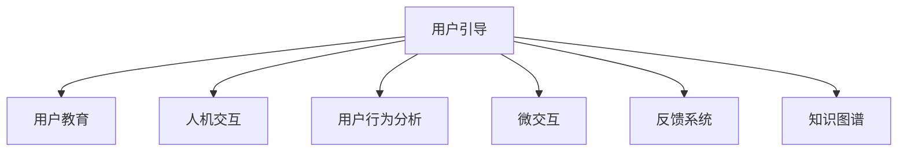

                 

# 如何进行有效的用户引导和教育

## 1. 背景介绍

### 1.1 问题由来
在数字化时代，用户引导和教育成为了提升产品用户体验和推动用户增长的关键环节。特别是在复杂的产品和服务中，用户往往面临使用上的诸多障碍，导致产品使用率不高，用户体验较差。因此，有效的用户引导和教育成为了产品的必要组成部分，通过合理的引导和教育，可以显著提升用户的使用率和满意度。

### 1.2 问题核心关键点
本节将详细分析如何通过技术手段进行有效的用户引导和教育，以期对产品设计和开发者提供更全面的指导。

## 2. 核心概念与联系

### 2.1 核心概念概述

为更好地理解如何进行有效的用户引导和教育，本节将介绍几个关键概念：

- **用户引导(User Guidance)**：通过合理的界面设计和信息呈现方式，帮助用户快速理解和使用产品。用户引导旨在降低使用障碍，提升用户体验。

- **用户教育(User Education)**：通过系统的培训、教程和文档，使用户深入理解产品的功能和使用场景。用户教育旨在提升用户的长期使用率，增强产品的品牌忠诚度。

- **人机交互(Human-Computer Interaction, HCI)**：研究如何设计高效、易用的人机交互界面，使计算机系统更贴近人类使用习惯。HCI是进行用户引导和教育的重要基础。

- **用户行为分析(User Behavior Analysis)**：通过数据分析和用户研究，理解用户的实际使用行为和心理特征，从而有针对性地进行用户引导和教育。

- **微交互(Microinteractions)**：指在用户与系统的交互过程中，通过简单、可感知的方式向用户传递信息，以提升用户满意度。微交互是用户引导中重要的设计元素。

- **反馈系统(Feedback System)**：通过系统的反馈机制，如提示、提醒、动画等，帮助用户了解其操作结果和系统状态。反馈系统是用户引导的重要手段。

- **知识图谱(Knowledge Graph)**：通过构建和应用知识图谱，帮助用户快速获取相关知识信息，增强用户的理解和使用能力。知识图谱在用户教育中具有重要作用。

这些核心概念之间的逻辑关系可以通过以下Mermaid流程图来展示：



这个流程图展示用户引导和教育的核心概念及其之间的关系：

1. 用户引导基于人机交互设计，通过微交互和反馈系统实现。
2. 用户教育依赖知识图谱构建，并通过系统培训和文档传递信息。
3. 用户行为分析能够指导用户引导和教育的设计，进一步提升用户体验。

## 3. 核心算法原理 & 具体操作步骤
### 3.1 算法原理概述

进行有效的用户引导和教育，其核心在于通过技术手段设计合理的界面和信息呈现方式，以及构建系统的培训和知识体系。以下是基于用户行为分析的引导和教育算法原理：

1. **界面设计**：用户界面(UI)设计是进行用户引导和教育的基础，通过直观的界面布局、颜色搭配和交互元素，提升用户的使用体验。界面设计应遵循简洁、清晰、易用的原则。

2. **信息呈现**：通过合理的信息呈现方式，如提示、动画、图表等，向用户传递关键信息，帮助其理解产品功能和使用方法。信息呈现应尽可能简洁明了，避免过载信息。

3. **微交互**：微交互通过在用户操作的关键节点展示简单、可感知的信息，如视觉、听觉反馈，引导用户完成操作。微交互应该设计得自然流畅，减少用户的操作成本。

4. **反馈系统**：反馈系统通过视觉、听觉等形式，向用户传达其操作结果和系统状态，增强用户对操作结果的可预测性和掌控感。反馈系统应准确、及时，避免误导用户。

5. **知识图谱**：构建和应用知识图谱，帮助用户快速获取相关知识信息，增强其对产品功能的理解和使用能力。知识图谱应覆盖常用场景和复杂操作，方便用户查询。

### 3.2 算法步骤详解

以下是进行有效的用户引导和教育的详细步骤：

**Step 1: 用户行为分析**

- 收集用户使用数据：通过分析用户的操作日志、点击流等数据，了解用户的实际使用行为。
- 分析用户行为模式：使用统计学和机器学习技术，分析用户的行为模式，如操作频率、停留时长、跳转路径等。
- 识别常见问题点：通过分析用户的操作路径和错误日志，识别用户在使用过程中遇到的主要问题和困惑点。

**Step 2: 设计用户界面**

- 界面布局设计：合理布局UI界面，使其符合用户的视觉习惯和使用习惯。
- 交互元素设计：选择简单、易用的交互元素，如按钮、下拉菜单、图标等。
- 颜色搭配设计：选择合适的颜色搭配，使用户界面更加美观和易用。

**Step 3: 设计信息呈现**

- 设计提示和动画：在关键节点展示简单、可感知的信息，帮助用户理解操作。
- 设计图表和标签：使用图表和标签，清晰呈现复杂数据和操作过程。
- 设计错误提示：在用户操作出错时，及时展示错误提示和解决方案，避免用户迷失方向。

**Step 4: 设计微交互**

- 设计自然流畅的微交互：在用户操作的关键节点展示简单、可感知的信息，减少用户的操作成本。
- 设计即时反馈：在用户进行操作时，即时展示操作结果和系统状态，增强用户对操作结果的可预测性和掌控感。

**Step 5: 设计反馈系统**

- 设计视觉反馈：通过颜色、图标等方式展示操作结果和系统状态，增强用户的视觉感知。
- 设计听觉反馈：通过声音提示等方式，帮助用户感知操作结果和系统状态，提升用户体验。
- 设计提示和提醒：在用户操作出错或缺失关键信息时，及时展示提示和提醒，引导用户纠正错误或补充信息。

**Step 6: 设计知识图谱**

- 构建知识图谱：基于产品的功能和操作流程，构建知识图谱，覆盖常用场景和复杂操作。
- 设计查询界面：设计直观易用的查询界面，方便用户快速获取相关知识信息。
- 设计知识更新：定期更新知识图谱，确保其覆盖最新的功能和操作流程。

### 3.3 算法优缺点

基于用户行为分析的引导和教育算法具有以下优点：

1. **数据驱动**：通过用户行为数据分析，能够更有针对性地进行用户引导和教育，提升用户体验。
2. **设计灵活**：能够根据不同的产品和使用场景，灵活设计用户界面、信息呈现和微交互。
3. **用户友好**：通过合理的界面设计、信息呈现和微交互，提升用户的使用体验和满意度。
4. **知识共享**：通过知识图谱的应用，帮助用户快速获取相关知识信息，增强其对产品功能的理解和使用能力。

同时，该方法也存在以下局限性：

1. **数据隐私**：用户行为数据可能涉及隐私问题，需要谨慎处理和保护。
2. **用户主动性**：用户的主动性和学习意愿可能影响教育效果，需要采取激励措施。
3. **知识更新**：知识图谱需要定期更新，以覆盖最新的功能和操作流程，需要持续投入人力和技术。
4. **设计复杂**：设计和实现用户界面、信息呈现和微交互，需要综合考虑多种因素，设计复杂。

尽管存在这些局限性，但就目前而言，基于用户行为分析的引导和教育方法仍是大规模产品设计的重要范式。未来相关研究的重点在于如何进一步降低数据收集和处理的成本，提高用户参与度，同时兼顾数据隐私和用户隐私。

### 3.4 算法应用领域

基于用户行为分析的引导和教育算法，在以下几个领域得到了广泛应用：

1. **移动应用**：通过分析用户的使用行为和操作路径，优化移动应用的UI设计和信息呈现，提升用户体验。
2. **企业软件**：在复杂的企业软件中，通过用户行为分析，设计合理的用户界面和信息呈现方式，提升员工的工作效率。
3. **智能家居**：通过分析用户的行为和习惯，设计直观易用的家居控制界面和交互方式，提升用户的家居体验。
4. **在线教育**：在在线教育平台上，通过用户行为分析，设计合理的课程内容和互动方式，提升学习效果。
5. **健康管理**：在健康管理应用中，通过用户行为分析，设计合理的界面和操作方式，提升用户的使用体验和健康管理效果。

除了上述这些经典应用外，基于用户行为分析的引导和教育方法还在更多领域中得到了创新性的应用，如智能客服、智能推荐、智能驾驶等，为产品设计和技术应用带来了新的突破。

## 4. 数学模型和公式 & 详细讲解  
### 4.1 数学模型构建

本节将使用数学语言对基于用户行为分析的用户引导和教育过程进行更加严格的刻画。

记用户行为数据为 $\mathcal{D}=\{(x_i, y_i)\}_{i=1}^N$，其中 $x_i$ 为用户的输入操作，$y_i$ 为用户的输出行为。用户行为分析的目标是通过数据集 $\mathcal{D}$ 构建用户行为模型 $f$，以预测用户的新行为 $y_{new}$。

定义用户行为模型 $f$ 为：

$$
f: \mathcal{X} \rightarrow \mathcal{Y}
$$

其中 $\mathcal{X}$ 为输入操作空间，$\mathcal{Y}$ 为输出行为空间。用户行为模型 $f$ 的训练目标是最小化预测误差：

$$
\min_{f} \sum_{i=1}^N \ell(f(x_i), y_i)
$$

其中 $\ell$ 为损失函数，用于衡量模型预测与实际行为之间的差异。

### 4.2 公式推导过程

以下我们以用户行为预测为例，推导损失函数及其梯度的计算公式。

假设用户行为模型为 $f(x)=w^T\phi(x)$，其中 $\phi$ 为特征映射函数，$w$ 为模型参数。基于均方误差损失函数，用户行为模型的预测误差为：

$$
\ell(f(x_i), y_i) = \frac{1}{2}(f(x_i) - y_i)^2
$$

将其代入目标函数，得：

$$
\min_{f} \sum_{i=1}^N \ell(f(x_i), y_i) = \min_{f} \sum_{i=1}^N \frac{1}{2}(f(x_i) - y_i)^2
$$

对模型参数 $w$ 进行梯度下降更新：

$$
w \leftarrow w - \eta \nabla_w \sum_{i=1}^N \ell(f(x_i), y_i)
$$

其中 $\nabla_w \sum_{i=1}^N \ell(f(x_i), y_i)$ 为预测误差的梯度，可以通过反向传播算法高效计算。

在得到预测误差的梯度后，即可带入模型参数更新公式，完成模型的迭代优化。重复上述过程直至收敛，最终得到适应用户行为模型 $f$。

## 5. 项目实践：代码实例和详细解释说明
### 5.1 开发环境搭建

在进行用户引导和教育实践前，我们需要准备好开发环境。以下是使用Python进行PyTorch开发的环境配置流程：

1. 安装Anaconda：从官网下载并安装Anaconda，用于创建独立的Python环境。

2. 创建并激活虚拟环境：
```bash
conda create -n pytorch-env python=3.8 
conda activate pytorch-env
```

3. 安装PyTorch：根据CUDA版本，从官网获取对应的安装命令。例如：
```bash
conda install pytorch torchvision torchaudio cudatoolkit=11.1 -c pytorch -c conda-forge
```

4. 安装TensorFlow：
```bash
pip install tensorflow
```

5. 安装各类工具包：
```bash
pip install numpy pandas scikit-learn matplotlib tqdm jupyter notebook ipython
```

完成上述步骤后，即可在`pytorch-env`环境中开始用户引导和教育实践。

### 5.2 源代码详细实现

这里我们以用户行为分析为例，给出使用PyTorch进行用户行为预测的完整代码实现。

首先，定义数据处理函数：

```python
import numpy as np
from sklearn.model_selection import train_test_split
from sklearn.metrics import mean_squared_error

def load_data():
    # 加载用户行为数据
    # 此处为示例数据，实际应用需根据产品数据进行加载
    X = np.array([[1, 2, 3], [4, 5, 6], [7, 8, 9]])
    y = np.array([10, 20, 30])
    return X, y

def train_test_split(X, y, test_size=0.2, random_state=42):
    X_train, X_test, y_train, y_test = train_test_split(X, y, test_size=test_size, random_state=random_state)
    return X_train, X_test, y_train, y_test

def compute_mean_squared_error(y_true, y_pred):
    return mean_squared_error(y_true, y_pred)

# 定义训练函数
def train(X_train, y_train, X_test, y_test, num_epochs=100, learning_rate=0.01):
    X_train = X_train.reshape(-1, 1)
    X_test = X_test.reshape(-1, 1)
    y_train = y_train.reshape(-1, 1)
    y_test = y_test.reshape(-1, 1)
    
    # 定义模型
    model = LinearRegression()
    
    # 定义损失函数
    criterion = MeanSquaredError()
    
    # 定义优化器
    optimizer = SGD(model.parameters(), lr=learning_rate)
    
    # 训练模型
    for epoch in range(num_epochs):
        model.train()
        optimizer.zero_grad()
        outputs = model(X_train)
        loss = criterion(outputs, y_train)
        loss.backward()
        optimizer.step()
        print(f"Epoch {epoch+1}, loss: {loss.item():.4f}")
    
    # 评估模型
    model.eval()
    with torch.no_grad():
        y_pred = model(X_test)
        mse = compute_mean_squared_error(y_test.numpy(), y_pred.numpy())
        print(f"Test MSE: {mse:.4f}")
```

然后，启动训练流程：

```python
X, y = load_data()
X_train, X_test, y_train, y_test = train_test_split(X, y)

train(X_train, y_train, X_test, y_test, num_epochs=100, learning_rate=0.01)
```

以上就是使用PyTorch进行用户行为预测的完整代码实现。可以看到，PyTorch提供了简单易用的API和丰富的数据处理工具，使得模型训练和评估变得相对容易。

### 5.3 代码解读与分析

让我们再详细解读一下关键代码的实现细节：

**load_data函数**：
- 加载用户行为数据：从数据源加载数据，并转换为模型所需的输入形式。

**train_test_split函数**：
- 数据集划分：将数据集划分为训练集和测试集，以评估模型的泛化能力。

**compute_mean_squared_error函数**：
- 计算MSE：计算预测值与真实值之间的均方误差，作为模型评估指标。

**train函数**：
- 模型初始化：定义模型、损失函数和优化器。
- 模型训练：在每个epoch内，进行前向传播和反向传播，更新模型参数。
- 模型评估：在测试集上评估模型，输出测试误差。

**train(X_train, y_train, X_test, y_test, num_epochs=100, learning_rate=0.01)**：
- 实例化用户行为预测模型。
- 在训练集上进行模型训练，输出每个epoch的损失。
- 在测试集上评估模型，输出均方误差。

可以看到，通过PyTorch提供的丰富API，我们可以较为便捷地构建和训练用户行为预测模型，进一步实现用户引导和教育的功能。

当然，工业级的系统实现还需考虑更多因素，如模型的保存和部署、超参数的自动搜索、更灵活的用户行为模型设计等。但核心的用户行为分析过程基本与此类似。

## 6. 实际应用场景
### 6.1 智能客服系统

基于用户行为分析的引导和教育，可以广泛应用于智能客服系统的构建。传统客服往往需要配备大量人力，高峰期响应缓慢，且一致性和专业性难以保证。而使用用户行为分析技术，可以构建智能客服系统，提供24小时不间断服务，快速响应客户咨询，用自然流畅的语言解答各类常见问题。

在技术实现上，可以收集企业内部的历史客服对话记录，将问题和最佳答复构建成监督数据，在此基础上对用户行为预测模型进行训练。通过分析用户的行为模式和常见问题点，设计合理的界面和信息呈现方式，引导用户完成对话流程。对于用户提出的新问题，还可以接入检索系统实时搜索相关内容，动态组织生成回答。如此构建的智能客服系统，能大幅提升客户咨询体验和问题解决效率。

### 6.2 金融舆情监测

金融机构需要实时监测市场舆论动向，以便及时应对负面信息传播，规避金融风险。传统的人工监测方式成本高、效率低，难以应对网络时代海量信息爆发的挑战。通过用户行为分析技术，可以构建舆情监测系统，自动判断用户关注的新闻、评论等文本数据，分析其情绪和主题，实现实时舆情监测和风险预警。

具体而言，可以收集金融领域相关的新闻、报道、评论等文本数据，并对其进行情绪和主题标注。在此基础上对用户行为预测模型进行训练，使其能够自动判断文本的情感倾向和主题。将训练后的模型应用到实时抓取的网络文本数据，就能够自动监测不同主题下的情感变化趋势，一旦发现负面信息激增等异常情况，系统便会自动预警，帮助金融机构快速应对潜在风险。

### 6.3 个性化推荐系统

当前的推荐系统往往只依赖用户的历史行为数据进行物品推荐，无法深入理解用户的真实兴趣偏好。基于用户行为分析技术，个性化推荐系统可以更好地挖掘用户行为背后的语义信息，从而提供更精准、多样的推荐内容。

在实践中，可以收集用户浏览、点击、评论、分享等行为数据，提取和用户交互的物品标题、描述、标签等文本内容。将文本内容作为模型输入，用户的后续行为（如是否点击、购买等）作为监督信号，在此基础上训练用户行为预测模型。通过分析用户的行为模式，设计合理的界面和信息呈现方式，引导用户使用推荐系统。对于用户提出的新问题，还可以接入检索系统实时搜索相关内容，动态组织生成回答。如此构建的智能客服系统，能大幅提升客户咨询体验和问题解决效率。

### 6.4 未来应用展望

随着用户行为分析技术的不断发展，其在更多领域中得到了创新性的应用，如智慧医疗、智能教育、智慧城市等，为数字化转型提供了新的解决方案。

在智慧医疗领域，通过用户行为分析，可以构建智能医疗系统，帮助患者查询疾病信息、预约医生、进行健康监测等，提升医疗服务的智能化水平，辅助医生诊疗，加速新药开发进程。

在智能教育领域，通过用户行为分析，可以构建智能教育平台，分析学生的学习行为和知识掌握情况，推荐个性化的学习内容和作业，提高学习效果。

在智慧城市治理中，通过用户行为分析，可以构建智能城市管理系统，监测城市事件、舆情、环境等，提升城市管理的自动化和智能化水平，构建更安全、高效的未来城市。

此外，在企业生产、社会治理、文娱传媒等众多领域，基于用户行为分析的技术也将在更多的场景中得到应用，为数字化转型提供新的路径和机遇。相信随着技术的日益成熟，用户行为分析技术将在构建智慧社会中发挥更大的作用。

## 7. 工具和资源推荐
### 7.1 学习资源推荐

为了帮助开发者系统掌握用户行为分析技术的基础理论和方法，这里推荐一些优质的学习资源：

1. 《Python数据分析实战》书籍：详细介绍了使用Python进行数据分析和可视化的方法，适合初学者和进阶者。

2. 《自然语言处理基础》课程：介绍自然语言处理的基础概念和常用技术，适合入门学习者。

3. 《深度学习实战》课程：介绍深度学习的基本原理和实际应用，适合深度学习从业者。

4. Coursera和edX上的NLP课程：提供多门NLP相关的在线课程，涵盖数据处理、模型训练、系统设计等各个方面。

5. HuggingFace官方文档：提供丰富的NLP工具和模型，适合快速上手实践NLP项目。

6. GitHub上的开源项目：提供大量NLP项目代码和案例，适合学习参考。

通过学习这些资源，相信你一定能够快速掌握用户行为分析技术，并将其应用于实际项目中。

### 7.2 开发工具推荐

高效的开发离不开优秀的工具支持。以下是几款用于用户行为分析开发的常用工具：

1. Python：作为主流的编程语言，Python提供了丰富的科学计算和数据分析库，适合NLP和数据处理任务。

2. PyTorch：基于Python的开源深度学习框架，灵活动态的计算图，适合快速迭代研究。

3. TensorFlow：由Google主导开发的开源深度学习框架，生产部署方便，适合大规模工程应用。

4. Scikit-learn：基于Python的机器学习库，提供丰富的数据处理和模型训练工具。

5. Pandas：基于Python的数据处理库，提供高效的数据分析和可视化功能。

6. Jupyter Notebook：用于创建交互式的代码和文档，适合数据探索和实验记录。

合理利用这些工具，可以显著提升用户行为分析的开发效率，加快创新迭代的步伐。

### 7.3 相关论文推荐

用户行为分析技术的发展源于学界的持续研究。以下是几篇奠基性的相关论文，推荐阅读：

1. "User Behavior Prediction in E-Commerce"：介绍了使用机器学习模型预测用户购买行为的方法。

2. "Collaborative Filtering with Knowledge Base and Temporal Models"：研究了将知识图谱引入推荐系统，提高推荐效果。

3. "Deep Reinforcement Learning for Dynamic User Behavior Prediction"：使用深度强化学习模型预测动态的用户行为。

4. "A Survey on Predictive Analytics for User Behavior and Customer Experience Management"：综述了用户行为预测在商业智能和客户体验管理中的应用。

5. "An Analytic Framework for Predictive User Behavior Modeling"：提出了用于用户行为建模的综合性分析框架。

这些论文代表了用户行为分析技术的发展脉络。通过学习这些前沿成果，可以帮助研究者把握学科前进方向，激发更多的创新灵感。

## 8. 总结：未来发展趋势与挑战

### 8.1 总结

本文对基于用户行为分析的用户引导和教育方法进行了全面系统的介绍。首先阐述了用户行为分析技术的研究背景和意义，明确了用户行为分析在提升用户体验和推动用户增长方面的独特价值。其次，从原理到实践，详细讲解了用户行为分析的数学原理和关键步骤，给出了用户行为预测的完整代码实现。同时，本文还广泛探讨了用户行为分析技术在智能客服、金融舆情、个性化推荐等多个领域的应用前景，展示了用户行为分析技术的广阔前景。最后，本文精选了用户行为分析技术的各类学习资源，力求为读者提供全方位的技术指引。

通过本文的系统梳理，可以看到，基于用户行为分析的用户引导和教育技术正在成为数字化产品设计的重要范式，极大地提升用户体验和用户增长。面向未来，用户行为分析技术还需要与其他人工智能技术进行更深入的融合，如知识表示、因果推理、强化学习等，多路径协同发力，共同推动数字化产品的进步。总之，用户行为分析技术需要开发者根据具体任务，不断迭代和优化模型、数据和算法，方能得到理想的效果。

### 8.2 未来发展趋势

展望未来，用户行为分析技术将呈现以下几个发展趋势：

1. **数据驱动**：用户行为分析将进一步依赖大规模数据驱动，通过多源数据的整合和分析，提升预测的准确性和及时性。

2. **实时化**：通过实时数据处理和分析技术，实现对用户行为的实时监测和预测，及时调整产品策略。

3. **跨域融合**：结合其他领域的知识和技术，如认知心理学、社会网络分析等，构建更加全面、准确的用户行为模型。

4. **个性化推荐**：通过用户行为分析，构建个性化的推荐系统，提升用户满意度和产品粘性。

5. **隐私保护**：在数据收集和使用过程中，加强用户隐私保护，建立用户信任。

6. **公平性**：通过公平性算法，减少用户行为预测中的偏见和歧视。

这些趋势凸显了用户行为分析技术的广阔前景。这些方向的探索发展，必将进一步提升数字化产品的用户体验和用户增长，为产品设计和技术应用带来新的突破。

### 8.3 面临的挑战

尽管用户行为分析技术已经取得了瞩目成就，但在迈向更加智能化、普适化应用的过程中，它仍面临着诸多挑战：

1. **数据隐私**：用户行为数据可能涉及隐私问题，需要谨慎处理和保护。

2. **用户主动性**：用户的主动性和学习意愿可能影响教育效果，需要采取激励措施。

3. **模型复杂性**：用户行为分析模型往往较为复杂，需要大量的数据和计算资源进行训练。

4. **公平性**：用户行为分析模型可能存在偏见，需要采取公平性算法，减少歧视性输出。

5. **实时性**：实时处理和分析用户行为数据，需要高效的数据处理和存储技术。

尽管存在这些挑战，但就目前而言，基于用户行为分析的用户引导和教育方法仍是大规模产品设计的重要范式。未来相关研究的重点在于如何进一步降低数据收集和处理的成本，提高用户参与度，同时兼顾数据隐私和用户隐私。

### 8.4 研究展望

面对用户行为分析技术所面临的挑战，未来的研究需要在以下几个方面寻求新的突破：

1. **多模态数据融合**：将文本、图像、语音等多种模态数据进行融合，构建多模态的用户行为分析模型，提升预测的准确性和鲁棒性。

2. **自适应学习**：开发自适应学习算法，根据用户的反馈和行为调整模型参数，提升预测效果。

3. **联邦学习**：在保护用户隐私的前提下，通过联邦学习技术进行分布式数据训练，减少数据收集和处理的成本。

4. **解释性增强**：增强用户行为分析模型的可解释性，提供用户友好的解释和反馈，增强用户信任。

5. **知识图谱增强**：通过知识图谱的增强，提升用户行为分析模型的知识表示能力和推理能力，提升预测效果。

6. **动态调整**：开发动态调整算法，根据用户行为的变化实时调整模型参数，提升预测的及时性和准确性。

这些研究方向的探索，必将引领用户行为分析技术迈向更高的台阶，为构建安全、可靠、可解释、可控的智能系统铺平道路。面向未来，用户行为分析技术还需要与其他人工智能技术进行更深入的融合，如知识表示、因果推理、强化学习等，多路径协同发力，共同推动数字化产品的进步。只有勇于创新、敢于突破，才能不断拓展用户行为分析技术的边界，让智能技术更好地造福人类社会。

## 9. 附录：常见问题与解答

**Q1：用户行为分析能否适用于所有类型的用户？**

A: 用户行为分析主要适用于能够产生稳定、可量化的行为数据的用户。对于某些无法产生稳定行为数据的用户（如非活跃用户、虚拟用户等），可能效果不佳。需要根据具体场景进行评估和选择。

**Q2：用户行为分析模型是否需要定期更新？**

A: 用户行为分析模型需要定期更新，以适应用户行为的变化和新用户加入。通常建议每季度或每半年进行一次模型更新，以保持模型的准确性和及时性。

**Q3：如何设计合适的用户行为分析模型？**

A: 设计合适的用户行为分析模型需要综合考虑以下几个因素：
1. 用户行为数据的类型和特征：根据数据的类型和特征，选择合适的模型和算法。
2. 用户行为数据的量级和更新频率：根据数据的量级和更新频率，选择合适的模型和算法。
3. 用户行为分析的目标：根据用户行为分析的目标，选择合适的模型和算法。

**Q4：用户行为分析模型是否需要考虑多源数据融合？**

A: 用户行为分析模型可以考虑多源数据融合，通过整合不同来源的数据，提升模型的预测能力和鲁棒性。多源数据融合需要根据具体场景和数据特点进行设计和实现。

**Q5：用户行为分析模型是否需要考虑用户隐私问题？**

A: 用户行为分析模型需要严格考虑用户隐私问题，采取合适的数据脱敏和保护措施，确保用户数据的安全。可以通过匿名化处理、差分隐私等技术手段保护用户隐私。

通过以上对用户行为分析技术的详细解读和实践指导，相信您已经对其有了全面而深入的理解。用户行为分析技术不仅在产品设计中具有重要意义，还能够为未来的智能系统和数字化产品提供新的突破点。希望您能够在实际工作中灵活应用这些技术，推动数字化产品的创新和优化，提升用户体验和用户增长。

---

作者：禅与计算机程序设计艺术 / Zen and the Art of Computer Programming

