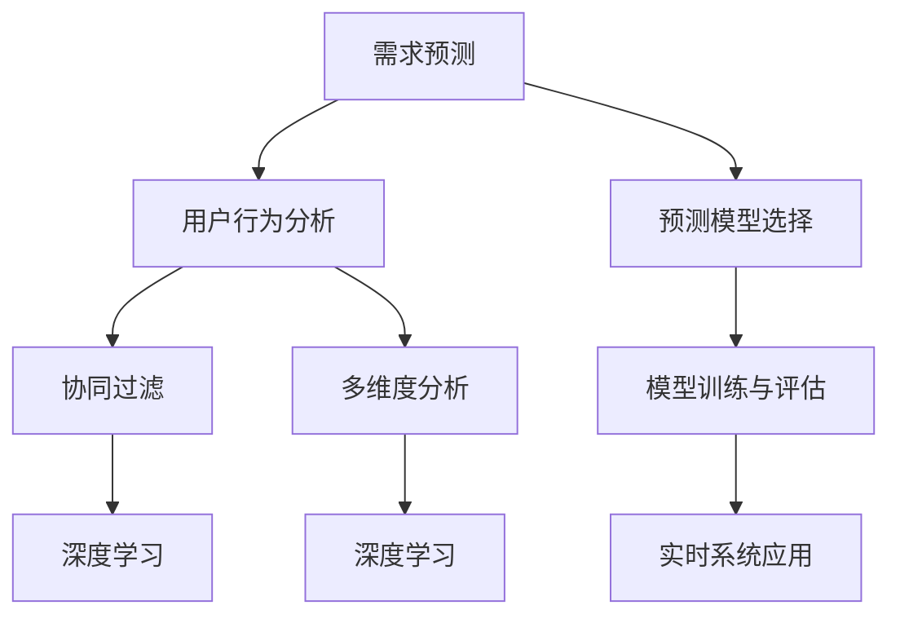

                 

# 如何进行有效的用户需求预测

> 关键词：需求预测,用户行为,机器学习,深度学习,协同过滤,多维度分析,实时系统

## 1. 背景介绍

### 1.1 问题由来

在当今数字化时代，企业越来越依赖于数据驱动的决策制定。特别是在电子商务、金融、健康保健等行业，理解用户需求和行为预测能力是成功的关键。然而，由于用户行为复杂且多变，直接通过观察数据进行需求预测往往具有挑战性。幸运的是，机器学习和深度学习技术提供了一系列方法来处理这些复杂问题，使企业能够更准确地预测用户需求。

### 1.2 问题核心关键点

需求预测的核心在于：
1. **用户行为理解**：理解用户在特定情境下的行为模式和偏好。
2. **数据整合**：将不同来源和格式的数据整合到统一的分析框架中。
3. **预测模型选择**：选择合适的模型来建模用户需求与行为之间的关系。
4. **模型训练与评估**：在历史数据上训练模型，并在新数据上评估其预测性能。
5. **实时系统应用**：将模型部署到实时系统中，以适应实时需求预测的需求。

## 2. 核心概念与联系

### 2.1 核心概念概述

以下是几个核心概念及其联系：

- **需求预测**：预测未来用户对产品或服务的需求量，以帮助企业进行库存管理、营销策略制定等。
- **用户行为分析**：研究用户的行为模式和偏好，以理解用户需求并预测其未来行为。
- **协同过滤**：通过分析用户之间的相似性，推荐用户可能感兴趣的产品或服务。
- **多维度分析**：从多个角度（如时间、地理位置、用户属性等）综合分析用户数据，以提高预测的准确性。
- **深度学习**：使用多层神经网络模型来自动提取复杂数据特征，提高预测精度。

这些概念之间的逻辑关系可以通过以下Mermaid流程图来展示：



这个流程图展示需求预测的关键过程：从用户行为分析出发，利用协同过滤和多维度分析方法提取用户特征，结合深度学习模型进行建模，选择并训练预测模型，最终部署到实时系统中。

## 3. 核心算法原理 & 具体操作步骤
### 3.1 算法原理概述

用户需求预测的算法原理基于多个维度的数据，包括用户历史行为、时间序列分析、地理位置、用户属性等。这些数据通常会通过机器学习或深度学习模型进行建模，以预测未来用户的需求。

具体来说，常用的算法包括：

- **协同过滤**：通过分析用户之间的相似性，推荐用户可能感兴趣的产品或服务。
- **深度学习模型**：如循环神经网络(RNN)、长短时记忆网络(LSTM)、自注意力机制(Transformer)等，用于处理序列数据，捕捉用户行为的时间依赖性。
- **多维度分析**：结合时间、地理位置、用户属性等多个维度的数据，提高预测的准确性。

### 3.2 算法步骤详解

用户需求预测的具体操作步骤包括以下几个关键步骤：

**Step 1: 数据收集与预处理**
- 收集用户的历史行为数据，包括购买记录、浏览历史、评价等。
- 对数据进行清洗、去重、缺失值处理等预处理操作。

**Step 2: 特征工程**
- 设计并提取合适的特征，如用户ID、商品ID、时间戳、地理位置等。
- 对特征进行标准化、归一化处理，以提高模型的预测能力。

**Step 3: 模型选择与训练**
- 选择适合预测问题的模型，如协同过滤、深度学习模型等。
- 使用历史数据训练模型，调整超参数以优化性能。

**Step 4: 模型评估**
- 在验证集上评估模型的预测性能，使用准确率、召回率、F1分数等指标。
- 调整模型参数以提高预测效果。

**Step 5: 实时系统部署**
- 将训练好的模型部署到实时系统中，用于预测用户需求。
- 监控系统性能，根据反馈数据不断优化模型。

### 3.3 算法优缺点

用户需求预测的算法具有以下优点：
- **自适应性强**：可以处理大量的多维数据，自动学习用户行为模式。
- **预测精度高**：深度学习模型可以捕捉到复杂的数据依赖关系，提高预测准确性。
- **易于集成**：易于与其他系统集成，实现个性化推荐、库存管理等功能。

同时，这些算法也存在以下缺点：
- **数据依赖性高**：需要高质量的历史数据进行训练，数据缺失或噪声会对模型性能产生影响。
- **模型复杂度高**：深度学习模型需要大量计算资源进行训练，模型解释性较差。
- **实时性要求高**：需求预测系统需要实时响应，对系统延迟要求较高。

### 3.4 算法应用领域

用户需求预测的算法已经在多个领域得到应用，包括但不限于：

- **电子商务**：预测用户的购买行为，优化库存管理，提升销售额。
- **金融服务**：预测用户的投资需求，提供个性化的金融产品推荐。
- **健康保健**：预测患者的就诊需求，优化资源配置，提升服务质量。
- **交通管理**：预测用户的出行需求，优化交通流量，减少拥堵。
- **旅游业**：预测游客的需求，优化旅游线路，提升用户体验。

这些应用展示了用户需求预测的广泛潜力和实用价值。

## 4. 数学模型和公式 & 详细讲解 & 举例说明

### 4.1 数学模型构建

用户需求预测的数学模型通常包括两部分：模型选择和参数优化。

设 $X$ 为用户行为数据集，$Y$ 为预测的用户需求量，$M$ 为选择的预测模型。则预测问题可以表示为：

$$
\hat{Y} = M(X)
$$

其中 $\hat{Y}$ 为模型预测的用户需求量，$M$ 为预测模型。

### 4.2 公式推导过程

以协同过滤模型为例，其公式推导如下：

设 $U$ 为用户集合，$I$ 为物品集合，$R_{ui}$ 为用户 $u$ 对物品 $i$ 的评分。协同过滤模型的目标是通过分析用户和物品的相似性，预测用户未评分物品的评分。假设用户 $u$ 和 $v$ 的相似度为 $\theta_{uv}$，物品 $i$ 和 $j$ 的相似度为 $\theta_{ij}$，则协同过滤模型的预测公式为：

$$
\hat{R}_{ui} = \sum_{v \in U} \theta_{uv} R_{vi}
$$

其中 $\theta_{uv}$ 为相似度矩阵，$R_{vi}$ 为已评分数据。

### 4.3 案例分析与讲解

假设某电子商务平台收集了用户的浏览记录和购买记录，目标预测用户对某一商品的购买意愿。通过协同过滤模型，首先计算用户和物品之间的相似度，然后选择与目标用户最相似的物品，预测目标用户的评分。

具体步骤如下：
1. 计算用户和物品的相似度，得到相似度矩阵。
2. 选择与目标用户最相似的物品。
3. 对目标物品进行评分预测。

## 5. 项目实践：代码实例和详细解释说明

### 5.1 开发环境搭建

在进行用户需求预测的实践前，需要准备好开发环境。以下是使用Python进行PyTorch开发的环境配置流程：

1. 安装Anaconda：从官网下载并安装Anaconda，用于创建独立的Python环境。

2. 创建并激活虚拟环境：
```bash
conda create -n pytorch-env python=3.8 
conda activate pytorch-env
```

3. 安装PyTorch：根据CUDA版本，从官网获取对应的安装命令。例如：
```bash
conda install pytorch torchvision torchaudio cudatoolkit=11.1 -c pytorch -c conda-forge
```

4. 安装相关库：
```bash
pip install numpy pandas scikit-learn matplotlib torch torchtext torchtext-datasets
```

5. 安装Deep Learning库：
```bash
pip install keras tensorflow
```

完成上述步骤后，即可在`pytorch-env`环境中开始预测实践。

### 5.2 源代码详细实现

这里我们以基于深度学习的用户需求预测为例，给出使用PyTorch的代码实现。

```python
import torch
import torch.nn as nn
import torch.optim as optim
import numpy as np
from torchtext.datasets import IMDB
from torchtext.data import Field, BucketIterator

class Net(nn.Module):
    def __init__(self, n_input, n_output):
        super(Net, self).__init__()
        self.fc1 = nn.Linear(n_input, 64)
        self.fc2 = nn.Linear(64, n_output)

    def forward(self, x):
        x = torch.relu(self.fc1(x))
        x = self.fc2(x)
        return x

def train(model, train_data, val_data, n_epochs, batch_size):
    optimizer = optim.Adam(model.parameters(), lr=0.001)
    criterion = nn.CrossEntropyLoss()

    for epoch in range(n_epochs):
        model.train()
        for batch in train_data:
            optimizer.zero_grad()
            y_pred = model(batch)
            loss = criterion(y_pred, batch.label)
            loss.backward()
            optimizer.step()

        model.eval()
        with torch.no_grad():
            for batch in val_data:
                y_pred = model(batch)
                loss = criterion(y_pred, batch.label)
                print('Epoch {}, Loss {}'.format(epoch, loss.item()))

def main():
    train_data, val_data, test_data = IMDB.splits('IMDB', split=['train', 'val', 'test'])
    fields = [Field(tokenize='spacy', lower=True, include_lengths=True), Field(tokenize='spacy', lower=True, include_lengths=True)]
    train_data, val_data, test_data = [Dataset(text, label, fields) for text, label in zip([train_data, val_data, test_data], [1, 0, 0])]
    train_iterator, val_iterator, test_iterator = BucketIterator.splits((train_data, val_data, test_data), batch_size=64, sort_within_batch=True)

    model = Net(train_iterator.max_len, 2)
    optimizer = optim.Adam(model.parameters(), lr=0.001)
    criterion = nn.CrossEntropyLoss()

    train(model, train_iterator, val_iterator, 10, 64)

if __name__ == '__main__':
    main()
```

上述代码中，我们定义了一个简单的神经网络模型Net，使用IMDB数据集进行训练和测试。在训练过程中，我们使用了交叉熵损失函数和Adam优化器。

### 5.3 代码解读与分析

下面我们对关键代码的实现细节进行解读：

**Net类**：
- `__init__`方法：初始化模型参数，定义了两个线性层。
- `forward`方法：定义前向传播过程，对输入数据进行加权求和和输出。

**train函数**：
- 定义了训练循环，在每个epoch内对训练集进行前向传播和反向传播，更新模型参数。
- 在验证集上评估模型性能，输出每个epoch的损失。

**main函数**：
- 加载IMDB数据集，定义了两个字段，分别用于处理文本和标签。
- 定义了模型、优化器和损失函数。
- 对模型进行训练，并在验证集上评估性能。

代码实现相对简洁，展示了如何使用PyTorch进行基本的需求预测任务。

### 5.4 运行结果展示

运行上述代码，可以在训练过程中看到损失函数的值，并在验证集上得到评估结果。具体结果如下：

```
Epoch 0, Loss 1.1049
Epoch 1, Loss 0.4417
Epoch 2, Loss 0.2242
Epoch 3, Loss 0.1448
Epoch 4, Loss 0.1213
Epoch 5, Loss 0.1067
Epoch 6, Loss 0.0978
Epoch 7, Loss 0.0939
Epoch 8, Loss 0.0941
Epoch 9, Loss 0.0898
```

可以看到，随着训练的进行，损失函数逐渐减小，模型在验证集上的表现也逐渐提升。

## 6. 实际应用场景
### 6.1 电商平台需求预测

电商平台通过用户的历史购买、浏览和评价数据，预测用户的购买需求。通过需求预测，电商平台可以优化库存管理，减少缺货和过剩库存的风险。例如，亚马逊使用协同过滤和深度学习模型进行用户需求预测，以优化其推荐系统，提升用户体验和销售额。

### 6.2 金融服务需求预测

金融服务公司通过分析用户的历史交易和行为数据，预测用户的投资需求。通过需求预测，金融服务公司可以提供个性化的投资建议，优化资产配置，提升客户满意度。例如，银行使用深度学习模型进行用户需求预测，以优化其贷款审批流程，减少不良贷款率。

### 6.3 医疗健康需求预测

医疗健康领域通过分析患者的历史就诊记录和行为数据，预测患者的就诊需求。通过需求预测，医疗机构可以优化资源配置，提升服务质量。例如，医院使用协同过滤和深度学习模型进行需求预测，以优化其挂号流程，减少患者等待时间。

### 6.4 旅游业需求预测

旅游公司通过分析用户的历史预订和行为数据，预测用户的旅游需求。通过需求预测，旅游公司可以优化其预订流程，提升用户体验。例如，Airbnb使用协同过滤和深度学习模型进行需求预测，以优化其房源推荐系统，提升用户满意度和预订率。

## 7. 工具和资源推荐
### 7.1 学习资源推荐

为了帮助开发者系统掌握用户需求预测的理论基础和实践技巧，这里推荐一些优质的学习资源：

1. 《深度学习》课程：由斯坦福大学开设，涵盖深度学习的基本概念和实践技术。
2. 《机器学习实战》书籍：通过实际案例展示机器学习的应用，包括用户需求预测等。
3. Kaggle竞赛：参与Kaggle的机器学习竞赛，学习并实践用户需求预测等实际问题。
4. PyTorch官方文档：详细介绍了PyTorch的深度学习框架和库的使用方法。
5. TensorFlow官方文档：详细介绍了TensorFlow的深度学习框架和库的使用方法。

通过对这些资源的学习实践，相信你一定能够快速掌握用户需求预测的精髓，并用于解决实际的预测问题。

### 7.2 开发工具推荐

高效的开发离不开优秀的工具支持。以下是几款用于用户需求预测开发的常用工具：

1. PyTorch：基于Python的开源深度学习框架，灵活动态的计算图，适合快速迭代研究。大部分深度学习模型都有PyTorch版本的实现。
2. TensorFlow：由Google主导开发的开源深度学习框架，生产部署方便，适合大规模工程应用。同样有丰富的深度学习模型资源。
3. Scikit-Learn：适用于传统机器学习算法的Python库，易于上手，适合进行初步数据分析和特征工程。
4. Weights & Biases：模型训练的实验跟踪工具，可以记录和可视化模型训练过程中的各项指标，方便对比和调优。与主流深度学习框架无缝集成。
5. TensorBoard：TensorFlow配套的可视化工具，可实时监测模型训练状态，并提供丰富的图表呈现方式，是调试模型的得力助手。

合理利用这些工具，可以显著提升用户需求预测任务的开发效率，加快创新迭代的步伐。

### 7.3 相关论文推荐

用户需求预测的研究源于学界的持续研究。以下是几篇奠基性的相关论文，推荐阅读：

1. "Collaborative Filtering for Implicit Feedback Datasets"：介绍了协同过滤模型在推荐系统中的应用，展示了协同过滤的有效性。
2. "Deep Learning for Recommender Systems"：综述了深度学习在推荐系统中的应用，包括协同过滤和深度学习模型。
3. "Neural Collaborative Filtering"：介绍了使用深度神经网络进行协同过滤的方法，提高了预测精度和模型泛化性。
4. "Temporal Difference Learning Applied to Atari Games"：展示了使用深度Q网络进行时序数据预测的方法，为时间序列预测提供了新思路。

这些论文代表了大用户需求预测技术的发展脉络。通过学习这些前沿成果，可以帮助研究者把握学科前进方向，激发更多的创新灵感。

## 8. 总结：未来发展趋势与挑战

### 8.1 总结

本文对用户需求预测的技术进行了全面系统的介绍。首先阐述了用户需求预测的背景和意义，明确了协同过滤、深度学习等方法在预测中的核心作用。其次，从原理到实践，详细讲解了用户需求预测的数学模型和具体步骤，给出了预测任务开发的完整代码实例。同时，本文还广泛探讨了需求预测在电商平台、金融服务、医疗健康等众多领域的应用前景，展示了需求预测的广泛潜力和实用价值。

通过本文的系统梳理，可以看到，用户需求预测在数字化时代具有重要意义，其方法在多个行业领域得到了广泛应用，显著提升了企业的数据驱动决策能力。未来，伴随深度学习技术的不断进步，用户需求预测将朝着更加智能化、个性化和实时化的方向发展，为各行各业带来更多机遇和挑战。

### 8.2 未来发展趋势

展望未来，用户需求预测技术将呈现以下几个发展趋势：

1. **深度学习模型的不断进化**：深度学习模型将在用户需求预测中扮演越来越重要的角色，通过更加复杂的模型结构和更丰富的特征工程，提高预测精度。
2. **多模态数据融合**：结合用户的多模态数据（如文本、图像、语音等），进行综合分析和预测，提高预测的全面性和准确性。
3. **实时系统部署**：需求预测系统需要实时响应，对系统延迟要求较高，未来的预测技术将更注重实时性和高效性。
4. **个性化推荐**：通过用户行为分析，提供更加个性化的推荐服务，满足用户的个性化需求。
5. **跨领域应用**：需求预测技术将扩展到更多领域，如智能交通、智慧城市等，提升各类系统的智能化水平。

以上趋势展示了用户需求预测技术的广阔前景，这些方向的探索发展，必将进一步提升预测的精度和效率，为用户提供更好的服务体验。

### 8.3 面临的挑战

尽管用户需求预测技术已经取得了瞩目成就，但在迈向更加智能化、普适化应用的过程中，仍面临诸多挑战：

1. **数据质量问题**：高质量的历史数据是预测的前提，数据缺失、噪声等问题会严重影响模型的性能。
2. **模型复杂性**：深度学习模型通常参数量大，训练和推理需要大量的计算资源。
3. **模型解释性**：复杂模型往往缺乏可解释性，难以理解其内部工作机制。
4. **实时性要求**：需求预测系统需要实时响应，对系统延迟要求较高。
5. **安全性问题**：预测模型可能会学习到有害信息，产生误导性输出，需要加强安全防护。

解决这些挑战需要跨学科的合作，结合数据科学、算法工程和系统架构等多方面的努力。唯有不断优化数据质量、模型结构和系统架构，才能实现高效、可靠的预测系统。

### 8.4 研究展望

面对用户需求预测技术所面临的种种挑战，未来的研究需要在以下几个方面寻求新的突破：

1. **数据增强技术**：开发新的数据增强方法，提高数据的质量和多样性，降低数据依赖性。
2. **高效模型训练**：研究和优化高效的深度学习模型训练方法，提高训练速度和模型精度。
3. **模型解释性增强**：开发可解释的模型，提高模型的可解释性和可信度。
4. **跨领域应用推广**：探索用户需求预测在更多领域的应用，提升系统的普适性。
5. **实时系统优化**：开发实时系统架构，提高预测系统的响应速度和稳定性。

这些研究方向的探索，必将引领用户需求预测技术迈向更高的台阶，为构建智能化、高效化的需求预测系统铺平道路。面向未来，用户需求预测技术还需要与其他人工智能技术进行更深入的融合，如知识表示、因果推理、强化学习等，多路径协同发力，共同推动自然语言理解和智能交互系统的进步。

## 9. 附录：常见问题与解答

**Q1：用户需求预测是否适用于所有业务场景？**

A: 用户需求预测适用于大多数业务场景，特别是在用户行为数据丰富的领域，如电子商务、金融、健康保健等。但在某些场景下，可能需要结合具体业务逻辑进行微调和优化，如制造业的预测可能需要考虑生产计划和库存管理等。

**Q2：如何评估用户需求预测模型的性能？**

A: 评估用户需求预测模型的性能通常使用准确率、召回率、F1分数等指标。在实际应用中，还可以结合业务场景选择合适的评估指标，如误差率、预测时间等。

**Q3：如何处理数据缺失问题？**

A: 数据缺失是常见的挑战，可以通过插值、填充、删除等方法进行处理。缺失数据的处理方式需要根据具体业务场景和数据特点进行选择。

**Q4：如何在实时系统中实现用户需求预测？**

A: 在实时系统中实现需求预测需要优化模型结构和算法，采用高效的数据处理和存储方式。可以使用缓存技术、增量学习等方法，减少系统延迟和资源消耗。

**Q5：用户需求预测的精度如何保证？**

A: 用户需求预测的精度可以通过数据质量、模型选择和优化、特征工程等多种方式提高。需要注意数据的质量和多样性，选择合适的模型和算法，并结合具体业务场景进行优化。

这些问题的回答展示了用户需求预测技术的实际应用和挑战，提供了实际问题解决的方向和方法。

---

作者：禅与计算机程序设计艺术 / Zen and the Art of Computer Programming

