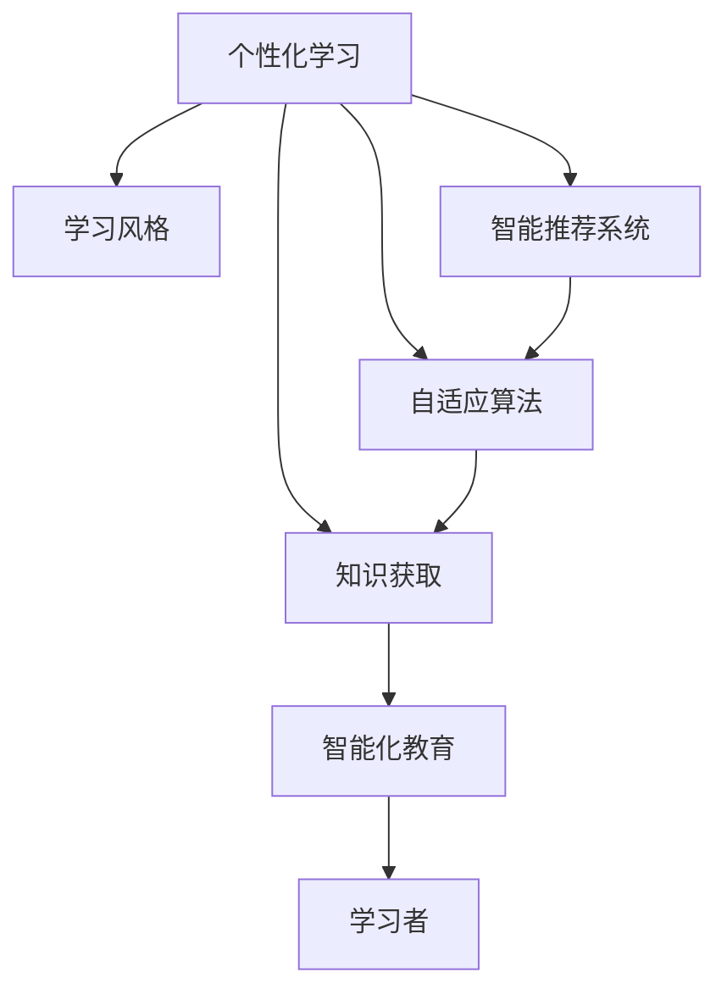

                 

# 学习风格：个性化知识获取的策略

> 关键词：个性化学习,学习风格,知识获取,智能化教育,自适应算法

## 1. 背景介绍

在信息爆炸的时代，知识获取的手段日益多样，从传统的书本、课堂到在线视频、数字资源，如何高效地获取知识成为个人和组织关注的焦点。随着人工智能和大数据技术的发展，个性化学习成为教育领域的趋势，通过数据分析和机器学习技术，为每个学习者量身定制学习计划，提升学习效果。本文旨在探讨个性化学习的核心概念，并详细分析不同的学习风格及其对知识获取的影响，通过自适应算法，构建智能化的个性化学习系统。

## 2. 核心概念与联系

### 2.1 核心概念概述

- **个性化学习**：根据个体学习者需求和特征定制化学习内容、路径和方法，实现差异化、高效化的知识获取过程。

- **学习风格**：学习者在学习过程中表现出的偏好、习惯和策略。常见的学习风格包括视觉型、听觉型、动手型、社交型等。

- **知识获取**：通过学习获取新知识的过程，包括信息的接收、处理、储存和应用。

- **智能化教育**：利用人工智能技术为学习者提供个性化的学习体验，包括自适应学习系统、智能导师、学习数据分析等。

- **自适应算法**：通过学习者行为数据不断调整学习策略和内容，实现学习路径和方式的动态调整。

- **智能推荐系统**：基于用户兴趣和行为数据，推荐个性化学习资源和活动。

这些核心概念之间存在着紧密的联系：个性化学习旨在根据学习者的特点和需求提供定制化的学习方案，而学习风格和知识获取则是学习过程中的关键要素，智能推荐系统和自适应算法是实现个性化学习的技术手段。

### 2.2 核心概念原理和架构的 Mermaid 流程图



## 3. 核心算法原理 & 具体操作步骤

### 3.1 算法原理概述

个性化学习系统的核心是自适应算法，通过分析学习者的学习风格、知识水平和行为数据，动态调整学习内容和方法。算法原理基于以下假设：

1. 学习者的学习风格和学习效果之间存在一定的关联性。
2. 学习者的行为数据能够反映其学习状态和偏好。
3. 通过不断调整学习策略，可以实现更高效的知识获取。

自适应算法的关键在于学习模型（如神经网络、贝叶斯网络、决策树等）的构建和优化，以学习者数据为输入，输出个性化的学习路径和资源推荐。

### 3.2 算法步骤详解

1. **数据收集**：从学习平台和应用中收集学习者的互动数据，包括点击、答题、观看视频等行为。

2. **特征提取**：对收集到的行为数据进行特征提取，如学习时间、答题正确率、视频观看次数等。

3. **模型训练**：使用机器学习算法训练学习模型，以预测学习者的学习风格和知识水平。

4. **路径生成**：根据预测结果生成个性化的学习路径，包括推荐的学习内容、难度和顺序。

5. **动态调整**：根据学习者的反馈和表现，实时调整学习路径和推荐内容。

6. **效果评估**：定期评估学习效果，优化模型和算法。

### 3.3 算法优缺点

#### 优点

- **个性化学习**：根据学习者特点量身定制，提升学习效率和效果。
- **自适应性强**：动态调整学习路径和内容，满足学习者需求。
- **数据驱动**：通过数据分析优化学习策略，科学性更强。

#### 缺点

- **复杂度高**：需要收集大量数据，算法实现复杂。
- **资源消耗**：实时调整需要计算资源。
- **隐私问题**：收集和分析个人数据可能涉及隐私保护问题。

### 3.4 算法应用领域

个性化学习技术广泛应用于多个领域：

- **在线教育**：如Coursera、edX等平台，根据用户数据推荐课程和学习材料。
- **企业培训**：如LinkedIn Learning，根据员工学习记录和反馈调整培训内容。
- **K-12教育**：如个性化学习软件Khan Academy，根据学生表现调整学习路径。
- **职业培训**：如Udacity等，提供职业导向的学习资源和课程。

## 4. 数学模型和公式 & 详细讲解

### 4.1 数学模型构建

设学习者为$L$，学习内容为$C$，学习策略为$S$，学习效果为$E$。学习过程可以建模为：

$$
E(L, C, S) = F(L, C, S; \theta)
$$

其中，$F$为学习模型，$\theta$为模型参数，包括学习者的学习风格、知识水平和行为数据等。

### 4.2 公式推导过程

以线性回归模型为例，推导学习效果的公式：

$$
y = \theta_0 + \theta_1 x_1 + \theta_2 x_2 + \epsilon
$$

其中，$y$表示学习效果，$x_1$和$x_2$分别表示学习时间和答题正确率，$\epsilon$为随机噪声。

### 4.3 案例分析与讲解

考虑一个在线学习平台，收集了用户的学习行为数据$(x_1, x_2, \ldots, x_n)$，其中$x_1$表示用户学习时间，$x_2$表示答题正确率。通过线性回归模型，预测用户的学习效果$y$，即完成课程的概率。

## 5. 项目实践：代码实例和详细解释说明

### 5.1 开发环境搭建

首先需要安装Python环境，使用Anaconda创建虚拟环境。然后，安装相关的Python包，如pandas、numpy、scikit-learn等。

### 5.2 源代码详细实现

以下是一个简单的线性回归模型实现，用于预测用户完成课程的概率：

```python
import pandas as pd
from sklearn.linear_model import LinearRegression
from sklearn.model_selection import train_test_split

# 加载数据集
data = pd.read_csv('user_data.csv')

# 特征工程
X = data[['learning_time', 'correct_rate']]
y = data['completion_probability']

# 分割数据集
X_train, X_test, y_train, y_test = train_test_split(X, y, test_size=0.2, random_state=42)

# 训练模型
model = LinearRegression()
model.fit(X_train, y_train)

# 预测
y_pred = model.predict(X_test)

# 评估
print(model.score(X_test, y_test))
```

### 5.3 代码解读与分析

以上代码实现了一个简单的线性回归模型，用于预测用户完成课程的概率。具体步骤如下：

1. 加载用户数据集。
2. 进行特征工程，提取学习时间和答题正确率作为输入特征。
3. 分割数据集为训练集和测试集。
4. 训练线性回归模型。
5. 在测试集上进行预测，并计算模型准确率。

## 6. 实际应用场景

### 6.1 智能推荐系统

智能推荐系统是实现个性化学习的重要手段。通过分析用户的学习数据和偏好，推荐个性化的学习资源和活动，提升学习效果。例如，Coursera平台根据用户历史学习记录和兴趣推荐课程，显著提高了用户的学习参与度和完成率。

### 6.2 自适应学习系统

自适应学习系统通过动态调整学习内容和方法，提供个性化的学习体验。如Khan Academy平台，根据学生的学习进度和表现，自动调整学习路径和难度，使学生能够高效地掌握知识。

### 6.3 企业培训系统

企业培训系统通过个性化学习技术，提升员工的技能水平和工作效率。例如，LinkedIn Learning根据员工学习记录和反馈，推荐适合的培训课程和材料，帮助员工快速提升技能。

## 7. 工具和资源推荐

### 7.1 学习资源推荐

- **Coursera**：提供大规模开放在线课程，涵盖各种学科领域。
- **edX**：提供来自全球顶尖大学的在线课程，提升学习者的专业能力。
- **Khan Academy**：提供免费的学习资源和课程，适合K-12学生和成人。

### 7.2 开发工具推荐

- **Python**：数据科学和机器学习的主流编程语言。
- **Anaconda**：创建和管理虚拟环境，便于工具和库的安装。
- **Jupyter Notebook**：交互式编程环境，方便数据分析和模型实现。
- **TensorFlow**：深度学习框架，支持大规模模型训练。
- **PyTorch**：深度学习框架，灵活易用，适合快速迭代研究。

### 7.3 相关论文推荐

- **J. Adaptive Learning Environments**：探讨自适应学习系统的设计和实现。
- **T. P. Savvas, G. K. Michael**：介绍个性化学习在企业培训中的应用。
- **K. Kozma**：研究个性化学习对学习效果的影响。

## 8. 总结：未来发展趋势与挑战

### 8.1 未来发展趋势

- **大数据分析**：随着数据量的增加，个性化学习系统将更加精准。
- **AI与教育融合**：人工智能技术将深度融合于教育领域，提供更智能化的学习体验。
- **跨领域应用**：个性化学习将拓展到更多领域，如职业培训、企业培训等。

### 8.2 面临的挑战

- **数据隐私**：个性化学习需要收集大量数据，涉及隐私保护问题。
- **算法复杂度**：实现个性化学习需要处理大规模数据，算法实现复杂。
- **资源消耗**：实时调整学习路径和内容需要计算资源。

### 8.3 研究展望

未来，个性化学习技术将持续优化和创新，主要方向包括：

- **多模态学习**：融合视觉、听觉等多种感官信息，提升学习效果。
- **自适应策略**：开发更灵活、高效的自适应算法，满足多样化学习需求。
- **认知建模**：研究学习者的认知过程，提供更加科学的学习路径。

## 9. 附录：常见问题与解答

**Q1：如何评估个性化学习系统的效果？**

A: 个性化学习系统的效果评估可以通过以下几个指标：
- 学习者参与度：如学习时长、完成率等。
- 学习效果：如考试通过率、知识掌握情况等。
- 用户满意度：通过调查问卷获取用户反馈。

**Q2：如何保护学习者的隐私数据？**

A: 保护学习者隐私是个性化学习系统的重要考量。
- 数据匿名化：去除个人标识信息，保护用户隐私。
- 数据最小化：仅收集必要的学习数据，减少隐私风险。
- 合规合规性：遵循GDPR等隐私保护法规。

**Q3：如何处理学习数据中的噪声和异常值？**

A: 处理学习数据中的噪声和异常值，需要数据清洗和预处理：
- 数据清洗：去除重复、缺失和错误数据。
- 异常值检测：使用统计方法和机器学习算法识别并处理异常值。

**Q4：如何设计高效的个性化学习系统？**

A: 设计高效的个性化学习系统，需要考虑以下几个因素：
- 用户需求分析：了解学习者的特点和需求。
- 学习路径设计：合理设计学习内容和路径。
- 动态调整机制：实时调整学习策略和内容。

**Q5：如何确保个性化学习系统的可扩展性和可靠性？**

A: 确保个性化学习系统的可扩展性和可靠性，需要以下措施：
- 系统架构设计：采用模块化和可扩展的架构。
- 数据管理策略：采用分布式存储和处理技术。
- 性能优化：优化算法和资源配置，提升系统性能。

---

作者：禅与计算机程序设计艺术 / Zen and the Art of Computer Programming

