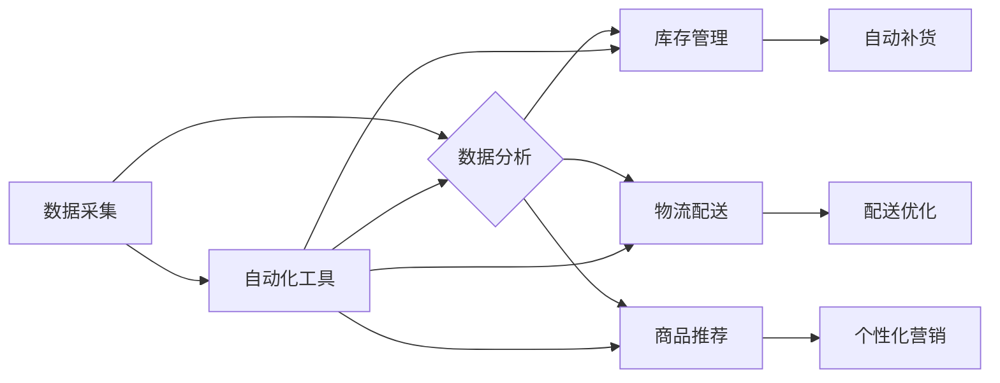

> 自动化工具，电商平台，供给能力，智能化管理，机器学习，数据分析，流程优化

## 1. 背景介绍

随着电商平台的蓬勃发展，供给能力已成为决定平台竞争力的关键因素之一。传统电商平台的供给管理模式往往依赖于人工干预，存在效率低下、成本高昂、难以应对快速变化的市场需求等问题。为了提升供给能力，电商平台需要探索更加智能化、自动化、高效的管理模式。

自动化工具作为一种重要的技术手段，能够有效解决传统供给管理模式的痛点，帮助电商平台实现智能化管理，提升供给能力。

## 2. 核心概念与联系

**2.1 核心概念**

* **自动化工具:** 指利用软件程序或脚本自动执行重复性任务，提高工作效率和准确性的工具。
* **智能化管理:** 指利用人工智能、机器学习等技术，赋予管理系统自主决策、学习和优化能力，实现更加智能化、高效化的管理模式。
* **电商平台供给能力:** 指电商平台能够提供商品和服务的总量和速度，包括商品种类、库存量、配送能力等方面。

**2.2 核心概念联系**

自动化工具是实现智能化管理的关键技术支撑。通过自动化工具，电商平台可以实现以下功能：

* **数据采集和分析:** 自动采集平台上的商品信息、用户行为数据等，并利用机器学习算法进行分析，洞察市场需求和供需关系。
* **库存管理优化:** 根据预测模型和实时数据，自动调整库存水平，避免缺货和积压。
* **物流配送优化:** 利用算法规划最优配送路线，提高配送效率和准确性。
* **商品推荐和营销:** 根据用户行为和偏好，自动推荐商品，并进行个性化营销。

**2.3 架构图**



## 3. 核心算法原理 & 具体操作步骤

**3.1 算法原理概述**

自动化工具中常用的算法包括：

* **机器学习算法:** 用于从数据中学习模式和规律，进行预测和决策。例如，预测商品需求、用户行为等。
* **优化算法:** 用于寻找最优解，例如，优化库存水平、配送路线等。
* **自然语言处理算法:** 用于处理文本数据，例如，自动提取商品信息、用户评论等。

**3.2 算法步骤详解**

以预测商品需求为例，具体步骤如下：

1. **数据采集:** 收集历史销售数据、用户行为数据、市场趋势数据等。
2. **数据预处理:** 清洗、转换、格式化数据，使其适合机器学习算法的训练。
3. **模型选择:** 选择合适的机器学习算法，例如线性回归、决策树、神经网络等。
4. **模型训练:** 利用训练数据训练机器学习模型，使其能够学习到商品需求的规律。
5. **模型评估:** 利用测试数据评估模型的预测准确率，并进行模型调优。
6. **模型部署:** 将训练好的模型部署到生产环境中，用于实时预测商品需求。

**3.3 算法优缺点**

* **优点:** 能够自动学习和优化，提高效率和准确性。
* **缺点:** 需要大量数据进行训练，算法选择和模型调优需要专业知识。

**3.4 算法应用领域**

* **电商平台:** 预测商品需求、优化库存管理、个性化推荐等。
* **金融行业:** 风险评估、欺诈检测、信用评分等。
* **医疗行业:** 疾病诊断、药物研发、患者管理等。

## 4. 数学模型和公式 & 详细讲解 & 举例说明

**4.1 数学模型构建**

假设我们想要预测商品 $i$ 在时间 $t$ 的需求量 $q_{it}$，可以构建以下线性回归模型：

$$q_{it} = \beta_0 + \beta_1 * p_{it} + \beta_2 * t + \beta_3 * s_{it} + \epsilon_{it}$$

其中：

* $q_{it}$: 商品 $i$ 在时间 $t$ 的需求量
* $p_{it}$: 商品 $i$ 在时间 $t$ 的价格
* $t$: 时间
* $s_{it}$: 商品 $i$ 在时间 $t$ 的促销力度
* $\beta_0$, $\beta_1$, $\beta_2$, $\beta_3$: 模型参数
* $\epsilon_{it}$: 随机误差项

**4.2 公式推导过程**

模型参数 $\beta_0$, $\beta_1$, $\beta_2$, $\beta_3$ 可以通过最小二乘法进行估计。最小二乘法旨在找到使得模型预测值与实际值误差平方和最小的参数值。

**4.3 案例分析与讲解**

假设我们收集了商品 $A$ 的历史销售数据，包括价格、时间、促销力度和实际需求量。我们可以利用线性回归模型对这些数据进行拟合，得到模型参数。然后，我们可以利用这个模型预测商品 $A$ 在未来某个时间段的需求量。

## 5. 项目实践：代码实例和详细解释说明

**5.1 开发环境搭建**

* 操作系统: Ubuntu 20.04
* Python 版本: 3.8
* 依赖库: pandas, scikit-learn, matplotlib

**5.2 源代码详细实现**

```python
import pandas as pd
from sklearn.linear_model import LinearRegression
import matplotlib.pyplot as plt

# 加载数据
data = pd.read_csv('sales_data.csv')

# 数据预处理
# ...

# 训练模型
model = LinearRegression()
model.fit(data[['price', 'time', 'promotion']], data['demand'])

# 预测需求量
future_data = pd.DataFrame({
    'price': [10, 12, 15],
    'time': [10, 11, 12],
    'promotion': [0.1, 0.2, 0.3]
})
predicted_demand = model.predict(future_data)

# 可视化结果
plt.scatter(data['demand'], data['price'])
plt.plot(future_data['price'], predicted_demand, color='red')
plt.xlabel('Price')
plt.ylabel('Demand')
plt.show()
```

**5.3 代码解读与分析**

* 代码首先加载销售数据，并进行必要的预处理，例如缺失值处理、特征缩放等。
* 然后，使用线性回归模型训练模型，并将训练好的模型保存到文件。
* 最后，利用训练好的模型预测未来某个时间段的商品需求量，并可视化预测结果。

**5.4 运行结果展示**

运行代码后，会生成一个散点图，其中每个点代表一个商品的销售数据。红色曲线代表模型预测的未来需求量。

## 6. 实际应用场景

**6.1 库存管理优化**

电商平台可以利用自动化工具预测商品需求，并根据预测结果自动调整库存水平。例如，如果预测某个商品的需求量会大幅增加，平台可以提前采购更多的库存，避免缺货。

**6.2 物流配送优化**

电商平台可以利用自动化工具规划最优配送路线，提高配送效率和准确性。例如，平台可以根据订单信息、配送员位置、交通状况等因素，自动规划最短的配送路线。

**6.3 商品推荐和营销**

电商平台可以利用自动化工具根据用户行为和偏好，自动推荐商品，并进行个性化营销。例如，平台可以根据用户的浏览历史、购买记录等信息，推荐用户可能感兴趣的商品。

**6.4 未来应用展望**

随着人工智能、机器学习等技术的不断发展，自动化工具在电商平台供给管理领域的应用将更加广泛和深入。例如，未来可能出现以下应用场景：

* **智能化仓储管理:** 利用机器人和人工智能技术，实现自动化仓储管理，提高仓储效率和准确性。
* **个性化供应链管理:** 根据用户的需求和偏好，定制化供应链，实现个性化商品供应。
* **预测性维护:** 利用机器学习算法预测设备故障，提前进行维护，避免设备故障导致的供应链中断。

## 7. 工具和资源推荐

**7.1 学习资源推荐**

* **书籍:**
    * 《Python机器学习》
    * 《深度学习》
* **在线课程:**
    * Coursera: 机器学习
    * edX: 深度学习
* **博客和网站:**
    * Towards Data Science
    * Machine Learning Mastery

**7.2 开发工具推荐**

* **Python:** 广泛应用于数据分析、机器学习等领域，拥有丰富的库和工具。
* **TensorFlow:** 开源深度学习框架，支持多种硬件平台。
* **PyTorch:** 开源深度学习框架，以其灵活性和易用性而闻名。

**7.3 相关论文推荐**

* **《Attention Is All You Need》:** 介绍了Transformer模型，在自然语言处理领域取得了突破性进展。
* **《Deep Learning》:** 深度学习领域的经典著作，介绍了深度学习的基本原理和应用。

## 8. 总结：未来发展趋势与挑战

**8.1 研究成果总结**

自动化工具在电商平台供给管理领域的应用取得了显著成果，例如提高了库存管理效率、优化了物流配送、提升了商品推荐准确率等。

**8.2 未来发展趋势**

未来，自动化工具将朝着以下方向发展：

* **更加智能化:** 利用更先进的人工智能算法，实现更加智能化的决策和优化。
* **更加个性化:** 根据用户的需求和偏好，提供更加个性化的服务。
* **更加协同化:** 与其他系统和平台进行集成，实现更加协同化的管理。

**8.3 面临的挑战**

自动化工具的应用也面临一些挑战，例如：

* **数据质量问题:** 自动化工具依赖于高质量的数据，而现实世界的数据往往存在噪声、缺失等问题。
* **算法解释性问题:** 一些深度学习算法的决策过程难以解释，这可能会导致用户对自动化工具的信任度降低。
* **伦理问题:** 自动化工具的应用可能会带来一些伦理问题，例如算法偏见、数据隐私等。

**8.4 研究展望**

未来，需要进一步研究如何解决自动化工具面临的挑战，并探索自动化工具在电商平台供给管理领域的更多应用场景。


## 9. 附录：常见问题与解答

**9.1 如何选择合适的自动化工具？**

选择自动化工具需要根据电商平台的具体需求和情况进行选择。需要考虑以下因素：

* 平台规模和业务类型
* 需要自动化的任务类型
* 预算和技术能力

**9.2 如何保证自动化工具的准确性和可靠性？**

保证自动化工具的准确性和可靠性需要从以下几个方面入手：

* 使用高质量的数据进行训练
* 选择合适的算法模型
* 进行充分的模型测试和验证
* 定期维护和更新自动化工具

**9.3 自动化工具会取代人工工作吗？**

自动化工具可以帮助提高工作效率和准确性，但不会完全取代人工工作。人工仍然需要在一些需要创意、判断力和决策能力的领域发挥作用。


作者：禅与计算机程序设计艺术 / Zen and the Art of Computer Programming 
<end_of_turn>