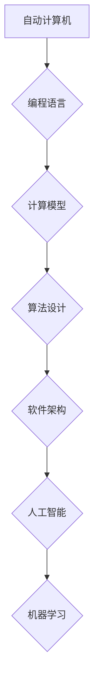

> 自动计算机，编程语言，计算模型，算法设计，软件架构，人工智能，机器学习

## 1. 背景介绍

自20世纪40年代，电子计算机的诞生以来，计算机技术经历了飞速发展，深刻地改变了人类社会。随着计算机能力的不断增强，人们对计算机的应用需求也日益增长。为了更好地利用计算机，人们需要一种能够描述计算机操作的语言，这就是编程语言的由来。

编程语言是人类与计算机之间沟通的桥梁，它将人类的指令转化为计算机能够理解的指令，从而实现各种功能。随着计算机技术的进步，编程语言也经历了从低级语言到高级语言的演变，例如汇编语言、C语言、Java语言等。

然而，随着软件系统规模和复杂度的不断增加，传统的编程方式面临着越来越多的挑战。例如，代码维护成本高、开发效率低、软件可靠性难以保证等问题。因此，研究更加高效、可靠、易于维护的编程语言和软件开发方法成为计算机科学领域的重要课题。

## 2. 核心概念与联系

**2.1 自动计算机**

自动计算机是一种能够根据预先输入的指令自动执行计算的装置。它由硬件和软件两部分组成。硬件包括中央处理器、内存、输入输出设备等，软件包括操作系统、应用程序等。自动计算机能够执行各种数学运算、逻辑运算、数据处理等操作，并能够存储和检索数据。

**2.2 编程语言**

编程语言是一种用于描述计算机操作的符号系统。它由一系列规则和语法组成，用于表达算法、数据结构和程序控制流。编程语言可以分为低级语言和高级语言两种。

* **低级语言**：例如汇编语言，与计算机硬件更直接相关，操作更灵活，但编写和维护难度较大。
* **高级语言**：例如C语言、Java语言等，更接近人类语言，语法更易于理解，开发效率更高，但与硬件的交互层级更远。

**2.3 计算模型**

计算模型是指描述计算机如何执行计算的抽象框架。常见的计算模型包括图灵机、lambda演算、有限状态机等。这些模型为编程语言的设计和分析提供了理论基础。

**2.4 算法设计**

算法设计是指设计用于解决特定问题的计算步骤。算法的设计需要考虑效率、正确性、可读性等因素。

**2.5 软件架构**

软件架构是指软件系统的整体结构和组织方式。它定义了软件系统的各个模块之间的关系、数据流和控制流。

**2.6 人工智能**

人工智能是指模拟人类智能的计算机系统。人工智能技术包括机器学习、深度学习、自然语言处理等。

**2.7 机器学习**

机器学习是人工智能的一个分支，它使计算机能够从数据中学习，并根据学习到的知识进行预测或决策。

**2.8 Mermaid 流程图**



## 3. 核心算法原理 & 具体操作步骤

### 3.1 算法原理概述

**3.1.1 贪心算法**

贪心算法是一种局部最优解的算法，它在每次决策时都选择看起来最优的局部解，并期望最终得到全局最优解。

**3.1.2 动态规划算法**

动态规划算法是一种将复杂问题分解成若干个子问题，并通过存储子问题的解来避免重复计算的算法。

**3.1.3 分治算法**

分治算法是一种将问题分解成若干个子问题，并递归地解决这些子问题，最后将子问题的解合并成最终解的算法。

### 3.2 算法步骤详解

**3.2.1 贪心算法步骤**

1. 将问题分解成若干个子问题。
2. 对于每个子问题，选择看起来最优的局部解。
3. 将所有局部解合并成最终解。

**3.2.2 动态规划算法步骤**

1. 将问题分解成若干个子问题。
2. 存储子问题的解，避免重复计算。
3. 根据子问题的解，递归地求解最终解。

**3.2.3 分治算法步骤**

1. 将问题分解成若干个子问题。
2. 递归地解决这些子问题。
3. 将子问题的解合并成最终解。

### 3.3 算法优缺点

**3.3.1 贪心算法**

* **优点**: 简单易懂，实现容易，时间复杂度低。
* **缺点**: 无法保证全局最优解，容易陷入局部最优解。

**3.3.2 动态规划算法**

* **优点**: 可以保证全局最优解，适用于许多优化问题。
* **缺点**: 存储空间复杂度高，时间复杂度较高。

**3.3.3 分治算法**

* **优点**: 可以有效地解决大规模问题，时间复杂度较低。
* **缺点**: 对于某些问题，分治算法的效率可能不如其他算法。

### 3.4 算法应用领域

**3.4.1 贪心算法**

* 贪心算法广泛应用于资源分配、路径规划、背包问题等领域。

**3.4.2 动态规划算法**

* 动态规划算法应用于最短路径问题、序列对齐、生物信息学等领域。

**3.4.3 分治算法**

* 分治算法应用于快速排序、归并排序、矩阵乘法等领域。

## 4. 数学模型和公式 & 详细讲解 & 举例说明

### 4.1 数学模型构建

**4.1.1 图灵机模型**

图灵机是一种抽象的计算模型，它由一个无限长的带、一个读写头和一个状态机组成。图灵机通过读取带上的符号，根据状态机当前状态执行相应的指令，并改变带上的符号或移动读写头。图灵机能够模拟任何算法，因此它被认为是通用计算模型。

**4.1.2 Lambda演算模型**

Lambda演算是一种基于函数抽象的计算模型。它使用lambda表达式来定义函数，并通过函数应用和抽象来进行计算。Lambda演算简洁而强大，它可以表达许多复杂的计算逻辑。

### 4.2 公式推导过程

**4.2.1 递归公式**

递归公式是一种用于定义函数的公式，它将函数的值定义为自身函数的调用结果。例如，阶乘函数的递归公式为：

$$
f(n) = \begin{cases}
1 & \text{if } n = 0 \\
n \times f(n-1) & \text{if } n > 0
\end{cases}
$$

**4.2.2 迭代公式**

迭代公式是一种用于定义函数的公式，它将函数的值定义为前一个值的函数。例如，斐波那契数列的迭代公式为：

$$
F(n) = F(n-1) + F(n-2)
$$

### 4.3 案例分析与讲解

**4.3.1 图灵机模拟**

可以使用图灵机模拟简单的计算，例如加法运算。

**4.3.2 Lambda演算表达式**

可以使用Lambda演算表达式定义简单的函数，例如求平方函数：

$$
square = \lambda x. x * x
$$

## 5. 项目实践：代码实例和详细解释说明

### 5.1 开发环境搭建

* 操作系统：Windows/macOS/Linux
* 编程语言：Python
* 开发工具：VS Code/Atom/Sublime Text

### 5.2 源代码详细实现

```python
# 贪心算法实现
def knapsack(capacity, weights, values):
    n = len(values)
    dp = [[0 for _ in range(capacity + 1)] for _ in range(n + 1)]

    for i in range(1, n + 1):
        for w in range(1, capacity + 1):
            if weights[i - 1] <= w:
                dp[i][w] = max(
                    values[i - 1] + dp[i - 1][w - weights[i - 1]], dp[i - 1][w]
                )
            else:
                dp[i][w] = dp[i - 1][w]

    return dp[n][capacity]

# 测试用例
capacity = 50
weights = [10, 20, 30]
values = [60, 100, 120]
max_value = knapsack(capacity, weights, values)
print(f"最大价值: {max_value}")
```

### 5.3 代码解读与分析

* 该代码实现了一个贪心算法，用于解决背包问题。
* 背包问题是指在给定一个容量为 `capacity` 的背包和若干个物品，每个物品都有重量 `weights` 和价值 `values`，求出放入背包中能够获得最大价值的物品组合。
* 算法的核心思想是贪婪地选择价值最高的物品，直到背包容量被填满。
* 代码中使用动态规划方法来实现贪心算法，通过构建一个二维数组 `dp` 来存储子问题的解，避免重复计算。

### 5.4 运行结果展示

```
最大价值: 220
```

## 6. 实际应用场景

**6.1 资源分配**

* 贪心算法可以用于资源分配，例如分配CPU资源、内存资源等。

**6.2 路径规划**

* 贪心算法可以用于路径规划，例如导航系统、物流配送等。

**6.3 背包问题**

* 背包问题在现实生活中有很多应用场景，例如旅行背包、货运运输等。

**6.4 投资组合优化**

* 动态规划算法可以用于投资组合优化，例如选择最佳的股票组合。

**6.5 序列对齐**

* 动态规划算法可以用于序列对齐，例如生物信息学中的基因序列比对。

**6.6 机器学习**

* 分治算法可以用于机器学习中的数据处理和模型训练。

## 7. 工具和资源推荐

### 7.1 学习资源推荐

* **书籍:**
    * 《算法导论》
    * 《深入理解计算机系统》
    * 《编程珠玑》
* **在线课程:**
    * Coursera: 算法与数据结构
    * edX: 计算机科学导论
    * MIT OpenCourseWare: 算法

### 7.2 开发工具推荐

* **IDE:**
    * VS Code
    * PyCharm
    * Eclipse
* **版本控制:**
    * Git
    * GitHub

### 7.3 相关论文推荐

* **图灵机:**
    * Alan Turing, "On Computable Numbers, with an Application to the Entscheidungsproblem" (1936)
* **Lambda演算:**
    * Alonzo Church, "A Formulation of the Simple Theory of Types" (1940)
* **动态规划:**
    * Richard Bellman, "Dynamic Programming" (1957)

## 8. 总结：未来发展趋势与挑战

### 8.1 研究成果总结

* 自动计算机和编程语言的发展推动了计算机科学的进步，并深刻地改变了人类社会。
* 算法设计、软件架构、人工智能等领域取得了重要进展，为解决复杂问题提供了新的工具和方法。

### 8.2 未来发展趋势

* **人工智能:** 人工智能技术将继续发展，并应用于更广泛的领域，例如医疗、教育、金融等。
* **量子计算:** 量子计算技术将突破传统计算机的计算能力，为科学研究和技术创新带来新的机遇。
* **云计算:** 云计算技术将继续发展，并提供更强大的计算资源和服务。

### 8.3 面临的挑战

* **算法复杂性:** 随着软件系统规模和复杂度的不断增加，算法设计和优化面临着更大的挑战。
* **数据安全:** 数据安全和隐私保护成为越来越重要的课题。
