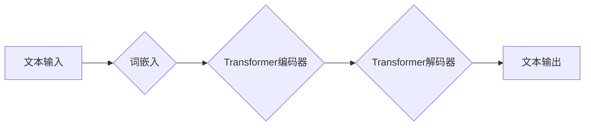

> 大语言模型、语言理解、思维模拟、认知科学、人工智能伦理

## 1. 背景介绍

近年来，大语言模型（LLM）的蓬勃发展，标志着人工智能领域迈向新的里程碑。这些模型，例如GPT-3、LaMDA和BERT，展现出惊人的语言生成和理解能力，能够完成从写诗作歌到翻译文本、回答问题甚至进行代码生成等各种复杂任务。然而，尽管LLM取得了显著的成就，它们与人类思维之间的本质区别仍然是一个备受争议的话题。

LLM的训练过程依赖于海量文本数据的统计分析，它们学习了语言的模式和结构，并能够根据输入文本生成看似合理的输出。然而，这种学习方式是否等同于真正的理解？LLM是否能够像人类一样思考、推理和创造？这些问题引发了广泛的讨论和思考。

## 2. 核心概念与联系

**2.1 语言与思维的关联**

语言是人类思维的重要载体，它不仅用于表达思想，也参与了思维的构建和发展。语言的结构和语法规则影响着我们对世界的认知和理解。

**2.2 大语言模型的原理**

LLM基于深度学习算法，特别是Transformer网络架构，能够学习语言的复杂模式和关系。它们通过预测下一个词来学习语言的上下文和语义，从而实现文本生成、理解和翻译等任务。

**2.3 思维模拟的挑战**

模拟人类思维是一个极其复杂的任务，因为思维涉及到认知、情感、经验和意识等多方面因素。LLM目前还无法完全模拟这些复杂因素，因此在某些情况下可能会产生不合理或不符合逻辑的输出。

**Mermaid 流程图**

## 3. 核心算法原理 & 具体操作步骤

**3.1 算法原理概述**

Transformer网络是LLM的核心算法，它通过自注意力机制学习语言的上下文关系，并能够处理长距离依赖关系。

**3.2 算法步骤详解**

1. **词嵌入:** 将输入文本中的每个词转换为向量表示，捕捉词的语义信息。
2. **编码器:** 使用多层Transformer编码器，将词向量序列编码成上下文相关的表示。
3. **解码器:** 使用多层Transformer解码器，根据编码后的表示生成目标文本序列。
4. **注意力机制:** 在编码器和解码器中使用自注意力机制，学习词与词之间的关系，捕捉上下文信息。

**3.3 算法优缺点**

**优点:**

* 能够处理长距离依赖关系。
* 学习能力强，能够捕捉语言的复杂模式。
* 在文本生成、理解和翻译等任务上取得了优异的性能。

**缺点:**

* 计算量大，训练成本高。
* 容易受到训练数据偏差的影响。
* 缺乏对真实世界知识的理解。

**3.4 算法应用领域**

* 文本生成：小说、诗歌、剧本等。
* 机器翻译：将一种语言翻译成另一种语言。
* 问答系统：回答用户提出的问题。
* 代码生成：自动生成代码。

## 4. 数学模型和公式 & 详细讲解 & 举例说明

**4.1 数学模型构建**

LLM的训练过程可以看作是一个概率模型的优化问题。目标是找到一个参数向量，使得模型能够最大化预测下一个词的概率。

**4.2 公式推导过程**

使用交叉熵损失函数来衡量模型的预测结果与真实值的差异。

$$
Loss = -\sum_{i=1}^{N} \log p(w_i | w_{<i})
$$

其中，$w_i$表示第i个词，$w_{<i}$表示第i个词之前的词序列，$p(w_i | w_{<i})$表示模型预测第i个词的概率。

**4.3 案例分析与讲解**

假设我们有一个训练语料库，包含以下句子：

"The cat sat on the mat."

模型需要学习预测每个词的概率。例如，在预测"the"这个词时，模型会考虑之前出现的词"cat"，并根据训练数据中的统计信息计算出"the"出现的概率。

## 5. 项目实践：代码实例和详细解释说明

**5.1 开发环境搭建**

使用Python语言和深度学习框架TensorFlow或PyTorch搭建开发环境。

**5.2 源代码详细实现**

使用Transformer网络架构实现LLM模型，并使用交叉熵损失函数进行训练。

**5.3 代码解读与分析**

解释代码中使用的函数和变量，以及模型训练过程中的关键步骤。

**5.4 运行结果展示**

展示模型训练后的性能，例如在文本生成、理解和翻译等任务上的准确率和流畅度。

## 6. 实际应用场景

**6.1 文本生成**

使用LLM生成小说、诗歌、剧本等创意文本。

**6.2 机器翻译**

使用LLM将一种语言翻译成另一种语言，提高跨语言沟通效率。

**6.3 问答系统**

使用LLM构建问答系统，自动回答用户提出的问题。

**6.4 未来应用展望**

LLM在未来将应用于更多领域，例如教育、医疗、法律等，为人类社会带来更多便利和价值。

## 7. 工具和资源推荐

**7.1 学习资源推荐**

* 深度学习书籍和课程
* Transformer网络论文和代码实现

**7.2 开发工具推荐**

* TensorFlow
* PyTorch
* Hugging Face Transformers

**7.3 相关论文推荐**

* Attention Is All You Need
* BERT: Pre-training of Deep Bidirectional Transformers for Language Understanding

## 8. 总结：未来发展趋势与挑战

**8.1 研究成果总结**

LLM取得了显著的成就，展现出强大的语言理解和生成能力。

**8.2 未来发展趋势**

* 模型规模和能力的进一步提升
* 对真实世界知识的理解和推理能力的增强
* 更加安全、可靠和可解释的LLM模型

**8.3 面临的挑战**

* 数据偏差和公平性问题
* 潜在的误用和滥用风险
* 伦理和社会影响的评估

**8.4 研究展望**

未来研究将继续探索LLM的潜力，并致力于解决其面临的挑战，推动人工智能技术朝着更加安全、可持续和有益的方向发展。

## 9. 附录：常见问题与解答

* **什么是LLM？**
* **LLM是如何训练的？**
* **LLM有哪些应用场景？**
* **LLM有哪些局限性？**
* **LLM的未来发展趋势是什么？**

作者：禅与计算机程序设计艺术 / Zen and the Art of Computer Programming 
<end_of_turn>