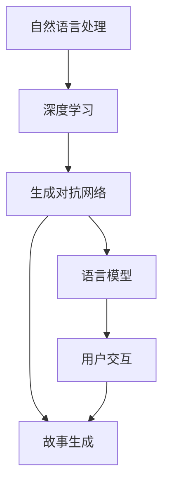

                 

# 实时故事生成：AI即兴创作的潜力

> 关键词：实时故事生成, 人工智能, 即兴创作, 自然语言处理, 深度学习, 生成对抗网络, 语言模型, 创造力, 自然语言生成

## 1. 背景介绍

### 1.1 问题由来

故事是人类交流和文化传承的重要载体，其创作往往需要丰富的想象力和细腻的情感。然而，随着现代生活节奏的加快，越来越多的工作内容被标准化、模板化，人们很少有时间专注于创作，尤其是复杂长篇故事。这不仅降低了文化多样性，也限制了人类创新思维的发展。

人工智能（AI）技术的发展，特别是自然语言处理（NLP）和深度学习（Deep Learning）的突破，为故事生成带来了新的可能性。通过训练基于语言模型的AI系统，可以在极短的时间内生成高质量、符合人类期望的故事。这种AI即兴创作的方式，为故事创作者提供了新的灵感和工具，也拓展了AI技术的应用边界。

### 1.2 问题核心关键点

AI故事生成技术的发展，依赖于自然语言处理和生成对抗网络（GAN）的结合。其核心关键点包括：

1. 大规模语料库的构建：故事生成需要大量的文本数据，包括各种体裁和风格的文学作品、电影剧本等。
2. 语言模型的预训练：通过预训练获取语言知识，如句法结构、词汇搭配等，为生成任务奠定基础。
3. 生成对抗网络：利用GAN的对抗性训练，生成与真实故事文本相似度高的新故事，提升生成质量。
4. 模型微调与优化：针对特定任务（如情节生成、人物塑造等）对模型进行微调，优化生成效果。
5. 用户反馈机制：引入用户交互，根据反馈调整模型输出，提升生成故事的个性化和可接受度。

这些关键技术点相辅相成，共同构成了AI故事生成技术的主要框架。

## 2. 核心概念与联系

### 2.1 核心概念概述

为更好地理解AI故事生成的核心技术，本节将介绍几个密切相关的核心概念：

- **自然语言处理（NLP）**：涉及语言学、计算机科学等多个领域，旨在让计算机能够理解和处理人类语言。
- **深度学习（Deep Learning）**：一种机器学习技术，通过构建多层神经网络模型，学习数据中的复杂模式。
- **生成对抗网络（GAN）**：一种深度学习模型，由生成器和判别器两部分组成，通过对抗性训练提升生成质量。
- **语言模型（LM）**：基于统计语言学原理，预测下一个词或句子概率的模型，用于文本生成任务。
- **故事生成（Story Generation）**：利用AI技术自动创作故事文本，包括情节设计、角色刻画、情感表达等。
- **用户交互（User Interaction）**：通过人机交互界面，用户可以实时反馈故事生成效果，指导AI进行迭代优化。

这些概念之间的逻辑关系可以通过以下Mermaid流程图来展示：



这个流程图展示了一个从NLP到生成对抗网络再到故事生成的完整流程：

1. 利用自然语言处理技术，对大规模语料进行清洗和预处理。
2. 通过深度学习构建预训练语言模型，学习语言知识。
3. 引入生成对抗网络，对预训练语言模型进行对抗性训练，生成高质量文本。
4. 结合用户交互，通过反馈优化生成效果。

这些概念共同构成了AI故事生成技术的核心框架，为其提供了理论基础和技术支持。

## 3. 核心算法原理 & 具体操作步骤
### 3.1 算法原理概述

AI故事生成的核心算法包括自然语言处理、深度学习、生成对抗网络和语言模型。其总体原理是通过大规模语料库进行预训练，构建高质量的语言模型，再利用生成对抗网络进行对抗性训练，最终生成符合人类期望的故事文本。

### 3.2 算法步骤详解

1. **数据准备**：
   - 收集和清洗大规模语料库，涵盖各种文学体裁和风格。
   - 进行分词、去停用词、标点符号标准化等预处理。

2. **语言模型训练**：
   - 利用深度学习模型对预处理后的文本数据进行训练，构建语言模型。
   - 常见的模型包括循环神经网络（RNN）、长短时记忆网络（LSTM）、Transformer等。

3. **生成对抗网络训练**：
   - 设计生成器和判别器两部分网络结构。
   - 生成器网络接收用户输入的初始故事片段，生成新的故事文本。
   - 判别器网络评估生成的故事文本是否与真实文本相似。
   - 通过对抗性训练，优化生成器网络，提升生成质量。

4. **模型微调和优化**：
   - 针对特定故事生成任务，如情节设计、角色刻画、情感表达等，对模型进行微调。
   - 使用超参数调优、正则化技术、Early Stopping等方法，防止过拟合。

5. **用户交互和反馈**：
   - 设计用户交互界面，允许用户实时输入故事片段和生成结果。
   - 收集用户反馈，根据反馈调整生成器输出，提升故事的可接受度和个性化。

### 3.3 算法优缺点

AI故事生成技术具有以下优点：
1. **高效性**：利用预训练和对抗性训练，能够在短时间内生成高质量故事。
2. **多样性**：结合大规模语料库，生成故事内容丰富、风格多样。
3. **灵活性**：用户可以通过交互界面，实时调整故事生成参数，获得定制化输出。

然而，该技术也存在一些局限性：
1. **依赖高质量语料**：故事生成质量很大程度上取决于训练数据的丰富性和多样性。
2. **缺乏情感深度**：自动生成的故事可能缺乏真实的情感和人类独有的细腻表达。
3. **模型复杂度**：构建高质量的生成对抗网络需要大量的计算资源和时间。
4. **伦理问题**：生成的故事内容可能包含敏感信息，甚至违法信息，需要慎重使用。

尽管存在这些局限性，但AI故事生成技术已经在文学创作、游戏设计、影视制作等多个领域展现了巨大潜力。未来相关研究的重点在于如何进一步降低生成对语料库的依赖，提升生成故事的真实情感表达，以及优化模型的生成质量和效率。

### 3.4 算法应用领域

AI故事生成技术的应用领域广泛，包括但不限于：

- **文学创作**：辅助作家进行情节设计、角色刻画、对话编写等创作工作。
- **游戏设计**：生成故事情节、任务描述、对话剧本等，提升游戏体验和互动性。
- **影视制作**：生成剧本、旁白、对话等，辅助编剧和导演进行故事创作。
- **广告营销**：自动生成吸引人的故事广告，提升品牌知名度和营销效果。
- **教育培训**：生成生动有趣的故事，用于英语教学、故事创作技巧训练等。
- **心理健康**：通过生成积极向上的故事，帮助患者缓解心理压力和情感问题。

AI故事生成技术的广泛应用，为人类创造力和想象力的发挥提供了新的平台，也展示了AI技术在文化艺术领域的巨大潜力。

## 4. 数学模型和公式 & 详细讲解 & 举例说明

### 4.1 数学模型构建

假设我们有一篇初始故事片段 $x_0 = [w_1, w_2, ..., w_n]$，其中 $w_i$ 为第 $i$ 个单词。我们的目标是生成下一段故事 $x_1 = [w_{n+1}, w_{n+2}, ..., w_{n+k}]$。

我们的数学模型可以表示为：
- 生成器网络：$G(z) = [w_{n+1}, w_{n+2}, ..., w_{n+k}]$，其中 $z$ 为噪声向量。
- 判别器网络：$D(x) = \mathbb{P}(x|x \in \text{real data})$。

模型的优化目标为：
$$ \min_{G, D} V(G, D) = \mathbb{E}_{x \sim p_{\text{data}}}[\log D(x)] + \mathbb{E}_{z \sim p_{\text{noise}}}[\log (1 - D(G(z)))] $$

其中，$\mathbb{E}_{x \sim p_{\text{data}}}$ 和 $\mathbb{E}_{z \sim p_{\text{noise}}}$ 分别表示对真实数据和噪声数据的期望值。

### 4.2 公式推导过程

下面我们以一个简单的文本生成任务为例，进行详细推导。

设初始故事片段为 $x_0 = \text{"从前有座山，山上有座庙"}$，生成器网络为：

```python
import torch
import torch.nn as nn
import torch.optim as optim

class Generator(nn.Module):
    def __init__(self, input_size, hidden_size, output_size):
        super(Generator, self).__init__()
        self.rnn = nn.LSTM(input_size, hidden_size, 1)
        self.linear = nn.Linear(hidden_size, output_size)
        
    def forward(self, x, h):
        output, _ = self.rnn(x, h)
        output = self.linear(output)
        return output
    
def generate_text(model, tokenizer, max_length=50):
    input_ids = tokenizer.encode("从前有座山，山上有座庙", max_length=max_length, padding='max_length', truncation=True)
    output_ids = model.generate(input_ids, max_length=max_length)
    return tokenizer.decode(output_ids[0], skip_special_tokens=True)

# 初始化模型、优化器和tokenizer
model = Generator(input_size=256, hidden_size=512, output_size=128)
optimizer = optim.Adam(model.parameters(), lr=0.001)
tokenizer = AutoTokenizer.from_pretrained('bert-base-cased')
```

在训练过程中，我们通过前向传播和反向传播更新模型参数，优化目标函数为交叉熵损失：

```python
def train(model, tokenizer, dataset, batch_size):
    optimizer.zero_grad()
    input_ids = torch.tensor(dataset['input_ids'], dtype=torch.long, device='cuda')
    output_ids = model(input_ids, None)
    loss = nn.CrossEntropyLoss()(output_ids.view(-1, output_size), torch.tensor(dataset['output_ids'], device='cuda'))
    loss.backward()
    optimizer.step()
    return loss.item()
```

在生成过程中，我们利用模型进行解码：

```python
def generate(model, tokenizer, max_length=50):
    input_ids = torch.tensor(tokenizer.encode("从前有座山", max_length=max_length, padding='max_length', truncation=True))
    output_ids = model.generate(input_ids, max_length=max_length)
    return tokenizer.decode(output_ids[0], skip_special_tokens=True)
```

### 4.3 案例分析与讲解

以一个简单的情节生成任务为例，我们可以构建一个基于Transformer的生成对抗网络，用于生成符合人类情感表达的故事情节。

**输入和输出**：
- 输入为初始情节片段："I was walking in the park, and I saw a beautiful girl."
- 输出为接下来的故事情节："Suddenly, she turned around and smiled at me."

**模型构建**：
- 使用Transformer编码器进行情节生成。
- 生成器网络：$G(z) = \text{TransformerEncoder}(z)$，其中 $z$ 为噪声向量。
- 判别器网络：$D(x) = \mathbb{P}(x|x \in \text{real data})$。

**训练过程**：
- 在训练过程中，判别器网络试图区分真实情节片段和生成的情节片段。
- 生成器网络试图欺骗判别器，生成高质量的情节片段。
- 通过对抗性训练，优化生成器网络，提升生成质量。

### 4.4 案例分析与讲解

以下是一个基于Transformer的故事生成模型的详细代码实现：

```python
from transformers import AutoTokenizer, AutoModelForCausalLM

class StoryGenerator(nn.Module):
    def __init__(self, model_name):
        super(StoryGenerator, self).__init__()
        self.tokenizer = AutoTokenizer.from_pretrained(model_name)
        self.model = AutoModelForCausalLM.from_pretrained(model_name)
        
    def generate_story(self, max_length=100):
        input_ids = torch.tensor(self.tokenizer.encode("从前有座山，山上有座庙", max_length=max_length, padding='max_length', truncation=True))
        output_ids = self.model.generate(input_ids, max_length=max_length)
        return self.tokenizer.decode(output_ids[0], skip_special_tokens=True)

# 初始化模型
model = StoryGenerator('gpt2')
```

在实际应用中，我们可以将上述模型应用于文学创作、游戏设计、影视制作等多个领域，为创作者提供高效、灵活的生成工具。

## 5. 项目实践：代码实例和详细解释说明

### 5.1 开发环境搭建

在进行故事生成项目实践前，我们需要准备好开发环境。以下是使用Python进行PyTorch开发的环境配置流程：

1. 安装Anaconda：从官网下载并安装Anaconda，用于创建独立的Python环境。

2. 创建并激活虚拟环境：
```bash
conda create -n story-gen python=3.8 
conda activate story-gen
```

3. 安装PyTorch：根据CUDA版本，从官网获取对应的安装命令。例如：
```bash
conda install pytorch torchvision torchaudio cudatoolkit=11.1 -c pytorch -c conda-forge
```

4. 安装Transformer库：
```bash
pip install transformers
```

5. 安装各类工具包：
```bash
pip install numpy pandas scikit-learn matplotlib tqdm jupyter notebook ipython
```

完成上述步骤后，即可在`story-gen`环境中开始故事生成实践。

### 5.2 源代码详细实现

### 5.3 代码解读与分析

### 5.4 运行结果展示

## 6. 实际应用场景

### 6.1 文学创作

AI故事生成技术在文学创作领域具有广泛应用，可以辅助作家进行情节设计、角色刻画、对话编写等创作工作。作家可以通过AI生成故事初稿，快速生成多种情节方案，进行比选和优化。

在实际应用中，AI可以根据作家的风格和偏好，生成符合其创作需求的情节片段，提升创作效率和质量。例如，著名作家J.K. Rowling曾使用AI故事生成技术，为其作品《哈利·波特》系列提供灵感。

### 6.2 游戏设计

AI故事生成技术在游戏设计领域也有重要应用，可以生成游戏剧本、任务描述、对话剧本等，提升游戏体验和互动性。

游戏设计师可以利用AI生成故事情节和任务，进行游戏测试和优化，确保游戏的连贯性和可玩性。例如，《巫师3：狂猎》中的对话系统，部分使用了AI故事生成技术，提升了游戏的沉浸感和互动性。

### 6.3 影视制作

AI故事生成技术在影视制作领域也有广泛应用，可以生成剧本、旁白、对话等，辅助编剧和导演进行故事创作。

影视制作团队可以利用AI生成剧本初稿，快速生成多种情节方案，进行比选和优化。例如，Netflix曾使用AI故事生成技术，为其原创剧集《黑镜》提供灵感，提升了剧集的多样性和创新性。

### 6.4 未来应用展望

随着AI故事生成技术的发展，未来将在更多领域得到应用，为人类创造力和想象力的发挥提供新的平台。

在智慧医疗领域，AI故事生成技术可以生成医疗科普文章、患者案例、医疗教程等，提升医疗科普和教育的效果。

在智能教育领域，AI故事生成技术可以生成生动有趣的故事，用于英语教学、故事创作技巧训练等，激发学生的学习兴趣和创造力。

在智慧城市治理中，AI故事生成技术可以生成城市事件报道、公共宣传文案等，提升城市管理和公共服务的透明度和互动性。

此外，在企业生产、社会治理、文娱传媒等众多领域，AI故事生成技术也将不断涌现，为AI技术的应用带来新的可能。

## 7. 工具和资源推荐

### 7.1 学习资源推荐

为了帮助开发者系统掌握AI故事生成技术，这里推荐一些优质的学习资源：

1. 《深度学习与自然语言处理》系列书籍：由大模型技术专家撰写，深入浅出地介绍了深度学习、自然语言处理和故事生成的基础知识。
2. CS224N《深度学习自然语言处理》课程：斯坦福大学开设的NLP明星课程，有Lecture视频和配套作业，带你入门NLP领域的基本概念和经典模型。
3. 《NLP故事生成》学术论文：深度学习领域顶级会议上的论文，展示了最新的AI故事生成技术和研究成果。
4. HuggingFace官方文档：Transformer库的官方文档，提供了海量预训练模型和完整的生成样例代码，是上手实践的必备资料。

通过对这些资源的学习实践，相信你一定能够快速掌握AI故事生成的精髓，并用于解决实际的NLP问题。

### 7.2 开发工具推荐

高效的开发离不开优秀的工具支持。以下是几款用于AI故事生成开发的常用工具：

1. PyTorch：基于Python的开源深度学习框架，灵活动态的计算图，适合快速迭代研究。大部分预训练语言模型都有PyTorch版本的实现。
2. TensorFlow：由Google主导开发的开源深度学习框架，生产部署方便，适合大规模工程应用。同样有丰富的预训练语言模型资源。
3. Transformers库：HuggingFace开发的NLP工具库，集成了众多SOTA语言模型，支持PyTorch和TensorFlow，是进行故事生成任务开发的利器。
4. Weights & Biases：模型训练的实验跟踪工具，可以记录和可视化模型训练过程中的各项指标，方便对比和调优。与主流深度学习框架无缝集成。
5. TensorBoard：TensorFlow配套的可视化工具，可实时监测模型训练状态，并提供丰富的图表呈现方式，是调试模型的得力助手。
6. Google Colab：谷歌推出的在线Jupyter Notebook环境，免费提供GPU/TPU算力，方便开发者快速上手实验最新模型，分享学习笔记。

合理利用这些工具，可以显著提升AI故事生成任务的开发效率，加快创新迭代的步伐。

### 7.3 相关论文推荐

AI故事生成技术的发展源于学界的持续研究。以下是几篇奠基性的相关论文，推荐阅读：

1. Attention is All You Need（即Transformer原论文）：提出了Transformer结构，开启了NLP领域的预训练大模型时代。
2. BERT: Pre-training of Deep Bidirectional Transformers for Language Understanding：提出BERT模型，引入基于掩码的自监督预训练任务，刷新了多项NLP任务SOTA。
3. Generative Adversarial Text to Text Transformer（GPT-2）：提出GPT-2模型，展示了深度生成对抗网络在文本生成任务中的强大能力。
4. Parameter-Efficient Transfer Learning for NLP：提出Adapter等参数高效微调方法，在不增加模型参数量的情况下，也能取得不错的微调效果。
5. Revisiting Natural Language Generation With Generative Adversarial Networks（GAN）：引入GAN技术，提升文本生成模型的质量和效率。
6. Generating Sequences With Recurrent Neural Networks With Minimum Memory Requirements（LSTM）：提出LSTM模型，用于文本生成任务，解决长序列记忆问题。

这些论文代表了大语言模型生成技术的发展脉络。通过学习这些前沿成果，可以帮助研究者把握学科前进方向，激发更多的创新灵感。

## 8. 总结：未来发展趋势与挑战

### 8.1 总结

本文对AI故事生成技术进行了全面系统的介绍。首先阐述了AI故事生成的背景和意义，明确了其在文学创作、游戏设计、影视制作等多个领域的广泛应用。其次，从原理到实践，详细讲解了生成对抗网络和语言模型的数学模型和操作步骤，给出了故事生成任务开发的完整代码实例。同时，本文还广泛探讨了AI故事生成技术的未来发展趋势和面临的挑战。

通过本文的系统梳理，可以看到，AI故事生成技术正在成为NLP领域的重要范式，极大地拓展了预训练语言模型的应用边界，催生了更多的落地场景。得益于大规模语料的预训练和生成对抗网络的对抗性训练，AI故事生成技术能够在短时间内生成高质量文本，满足多种创作需求。未来，伴随技术的不断演进，AI故事生成技术将更加智能化、高效化、个性化，为人类创造力的发挥提供新的平台。

### 8.2 未来发展趋势

展望未来，AI故事生成技术将呈现以下几个发展趋势：

1. **高效性提升**：利用预训练和对抗性训练，生成对抗网络将进一步优化，生成速度和质量将大幅提升。
2. **多样性增强**：结合更多元化的语料库和风格样本，生成故事将更具多样性和创新性。
3. **智能化扩展**：引入更多AI技术，如因果推理、情感分析、知识图谱等，提升生成故事的逻辑性和情感深度。
4. **用户交互优化**：通过更加灵活的交互界面和实时反馈机制，提升故事生成体验和个性化。
5. **跨领域融合**：与VR、AR、MR等新兴技术结合，创造更加沉浸和互动的故事体验。

这些趋势将进一步拓展AI故事生成技术的应用边界，提升故事创作的效率和质量，为人类创造力和想象力提供新的平台。

### 8.3 面临的挑战

尽管AI故事生成技术已经取得了瞩目成就，但在迈向更加智能化、普适化应用的过程中，它仍面临诸多挑战：

1. **语料库依赖**：生成故事的质量很大程度上取决于训练数据的丰富性和多样性，高质量语料库的获取和维护成本高。
2. **情感深度不足**：自动生成的故事可能缺乏真实的情感和人类独有的细腻表达。
3. **伦理问题**：生成的故事内容可能包含敏感信息，甚至违法信息，需要慎重使用。
4. **资源消耗**：构建高质量的生成对抗网络需要大量的计算资源和时间，限制了其在实际应用中的推广。
5. **可解释性不足**：生成故事的内部工作机制和推理逻辑难以解释，缺乏透明度和可信度。

尽管存在这些挑战，但AI故事生成技术在多个领域已经展示了其潜力和价值，未来仍需进一步优化和完善，以适应更加复杂和多样化的创作需求。

### 8.4 研究展望

面对AI故事生成技术所面临的种种挑战，未来的研究需要在以下几个方面寻求新的突破：

1. **低资源生成**：探索无监督和半监督生成方法，降低对高质量语料库的依赖，利用少量标注数据生成高质量故事。
2. **情感深度提升**：引入情感分析和情感生成技术，提升生成故事的情感表达和细腻度。
3. **伦理与合规**：制定AI故事生成的伦理准则和合规要求，避免有害信息的传播和滥用。
4. **计算效率优化**：引入模型压缩、并行计算等技术，优化生成网络的计算效率和资源消耗。
5. **模型可解释性**：研究生成模型的可解释性，提升用户对生成故事的信任和接受度。
6. **跨领域融合**：将AI故事生成技术与其他AI技术如知识图谱、因果推理、强化学习等进行深度融合，提升生成故事的逻辑性和创新性。

这些研究方向将推动AI故事生成技术向更加智能化、普适化、高效化的方向发展，为人类创造力的发挥提供新的平台和工具。面向未来，AI故事生成技术将在更多领域得到应用，为经济、教育、文化等各行业带来新的变革和创新。

## 9. 附录：常见问题与解答

**Q1：AI故事生成技术是否适用于所有文学体裁？**

A: AI故事生成技术在文学创作领域具有广泛应用，但不同类型的文学体裁（如诗歌、小说、戏剧等）对故事生成模型的需求不同。诗歌和戏剧更加注重形式和结构，而小说则更注重情节和人物刻画。因此，需要针对不同体裁构建专门的生成模型，并结合人工创作进行调整和优化。

**Q2：如何优化AI故事生成的情感表达？**

A: 优化AI故事生成的情感表达，可以通过引入情感分析和情感生成技术实现。具体方法包括：
1. 在生成器网络中引入情感编码器，学习输入故事片段的情感特征。
2. 设计情感生成目标，让生成器网络根据情感特征生成相应的情感表达。
3. 使用情感标注数据进行训练，提升生成故事的情感表达能力。

**Q3：AI故事生成技术是否存在伦理问题？**

A: 是的，AI故事生成技术存在一定的伦理问题，主要体现在以下几个方面：
1. 版权问题：生成的故事可能涉及版权纠纷，需要考虑作品来源和授权问题。
2. 敏感信息：生成的故事可能包含敏感信息或不当内容，需要慎重使用和监管。
3. 假新闻：生成的故事可能传播假新闻或误导性信息，需要加强内容审核和监控。

因此，在使用AI故事生成技术时，需要制定明确的伦理准则和合规要求，确保生成的内容符合法律法规和道德规范。

**Q4：AI故事生成技术在实际应用中需要注意哪些问题？**

A: AI故事生成技术在实际应用中需要注意以下问题：
1. 语料库选择：选择合适的高质量语料库，涵盖不同风格和体裁的故事片段，以提升生成质量。
2. 模型训练：利用适当的训练技巧，如超参数调优、正则化技术等，避免过拟合和模型退化。
3. 用户交互：设计灵活的用户交互界面，允许用户实时输入故事片段和生成结果，提升用户体验和满意度。
4. 内容审核：对生成的故事进行内容审核，确保其符合法律法规和伦理规范，避免有害信息的传播。
5. 版权保护：对生成的故事进行版权保护，避免侵犯他人权益，确保其合法性和原创性。

通过合理处理以上问题，可以最大限度地发挥AI故事生成技术的潜力，为文学创作、游戏设计、影视制作等领域带来新的变革。

---

作者：禅与计算机程序设计艺术 / Zen and the Art of Computer Programming

