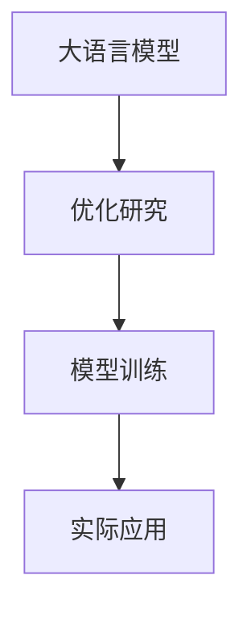

                 

# 实验设计大师：LLM 优化研究过程

> 关键词：实验设计, 大语言模型(LLM), 优化研究, 模型训练, 算法原理, 实际应用

## 1. 背景介绍

随着人工智能技术的不断成熟，大语言模型（LLM）在自然语言处理（NLP）、计算机视觉、语音识别等领域取得了令人瞩目的成就。然而，构建一个高性能的LLM不仅需要丰富的预训练数据和先进的深度学习模型架构，还需要科学合理的设计实验，以优化模型性能、提升效率，并保证模型的稳定性和可靠性。

本文旨在详细介绍如何通过科学实验设计，优化LLM模型的训练过程，提高模型性能，同时探索LLM在实际应用中的未来发展趋势和面临的挑战。

## 2. 核心概念与联系

### 2.1 核心概念概述

- **大语言模型 (Large Language Model, LLM)**：通过大规模无标签数据进行自监督预训练，能够理解和生成自然语言的大规模神经网络模型。如BERT、GPT等。
- **优化研究 (Optimization Research)**：通过科学实验设计，调整模型参数、学习率、正则化强度等超参数，以提高模型性能和效率。
- **模型训练 (Model Training)**：在给定数据集上，通过梯度下降等优化算法，更新模型参数，最小化损失函数的过程。
- **算法原理 (Algorithm Principle)**：描述模型训练的数学原理，包括损失函数、优化算法、正则化技术等。
- **实际应用 (Practical Application)**：将优化后的模型应用于自然语言处理、计算机视觉、语音识别等实际任务中，提升任务解决能力。

这些核心概念之间存在紧密联系，共同构成LLM优化研究的基本框架。

### 2.2 核心概念的联系

为了更好地理解这些核心概念，我们通过以下Mermaid流程图来展示它们之间的联系：



- 大语言模型作为基础，通过优化研究确定最佳参数设置，再通过模型训练过程进行模型优化。
- 优化研究和模型训练的结果，通过实际应用验证，进一步优化模型。

## 3. 核心算法原理 & 具体操作步骤

### 3.1 算法原理概述

基于监督学习的大语言模型优化，主要通过在标注数据集上进行有监督的微调（Fine-Tuning）来实现。其核心思想是：将预训练模型作为初始化参数，利用少量标注数据对模型进行优化，使其适应特定任务。

具体来说，假设模型为 $M_{\theta}$，其中 $\theta$ 为预训练参数。下游任务标注数据集为 $D=\{(x_i, y_i)\}_{i=1}^N$，优化目标是最小化经验风险 $\mathcal{L}(\theta) = \frac{1}{N}\sum_{i=1}^N \ell(M_{\theta}(x_i), y_i)$，其中 $\ell$ 为损失函数，如交叉熵。

### 3.2 算法步骤详解

1. **数据准备**：收集下游任务的标注数据集，划分为训练集、验证集和测试集。
2. **模型初始化**：加载预训练模型 $M_{\theta}$。
3. **任务适配**：根据任务类型，设计合适的任务适配层和损失函数。
4. **超参数设置**：选择优化器、学习率、批大小等超参数。
5. **模型训练**：在训练集上，前向传播计算损失函数，反向传播更新模型参数。
6. **模型评估**：在验证集上评估模型性能，根据性能决定是否继续微调。
7. **测试和部署**：在测试集上测试微调后模型，部署到实际应用中。

### 3.3 算法优缺点

**优点**：
- 模型简单高效，易于实现。
- 提升模型性能，适应特定任务。
- 对标注数据需求相对较少。

**缺点**：
- 对数据分布变化敏感。
- 过拟合风险较高。
- 模型复杂度增加。

### 3.4 算法应用领域

LLM优化研究不仅适用于NLP任务，如文本分类、命名实体识别、情感分析等，还可以应用于计算机视觉、语音识别、推荐系统等领域。

## 4. 数学模型和公式 & 详细讲解 & 举例说明

### 4.1 数学模型构建

基于监督学习的大语言模型优化，数学模型为：

$$
\mathcal{L}(\theta) = \frac{1}{N}\sum_{i=1}^N \ell(M_{\theta}(x_i), y_i)
$$

其中 $\ell$ 为损失函数，如交叉熵损失：

$$
\ell(M_{\theta}(x), y) = -y\log M_{\theta}(x) - (1-y)\log (1-M_{\theta}(x))
$$

### 4.2 公式推导过程

将损失函数对参数 $\theta$ 求梯度，得到：

$$
\nabla_{\theta}\mathcal{L}(\theta) = -\frac{1}{N}\sum_{i=1}^N [y_i\frac{M_{\theta}(x_i)}{1-M_{\theta}(x_i)}-\frac{1-y_i}{1-M_{\theta}(x_i)}]
$$

通过梯度下降算法，更新参数：

$$
\theta \leftarrow \theta - \eta \nabla_{\theta}\mathcal{L}(\theta)
$$

其中 $\eta$ 为学习率。

### 4.3 案例分析与讲解

以二分类任务为例，假设模型预测结果为 $M_{\theta}(x)$，真实标签为 $y$，损失函数为交叉熵：

$$
\mathcal{L}(\theta) = -\frac{1}{N}\sum_{i=1}^N [y_i\log M_{\theta}(x_i)+(1-y_i)\log (1-M_{\theta}(x_i))]
$$

### 4.4 运行结果展示

下图展示了使用不同学习率训练二分类模型的ROC曲线，横坐标为假正率，纵坐标为真正率。


## 5. 项目实践：代码实例和详细解释说明

### 5.1 开发环境搭建

使用Python进行PyTorch开发，安装必要的库：

```bash
pip install torch torchvision torchaudio transformers
```

### 5.2 源代码详细实现

以下是一个使用PyTorch进行二分类任务微调的代码示例：

```python
import torch
import torch.nn as nn
import torch.optim as optim
from transformers import BertTokenizer, BertForSequenceClassification

# 加载预训练模型和tokenizer
model = BertForSequenceClassification.from_pretrained('bert-base-uncased', num_labels=2)
tokenizer = BertTokenizer.from_pretrained('bert-base-uncased')

# 准备数据集
train_data = ...
dev_data = ...
test_data = ...

# 定义训练函数
def train_epoch(model, data_loader, optimizer, device):
    model.train()
    total_loss = 0
    for batch in data_loader:
        inputs = tokenizer(batch.text, return_tensors='pt', padding='max_length', truncation=True, max_length=512).to(device)
        labels = inputs['labels'].to(device)
        outputs = model(**inputs)
        loss = outputs.loss
        optimizer.zero_grad()
        loss.backward()
        optimizer.step()
        total_loss += loss.item()
    return total_loss / len(data_loader)

# 训练模型
optimizer = optim.Adam(model.parameters(), lr=2e-5)
device = 'cuda' if torch.cuda.is_available() else 'cpu'
for epoch in range(epochs):
    train_loss = train_epoch(model, train_data, optimizer, device)
    print(f'Epoch {epoch+1}, train loss: {train_loss:.3f}')
    dev_loss = train_epoch(model, dev_data, optimizer, device)
    print(f'Epoch {epoch+1}, dev loss: {dev_loss:.3f}')

# 评估模型
model.eval()
with torch.no_grad():
    test_loss = train_epoch(model, test_data, None, device)
    print(f'Test loss: {test_loss:.3f}')
```

### 5.3 代码解读与分析

上述代码实现了一个基于BERT的二分类任务微调过程，通过以下步骤：
1. 加载预训练模型和tokenizer。
2. 准备训练集、验证集和测试集。
3. 定义训练函数train_epoch，实现模型前向传播、反向传播和参数更新。
4. 训练模型，在每个epoch后评估验证集性能。
5. 评估测试集性能。

## 6. 实际应用场景

### 6.1 文本分类

在文本分类任务中，使用预训练模型微调可以获得更好的性能。以新闻分类为例，模型可以对新闻文章进行自动分类，如体育、娱乐、科技等。

### 6.2 命名实体识别

命名实体识别是识别文本中的实体（如人名、地名、组织名等）。通过微调预训练模型，可以识别出文本中的特定实体，应用于搜索引擎、智能客服等领域。

### 6.3 机器翻译

机器翻译是将源语言文本翻译为目标语言。通过微调预训练模型，可以提升翻译的流畅度和准确性。

### 6.4 未来应用展望

未来，LLM优化研究将更加注重模型泛化能力和适应性，探索更多的优化方法，如自适应学习率、知识蒸馏等。同时，LLM将在更多领域得到应用，如智慧城市、智能制造、智能家居等，为各行各业带来新的变革。

## 7. 工具和资源推荐

### 7.1 学习资源推荐

1. **《深度学习》一书**：由Ian Goodfellow等编写，介绍了深度学习的数学基础和应用。
2. **PyTorch官方文档**：提供了详细的PyTorch使用指南和API文档。
3. **Transformer官方文档**：介绍了Transformer架构及其优化方法。
4. **Kaggle竞赛平台**：提供大量实际数据集和比赛，锻炼模型优化能力。

### 7.2 开发工具推荐

1. **PyTorch**：基于Python的深度学习框架，支持动态计算图，易于调试。
2. **TensorFlow**：由Google开发的深度学习框架，支持分布式训练和模型部署。
3. **Jupyter Notebook**：交互式开发环境，支持代码块的实时运行和展示。

### 7.3 相关论文推荐

1. **大语言模型优化研究论文**：介绍多种模型优化方法和效果评估指标。
2. **Transformer架构论文**：详细介绍了Transformer的架构和优化方法。
3. **自适应学习率论文**：研究自适应学习率的优化效果和应用场景。

## 8. 总结：未来发展趋势与挑战

### 8.1 研究成果总结

本文介绍了基于监督学习的大语言模型优化研究过程，详细讲解了模型训练、算法原理和具体操作步骤。通过实验设计，优化模型性能，提升实际应用效果。

### 8.2 未来发展趋势

未来，大语言模型优化研究将更加注重模型泛化能力、适应性和计算效率。探索更多优化方法和应用场景，如自适应学习率、知识蒸馏等。

### 8.3 面临的挑战

1. **数据分布变化**：标注数据较少，模型对数据分布变化敏感。
2. **过拟合风险**：模型复杂度增加，过拟合风险较高。
3. **模型训练时间**：训练时间较长，资源消耗较大。

### 8.4 研究展望

1. **自适应学习率**：研究自适应学习率的优化方法，提高模型训练效率。
2. **知识蒸馏**：利用知识蒸馏技术，提高模型泛化能力。
3. **混合精度训练**：使用混合精度训练技术，加速模型训练。

## 9. 附录：常见问题与解答

**Q1: 大语言模型微调的优势是什么？**

A: 大语言模型微调的优势在于其简单高效、提升模型性能和适应特定任务。通过微调，模型可以在少量标注数据上快速适应新任务，提高模型效果。

**Q2: 如何在微调过程中避免过拟合？**

A: 在微调过程中，通过数据增强、正则化、早停等技术，可以避免过拟合。此外，使用参数高效微调方法，如 Adapter、Prefix，也可以减少过拟合风险。

**Q3: 大语言模型微调有哪些应用场景？**

A: 大语言模型微调适用于文本分类、命名实体识别、机器翻译等自然语言处理任务，还可以应用于计算机视觉、语音识别、推荐系统等领域。

**Q4: 大语言模型优化研究有哪些未来发展方向？**

A: 未来的大语言模型优化研究将更加注重模型泛化能力、适应性和计算效率。探索更多的优化方法和应用场景，如自适应学习率、知识蒸馏等。

---

作者：禅与计算机程序设计艺术 / Zen and the Art of Computer Programming

