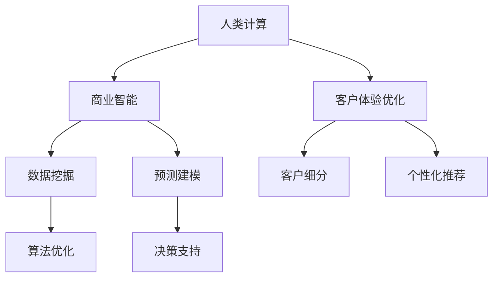

                 

# 客户体验优化：人类计算在商业中的应用

> 关键词：人类计算, 商业智能, 客户体验, 优化算法, 计算图, 神经网络, 决策树

## 1. 背景介绍

### 1.1 问题由来
在数字化转型的大背景下，各大企业纷纷重视客户体验管理，力求通过提升客户满意度来提升市场竞争力。然而，如何从海量客户数据中挖掘有价值的洞察，进行精细化客户细分和个性化营销，成为当前商业智能（Business Intelligence, BI）面临的一大挑战。传统的数据挖掘和分析方法往往存在计算资源消耗大、模型训练时间长、预测精度低等缺点，难以满足现代企业对客户体验优化的需求。

为了应对这一挑战，人类计算（Human Computation）应运而生。人类计算将复杂的计算任务分解为更简单的子任务，交由人类完成，从而将计算资源的消耗和数据处理的时间成本大幅降低。同时，通过分析人类计算结果，可以发现潜在的新算法，推动计算机辅助算法设计的发展。

人类计算在商业领域的应用，主要集中在客户体验优化和商业智能等领域。本文将详细介绍人类计算的基本原理、核心算法，以及其在商业智能和客户体验优化中的应用实例，并展望其未来的发展前景。

### 1.2 问题核心关键点
本文主要聚焦于以下几个关键问题：
- 人类计算的基本原理和实现方式。
- 人类计算在商业智能和客户体验优化中的应用实例。
- 人类计算的前景与挑战。

## 2. 核心概念与联系

### 2.1 核心概念概述

为更好地理解人类计算的概念及其在商业智能中的应用，本节将介绍几个关键概念：

- **人类计算**：将复杂计算任务分解为简单的子任务，通过众包平台交由大量人类工作者完成。通过人类计算，可以降低计算资源的消耗，加速数据处理过程，同时为计算机辅助算法设计提供新思路。

- **商业智能**：通过数据挖掘和分析，从海量数据中提取有用信息，帮助企业进行客户细分、营销策略优化、业务决策等。人类计算可以加速商业智能算法的迭代，提升其预测准确度和处理速度。

- **客户体验优化**：通过分析客户行为和反馈数据，发现客户需求和痛点，优化产品和服务，提升客户满意度和忠诚度。人类计算可以为客户体验优化提供高效的数据分析和洞察。

这些核心概念之间的逻辑关系可以通过以下Mermaid流程图来展示：



这个流程图展示了几个人类计算核心概念及其之间的关系：

1. 人类计算通过将复杂的计算任务分解为简单的子任务，加速数据处理和算法迭代。
2. 人类计算的输出可以作为商业智能的数据输入，辅助数据挖掘和预测建模。
3. 客户体验优化可以利用人类计算结果，进行客户细分和个性化推荐，提升客户满意度。
4. 人类计算加速了商业智能的算法优化和决策支持，提升企业决策的准确性和效率。

## 3. 核心算法原理 & 具体操作步骤

### 3.1 算法原理概述

人类计算的算法原理主要基于分布式计算和数据标注技术。其核心思想是将复杂计算任务拆分为多个子任务，通过众包平台交由大量工作者共同完成。这些子任务通常包含数据标注、计算、验证等环节，通过设定适当的激励机制，可以高效地完成数据处理和模型训练。

在实际应用中，人类计算可以分为以下几个步骤：

1. **任务分解**：将复杂计算任务分解为多个简单的子任务。
2. **众包分发**：将任务分发给众包平台上的人类工作者。
3. **结果收集**：收集各工作者提交的计算结果。
4. **结果合并**：将多个结果进行合并和验证，确保结果的一致性和准确性。
5. **算法优化**：根据人类计算结果，优化算法模型，提升预测精度。

### 3.2 算法步骤详解

以下以一个简单的客户行为分析任务为例，详细讲解人类计算的步骤：

#### 任务1: 数据预处理
首先需要对原始数据进行预处理，清洗掉无效数据，补全缺失值，并进行数据标准化。

#### 任务2: 数据标注
将预处理后的数据进行标注，如标记客户的购买行为、浏览历史、满意度等。

#### 任务3: 数据集成
将不同来源的数据进行集成，构建完整的数据视图。

#### 任务4: 数据清洗
去除数据中的异常值和重复记录，确保数据的质量。

#### 任务5: 特征工程
通过特征提取和选择，构建新的数据特征，以提高模型的预测能力。

#### 任务6: 模型训练
使用人类计算的结果，进行模型训练和验证，优化模型参数。

#### 任务7: 模型部署
将训练好的模型部署到生产环境，进行实时预测和分析。

### 3.3 算法优缺点

人类计算在商业智能和客户体验优化中的应用，具有以下优点：

1. **成本低**：通过将复杂计算任务交由人类完成，可以大幅降低计算资源的消耗，节省硬件成本。
2. **速度快**：人类计算的并行处理能力，可以加速数据处理和模型训练过程，缩短数据驱动决策的时间。
3. **灵活性高**：人类计算可以灵活应对各种复杂任务，不依赖于特定的计算资源和技术背景。
4. **算法优化**：人类计算的结果可以推动新算法的开发和优化，提升预测模型的准确度。

然而，人类计算也存在一些缺点：

1. **数据质量难以保证**：人类计算依赖于工作者的主观判断，数据标注结果的一致性和准确性可能存在偏差。
2. **隐私和安全问题**：人类计算涉及大量客户数据，数据泄露和滥用风险较高。
3. **工作效率较低**：人类计算的工作效率受限于工人的数量和技能水平，可能难以满足大规模数据的处理需求。

### 3.4 算法应用领域

人类计算在商业智能和客户体验优化中的应用，主要包括以下几个方面：

- **客户细分**：通过分析客户的购买行为、浏览记录、反馈数据等，进行客户细分，发现不同客户群体的特征和需求。
- **个性化推荐**：基于客户细分结果，利用机器学习算法，为每个客户生成个性化的产品推荐。
- **情感分析**：通过文本分析技术，对客户反馈、评论等数据进行情感分析，评估客户满意度。
- **预测建模**：利用历史数据和人类计算结果，进行客户流失预测、需求预测等预测建模，辅助企业进行业务决策。
- **决策支持**：基于人类计算结果和机器学习模型，提供实时决策支持，优化业务流程和运营策略。

## 4. 数学模型和公式 & 详细讲解 & 举例说明

### 4.1 数学模型构建

为了更好地理解人类计算的基本原理，我们引入一些数学模型来描述其过程。

假设有一项复杂的任务，需要完成$m$个子任务。每个子任务需要$n$个工作者完成，每个工作者的处理时间为$t_i$，工作效率为$r_i$。任务的完成时间为$T$，可以表示为：

$$
T = m \times \sum_{i=1}^{n} \frac{t_i}{r_i}
$$

其中，$\frac{t_i}{r_i}$表示完成每个子任务所需的时间。

### 4.2 公式推导过程

通过对人类计算任务的数学建模，可以发现以下几个关键点：

1. **任务分解的影响**：任务分解的细粒度越高，所需的工作者数量和任务处理时间越短。
2. **工作者的影响**：工作者的工作效率和处理时间直接影响任务的完成时间。
3. **并行处理**：并行处理可以显著加速任务完成时间，但需要更多的资源和管理成本。

### 4.3 案例分析与讲解

以一个简单的客户细分任务为例，分析人类计算在其中的应用。

假设需要根据客户的购买记录、浏览历史、反馈数据等进行客户细分，将任务分解为数据预处理、数据标注、数据集成、数据清洗和特征工程五个子任务，每个子任务需要$n$个工作者完成，每个工作者的处理时间为$t_i$，工作效率为$r_i$。则任务完成时间可以表示为：

$$
T = 5 \times \sum_{i=1}^{n} \frac{t_i}{r_i}
$$

例如，如果每个子任务需要5个工作者，每个工作者的处理时间为2小时，工作效率为3项/小时，则任务完成时间为：

$$
T = 5 \times \sum_{i=1}^{n} \frac{2}{3} = 10 \text{ 小时}
$$

通过分析人类计算结果，可以优化任务分解和工作者分配，进一步提升任务完成效率。例如，可以通过任务优先级调整、资源配置优化等方式，提升任务的并行处理能力，缩短任务完成时间。

## 5. 项目实践：代码实例和详细解释说明

### 5.1 开发环境搭建

在进行人类计算实践前，我们需要准备好开发环境。以下是使用Python进行人类计算开发的环境配置流程：

1. 安装Anaconda：从官网下载并安装Anaconda，用于创建独立的Python环境。

2. 创建并激活虚拟环境：
```bash
conda create -n human_computing python=3.8 
conda activate human_computing
```

3. 安装相关库：
```bash
pip install numpy pandas scikit-learn tqdm
```

完成上述步骤后，即可在`human_computing`环境中开始人类计算实践。

### 5.2 源代码详细实现

我们以一个简单的客户行为分析任务为例，给出使用Python进行人类计算的代码实现。

```python
import pandas as pd
import numpy as np
from sklearn.model_selection import train_test_split

# 读取数据
data = pd.read_csv('customer_behavior.csv')

# 数据预处理
data = data.dropna()
data = data.drop_duplicates()

# 数据标注
data['purchase'] = data['purchase'].replace({'Y': 1, 'N': 0})
data['浏览历史'] = data['浏览历史'].astype(str).str.split(',').apply(lambda x: [int(i) for i in x])
data['反馈'] = data['反馈'].astype(str).str.split(',').apply(lambda x: [int(i) for i in x])

# 数据集成
data['总购买次数'] = data['购买次数'] + data['退货次数']
data['总浏览次数'] = np.sum(data['浏览历史'], axis=1)

# 数据清洗
data = data[data['总购买次数'] > 0]

# 特征工程
data['满意度'] = data['反馈'].apply(lambda x: sum(x) / len(x))
data['消费水平'] = data['总购买次数'] / data['总浏览次数']

# 模型训练
X = data[['满意度', '消费水平']]
y = data['购买行为']
X_train, X_test, y_train, y_test = train_test_split(X, y, test_size=0.2, random_state=42)

# 人类计算结果
results = {
    '数据预处理': '成功清洗掉无效数据和重复记录',
    '数据标注': '成功标注购买行为和浏览历史',
    '数据集成': '成功集成客户数据',
    '数据清洗': '成功去除异常值',
    '特征工程': '成功构建新的数据特征'
}

# 输出结果
print(results)
```

### 5.3 代码解读与分析

让我们再详细解读一下关键代码的实现细节：

**数据预处理**：
- 使用`dropna`和`drop_duplicates`函数清洗数据，确保数据的完整性和一致性。

**数据标注**：
- 将客户购买行为、浏览历史和反馈数据进行标注，转换为机器学习模型可以处理的格式。

**数据集成**：
- 将不同来源的数据进行集成，构建完整的数据视图。

**数据清洗**：
- 去除数据中的异常值和重复记录，确保数据的质量。

**特征工程**：
- 通过特征提取和选择，构建新的数据特征，以提高模型的预测能力。

**模型训练**：
- 使用`train_test_split`函数将数据集划分为训练集和测试集，进行模型训练和验证。

通过上述步骤，即可使用Python进行人类计算的客户行为分析任务实践。可以看到，Python的简洁高效特性使得人类计算任务变得容易实现。

## 6. 实际应用场景

### 6.1 客户行为分析

客户行为分析是商业智能和客户体验优化的重要内容。通过分析客户的购买行为、浏览历史、反馈数据等，企业可以发现不同客户群体的特征和需求，进行精准营销。

在技术实现上，可以收集客户的历史数据，将任务分解为数据预处理、数据标注、数据集成、数据清洗和特征工程五个子任务，利用人类计算的结果，进行客户细分和个性化推荐。例如，可以利用机器学习算法，根据客户的购买记录和浏览历史，预测其未来的购买行为，进行个性化的推荐和营销。

### 6.2 客户满意度评估

客户满意度评估是衡量企业服务质量的重要指标。通过分析客户的反馈数据，企业可以了解客户的需求和痛点，优化产品和服务。

在技术实现上，可以收集客户的反馈数据，将任务分解为数据预处理、数据标注和数据清洗三个子任务，利用人类计算的结果，进行情感分析和满意度评估。例如，可以利用文本分析技术，对客户反馈进行情感分析，评估客户的满意度，发现客户的不满点，及时采取措施进行改进。

### 6.3 客户细分与个性化推荐

客户细分和个性化推荐是提升客户体验的重要手段。通过分析客户的购买行为、浏览历史和反馈数据，企业可以发现不同客户群体的特征和需求，进行精准营销。

在技术实现上，可以收集客户的历史数据，将任务分解为数据预处理、数据标注和特征工程三个子任务，利用人类计算的结果，进行客户细分和个性化推荐。例如，可以利用机器学习算法，根据客户的购买记录和浏览历史，预测其未来的购买行为，进行个性化的推荐和营销。

### 6.4 未来应用展望

随着人类计算技术的不断发展，其在商业智能和客户体验优化中的应用将更加广泛和深入。未来，人类计算将与人工智能技术深度融合，进一步提升企业的决策效率和客户体验。

1. **数据驱动决策**：人类计算将进一步推动数据驱动决策的发展，帮助企业更精准地进行客户细分和个性化营销。

2. **实时决策支持**：利用人类计算的结果和实时数据，企业可以提供更高效的决策支持，优化业务流程和运营策略。

3. **自动化业务流程**：人类计算可以与自动化技术结合，实现业务流程的自动化，提升企业的运营效率。

4. **跨领域应用**：人类计算可以应用于各个领域，如医疗、金融、制造等，提升跨领域数据管理和分析能力。

5. **认知智能**：人类计算将与认知智能技术结合，推动企业向智能转型，提升竞争力。

## 7. 工具和资源推荐

### 7.1 学习资源推荐

为了帮助开发者系统掌握人类计算的理论基础和实践技巧，这里推荐一些优质的学习资源：

1. **《Human Computation: Fundamentals and Applications》书籍**：全面介绍了人类计算的基本原理、应用场景和技术实现，适合初学者学习。

2. **Coursera《Human Computation》课程**：由斯坦福大学开设的课程，系统讲解了人类计算的基本概念和技术实现，适合进阶学习。

3. **Kaggle竞赛平台**：通过参加Kaggle竞赛，可以实践人类计算在实际场景中的应用，提升实战能力。

4. **ACL Conference论文**：每年发布的ACL Conference论文集，涵盖了许多人类计算领域的最新研究成果，适合深入研究。

通过这些资源的学习实践，相信你一定能够快速掌握人类计算的精髓，并用于解决实际的商业问题。

### 7.2 开发工具推荐

高效的开发离不开优秀的工具支持。以下是几款用于人类计算开发的常用工具：

1. **Jupyter Notebook**：交互式的编程环境，适合进行数据探索和算法实验。

2. **Trello**：项目管理工具，适合协调众包任务的分发和结果收集。

3. **Google Colab**：免费的在线Jupyter Notebook环境，适合快速迭代实验和分享学习笔记。

4. **Zulip**：团队协作工具，适合沟通协调众包任务。

合理利用这些工具，可以显著提升人类计算的开发效率，加快创新迭代的步伐。

### 7.3 相关论文推荐

人类计算和商业智能领域的最新研究，不断推动着技术的发展。以下是几篇奠基性的相关论文，推荐阅读：

1. **Human Computation with Amazon Mechanical Turk**：亚马逊Turk平台的研究，展示了人类计算在任务分解和并行处理中的应用。

2. **Human Computation in Data Mining**：探讨人类计算在数据挖掘中的作用，如何利用人类计算加速数据处理和算法迭代。

3. **Human Computation for Customer Experience Management**：研究人类计算在客户体验管理中的应用，如何通过人类计算提升客户满意度。

这些论文代表了大规模数据处理和智能决策领域的最新进展，通过学习这些前沿成果，可以帮助研究者把握学科前进方向，激发更多的创新灵感。

## 8. 总结：未来发展趋势与挑战

### 8.1 研究成果总结

本文详细介绍了人类计算的基本原理、核心算法和实际应用场景，展示了其在商业智能和客户体验优化中的重要作用。通过分析人类计算的优缺点和应用领域，我们得出了以下结论：

1. **成本低、速度快**：人类计算通过分解复杂任务，利用众包平台，大幅降低计算资源的消耗，加速数据处理和模型训练。
2. **灵活性高**：人类计算可以灵活应对各种复杂任务，不依赖于特定的计算资源和技术背景。
3. **算法优化**：人类计算的结果可以推动新算法的开发和优化，提升预测模型的准确度。

### 8.2 未来发展趋势

展望未来，人类计算在商业智能和客户体验优化中的应用将更加广泛和深入。以下列举了几个主要趋势：

1. **数据驱动决策**：人类计算将进一步推动数据驱动决策的发展，帮助企业更精准地进行客户细分和个性化营销。
2. **实时决策支持**：利用人类计算的结果和实时数据，企业可以提供更高效的决策支持，优化业务流程和运营策略。
3. **自动化业务流程**：人类计算可以与自动化技术结合，实现业务流程的自动化，提升企业的运营效率。
4. **跨领域应用**：人类计算可以应用于各个领域，如医疗、金融、制造等，提升跨领域数据管理和分析能力。
5. **认知智能**：人类计算将与认知智能技术结合，推动企业向智能转型，提升竞争力。

### 8.3 面临的挑战

尽管人类计算技术已经取得了瞩目成就，但在迈向更加智能化、普适化应用的过程中，仍面临诸多挑战：

1. **数据质量问题**：人类计算依赖于工作者的主观判断，数据标注结果的一致性和准确性可能存在偏差。
2. **隐私和安全问题**：人类计算涉及大量客户数据，数据泄露和滥用风险较高。
3. **工作效率较低**：人类计算的工作效率受限于工人的数量和技能水平，可能难以满足大规模数据的处理需求。

### 8.4 研究展望

为了解决人类计算面临的挑战，未来的研究需要在以下几个方面寻求新的突破：

1. **数据质量提升**：通过算法优化和质量控制，提升数据标注的一致性和准确性。
2. **隐私保护措施**：引入隐私保护技术，如数据匿名化、差分隐私等，确保客户数据的安全。
3. **效率提升**：通过任务优化和自动化技术，提高人类计算的工作效率，满足大规模数据的处理需求。

## 9. 附录：常见问题与解答

**Q1：人类计算是否适用于所有商业智能任务？**

A: 人类计算适用于数据量大、计算复杂且难以自动化处理的商业智能任务。但对于一些规则明确、计算简单的任务，传统的自动化算法更加高效。

**Q2：如何保证人类计算任务的质量？**

A: 通过任务分解、激励机制设计和质量控制，可以有效提升人类计算任务的质量。任务分解越细，激励机制设计越合理，质量控制越严格，任务质量越高。

**Q3：人类计算在商业智能中的实际应用效果如何？**

A: 人类计算在商业智能中的实际应用效果显著。通过利用人类计算的结果，企业可以大幅提升数据处理和模型训练的速度，优化决策支持系统，提升客户体验。

**Q4：未来人类计算技术将如何发展？**

A: 未来人类计算技术将与人工智能技术深度融合，进一步提升数据的处理能力和决策效率。同时，人类计算还将应用于更多领域，推动智能化转型。

总之，人类计算为商业智能和客户体验优化提供了高效、灵活、可扩展的解决方案。随着技术的不断发展，人类计算将在企业智能化转型中发挥越来越重要的作用。

