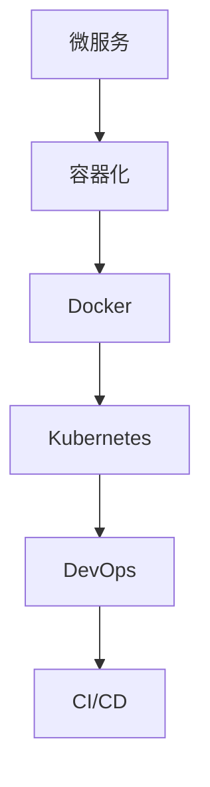

                 

# 容器化微服务：简化部署和扩展

> 关键词：微服务、容器化、Docker、Kubernetes、微服务架构、DevOps、CI/CD、容器编排、Docker Compose、Kubernetes Deployment

## 1. 背景介绍

### 1.1 问题由来
在当今快速变化的商业环境中，企业需要迅速响应市场变化，推出新功能或业务。传统的大型单体应用（Monolithic Application）难以支持快速迭代和灵活扩展，常常需要从头开发或大规模重构。而微服务架构（Microservices Architecture）通过将应用拆分为多个独立且可自主运行的服务，可以显著提升开发效率和系统扩展能力，满足企业快速响应的需求。

然而，微服务的部署和运维依然存在一些挑战：
1. **部署复杂性**：每个服务需要单独部署和配置，导致部署流程繁琐且容易出错。
2. **资源管理困难**：每个微服务独立运行，资源管理复杂且效率低下。
3. **服务间通信困难**：微服务之间需要通过网络进行通信，容易出现延迟和服务间依赖问题。
4. **故障隔离困难**：一个服务的故障可能导致整个系统的崩溃，影响系统可用性。

容器化（Containerization）技术通过将微服务打包成容器（Container），解决了上述问题，使微服务的部署和运维更加便捷高效。容器化技术可以帮助企业快速构建、部署和扩展微服务，提高系统的可扩展性、可靠性和自动化水平。

## 2. 核心概念与联系

### 2.1 核心概念概述

为更好地理解容器化微服务，本节将介绍几个密切相关的核心概念：

- **微服务架构（Microservices Architecture）**：将应用拆分为多个独立且可自主运行的服务，每个服务拥有自己的代码库、数据库和配置，通过网络进行通信。微服务架构提高了系统的可扩展性、灵活性和可靠性。

- **容器化（Containerization）**：通过将应用打包到容器中，使应用在任意环境中都能一致运行，提高了应用的可移植性和自动化部署能力。

- **Docker**：一种开源的容器化技术，提供了一个轻量级的、高效的、可移植的容器运行环境。

- **Kubernetes**：一个开源的容器编排平台，负责自动部署、扩展和管理容器化应用。

- **DevOps**：结合软件开发（Dev）和运维（Ops）的方法，旨在提高软件交付的速度和质量，缩短产品从设计到发布的周期。

- **CI/CD**：持续集成（CI）和持续部署（CD）的合称，是DevOps的核心实践，用于自动化软件开发生命周期的各个阶段。

这些核心概念之间的逻辑关系可以通过以下Mermaid流程图来展示：



这个流程图展示了几大核心概念之间的关系：

1. 微服务架构是容器化技术的基础，将应用拆分为多个独立服务。
2. Docker将微服务打包成容器，提高了应用的可移植性和自动化部署能力。
3. Kubernetes负责容器编排和部署，自动管理容器的生命周期。
4. DevOps是微服务架构和容器化技术的实践框架，持续集成和持续部署是其核心。

这些概念共同构成了微服务架构的基础，使其能够在快速变化的市场环境中快速响应和高效扩展。

## 3. 核心算法原理 & 具体操作步骤
### 3.1 算法原理概述

容器化微服务的基本原理是将微服务打包成容器，通过容器编排工具进行部署和管理，实现应用的快速构建、部署和扩展。其核心思想是通过标准化、自动化和标准化的方法，使微服务的开发、部署和运维更加高效和可靠。

### 3.2 算法步骤详解

容器化微服务通常包括以下几个关键步骤：

**Step 1: 应用拆分为微服务**
- 根据业务需求，将大型应用拆分为多个独立的服务，每个服务拥有自己的代码库、数据库和配置。

**Step 2: 应用打包为容器**
- 使用Docker将每个微服务打包成独立的容器镜像。容器镜像包含了应用代码、依赖库、环境变量等所有运行所需的资源。

**Step 3: 容器编排和管理**
- 使用Kubernetes管理容器的生命周期，自动部署、扩展和管理容器。

**Step 4: 持续集成和持续部署**
- 通过CI/CD工具自动化构建、测试和部署容器化应用，提高软件交付的速度和质量。

**Step 5: 监控和日志收集**
- 实时监控容器化应用的性能和健康状况，收集日志信息，便于排错和优化。

### 3.3 算法优缺点

容器化微服务具有以下优点：
1. **快速部署**：容器化使应用在任意环境中都能一致运行，简化了部署流程，提高了部署效率。
2. **高效扩展**：容器编排工具自动管理容器的生命周期，能够快速扩展和缩减服务实例，提高系统的可扩展性。
3. **环境一致性**：每个容器拥有独立的环境，避免环境差异导致的问题，提高了应用的可靠性。
4. **自动化运维**：通过CI/CD工具实现自动化部署和测试，减少了人为操作的错误，提高了系统的稳定性和自动化水平。

同时，容器化微服务也存在一些局限性：
1. **资源消耗高**：每个容器都需要独立的资源，资源消耗较大，对硬件要求较高。
2. **学习曲线陡峭**：需要掌握Docker、Kubernetes等容器化技术，学习曲线较陡峭。
3. **管理复杂**：容器化系统复杂，需要管理和维护的容器数量较多，容易出现管理和运维问题。

尽管存在这些局限性，但就目前而言，容器化微服务是实现微服务架构的最主流范式。未来相关研究的重点在于如何进一步降低资源消耗，简化管理流程，提高系统的自动化水平。

### 3.4 算法应用领域

容器化微服务在企业应用中得到了广泛应用，覆盖了几乎所有常见领域，例如：

- **金融**：金融企业通过容器化微服务提升系统的可靠性和自动化水平，支持高频交易和复杂业务处理。
- **电商**：电商企业通过容器化微服务支持高并发和大规模商品展示和交易，提升用户体验。
- **社交**：社交平台通过容器化微服务支持大规模用户数据处理和实时推送，提升用户体验。
- **游戏**：游戏企业通过容器化微服务支持高性能和高并发的游戏服务器和数据处理，提升游戏体验。

除了上述这些经典应用外，容器化微服务也被创新性地应用到更多场景中，如物联网、大数据、区块链等，为企业数字化转型提供了新的技术路径。

## 4. 数学模型和公式 & 详细讲解  
### 4.1 数学模型构建

容器化微服务的数学模型通常包括两个主要部分：
- 容器镜像的构建和管理
- 容器编排的优化算法

以Docker和Kubernetes为例，我们以容器镜像的构建和管理为例，给出具体的数学模型和公式。

### 4.2 公式推导过程

Docker容器镜像的构建过程可以分为三个主要步骤：

1. **应用安装和配置**：在宿主机上安装应用依赖库，配置应用环境变量。
2. **打包为Docker镜像**：使用Docker命令将宿主机的应用和依赖库打包为Docker镜像。
3. **部署和运行容器**：将Docker镜像部署为容器，并在容器中运行应用。

具体公式如下：

$$
\text{Docker Image} = \text{Application Package} + \text{Dependency Libraries} + \text{Environment Variables}
$$

Kubernetes容器编排的优化算法可以分为两个主要部分：

1. **负载均衡和资源调度**：根据应用负载和资源需求，自动分配和调度容器实例。
2. **自动扩缩容**：根据应用负载变化，自动扩展和缩减容器实例，保持系统资源的合理利用。

具体公式如下：

$$
\text{Container Instance} = f(\text{Load Balancing}, \text{Resource Scheduling}, \text{Auto Scaling})
$$

### 4.3 案例分析与讲解

以下是一个基于Docker和Kubernetes的微服务部署案例：

**Step 1: 应用拆分为微服务**
- 将用户注册模块和登录模块拆分为两个独立的微服务。

**Step 2: 应用打包为容器**
- 使用Docker命令将用户注册模块和登录模块打包为两个独立的容器镜像。

**Step 3: 容器编排和管理**
- 使用Kubernetes Deployment和Service配置文件定义两个微服务的容器编排。
- 使用Kubernetes Deployment自动部署和管理容器实例。

**Step 4: 持续集成和持续部署**
- 使用Jenkins和GitLab CI/CD工具自动化构建、测试和部署容器化应用。

**Step 5: 监控和日志收集**
- 使用Prometheus和Grafana实时监控容器化应用的性能和健康状况。
- 使用Fluentd和Kibana收集容器化应用的日志信息。

这个案例展示了容器化微服务从应用拆分为微服务，到应用打包为容器，再到容器编排和部署的完整过程。通过使用Docker和Kubernetes，我们可以实现微服务的自动化部署和高效管理。

## 5. 项目实践：代码实例和详细解释说明
### 5.1 开发环境搭建

在进行微服务部署实践前，我们需要准备好开发环境。以下是使用Python和Docker进行微服务部署的环境配置流程：

1. 安装Anaconda：从官网下载并安装Anaconda，用于创建独立的Python环境。

2. 创建并激活虚拟环境：
```bash
conda create -n microservice-env python=3.8 
conda activate microservice-env
```

3. 安装Docker：根据CUDA版本，从官网获取对应的安装命令。例如：
```bash
sudo apt-get update
sudo apt-get install docker-ce
sudo systemctl enable docker
sudo systemctl start docker
```

4. 拉取并运行Docker镜像：
```bash
docker pull alpine
docker run -it --name alpine-test alpine
```

5. 安装Kubernetes：使用Kubernetes官方文档进行安装，根据环境选择合适的安装方式。

6. 安装CI/CD工具：安装Jenkins、GitLab CI/CD等工具，搭建持续集成和持续部署的自动化流程。

完成上述步骤后，即可在`microservice-env`环境中开始微服务部署实践。

### 5.2 源代码详细实现

下面我们以用户注册模块为例，给出使用Docker和Kubernetes进行微服务部署的PyTorch代码实现。

**用户注册模块**

首先，定义用户注册模块的Dockerfile：

```Dockerfile
FROM python:3.8
COPY requirements.txt requirements.txt
RUN pip install -r requirements.txt
COPY . .
EXPOSE 8000
CMD ["python", "app.py"]
```

然后，定义Kubernetes Deployment和Service配置文件：

```yaml
apiVersion: v1
kind: Deployment
metadata:
  name: user-register-deployment
spec:
  replicas: 3
  selector:
    matchLabels:
      app: user-register
  template:
    metadata:
      labels:
        app: user-register
    spec:
      containers:
      - name: user-register
        image: user-register:latest
        ports:
        - containerPort: 8000
        readinessProbe:
          httpGet:
            path: /health
            port: 8000
            scheme: HTTP
          initialDelaySeconds: 5
          periodSeconds: 10

apiVersion: v1
kind: Service
metadata:
  name: user-register-service
spec:
  selector:
    app: user-register
  ports:
  - protocol: TCP
    port: 80
    targetPort: 8000
  type: LoadBalancer
```

最后，启动Docker镜像和Kubernetes Deployment：

```bash
docker build -t user-register .
docker push user-register:latest

kubectl apply -f deployment.yaml
kubectl apply -f service.yaml
```

以上就是使用Docker和Kubernetes进行微服务部署的完整代码实现。可以看到，Docker和Kubernetes使微服务的部署和运维变得更加简洁高效。

### 5.3 代码解读与分析

让我们再详细解读一下关键代码的实现细节：

**Dockerfile**

- `FROM python:3.8`：指定基础镜像为Python 3.8。
- `COPY requirements.txt requirements.txt`：将requirements.txt文件复制到容器中。
- `RUN pip install -r requirements.txt`：在容器中安装requirements.txt中的依赖库。
- `COPY . .`：将应用代码复制到容器中。
- `EXPOSE 8000`：指定应用的公开端口为8000。
- `CMD ["python", "app.py"]`：指定容器的启动命令为运行app.py脚本。

**Kubernetes配置文件**

- `kind: Deployment`：定义一个Deployment资源。
- `replicas: 3`：定义3个副本。
- `selector`：定义选择器，用于选择与当前Pod匹配的标签。
- `template`：定义Pod的模板，包括标签、容器、端口和探针等配置。
- `kind: Service`：定义一个Service资源。
- `selector`：定义选择器，用于选择与当前Pod匹配的标签。
- `ports`：定义服务的公开端口和目标端口。
- `type: LoadBalancer`：指定服务的类型为负载均衡。

这个配置文件定义了一个包含3个副本的用户注册微服务，并使用Service将其公开。在实际应用中，还可以根据需求进一步优化配置，如设置环境变量、添加健康检查等。

**微服务部署**

- `docker build -t user-register .`：构建Docker镜像并命名。
- `docker push user-register:latest`：将Docker镜像推送到Docker Hub。
- `kubectl apply -f deployment.yaml`：将Deployment配置文件应用到Kubernetes集群。
- `kubectl apply -f service.yaml`：将Service配置文件应用到Kubernetes集群。

以上步骤展示了从Docker镜像构建到Kubernetes Deployment和Service的完整过程。通过使用Docker和Kubernetes，我们可以实现微服务的快速构建、部署和扩展。

## 6. 实际应用场景
### 6.1 智慧金融平台

基于容器化微服务的应用，智慧金融平台可以实现更高的可用性和自动化运维。平台通过将金融服务拆分为独立的微服务，提高了系统的可扩展性和灵活性。每个微服务独立部署和扩展，提高了系统的稳定性。同时，通过容器编排工具，平台可以实现快速部署和故障隔离，提升了系统的可用性。

### 6.2 电商零售平台

电商零售平台通过容器化微服务实现高效的订单处理和库存管理。平台将订单处理、库存管理、支付处理等模块拆分为独立的微服务，通过Docker和Kubernetes进行管理和扩展。平台通过容器编排工具，自动调整容器实例数量，满足业务高峰期的需求。同时，通过CI/CD工具，平台可以实现持续集成和持续部署，提高系统的部署速度和质量。

### 6.3 智能推荐系统

智能推荐系统通过容器化微服务实现高效的推荐算法部署和数据处理。系统将推荐算法和数据处理模块拆分为独立的微服务，通过Docker和Kubernetes进行管理和扩展。平台通过容器编排工具，自动调整容器实例数量，满足推荐算法的计算需求。同时，通过CI/CD工具，平台可以实现持续集成和持续部署，提高系统的部署速度和质量。

### 6.4 未来应用展望

随着容器化微服务技术的不断发展，未来的应用场景将更加多样和广泛。未来，容器化微服务将在更多领域得到应用，为传统行业带来变革性影响。

在智慧城市治理中，微服务可以实现高效的公共服务管理，提高城市治理的智能化水平，构建更安全、高效的未来城市。在医疗健康领域，微服务可以实现高效的患者数据管理和医疗服务协同，提高医疗服务的智能化水平，提升患者的就医体验。

此外，在教育、交通、能源等众多领域，基于微服务的数字化解决方案也将不断涌现，为各行各业提供新的技术路径。相信随着技术的日益成熟，微服务将不断拓展应用边界，为各行各业带来更多的价值和变革。

## 7. 工具和资源推荐
### 7.1 学习资源推荐

为了帮助开发者系统掌握容器化微服务理论基础和实践技巧，这里推荐一些优质的学习资源：

1. Kubernetes官方文档：Kubernetes官方文档详细介绍了Kubernetes的安装、配置和API，是学习Kubernetes的最佳资料。
2. Docker官方文档：Docker官方文档详细介绍了Docker的安装、配置和使用，是学习Docker的最佳资料。
3. 《Microservices Architecture: Designing Decentralized Systems》书籍：Tom Bakker和Gabriel Pereira所著，详细介绍了微服务架构的设计和实现方法。
4. 《Kubernetes: Up and Running》书籍：Hansel Otter和Liz Rice所著，详细介绍了Kubernetes的安装、配置和管理方法。
5. Kubernetes的官方在线教程：Kubernetes官方提供的一系列在线教程，从入门到实战，覆盖了Kubernetes的各个方面。
6. Docker的官方在线教程：Docker官方提供的一系列在线教程，从入门到实战，覆盖了Docker的各个方面。

通过对这些资源的学习实践，相信你一定能够快速掌握容器化微服务的精髓，并用于解决实际的微服务问题。

### 7.2 开发工具推荐

高效的开发离不开优秀的工具支持。以下是几款用于容器化微服务开发的常用工具：

1. Docker：一种开源的容器化技术，提供了一个轻量级的、高效的、可移植的容器运行环境。
2. Kubernetes：一个开源的容器编排平台，负责自动部署、扩展和管理容器化应用。
3. Jenkins：一个开源的自动化持续集成工具，支持CI/CD流程的自动化构建和测试。
4. GitLab CI/CD：一个开源的持续集成和持续部署工具，支持Docker镜像的自动化构建和部署。
5. Prometheus：一个开源的监控系统，支持容器化应用的性能监控和告警。
6. Grafana：一个开源的仪表盘系统，支持容器化应用的性能可视化。

合理利用这些工具，可以显著提升容器化微服务开发的效率，加快创新迭代的步伐。

### 7.3 相关论文推荐

容器化微服务的发展源于学界的持续研究。以下是几篇奠基性的相关论文，推荐阅读：

1. "Docker: The Union of Unified Logging, Networking, and Processes"：Docker的创始人创建了一篇技术博客，介绍了Docker的架构和设计思路。
2. "Kubernetes: Managing Containers at Scale"：Google发布了多篇关于Kubernetes的论文，详细介绍了Kubernetes的设计和实现方法。
3. "Microservices: A Flexible Architecture for Modern Web Applications"：Adrian Cockburn等人发表了一篇技术报告，详细介绍了微服务架构的设计和实现方法。
4. "CI/CD Pipeline as Code"：Kubernetes社区发布了一篇技术报告，介绍了持续集成和持续部署的自动化流程。
5. "Microservices in Production: Learnings from the SIGARCH Experience"：AT&T Research发表了一篇技术报告，介绍了微服务在生产环境中的部署和运维经验。

这些论文代表了大规模微服务架构的发展脉络。通过学习这些前沿成果，可以帮助研究者把握学科前进方向，激发更多的创新灵感。

## 8. 总结：未来发展趋势与挑战
### 8.1 总结

本文对容器化微服务进行全面系统的介绍。首先阐述了微服务架构和容器化技术的背景和意义，明确了微服务架构和容器化技术的价值。其次，从原理到实践，详细讲解了容器化微服务的数学模型和具体操作步骤，给出了容器化微服务的完整代码实例。同时，本文还广泛探讨了容器化微服务在智慧金融、电商零售、智能推荐等多个行业领域的应用前景，展示了容器化微服务技术的广阔前景。

通过本文的系统梳理，可以看到，容器化微服务已经成为微服务架构的重要范式，极大地提高了系统的可扩展性、可靠性和自动化水平。未来，伴随微服务架构和容器化技术的持续演进，相信微服务将不断拓展应用边界，为各行各业带来更多的价值和变革。

### 8.2 未来发展趋势

展望未来，容器化微服务将呈现以下几个发展趋势：

1. **微服务拆分的细粒度**：随着微服务架构的不断演进，未来将出现更细粒度的微服务拆分，进一步提升系统的灵活性和可扩展性。
2. **自动化运维的普及**：未来容器化微服务的自动化运维将更加普及，持续集成和持续部署工具将进一步完善，提高系统的部署速度和质量。
3. **云原生应用的支持**：未来容器化微服务将更多地支持云原生应用，如Kubernetes、云原生数据处理等，实现全栈云原生化。
4. **多云环境的支持**：未来容器化微服务将支持多云环境，实现跨云资源的高效管理和调度。
5. **微服务治理的完善**：未来容器化微服务将更多地关注微服务的治理，包括服务发现、负载均衡、路由策略等。
6. **边缘计算的支持**：未来容器化微服务将支持边缘计算，实现近端处理和低延迟服务。

以上趋势凸显了容器化微服务技术的广阔前景。这些方向的探索发展，必将进一步提升微服务的性能和应用范围，为各行各业带来更多的价值和变革。

### 8.3 面临的挑战

尽管容器化微服务已经取得了显著的成就，但在迈向更加智能化、普适化应用的过程中，它仍面临着诸多挑战：

1. **学习曲线陡峭**：容器化微服务涉及Docker、Kubernetes、CI/CD等工具和技术，学习曲线较陡峭。
2. **资源消耗高**：每个容器都需要独立的资源，资源消耗较大，对硬件要求较高。
3. **管理复杂**：容器化系统复杂，需要管理和维护的容器数量较多，容易出现管理和运维问题。
4. **成本高**：容器化微服务需要投入较高的硬件和运维成本，对于中小型企业可能存在一定的门槛。
5. **部署和运维成本高**：容器化微服务的部署和运维需要专业的团队和工具支持，成本较高。

尽管存在这些挑战，但就目前而言，容器化微服务是实现微服务架构的最主流范式。未来相关研究的重点在于如何进一步降低学习曲线，降低资源消耗和管理复杂度，提高系统的自动化水平。

### 8.4 研究展望

面对容器化微服务面临的种种挑战，未来的研究需要在以下几个方面寻求新的突破：

1. **简化微服务拆分和部署**：开发更加易用、高效的微服务拆分和部署工具，降低微服务拆分和部署的复杂性。
2. **优化容器编排和管理**：开发更加高效、灵活的容器编排和管理工具，降低容器编排和管理的复杂度。
3. **融合DevOps和持续学习**：融合DevOps和持续学习思想，实现持续集成和持续部署的自动化流程，提高系统的自动化水平。
4. **引入更多先验知识**：将符号化的先验知识，如知识图谱、逻辑规则等，与容器化微服务进行融合，提升系统的可解释性和智能化水平。
5. **支持多云环境**：开发支持多云环境的容器化微服务解决方案，实现跨云资源的高效管理和调度。
6. **优化资源消耗**：开发更加高效、轻量级的容器化微服务解决方案，降低资源消耗，提高系统的可扩展性。

这些研究方向的探索，必将引领容器化微服务技术迈向更高的台阶，为各行各业带来更多的价值和变革。面向未来，容器化微服务还需要与其他人工智能技术进行更深入的融合，如知识表示、因果推理、强化学习等，多路径协同发力，共同推动微服务系统的发展。只有勇于创新、敢于突破，才能不断拓展容器化微服务的应用边界，让微服务技术更好地造福人类社会。

## 9. 附录：常见问题与解答
**Q1：微服务拆分是否越细越好？**

A: 微服务拆分应根据实际业务需求进行合理的划分。过于细粒度的微服务会增加系统复杂性和管理难度，而过于粗粒度的微服务又会影响系统的灵活性和可扩展性。因此，应根据业务特点和团队能力，合理划分微服务的粒度。

**Q2：微服务拆分后如何保证服务的稳定性？**

A: 微服务拆分后，每个服务需要独立部署和扩展，可能会增加服务的故障风险。为了保证服务的稳定性，可以采用服务网格（Service Mesh）技术，通过统一的流量管理、故障隔离和容错机制，提升系统的可靠性。

**Q3：容器化微服务是否适合所有应用？**

A: 容器化微服务适合大部分应用，但对于一些资源消耗较低的微服务，可以考虑直接部署，无需容器化。同时，对于一些需要高度定制化的应用，可能需要自己开发容器化工具。

**Q4：容器编排工具如何优化资源使用？**

A: 容器编排工具通过自动调整容器实例数量和资源分配，可以实现资源的合理利用。例如，使用Kubernetes的Horizontal Pod Autoscaler（HPA）可以实现根据负载自动调整Pod数量，使用ResourceQuota和LimitRange可以限制资源的消耗。

**Q5：如何保证微服务的自动部署和运维？**

A: 使用CI/CD工具自动化构建、测试和部署微服务，可以实现持续集成和持续部署，提高系统的部署速度和质量。同时，使用容器编排工具自动管理容器的生命周期，实现自动化的运维流程。

这些问题的回答可以帮助你更好地理解容器化微服务技术，避免常见的误解和困惑。希望本文能够为你提供全面的容器化微服务知识体系，并推动微服务技术的广泛应用。

---

作者：禅与计算机程序设计艺术 / Zen and the Art of Computer Programming

