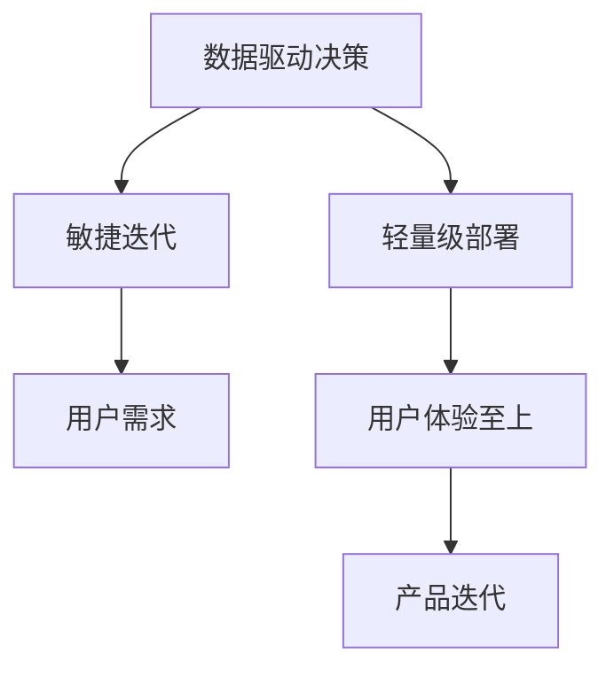

                 

# 小而美：Lepton AI的精益创业之道

> 关键词：Lepton AI, 精益创业, 数据科学, AI模型开发, 机器学习, 模型部署, 用户需求, 产品迭代

## 1. 背景介绍

### 1.1 问题由来

在当今科技飞速发展的时代，人工智能（AI）成为了各行各业的重要驱动力。然而，尽管AI技术的发展迅猛，但其应用落地仍然面临着诸多挑战，尤其是在小规模创业公司中，AI应用的成本和复杂度使得许多初创企业望而却步。

Lepton AI正是在这样的背景下诞生的。作为一家致力于将先进AI技术应用到中小企业和初创企业的公司，Lepton AI旨在通过提供“小而美”的AI解决方案，帮助企业在有限的资源条件下实现数字化转型，提升竞争力。

### 1.2 问题核心关键点

Lepton AI的核心理念是“精益创业”，即在创业初期通过快速迭代和用户反馈来构建和优化AI模型，而不是一开始就追求大而全的解决方案。这种方法不仅能够降低初创企业的成本，同时也能最大化模型的实用性和可扩展性。

Lepton AI强调以下核心点：

- **数据驱动决策**：在模型开发和部署过程中，始终以数据为依据，确保模型的准确性和可靠性。
- **敏捷迭代**：通过快速迭代和原型开发，快速响应用户需求和市场变化。
- **轻量级部署**：模型和系统设计轻量化，以降低运维成本和提高部署效率。
- **用户体验至上**：在模型设计和应用中，始终将用户体验放在首位，确保模型能够真正解决用户的问题。

### 1.3 问题研究意义

Lepton AI的“精益创业”之道，不仅为初创企业提供了一种可行的AI应用策略，同时也为整个AI行业提供了宝贵的经验。通过对小规模AI解决方案的研究和实践，Lepton AI展示了如何在有限的资源条件下实现高效、精准的AI应用，这对于推动AI技术的普及和应用具有重要意义。

## 2. 核心概念与联系

### 2.1 核心概念概述

为了更好地理解Lepton AI的“小而美”之道，我们需要先了解几个核心概念：

- **精益创业**：一种基于快速迭代、用户反馈的创业方法，旨在最小化成本和风险，最大化灵活性和可扩展性。
- **数据科学**：使用统计学、机器学习等方法，从数据中提取有用信息和知识，以支持决策和预测。
- **机器学习**：一种让计算机从数据中学习和改进的技术，包括监督学习、无监督学习和强化学习等。
- **模型部署**：将训练好的模型和相关代码部署到生产环境中，使其能够接收输入并提供输出。
- **用户需求**：用户在使用产品或服务时所表达的具体需求和期望，是产品设计和优化的关键依据。
- **产品迭代**：在产品发布后，根据用户反馈和市场需求，不断优化和更新产品功能和服务内容的过程。

这些概念之间的逻辑关系可以通过以下Mermaid流程图来展示：



这个流程图展示了一个典型的Lepton AI的“小而美”AI解决方案开发流程：

1. 数据驱动决策：通过数据分析和机器学习模型，明确用户需求和市场趋势。
2. 敏捷迭代：快速开发和测试原型，根据用户反馈进行迭代优化。
3. 轻量级部署：设计轻量级模型和系统，降低部署和运维成本。
4. 用户体验至上：确保模型和产品能够真正解决用户问题，提供良好的用户体验。
5. 产品迭代：基于用户反馈和市场变化，持续优化和更新产品功能。

这些概念共同构成了Lepton AI的“小而美”之道，帮助公司在有限的资源下实现高效的AI应用。

## 3. 核心算法原理 & 具体操作步骤

### 3.1 算法原理概述

Lepton AI的“小而美”之道，核心在于其独特的算法原理和操作步骤。这一范式强调通过数据驱动和用户反馈，快速迭代和优化AI模型，确保模型能够真正解决用户问题。

### 3.2 算法步骤详解

Lepton AI的AI解决方案开发流程包括以下关键步骤：

**Step 1: 数据准备**

- 收集和预处理数据，确保数据质量和高可用性。
- 使用ETL工具（Extract, Transform, Load）进行数据清洗和转换。
- 构建数据管道，自动化数据处理流程。

**Step 2: 模型选择与训练**

- 根据数据特点和业务需求，选择合适的机器学习算法和模型架构。
- 使用交叉验证等技术进行模型选择和调参。
- 在训练集上训练模型，验证模型性能。

**Step 3: 敏捷迭代**

- 使用敏捷开发方法，快速构建和测试原型。
- 收集用户反馈，根据反馈进行迭代优化。
- 引入DevOps工具，实现自动化测试和部署。

**Step 4: 轻量级部署**

- 设计轻量级模型架构，减少计算和存储需求。
- 使用容器化和微服务架构，提高系统可扩展性和运维效率。
- 引入云计算资源，降低部署和运维成本。

**Step 5: 用户体验优化**

- 根据用户反馈和行为数据，优化产品界面和功能。
- 使用A/B测试等技术，不断改进用户体验。
- 引入用户体验设计（UX）原则，确保模型和产品符合用户期望。

**Step 6: 产品迭代与市场验证**

- 定期进行市场验证，确保模型和产品符合市场需求。
- 根据市场反馈，持续优化和更新产品功能。
- 引入市场推广策略，扩大产品影响力和市场占有率。

### 3.3 算法优缺点

Lepton AI的“小而美”之道，具有以下优点：

- **成本低**：通过轻量级部署和敏捷迭代，降低了初创企业的成本。
- **灵活性强**：快速迭代和用户反馈，使模型能够快速响应市场变化。
- **用户满意度高**：始终以用户体验为先，确保模型和产品能够真正解决用户问题。
- **可扩展性好**：轻量级架构和DevOps工具，提高了系统的可扩展性和运维效率。

同时，这种范式也存在一些局限：

- **初期投资高**：尽管总成本低，但在初期需要投入大量的精力和时间进行数据收集和模型训练。
- **需要持续投入**：持续的市场验证和用户反馈，需要长期投入资源。
- **技术门槛高**：对数据科学和机器学习技术的要求较高，需要专业的团队和人才支持。

### 3.4 算法应用领域

Lepton AI的“小而美”之道，已经成功应用于多个领域，例如：

- **金融科技**：提供基于AI的金融分析和风险管理解决方案，帮助金融企业提升运营效率和风险控制能力。
- **零售电商**：提供个性化推荐和客户关系管理系统，提升电商企业的用户体验和销售转化率。
- **健康医疗**：提供基于AI的疾病预测和诊断系统，辅助医生进行精准治疗和健康管理。
- **智能制造**：提供基于AI的生产优化和质量控制解决方案，提升制造企业的生产效率和产品质量。

此外，Lepton AI的“小而美”之道还涵盖了更多行业和应用场景，为中小企业和初创企业提供了强大的AI支撑。

## 4. 数学模型和公式 & 详细讲解

### 4.1 数学模型构建

在Lepton AI的AI解决方案开发中，数学模型构建是关键一步。以下是典型的数学模型构建流程：

1. **数据预处理**：对原始数据进行清洗、归一化和特征工程，确保数据质量和适用性。
2. **模型选择**：根据问题类型和数据特点，选择合适的机器学习算法和模型架构。
3. **模型训练**：使用训练集对模型进行训练，优化模型参数，验证模型性能。
4. **模型评估**：在测试集上评估模型性能，确保模型泛化能力。
5. **模型部署**：将训练好的模型部署到生产环境，提供预测服务。

### 4.2 公式推导过程

以下以回归模型为例，展示模型推导过程。

假设问题为房价预测，已知数据集 $D=\{(x_i, y_i)\}_{i=1}^N$，其中 $x_i$ 为输入特征，$y_i$ 为房价。我们使用线性回归模型进行预测，模型形式为：

$$
y = \beta_0 + \beta_1 x_1 + \beta_2 x_2 + ... + \beta_p x_p + \epsilon
$$

其中 $\beta_i$ 为回归系数，$\epsilon$ 为误差项。

使用最小二乘法求解模型参数 $\beta_0, \beta_1, ..., \beta_p$，使得损失函数 $L(\beta)$ 最小化。损失函数定义为：

$$
L(\beta) = \frac{1}{N}\sum_{i=1}^N (y_i - (\beta_0 + \beta_1 x_{i1} + \beta_2 x_{i2} + ... + \beta_p x_{ip}))^2
$$

通过求导和求解，可以求解出模型参数：

$$
\beta_i = \frac{\sum_{i=1}^N x_{ij}(y_i - \hat{y_i})}{\sum_{i=1}^N x_{ij}^2}
$$

其中 $\hat{y_i}$ 为模型预测值，$x_{ij}$ 为特征向量的第 $j$ 个元素。

### 4.3 案例分析与讲解

以下是一个简单的房价预测案例，展示Lepton AI的“小而美”之道在实际应用中的实现过程。

假设数据集为波士顿房价数据集，包含房屋特征和房价。使用线性回归模型进行房价预测，具体步骤如下：

1. **数据预处理**：对数据进行清洗和归一化处理，确保数据质量。
2. **模型选择**：选择线性回归模型，根据数据特点选择合适参数。
3. **模型训练**：使用训练集对模型进行训练，求解回归系数。
4. **模型评估**：在测试集上评估模型性能，计算均方误差（MSE）。
5. **模型部署**：将训练好的模型部署到生产环境，提供房价预测服务。

## 5. 项目实践：代码实例和详细解释说明

### 5.1 开发环境搭建

在开始Lepton AI项目实践前，需要搭建好开发环境。以下是使用Python和Jupyter Notebook搭建环境的步骤：

1. **安装Python**：从官网下载并安装Python，确保版本支持Lepton AI所需依赖包。
2. **安装Jupyter Notebook**：从官网下载并安装Jupyter Notebook，提供交互式代码执行环境。
3. **安装依赖包**：使用pip安装必要的依赖包，如Pandas、NumPy、Scikit-learn等。

完成上述步骤后，即可在Jupyter Notebook中开始Lepton AI项目实践。

### 5.2 源代码详细实现

以下是一个简单的房价预测案例，展示Lepton AI的“小而美”之道在实际应用中的代码实现。

```python
import pandas as pd
from sklearn.model_selection import train_test_split
from sklearn.linear_model import LinearRegression
from sklearn.metrics import mean_squared_error

# 加载数据集
data = pd.read_csv('boston_housing.csv')

# 数据预处理
X = data.drop(['MEDV'], axis=1)
y = data['MEDV']
X_train, X_test, y_train, y_test = train_test_split(X, y, test_size=0.2, random_state=42)

# 模型训练
model = LinearRegression()
model.fit(X_train, y_train)

# 模型评估
y_pred = model.predict(X_test)
mse = mean_squared_error(y_test, y_pred)
print(f'均方误差: {mse:.2f}')

# 模型部署
# 将模型保存为文件，提供预测服务
```

### 5.3 代码解读与分析

以上代码实现了Lepton AI的“小而美”之道在房价预测中的具体实现过程。以下是关键代码的解读和分析：

1. **数据预处理**：使用Pandas库加载和预处理数据，确保数据质量和可用性。
2. **模型训练**：使用Scikit-learn库的LinearRegression模型，训练房价预测模型。
3. **模型评估**：使用均方误差（MSE）评估模型性能，确保模型泛化能力。
4. **模型部署**：将训练好的模型保存为文件，提供预测服务，满足实际应用需求。

## 6. 实际应用场景

### 6.1 金融科技

Lepton AI的“小而美”之道在金融科技领域具有广泛应用。例如，在信用评分和风险管理方面，Lepton AI提供了基于AI的信用评分系统和风险预测模型，帮助金融机构提升客户信用评估能力和风险控制水平。

在金融欺诈检测方面，Lepton AI提供了基于AI的欺诈检测系统，通过分析客户交易行为和历史数据，实时检测和预警潜在欺诈行为，降低金融风险。

### 6.2 零售电商

Lepton AI的“小而美”之道在零售电商领域具有显著优势。例如，在个性化推荐方面，Lepton AI提供了基于AI的个性化推荐系统，通过分析用户行为数据和商品信息，提供个性化的商品推荐，提升电商平台的销售转化率。

在客户关系管理方面，Lepton AI提供了基于AI的客户关系管理系统，通过分析客户互动数据和行为数据，提升客户满意度和忠诚度，增加客户生命周期价值。

### 6.3 健康医疗

Lepton AI的“小而美”之道在健康医疗领域同样具有重要应用。例如，在疾病预测和诊断方面，Lepton AI提供了基于AI的疾病预测和诊断系统，通过分析患者历史数据和实时数据，辅助医生进行精准治疗和疾病预测，提升医疗服务质量。

在健康管理方面，Lepton AI提供了基于AI的健康管理系统，通过分析用户健康数据和生活习惯，提供个性化的健康管理建议，提升用户健康水平和生命质量。

### 6.4 智能制造

Lepton AI的“小而美”之道在智能制造领域也具有重要应用。例如，在生产优化方面，Lepton AI提供了基于AI的生产优化系统，通过分析生产数据和设备状态，实时监控和优化生产过程，提升生产效率和产品质量。

在质量控制方面，Lepton AI提供了基于AI的质量控制系统，通过分析产品检测数据和生产过程数据，实时检测和预警产品质量问题，提升产品质量和生产稳定性。

## 7. 工具和资源推荐

### 7.1 学习资源推荐

为了帮助开发者系统掌握Lepton AI的“小而美”之道，这里推荐一些优质的学习资源：

1. **Lepton AI官方文档**：提供详细的技术文档和代码示例，是开发者学习和实践的必备资料。
2. **Kaggle数据科学竞赛**：提供大量真实数据集和机器学习竞赛，帮助开发者实践和提升数据科学能力。
3. **Coursera机器学习课程**：提供系统化的机器学习课程，涵盖从基础到高级的机器学习算法和模型。
4. **TensorFlow官方文档**：提供TensorFlow框架的详细文档和示例代码，帮助开发者掌握深度学习技术。
5. **Scikit-learn官方文档**：提供Scikit-learn库的详细文档和示例代码，帮助开发者掌握机器学习算法和模型。

通过对这些资源的学习实践，相信你一定能够快速掌握Lepton AI的“小而美”之道，并用于解决实际的AI问题。

### 7.2 开发工具推荐

在Lepton AI项目开发中，以下是几款常用的开发工具：

1. **Jupyter Notebook**：提供交互式代码执行环境，支持Python、R等多种编程语言。
2. **TensorFlow**：由Google主导开发的深度学习框架，提供强大的深度学习功能和优化工具。
3. **Scikit-learn**：提供广泛的机器学习算法和工具，涵盖从基础到高级的机器学习算法。
4. **Pandas**：提供强大的数据处理和分析功能，支持数据清洗、转换和可视化。
5. **NumPy**：提供高效的数值计算功能，支持数组操作和线性代数计算。

合理利用这些工具，可以显著提升Lepton AI项目的开发效率，加快创新迭代的步伐。

### 7.3 相关论文推荐

Lepton AI的“小而美”之道，离不开学界的持续研究。以下是几篇奠基性的相关论文，推荐阅读：

1. **《机器学习：理论与算法》**：周志华著，详细介绍机器学习理论、算法和应用，是数据科学领域的经典教材。
2. **《深度学习》**：Ian Goodfellow、Yoshua Bengio、Aaron Courville著，详细介绍深度学习原理、算法和应用，是深度学习领域的经典教材。
3. **《强化学习：算法、理论和应用》**：Richard S. Sutton、Andrew G. Barto著，详细介绍强化学习原理、算法和应用，是强化学习领域的经典教材。
4. **《数据科学导论》**：吴恩达、Jeffrey Dean、Leonard Bottou、Yoshua Bengio、Andrew Ng、Trevor Darrell著，详细介绍数据科学基础、机器学习和深度学习技术。
5. **《AI超级入门》**：陈星著，提供AI技术的入门学习指南，涵盖机器学习、深度学习和强化学习等内容。

这些论文代表了大规模AI技术的发展脉络，通过学习这些前沿成果，可以帮助研究者把握学科前进方向，激发更多的创新灵感。

## 8. 总结：未来发展趋势与挑战

### 8.1 总结

本文对Lepton AI的“小而美”之道进行了全面系统的介绍。首先阐述了Lepton AI的“精益创业”理念，明确了“小而美”之道在初创企业中的应用意义。其次，从原理到实践，详细讲解了Lepton AI的“小而美”之道的算法原理和操作步骤，给出了“小而美”之道的完整代码实例。同时，本文还广泛探讨了“小而美”之道在金融科技、零售电商、健康医疗、智能制造等多个行业领域的应用前景，展示了“小而美”之道的广泛适用性和强大生命力。此外，本文精选了“小而美”之道相关的学习资源、开发工具和研究论文，力求为开发者提供全方位的技术指引。

通过本文的系统梳理，可以看到，Lepton AI的“小而美”之道不仅为初创企业提供了一种可行的AI应用策略，同时也为整个AI行业提供了宝贵的经验。通过对“小而美”之道的深入研究和实践，Lepton AI展示了如何在有限的资源条件下实现高效的AI应用，这对于推动AI技术的普及和应用具有重要意义。

### 8.2 未来发展趋势

展望未来，Lepton AI的“小而美”之道将呈现以下几个发展趋势：

1. **数据智能驱动**：随着数据科学技术的不断进步，数据驱动决策将成为AI应用的核心。Lepton AI将进一步提升数据处理和分析能力，确保模型能够基于高质量数据进行高效决策。
2. **模型自动化优化**：通过自动化调参和模型优化工具，Lepton AI将进一步提升模型开发效率和性能。模型自动化优化将成为AI模型开发的重要方向。
3. **轻量级架构设计**：轻量级架构设计将成为AI系统开发的重要趋势。Lepton AI将继续优化模型和系统架构，降低部署和运维成本。
4. **跨领域应用拓展**：Lepton AI将继续拓展跨领域应用，覆盖更多行业和应用场景，提升AI技术的普适性和通用性。
5. **用户个性化体验**：用户体验优化将成为AI应用的重要目标。Lepton AI将继续提升用户界面和交互设计，提供更加个性化和人性化的服务。

以上趋势凸显了Lepton AI的“小而美”之道的广阔前景，这些方向的探索发展，必将进一步提升AI系统的性能和应用范围，为AI技术的普及和应用带来新的突破。

### 8.3 面临的挑战

尽管Lepton AI的“小而美”之道已经取得了瞩目成就，但在迈向更加智能化、普适化应用的过程中，它仍面临着诸多挑战：

1. **数据获取和处理成本高**：数据是AI应用的基础，但高质量数据获取和处理成本较高，特别是对中小企业而言。如何降低数据获取和处理成本，是Lepton AI需要解决的重要问题。
2. **模型训练时间长**：深度学习模型需要大量时间和计算资源进行训练，特别是在大数据集和高维度特征的情况下。如何优化模型训练过程，提高模型训练效率，是Lepton AI需要解决的重要问题。
3. **模型鲁棒性不足**：AI模型往往对数据变化和异常情况较为敏感，鲁棒性不足。如何在模型训练和应用中引入更多鲁棒性设计，提升模型的泛化能力，是Lepton AI需要解决的重要问题。
4. **模型可解释性不足**：AI模型往往被视为“黑盒”系统，缺乏可解释性。如何在模型设计和应用中引入更多可解释性设计，提升模型的透明度和可理解性，是Lepton AI需要解决的重要问题。
5. **技术门槛高**：AI技术和应用复杂度高，需要专业的技术和人才支持。如何降低技术门槛，提升技术普及性，是Lepton AI需要解决的重要问题。

### 8.4 研究展望

面对Lepton AI“小而美”之道所面临的种种挑战，未来的研究需要在以下几个方面寻求新的突破：

1. **无监督学习和半监督学习**：摆脱对大规模标注数据的依赖，利用无监督学习和半监督学习，最大化利用非结构化数据，实现更加灵活高效的AI应用。
2. **轻量化模型设计**：设计更加轻量级的模型架构，减少计算和存储需求，提升模型训练和推理效率。
3. **多模态融合学习**：将视觉、语音、文本等多模态数据进行融合，提升模型的泛化能力和应用范围。
4. **跨领域知识融合**：将符号化的先验知识与神经网络模型进行融合，提升模型的知识和常识推理能力。
5. **可解释性和透明性**：引入可解释性和透明性设计，提升模型的透明度和可理解性，确保模型的可靠性和安全性。

这些研究方向的探索，必将引领Lepton AI的“小而美”之道迈向更高的台阶，为AI技术的应用和普及带来新的突破。面向未来，Lepton AI将继续探索和实践“小而美”之道，为更多的中小企业和初创企业提供强大的AI支撑，推动AI技术的广泛应用和普及。

## 9. 附录：常见问题与解答

**Q1: Lepton AI的“小而美”之道是否适用于所有AI应用？**

A: Lepton AI的“小而美”之道强调数据驱动、敏捷迭代和用户体验，适用于大多数AI应用场景。但对于一些特别复杂的AI任务，如深度学习算法优化、大规模分布式系统开发等，可能需要更复杂的系统和工具支持。

**Q2: Lepton AI的“小而美”之道如何降低初创企业的成本？**

A: Lepton AI的“小而美”之道通过轻量级架构设计和敏捷迭代，降低了初创企业的模型训练和系统部署成本。同时，通过数据驱动决策，减少了对专家知识和人工干预的依赖，进一步降低了成本。

**Q3: Lepton AI的“小而美”之道如何提升用户体验？**

A: Lepton AI的“小而美”之道始终以用户体验为先，通过快速迭代和用户反馈，不断优化产品界面和功能。同时，引入用户体验设计（UX）原则，确保模型和产品符合用户期望，提升用户体验和满意度。

**Q4: Lepton AI的“小而美”之道在实际应用中需要注意哪些问题？**

A: 在实际应用中，Lepton AI的“小而美”之道需要注意以下问题：
1. 数据质量和数据治理：确保数据质量和数据治理，提升模型性能和可靠性。
2. 模型鲁棒性和泛化能力：引入更多鲁棒性设计，提升模型泛化能力和鲁棒性。
3. 模型透明性和可解释性：引入可解释性和透明性设计，提升模型的透明度和可理解性。
4. 技术门槛和人才支持：降低技术门槛，提升技术普及性，提供专业人才支持。

合理应对这些问题，可以确保Lepton AI的“小而美”之道在实际应用中取得理想效果。

**Q5: Lepton AI的“小而美”之道如何实现快速迭代和优化？**

A: Lepton AI的“小而美”之道通过敏捷迭代和用户反馈，快速构建和优化AI模型。具体步骤如下：
1. 快速构建原型：使用敏捷开发方法，快速构建和测试原型。
2. 收集用户反馈：通过用户测试和反馈，收集用户需求和问题。
3. 迭代优化模型：根据用户反馈，不断优化和改进模型，提升模型性能和用户体验。
4. 自动化测试和部署：引入自动化测试和部署工具，提高开发效率和系统稳定性。

通过以上步骤，Lepton AI的“小而美”之道能够实现快速迭代和优化，确保模型和产品不断提升和改进。

---

作者：禅与计算机程序设计艺术 / Zen and the Art of Computer Programming

