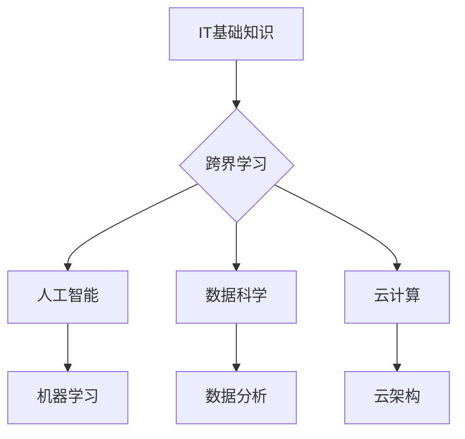

> 跨界学习，职业发展，人工智能，机器学习，深度学习，数据科学，软件工程，编程

## 1. 背景介绍

在当今科技飞速发展的时代，职业发展不再局限于单一领域。跨界学习，即学习与自身专业领域相异的知识和技能，已成为提升职业竞争力和拓宽发展空间的重要趋势。对于IT从业者而言，跨界学习尤为重要，因为它能够帮助他们掌握更广泛的技术，适应不断变化的市场需求，并开拓新的职业发展路径。

传统的IT职业发展模式往往是沿着一条垂直线发展，例如从程序员到架构师，再到CTO。然而，随着科技的进步和行业的发展，这种模式逐渐变得僵化。人工智能、机器学习、深度学习等新兴技术不断涌现，对IT人才提出了新的挑战和机遇。

跨界学习能够帮助IT从业者掌握这些新兴技术的知识和技能，从而适应新的工作环境，提升自身价值。例如，一名程序员可以通过学习机器学习，成为一名数据科学家；一名数据库管理员可以通过学习云计算，成为一名云架构师。

## 2. 核心概念与联系

跨界学习的核心概念是打破学科和领域的界限，将不同领域的知识和技能进行整合和应用。

**跨界学习的联系：**



**跨界学习的优势：**

* **拓宽职业发展空间：** 掌握更多技能，可以拓展职业选择范围，获得更多发展机会。
* **提升竞争力：** 在竞争激烈的IT行业，跨界学习能够帮助人才脱颖而出，提升自身竞争力。
* **促进创新：** 将不同领域的知识和技能进行整合，可以激发新的创意和想法，促进创新发展。

## 3. 核心算法原理 & 具体操作步骤

### 3.1  算法原理概述

**机器学习算法**是跨界学习的重要组成部分。机器学习算法能够从数据中学习，并根据学习到的知识进行预测或决策。常见的机器学习算法包括：

* **监督学习：** 利用标记数据训练模型，例如分类和回归。
* **无监督学习：** 从未标记数据中发现模式，例如聚类和降维。
* **强化学习：** 通过试错学习，实现目标最大化。

### 3.2  算法步骤详解

**以监督学习为例，其基本步骤如下：**

1. **数据收集和预处理：** 收集相关数据，并进行清洗、转换和特征工程等预处理工作。
2. **模型选择：** 根据具体任务选择合适的机器学习模型，例如线性回归、逻辑回归、决策树等。
3. **模型训练：** 利用标记数据训练模型，调整模型参数，使其能够准确预测或决策。
4. **模型评估：** 利用测试数据评估模型的性能，例如准确率、召回率、F1-score等。
5. **模型部署：** 将训练好的模型部署到实际应用场景中，用于预测或决策。

### 3.3  算法优缺点

**机器学习算法的优点：**

* **自动化学习：** 可以自动从数据中学习，无需人工编程。
* **适应性强：** 可以适应不断变化的数据分布。
* **预测能力强：** 可以对未来进行预测，辅助决策。

**机器学习算法的缺点：**

* **数据依赖：** 需要大量高质量的数据进行训练。
* **解释性差：** 模型的决策过程难以解释。
* **过拟合风险：** 如果训练数据不足或过于复杂，模型可能会过拟合，导致泛化能力差。

### 3.4  算法应用领域

机器学习算法广泛应用于各个领域，例如：

* **图像识别：** 人脸识别、物体检测、图像分类等。
* **自然语言处理：** 文本分类、情感分析、机器翻译等。
* **推荐系统：** 商品推荐、内容推荐、用户画像等。
* **金融领域：** 风险评估、欺诈检测、投资预测等。

## 4. 数学模型和公式 & 详细讲解 & 举例说明

### 4.1  数学模型构建

**线性回归模型**是机器学习中一个基础的监督学习算法。其数学模型如下：

$$
y = \theta_0 + \theta_1 x_1 + \theta_2 x_2 + ... + \theta_n x_n + \epsilon
$$

其中：

* $y$ 是预测值
* $\theta_0, \theta_1, ..., \theta_n$ 是模型参数
* $x_1, x_2, ..., x_n$ 是输入特征
* $\epsilon$ 是误差项

### 4.2  公式推导过程

线性回归模型的目标是找到最优的模型参数，使得预测值与真实值之间的误差最小。常用的误差函数是均方误差（MSE）：

$$
MSE = \frac{1}{n} \sum_{i=1}^{n} (y_i - \hat{y}_i)^2
$$

其中：

* $n$ 是样本数量
* $y_i$ 是真实值
* $\hat{y}_i$ 是预测值

通过最小化MSE，可以得到最优的模型参数。

### 4.3  案例分析与讲解

**例如，预测房价：**

假设我们想要预测房屋的价格，输入特征包括房屋面积、房间数量、地理位置等。我们可以使用线性回归模型，将这些特征与房价进行关联，并找到最优的模型参数。

通过训练模型，我们可以得到一个预测房价的公式，例如：

$$
房价 = 10000 + 500 * 面积 + 10000 * 房间数量 + 2000 * 地理位置
$$

我们可以将这个公式用于预测新房子的价格。

## 5. 项目实践：代码实例和详细解释说明

### 5.1  开发环境搭建

* **操作系统：** Ubuntu 20.04 LTS
* **编程语言：** Python 3.8
* **机器学习库：** scikit-learn

### 5.2  源代码详细实现

```python
from sklearn.linear_model import LinearRegression
from sklearn.model_selection import train_test_split
from sklearn.metrics import mean_squared_error

# 数据加载
# ...

# 数据预处理
# ...

# 数据分割
X_train, X_test, y_train, y_test = train_test_split(X, y, test_size=0.2, random_state=42)

# 模型训练
model = LinearRegression()
model.fit(X_train, y_train)

# 模型预测
y_pred = model.predict(X_test)

# 模型评估
mse = mean_squared_error(y_test, y_pred)
print(f"Mean Squared Error: {mse}")
```

### 5.3  代码解读与分析

* **数据加载和预处理：** 需要根据实际数据进行相应的加载和预处理工作，例如数据清洗、特征工程等。
* **数据分割：** 将数据分为训练集和测试集，用于模型训练和评估。
* **模型训练：** 使用训练集训练线性回归模型。
* **模型预测：** 使用训练好的模型对测试集进行预测。
* **模型评估：** 使用均方误差（MSE）等指标评估模型的性能。

### 5.4  运行结果展示

运行代码后，会输出模型的均方误差值，可以用来评估模型的预测精度。

## 6. 实际应用场景

### 6.1  金融领域

* **信用评分：** 利用机器学习算法分析客户的财务数据，评估其信用风险。
* **欺诈检测：** 识别异常交易行为，防止金融欺诈。
* **投资预测：** 利用历史数据预测股票价格、汇率等金融指标。

### 6.2  医疗领域

* **疾病诊断：** 利用机器学习算法分析患者的症状、检查结果等数据，辅助医生诊断疾病。
* **药物研发：** 利用机器学习算法加速药物研发过程，预测药物的疗效和安全性。
* **个性化医疗：** 根据患者的基因信息、生活习惯等数据，提供个性化的医疗方案。

### 6.3  电商领域

* **商品推荐：** 根据用户的购买历史、浏览记录等数据，推荐相关的商品。
* **价格预测：** 利用历史数据预测商品价格的波动趋势。
* **客户画像：** 分析用户的行为数据，构建用户画像，进行精准营销。

### 6.4  未来应用展望

随着人工智能技术的不断发展，跨界学习将发挥越来越重要的作用。未来，跨界学习将应用于更多领域，例如自动驾驶、机器人、虚拟现实等，为人类社会带来更多福祉。

## 7. 工具和资源推荐

### 7.1  学习资源推荐

* **在线课程：** Coursera、edX、Udacity 等平台提供丰富的机器学习和深度学习课程。
* **书籍：** 《深入理解机器学习》、《Python机器学习实战》等书籍对机器学习有深入的讲解。
* **开源项目：** TensorFlow、PyTorch 等开源项目提供了丰富的机器学习工具和资源。

### 7.2  开发工具推荐

* **Python：** 作为机器学习领域最常用的编程语言，Python拥有丰富的库和工具，例如NumPy、Pandas、Scikit-learn等。
* **Jupyter Notebook：** 用于编写和运行Python代码的交互式笔记本环境，方便进行机器学习实验和探索。
* **云计算平台：** AWS、Azure、GCP 等云计算平台提供了强大的计算资源和机器学习服务。

### 7.3  相关论文推荐

* **《机器学习》** by Tom Mitchell
* **《深度学习》** by Ian Goodfellow, Yoshua Bengio, and Aaron Courville

## 8. 总结：未来发展趋势与挑战

### 8.1  研究成果总结

跨界学习在IT领域取得了显著的成果，例如在人工智能、数据科学、云计算等领域取得了突破性进展。

### 8.2  未来发展趋势

* **跨界学习的深度化：** 将不同领域的知识和技能进行更深入的整合和应用。
* **跨界学习的自动化：** 利用人工智能技术自动进行跨界学习，降低学习门槛。
* **跨界学习的个性化：** 根据个人的学习目标和需求，定制个性化的跨界学习路径。

### 8.3  面临的挑战

* **知识体系的整合：** 如何将不同领域的知识体系进行有效整合，形成一个完整的跨界学习体系。
* **跨界学习方法的创新：** 需要开发新的跨界学习方法，以适应不断变化的科技发展趋势。
* **跨界人才的培养：** 需要培养具备跨界学习能力的IT人才，以满足未来市场需求。

### 8.4  研究展望

未来，跨界学习将继续成为IT领域的重要研究方向，并为人类社会带来更多创新和发展。


## 9. 附录：常见问题与解答

**Q1：跨界学习需要具备哪些基础知识？**

**A1：** 跨界学习需要具备一定的IT基础知识，例如编程、数据结构、算法等。

**Q2：跨界学习需要花费多少时间？**

**A2：** 跨界学习的时间取决于学习目标和学习方法。一般来说，需要投入一定的学习时间和精力。

**Q3：跨界学习有哪些学习资源？**

**A3：** 跨界学习资源丰富，包括在线课程、书籍、开源项目等。

**作者：禅与计算机程序设计艺术 / Zen and the Art of Computer Programming**<end_of_turn>