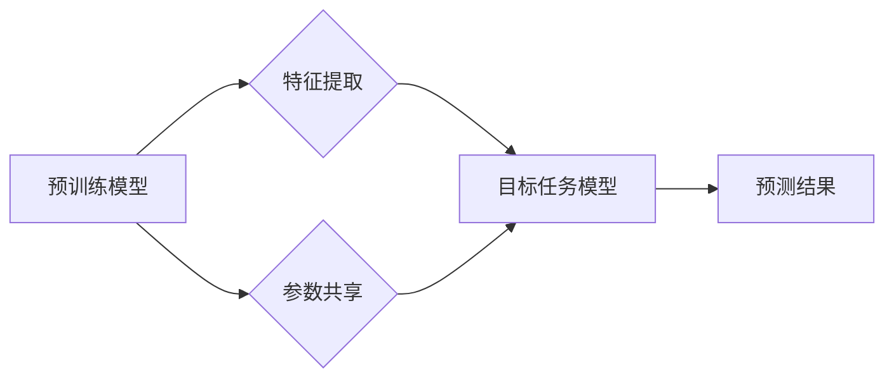

> 迁移学习、大模型、深度学习、知识迁移、参数共享、预训练模型、微调

## 1. 背景介绍

近年来，深度学习在计算机视觉、自然语言处理等领域取得了显著成就，这得益于海量数据和强大的计算能力的支撑。然而，在许多实际应用场景中，获取大量特定领域的标注数据仍然是一个挑战。迁移学习 (Transfer Learning) 应运而生，它旨在利用预先训练好的模型在源域上的知识，迁移到目标域，从而在目标域上取得更好的性能，即使目标域的数据量较少。

大模型 (Large Model) 指的是参数量巨大、训练数据规模庞大的深度学习模型。大模型通常在通用任务上进行预训练，例如语言建模、图像识别等，并能够学习到丰富的底层特征和知识。迁移学习与大模型的结合，使得模型能够更有效地利用现有知识，降低对特定领域数据依赖，从而加速模型的开发和部署。

## 2. 核心概念与联系

**2.1 迁移学习的原理**

迁移学习的核心思想是，将预先训练好的模型在源域上的知识迁移到目标域。源域和目标域可以是不同的数据集，也可以是不同的任务。

**2.2 大模型与迁移学习的结合**

大模型的预训练过程可以看作是一种迁移学习的过程，它在海量通用数据上学习到丰富的底层知识。这些知识可以被迁移到特定领域的任务中，从而提高模型的性能。

**2.3 迁移学习的类型**

根据知识迁移的方式，迁移学习可以分为以下几种类型：

* **特征提取:** 使用预训练模型提取特征，然后将这些特征输入到目标任务的模型中进行训练。
* **参数共享:** 将预训练模型的一部分参数共享到目标任务的模型中，并对共享的参数进行微调。
* **领域自适应:** 使用预训练模型进行领域自适应，将模型适应到目标领域的分布。

**2.4 迁移学习的优势**

* **降低数据依赖:** 迁移学习可以有效利用现有知识，减少对特定领域数据依赖。
* **提高模型性能:** 迁移学习可以提高模型在目标域上的性能，尤其是在数据量较少的情况下。
* **加速模型开发:** 迁移学习可以加速模型的开发和部署，减少训练时间和成本。

**2.5 迁移学习的挑战**

* **域差距:** 源域和目标域之间可能存在一定的差距，导致知识迁移效果不佳。
* **模型复杂度:** 大模型的复杂度较高，迁移学习过程可能需要大量的计算资源。
* **评估指标:** 迁移学习的评估指标需要根据具体任务进行设计。

**2.6 Mermaid 流程图**



## 3. 核心算法原理 & 具体操作步骤

### 3.1  算法原理概述

迁移学习的核心算法原理是利用预训练模型的知识，通过调整模型参数，使其能够适应目标任务。常见的迁移学习算法包括：

* **特征提取:** 将预训练模型的特征提取层作为目标任务模型的特征提取器，并对目标任务模型的分类层进行训练。
* **参数共享:** 将预训练模型的一部分参数共享到目标任务模型中，并对共享的参数进行微调。
* **领域自适应:** 使用预训练模型进行领域自适应，将模型适应到目标领域的分布。

### 3.2  算法步骤详解

**3.2.1 特征提取**

1. 选择一个预训练好的模型，例如 ResNet、VGG 等。
2. 将预训练模型的特征提取层作为目标任务模型的特征提取器。
3. 对目标任务模型的分类层进行训练。

**3.2.2 参数共享**

1. 选择一个预训练好的模型，例如 BERT、GPT 等。
2. 将预训练模型的一部分参数共享到目标任务模型中。
3. 对共享的参数进行微调。

**3.2.3 领域自适应**

1. 选择一个预训练好的模型，例如 ImageNet 上预训练的 CNN 模型。
2. 使用目标域的数据进行领域自适应训练，例如使用对抗训练、领域不变性特征学习等方法。
3. 将领域自适应后的模型应用于目标任务。

### 3.3  算法优缺点

**3.3.1 特征提取**

* **优点:** 简单易行，计算量较小。
* **缺点:** 无法充分利用预训练模型的知识，性能可能较低。

**3.3.2 参数共享**

* **优点:** 可以充分利用预训练模型的知识，性能较高。
* **缺点:** 计算量较大，需要更多的计算资源。

**3.3.3 领域自适应**

* **优点:** 可以有效解决域差距问题，性能较高。
* **缺点:** 算法复杂，需要更多的训练数据和计算资源。

### 3.4  算法应用领域

迁移学习在大模型领域有着广泛的应用，例如：

* **自然语言处理:** 使用预训练语言模型进行文本分类、情感分析、机器翻译等任务。
* **计算机视觉:** 使用预训练图像识别模型进行目标检测、图像分割、图像分类等任务。
* **语音识别:** 使用预训练语音识别模型进行语音识别、语音合成等任务。

## 4. 数学模型和公式 & 详细讲解 & 举例说明

### 4.1  数学模型构建

迁移学习的数学模型可以概括为以下公式：

$$
L(\theta) = L_{source}(\theta) + \lambda L_{target}(\theta)
$$

其中：

* $L(\theta)$ 是目标模型的损失函数。
* $L_{source}(\theta)$ 是源域的损失函数。
* $L_{target}(\theta)$ 是目标域的损失函数。
* $\lambda$ 是权重参数，用于平衡源域和目标域的损失。

### 4.2  公式推导过程

目标是找到一个模型参数 $\theta$，使得模型在源域和目标域上都表现良好。

源域的损失函数 $L_{source}(\theta)$ 用于衡量模型在源域上的性能。

目标域的损失函数 $L_{target}(\theta)$ 用于衡量模型在目标域上的性能。

为了平衡源域和目标域的损失，我们使用一个权重参数 $\lambda$ 来调整损失函数的权重。

### 4.3  案例分析与讲解

**案例:** 使用预训练的 BERT 模型进行文本分类任务。

**分析:**

1. 使用预训练的 BERT 模型提取文本特征。
2. 将提取的特征输入到一个分类层中，并对分类层进行微调。
3. 使用目标域的文本数据进行微调训练。

**讲解:**

在该案例中，BERT 模型的预训练知识可以帮助模型更好地理解文本语义，从而提高文本分类的性能。

## 5. 项目实践：代码实例和详细解释说明

### 5.1  开发环境搭建

* Python 3.7+
* PyTorch 1.7+
* CUDA 10.2+

### 5.2  源代码详细实现

```python
import torch
import torch.nn as nn
from transformers import BertModel

class TextClassifier(nn.Module):
    def __init__(self, num_classes):
        super(TextClassifier, self).__init__()
        self.bert = BertModel.from_pretrained('bert-base-uncased')
        self.classifier = nn.Linear(self.bert.config.hidden_size, num_classes)

    def forward(self, input_ids, attention_mask):
        outputs = self.bert(input_ids=input_ids, attention_mask=attention_mask)
        pooled_output = outputs.pooler_output
        logits = self.classifier(pooled_output)
        return logits

# 实例化模型
model = TextClassifier(num_classes=2)

# 定义损失函数和优化器
criterion = nn.CrossEntropyLoss()
optimizer = torch.optim.Adam(model.parameters(), lr=1e-5)

# 训练模型
for epoch in range(num_epochs):
    for batch in train_dataloader:
        input_ids, attention_mask, labels = batch
        optimizer.zero_grad()
        outputs = model(input_ids, attention_mask)
        loss = criterion(outputs, labels)
        loss.backward()
        optimizer.step()

```

### 5.3  代码解读与分析

* 该代码使用预训练的 BERT 模型进行文本分类任务。
* 模型结构包括 BERT 模型和一个分类层。
* BERT 模型用于提取文本特征，分类层用于将特征映射到类别标签。
* 模型使用交叉熵损失函数和 Adam 优化器进行训练。

### 5.4  运行结果展示

* 训练完成后，可以评估模型在测试集上的性能，例如准确率、F1 分数等。
* 可以使用可视化工具展示模型的训练过程和预测结果。

## 6. 实际应用场景

### 6.1  医疗领域

* **疾病诊断:** 使用迁移学习将预训练的模型应用于医学图像分析，辅助医生诊断疾病。
* **药物研发:** 使用迁移学习分析生物数据，加速药物研发过程。

### 6.2  金融领域

* **欺诈检测:** 使用迁移学习分析金融交易数据，识别欺诈行为。
* **风险评估:** 使用迁移学习评估客户的信用风险。

### 6.3  教育领域

* **个性化学习:** 使用迁移学习根据学生的学习情况，提供个性化的学习内容和建议。
* **自动批改:** 使用迁移学习自动批改学生的作业。

### 6.4  未来应用展望

迁移学习在大模型领域有着广阔的应用前景，未来将应用于更多领域，例如：

* **自动驾驶:** 使用迁移学习训练自动驾驶模型，提高其安全性。
* **机器人技术:** 使用迁移学习训练机器人，使其能够更好地理解和交互环境。
* **人机交互:** 使用迁移学习开发更自然的人机交互系统。

## 7. 工具和资源推荐

### 7.1  学习资源推荐

* **书籍:**
    * Deep Learning by Ian Goodfellow, Yoshua Bengio, and Aaron Courville
    * Transfer Learning in Natural Language Processing by Sebastian Ruder
* **课程:**
    * Stanford CS231n: Convolutional Neural Networks for Visual Recognition
    * Deep Learning Specialization by Andrew Ng

### 7.2  开发工具推荐

* **PyTorch:** 深度学习框架，支持迁移学习。
* **TensorFlow:** 深度学习框架，支持迁移学习。
* **Hugging Face Transformers:** 预训练模型库，提供多种预训练模型，包括 BERT、GPT 等。

### 7.3  相关论文推荐

* **ImageNet Classification with Deep Convolutional Neural Networks** by Alex Krizhevsky, Ilya Sutskever, and Geoffrey E. Hinton
* **BERT: Pre-training of Deep Bidirectional Transformers for Language Understanding** by Jacob Devlin, Ming-Wei Chang, Kenton Lee, and Kristina Toutanova
* **Transfer Learning for Natural Language Processing** by Sebastian Ruder

## 8. 总结：未来发展趋势与挑战

### 8.1  研究成果总结

迁移学习在大模型领域取得了显著的成果，例如：

* **提高模型性能:** 迁移学习可以有效提高模型在目标域上的性能，尤其是在数据量较少的情况下。
* **降低数据依赖:** 迁移学习可以有效利用现有知识，减少对特定领域数据依赖。
* **加速模型开发:** 迁移学习可以加速模型的开发和部署，减少训练时间和成本。

### 8.2  未来发展趋势

* **更有效的迁移学习算法:** 研究更有效的迁移学习算法，例如：
    * **自适应迁移学习:** 根据目标域的特点，动态调整迁移策略。
    * **跨模态迁移学习:** 将不同模态的数据进行迁移学习，例如将图像数据迁移到文本数据。
* **更强大的预训练模型:** 开发更强大的预训练模型，例如：
    * **多任务预训练模型:** 在多个任务