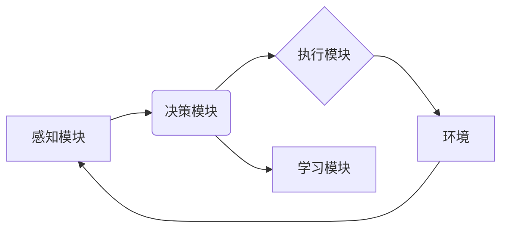

> AI Agent, 智能代理, 强化学习, 自然语言处理, 机器学习, 决策优化, 自动化

## 1. 背景介绍

人工智能（AI）技术近年来发展迅速，从语音识别、图像识别到自然语言处理等领域取得了突破性进展。然而，传统的AI模型大多局限于特定的任务，缺乏灵活性和泛化能力。 

智能代理（AI Agent）作为AI领域的新兴方向，旨在构建能够自主学习、决策和执行任务的智能实体。与传统的AI模型不同，AI Agent具备以下关键特征：

* **自主性:** AI Agent能够独立感知环境、制定决策并执行行动，无需人工干预。
* **学习能力:** AI Agent能够通过经验积累和学习，不断提升其决策和执行能力。
* **适应性:** AI Agent能够根据环境变化调整其策略，并适应新的挑战。
* **交互性:** AI Agent能够与用户或其他代理进行交互，协同完成任务。

## 2. 核心概念与联系

AI Agent的核心概念是将智能体抽象为一个代理，该代理拥有感知、决策和执行的能力。

**AI Agent的架构通常包含以下几个关键模块:**

* **感知模块:** 用于收集环境信息，例如传感器数据、用户输入等。
* **决策模块:** 基于感知信息，制定最优行动策略。
* **执行模块:** 将决策转化为实际行动，并与环境交互。
* **学习模块:** 通过经验积累，不断优化决策策略。

**AI Agent的典型架构:**



## 3. 核心算法原理 & 具体操作步骤

### 3.1  算法原理概述

AI Agent的决策和学习通常基于机器学习和强化学习算法。

* **机器学习:**  通过训练模型，从数据中学习规律，并用于预测或分类。常见的机器学习算法包括监督学习、无监督学习和强化学习。
* **强化学习:**  通过试错学习，在环境中交互，获得奖励或惩罚，并不断优化策略以最大化奖励。

### 3.2  算法步骤详解

**强化学习算法的典型步骤:**

1. **环境建模:** 建立环境模型，定义状态空间、动作空间和奖励函数。
2. **策略初始化:** 初始化代理的策略，例如随机策略或贪婪策略。
3. **环境交互:** 代理与环境交互，根据策略选择动作，并观察环境状态变化和奖励信号。
4. **策略更新:** 根据奖励信号，更新代理的策略，使其在未来能够获得更高的奖励。
5. **重复步骤3-4:**  重复以上步骤，直到代理的策略收敛或达到预设的目标。

### 3.3  算法优缺点

**强化学习算法的优点:**

* 能够学习复杂的任务，无需明确的规则和模型。
* 能够适应动态变化的环境。

**强化学习算法的缺点:**

* 训练过程可能需要大量的时间和资源。
* 难以设计有效的奖励函数。

### 3.4  算法应用领域

强化学习算法在许多领域都有广泛的应用，例如:

* **游戏:**  AlphaGo、AlphaStar等AI代理在围棋、星际争霸等游戏中取得了人类级别的成绩。
* **机器人:**  强化学习算法可以用于训练机器人进行导航、抓取、操控等任务。
* **自动驾驶:**  强化学习算法可以用于训练自动驾驶汽车，使其能够安全地行驶在复杂道路环境中。

## 4. 数学模型和公式 & 详细讲解 & 举例说明

### 4.1  数学模型构建

强化学习的数学模型通常基于马尔可夫决策过程（MDP）。

**MDP定义:**

* **状态空间 (S):** 环境可能存在的各种状态。
* **动作空间 (A):** 代理可以执行的各种动作。
* **转移概率 (P):** 从一个状态执行一个动作后，转移到另一个状态的概率。
* **奖励函数 (R):** 代理在某个状态执行某个动作后获得的奖励。

**目标:** 找到一个策略 π，使得代理在与环境交互的过程中获得最大的累积奖励。

### 4.2  公式推导过程

**价值函数 (V):**  表示从某个状态开始执行策略 π 后获得的期望累积奖励。

$$V^\pi(s) = E[\sum_{t=0}^{\infty} \gamma^t r_{t+1} | s_t = s, \pi]$$

其中:

* γ (0 ≤ γ ≤ 1) 是折扣因子，表示未来奖励的权重。
* $r_{t+1}$ 是在时间步 t+1 获得的奖励。

**策略梯度算法:**

策略梯度算法是一种常用的强化学习算法，其目标是通过梯度上升法更新策略，使其能够最大化价值函数。

$$ \nabla_\theta J(\theta) = \nabla_\theta E_{\tau \sim \pi_\theta} [R(\tau)] $$

其中:

* θ 是策略参数。
* τ 是一个轨迹，表示代理与环境交互的一系列状态和动作。

### 4.3  案例分析与讲解

**例子:**

一个机器人需要学习在迷宫中找到出口。

* **状态空间:** 迷宫中的每个位置。
* **动作空间:** 向上、向下、向左、向右四个方向移动。
* **转移概率:**  根据迷宫结构，计算机器人移动到不同位置的概率。
* **奖励函数:**  到达出口时获得最大奖励，迷宫中其他位置获得较小的奖励。

通过强化学习算法，机器人可以学习最优的路径，找到出口。

## 5. 项目实践：代码实例和详细解释说明

### 5.1  开发环境搭建

* Python 3.x
* TensorFlow 或 PyTorch 等深度学习框架
* OpenAI Gym 或其他强化学习环境

### 5.2  源代码详细实现

```python
import gym
import tensorflow as tf

# 定义神经网络模型
class Agent(tf.keras.Model):
    def __init__(self, state_size, action_size):
        super(Agent, self).__init__()
        self.dense1 = tf.keras.layers.Dense(64, activation='relu')
        self.dense2 = tf.keras.layers.Dense(action_size)

    def call(self, state):
        x = self.dense1(state)
        return self.dense2(x)

# 初始化代理
state_size = 4
action_size = 4
agent = Agent(state_size, action_size)

# 定义训练函数
def train(env, agent, epochs, batch_size):
    for epoch in range(epochs):
        states, actions, rewards, next_states, dones = [], [], [], [], []
        for _ in range(batch_size):
            state = env.reset()
            done = False
            while not done:
                action = agent(tf.expand_dims(state, axis=0))
                next_state, reward, done, _ = env.step(tf.argmax(action).numpy())
                states.append(state)
                actions.append(action)
                rewards.append(reward)
                next_states.append(next_state)
                dones.append(done)
            
        # 更新代理策略
        # ...

# 训练代理
train(env, agent, epochs=100, batch_size=32)

# 测试代理
# ...
```

### 5.3  代码解读与分析

* 代码首先定义了神经网络模型，用于表示代理的策略。
* 然后初始化代理，并定义训练函数。
* 训练函数使用强化学习算法，通过与环境交互，更新代理的策略。
* 最后，可以测试代理的性能。

### 5.4  运行结果展示

运行结果展示代理在环境中学习和执行任务的性能，例如完成任务的成功率、平均奖励等。

## 6. 实际应用场景

### 6.1  智能客服

AI Agent可以作为智能客服，通过自然语言处理技术理解用户需求，并提供自动回复和解决方案。

### 6.2  个性化推荐

AI Agent可以根据用户的行为数据和偏好，推荐个性化的商品、服务或内容。

### 6.3  自动交易

AI Agent可以根据市场数据和交易策略，自动进行股票、期货等金融交易。

### 6.4  未来应用展望

AI Agent在未来将有更广泛的应用场景，例如:

* **医疗保健:**  辅助医生诊断疾病、制定治疗方案。
* **教育:**  提供个性化学习辅导、自动批改作业。
* **制造业:**  优化生产流程、提高生产效率。

## 7. 工具和资源推荐

### 7.1  学习资源推荐

* **书籍:**
    * Reinforcement Learning: An Introduction by Sutton and Barto
    * Deep Reinforcement Learning Hands-On by Maxim Lapan
* **在线课程:**
    * Coursera: Reinforcement Learning Specialization
    * Udacity: Deep Reinforcement Learning Nanodegree

### 7.2  开发工具推荐

* **OpenAI Gym:**  强化学习环境
* **TensorFlow:**  深度学习框架
* **PyTorch:**  深度学习框架

### 7.3  相关论文推荐

* Deep Q-Network (DQN)
* Proximal Policy Optimization (PPO)
* Trust Region Policy Optimization (TRPO)

## 8. 总结：未来发展趋势与挑战

### 8.1  研究成果总结

AI Agent领域取得了显著进展，例如在游戏、机器人等领域取得了突破性成果。

### 8.2  未来发展趋势

* **更强大的算法:**  开发更有效的强化学习算法，能够解决更复杂的任务。
* **更丰富的环境:**  构建更逼真的环境，模拟现实世界中的复杂场景。
* **更安全的代理:**  确保AI Agent的安全性和可靠性，避免其被恶意利用。

### 8.3  面临的挑战

* **数据获取和标注:**  强化学习算法需要大量的数据进行训练，数据获取和标注成本较高。
* **奖励函数设计:**  设计有效的奖励函数是强化学习的关键，但往往非常困难。
* **可解释性:**  强化学习模型的决策过程往往难以解释，这可能会导致信任问题。

### 8.4  研究展望

未来，AI Agent将继续朝着更智能、更安全、更可靠的方向发展，并将在更多领域发挥重要作用。


## 9. 附录：常见问题与解答

**常见问题:**

* **什么是AI Agent？**
* **AI Agent与传统AI模型有什么区别？**
* **如何训练AI Agent？**
* **AI Agent有哪些应用场景？**

**解答:**

* **什么是AI Agent？** AI Agent是一种能够自主学习、决策和执行任务的智能实体。
* **AI Agent与传统AI模型有什么区别？**  传统AI模型大多局限于特定的任务，而AI Agent具备自主性、学习能力和适应性。
* **如何训练AI Agent？**  通过强化学习算法，让AI Agent与环境交互，获得奖励和惩罚，并不断优化策略。
* **AI Agent有哪些应用场景？**  AI Agent在智能客服、个性化推荐、自动交易等领域都有广泛的应用。


作者：禅与计算机程序设计艺术 / Zen and the Art of Computer Programming 
<end_of_turn>