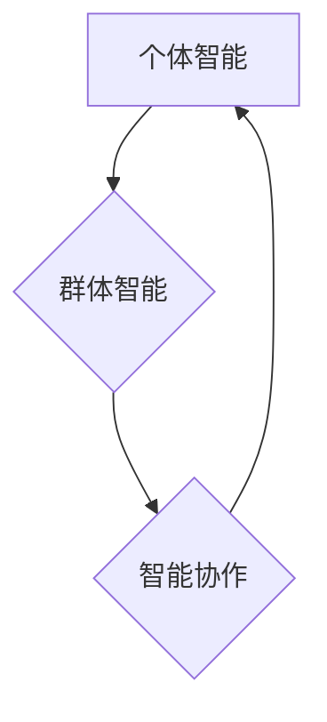

> AI Agent, 个体智能, 群体智能, 智能协作, 算法原理, 数学模型, 项目实践, 实际应用场景

## 1. 背景介绍

人工智能（AI）正以惊人的速度发展，其应用领域不断拓展，从自动驾驶到医疗诊断，再到金融分析，AI正在深刻地改变着我们的生活。在AI的演进过程中，AI Agent作为一种重要的研究方向，逐渐成为人们关注的焦点。

AI Agent是指能够感知环境、做出决策并与环境交互的智能体。传统的AI Agent通常是独立运行的，其智能水平受限于自身的知识和能力。然而，随着技术的进步，人们开始探索更强大的AI Agent模型，即“三驾马车”：个体智能、群体智能和智能协作。

## 2. 核心概念与联系

**2.1 个体智能**

个体智能是指单个AI Agent自身的智能水平，包括其感知能力、决策能力和执行能力。个体智能的提升需要依靠更强大的算法、更丰富的知识库和更有效的学习机制。

**2.2 群体智能**

群体智能是指多个AI Agent协同合作，通过信息共享和任务分工，实现超越单个Agent能力的智能表现。群体智能的优势在于能够利用多个Agent的优势，克服单个Agent的局限性，并通过协同学习不断提升整体智能水平。

**2.3 智能协作**

智能协作是指AI Agent之间进行有效的沟通和合作，共同完成复杂的任务。智能协作需要解决Agent之间的信任问题、信息共享问题和任务分配问题等挑战。

**2.4 三驾马车关系**

个体智能、群体智能和智能协作相互关联，共同推动AI Agent的发展。个体智能是群体智能和智能协作的基础，群体智能和智能协作则能够进一步提升个体智能。



## 3. 核心算法原理 & 具体操作步骤

**3.1 算法原理概述**

在构建AI Agent“三驾马车”时，需要采用多种算法来实现个体智能、群体智能和智能协作。一些常用的算法包括：

* **深度学习算法:** 用于训练个体Agent的感知和决策能力。
* **强化学习算法:** 用于训练个体Agent的决策策略，使其能够在环境中学习和优化行为。
* **粒子群算法:** 用于优化群体智能中的任务分配和协作策略。
* **蚁群算法:** 用于解决智能协作中的路径规划和资源分配问题。

**3.2 算法步骤详解**

以深度学习算法为例，其训练步骤如下：

1. **数据收集和预处理:** 收集大量相关数据，并进行清洗、格式化和特征提取等预处理工作。
2. **模型构建:** 根据任务需求选择合适的深度学习模型架构，例如卷积神经网络（CNN）、循环神经网络（RNN）等。
3. **模型训练:** 使用训练数据训练深度学习模型，通过调整模型参数，使其能够准确地识别和分类数据。
4. **模型评估:** 使用测试数据评估模型的性能，并根据评估结果进行模型调优。
5. **模型部署:** 将训练好的模型部署到实际应用场景中，用于进行预测或决策。

**3.3 算法优缺点**

不同的算法具有不同的优缺点，需要根据具体任务需求选择合适的算法。例如，深度学习算法能够学习复杂的特征关系，但需要大量的训练数据和计算资源。强化学习算法能够学习最优策略，但训练过程较为复杂。

**3.4 算法应用领域**

AI Agent“三驾马车”的算法应用领域非常广泛，包括：

* **自动驾驶:** 个体智能用于感知环境，群体智能用于协同决策，智能协作用于车辆之间的安全通信。
* **医疗诊断:** 个体智能用于分析医学图像，群体智能用于辅助医生诊断，智能协作用于患者信息共享和协同治疗。
* **金融分析:** 个体智能用于识别金融风险，群体智能用于预测市场趋势，智能协作用于风险管理和投资决策。

## 4. 数学模型和公式 & 详细讲解 & 举例说明

**4.1 数学模型构建**

在构建AI Agent“三驾马车”的数学模型时，需要考虑个体智能、群体智能和智能协作之间的关系。

* **个体智能模型:** 可以使用神经网络模型来表示个体Agent的感知和决策能力。

* **群体智能模型:** 可以使用群体智能算法，例如粒子群算法或蚁群算法，来模拟多个Agent的协同行为。

* **智能协作模型:** 可以使用博弈论或多智能体系统理论来分析Agent之间的合作和竞争关系。

**4.2 公式推导过程**

以粒子群算法为例，其核心公式如下：

* **速度更新公式:** $v_i(t+1) = w * v_i(t) + c_1 * r_1 * (pbest_i - x_i(t)) + c_2 * r_2 * (gbest - x_i(t))$

* **位置更新公式:** $x_i(t+1) = x_i(t) + v_i(t+1)$

其中：

* $v_i(t)$: 第 $i$ 个粒子在时间 $t$ 的速度
* $x_i(t)$: 第 $i$ 个粒子在时间 $t$ 的位置
* $w$: 惯性权重
* $c_1$: 自信度
* $c_2$: 社会性
* $r_1$, $r_2$: 随机数
* $pbest_i$: 第 $i$ 个粒子找到的最佳位置
* $gbest$: 全局最佳位置

**4.3 案例分析与讲解**

粒子群算法可以用于优化AI Agent“三驾马车”中的任务分配和协作策略。例如，在自动驾驶场景中，可以使用粒子群算法来优化车辆之间的路径规划和速度控制，从而提高交通效率和安全性。

## 5. 项目实践：代码实例和详细解释说明

**5.1 开发环境搭建**

* 操作系统: Ubuntu 20.04
* Python 版本: 3.8
* 必要的库: TensorFlow, PyTorch, NumPy, Pandas

**5.2 源代码详细实现**

```python
# 导入必要的库
import tensorflow as tf

# 定义个体智能模型
model = tf.keras.models.Sequential([
    tf.keras.layers.Dense(128, activation='relu', input_shape=(10,)),
    tf.keras.layers.Dense(64, activation='relu'),
    tf.keras.layers.Dense(10, activation='softmax')
])

# 训练模型
model.compile(optimizer='adam',
              loss='sparse_categorical_crossentropy',
              metrics=['accuracy'])
model.fit(x_train, y_train, epochs=10)

# 评估模型
loss, accuracy = model.evaluate(x_test, y_test)
print('Test loss:', loss)
print('Test accuracy:', accuracy)
```

**5.3 代码解读与分析**

这段代码实现了基于TensorFlow深度学习框架的个体智能模型训练。

* 首先，定义了一个简单的多层感知机模型，用于分类任务。
* 然后，使用Adam优化器和交叉熵损失函数训练模型。
* 最后，使用测试数据评估模型的性能。

**5.4 运行结果展示**

训练完成后，可以查看模型的训练损失和准确率，以及测试损失和准确率。

## 6. 实际应用场景

**6.1 自动驾驶**

AI Agent“三驾马车”在自动驾驶领域具有广泛的应用场景：

* **感知环境:** 个体智能用于感知道路、车辆和行人等信息。
* **决策规划:** 群体智能用于协同决策，例如路径规划和速度控制。
* **安全通信:** 智能协作用于车辆之间的安全通信，避免碰撞事故。

**6.2 医疗诊断**

AI Agent“三驾马车”在医疗诊断领域可以辅助医生进行更准确的诊断：

* **图像分析:** 个体智能用于分析医学图像，例如X光片和CT扫描，识别病灶。
* **辅助诊断:** 群体智能用于分析患者的病史、症状和检查结果，辅助医生做出诊断。
* **协同治疗:** 智能协作用于患者信息共享和协同治疗，提高治疗效果。

**6.3 金融分析**

AI Agent“三驾马车”在金融分析领域可以帮助投资者做出更明智的决策：

* **风险识别:** 个体智能用于识别金融风险，例如股票市场波动和债券违约风险。
* **市场预测:** 群体智能用于预测市场趋势，例如股票价格走势和汇率变化。
* **投资决策:** 智能协作用于风险管理和投资决策，提高投资收益。

**6.4 未来应用展望**

AI Agent“三驾马车”的应用场景还在不断拓展，未来将应用于更多领域，例如教育、娱乐、制造业等。随着技术的进步，AI Agent将更加智能化、个性化和协作化，为人类社会带来更多福祉。

## 7. 工具和资源推荐

**7.1 学习资源推荐**

* **书籍:**
    * 《人工智能：现代方法》
    * 《深度学习》
    * 《机器学习》
* **在线课程:**
    * Coursera: 深度学习
    * edX: 人工智能
    * Udacity: 机器学习工程师

**7.2 开发工具推荐**

* **Python:** 广泛用于AI开发，拥有丰富的库和框架。
* **TensorFlow:** Google开发的开源深度学习框架。
* **PyTorch:** Facebook开发的开源深度学习框架。
* **Jupyter Notebook:** 用于代码编写、数据分析和可视化。

**7.3 相关论文推荐**

* **Swarm Intelligence: A Review**
* **Deep Reinforcement Learning: An Overview**
* **Multi-Agent Reinforcement Learning: A Survey**

## 8. 总结：未来发展趋势与挑战

**8.1 研究成果总结**

AI Agent“三驾马车”的研究取得了显著进展，个体智能、群体智能和智能协作的算法和模型不断完善。

**8.2 未来发展趋势**

* **更强大的个体智能:** 探索更先进的算法和模型，提升个体Agent的感知、决策和执行能力。
* **更有效的群体智能:** 研究更复杂的群体智能算法，提高群体智能的协作效率和鲁棒性。
* **更智能的智能协作:** 探索更有效的智能协作机制，解决Agent之间的信任问题和信息共享问题。

**8.3 面临的挑战**

* **数据获取和隐私保护:** AI Agent的训练需要大量数据，如何获取高质量数据并保护用户隐私是一个挑战。
* **算法解释性和可信度:** AI Agent的决策过程往往难以解释，如何提高算法的透明度和可信度是一个重要问题。
* **安全性和可靠性:** AI Agent在实际应用中需要保证安全性和可靠性，避免出现意外事故。

**8.4 研究展望**

未来，AI Agent“三驾马车”的研究将继续深入，探索更智能、更安全、更可靠的AI Agent模型，为人类社会带来更多福祉。

## 9. 附录：常见问题与解答

**9.1 如何选择合适的AI Agent模型？**

选择合适的AI Agent模型需要根据具体任务需求和环境特点进行考虑。例如，对于感知环境的任务，可以选择基于深度学习的模型；对于决策规划的任务，可以选择基于强化学习的模型；对于协作任务，可以选择基于群体智能的模型。

**9.2 如何解决AI Agent的信任问题？**

解决AI Agent的信任问题可以通过以下方式：

* **透明化决策过程:** 使AI Agent的决策过程更加透明，以便用户理解其决策依据。
* **建立信任机制:** 设计有效的信任机制，例如基于 reputation 的信任机制，来评估AI Agent的可靠性。
* **人类监督:** 在关键决策环节引入