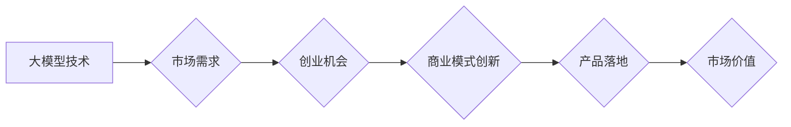

> AI大模型，创业，市场优势，商业应用，技术趋势，落地实践，投资策略

## 1. 背景介绍

近年来，人工智能（AI）技术取得了飞速发展，特别是大模型的涌现，为各行各业带来了前所未有的机遇。大模型是指参数规模庞大、训练数据海量的人工智能模型，具备强大的泛化能力和学习能力，能够在自然语言处理、计算机视觉、语音识别等领域取得突破性进展。

随着大模型技术的成熟，越来越多的创业者看到了其中的商机，纷纷涌入AI大模型创业领域。然而，AI大模型创业并非易事，需要对技术、市场、商业模式等方面有深入的理解和把握。

## 2. 核心概念与联系

**2.1 AI大模型的定义与特点**

AI大模型是指参数规模庞大、训练数据海量的人工智能模型，其核心特点包括：

* **规模化：** 大模型拥有数亿甚至数十亿的参数，使其能够学习更复杂的模式和关系。
* **泛化能力强：** 由于训练数据量大，大模型能够更好地泛化到未知的数据集，表现出更强的适应性和鲁棒性。
* **多任务学习：** 大模型可以同时学习多个任务，例如文本生成、图像识别、语音翻译等，提高了效率和灵活性。

**2.2  大模型的架构与训练**

大模型的架构通常基于Transformer网络，其特点是能够有效捕捉长距离依赖关系。训练过程需要海量数据和强大的计算资源，通常采用分布式训练的方式。

**2.3  大模型的应用场景**

大模型在各个领域都有广泛的应用场景，例如：

* **自然语言处理：** 文本生成、机器翻译、问答系统、情感分析等。
* **计算机视觉：** 图像识别、物体检测、图像分割、视频分析等。
* **语音识别：** 语音转文本、语音合成、语音助手等。
* **其他领域：** 代码生成、药物研发、金融风险评估等。

**2.4  大模型创业的市场优势**

AI大模型创业具有以下市场优势：

* **技术领先：** 大模型技术处于前沿，具有较高的技术壁垒。
* **市场需求旺盛：** 各行各业对AI大模型的需求不断增长。
* **商业模式多样：** 大模型可以应用于多种商业模式，例如SaaS、API、平台等。

**Mermaid 流程图**



## 3. 核心算法原理 & 具体操作步骤

### 3.1  算法原理概述

大模型的训练主要基于深度学习算法，特别是Transformer网络。Transformer网络的核心思想是利用注意力机制来捕捉文本序列中的长距离依赖关系，从而提高模型的理解和生成能力。

### 3.2  算法步骤详解

大模型的训练过程可以概括为以下步骤：

1. **数据预处理：** 收集和清洗训练数据，将其转换为模型可理解的格式。
2. **模型构建：** 根据任务需求选择合适的模型架构，例如BERT、GPT、T5等。
3. **模型训练：** 使用训练数据训练模型，调整模型参数以最小化损失函数。
4. **模型评估：** 使用验证集评估模型性能，并根据评估结果调整训练参数。
5. **模型部署：** 将训练好的模型部署到生产环境中，用于实际应用。

### 3.3  算法优缺点

**优点：**

* 泛化能力强，能够处理复杂的任务。
* 学习能力强，能够从海量数据中提取有价值的信息。
* 多任务学习能力，能够同时学习多个任务。

**缺点：**

* 训练成本高，需要大量的计算资源和时间。
* 数据依赖性强，模型性能受训练数据质量影响。
* 可解释性差，难以理解模型的决策过程。

### 3.4  算法应用领域

大模型的应用领域非常广泛，包括：

* **自然语言处理：** 文本生成、机器翻译、问答系统、情感分析等。
* **计算机视觉：** 图像识别、物体检测、图像分割、视频分析等。
* **语音识别：** 语音转文本、语音合成、语音助手等。
* **其他领域：** 代码生成、药物研发、金融风险评估等。

## 4. 数学模型和公式 & 详细讲解 & 举例说明

### 4.1  数学模型构建

大模型的训练过程可以看作是一个优化问题，目标是找到最优的参数，使得模型在训练数据上的损失函数最小。损失函数通常是模型预测值与真实值的差值，例如均方误差（MSE）或交叉熵损失（Cross-Entropy Loss）。

### 4.2  公式推导过程

**均方误差（MSE）:**

$$MSE = \frac{1}{n} \sum_{i=1}^{n} (y_i - \hat{y}_i)^2$$

其中：

* $y_i$ 是真实值
* $\hat{y}_i$ 是模型预测值
* $n$ 是样本数量

**交叉熵损失（Cross-Entropy Loss）:**

$$Loss = - \sum_{i=1}^{n} y_i \log(\hat{y}_i) $$

其中：

* $y_i$ 是真实值（one-hot编码）
* $\hat{y}_i$ 是模型预测值（概率分布）

### 4.3  案例分析与讲解

假设我们训练一个图像分类模型，目标是将图像分类为猫或狗。我们可以使用交叉熵损失函数来衡量模型的性能。

如果模型预测图像为猫的概率为0.8，而真实标签为猫，则损失值为：

$$Loss = - 1 \log(0.8) = 0.223$$

如果模型预测图像为狗的概率为0.2，而真实标签为狗，则损失值为：

$$Loss = - 1 \log(0.2) = 1.609$$

通过不断调整模型参数，我们可以降低损失函数的值，从而提高模型的分类准确率。

## 5. 项目实践：代码实例和详细解释说明

### 5.1  开发环境搭建

* **操作系统：** Linux (Ubuntu/CentOS)
* **编程语言：** Python
* **深度学习框架：** TensorFlow/PyTorch
* **硬件环境：** GPU (推荐)

### 5.2  源代码详细实现

```python
# 使用 TensorFlow 框架构建一个简单的文本分类模型

import tensorflow as tf

# 定义模型结构
model = tf.keras.Sequential([
    tf.keras.layers.Embedding(input_dim=10000, output_dim=128),
    tf.keras.layers.LSTM(units=64),
    tf.keras.layers.Dense(units=1, activation='sigmoid')
])

# 编译模型
model.compile(optimizer='adam',
              loss='binary_crossentropy',
              metrics=['accuracy'])

# 训练模型
model.fit(x_train, y_train, epochs=10)

# 评估模型
loss, accuracy = model.evaluate(x_test, y_test)
print('Loss:', loss)
print('Accuracy:', accuracy)
```

### 5.3  代码解读与分析

* **Embedding层：** 将文本单词映射到低维向量空间，捕捉单词之间的语义关系。
* **LSTM层：** 长短期记忆网络，能够捕捉文本序列中的长距离依赖关系。
* **Dense层：** 全连接层，将LSTM层的输出映射到分类结果。
* **编译模型：** 选择优化器、损失函数和评估指标。
* **训练模型：** 使用训练数据训练模型，更新模型参数。
* **评估模型：** 使用测试数据评估模型性能。

### 5.4  运行结果展示

训练完成后，我们可以使用测试数据评估模型的性能，例如准确率、召回率、F1-score等。

## 6. 实际应用场景

### 6.1  自然语言处理

* **文本生成：** 使用大模型生成高质量的文本内容，例如新闻文章、小说、诗歌等。
* **机器翻译：** 将文本从一种语言翻译成另一种语言，提高跨语言沟通效率。
* **问答系统：** 构建能够理解用户问题并提供准确答案的问答系统。
* **情感分析：** 分析文本中的情感倾向，例如正面、负面、中性等。

### 6.2  计算机视觉

* **图像识别：** 将图像分类为不同的类别，例如动物、植物、物体等。
* **物体检测：** 在图像中检测到特定物体的位置和大小。
* **图像分割：** 将图像分割成不同的区域，例如前景和背景。
* **视频分析：** 分析视频内容，例如动作识别、事件检测等。

### 6.3  语音识别

* **语音转文本：** 将语音信号转换为文本，提高语音输入的效率。
* **语音合成：** 将文本转换为语音信号，用于语音助手、播报系统等。
* **语音助手：** 构建能够理解用户语音指令并执行相应操作的语音助手。

### 6.4  未来应用展望

大模型的应用场景还在不断扩展，未来将应用于更多领域，例如：

* **医疗保健：** 辅助诊断、预测疾病风险、个性化治疗等。
* **教育：** 智能辅导、个性化学习、自动批改作业等。
* **金融：** 风险评估、欺诈检测、投资决策等。
* **科学研究：** 数据分析、模型预测、新材料设计等。

## 7. 工具和资源推荐

### 7.1  学习资源推荐

* **书籍：**
    * 《深度学习》
    * 《自然语言处理》
    * 《计算机视觉》
* **在线课程：**
    * Coursera
    * edX
    * Udacity
* **博客和论坛：**
    * TensorFlow Blog
    * PyTorch Blog
    * Kaggle

### 7.2  开发工具推荐

* **深度学习框架：** TensorFlow, PyTorch
* **数据处理工具：** Pandas, NumPy
* **可视化工具：** Matplotlib, Seaborn

### 7.3  相关论文推荐

* **Attention Is All You Need**
* **BERT: Pre-training of Deep Bidirectional Transformers for Language Understanding**
* **GPT-3: Language Models are Few-Shot Learners**

## 8. 总结：未来发展趋势与挑战

### 8.1  研究成果总结

近年来，AI大模型取得了显著进展，在各个领域都展现出强大的应用潜力。大模型的规模不断扩大，训练方法不断优化，模型性能不断提升。

### 8.2  未来发展趋势

* **模型规模化：** 大模型的规模将继续扩大，参数数量将达到数万亿甚至更高。
* **多模态学习：** 大模型将能够处理多种数据类型，例如文本、图像、音频等。
* **可解释性增强：** 研究人员将致力于提高大模型的可解释性，使其决策过程更加透明。
* **边缘计算：** 大模型将部署到边缘设备，实现更低延迟和更高效率的应用。

### 8.3  面临的挑战

* **计算资源需求：** 训练大模型需要大量的计算资源，成本较高。
* **数据安全和隐私：** 大模型的训练需要海量数据，如何保证数据安全和隐私是一个重要挑战。
* **算法可解释性：** 大模型的决策过程难以理解，缺乏可解释性。
* **伦理问题：** 大模型的应用可能带来伦理问题，例如偏见、歧视等。

### 8.4  研究展望

未来，AI大模型研究将继续深入，探索更强大的模型架构、更有效的训练方法、更广泛的应用场景。同时，也将关注大模型的安全性