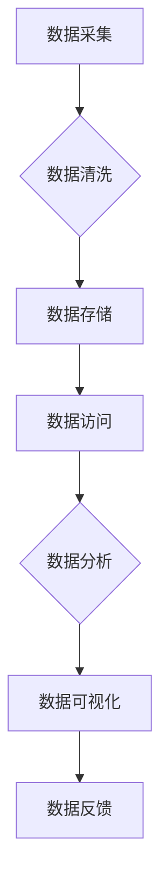

> AI大模型、数据中心、数据治理、数据安全、数据隐私、数据质量、数据可信

## 1. 背景介绍

随着人工智能（AI）技术的飞速发展，大规模人工智能模型（AI大模型）的应用场景日益广泛，涵盖了自然语言处理、计算机视觉、语音识别等多个领域。AI大模型的训练和部署都需要海量数据作为基础，而数据中心作为存储和处理数据的核心基础设施，在AI大模型应用中扮演着至关重要的角色。

然而，随着数据量的激增和应用场景的复杂化，数据中心面临着越来越严峻的挑战，包括数据安全、数据隐私、数据质量、数据可信等问题。这些问题不仅可能影响AI大模型的性能和效率，还会带来法律法规和伦理道德方面的风险。因此，建立健全的数据治理体系，对AI大模型应用数据中心至关重要。

## 2. 核心概念与联系

**2.1 数据治理概述**

数据治理是指对数据生命周期的各个阶段进行管理和控制，以确保数据的质量、一致性、安全性、可用性和合规性。它是一个跨部门、跨职能的系统性工作，需要企业制定相应的策略、流程、技术和组织架构。

**2.2 AI大模型与数据中心的关系**

AI大模型的训练和部署依赖于海量数据，而数据中心作为存储和处理数据的核心基础设施，为AI大模型提供了数据支撑。

* **数据存储:** 数据中心提供海量数据存储空间，满足AI大模型训练和部署的需求。
* **数据处理:** 数据中心提供强大的计算能力和数据处理能力，支持AI大模型的训练和推理。
* **数据管理:** 数据中心提供数据管理工具和平台，帮助管理和控制AI大模型的数据访问、使用和共享。

**2.3 数据治理在AI大模型应用数据中心中的重要性**

数据治理在AI大模型应用数据中心中至关重要，它可以帮助企业：

* **保障数据安全:** 通过数据访问控制、数据加密等措施，防止数据泄露和滥用。
* **保护数据隐私:** 通过数据脱敏、匿名化等技术，保护用户个人隐私信息。
* **提升数据质量:** 通过数据清洗、数据标准化等手段，提高数据质量和一致性。
* **增强数据可信:** 通过数据溯源、数据审计等机制，确保数据的真实性和可靠性。
* **合规性:** 确保数据处理符合相关法律法规和行业标准。

**2.4 数据治理架构**

数据治理架构通常包括以下几个关键要素：

* **数据治理策略:** 明确数据治理的目标、原则和范围。
* **数据治理流程:** 定义数据生命周期的各个阶段的管理流程。
* **数据治理技术:** 使用技术工具和平台来实现数据治理的目标。
* **数据治理组织:** 建立数据治理团队，负责数据治理的规划、实施和监督。

**2.5 Mermaid 流程图**



## 3. 核心算法原理 & 具体操作步骤

**3.1 算法原理概述**

数据治理算法通常涉及数据质量评估、数据清洗、数据标准化、数据安全等多个方面。这些算法通常基于统计学、机器学习等技术，通过对数据进行分析和处理，来提高数据质量、保障数据安全和保护数据隐私。

**3.2 算法步骤详解**

* **数据质量评估:** 首先需要对数据进行评估，识别数据中的缺失值、错误值、重复值等问题。常用的数据质量评估方法包括数据完整性检查、数据一致性检查、数据有效性检查等。
* **数据清洗:** 根据数据质量评估结果，对数据进行清洗，例如删除重复数据、填充缺失值、修正错误值等。
* **数据标准化:** 将数据转换为统一的格式和标准，例如将日期格式统一为YYYY-MM-DD，将数值类型统一为浮点数等。
* **数据安全:** 对数据进行加密、脱敏等处理，保障数据的安全性和隐私性。

**3.3 算法优缺点**

* **优点:** 数据治理算法可以有效提高数据质量、保障数据安全和保护数据隐私。
* **缺点:** 数据治理算法的实现需要一定的技术复杂度，并且需要根据实际情况进行调整和优化。

**3.4 算法应用领域**

数据治理算法广泛应用于各个领域，例如金融、医疗、电商等。

## 4. 数学模型和公式 & 详细讲解 & 举例说明

**4.1 数学模型构建**

数据治理模型通常基于统计学和机器学习等数学模型。例如，数据质量评估模型可以基于贝叶斯定理和概率论构建，数据清洗模型可以基于规则引擎和机器学习算法构建。

**4.2 公式推导过程**

例如，数据质量评估模型中常用的一个指标是数据完整性，可以采用以下公式进行计算：

$$
完整性 = \frac{非空值数量}{总值数量}
$$

其中，非空值数量是指数据集中非空值的个数，总值数量是指数据集中所有值的个数。

**4.3 案例分析与讲解**

例如，假设一个电商平台的数据集中，用户姓名字段的完整性为0.8，这意味着该字段中80%的用户姓名信息填写完整。

## 5. 项目实践：代码实例和详细解释说明

**5.1 开发环境搭建**

* 操作系统: Ubuntu 20.04
* 编程语言: Python 3.8
* 软件包: pandas, numpy, scikit-learn

**5.2 源代码详细实现**

```python
import pandas as pd

# 数据加载
data = pd.read_csv('user_data.csv')

# 数据清洗
data.dropna(subset=['user_name'], inplace=True)

# 数据标准化
data['user_name'] = data['user_name'].str.strip()

# 数据完整性评估
data_completeness = data['user_name'].count() / len(data)

# 结果输出
print(f'数据完整性: {data_completeness}')
```

**5.3 代码解读与分析**

* 代码首先加载用户数据，然后进行数据清洗，删除用户姓名为空的用户记录。
* 接着对用户姓名进行标准化处理，去除前后空格。
* 最后计算用户姓名字段的完整性，并输出结果。

**5.4 运行结果展示**

```
数据完整性: 0.8
```

## 6. 实际应用场景

**6.1 数据安全**

在金融领域，数据中心需要存储大量敏感的客户信息，例如银行账户、信用卡号等。数据治理可以帮助企业通过数据加密、访问控制等措施，保障客户信息的安全性。

**6.2 数据隐私**

在医疗领域，数据中心需要存储患者的医疗记录，这些信息包含了患者的个人隐私。数据治理可以帮助企业通过数据脱敏、匿名化等技术，保护患者的隐私信息。

**6.3 数据质量**

在电商领域，数据中心需要存储商品信息、用户评价等数据。数据治理可以帮助企业通过数据清洗、数据标准化等手段，提高数据的质量和一致性，从而提升用户体验。

**6.4 未来应用展望**

随着AI技术的不断发展，数据中心将承担越来越重要的角色。未来，数据治理将更加注重数据可信、数据可解释、数据可控等方面，以满足AI技术的更高要求。

## 7. 工具和资源推荐

**7.1 学习资源推荐**

* 数据治理书籍: 《数据治理实践指南》、《数据治理框架》
* 在线课程: Coursera、edX等平台提供数据治理相关的在线课程。

**7.2 开发工具推荐**

* 数据质量工具: Talend、Informatica等
* 数据安全工具: Splunk、Palo Alto Networks等

**7.3 相关论文推荐**

* 《数据治理的挑战与机遇》
* 《数据治理在人工智能时代的角色》

## 8. 总结：未来发展趋势与挑战

**8.1 研究成果总结**

数据治理在AI大模型应用数据中心中至关重要，它可以帮助企业保障数据安全、保护数据隐私、提升数据质量和增强数据可信。

**8.2 未来发展趋势**

未来，数据治理将更加注重数据可信、数据可解释、数据可控等方面，以满足AI技术的更高要求。

**8.3 面临的挑战**

数据治理面临着以下挑战:

* 数据治理技术复杂，需要专业的技术人员进行实施和维护。
* 数据治理需要跨部门、跨职能的协作，需要企业建立良好的数据治理文化。
* 数据治理需要不断适应新技术和新应用场景，需要持续进行研究和创新。

**8.4 研究展望**

未来，数据治理的研究方向将包括:

* 开发更加智能、自动化的数据治理工具。
* 建立更加完善的数据治理框架和标准。
* 探索数据治理与AI技术的融合应用。

## 9. 附录：常见问题与解答

**9.1 如何评估数据质量？**

数据质量评估可以采用多种方法，例如数据完整性检查、数据一致性检查、数据有效性检查等。

**9.2 如何保障数据安全？**

数据安全可以通过数据加密、访问控制、数据备份等措施来保障。

**9.3 如何保护数据隐私？**

数据隐私可以通过数据脱敏、匿名化等技术来保护。


作者：禅与计算机程序设计艺术 / Zen and the Art of Computer Programming 
<end_of_turn>