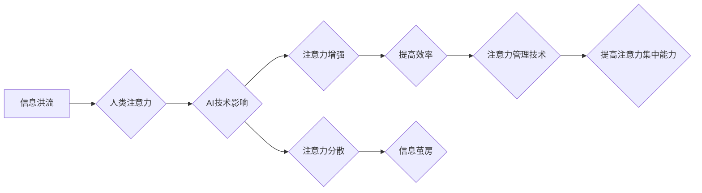

> 人工智能，注意力流，工作模式，技能发展，注意力管理技术，未来趋势

## 1. 背景介绍

在信息爆炸的时代，人类面临着前所未有的信息洪流。注意力，作为我们获取、处理和理解信息的关键能力，变得越来越稀缺和宝贵。同时，人工智能（AI）技术飞速发展，正在深刻地改变着我们的生活和工作方式。AI技术的应用，一方面可以帮助我们更高效地处理信息，另一方面也可能加剧注意力流失的现象。因此，深入研究AI与人类注意力流之间的关系，探讨未来工作、技能发展和注意力管理技术的应用前景，显得尤为重要。

### 1.1 信息时代注意力危机

现代社会，我们被各种信息源包围，手机、电脑、社交媒体等设备不断地向我们推送信息，导致注意力被分散，难以集中。研究表明，人类的注意力持续时间越来越短，平均每人每天只能够集中注意力进行有效工作约 65 分钟。这种注意力危机不仅影响着我们的工作效率，也损害着我们的身心健康。

### 1.2 AI技术与注意力流的双重影响

AI技术一方面可以帮助我们提高注意力效率。例如，AI驱动的智能筛选工具可以过滤掉无关信息，帮助我们专注于重要内容；AI驱动的学习平台可以根据用户的学习习惯和进度，个性化推荐学习内容，提高学习效率。

另一方面，AI技术也可能加剧注意力流失。例如，AI驱动的个性化推荐算法可能会导致我们陷入信息茧房，只接触到自己感兴趣的信息，而忽略其他重要的信息；AI驱动的社交媒体算法可能会利用我们的注意力机制，不断推送新信息，让我们难以集中注意力。

## 2. 核心概念与联系

### 2.1 人类注意力流

人类注意力流是指我们对信息进行选择性关注的过程。它是一个复杂的心理过程，涉及到认知、情感、生理等多个方面。注意力流的特征包括：

* **选择性:** 我们只能同时关注有限的信息，需要选择性地关注重要信息。
* **可塑性:** 注意力流可以被训练和改变，可以通过练习和经验积累来提高注意力集中能力。
* **动态性:** 注意力流并非静态的，它会随着时间和环境的变化而发生变化。

### 2.2 人工智能与注意力流

AI技术可以对人类注意力流产生多种影响，包括：

* **增强注意力:** AI可以帮助我们过滤无关信息，提高信息处理效率，从而增强注意力。
* **分散注意力:** AI算法可能会利用我们的注意力机制，不断推送新信息，导致注意力分散。
* **改变注意力模式:** AI技术可能会改变我们对信息的获取和处理方式，从而改变我们的注意力模式。

### 2.3  注意力流管理技术

注意力流管理技术是指通过各种方法和工具，帮助人们更好地控制和管理自己的注意力，提高注意力集中能力和效率。常见的注意力流管理技术包括：

* **冥想:** 冥想可以帮助我们训练专注力，提高注意力集中能力。
* **番茄工作法:** 番茄工作法是一种时间管理方法，可以帮助我们集中注意力，提高工作效率。
* **专注力训练软件:** 一些软件可以帮助我们进行注意力训练，提高注意力集中能力。

**Mermaid 流程图**



## 3. 核心算法原理 & 具体操作步骤

### 3.1  算法原理概述

注意力机制是近年来深度学习领域中一个重要的研究方向。它借鉴了人类认知机制，通过学习不同输入元素的重要性权重，对信息进行选择性关注。

### 3.2  算法步骤详解

1. **输入数据:** 将输入数据（例如文本、图像等）转换为向量表示。
2. **计算权重:** 使用注意力机制计算每个输入元素的重要性权重。
3. **加权求和:** 根据计算出的权重，对输入元素进行加权求和，得到最终的输出。

### 3.3  算法优缺点

**优点:**

* 可以提高模型的表达能力，更好地捕捉输入数据的关键信息。
* 可以减少模型的计算量，提高训练效率。

**缺点:**

* 训练复杂度较高，需要大量的训练数据。
* 难以解释模型的决策过程。

### 3.4  算法应用领域

注意力机制在自然语言处理、计算机视觉、机器翻译等领域都有广泛的应用。例如，在机器翻译中，注意力机制可以帮助模型更好地理解句子结构和语义关系，提高翻译质量。

## 4. 数学模型和公式 & 详细讲解 & 举例说明

### 4.1  数学模型构建

注意力机制的数学模型通常基于以下公式：

$$
\text{Attention}(Q, K, V) = \text{softmax}\left(\frac{Q K^T}{\sqrt{d_k}}\right) V
$$

其中：

* $Q$：查询向量
* $K$：键向量
* $V$：值向量
* $d_k$：键向量的维度
* $\text{softmax}$：softmax函数

### 4.2  公式推导过程

公式推导过程可以参考相关文献，例如：

* Vaswani, A., Shazeer, N., Parmar, N., Uszkoreit, J., Jones, L., Gomez, A. N., ... & Polosukhin, I. (2017). Attention is all you need. Advances in neural information processing systems, 30.

### 4.3  案例分析与讲解

例如，在机器翻译中，查询向量 $Q$ 可以表示源语言句子中的一个词，键向量 $K$ 可以表示目标语言词典中的每个词，值向量 $V$ 可以表示目标语言词典中的每个词的嵌入向量。通过计算注意力权重，模型可以根据源语言词语的语义和上下文，选择最合适的目标语言词语进行翻译。

## 5. 项目实践：代码实例和详细解释说明

### 5.1  开发环境搭建

使用Python语言开发，需要安装以下库：

* TensorFlow 或 PyTorch
* NLTK 或 spaCy

### 5.2  源代码详细实现

```python
import tensorflow as tf

# 定义注意力机制层
class AttentionLayer(tf.keras.layers.Layer):
    def __init__(self, units):
        super(AttentionLayer, self).__init__()
        self.Wq = tf.keras.layers.Dense(units)
        self.Wk = tf.keras.layers.Dense(units)
        self.Wv = tf.keras.layers.Dense(units)
        self.fc = tf.keras.layers.Dense(units)

    def call(self, inputs):
        Q, K, V = inputs
        Q = self.Wq(Q)
        K = self.Wk(K)
        V = self.Wv(V)
        attention_scores = tf.matmul(Q, K, transpose_b=True) / tf.math.sqrt(tf.cast(tf.shape(K)[-1], tf.float32))
        attention_weights = tf.nn.softmax(attention_scores, axis=-1)
        output = tf.matmul(attention_weights, V)
        return self.fc(output)

# 使用注意力机制层
model = tf.keras.Sequential([
    tf.keras.layers.Embedding(input_dim=10000, output_dim=128),
    AttentionLayer(units=128),
    tf.keras.layers.Dense(units=10, activation='softmax')
])
```

### 5.3  代码解读与分析

代码实现了一个简单的注意力机制层，并将其应用于一个文本分类模型。

### 5.4  运行结果展示

运行结果可以根据实际数据和模型参数进行评估，例如使用准确率、召回率等指标来衡量模型的性能。

## 6. 实际应用场景

### 6.1  个性化推荐系统

注意力机制可以帮助推荐系统更好地理解用户的兴趣和偏好，提供更个性化的推荐结果。

### 6.2  机器翻译

注意力机制可以帮助机器翻译模型更好地捕捉句子结构和语义关系，提高翻译质量。

### 6.3  医疗诊断

注意力机制可以帮助医疗诊断系统识别病人的关键症状和体征，提高诊断准确率。

### 6.4  未来应用展望

注意力机制在未来将有更广泛的应用，例如：

* **自动驾驶:** 注意力机制可以帮助自动驾驶系统更好地感知周围环境，提高驾驶安全性。
* **机器人交互:** 注意力机制可以帮助机器人更好地理解人类的语言和行为，提高人机交互的自然性和流畅性。
* **教育:** 注意力机制可以帮助教育系统个性化教学，提高学生的学习效率。

## 7. 工具和资源推荐

### 7.1  学习资源推荐

* **书籍:**
    * Attention Is All You Need (论文)
    * Deep Learning (书)
* **在线课程:**
    * Coursera: Deep Learning Specialization
    * Udacity: Deep Learning Nanodegree

### 7.2  开发工具推荐

* **TensorFlow:** 开源深度学习框架
* **PyTorch:** 开源深度学习框架
* **Keras:** 高级深度学习API

### 7.3  相关论文推荐

* Vaswani, A., Shazeer, N., Parmar, N., Uszkoreit, J., Jones, L., Gomez, A. N., ... & Polosukhin, I. (2017). Attention is all you need. Advances in neural information processing systems, 30.
* Luong, M. T., Pham, H., & Manning, C. D. (2015). Effective approaches to attention-based neural machine translation. arXiv preprint arXiv:1508.04025.

## 8. 总结：未来发展趋势与挑战

### 8.1  研究成果总结

近年来，注意力机制在深度学习领域取得了显著的成果，在自然语言处理、计算机视觉等领域取得了突破性的进展。

### 8.2  未来发展趋势

未来，注意力机制的研究将朝着以下方向发展：

* **更有效的注意力机制:** 研究更有效的注意力机制，提高模型的表达能力和效率。
* **自适应注意力机制:** 研究自适应注意力机制，能够根据不同的任务和数据自动调整注意力权重。
* **多模态注意力机制:** 研究多模态注意力机制，能够处理多种类型的输入数据，例如文本、图像、音频等。

### 8.3  面临的挑战

注意力机制也面临着一些挑战：

* **可解释性:** 注意力机制的决策过程难以解释，这限制了其在一些应用场景中的应用。
* **计算复杂度:** 一些注意力机制的计算复杂度较高，难以在资源有限的设备上运行。
* **数据依赖性:** 注意力机制需要大量的训练数据才能达到最佳效果。

### 8.4  研究展望

未来，我们需要继续深入研究注意力机制，解决其面临的挑战，并将其应用于更多领域，推动人工智能技术的发展。

## 9. 附录：常见问题与解答

### 9.1  Q1: 注意力机制和深度学习的关系是什么？

**A1:** 注意力机制是一种深度学习中的重要技术，它可以帮助模型更好地理解和处理信息。

### 9.2  Q2: 注意力机制有哪些应用场景？

**A2:** 注意力机制在自然语言处理、计算机视觉、机器翻译、医疗诊断等领域都有广泛的应用。

### 9.3  Q3: 如何学习注意力机制？

**A3:** 可以通过阅读相关书籍、在线课程和论文来学习注意力机制。

作者：禅与计算机程序设计艺术 / Zen and the Art of Computer Programming


<end_of_turn>