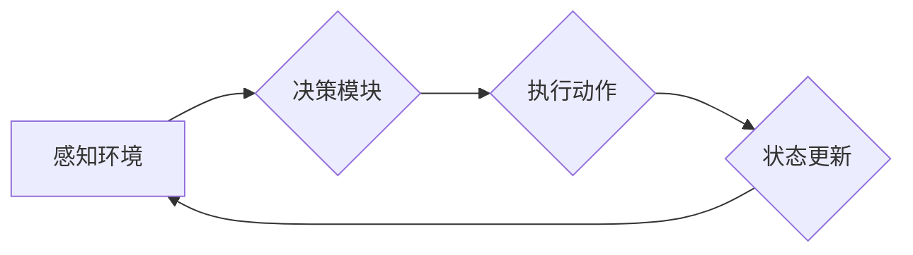

> AI代理，工作流，状态管理，状态跟踪，状态机，事件驱动，人工智能

## 1. 背景介绍

在现代软件开发中，人工智能（AI）代理正在扮演越来越重要的角色。AI代理是一种能够自主执行任务、学习和适应环境的智能系统。它们广泛应用于各种领域，例如聊天机器人、自动化流程、个性化推荐等。

为了有效地管理和控制AI代理的行为，我们需要一种机制来定义和跟踪其状态。状态是指AI代理在特定时间点所处的条件或环境。状态的定义和跟踪对于理解代理的行为、预测其未来动作以及进行调试和维护至关重要。

## 2. 核心概念与联系

### 2.1 AI代理

AI代理是一个能够感知环境、做出决策并执行动作的智能系统。它通常由以下几个核心组件组成：

* **感知模块:** 用于收集环境信息，例如传感器数据、用户输入等。
* **决策模块:** 基于感知到的信息，做出选择并制定行动计划。
* **执行模块:** 将决策转化为实际动作，并与环境交互。
* **学习模块:** 从经验中学习，不断改进决策和行为。

### 2.2 工作流

工作流是一种描述业务流程的模型，它定义了一系列步骤和规则，用于完成特定任务。工作流通常由以下几个关键要素组成：

* **活动:** 工作流中的基本单元，代表一个具体的任务或操作。
* **条件:** 用于控制活动执行顺序的逻辑判断。
* **连接器:** 用于连接活动，定义活动之间的执行顺序和依赖关系。

### 2.3 状态管理

状态管理是指跟踪和控制系统状态的变化过程。在AI代理中，状态管理用于记录代理的当前状态、历史状态和未来状态。

### 2.4 状态跟踪

状态跟踪是指记录和追踪AI代理状态变化的过程。它可以帮助我们理解代理的行为、预测其未来动作以及进行调试和维护。

**Mermaid 流程图**



## 3. 核心算法原理 & 具体操作步骤

### 3.1 算法原理概述

状态跟踪算法的核心思想是通过定义状态机来描述AI代理的状态变化过程。状态机是一种图结构，它由状态和状态转换组成。每个状态代表代理的当前状态，状态转换则描述了在特定条件下如何从一个状态转移到另一个状态。

### 3.2 算法步骤详解

1. **定义状态:** 首先，需要定义AI代理可能具有的所有状态。每个状态都应该具有明确的含义和特征。
2. **定义状态转换:** 然后，需要定义状态之间的转换规则。每个转换规则都应该指定触发转换的条件以及转换后的状态。
3. **实现状态机:** 将状态和状态转换规则组合成一个状态机。状态机可以由代码或图形表示。
4. **跟踪状态变化:** 当AI代理执行任务时，需要根据其感知到的信息和决策模块的输出，不断更新其状态。
5. **记录状态历史:** 可以记录AI代理的状态历史，以便于分析和调试。

### 3.3 算法优缺点

**优点:**

* **清晰易懂:** 状态机是一种直观易懂的模型，可以清晰地描述AI代理的状态变化过程。
* **易于实现:** 状态机算法相对简单，易于实现。
* **可扩展性强:** 可以根据需要添加新的状态和状态转换规则，扩展状态机模型。

**缺点:**

* **状态爆炸问题:** 当AI代理的状态空间很大时，状态机可能会变得非常复杂，难以管理。
* **缺乏灵活性:** 状态机模型相对僵化，难以处理非确定性或动态变化的环境。

### 3.4 算法应用领域

状态跟踪算法广泛应用于各种AI代理领域，例如：

* **聊天机器人:** 用于跟踪对话上下文，理解用户意图并提供相应的回复。
* **自动化流程:** 用于管理任务执行流程，确保任务按预期顺序完成。
* **个性化推荐:** 用于跟踪用户行为和偏好，提供个性化的产品或服务推荐。

## 4. 数学模型和公式 & 详细讲解 & 举例说明

### 4.1 数学模型构建

我们可以用状态转移矩阵来表示状态机模型。状态转移矩阵是一个n x n的矩阵，其中n代表状态的数量。矩阵元素表示从一个状态到另一个状态的转移概率。

例如，假设AI代理有三个状态：A、B、C。状态转移矩阵可以表示如下：

```
[0.8 0.1 0.1]
[0.2 0.7 0.1]
[0.1 0.2 0.7]
```

其中，

* 第一行表示从状态A转移到其他状态的概率。
* 第二行表示从状态B转移到其他状态的概率。
* 第三行表示从状态C转移到其他状态的概率。

### 4.2 公式推导过程

我们可以使用马尔可夫链理论来推导状态转移概率。马尔可夫链假设系统状态的未来只依赖于当前状态，与过去状态无关。

状态转移概率的计算公式如下：

$$P(s_t = s_j | s_{t-1} = s_i) = p_{ij}$$

其中：

* $P(s_t = s_j | s_{t-1} = s_i)$ 表示从状态 $s_i$ 转移到状态 $s_j$ 的概率。
* $p_{ij}$ 是状态转移矩阵中的元素。

### 4.3 案例分析与讲解

假设一个AI代理用于控制自动驾驶汽车。

* 状态A：停车状态
* 状态B：行驶状态
* 状态C：转向状态

状态转移矩阵如下：

```
[0.9 0.1 0]
[0 0.8 0.2]
[0 0.1 0.9]
```

我们可以看到，从停车状态A转移到行驶状态B的概率为0.1，从行驶状态B转移到转向状态C的概率为0.2。

## 5. 项目实践：代码实例和详细解释说明

### 5.1 开发环境搭建

* Python 3.x
* TensorFlow 或 PyTorch 等深度学习框架

### 5.2 源代码详细实现

```python
class StateMachine:
    def __init__(self, states, transitions):
        self.states = states
        self.transitions = transitions
        self.current_state = None

    def set_initial_state(self, state):
        self.current_state = state

    def transition(self, event):
        if event in self.transitions[self.current_state]:
            next_state = self.transitions[self.current_state][event]
            self.current_state = next_state
            return next_state
        else:
            return None

# 定义状态和状态转换规则
states = ["A", "B", "C"]
transitions = {
    "A": {"event1": "B", "event2": "C"},
    "B": {"event3": "A", "event4": "C"},
    "C": {"event5": "A", "event6": "B"},
}

# 创建状态机实例
state_machine = StateMachine(states, transitions)

# 设置初始状态
state_machine.set_initial_state("A")

# 模拟状态转换
print(f"当前状态: {state_machine.current_state}")
next_state = state_machine.transition("event1")
print(f"下一个状态: {next_state}")
```

### 5.3 代码解读与分析

* `StateMachine` 类定义了一个状态机模型，包含状态列表、状态转换规则和当前状态。
* `set_initial_state()` 方法设置初始状态。
* `transition()` 方法根据事件触发状态转换，并返回下一个状态。
* 代码示例定义了三个状态和相应的状态转换规则，并模拟了状态转换过程。

### 5.4 运行结果展示

```
当前状态: A
下一个状态: B
```

## 6. 实际应用场景

### 6.1 聊天机器人

状态跟踪算法可以用于跟踪对话上下文，理解用户意图并提供相应的回复。例如，一个聊天机器人可以根据用户的提问和历史对话记录，判断用户当前的需求，并提供相应的帮助。

### 6.2 自动化流程

状态跟踪算法可以用于管理任务执行流程，确保任务按预期顺序完成。例如，一个自动化流程可以根据任务状态和条件，自动执行相应的步骤，并记录任务执行历史。

### 6.3 个性化推荐

状态跟踪算法可以用于跟踪用户行为和偏好，提供个性化的产品或服务推荐。例如，一个电商平台可以根据用户的浏览历史、购买记录和评价信息，推荐用户可能感兴趣的商品。

### 6.4 未来应用展望

随着AI技术的不断发展，状态跟踪算法将在更多领域得到应用，例如：

* **智能家居:** 用于控制智能家居设备，根据用户需求和环境变化自动调节灯光、温度、安全等。
* **医疗保健:** 用于辅助医生诊断疾病、制定治疗方案，并跟踪患者病情变化。
* **金融服务:** 用于风险管理、欺诈检测、个性化金融服务等。

## 7. 工具和资源推荐

### 7.1 学习资源推荐

* **书籍:**
    * 《Artificial Intelligence: A Modern Approach》 by Stuart Russell and Peter Norvig
    * 《Reinforcement Learning: An Introduction》 by Richard S. Sutton and Andrew G. Barto
* **在线课程:**
    * Coursera: Machine Learning by Andrew Ng
    * Udacity: Artificial Intelligence Nanodegree

### 7.2 开发工具推荐

* **Python:** 广泛用于AI开发，拥有丰富的库和框架。
* **TensorFlow:** Google开发的深度学习框架。
* **PyTorch:** Facebook开发的深度学习框架。

### 7.3 相关论文推荐

* **"Deep Reinforcement Learning" by Volodymyr Mnih et al.**
* **"Attention Is All You Need" by Ashish Vaswani et al.**

## 8. 总结：未来发展趋势与挑战

### 8.1 研究成果总结

状态跟踪算法在AI代理领域取得了显著进展，为理解和控制AI代理行为提供了有效的方法。

### 8.2 未来发展趋势

* **更复杂的模型:** 未来将开发更复杂的模型，能够处理更复杂的场景和更丰富的状态信息。
* **更强大的学习能力:** 将研究更强大的学习算法，使AI代理能够从经验中更有效地学习和适应环境。
* **更强的解释性:** 将研究更具解释性的状态跟踪算法，使人类能够更好地理解AI代理的行为。

### 8.3 面临的挑战

* **状态爆炸问题:** 当AI代理的状态空间很大时，状态跟踪算法可能会变得非常复杂，难以管理。
* **数据稀缺问题:** 训练状态跟踪算法需要大量的训练数据，而现实世界中获取高质量的训练数据往往困难。
* **安全性和可靠性:** AI代理的状态跟踪算法需要保证安全性和可靠性，避免出现意外情况。

### 8.4 研究展望

未来研究将重点关注解决上述挑战，开发更强大、更安全、更可靠的状态跟踪算法，推动AI代理技术的发展。

## 9. 附录：常见问题与解答

**Q1: 状态跟踪算法的复杂度如何？**

**A1:** 状态跟踪算法的复杂度取决于状态空间的大小和状态转换规则的复杂度。当状态空间很大时，算法的复杂度会显著增加。

**Q2: 状态跟踪算法需要多少训练数据？**

**A2:** 训练状态跟踪算法需要大量的训练数据，数据量的大小取决于算法的复杂度和任务的难度。

**Q3: 状态跟踪算法如何保证安全性和可靠性？**

**A3:** 为了保证安全性和可靠性，需要采用多种技术手段，例如：

* **冗余设计:** 使用多个状态跟踪算法，并进行结果