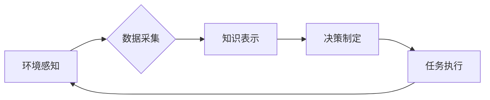

> AI代理，工作流，环境感知，数据采集，机器学习，深度学习，自然语言处理，计算机视觉

## 1. 背景介绍

在当今数据爆炸的时代，人工智能（AI）正以惊人的速度发展，并逐渐渗透到各个领域。其中，AI代理作为一种智能化的软件实体，能够自主地感知环境、做出决策并执行任务，在自动化、智能化应用中展现出巨大的潜力。

AI代理的工作流通常包括以下几个关键步骤：

1. **环境感知:** 代理需要感知其周围环境，收集相关信息。
2. **数据采集:** 代理需要从环境中采集数据，并将其转换为可理解的形式。
3. **知识表示:** 代理需要将采集到的数据进行处理和分析，构建知识表示。
4. **决策制定:** 代理根据环境信息和知识表示，制定相应的行动计划。
5. **任务执行:** 代理执行决策计划，并与环境进行交互。

环境感知和数据采集是AI代理工作流的基础，直接影响着代理的智能性和有效性。

## 2. 核心概念与联系

**2.1 AI代理**

AI代理是一种能够自主地感知环境、做出决策并执行任务的智能软件实体。它可以是独立运行的程序，也可以是嵌入在其他系统中的组件。

**2.2 工作流**

工作流是指一系列相互关联的活动或任务，按照特定的顺序执行，以实现某个目标。AI代理的工作流通常是一个循环过程，包括环境感知、数据采集、知识表示、决策制定和任务执行等步骤。

**2.3 环境感知**

环境感知是指代理通过传感器或其他方式获取其周围环境的信息。环境信息可以是物理信息（如温度、湿度、位置等）、社会信息（如用户行为、社交关系等）或其他类型的信息。

**2.4 数据采集**

数据采集是指代理从环境中收集相关信息的过程。数据采集的方式可以是主动的（如传感器扫描）、被动的（如日志记录）或混合的。

**2.5 联系**

环境感知和数据采集是AI代理工作流的基础。代理需要通过环境感知获取信息，并通过数据采集将信息转换为可理解的形式。这些信息将用于代理的知识表示、决策制定和任务执行。

**Mermaid 流程图**



## 3. 核心算法原理 & 具体操作步骤

### 3.1  算法原理概述

环境感知和数据采集的算法原理主要基于以下几个方面：

* **传感器技术:** 利用各种传感器收集环境信息，例如摄像头、麦克风、激光雷达等。
* **信号处理:** 对采集到的原始数据进行处理，提取有用的信息，例如图像识别、语音识别等。
* **机器学习:** 利用机器学习算法，从数据中学习环境模式和规律，例如分类、回归、聚类等。
* **深度学习:** 利用深度神经网络，对复杂环境数据进行更深入的分析和理解，例如图像识别、自然语言处理等。

### 3.2  算法步骤详解

**环境感知算法步骤:**

1. **选择合适的传感器:** 根据需要感知的环境信息，选择合适的传感器。
2. **数据采集:** 利用传感器采集环境数据。
3. **数据预处理:** 对采集到的数据进行预处理，例如去除噪声、进行数据转换等。
4. **特征提取:** 从预处理后的数据中提取有用的特征。
5. **环境建模:** 利用提取的特征构建环境模型，例如地图、三维模型等。

**数据采集算法步骤:**

1. **确定数据类型:** 根据需要采集的数据类型，选择合适的采集方式。
2. **数据采集:** 利用选定的采集方式，从环境中采集数据。
3. **数据存储:** 将采集到的数据存储到数据库或文件系统中。
4. **数据清洗:** 对采集到的数据进行清洗，例如去除重复数据、错误数据等。
5. **数据格式转换:** 将数据转换为代理可理解的格式。

### 3.3  算法优缺点

**环境感知算法:**

* **优点:** 可以获取丰富的环境信息，提高代理的感知能力。
* **缺点:** 传感器成本高，数据处理复杂，易受环境干扰。

**数据采集算法:**

* **优点:** 可以收集大量的数据，为代理的学习和决策提供支持。
* **缺点:** 数据采集成本高，数据质量难以保证，数据存储和管理难度大。

### 3.4  算法应用领域

环境感知和数据采集算法广泛应用于以下领域:

* **机器人:** 帮助机器人感知周围环境，导航、避障、抓取物体等。
* **自动驾驶:** 帮助自动驾驶汽车感知道路环境，识别交通信号灯、行人、车辆等。
* **智能家居:** 帮助智能家居设备感知用户需求，自动调节灯光、温度、音乐等。
* **医疗保健:** 帮助医疗设备感知患者状态，辅助医生诊断和治疗。

## 4. 数学模型和公式 & 详细讲解 & 举例说明

### 4.1  数学模型构建

环境感知和数据采集可以抽象为一个数学模型，其中：

* **输入:** 环境信息，例如传感器数据、图像、文本等。
* **输出:** 代理可理解的知识表示，例如地图、三维模型、语义网络等。
* **模型参数:** 算法参数，例如学习率、网络结构等。

### 4.2  公式推导过程

环境感知和数据采集算法的具体公式推导过程取决于具体的算法和应用场景。例如，图像识别算法通常会使用卷积神经网络，其损失函数为交叉熵损失函数。

$$
L = -\sum_{i=1}^{N} y_i \log(\hat{y}_i)
$$

其中：

* $L$ 为损失函数
* $N$ 为样本数量
* $y_i$ 为真实标签
* $\hat{y}_i$ 为预测标签

### 4.3  案例分析与讲解

**案例:** 利用深度学习算法进行图像识别

**步骤:**

1. 收集大量图像数据，并进行标注。
2. 使用卷积神经网络构建图像识别模型。
3. 利用训练数据训练模型，并调整模型参数。
4. 使用测试数据评估模型性能。

**结果:** 模型能够识别出不同类型的物体，例如猫、狗、车等。

## 5. 项目实践：代码实例和详细解释说明

### 5.1  开发环境搭建

* 操作系统: Ubuntu 20.04
* Python 版本: 3.8
* 必要的库: TensorFlow, OpenCV, NumPy

### 5.2  源代码详细实现

```python
import tensorflow as tf
from tensorflow.keras.models import Sequential
from tensorflow.keras.layers import Conv2D, MaxPooling2D, Flatten, Dense

# 定义图像识别模型
model = Sequential()
model.add(Conv2D(32, (3, 3), activation='relu', input_shape=(28, 28, 1)))
model.add(MaxPooling2D((2, 2)))
model.add(Conv2D(64, (3, 3), activation='relu'))
model.add(MaxPooling2D((2, 2)))
model.add(Flatten())
model.add(Dense(10, activation='softmax'))

# 编译模型
model.compile(optimizer='adam',
              loss='sparse_categorical_crossentropy',
              metrics=['accuracy'])

# 训练模型
model.fit(x_train, y_train, epochs=10)

# 评估模型
loss, accuracy = model.evaluate(x_test, y_test)
print('Test loss:', loss)
print('Test accuracy:', accuracy)
```

### 5.3  代码解读与分析

* 代码首先定义了一个卷积神经网络模型，包含卷积层、池化层、全连接层等。
* 然后，模型被编译，指定了优化器、损失函数和评价指标。
* 接着，模型使用训练数据进行训练，训练过程会不断调整模型参数，以降低损失函数的值。
* 最后，模型使用测试数据进行评估，计算模型的准确率。

### 5.4  运行结果展示

运行代码后，会输出模型的训练过程和测试结果，例如训练损失、测试损失、训练准确率、测试准确率等。

## 6. 实际应用场景

### 6.1  智能家居

AI代理可以感知用户的行为和需求，例如通过摄像头识别用户的动作，通过麦克风识别用户的语音指令，从而自动调节灯光、温度、音乐等，提供更加智能化的家居体验。

### 6.2  医疗保健

AI代理可以帮助医生诊断和治疗疾病。例如，可以利用图像识别技术识别病灶，利用自然语言处理技术分析患者病历，提供辅助诊断建议。

### 6.3  自动驾驶

AI代理可以帮助自动驾驶汽车感知道路环境，识别交通信号灯、行人、车辆等，从而实现自动驾驶功能。

### 6.4  未来应用展望

随着人工智能技术的不断发展，AI代理的工作流将应用于越来越多的领域，例如教育、金融、娱乐等。未来，AI代理将更加智能化、个性化、协作化，为人类社会带来更多便利和价值。

## 7. 工具和资源推荐

### 7.1  学习资源推荐

* **书籍:**
    * 《深度学习》
    * 《机器学习》
    * 《人工智能：现代方法》
* **在线课程:**
    * Coursera
    * edX
    * Udacity

### 7.2  开发工具推荐

* **Python:** 
    * TensorFlow
    * PyTorch
    * Keras
* **C++:**
    * OpenCV
    * ROS

### 7.3  相关论文推荐

* **环境感知:**
    * "A Survey on Environmental Perception for Autonomous Driving"
    * "Deep Learning for Environmental Perception in Robotics"
* **数据采集:**
    * "Data Collection and Management for AI Applications"
    * "A Survey on Data Acquisition Techniques for Internet of Things"

## 8. 总结：未来发展趋势与挑战

### 8.1  研究成果总结

环境感知和数据采集是AI代理工作流的基础，近年来取得了显著进展。深度学习算法在图像识别、语音识别等领域取得了突破性进展，为AI代理提供了更强大的感知和数据处理能力。

### 8.2  未来发展趋势

* **更智能的感知:** 利用更先进的传感器和算法，实现更精准、更全面的环境感知。
* **更有效的采集:** 利用大数据分析和机器学习，提高数据采集效率和准确性。
* **更强大的推理:** 利用更强大的计算能力和算法，实现更复杂的知识表示和决策制定。
* **更广泛的应用:** AI代理将应用于更多领域，例如教育、金融、娱乐等。

### 8.3  面临的挑战

* **数据安全和隐私:** AI代理需要收集和处理大量数据，如何保证数据安全和隐私是一个重要的挑战。
* **算法可解释性:** 深度学习算法的决策过程难以解释，如何提高算法的可解释性是一个重要的研究方向。
* **伦理问题:** AI代理的决策可能会影响人类社会，如何避免AI代理带来的伦理问题是一个重要的议题。

### 8.4  研究展望

未来，我们将继续致力于环境感知和数据采集算法的研究，推动AI代理技术的发展，为人类社会创造更多价值。

## 9. 附录：常见问题与解答

**Q1: 如何选择合适的传感器？**

A1: 选择传感器需要根据需要感知的环境信息和应用场景。例如，如果需要感知物体的位置，可以使用激光雷达；如果需要感知物体的颜色，可以使用摄像头。

**Q2: 如何处理采集到的数据？**

A2: 数据处理包括数据预处理、特征提取、数据存储等步骤。数据预处理可以去除