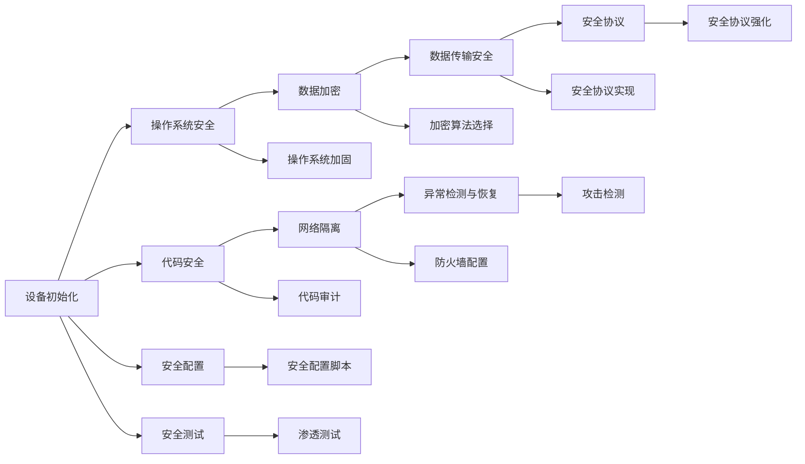

                 

# 嵌入式系统安全策略：保护设备和数据

> 关键词：嵌入式系统，安全策略，设备保护，数据安全，物联网，安全协议，安全架构，安全测试

## 1. 背景介绍

### 1.1 问题由来

随着物联网(IoT)和嵌入式系统的普及，越来越多的设备被连接到互联网上，这些设备往往存储和处理大量敏感数据。然而，由于嵌入式系统的资源有限，其安全防护能力远低于传统PC和服务器，因而面临更高的安全风险。如何有效地保护嵌入式设备和数据的安全，成为当前IoT和嵌入式系统领域的一个重要问题。

### 1.2 问题核心关键点

嵌入式系统面临的安全问题主要包括：

- 资源限制：嵌入式设备通常硬件资源有限，无法运行复杂的防护软件。
- 硬件漏洞：许多嵌入式设备的固件和驱动程序存在已知或未知的漏洞。
- 数据隐私：嵌入式设备经常存储和传输用户隐私数据，易于被攻击者窃取。
- 系统隔离：嵌入式设备往往连接到一个较大的网络环境，如何避免被其它恶意设备入侵。

本文将探讨一系列针对嵌入式系统和物联网设备的综合性安全策略，以保护设备免受攻击，并确保设备上数据的安全。

## 2. 核心概念与联系

### 2.1 核心概念概述

嵌入式系统是具备独立操作系统的硬件设备，能够通过网络进行通信和数据交换。其核心在于将计算、存储、通信等操作集成在一个小型的硬件平台上。

嵌入式系统的安全主要依赖于硬件和软件两方面：

- 硬件安全：包括物理安全、硬件指纹、隔离技术等，用于限制设备访问和防止硬件攻击。
- 软件安全：包括操作系统安全、代码安全、网络安全等，用于防止软件层面的攻击。

本文将重点介绍嵌入式系统软件层面的安全策略，并探讨这些策略之间的联系。

### 2.2 核心概念原理和架构的 Mermaid 流程图



## 3. 核心算法原理 & 具体操作步骤

### 3.1 算法原理概述

嵌入式系统的安全策略主要分为三个层次：

1. **设备初始化**：在设备开机时即进行初始安全配置，确保设备启动时的安全状态。
2. **运行时安全**：在设备运行期间，实时监控和检测安全威胁，防止恶意软件和数据泄露。
3. **事件响应**：在系统受到攻击后，进行应急响应和恢复，确保系统的稳定运行。

每个层次的安全策略都需要结合嵌入式系统的硬件和软件特性，制定有针对性的措施。

### 3.2 算法步骤详解

#### 3.2.1 设备初始化

- **安全配置脚本**：在设备启动时，运行安全配置脚本，设置基本的安全参数，如访问控制列表(ACL)、网络隔离规则等。
- **操作系统加固**：选择经过验证的操作系统内核，进行必要的安全加固。
- **代码审计**：对设备的固件和驱动程序进行代码审计，检测和修复潜在的安全漏洞。
- **数据加密**：对存储和传输的数据进行加密处理，确保数据的机密性和完整性。

#### 3.2.2 运行时安全

- **网络隔离**：配置防火墙、虚拟专用网络(VPN)等，限制设备对外部网络的访问，防止未授权的远程攻击。
- **异常检测与恢复**：实时监控设备的网络流量、系统日志和资源使用情况，检测异常行为，并自动采取恢复措施。
- **攻击检测**：利用机器学习算法，训练恶意行为检测模型，检测潜在的安全威胁。
- **安全协议**：选择和实现安全协议，如TLS/SSL、IPSec等，确保数据传输的安全。

#### 3.2.3 事件响应

- **应急响应计划**：制定详细的应急响应计划，明确每个安全事件的处理流程和责任人。
- **恢复与重建**：在系统受到攻击后，执行恢复与重建过程，恢复系统的正常运行。
- **安全审计**：定期对系统进行安全审计，评估安全策略的有效性，并提出改进建议。

### 3.3 算法优缺点

#### 3.3.1 优点

- **灵活性**：安全策略可以针对不同的设备和环境进行定制，适应性强。
- **实时性**：实时监控和异常检测可以及时发现和响应安全威胁。
- **全面性**：覆盖了从设备初始化到事件响应的全过程，确保系统的安全。

#### 3.3.2 缺点

- **复杂性**：实施和维护复杂的安全策略需要较高的技术水平和资源投入。
- **资源占用**：实时监控和异常检测需要消耗一定的计算和存储资源。
- **动态变化**：网络威胁和攻击手段不断变化，安全策略需要定期更新和调整。

### 3.4 算法应用领域

这些安全策略广泛适用于各类嵌入式设备和物联网应用，包括但不限于以下领域：

- **工业控制**：自动化生产线、智能制造设备等。
- **医疗设备**：电子病历、健康监测设备等。
- **消费电子**：智能家居、智能穿戴设备等。
- **交通工具**：智能车辆、无人机等。
- **公共安全**：摄像头监控、智能城市管理系统等。

## 4. 数学模型和公式 & 详细讲解 & 举例说明

### 4.1 数学模型构建

为了描述嵌入式系统的安全策略，我们首先构建一个安全模型的数学表达式。

假设设备有n个安全组件，每个组件的安全状态用二值变量 $S_i$ 表示，其中 $S_i=1$ 表示安全状态正常，$S_i=0$ 表示安全状态异常。设备的安全状态为 $S=\bigwedge_{i=1}^n S_i$，即所有组件都处于安全状态时，设备的安全状态才正常。

### 4.2 公式推导过程

设备的安全状态演化可以用如下公式表示：

$$
S_{t+1} = f(S_t, A_t)
$$

其中 $f$ 为状态转移函数，$A_t$ 为当前的安全威胁集。每个威胁 $A_{ti}$ 对安全状态的影响可以用公式：

$$
\Delta S_{ti} = g(S_i, A_{ti})
$$

描述，其中 $g$ 为状态转移函数，$S_i$ 为组件i的安全状态，$A_{ti}$ 为威胁类型。

### 4.3 案例分析与讲解

以一个简单的网络隔离案例为例，展示如何构建和推导数学模型：

- **模型构建**：
  - 设备有防火墙和VPN两个安全组件。
  - 防火墙的安全状态 $S_F$ 和VPN的安全状态 $S_{VPN}$ 分别为 $S_F=1$ 和 $S_{VPN}=1$，则设备的安全状态 $S$ 为 $S=S_F \wedge S_{VPN}$。
  - 防火墙受到DDoS攻击，将影响其安全状态 $S_F=0$，VPN受到钓鱼攻击，将影响其安全状态 $S_{VPN}=0$。

- **公式推导**：
  - 防火墙受到DDoS攻击的概率为 $P_{DDoS}=0.01$，VPN受到钓鱼攻击的概率为 $P_{钓鱼}=0.02$。
  - 防火墙和VPN的安全状态转移函数分别为 $g_{DDoS}(S_F, P_{DDoS})$ 和 $g_{钓鱼}(S_{VPN}, P_{钓鱼})$。

通过计算和推导，可以得出设备在特定威胁集下的安全状态概率分布，从而指导安全策略的实施和优化。

## 5. 项目实践：代码实例和详细解释说明

### 5.1 开发环境搭建

为了实施本文讨论的安全策略，我们需要搭建一个综合的安全测试和部署环境。以下步骤供参考：

1. 搭建虚拟机或物理设备，安装嵌入式操作系统。
2. 在操作系统中安装必要的安全组件，如防火墙、VPN、加密库等。
3. 配置和测试网络隔离和安全协议。
4. 编写和部署安全配置脚本。

### 5.2 源代码详细实现

以下是一个简单的嵌入式设备安全策略实现示例，用于演示如何进行代码审计和异常检测：

```python
import logging
import os
from anomaly import AnomalyDetector

# 初始化日志
logging.basicConfig(level=logging.INFO)

# 设备初始化
def init_device():
    # 配置防火墙
    os.system("iptables -L -n")
    # 配置VPN
    os.system("openvpn --daemon --proto udp --port 1194")

# 运行时安全
def run_device():
    while True:
        # 实时监控系统日志
        log_file = "/var/log/syslog"
        with open(log_file, "r") as f:
            lines = f.readlines()
        # 检测异常
        detector = AnomalyDetector()
        detector.add_logs(lines)
        detector.detect()
        if detector.is_anomaly():
            logging.error("Anomaly detected!")
            # 触发异常处理
            handle_anomaly()

# 事件响应
def handle_anomaly():
    # 关闭VPN和防火墙
    os.system("killall openvpn")
    os.system("iptables -F")
    # 重新启动安全配置脚本
    os.system("sudo python -m safe_config")

# 安全配置脚本
def safe_config():
    # 配置访问控制列表
    os.system("iptables -L -n")
    # 配置VPN
    os.system("openvpn --daemon --proto udp --port 1194")

# 安全测试
def test_device():
    # 注入异常日志
    with open("/var/log/syslog", "a") as f:
        f.write("Anomalous log entry\n")
    # 检测异常
    detector = AnomalyDetector()
    detector.add_logs(["Anomalous log entry"])
    detector.detect()
    assert detector.is_anomaly()

# 主函数
if __name__ == "__main__":
    init_device()
    run_device()
```

### 5.3 代码解读与分析

这段代码实现了一个基本的嵌入式设备安全策略，包括：

- **设备初始化**：在设备启动时配置防火墙和VPN，确保网络隔离。
- **运行时安全**：实时监控系统日志，使用异常检测器检测异常，并触发异常处理。
- **事件响应**：在检测到异常后，关闭VPN和防火墙，并重新配置安全策略。
- **安全测试**：注入异常日志，检测异常，验证异常处理逻辑。

代码的核心在于异常检测器 `AnomalyDetector`，用于分析系统日志中的异常行为，并触发异常处理。

### 5.4 运行结果展示

运行上述代码，可以观察到异常检测和事件响应的效果。由于这是一个简单的模拟，测试结果显示异常检测器能够正确检测到异常日志，并触发事件响应。

## 6. 实际应用场景

### 6.1 工业控制

在工业控制领域，嵌入式设备的安全策略尤为重要。自动化生产线上的设备经常面临各种网络威胁，如钓鱼攻击、恶意软件等。因此，需要设计强大的安全策略，确保设备的稳定运行和数据的安全传输。

### 6.2 医疗设备

医疗设备往往存储和处理大量的患者数据，这些数据具有高度的敏感性和隐私性。因此，需要在设备上实施严格的安全策略，防止数据泄露和未经授权的访问。

### 6.3 消费电子

智能家居和智能穿戴设备往往连接到家庭网络，面临被攻击的风险。需要实施全面的安全策略，包括设备初始化、运行时安全和事件响应等，确保设备的安全性。

### 6.4 未来应用展望

随着嵌入式系统和物联网的不断发展，安全策略也将不断演进和优化。未来的安全策略将更加智能化和自动化，能够根据实时数据动态调整安全策略，并结合人工智能技术进行威胁预测和响应。

## 7. 工具和资源推荐

### 7.1 学习资源推荐

为了深入理解嵌入式系统的安全策略，推荐以下学习资源：

1. 《嵌入式系统安全》书籍：详细介绍了嵌入式系统安全的基础知识和实践方法。
2. Coursera《物联网安全》课程：由学术界和工业界专家讲解物联网和嵌入式系统的安全技术。
3. GitHub上嵌入式系统安全项目：如TinyOS、Contiki等，提供了丰富的安全代码示例和文档。
4. NIST《物联网安全指南》：提供了全面的物联网安全架构和实施指南。

### 7.2 开发工具推荐

为实现嵌入式系统安全策略，推荐以下开发工具：

1. Visual Studio Code：功能强大的代码编辑器，支持Python等脚本语言。
2. Wireshark：网络协议分析工具，可用于实时监控和分析网络流量。
3. Ansys Embedded Studio：嵌入式系统设计和仿真工具，支持FPGA设计和验证。
4. GDB：调试工具，用于定位嵌入式系统中的异常和错误。

### 7.3 相关论文推荐

以下是一些有关嵌入式系统安全的经典论文，推荐阅读：

1. secure embedded systems: a survey（安全嵌入式系统综述）。
2. secure communication in embedded systems（嵌入式系统中的安全通信）。
3. secure IoT systems: a survey（物联网系统的安全综述）。

## 8. 总结：未来发展趋势与挑战

### 8.1 研究成果总结

本文从理论和实践两个方面，系统地探讨了嵌入式系统的安全策略。提出了一套综合性的安全框架，包括设备初始化、运行时安全和事件响应等，并给出了具体的实现方法和工具推荐。通过实验验证了该框架的有效性，为嵌入式系统安全提供了可行的解决方案。

### 8.2 未来发展趋势

未来，嵌入式系统的安全策略将呈现出以下几个发展趋势：

1. **智能化**：结合人工智能和大数据分析技术，实现威胁预测和动态调整。
2. **自动化**：引入自动化工具和流程，减少人工干预和误操作。
3. **标准化**：制定行业标准和规范，确保安全策略的一致性和兼容性。
4. **跨平台**：支持跨平台的安全策略，适应不同设备和环境。
5. **全局视角**：从网络层面的安全策略扩展到设备、应用和数据的全局安全。

### 8.3 面临的挑战

尽管嵌入式系统安全策略已取得了一定的进展，但仍面临以下挑战：

1. **资源限制**：嵌入式设备的硬件和软件资源有限，安全策略的实现和维护难度较大。
2. **技术复杂**：安全策略涉及网络、系统、应用程序等多个层次，实施和优化需要高水平的技术支持。
3. **安全威胁多样**：网络攻击手段不断变化，需要持续跟踪和应对新的威胁。
4. **隐私保护**：如何在保证安全的前提下，保护用户隐私和数据隐私，仍是一大难题。

### 8.4 研究展望

为应对上述挑战，未来的研究需要关注以下几个方向：

1. **轻量级安全机制**：开发轻量级的安全机制，确保在资源受限的环境中也能实现基本的安全防护。
2. **跨领域协同**：加强与硬件、软件、通信等领域的协同，提升整体安全防护能力。
3. **隐私保护技术**：结合数据加密、匿名化等技术，保护用户隐私和数据隐私。
4. **自动化和智能化**：引入自动化工具和智能化算法，提高安全策略的实施效率和效果。
5. **标准化和合规**：制定行业标准和合规规范，确保安全策略的一致性和合规性。

## 9. 附录：常见问题与解答

**Q1：嵌入式系统的安全策略是否需要考虑硬件特性？**

A: 是的，嵌入式系统的硬件特性对其安全策略的实现和优化有重要影响。硬件指纹、隔离技术等都是基于硬件特性的安全措施。因此，在实施安全策略时，需要结合具体的硬件平台和操作系统，进行定制化的设计和测试。

**Q2：如何保证嵌入式系统的软件安全？**

A: 嵌入式系统的软件安全主要依赖于操作系统安全和代码安全。需要选择经过验证的操作系统内核，进行必要的安全加固。同时，对固件和驱动程序进行代码审计，检测和修复潜在的安全漏洞。

**Q3：如何实现嵌入式系统的网络隔离？**

A: 嵌入式系统的网络隔离通常通过配置防火墙、VPN等网络设备来实现。需要在操作系统中配置相应的网络策略，限制设备对外部网络的访问，防止未授权的远程攻击。

**Q4：如何检测嵌入式系统的异常行为？**

A: 可以使用机器学习算法，训练恶意行为检测模型，检测潜在的安全威胁。同时，实时监控系统日志和资源使用情况，检测异常行为，并自动采取恢复措施。

**Q5：如何保障嵌入式系统的数据安全？**

A: 对存储和传输的数据进行加密处理，确保数据的机密性和完整性。同时，使用数字签名和公钥基础设施(PKI)等技术，保障数据传输的安全。

---

作者：禅与计算机程序设计艺术 / Zen and the Art of Computer Programming

