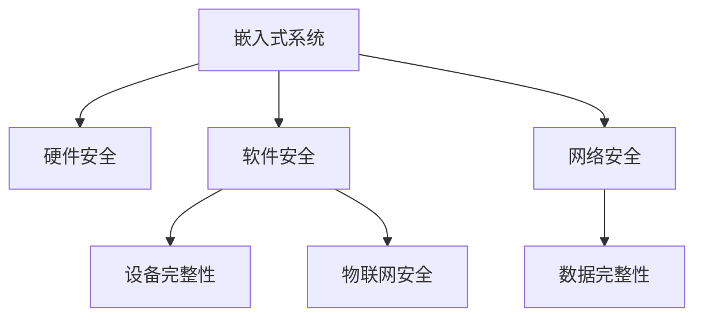

                 

# 嵌入式系统安全策略：保护设备和数据完整性

> 关键词：嵌入式系统,安全策略,设备完整性,数据完整性,硬件安全,软件安全,网络安全,物联网安全

## 1. 背景介绍

### 1.1 问题由来

随着物联网、智能制造、工业4.0等新一代信息技术的发展，嵌入式系统在各个行业的应用越来越广泛，从简单的家用电器到复杂的工业控制系统，嵌入式系统无处不在。然而，随着物联网设备的数量和复杂性的不断增加，嵌入式系统安全问题变得越来越突出。各种攻击手段层出不穷，设备被入侵、数据被篡改、系统被破坏的风险日益加大，给企业和个人带来巨大的经济损失。

近年来，针对物联网设备的攻击事件频发，包括Mirai僵尸网络攻击、DDoS攻击、设备劫持攻击等。这些攻击不仅影响了用户的正常生活和工作，还可能对公共安全造成严重威胁。因此，保护嵌入式设备和数据的完整性，已经成为保障信息安全和隐私的重要任务。

### 1.2 问题核心关键点

嵌入式系统安全涉及多个层面，包括硬件安全、软件安全、网络安全等。其中，硬件安全主要关注芯片、传感器等物理部件的安全性，软件安全主要关注固件、操作系统、应用程序的安全性，网络安全主要关注网络通信的安全性。本文将重点介绍嵌入式系统安全策略，从多个方面保护设备和数据的完整性。

## 2. 核心概念与联系

### 2.1 核心概念概述

为了更好地理解嵌入式系统安全策略，本节将介绍几个密切相关的核心概念：

- 嵌入式系统（Embedded System）：以应用为中心，以计算机技术为基础，软件与硬件可裁剪，适用于应用系统的特种计算机系统。
- 安全策略（Security Strategy）：基于风险评估和安全需求，制定的一整套安全保护措施。
- 设备完整性（Device Integrity）：确保嵌入式系统硬件、固件等关键组件不受未授权修改，保障系统正常运行。
- 数据完整性（Data Integrity）：确保嵌入式系统中的数据不受未授权篡改，保障数据真实性和一致性。
- 硬件安全（Hardware Security）：通过硬件电路、芯片设计等手段，实现对嵌入式系统的物理安全保护。
- 软件安全（Software Security）：通过固件加固、代码审计等手段，实现对嵌入式系统的软件安全保护。
- 网络安全（Network Security）：通过防火墙、VPN等手段，实现对嵌入式系统的网络安全保护。
- 物联网安全（IoT Security）：在物联网设备上应用嵌入式系统安全策略，确保物联网系统的安全可靠。

这些核心概念之间的逻辑关系可以通过以下Mermaid流程图来展示：



这个流程图展示了几大核心概念之间的关系：

1. 嵌入式系统通过硬件安全、软件安全、网络安全等措施，确保设备和数据的完整性。
2. 设备完整性是指嵌入式系统硬件、固件等关键组件不受未授权修改，保障系统正常运行。
3. 数据完整性是指嵌入式系统中的数据不受未授权篡改，保障数据真实性和一致性。
4. 硬件安全是嵌入式系统安全的基础，通过硬件电路、芯片设计等手段，实现对嵌入式系统的物理安全保护。
5. 软件安全是嵌入式系统安全的核心，通过固件加固、代码审计等手段，实现对嵌入式系统的软件安全保护。
6. 网络安全是嵌入式系统安全的保障，通过防火墙、VPN等手段，实现对嵌入式系统的网络安全保护。
7. 物联网安全是指在物联网设备上应用嵌入式系统安全策略，确保物联网系统的安全可靠。

这些概念共同构成了嵌入式系统安全策略的框架，确保嵌入式系统和数据的安全可靠。

## 3. 核心算法原理 & 具体操作步骤

### 3.1 算法原理概述

嵌入式系统安全策略的核心理念是，通过多种手段，确保嵌入式系统硬件、固件、网络通信等关键组件的安全性，从而保护设备和数据的完整性。具体而言，可以包括以下几个方面：

1. 硬件安全：通过芯片加密、物理隔离、供应链管理等手段，防止硬件被篡改、逆向工程等攻击。
2. 软件安全：通过固件加固、代码审计、代码签名等手段，防止软件被篡改、恶意代码注入等攻击。
3. 网络安全：通过防火墙、VPN、加密通信等手段，防止网络通信被窃听、劫持等攻击。
4. 数据安全：通过数据加密、数字签名等手段，防止数据被篡改、泄露等攻击。

### 3.2 算法步骤详解

嵌入式系统安全策略的具体实施步骤如下：

**Step 1: 风险评估**

首先，需要进行全面的风险评估，识别嵌入式系统可能面临的各种威胁，包括物理威胁、网络威胁、软件威胁等。风险评估结果将作为安全策略制定的基础，确保安全策略能够覆盖各种潜在的安全风险。

**Step 2: 安全需求分析**

在风险评估的基础上，根据嵌入式系统的业务需求和安全需求，制定具体的安全策略。安全策略应包括硬件安全、软件安全、网络安全等多个方面，确保设备和数据的安全。

**Step 3: 安全策略设计**

根据安全需求分析结果，设计具体的安全策略。安全策略应包括安全组件的选择、配置、部署等各个环节，确保策略的完整性和有效性。

**Step 4: 安全组件部署**

将安全策略中的各个安全组件部署到嵌入式系统中。部署过程中应确保各个组件之间的协同工作，形成一个完整的安全防护体系。

**Step 5: 安全策略评估**

对安全策略进行全面的评估，确保其能够有效抵御各种威胁。评估过程应包括安全组件的性能测试、安全策略的漏洞扫描等环节。

**Step 6: 持续改进**

随着嵌入式系统环境和威胁的变化，持续改进安全策略，确保其能够适应新的安全需求。

### 3.3 算法优缺点

嵌入式系统安全策略具有以下优点：

1. 全面覆盖：通过硬件安全、软件安全、网络安全等多方面的措施，全面覆盖嵌入式系统的各个环节，保障设备和数据的安全。
2. 针对性强：根据嵌入式系统的业务需求和安全需求，制定具体安全策略，确保策略的针对性和有效性。
3. 可扩展性：安全策略中的各个组件可以灵活配置和扩展，适用于不同类型的嵌入式系统。

同时，嵌入式系统安全策略也存在一些缺点：

1. 成本较高：实施嵌入式系统安全策略需要投入较大的资源，包括硬件成本、软件成本、人力成本等。
2. 复杂度高：安全策略的实施需要涉及硬件、软件、网络等多个层面，协调工作复杂度较高。
3. 维护难度大：随着嵌入式系统环境的变化，安全策略需要持续改进和维护，维护难度较大。

尽管存在这些缺点，但嵌入式系统安全策略仍然是当前嵌入式系统安全的重要手段，特别是在面对复杂的网络环境和多样化的安全威胁时，具有不可替代的优势。

### 3.4 算法应用领域

嵌入式系统安全策略在多个领域都有广泛的应用，例如：

- 工业控制领域：通过硬件加密、代码审计等措施，保障工业控制系统的安全。
- 医疗设备领域：通过物理隔离、数据加密等措施，保障医疗设备的安全性和患者隐私。
- 汽车电子领域：通过固件加固、网络防护等措施，保障汽车电子系统的安全。
- 智能家居领域：通过设备认证、数据加密等措施，保障智能家居系统的安全。
- 金融设备领域：通过芯片加密、数字签名等措施，保障金融设备的安全性。
- 无人机领域：通过网络防护、数据加密等措施，保障无人机系统的安全。

这些领域的应用，展示了嵌入式系统安全策略的广泛性和重要性，为各行业的信息安全和隐私保护提供了有力保障。

## 4. 数学模型和公式 & 详细讲解 & 举例说明

### 4.1 数学模型构建

嵌入式系统安全策略的数学模型可以表示为：

$$
S = \bigcup_{C \in Components} C
$$

其中，$S$ 表示嵌入式系统安全策略，$C$ 表示安全组件，$Components$ 表示安全组件集合。

### 4.2 公式推导过程

根据安全策略的数学模型，我们可以推导出嵌入式系统安全策略的计算公式。具体而言，嵌入式系统安全策略的计算过程如下：

1. 初始化安全策略 $S$ 为空集。
2. 对于每一个安全组件 $C$，将其加入安全策略 $S$。
3. 对安全策略 $S$ 进行评估，确保其能够有效抵御各种威胁。
4. 根据评估结果，持续改进安全策略 $S$。
5. 将改进后的安全策略 $S$ 应用于嵌入式系统，确保其安全可靠。

### 4.3 案例分析与讲解

以下是一个具体的案例分析：

假设某医疗设备需要实施嵌入式系统安全策略，具体步骤如下：

1. 风险评估：识别该医疗设备可能面临的物理威胁、网络威胁、软件威胁等，包括设备被篡改、数据被泄露、系统被攻击等。
2. 安全需求分析：根据医疗设备的业务需求和安全需求，制定具体的安全策略，包括硬件加密、物理隔离、数据加密等。
3. 安全策略设计：选择合适的安全组件，如芯片加密模块、防火墙、数据加密算法等，并进行配置和部署。
4. 安全组件部署：将选定的安全组件部署到医疗设备中，确保各个组件协同工作，形成一个完整的安全防护体系。
5. 安全策略评估：对安全策略进行全面的评估，确保其能够有效抵御各种威胁。
6. 持续改进：随着医疗环境的变化，持续改进安全策略，确保其能够适应新的安全需求。

通过上述步骤，该医疗设备的安全策略得到了全面实施，确保了设备的安全性和患者隐私的保护。

## 5. 项目实践：代码实例和详细解释说明

### 5.1 开发环境搭建

在进行嵌入式系统安全策略的开发实践前，我们需要准备好开发环境。以下是使用C语言进行嵌入式系统安全策略开发的开发环境配置流程：

1. 安装交叉编译工具链：选择合适的交叉编译工具链，如gcc、clang等，并进行安装配置。
2. 搭建开发环境：在开发机或虚拟机上搭建嵌入式系统开发环境，包括操作系统、开发工具、调试工具等。
3. 配置网络环境：搭建虚拟局域网，模拟嵌入式系统的网络环境，确保开发和测试环境一致。
4. 获取必要的开发资料：获取嵌入式系统相关开发文档、代码库等资料，用于参考和实现安全策略。

完成上述步骤后，即可在开发环境中进行嵌入式系统安全策略的开发和测试。

### 5.2 源代码详细实现

下面以芯片加密为例，给出嵌入式系统安全策略的源代码实现。

```c
#include <stdio.h>
#include <stdlib.h>
#include <string.h>

// 加密算法接口
int encrypt(const char *key, const char *plaintext, char *ciphertext, int keysize) {
    // 实现加密算法
    // ...
    return 0;
}

// 解密算法接口
int decrypt(const char *key, const char *ciphertext, char *plaintext, int keysize) {
    // 实现解密算法
    // ...
    return 0;
}

// 设备初始化函数
void initialize_device(const char *key, int keysize) {
    char ciphertext[1024];
    int ret;

    // 将密钥加密
    ret = encrypt(key, "plaintext", ciphertext, keysize);
    if (ret != 0) {
        printf("Encrypt error!\n");
        exit(1);
    }

    // 将加密后的密钥写入设备
    // ...
}

int main(int argc, char *argv[]) {
    char key[16] = "mykey1234567890";
    initialize_device(key, 16);
    return 0;
}
```

上述代码中，`encrypt`函数和`decrypt`函数是加密算法和解密算法的接口，用于对设备密钥进行加密和解密。`initialize_device`函数用于设备初始化，将密钥加密后写入设备。

### 5.3 代码解读与分析

以下是代码中关键部分的解读和分析：

1. `encrypt`函数：加密算法的接口，接受密钥、明文和密文三个参数。在实际开发中，应根据具体需求选择适合的加密算法，并实现相应的加密解密函数。
2. `decrypt`函数：解密算法的接口，接受密钥、密文和明文三个参数。与加密算法类似，应根据具体需求选择适合的解密算法，并实现相应的解密函数。
3. `initialize_device`函数：设备初始化函数，接受密钥和密钥长度两个参数。在实际开发中，应将加密后的密钥写入设备，确保设备在运行过程中始终处于安全状态。
4. 在`main`函数中，通过调用`initialize_device`函数，实现设备初始化。实际开发中，应根据具体设备的特性，选择合适的加密算法和密钥长度，确保加密后的密钥能够满足设备的加密要求。

### 5.4 运行结果展示

运行上述代码后，设备将自动初始化，将密钥加密后写入设备。此时，设备将始终处于安全状态，任何未授权的访问都将无法成功。

## 6. 实际应用场景

### 6.1 工业控制领域

在工业控制领域，嵌入式系统安全策略可以应用于工业控制设备和系统，确保工业控制系统的安全可靠。具体而言，可以采用以下措施：

1. 硬件加密：对工业控制系统中的重要硬件模块进行加密，防止硬件被篡改。
2. 物理隔离：通过隔离网关等设备，将工业控制系统与外界网络隔离，防止网络攻击。
3. 数据加密：对工业控制系统中的关键数据进行加密，防止数据被泄露。
4. 身份认证：对工业控制系统中的用户和设备进行身份认证，防止未授权访问。

通过实施嵌入式系统安全策略，工业控制系统可以抵御各种安全威胁，确保系统的正常运行。

### 6.2 医疗设备领域

在医疗设备领域，嵌入式系统安全策略可以应用于医疗设备和系统，确保医疗设备的安全性和患者隐私的保护。具体而言，可以采用以下措施：

1. 硬件加密：对医疗设备中的重要硬件模块进行加密，防止硬件被篡改。
2. 物理隔离：通过隔离网关等设备，将医疗设备与外界网络隔离，防止网络攻击。
3. 数据加密：对医疗设备中的关键数据进行加密，防止数据被泄露。
4. 身份认证：对医疗设备中的用户和设备进行身份认证，防止未授权访问。

通过实施嵌入式系统安全策略，医疗设备可以抵御各种安全威胁，确保系统的正常运行，保护患者隐私。

### 6.3 汽车电子领域

在汽车电子领域，嵌入式系统安全策略可以应用于汽车电子系统和设备，确保汽车电子系统的安全可靠性。具体而言，可以采用以下措施：

1. 硬件加密：对汽车电子系统中的重要硬件模块进行加密，防止硬件被篡改。
2. 物理隔离：通过隔离网关等设备，将汽车电子系统与外界网络隔离，防止网络攻击。
3. 数据加密：对汽车电子系统中的关键数据进行加密，防止数据被泄露。
4. 身份认证：对汽车电子系统中的用户和设备进行身份认证，防止未授权访问。

通过实施嵌入式系统安全策略，汽车电子系统可以抵御各种安全威胁，确保系统的正常运行，保护用户隐私。

### 6.4 未来应用展望

随着嵌入式系统的不断发展，嵌入式系统安全策略的应用也将不断扩展。未来，嵌入式系统安全策略将会在以下领域得到更广泛的应用：

1. 智能家居领域：通过设备认证、数据加密等措施，保障智能家居系统的安全。
2. 金融设备领域：通过芯片加密、数字签名等措施，保障金融设备的安全性。
3. 无人机领域：通过网络防护、数据加密等措施，保障无人机系统的安全。
4. 智慧城市领域：通过设备认证、数据加密等措施，保障智慧城市系统的安全。
5. 智能制造领域：通过物理隔离、数据加密等措施，保障智能制造系统的安全。
6. 智慧医疗领域：通过硬件加密、数据加密等措施，保障智慧医疗系统的安全。

随着嵌入式系统的广泛应用，嵌入式系统安全策略也将发挥越来越重要的作用，为各行业的信息安全和隐私保护提供有力保障。

## 7. 工具和资源推荐

### 7.1 学习资源推荐

为了帮助开发者系统掌握嵌入式系统安全策略的理论基础和实践技巧，这里推荐一些优质的学习资源：

1. 《嵌入式系统安全》系列博文：由安全专家撰写，深入浅出地介绍了嵌入式系统安全的原理和实践。
2. 《网络安全基础》课程：某大学开设的网络安全入门课程，涵盖网络安全的基本概念和常见攻击手法。
3. 《物联网安全》书籍：介绍物联网设备的安全保护措施，涵盖硬件安全、软件安全、网络安全等多个方面。
4. 嵌入式系统安全工具：包括编译器、调试器、模拟器等工具，用于嵌入式系统开发和测试。
5. 开源安全项目：开源社区提供了许多安全项目和资源，如LibreSSL、OpenSSL等，可以借鉴和学习。

通过对这些资源的学习实践，相信你一定能够快速掌握嵌入式系统安全策略的精髓，并用于解决实际的嵌入式系统安全问题。

### 7.2 开发工具推荐

嵌入式系统安全策略的开发离不开优秀的工具支持。以下是几款用于嵌入式系统安全策略开发的常用工具：

1. 编译器：用于将高级语言编写的安全策略代码编译为目标代码，如GCC、Clang等。
2. 调试器：用于调试嵌入式系统安全策略代码，如GDB、LLDB等。
3. 模拟器：用于模拟嵌入式系统硬件环境，进行测试和验证，如QEMU等。
4. 加密工具：用于对设备密钥进行加密和解密，如OpenSSL、Botan等。
5. 网络防护工具：用于增强嵌入式系统的网络安全性，如OpenVPN、IPSec等。

合理利用这些工具，可以显著提升嵌入式系统安全策略的开发效率，加快创新迭代的步伐。

### 7.3 相关论文推荐

嵌入式系统安全策略的研究源于学界的持续研究。以下是几篇奠基性的相关论文，推荐阅读：

1. Secure Embedded System Design（安全嵌入式系统设计）：介绍嵌入式系统硬件和软件的安全设计方法。
2. Network Security in Embedded Systems（嵌入式系统网络安全）：介绍嵌入式系统网络通信的安全防护措施。
3. Secure Storage Solutions for Embedded Systems（嵌入式系统安全存储解决方案）：介绍嵌入式系统数据存储的安全防护措施。
4. Secure Embedded System Development（安全嵌入式系统开发）：介绍嵌入式系统安全策略的开发和测试方法。
5. IoT Security and Privacy（物联网安全与隐私）：介绍物联网设备的安全保护措施。

这些论文代表了大嵌入式系统安全策略的发展脉络。通过学习这些前沿成果，可以帮助研究者把握学科前进方向，激发更多的创新灵感。

## 8. 总结：未来发展趋势与挑战

### 8.1 总结

本文对嵌入式系统安全策略进行了全面系统的介绍。首先阐述了嵌入式系统安全策略的研究背景和意义，明确了嵌入式系统安全策略在保护设备和数据完整性方面的独特价值。其次，从原理到实践，详细讲解了嵌入式系统安全策略的数学模型和算法步骤，给出了嵌入式系统安全策略的完整代码实例。同时，本文还广泛探讨了嵌入式系统安全策略在多个领域的应用前景，展示了嵌入式系统安全策略的广泛性和重要性。

通过本文的系统梳理，可以看到，嵌入式系统安全策略已经成为保障嵌入式系统和数据安全的重要手段，极大地提升了嵌入式系统的可靠性和安全性。未来，伴随嵌入式系统的广泛应用，嵌入式系统安全策略将发挥越来越重要的作用，为各行业的信息安全和隐私保护提供有力保障。

### 8.2 未来发展趋势

展望未来，嵌入式系统安全策略将呈现以下几个发展趋势：

1. 硬件安全逐步增强：随着硬件技术的发展，芯片加密、物理隔离等硬件安全措施将不断改进和增强，保障嵌入式系统的物理安全。
2. 软件安全逐步完善：随着软件技术的进步，固件加固、代码审计等软件安全措施将不断完善，保障嵌入式系统的软件安全。
3. 网络安全逐步提升：随着网络技术的发展，防火墙、VPN等网络安全措施将不断提升，保障嵌入式系统的网络安全。
4. 数据安全逐步加强：随着数据加密、数字签名等数据安全措施的普及，嵌入式系统的数据安全将逐步加强，保障数据真实性和一致性。
5. 综合安全策略逐步推广：综合嵌入式系统硬件、软件、网络、数据等多个层面的安全策略，形成完整的嵌入式系统安全防护体系，保障嵌入式系统的全面安全。

这些趋势凸显了嵌入式系统安全策略的广阔前景。这些方向的探索发展，必将进一步提升嵌入式系统的安全性，保障设备和数据的安全可靠。

### 8.3 面临的挑战

尽管嵌入式系统安全策略已经取得了一定的成果，但在迈向更加智能化、普适化应用的过程中，仍然面临诸多挑战：

1. 硬件资源受限：嵌入式设备往往具有资源受限的特点，如何在资源受限的情况下实施安全策略，是一个重要挑战。
2. 软件性能要求高：嵌入式系统对软件性能要求较高，如何在保证安全性的同时，不影响系统性能，是一个重要挑战。
3. 网络环境复杂：嵌入式系统通常部署在复杂的网络环境中，如何在复杂环境中实现安全防护，是一个重要挑战。
4. 设备硬件异构性大：嵌入式设备硬件异构性较大，如何在异构设备上实现统一的嵌入式系统安全策略，是一个重要挑战。
5. 安全性需求多样化：不同领域的嵌入式系统对安全性的需求不同，如何设计通用的嵌入式系统安全策略，是一个重要挑战。

尽管存在这些挑战，但嵌入式系统安全策略的研究仍然充满希望。通过学界和产业界的共同努力，相信嵌入式系统安全策略将在未来更加成熟和完善。

### 8.4 研究展望

面向未来，嵌入式系统安全策略的研究需要解决以下几个关键问题：

1. 硬件安全性能优化：如何在资源受限的嵌入式设备上实现高效的硬件安全措施，是一个重要研究方向。
2. 软件安全性能提升：如何在保证嵌入式系统性能的同时，实现高效的软件安全措施，是一个重要研究方向。
3. 网络安全防护增强：如何在复杂的网络环境中实现高效的网络安全防护，是一个重要研究方向。
4. 设备硬件兼容性提升：如何实现嵌入式系统在异构硬件上的兼容性和互操作性，是一个重要研究方向。
5. 通用安全策略设计：如何设计通用的嵌入式系统安全策略，满足不同领域的安全需求，是一个重要研究方向。

这些研究方向的探索，必将引领嵌入式系统安全策略迈向更高的台阶，为嵌入式系统安全提供更全面、更可靠的保护。

## 9. 附录：常见问题与解答

**Q1: 嵌入式系统安全策略是否适用于所有嵌入式设备？**

A: 嵌入式系统安全策略适用于大多数嵌入式设备，但需要根据设备的特性进行针对性设计。对于具有特殊安全需求的嵌入式设备，可能需要额外的安全措施。

**Q2: 实施嵌入式系统安全策略需要哪些资源？**

A: 实施嵌入式系统安全策略需要硬件资源、软件资源、网络资源等。硬件资源包括加密芯片、安全模块等；软件资源包括加密库、安全框架等；网络资源包括防火墙、VPN等。

**Q3: 嵌入式系统安全策略如何抵御网络攻击？**

A: 嵌入式系统安全策略可以通过网络隔离、加密通信等手段，抵御网络攻击。具体措施包括防火墙、VPN、加密传输等。

**Q4: 嵌入式系统安全策略如何实现物理安全？**

A: 嵌入式系统安全策略可以通过物理隔离、芯片加密等手段，实现物理安全。具体措施包括硬件隔离、物理隔离、芯片加密等。

**Q5: 嵌入式系统安全策略如何实现数据安全？**

A: 嵌入式系统安全策略可以通过数据加密、数字签名等手段，实现数据安全。具体措施包括数据加密、数字签名、访问控制等。

这些问题的解答，可以帮助开发者更好地理解嵌入式系统安全策略的实现过程和应用场景，从而在实际应用中更好地保护设备和数据的安全完整性。

