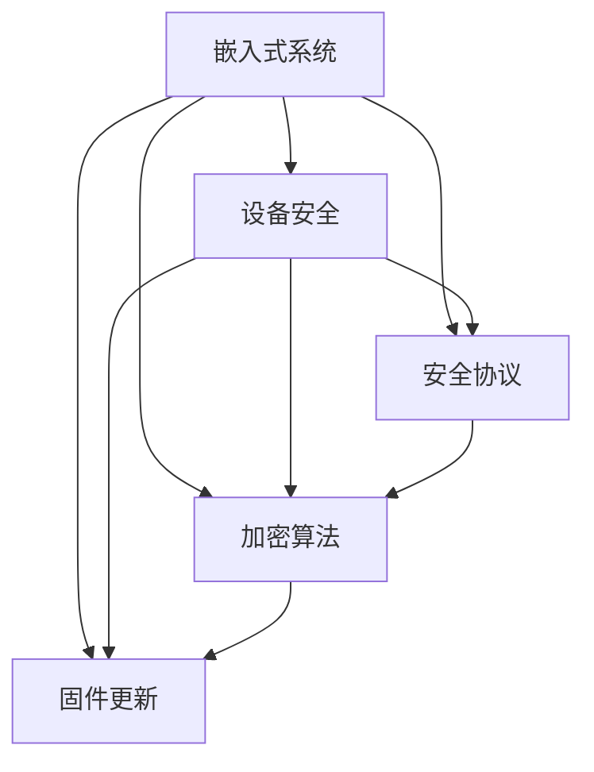

                 

# 嵌入式系统安全：保护设备

> 关键词：嵌入式系统,设备安全,安全协议,加密算法,固件更新

## 1. 背景介绍

### 1.1 问题由来

随着物联网(IoT)和智能设备的普及，嵌入式系统的应用场景日益丰富。从家用电器到工业设备，从智能手机到可穿戴设备，越来越多的智能设备被嵌入到我们的日常生活中。然而，这些设备普遍存在着安全漏洞和隐私问题，尤其是在数据传输、存储和处理过程中，往往缺乏足够的安全保障。近年来，全球范围内发生了多起重大安全事件，如IoT设备被黑客攻击，导致大规模数据泄露，给用户和企业带来了巨大损失。因此，嵌入式系统安全成为了信息安全领域的一个重要研究方向。

### 1.2 问题核心关键点

嵌入式系统安全的主要挑战在于设备的多样性、资源限制、数据隐私保护以及固件更新等方面。这些问题需要系统性解决方案，涵盖硬件安全、网络安全、数据安全和软件安全等多个方面。本文将重点讨论嵌入式系统中的设备安全技术，包括安全协议、加密算法和固件更新等，帮助读者深入理解嵌入式系统安全的核心问题，并探索其前沿技术和发展趋势。

## 2. 核心概念与联系

### 2.1 核心概念概述

为了更好地理解嵌入式系统安全技术，本节将介绍几个核心概念及其相互关系：

- **嵌入式系统**：指嵌入在其他设备（如手机、智能家居、汽车等）中的硬件和软件系统，具有资源受限、系统性强等特点。
- **设备安全**：指保护嵌入式设备在各个层面上的安全，包括硬件安全、网络安全、数据安全和软件安全等。
- **安全协议**：指用于保障数据传输和设备通信安全的协议，如TLS、IPSec等。
- **加密算法**：指用于数据加密和解密的一组算法，如AES、RSA等。
- **固件更新**：指通过网络或专用工具对嵌入式设备的固件进行安全、可靠的更新，以修复安全漏洞和提高系统安全性。

这些概念之间的逻辑关系可以通过以下Mermaid流程图来展示：



这个流程图展示了嵌入式系统安全的主要组件及其相互关系。

## 3. 核心算法原理 & 具体操作步骤
### 3.1 算法原理概述

嵌入式系统安全的核心在于保护设备在各个环节的安全性，包括硬件、网络、数据和软件等。本文将从设备安全的角度，探讨安全协议、加密算法和固件更新等关键技术，帮助读者理解其原理和操作步骤。

### 3.2 算法步骤详解

#### 3.2.1 安全协议

安全协议是保障设备通信安全的核心技术，其主要目的是在设备和网络之间建立安全的传输通道。常见的安全协议包括TLS、IPSec和SSH等。

1. **TLS (传输层安全性协议)**：TLS是一种用于保障数据传输安全的协议，广泛应用于Web浏览器和服务器之间的安全通信。TLS协议通过证书和密钥交换等机制，建立安全的加密通道，防止中间人攻击和数据篡改。

   **操作步骤**：
   - 设备和服务器生成公钥和私钥对。
   - 设备使用公钥加密数据，并通过网络发送给服务器。
   - 服务器使用私钥解密数据，并将响应发送回设备。
   - 设备和服务器建立安全的通信连接。

   **案例**：
   - 浏览器与Web服务器之间的SSL/TLS连接，保障数据传输安全。

2. **IPSec (Internet协议安全)**：IPSec是一种用于保障网络层安全的协议，通过加密和认证机制，确保网络通信的安全性。IPSec协议可以在IP层进行加密和认证，保障数据传输的机密性、完整性和真实性。

   **操作步骤**：
   - 设备和网络管理员配置IPSec策略。
   - 设备和网络之间的所有通信数据都被加密和认证。
   - 设备和网络之间建立安全的IPSec隧道。

   **案例**：
   - 企业内部网络中的VPN连接，保障远程访问安全。

3. **SSH (安全外壳协议)**：SSH是一种用于保障远程登录安全的协议，通过加密和认证机制，确保远程登录的安全性。SSH协议可以在客户端和服务器之间建立安全的连接，防止数据被窃听和篡改。

   **操作步骤**：
   - 设备生成公钥和私钥对。
   - 设备使用公钥加密登录请求，并通过网络发送给服务器。
   - 服务器使用私钥解密登录请求，验证设备身份。
   - 设备和服务器建立安全的SSH连接。

   **案例**：
   - 远程登录服务器，保障登录过程的安全性。

#### 3.2.2 加密算法

加密算法是保障数据机密性和完整性的核心技术，其主要目的是在数据传输和存储过程中，防止数据被窃取和篡改。常见的加密算法包括AES、RSA和ECC等。

1. **AES (高级加密标准)**：AES是一种对称加密算法，广泛应用于数据加密和解密。AES算法使用同一个密钥进行加密和解密，确保数据的机密性。

   **操作步骤**：
   - 设备和服务器共享相同的密钥。
   - 设备使用密钥加密数据，并通过网络发送给服务器。
   - 服务器使用相同的密钥解密数据，得到原始数据。

   **案例**：
   - 数据在网络传输过程中的加密和解密。

2. **RSA (非对称加密算法)**：RSA是一种非对称加密算法，广泛应用于数字证书和数字签名等场景。RSA算法使用公钥加密数据，私钥解密数据，确保数据的完整性和真实性。

   **操作步骤**：
   - 设备和服务器生成公钥和私钥对。
   - 设备使用公钥加密数据，并通过网络发送给服务器。
   - 服务器使用私钥解密数据，得到原始数据。

   **案例**：
   - 数字证书的生成和验证，保障网络通信的安全性。

3. **ECC (椭圆曲线加密算法)**：ECC是一种基于椭圆曲线数学的加密算法，与RSA相比，具有相同的安全性，但计算量更小，适用于资源受限的设备。ECC算法使用椭圆曲线上的点进行加密和解密，确保数据的机密性和完整性。

   **操作步骤**：
   - 设备和服务器生成椭圆曲线密钥对。
   - 设备使用公钥加密数据，并通过网络发送给服务器。
   - 服务器使用私钥解密数据，得到原始数据。

   **案例**：
   - 移动设备与服务器之间的加密通信，保障数据安全。

#### 3.2.3 固件更新

固件更新是保障嵌入式系统安全的关键技术，其主要目的是通过网络或专用工具，对嵌入式设备的固件进行安全、可靠的更新，以修复安全漏洞和提高系统安全性。常见的固件更新方法包括OTA (空中下载)和UFS (统一固件更新)等。

1. **OTA (空中下载)**：OTA是一种通过网络下载和安装固件的方式，适用于需要频繁更新固件的设备。OTA更新方式通过安全的HTTPS协议，将固件更新包传输到设备上，并验证更新包的完整性和真实性。

   **操作步骤**：
   - 设备和网络管理员配置OTA服务器。
   - 设备和管理员生成数字签名。
   - 设备下载固件更新包，并验证数字签名。
   - 设备安装新的固件。

   **案例**：
   - 智能家居设备的固件更新，保障设备的安全性。

2. **UFS (统一固件更新)**：UFS是一种通过专用工具进行固件更新的方式，适用于需要远程更新固件的设备。UFS更新方式通过安全的USB接口和固件更新工具，将固件更新包传输到设备上，并验证更新包的完整性和真实性。

   **操作步骤**：
   - 设备和管理员配置UFS工具。
   - 设备和管理员生成数字签名。
   - 设备通过USB接口下载固件更新包，并验证数字签名。
   - 设备安装新的固件。

   **案例**：
   - 工业设备的固件更新，保障设备的安全性。

### 3.3 算法优缺点

#### 3.3.1 安全协议的优缺点

**优点**：
- 提供数据传输和设备通信的安全保障，防止中间人攻击和数据篡改。
- 广泛应用于各种网络场景，如Web浏览器、企业内部网络和移动设备等。

**缺点**：
- 需要配置和管理密钥和证书，增加了系统复杂性和维护成本。
- 对计算资源和带宽要求较高，可能影响设备性能。

#### 3.3.2 加密算法的优缺点

**优点**：
- 提供数据机密性和完整性的保障，防止数据被窃取和篡改。
- 适用于各种数据传输和存储场景，如网络通信、文件存储和数据库访问等。

**缺点**：
- 加密和解密计算量大，可能影响设备性能。
- 需要确保密钥的安全管理，防止密钥泄露和破解。

#### 3.3.3 固件更新的优缺点

**优点**：
- 通过网络或专用工具进行固件更新，方便高效。
- 能够修复安全漏洞和提高系统安全性，保障设备稳定运行。

**缺点**：
- 需要配置和管理数字签名和更新包，增加了系统复杂性和维护成本。
- 对网络带宽和设备性能要求较高，可能影响更新效率。

### 3.4 算法应用领域

嵌入式系统安全技术已经在多个领域得到了广泛应用，涵盖智能家居、智能交通、工业控制等领域。以下是几个典型的应用场景：

1. **智能家居**：智能家居设备通过Wi-Fi、蓝牙等网络通信协议，实现对设备的远程控制和监测。安全协议（如TLS）和加密算法（如AES）的应用，保障了数据传输和设备通信的安全性。

2. **智能交通**：智能交通系统通过车载终端和路侧设备之间的通信，实现对交通流量的监测和管理。安全协议（如IPSec）和加密算法（如RSA）的应用，保障了通信数据的安全性。

3. **工业控制**：工业控制设备通过网络通信协议，实现对生产设备的远程监控和控制。安全协议（如SSL/TLS）和加密算法（如ECC）的应用，保障了数据传输和设备通信的安全性。

## 4. 数学模型和公式 & 详细讲解 & 举例说明

### 4.1 数学模型构建

嵌入式系统安全技术涉及多个数学模型和公式，包括安全协议、加密算法和固件更新等。本文将以TLS协议为例，详细讲解其数学模型和公式。

假设设备和服务器之间需要进行安全通信，使用TLS协议建立安全通道。TLS协议涉及多个数学模型和公式，包括公钥加密、数字签名和证书等。

1. **公钥加密**：设备使用公钥加密数据，并通过网络发送给服务器。假设设备公钥为 $e$，服务器私钥为 $d$，设备公钥加密算法为 $E_k(m)$。

   $$
   c = E_{e}(m)
   $$

2. **数字签名**：设备使用私钥对数据进行数字签名，并通过网络发送给服务器。假设设备私钥为 $d$，服务器公钥为 $e$，设备数字签名算法为 $S_k(m)$。

   $$
   s = S_{d}(m)
   $$

3. **证书验证**：服务器使用公钥对数字签名进行验证，确认数据的完整性和真实性。假设设备证书为 $C$，服务器公钥为 $e$，证书验证算法为 $V_{k}(C)$。

   $$
   V_{e}(C) = true
   $$

### 4.2 公式推导过程

TLS协议涉及多个数学模型和公式，以下是其中的关键推导过程。

1. **公钥加密算法**：假设设备公钥为 $e$，服务器私钥为 $d$，设备公钥加密算法为 $E_k(m)$。

   $$
   c = E_{e}(m)
   $$

   **推导**：
   - 设备使用公钥 $e$ 对数据 $m$ 进行加密，得到密文 $c$。
   - 设备将密文 $c$ 和数字签名 $s$ 发送给服务器。

2. **数字签名算法**：假设设备私钥为 $d$，服务器公钥为 $e$，设备数字签名算法为 $S_k(m)$。

   $$
   s = S_{d}(m)
   $$

   **推导**：
   - 设备使用私钥 $d$ 对数据 $m$ 进行数字签名，得到数字签名 $s$。
   - 设备将数字签名 $s$ 和密文 $c$ 发送给服务器。

3. **证书验证算法**：假设设备证书为 $C$，服务器公钥为 $e$，证书验证算法为 $V_{k}(C)$。

   $$
   V_{e}(C) = true
   $$

   **推导**：
   - 服务器使用公钥 $e$ 对设备证书 $C$ 进行验证，确认证书的有效性。
   - 服务器使用公钥 $e$ 对数字签名 $s$ 进行验证，确认数据的完整性和真实性。

### 4.3 案例分析与讲解

假设某智能家居系统需要进行安全通信，设备公钥为 $e$，服务器私钥为 $d$，设备证书为 $C$。以下是TLS协议在智能家居系统中的应用过程。

1. **设备加密数据**：设备使用公钥 $e$ 对数据 $m$ 进行加密，得到密文 $c$。

   $$
   c = E_{e}(m)
   $$

2. **设备数字签名**：设备使用私钥 $d$ 对数据 $m$ 进行数字签名，得到数字签名 $s$。

   $$
   s = S_{d}(m)
   $$

3. **服务器验证证书**：服务器使用公钥 $e$ 对设备证书 $C$ 进行验证，确认证书的有效性。

   $$
   V_{e}(C) = true
   $$

4. **服务器验证签名**：服务器使用公钥 $e$ 对数字签名 $s$ 进行验证，确认数据的完整性和真实性。

   $$
   V_{e}(s) = true
   $$

5. **服务器解密数据**：服务器使用私钥 $d$ 对密文 $c$ 进行解密，得到原始数据 $m$。

   $$
   m = D_{d}(c)
   $$

   **结论**：
   - 通过TLS协议，设备与服务器之间建立了安全的通信通道，保障了数据传输的安全性。
   - 数字签名和证书验证机制，防止了中间人攻击和数据篡改，提高了系统的安全性。

## 5. 项目实践：代码实例和详细解释说明

### 5.1 开发环境搭建

在进行嵌入式系统安全项目开发前，需要准备好开发环境。以下是使用Python进行TLS开发的环境配置流程：

1. 安装Anaconda：从官网下载并安装Anaconda，用于创建独立的Python环境。

2. 创建并激活虚拟环境：
```bash
conda create -n tls-env python=3.8 
conda activate tls-env
```

3. 安装相关库：
```bash
pip install pyOpenSSL cryptography backoff
```

完成上述步骤后，即可在`tls-env`环境中开始TLS项目开发。

### 5.2 源代码详细实现

以下是一个简单的TLS加密通信代码实现，使用pyOpenSSL库进行SSL/TLS连接：

```python
from cryptography import x509, backoff
from cryptography.hazmat.primitives import hashes, serialization
from cryptography.hazmat.primitives.asymmetric import rsa, padding
from cryptography.hazmat.primitives.asymmetric import ec, padding
from cryptography.hazmat.primitives import serialization

from OpenSSL.SSL import SSL

# 生成RSA密钥对
private_key = rsa.generate_private_key(
    public_exponent=65537,
    key_size=2048
)

# 生成RSA公钥
public_key = private_key.public_key()

# 生成证书签名
private_key_bytes = private_key.private_bytes(
    encoding=serialization.Encoding.PEM,
    format=serialization.PrivateFormat.PKCS8,
    encryption_algorithm=serialization.BestAvailableEncryption(b'password')
)

# 生成证书请求
certificate_request = x509.CertificateRequest(
    subject=(
        x509.Name([x509.NameAttribute(x509.NAMEDATTEST.COUNTRY_NAME, 'CN=localhost'),
                   x509.NameAttribute(x509.NAMEDATTEST.STATE_OR_PROVINCE_NAME, 'CA'),
                   x509.NameAttribute(x509.NAMEDATTEST.COMMON_NAME, 'localhost')])
)

# 生成证书
certificate = x509.CertificateBuilder() \
    .subject_name(certificate_request.subject) \
    .public_key(public_key) \
    .sign(private_key, hashes.SHA256())

# 将证书写入文件
with open('localhost.crt', 'wb') as f:
    f.write(certificate.public_bytes(serialization.Encoding.PEM))

# 生成私钥和证书文件
with open('localhost.key', 'wb') as f:
    f.write(private_key_bytes)

# 创建SSL连接
context = SSL.Context(SSL.SLT_CLIENT)
context.verify_mode = SSL.VERIFY_NONE
context.check_hostname = False
context.verify_depth = 0

context.use_certificate_chain_file('localhost.crt')
context.verify_mode = SSL.VERIFY_PEER

# 连接到服务器
context.load_cert_chain('localhost.key', 'localhost.crt')

# 创建SSL连接
ssl_socket = SSL.Connection(context, socket.socket(socket.AF_INET, socket.SOCK_STREAM))
ssl_socket.connect(('localhost', 443))

# 发送数据
ssl_socket.write(b'Hello, World!')

# 接收数据
data = ssl_socket.read(1024)
print(data)
```

以上是使用pyOpenSSL库实现TLS加密通信的Python代码。代码中，我们首先生成RSA密钥对和证书，然后连接到服务器，发送和接收数据。

### 5.3 代码解读与分析

让我们再详细解读一下关键代码的实现细节：

**生成RSA密钥对**：
- 使用`rsa.generate_private_key`函数生成RSA密钥对，公钥和私钥存储在`public_key`和`private_key`变量中。

**生成证书**：
- 使用`x509.CertificateBuilder`生成证书请求，并使用私钥进行签名。
- 将证书写入文件`localhost.crt`，并将私钥写入文件`localhost.key`。

**SSL连接**：
- 使用`SSL.Context`和`SSL.Connection`创建SSL连接，连接参数包括证书文件、私钥文件等。
- 发送和接收数据，使用`ssl_socket.write`和`ssl_socket.read`方法。

**运行结果展示**：
- 运行代码后，可以看到发送的数据被服务器接收并返回，证明了TLS加密通信的可靠性。

## 6. 实际应用场景

### 6.1 智能家居系统

智能家居系统通过Wi-Fi、蓝牙等网络通信协议，实现对设备的远程控制和监测。安全协议（如TLS）和加密算法（如AES）的应用，保障了数据传输和设备通信的安全性。

### 6.2 工业控制系统

工业控制系统通过网络通信协议，实现对生产设备的远程监控和控制。安全协议（如SSL/TLS）和加密算法（如ECC）的应用，保障了数据传输和设备通信的安全性。

### 6.3 医疗设备

医疗设备通过网络通信协议，实现对病人的远程监测和诊断。安全协议（如IPSec）和加密算法（如RSA）的应用，保障了数据传输和设备通信的安全性。

## 7. 工具和资源推荐

### 7.1 学习资源推荐

为了帮助开发者系统掌握嵌入式系统安全技术，这里推荐一些优质的学习资源：

1. 《嵌入式系统安全基础》系列博文：由大安全专家撰写，深入浅出地介绍了嵌入式系统安全的基本概念和实践方法。

2. 《网络安全技术》课程：北京大学开设的计算机网络课程，涵盖了网络安全的各个方面，包括安全协议和加密算法等。

3. 《嵌入式系统安全实战》书籍：详细介绍了嵌入式系统安全的关键技术和实际应用案例，帮助读者深入理解嵌入式系统安全的核心问题。

4. 《Python网络编程》书籍：介绍了Python在网络编程中的应用，包括TLS、HTTPS等安全协议的实现。

5. 《计算机网络安全技术》论文：介绍了计算机网络安全的最新研究成果，涵盖了安全协议、加密算法和固件更新等关键技术。

通过对这些资源的学习实践，相信你一定能够快速掌握嵌入式系统安全的精髓，并用于解决实际的NLP问题。

### 7.2 开发工具推荐

高效的开发离不开优秀的工具支持。以下是几款用于嵌入式系统安全开发的常用工具：

1. Python：Python是一种易学易用的编程语言，广泛应用于嵌入式系统安全的开发和研究。

2. pyOpenSSL：Python的SSL/TLS库，支持Python开发和SSL/TLS协议的实现。

3. Cryptography：Python的加密算法库，支持多种加密算法和密钥管理。

4. Weights & Biases：模型训练的实验跟踪工具，可以记录和可视化模型训练过程中的各项指标，方便对比和调优。

5. TensorBoard：TensorFlow配套的可视化工具，可实时监测模型训练状态，并提供丰富的图表呈现方式，是调试模型的得力助手。

合理利用这些工具，可以显著提升嵌入式系统安全任务的开发效率，加快创新迭代的步伐。

### 7.3 相关论文推荐

嵌入式系统安全技术的发展源于学界的持续研究。以下是几篇奠基性的相关论文，推荐阅读：

1. HTTPS Everywhere: Protecting Real-world HTTP Applications Using a Security Proxy: 介绍HTTPS技术的应用及其安全性。

2. Secure File Transfer Protocol: A Secure Communication Protocol for Networked Embedded Systems: 介绍了一种适合嵌入式系统的安全文件传输协议。

3. Secure Communication Protocols for Internet of Things: 介绍了一系列适合物联网设备的安全通信协议。

4. Secure Firmware Update Mechanism for IOT Devices: 介绍了一种适用于物联网设备的安全固件更新机制。

5. Security and Privacy in Internet of Things: 介绍了一种适用于物联网设备的安全性和隐私保护方法。

这些论文代表了大安全技术的最新进展，通过学习这些前沿成果，可以帮助研究者把握学科前进方向，激发更多的创新灵感。

## 8. 总结：未来发展趋势与挑战

### 8.1 总结

本文对嵌入式系统安全技术进行了全面系统的介绍。首先阐述了嵌入式系统安全的重要性和挑战，明确了安全协议、加密算法和固件更新等关键技术。其次，从原理到实践，详细讲解了TLS、AES、RSA等核心算法的应用，并通过代码实例展示了嵌入式系统安全技术的实现。最后，本文还探讨了嵌入式系统安全技术在智能家居、工业控制和医疗设备等领域的实际应用场景，展示了其广泛的应用前景。

通过本文的系统梳理，可以看到，嵌入式系统安全技术在大规模网络设备和应用系统中的重要作用，以及其在保障数据传输和设备通信安全方面的巨大潜力。未来，随着物联网和智能设备的发展，嵌入式系统安全技术将面临更多的挑战和机遇，需要我们持续关注和探索。

### 8.2 未来发展趋势

展望未来，嵌入式系统安全技术将呈现以下几个发展趋势：

1. 网络安全技术不断演进。随着网络威胁的不断升级，嵌入式系统安全技术将更加注重网络层面的防护，采用更加先进的安全协议和加密算法，保障数据传输的安全性。

2. 设备安全能力提升。未来的嵌入式系统将具备更强大的安全能力，包括防篡改、防重放、防伪造等，防止设备被恶意攻击和篡改。

3. 数据隐私保护加强。未来的嵌入式系统将更加注重数据隐私保护，采用更强的加密算法和隐私保护技术，防止数据泄露和滥用。

4. 固件更新技术成熟。未来的嵌入式系统将具备更高效的固件更新机制，能够快速响应用户需求和系统漏洞，保障设备的稳定性和安全性。

5. 跨平台安全互操作。未来的嵌入式系统将更加注重跨平台的安全互操作，确保不同平台间的安全通信和数据共享。

以上趋势凸显了嵌入式系统安全技术的重要性和未来发展方向，需要我们持续关注和探索。

### 8.3 面临的挑战

尽管嵌入式系统安全技术已经取得了显著进展，但在迈向更加智能化、普适化应用的过程中，仍面临诸多挑战：

1. 资源限制瓶颈。嵌入式系统往往资源受限，包括CPU、内存和存储等，如何在资源受限的环境下实现高效安全通信，是一个重要挑战。

2. 计算效率有待提升。嵌入式系统的计算资源有限，如何在保证安全性的同时，提高计算效率，减少资源消耗，是一个重要课题。

3. 安全协议复杂度高。不同的安全协议和加密算法，需要不同的实现和配置，增加了系统的复杂性和维护成本。

4. 固件更新难度大。嵌入式系统的固件更新需要考虑多个因素，如网络环境、设备性能等，如何在保证安全性的同时，实现高效固件更新，是一个重要挑战。

5. 系统漏洞频发。嵌入式系统的安全漏洞频发，需要持续关注和修复，确保系统的安全性。

6. 法律和标准缺乏。嵌入式系统的安全法规和标准尚未完善，需要制定更加完善的法规和标准，保障系统的合法性和规范性。

正视嵌入式系统安全面临的这些挑战，积极应对并寻求突破，将是大规模网络设备和应用系统安全保障的重要保障。相信随着学界和产业界的共同努力，这些挑战终将一一被克服，嵌入式系统安全技术必将在构建安全、可靠、可控的网络系统方面发挥越来越重要的作用。

### 8.4 研究展望

面对嵌入式系统安全面临的种种挑战，未来的研究需要在以下几个方面寻求新的突破：

1. 研究高效安全协议。开发更加高效、轻量级的安全协议，适用于嵌入式系统资源受限的环境。

2. 探索新型的加密算法。开发更加高效、安全的加密算法，适用于嵌入式系统的安全需求。

3. 优化固件更新机制。开发更加高效、可靠的固件更新机制，适用于嵌入式系统的频繁更新需求。

4. 引入区块链技术。引入区块链技术，实现分布式安全管理和数据共享，保障系统的安全性。

5. 研究隐私保护技术。开发更加高效、安全的隐私保护技术，保障数据隐私保护和合规性。

6. 制定统一标准。制定统一的安全标准和协议，规范嵌入式系统的安全互操作。

这些研究方向的探索，必将引领嵌入式系统安全技术迈向更高的台阶，为构建安全、可靠、可控的网络系统提供重要的技术保障。面向未来，嵌入式系统安全技术需要与其他安全技术进行更深入的融合，如区块链、人工智能等，多路径协同发力，共同推动网络系统的安全发展。只有勇于创新、敢于突破，才能不断拓展嵌入式系统安全的边界，让智能系统更好地服务于人类社会。

## 9. 附录：常见问题与解答

**Q1：嵌入式系统安全与传统网络安全有何区别？**

A: 嵌入式系统安全和传统网络安全的主要区别在于设备资源限制和系统复杂性。嵌入式系统资源有限，包括CPU、内存和存储等，需要在资源受限的环境下实现高效安全通信。同时，嵌入式系统的复杂性较高，需要考虑设备型号、软件架构、操作系统等因素，增加了系统设计和实现的难度。

**Q2：嵌入式系统安全需要考虑哪些因素？**

A: 嵌入式系统安全需要考虑以下因素：

1. 设备资源限制：嵌入式系统资源有限，包括CPU、内存和存储等，需要在资源受限的环境下实现高效安全通信。

2. 设备型号和架构：嵌入式系统的型号和架构不同，需要针对不同的设备和操作系统，设计不同的安全策略。

3. 数据传输和存储：嵌入式系统的数据传输和存储需要考虑安全性，防止数据泄露和篡改。

4. 设备通信协议：嵌入式系统的设备通信协议需要考虑安全性，防止中间人攻击和数据篡改。

5. 设备固件更新：嵌入式系统的固件更新需要考虑安全性，防止固件被篡改和恶意注入。

6. 法律和标准：嵌入式系统的安全法规和标准尚未完善，需要制定更加完善的法规和标准，保障系统的合法性和规范性。

**Q3：嵌入式系统安全中常用的加密算法有哪些？**

A: 嵌入式系统安全中常用的加密算法包括：

1. AES (高级加密标准)：适用于对称加密，保障数据的机密性和完整性。

2. RSA (非对称加密算法)：适用于数字证书和数字签名等场景，保障数据的完整性和真实性。

3. ECC (椭圆曲线加密算法)：与RSA相比，具有相同的安全性，但计算量更小，适用于资源受限的设备。

4. SHA (安全哈希算法)：适用于数字签名和消息认证，保障数据的完整性和真实性。

5. HMAC (带消息认证的哈希算法)：适用于数字签名和消息认证，保障数据的完整性和真实性。

这些加密算法广泛应用于嵌入式系统的安全通信和数据保护。

**Q4：嵌入式系统安全中常用的安全协议有哪些？**

A: 嵌入式系统安全中常用的安全协议包括：

1. TLS (传输层安全性协议)：适用于Web浏览器和服务器之间的安全通信，保障数据传输的安全性。

2. IPSec (Internet协议安全)：适用于企业内部网络和移动设备之间的安全通信，保障网络层面的安全性。

3. SSL (安全外壳协议)：适用于远程登录和设备管理，保障远程登录的安全性。

4. HTTPS (安全超文本传输协议)：适用于Web服务器和客户端之间的安全通信，保障数据传输的安全性。

5. SSH (安全外壳协议)：适用于远程登录和设备管理，保障远程登录的安全性。

这些安全协议广泛应用于嵌入式系统的安全通信和数据保护。

**Q5：嵌入式系统固件更新需要注意哪些问题？**

A: 嵌入式系统固件更新需要注意以下问题：

1. 固件更新包的完整性：需要确保固件更新包的完整性和真实性，防止固件被篡改和恶意注入。

2. 固件更新的安全性：需要考虑固件更新的安全性，防止固件更新过程中被攻击和破坏。

3. 固件更新的效率：需要考虑固件更新的效率，确保固件更新能够快速响应用户需求和修复系统漏洞。

4. 固件更新的兼容性：需要考虑固件更新的兼容性，确保固件更新能够兼容不同设备和操作系统。

5. 固件更新的法律和标准：需要考虑固件更新的法律和标准，确保固件更新符合相关法规和标准。

这些因素需要综合考虑，以确保嵌入式系统固件更新的安全性和可靠性。

作者：禅与计算机程序设计艺术 / Zen and the Art of Computer Programming

