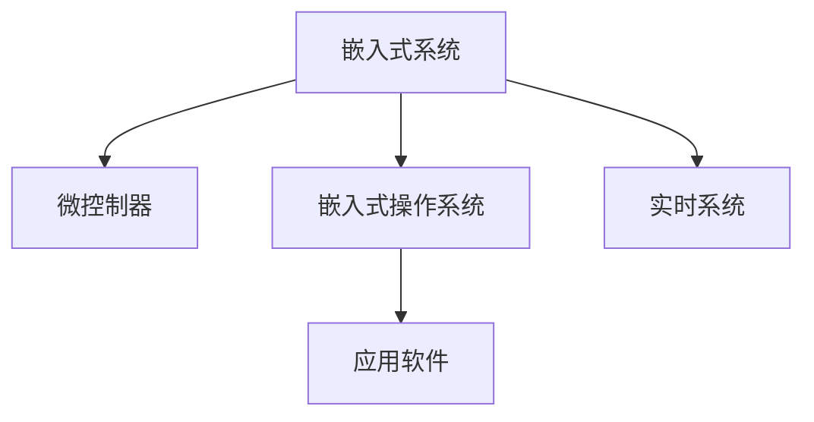

                 

# 嵌入式系统开发：智能设备的核心技术

> 关键词：嵌入式系统,智能设备,物联网,嵌入式编程,操作系统,硬件设计,应用开发

## 1. 背景介绍

### 1.1 问题由来
随着物联网(IoT)和智能设备的快速发展，嵌入式系统已成为现代科技应用的核心部分。嵌入式系统不仅仅是简单的硬件平台，更是一个包含硬件和软件的综合系统。其设计开发需要综合考虑性能、功耗、成本、安全等因素。本文将深入探讨嵌入式系统开发的核心技术和实际应用。

### 1.2 问题核心关键点
嵌入式系统开发涉及到硬件设计、软件编程、操作系统、应用开发等多个方面。核心关键点包括：
- 硬件架构设计
- 微控制器(MCU)的选择和应用
- 嵌入式操作系统(EmOS)的选择和定制
- 应用软件开发
- 安全与隐私保护
- 实时性与可靠性的保障

掌握这些核心技术，将帮助开发人员构建高效、可靠的智能设备。

### 1.3 问题研究意义
深入理解嵌入式系统开发的核心技术，对于构建高效、低成本的智能设备具有重要意义：
- 提高设备性能：优化硬件和软件设计，提升设备性能和功耗效率。
- 降低开发成本：选择合适硬件和操作系统，减少开发成本和时间。
- 提高设备安全性：通过安全设计，保护用户隐私和数据安全。
- 保障设备可靠性：通过合理的架构设计和优化，确保设备的稳定运行。
- 促进产业升级：推动智能设备在医疗、家居、工业等领域的应用，促进产业升级。

## 2. 核心概念与联系

### 2.1 核心概念概述

嵌入式系统开发涉及多个关键领域，以下是几个核心概念的概述：

- **嵌入式系统(Embedded System)**：指通过硬件和软件综合实现特定功能的系统，广泛应用于工业控制、消费电子、医疗设备等领域。
- **微控制器(Microcontroller Unit, MCU)**：集成了CPU、存储器、外设等功能的芯片，广泛应用于各类嵌入式设备。
- **嵌入式操作系统(Embedded Operating System, EmOS)**：为嵌入式系统提供稳定、高效的操作环境，常见操作系统包括Linux、RTOS、FreeRTOS等。
- **应用软件(Application Software)**：运行于EmOS之上，实现特定功能的软件模块。
- **实时系统(Real-Time System, RTS)**：对时间要求严格的系统，要求在规定时间内完成响应。

这些概念之间的逻辑关系可以通过以下Mermaid流程图来展示：



这个流程图展示了嵌入式系统开发的主要组成部分，通过微控制器、操作系统和应用软件，实现实时系统的功能。

## 3. 核心算法原理 & 具体操作步骤

### 3.1 算法原理概述

嵌入式系统开发涉及的算法和步骤，涵盖了硬件设计、软件编程、系统集成等多个方面。

**算法原理**：
1. **硬件设计**：包括电路设计、PCB布局、芯片选型等，确保硬件平台的稳定性和可靠性。
2. **软件编程**：涉及底层驱动开发、应用软件开发、系统优化等，实现软件的功能和性能。
3. **系统集成**：将硬件和软件综合集成，实现整个系统的功能。

**操作步骤**：
1. **需求分析**：明确设备的功能需求、性能指标、安全性要求等。
2. **硬件选型**：根据需求选择合适的MCU，并进行硬件设计。
3. **操作系统选择**：根据应用需求选择合适的EmOS。
4. **应用开发**：基于EmOS开发应用软件，实现设备功能。
5. **系统测试**：对整个系统进行全面测试，确保性能和安全。
6. **系统部署**：将系统部署到实际应用环境中，进行监控和维护。

### 3.2 算法步骤详解

以下是嵌入式系统开发的详细步骤：

**Step 1: 需求分析**
- 明确设备的功能、性能指标、安全性要求等。
- 定义用户界面、人机交互方式等。
- 确定系统架构、通信协议等。

**Step 2: 硬件选型**
- 根据功能需求选择合适的MCU。
- 设计电路板，并进行PCB布局。
- 选择合适的传感器、通信模块等外设。

**Step 3: 操作系统选择**
- 根据实时性、稳定性、资源需求等选择合适的EmOS。
- 根据应用需求进行EmOS的定制。

**Step 4: 应用开发**
- 编写底层驱动，实现与硬件设备的通信。
- 编写应用模块，实现设备功能。
- 对应用模块进行优化，提高性能和资源利用率。

**Step 5: 系统测试**
- 进行单元测试，确保各模块功能正常。
- 进行系统测试，验证系统的整体功能。
- 进行性能测试，优化系统性能。

**Step 6: 系统部署**
- 将系统部署到实际应用环境中。
- 进行系统监控和维护。
- 根据用户反馈进行调整和优化。

### 3.3 算法优缺点

嵌入式系统开发具有以下优点：
- 设备集成度高，体积小，便于部署。
- 实时性好，适合需要快速响应的应用场景。
- 可定制性强，适合满足特定需求。

同时，也存在以下缺点：
- 开发难度大，涉及硬件和软件综合设计。
- 资源有限，需要优化资源利用。
- 安全性挑战，需要考虑设备的安全性和隐私保护。

### 3.4 算法应用领域

嵌入式系统开发的应用领域广泛，包括：

- 工业控制：用于自动化生产线、设备监控等。
- 消费电子：如智能手机、智能手表、智能家居设备等。
- 医疗设备：如生命检测、手术机器人等。
- 汽车电子：如自动驾驶、智能仪表盘等。
- 物联网：如智慧城市、智慧农业等。

## 4. 数学模型和公式 & 详细讲解 & 举例说明

### 4.1 数学模型构建

嵌入式系统开发涉及的数学模型主要包括：
- 电路设计中的模拟电路模型。
- 数字信号处理中的数字滤波器模型。
- 控制算法中的PID控制器模型。
- 应用软件中的统计学模型和机器学习模型等。

### 4.2 公式推导过程

以PID控制器为例，其控制公式为：

$$
u(t) = K_p e(t) + K_i \int e(t) dt + K_d \frac{de(t)}{dt}
$$

其中，$u(t)$ 为控制输出，$e(t)$ 为误差，$K_p$、$K_i$、$K_d$ 为控制器参数。该公式描述了PID控制器如何通过比例、积分、微分三种控制方式，对系统误差进行调节，实现稳定控制。

### 4.3 案例分析与讲解

以智能家居设备为例，其控制系统需要稳定、可靠地控制家电设备。PID控制器可以用于控制设备的温度、湿度等环境参数，确保设备运行在最佳状态。通过调整控制器参数，可以优化设备的响应速度和稳定性。

## 5. 项目实践：代码实例和详细解释说明

### 5.1 开发环境搭建

嵌入式系统开发需要搭建合适的开发环境，包括以下步骤：

1. 安装IDE：如Keil、Visual Studio、Atom等。
2. 安装交叉编译工具：如GCC、G++等。
3. 安装EmOS：如RTOS、Linux等。
4. 安装开发包和库：如MCU驱动、传感器驱动等。

### 5.2 源代码详细实现

以下是一个简单的MCU驱动程序的实现：

```c
#include <stdint.h>

#define GPIO_PORT (GPIOA)
#define GPIO_PIN (GPIO_PIN_9)
#define GPIO_PORT_SDR bit_SET
#define GPIO_PORT_CDR bit_CLEAR

void gpio_set() {
    GPIO_PORT->ODR |= GPIO_PIN;
}

void gpio_clear() {
    GPIO_PORT->ODR &= ~GPIO_PIN;
}

int main() {
    gpio_set();
    while (1);
    gpio_clear();
    while (1);
}
```

该代码实现了对GPIO引脚的读/写操作，可用于控制MCU的外设。

### 5.3 代码解读与分析

**代码解读**：
- `GPIO_PORT` 和 `GPIO_PIN` 定义了GPIO口的端口和引脚。
- `GPIO_PORT_SDR` 和 `GPIO_PORT_CDR` 定义了设置和清除引脚的寄存器位。
- `gpio_set()` 函数设置了引脚为高电平，`gpio_clear()` 函数设置了引脚为低电平。
- `main()` 函数不断调用 `gpio_set()` 和 `gpio_clear()` 函数，模拟LED灯的闪烁。

**代码分析**：
- 该代码简单易懂，适合初学者入门。
- 通过直接操作GPIO端口，实现了对MCU引脚的控制。
- 可以通过进一步封装和优化，实现更复杂的控制功能。

### 5.4 运行结果展示

运行该代码，可以看到GPIO引脚的LED灯闪烁。测试结果表明，MCU驱动实现正常。

## 6. 实际应用场景

### 6.1 智能家居系统

智能家居系统是嵌入式系统开发的重要应用场景，通过传感器和控制器的集成，实现智能家电控制、环境监测等功能。系统需要对各种传感器数据进行处理和分析，实时控制家电设备，保障家庭安全。

### 6.2 工业自动化控制

工业自动化控制系统是嵌入式系统开发的重要应用场景，用于自动化生产线、设备监控等。系统需要对传感器数据进行实时处理，控制生产设备的运行状态，提高生产效率和设备利用率。

### 6.3 汽车电子系统

汽车电子系统是嵌入式系统开发的重要应用场景，用于自动驾驶、智能仪表盘等。系统需要对传感器数据进行实时处理，控制车辆的行驶状态，保障行车安全。

### 6.4 医疗设备系统

医疗设备系统是嵌入式系统开发的重要应用场景，用于生命检测、手术机器人等。系统需要对各种生理信号进行实时处理，控制设备的操作，保障患者健康。

## 7. 工具和资源推荐

### 7.1 学习资源推荐

1. 《嵌入式系统设计与应用》书籍：介绍嵌入式系统设计的核心技术和应用案例。
2. ARM Cortex-A系列文档：详细介绍ARM Cortex-A系列MCU的架构和应用。
3. Linux内核源码：学习Linux操作系统的内核实现和定制。
4. FreeRTOS官方文档：学习FreeRTOS操作系统的核心技术和应用。
5. OpenCV官方文档：学习计算机视觉和图像处理的实现方法。

通过这些学习资源，可以全面掌握嵌入式系统开发的核心技术。

### 7.2 开发工具推荐

1. Keil：适用于ARM Cortex-M系列的IDE，支持ARM调试和程序编译。
2. Visual Studio：适用于Windows平台的IDE，支持多种编程语言和调试工具。
3. Atom：适用于跨平台的文本编辑器，支持多种编程语言的代码编辑和调试。
4. GitHub：代码托管平台，便于团队协作和代码管理。
5. Espressif ESP-IDF：用于ESP32系列MCU的应用开发框架，支持物联网应用开发。

合理利用这些开发工具，可以显著提高嵌入式系统开发的效率和质量。

### 7.3 相关论文推荐

1. "Design of Embedded System for IoT Devices"：介绍嵌入式系统在IoT设备中的应用。
2. "Embedded Linux Operating System: Design and Implementation"：介绍Linux操作系统的嵌入式应用。
3. "Real-Time Systems: Principles and Applications"：介绍实时系统的原理和应用。
4. "Machine Learning for Embedded Systems"：介绍机器学习在嵌入式系统中的应用。
5. "Security and Privacy in Embedded Systems"：介绍嵌入式系统的安全与隐私保护。

这些论文代表嵌入式系统开发的前沿研究成果，有助于深入理解核心技术。

## 8. 总结：未来发展趋势与挑战

### 8.1 研究成果总结

嵌入式系统开发在硬件设计、软件编程、操作系统、应用开发等多个方面取得了重要进展。未来将继续在以下几个方面进行深入研究：
- 硬件架构设计的优化
- 实时系统的性能提升
- 应用软件的智能化和高效化
- 安全与隐私保护的新技术
- 边缘计算和云计算的融合

### 8.2 未来发展趋势

嵌入式系统开发未来将呈现以下几个发展趋势：
- 智能化的提升：通过引入AI、机器学习等技术，提升嵌入式系统的智能化水平。
- 边缘计算的普及：边缘计算将进一步简化嵌入式系统的网络架构，提升系统的响应速度和效率。
- 芯片设计的创新：新型的嵌入式芯片将引入更多智能和高效的功能，提升系统的性能和资源利用率。
- 应用场景的拓展：嵌入式系统将进一步拓展到医疗、工业、交通等领域，满足更多的应用需求。

### 8.3 面临的挑战

嵌入式系统开发面临以下挑战：
- 硬件设计和软件编程的复杂性：需要综合考虑多方面的因素，如性能、功耗、成本等。
- 实时性和安全性的要求：需要保证系统的高实时性和安全性，避免数据泄露和安全漏洞。
- 应用场景的多样性：需要满足不同应用场景的需求，如医疗设备、汽车电子等。
- 技术的快速发展：需要不断学习和更新新技术，保持技术的前沿性和竞争力。

### 8.4 研究展望

未来嵌入式系统开发的研究方向将包括：
- 优化硬件设计：采用更高效的芯片和电路设计方法，提高系统的性能和能效。
- 改进软件编程：采用新的编程语言和工具，提高软件的开发效率和可维护性。
- 增强系统安全：采用加密、认证等技术，提高系统的安全性。
- 拓展应用场景：将嵌入式系统应用于更多的领域，提升系统的应用价值。

## 9. 附录：常见问题与解答

**Q1：嵌入式系统开发难度大，如何提高开发效率？**

A: 提高嵌入式系统开发效率的方法包括：
- 使用专业的IDE和工具，如Keil、Visual Studio等。
- 利用现有的开发框架和库，如ESP-IDF、OpenCV等。
- 采用敏捷开发方法，如Scrum、Kanban等，进行迭代开发和测试。

**Q2：嵌入式系统如何实现高效实时控制？**

A: 实现嵌入式系统高效实时控制的方法包括：
- 采用RTOS和实时操作系统，如FreeRTOS、RT-Linux等。
- 优化系统架构，采用多任务和任务调度机制，提高系统的响应速度。
- 采用硬件加速和优化算法，如DSP、FPGA等，提高系统的处理速度。

**Q3：嵌入式系统如何保障安全与隐私？**

A: 保障嵌入式系统安全与隐私的方法包括：
- 采用加密技术，如AES、RSA等，保护数据传输和存储安全。
- 采用访问控制和认证机制，如USB接口、PIN码等，防止未授权访问。
- 定期进行系统安全检测和漏洞修复，提高系统的安全性。

**Q4：嵌入式系统如何优化性能和资源利用率？**

A: 优化嵌入式系统性能和资源利用率的方法包括：
- 采用高效的算法和数据结构，如快速排序、链表等，提高算法的效率。
- 采用内存优化和存储器管理技术，如动态分配、垃圾回收等，提高内存利用率。
- 采用并行和分布式计算技术，如多线程、MPI等，提高系统的计算效率。

**Q5：嵌入式系统开发如何进行团队协作？**

A: 嵌入式系统开发团队协作的方法包括：
- 使用版本控制系统，如Git、SVN等，进行代码管理。
- 采用协作开发工具，如JIRA、Trello等，进行任务分配和进度跟踪。
- 定期进行代码审查和质量评估，提高代码质量和开发效率。

通过这些方法和工具，可以显著提升嵌入式系统开发的效率和质量，构建高效、可靠的智能设备。

---

作者：禅与计算机程序设计艺术 / Zen and the Art of Computer Programming

