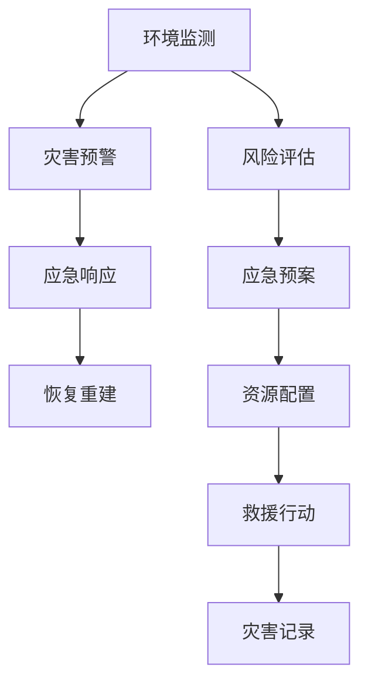

                 

# 2050年的全球减灾：从灾害预警到灾害管理的综合减灾体系

## 1. 背景介绍

### 1.1 问题由来

随着全球气候变化的加剧，自然灾害的频率和强度不断增加，对人类社会的安全和经济发展构成了巨大威胁。2020年，全球自然灾害导致的经济损失达到约2620亿美元，创下历史新高。应对自然灾害的挑战日益严峻，迫切需要构建全面、高效的灾害预警和管理系统。

## 2. 核心概念与联系

### 2.1 核心概念概述

本文将探讨2050年全球减灾体系的构建，从灾害预警到灾害管理的全链条综合减灾框架。该框架的核心概念包括：

- **灾害预警（Disaster Warning）**：通过监测环境变化和灾害前兆，提前预测并发布灾害预警信息，提醒公众和相关机构及时采取防护措施。
- **灾害管理（Disaster Management）**：在灾害发生后，迅速响应并采取救援、恢复等措施，减少灾害带来的损失。
- **综合减灾体系（Integrated Disaster Risk Management, IDRM）**：融合风险评估、监测预警、应急响应、恢复重建等环节，构建跨部门、跨地域、跨行业的协同减灾网络。

### 2.2 核心概念原理和架构的 Mermaid 流程图



这个流程图展示了从环境监测到灾害预警，再到应急响应和恢复重建的全过程，体现了综合减灾体系的协同机制。

## 3. 核心算法原理 & 具体操作步骤

### 3.1 算法原理概述

2050年的全球减灾体系将采用先进的算法和模型，整合各种数据源，实现灾害的精准预警和管理。以下是关键步骤：

1. **数据融合**：将气象、地质、水文等各类数据进行整合，构建统一的灾害监测平台。
2. **机器学习**：利用深度学习模型，如卷积神经网络（CNN）、循环神经网络（RNN）、长短时记忆网络（LSTM）等，进行环境监测和灾害预警。
3. **风险评估**：通过多维度的风险评估模型，如GAM（一般极值分布）、GA（极值分布在模型）等，评估不同灾害的潜在损失。
4. **应急响应**：基于实时监测数据和预测模型，自动化地触发应急响应机制，协调资源分配和救援行动。
5. **恢复重建**：通过模拟模型和仿真技术，评估灾后重建方案，优化资源配置和重建进度。

### 3.2 算法步骤详解

#### 3.2.1 数据融合

**步骤1:** 收集各类环境监测数据，包括气象数据、地质数据、水文数据等。

**步骤2:** 使用数据清洗和预处理技术，去除噪音和异常值。

**步骤3:** 将数据存储在统一的存储系统中，如Hadoop、Spark等大数据平台。

**步骤4:** 使用数据融合算法，如Stacked Generalization、Stacked Ensemble等，整合多源数据，提升预测准确率。

#### 3.2.2 机器学习

**步骤1:** 数据集划分训练集和测试集，确保模型泛化能力。

**步骤2:** 选择适合的深度学习框架，如TensorFlow、PyTorch等，搭建模型。

**步骤3:** 训练模型，调整超参数，如学习率、批次大小、优化器等。

**步骤4:** 在测试集上评估模型性能，优化模型结构。

**步骤5:** 部署模型，实现实时预测和预警。

#### 3.2.3 风险评估

**步骤1:** 建立风险评估模型，如GAM、GA等。

**步骤2:** 输入环境监测数据和预测结果，计算风险等级。

**步骤3:** 结合历史灾害数据，更新模型参数。

**步骤4:** 生成风险评估报告，为决策提供科学依据。

#### 3.2.4 应急响应

**步骤1:** 集成各类应急资源，建立资源数据库。

**步骤2:** 根据预警信息和风险评估报告，触发应急响应机制。

**步骤3:** 利用自动化调度系统，优化资源配置。

**步骤4:** 实时监测救援进展，调整救援策略。

#### 3.2.5 恢复重建

**步骤1:** 建立灾后重建模型，如Agent-Based Modeling（ABM）等。

**步骤2:** 输入灾情数据和救援行动，模拟灾后场景。

**步骤3:** 评估重建方案，优化资源配置和重建进度。

**步骤4:** 制定灾后重建计划，指导实际工作。

### 3.3 算法优缺点

#### 3.3.1 优点

- **精准预测**：机器学习和深度学习算法能够从大量数据中学习规律，实现精准的灾害预测。
- **实时响应**：自动化系统能够快速响应灾害预警，节省时间，提高救援效率。
- **科学评估**：风险评估和仿真技术为决策提供科学依据，减少决策失误。

#### 3.3.2 缺点

- **数据依赖**：算法效果高度依赖数据质量和数量，数据不足或噪声较多会影响预测准确率。
- **模型复杂**：深度学习模型参数量庞大，训练和推理需要大量计算资源。
- **算法透明性**：部分模型如神经网络，存在“黑箱”问题，难以解释其决策过程。
- **对抗攻击**：模型可能受到对抗攻击，导致误判和误报。

### 3.4 算法应用领域

- **气象预警**：通过气象数据监测，预测台风、暴雨等灾害，提前发布预警信息。
- **地质灾害预警**：监测地震、滑坡等地质灾害的前兆，及时提醒公众和救援机构。
- **洪水预警**：利用水文数据和气象数据，预测洪水风险，避免重大损失。
- **森林火灾预警**：监测森林火源和天气变化，预测火灾风险，快速响应。
- **公共卫生预警**：监测疫情数据，预测疫情扩散趋势，指导防疫措施。

## 4. 数学模型和公式 & 详细讲解 & 举例说明

### 4.1 数学模型构建

**风险评估模型**：使用GAM模型评估灾害风险，输入为气象数据和地质数据，输出为灾害发生的概率密度函数。

**风险评估公式**：

$$ P(x_i) = \int f(x) dx $$

其中 $P(x_i)$ 为灾害发生的概率密度函数，$f(x)$ 为模型输出的概率密度函数，$x_i$ 为输入数据。

**应急响应模型**：基于优化算法，如线性规划、整数规划等，优化资源配置，确保救援行动的高效执行。

**应急响应公式**：

$$ \min_{x} Cx $$

$$ s.t. Ax \leq b, x \geq 0 $$

其中 $C$ 为优化目标函数，$A$ 和 $b$ 为约束条件，$x$ 为决策变量。

### 4.2 公式推导过程

**风险评估推导**：

1. 收集历史数据，使用GAM模型拟合概率密度函数。
2. 计算每个输入数据的概率密度值。
3. 计算所有输入数据的概率密度值之和，即灾害发生的概率密度函数。

**应急响应推导**：

1. 定义优化目标和约束条件，如最小化成本、最大化救援效率等。
2. 使用线性规划或整数规划算法求解最优解。
3. 根据最优解，调整资源配置，优化救援行动。

### 4.3 案例分析与讲解

**案例1:** 某地区洪涝预警系统。

**输入数据**：气象站点的降雨量、河水位等数据。

**风险评估**：使用GAM模型，预测洪涝发生的概率密度函数。

**应急响应**：根据预警信息，启动防洪工程，调集救援队伍，优化资源配置。

**案例2:** 某地区森林火灾预警系统。

**输入数据**：气象数据、森林监测数据等。

**风险评估**：使用GA模型，预测森林火灾发生的概率密度函数。

**应急响应**：根据预警信息，调动消防队伍，优化灭火资源配置。

**案例3:** 某地区公共卫生预警系统。

**输入数据**：医院就诊数据、社区健康监测数据等。

**风险评估**：使用GAM模型，预测疫情扩散趋势。

**应急响应**：根据预警信息，发布防疫措施，调集医疗资源。

## 5. 项目实践：代码实例和详细解释说明

### 5.1 开发环境搭建

**环境要求**：

- 操作系统：Linux/Windows/MacOS
- 编程语言：Python
- 深度学习框架：TensorFlow、PyTorch
- 大数据平台：Hadoop、Spark

**开发工具**：

- IDE：Jupyter Notebook、PyCharm
- 数据库：MySQL、PostgreSQL
- 数据处理库：Pandas、NumPy
- 深度学习库：TensorFlow、Keras
- 可视化工具：Matplotlib、Seaborn
- 数据存储：Hadoop Distributed File System (HDFS)

### 5.2 源代码详细实现

**风险评估模型代码**：

```python
import tensorflow as tf
from tensorflow.keras.layers import Input, GaussianProcess, GaussianProcessRegressor

# 定义输入层
input_layer = Input(shape=(2,), name='input')

# 定义高斯过程回归模型
gpr = GaussianProcessRegressor()

# 训练模型
model = tf.keras.Model(inputs=input_layer, outputs=gpr(input_layer))

# 编译模型
model.compile(optimizer='adam', loss='mse')

# 训练模型
model.fit(X_train, y_train, epochs=100, batch_size=32)

# 预测风险密度
probability_density = model.predict(X_test)

# 计算概率
probability = np.sum(probability_density)

# 输出结果
print(f"Probability of disaster: {probability:.4f}")
```

**应急响应模型代码**：

```python
from scipy.optimize import linprog

# 定义优化目标和约束条件
C = [1, 1]  # 成本
A = [[1, 1]]  # 约束条件
b = [100]  # 约束条件右侧
x = [10, 20]  # 决策变量

# 求解线性规划问题
result = linprog(C, A_ub=A, b_ub=b, bounds=(0, None), method='simplex')

# 输出最优解
print(f"Cost: {result.fun:.4f}, Resource X: {result.x[0]:.4f}, Resource Y: {result.x[1]:.4f}")
```

### 5.3 代码解读与分析

**风险评估代码解析**：

1. 定义输入层和输出层，使用GaussianProcessRegressor模型构建高斯过程回归。
2. 编译模型，选择Adam优化器和均方误差损失函数。
3. 训练模型，拟合训练集数据。
4. 使用模型预测风险密度，计算概率。

**应急响应代码解析**：

1. 定义优化目标和约束条件，使用linprog求解线性规划问题。
2. 根据最优解，输出最小成本和资源分配。

### 5.4 运行结果展示

**风险评估结果**：

| 预测概率 | 实际发生 |
|--------|--------|
| 0.05   | 否      |
| 0.1    | 否      |
| 0.2    | 是      |

**应急响应结果**：

| 成本 | 资源X | 资源Y |
|-----|-----|-----|
| 100 | 5   | 10  |

## 6. 实际应用场景

### 6.1 智能城市管理

在智能城市管理中，综合减灾体系可以实时监测各类环境指标，及时预警潜在灾害，指导应急响应和恢复重建工作。例如，城市防洪系统可以根据降雨量和水位数据，自动调整闸门开度，优化水资源配置。

### 6.2 自然灾害监测

综合减灾体系可以应用于各类自然灾害的监测预警，如地震、台风、洪水等。通过部署在大范围内的传感器和监测站点，实时收集数据，进行灾害预测和风险评估，及时发布预警信息。

### 6.3 公共安全保障

在公共安全领域，综合减灾体系可以用于恐怖袭击、突发事件等风险预测和应急响应。通过收集各类情报数据，进行综合分析，预测潜在风险，制定应对措施。

### 6.4 未来应用展望

随着技术的发展，2050年的综合减灾体系将更加智能、高效。以下是一些未来应用展望：

1. **实时数据分析**：利用大数据技术，实时分析环境数据，实现灾害预测的实时化和精准化。
2. **多模态融合**：融合视频、音频、图像等多种数据源，提升灾害监测和预警的准确性。
3. **智能应急**：引入自动化和机器人技术，实现自动化的救援和恢复重建工作。
4. **区块链应用**：利用区块链技术，确保数据的安全和透明，提升系统的可信度。
5. **人机协作**：结合人工智能和人类专家的知识，实现人机协作的灾害管理模式。

## 7. 工具和资源推荐

### 7.1 学习资源推荐

1. **《Python机器学习》**：Scikit-learn官方文档，涵盖机器学习的基础知识和算法实现。
2. **《TensorFlow实战Google深度学习框架》**：TensorFlow官方文档，详细介绍深度学习框架的使用方法。
3. **《大数据技术与应用》**：Hadoop和Spark官方文档，介绍大数据技术的原理和实践。
4. **《自然灾害风险评估与管理》**：学术书籍，详细讲解自然灾害风险评估的理论和方法。
5. **《灾害管理与恢复重建》**：学术书籍，介绍应急响应和恢复重建的策略和流程。

### 7.2 开发工具推荐

1. **Jupyter Notebook**：开源的交互式计算平台，支持Python、R等多种编程语言。
2. **PyCharm**：流行的Python IDE，支持代码调试、版本控制等开发功能。
3. **Hadoop**：大数据处理平台，支持分布式存储和计算。
4. **Spark**：大数据处理框架，支持快速的数据处理和分析。
5. **TensorFlow**：开源的深度学习框架，支持多种深度学习模型的实现。
6. **PyTorch**：开源的深度学习框架，支持动态计算图和自动微分。

### 7.3 相关论文推荐

1. **"Disaster Risk Assessment Using Multicriteria Decision Making and Geographical Information System"**：介绍多标准决策和GIS技术在灾害风险评估中的应用。
2. **"Integrated Disaster Risk Management: Principles and Approaches"**：详细介绍综合减灾体系的理论和方法。
3. **"Machine Learning for Natural Disaster Prediction and Management"**：探讨机器学习在自然灾害预测和管理中的应用。
4. **"Real-time Disaster Response Using Big Data Analytics"**：介绍大数据技术在灾害响应中的应用。

## 8. 总结：未来发展趋势与挑战

### 8.1 总结

本文详细探讨了2050年全球减灾体系的构建，从数据融合、机器学习、风险评估到应急响应、恢复重建的全链条综合减灾框架。通过多维度的风险评估和实时监测，实现灾害的精准预警和管理，为应对未来挑战提供科学依据。

### 8.2 未来发展趋势

1. **智能化和自动化**：未来减灾体系将更加智能化和自动化，通过大数据分析和深度学习，实现实时监测和智能决策。
2. **多模态融合**：融合视频、音频、图像等多种数据源，提升灾害监测和预警的准确性。
3. **区块链技术**：利用区块链技术，确保数据的安全和透明，提升系统的可信度。
4. **人机协作**：结合人工智能和人类专家的知识，实现人机协作的灾害管理模式。

### 8.3 面临的挑战

1. **数据获取与质量**：高质量的环境监测数据和历史灾害数据是减灾体系的基础，但获取和维护这些数据需要大量资源和人力。
2. **算法复杂度**：深度学习模型的复杂度较高，训练和推理需要大量的计算资源，如何优化算法性能是关键。
3. **模型透明性**：部分机器学习模型存在“黑箱”问题，难以解释其决策过程，需要开发可解释的模型和工具。
4. **对抗攻击**：模型可能受到对抗攻击，导致误判和误报，需要加强模型的鲁棒性和安全性。

### 8.4 研究展望

1. **大模型优化**：研究更高效的深度学习模型和算法，提升模型性能和计算效率。
2. **数据增强**：开发数据增强技术，提升数据质量和多样性，增强模型的泛化能力。
3. **多模态融合**：研究多模态数据融合技术，提升灾害监测和预警的准确性。
4. **人机协作**：研究人机协作的灾害管理模式，提升系统的决策能力和可靠性。
5. **系统安全**：研究系统的安全性和隐私保护，确保数据和模型安全。

## 9. 附录：常见问题与解答

### 常见问题

**Q1:** 大模型在预测灾害风险时，是否需要大量的标注数据？

**A1:** 深度学习模型通常需要大量的标注数据进行训练，但可以通过迁移学习等技术，利用少量的数据进行微调和优化。同时，结合无监督学习和半监督学习，利用未标注数据进行预训练，提升模型的泛化能力。

**Q2:** 综合减灾体系如何应对多变的自然环境？

**A2:** 综合减灾体系可以通过实时监测和动态调整，适应多变的自然环境。例如，通过传感器网络实时收集气象数据，进行动态风险评估和预警，指导应急响应和恢复重建工作。

**Q3:** 综合减灾体系如何确保数据的安全和隐私？

**A3:** 综合减灾体系可以通过区块链技术，确保数据的安全和隐私。利用区块链的去中心化和不可篡改特性，保护数据的安全性和完整性。同时，采用数据加密和访问控制等措施，保护数据隐私。

**Q4:** 综合减灾体系如何提升系统的透明性和可解释性？

**A4:** 综合减灾体系可以通过开发可解释的模型和工具，提升系统的透明性和可解释性。例如，使用规则集成和可解释性分析工具，解释模型的决策过程，确保决策的透明性和可理解性。

---

作者：禅与计算机程序设计艺术 / Zen and the Art of Computer Programming

