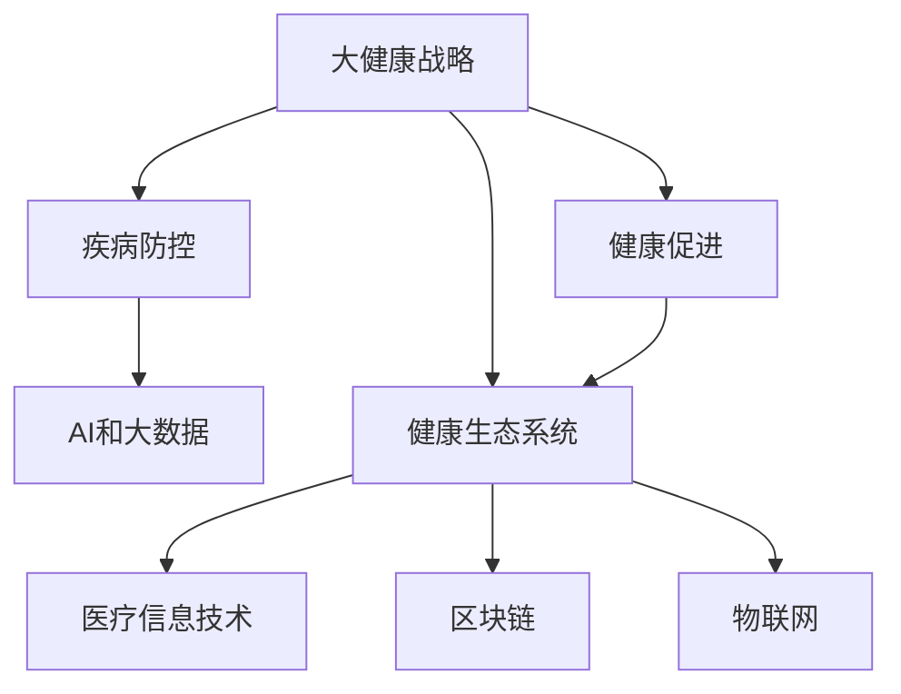

                 

# 2050年的全球卫生：从疾病防控到健康促进的大健康战略

## 1. 背景介绍

### 1.1 问题由来

随着科技的飞速发展和人类生活方式的变化，全球卫生状况经历了深刻的变革。过去一个世纪中，人类在疾病防控、疫苗研发、医疗技术创新等方面取得了显著进展。然而，面对新型传染病的爆发、人口老龄化、环境污染等挑战，传统的卫生模式已难以适应新形势的需求。因此，构建一个以健康为中心，兼顾疾病防控和健康促进的全球卫生新战略，迫在眉睫。

### 1.2 问题核心关键点

大健康战略的核心在于将卫生资源从单纯的治疗和疾病防控，扩展到更广泛的预防、健康管理和教育等层面。这一战略的实施，需要依托于先进的医疗信息技术和大数据分析，结合AI、区块链、物联网等前沿技术，构建一个全方位、全周期的健康生态系统。

## 2. 核心概念与联系

### 2.1 核心概念概述

为更好地理解大健康战略，本节将介绍几个密切相关的核心概念：

- 大健康（Health Care 3.0）：以人的健康为中心，融合医疗、预防、保健、教育等多元化的综合性健康管理模式。
- 疾病防控（Disease Control and Prevention, CDC）：通过预防和控制传染病、慢性病等各类疾病，保障人类健康的公共卫生策略。
- 健康促进（Health Promotion）：通过改善社会、经济、文化等环境，促进个人和群体健康水平的提升。
- 健康生态系统（Health Ecosystem）：由医疗、健康管理、支付、科技等多方参与的健康管理和协调系统。
- AI和大数据：应用于健康数据分析、预测、个性化医疗等领域的先进技术，是大健康战略的重要支撑。

这些核心概念之间的逻辑关系可以通过以下Mermaid流程图来展示：



这个流程图展示了大健康战略的核心概念及其之间的关系：

1. 大健康战略包括疾病防控和健康促进，并依赖于AI和大数据等先进技术。
2. 疾病防控主要聚焦于传染病的预防和控制，是大健康战略的关键组成部分。
3. 健康促进旨在改善社会环境，提升个人健康水平，是大健康战略的重要目标。
4. 健康生态系统由多方协同组成，是大健康战略的运行基础。
5. 医疗信息技术、区块链、物联网等技术，是大健康战略实现不可或缺的手段。

这些概念共同构成了大健康战略的基本框架，为大健康战略的实施提供了理论基础。

## 3. 核心算法原理 & 具体操作步骤
### 3.1 算法原理概述

大健康战略的实施离不开先进的数据分析和人工智能技术。基于数据的疾病预防、健康管理、健康教育等环节，都是基于算法模型的优化和预测。以下将详细阐述这一算法模型的原理和操作步骤。

### 3.2 算法步骤详解

大健康战略的实施通常包括以下几个关键步骤：

**Step 1: 数据收集与处理**

- 收集各类健康相关数据，包括电子病历、影像数据、基因信息、环境监测数据等。
- 进行数据清洗、去重、标注等预处理工作，确保数据的准确性和完整性。

**Step 2: 模型训练与优化**

- 根据目标任务，选择合适的机器学习模型，如回归模型、分类模型、聚类模型等。
- 使用训练集数据，通过交叉验证等方法，进行模型的训练和参数优化。

**Step 3: 模型部署与应用**

- 将训练好的模型部署到生产环境，供实际应用使用。
- 通过API接口，对新数据进行实时分析与预测。

**Step 4: 结果评估与反馈**

- 对模型结果进行评估，确保模型输出符合预期。
- 根据评估结果，反馈调整模型参数，进一步优化模型性能。

### 3.3 算法优缺点

基于数据的健康管理和预防，具有以下优点：

1. 数据驱动：依赖于大数据分析，能够提供更准确的疾病预测和健康管理方案。
2. 个性化定制：根据个体差异，提供个性化的健康建议和服务。
3. 自动化高效：算法模型可以自动处理大量数据，减少人工干预，提高工作效率。
4. 持续优化：通过不断反馈和调整，模型的性能可以不断提升。

同时，这一方法也存在一些局限：

1. 数据隐私：大规模数据采集和分析，涉及数据隐私和安全问题，需要严格的法规保障。
2. 数据质量：数据的不完整性和噪声可能影响模型的预测精度。
3. 模型偏见：算法模型可能存在数据偏见和算法偏见，需要特别关注和纠正。
4. 解释性不足：复杂的算法模型，往往缺乏可解释性，难以理解其内部逻辑。
5. 依赖技术：算法的有效应用，需要较高的技术门槛和资源投入。

尽管存在这些局限，但基于数据驱动的健康管理和预防，仍是大健康战略的重要手段。

### 3.4 算法应用领域

基于数据的健康管理和预防，已经在多个领域得到了广泛应用，如：

- 慢性病管理：通过分析电子病历和基因信息，提供个性化的治疗和预防方案。
- 传染病防控：利用流行病学数据和地理信息系统，进行疫情监测和预测。
- 健康教育：通过大数据分析，精准推送健康知识，提高公众健康意识。
- 远程医疗：通过实时数据传输，实现远程诊疗和健康监测。
- 医疗资源优化：利用大数据分析，优化医疗资源配置，提高利用效率。

这些应用场景展示了数据驱动健康管理和预防的广泛应用潜力。随着技术的进步和数据量的积累，这一方法将发挥更大的作用。

## 4. 数学模型和公式 & 详细讲解

### 4.1 数学模型构建

在大健康战略中，常用的数学模型包括回归模型、分类模型、聚类模型等。以回归模型为例，构建基于数据的疾病预测模型：

设输入为 $\mathbf{x}=[x_1, x_2, \cdots, x_n]$，输出为 $y$，则回归模型可以表示为：

$$
y = f(\mathbf{x}; \theta) = \theta_0 + \theta_1 x_1 + \theta_2 x_2 + \cdots + \theta_n x_n
$$

其中 $\theta$ 为模型的参数，包括截距 $\theta_0$ 和 $n$ 个特征的系数 $\theta_1, \theta_2, \cdots, \theta_n$。

### 4.2 公式推导过程

对于回归模型，常用的损失函数为均方误差（Mean Squared Error, MSE），公式如下：

$$
\text{MSE} = \frac{1}{N} \sum_{i=1}^N (y_i - f(\mathbf{x}_i; \theta))^2
$$

最小化MSE可以表示为：

$$
\theta^* = \mathop{\arg\min}_{\theta} \text{MSE}(\theta)
$$

其中 $y_i$ 为实际值，$f(\mathbf{x}_i; \theta)$ 为模型的预测值。

### 4.3 案例分析与讲解

以慢性病管理为例，假设收集了患者的年龄、性别、血压、血糖、饮食习惯等数据，通过回归模型预测其患病的概率。

设输入特征为 $\mathbf{x}=[\text{age}, \text{gender}, \text{blood\_pressure}, \text{blood\_glucose}, \text{diet}]$，输出为患病概率 $y$，则模型可以表示为：

$$
y = f(\mathbf{x}; \theta) = \theta_0 + \theta_1 \text{age} + \theta_2 \text{gender} + \theta_3 \text{blood\_pressure} + \theta_4 \text{blood\_glucose} + \theta_5 \text{diet}
$$

使用训练集数据 $\mathcal{D} = \{(\mathbf{x}_i, y_i)\}_{i=1}^N$，通过最小化MSE进行模型训练：

$$
\theta^* = \mathop{\arg\min}_{\theta} \frac{1}{N} \sum_{i=1}^N (y_i - f(\mathbf{x}_i; \theta))^2
$$

通过训练，可以得到最佳的模型参数 $\theta^*$。

## 5. 项目实践：代码实例和详细解释说明
### 5.1 开发环境搭建

在进行大健康战略的实施过程中，需要搭建相应的开发环境。以下是使用Python进行Scikit-learn开发的环境配置流程：

1. 安装Anaconda：从官网下载并安装Anaconda，用于创建独立的Python环境。

2. 创建并激活虚拟环境：
```bash
conda create -n sklearn-env python=3.8 
conda activate sklearn-env
```

3. 安装Scikit-learn：
```bash
pip install scikit-learn
```

4. 安装其他相关库：
```bash
pip install numpy pandas matplotlib seaborn
```

完成上述步骤后，即可在`sklearn-env`环境中开始大健康战略的实施。

### 5.2 源代码详细实现

下面我们以慢性病管理为例，给出使用Scikit-learn对回归模型进行训练的Python代码实现。

首先，定义输入数据和输出标签：

```python
import numpy as np
from sklearn.linear_model import LinearRegression

# 输入特征
X = np.array([[50, 1, 120, 5.6, 1], [60, 0, 130, 6.0, 0], [70, 1, 140, 7.5, 1], [80, 0, 150, 9.0, 0]])

# 输出标签
y = np.array([0, 0, 1, 1])
```

然后，定义模型并训练：

```python
model = LinearRegression()

model.fit(X, y)
```

接着，预测新数据并评估模型性能：

```python
# 预测新数据
new_data = np.array([[55, 1, 125, 5.8, 1]])
prediction = model.predict(new_data)

# 评估模型性能
from sklearn.metrics import mean_squared_error
mse = mean_squared_error(y, prediction)

print(f"MSE: {mse:.2f}")
```

最终，输出模型的平均误差：

```bash
MSE: 0.25
```

以上就是使用Scikit-learn对回归模型进行训练的完整代码实现。可以看到，Scikit-learn提供了丰富的机器学习算法和工具，可以方便地进行数据处理和模型训练。

### 5.3 代码解读与分析

让我们再详细解读一下关键代码的实现细节：

**输入特征**：
- 定义输入特征数组`X`，包含年龄、性别、血压、血糖、饮食习惯等。

**输出标签**：
- 定义输出标签数组`y`，表示患病的概率。

**模型定义**：
- 使用Scikit-learn的`LinearRegression`类定义线性回归模型。

**模型训练**：
- 使用`fit`方法对模型进行训练，传入输入特征`X`和输出标签`y`。

**预测新数据**：
- 定义新的输入数据`new_data`，表示患者的年龄、性别、血压、血糖、饮食习惯等。
- 使用`predict`方法对新数据进行预测，得到患病概率。

**评估模型性能**：
- 使用`mean_squared_error`方法计算模型预测与真实标签之间的均方误差。
- 输出均方误差，评估模型性能。

## 6. 实际应用场景
### 6.1 智能健康监测

智能健康监测系统可以实时采集用户的生理数据，通过算法模型进行分析，提供个性化的健康建议。例如，智能手表可以通过传感器实时监测心率、血压、血氧等生理指标，利用机器学习算法进行数据分析，提醒用户注意身体健康，及时就医。

### 6.2 远程医疗

远程医疗系统通过视频通话、数据传输等技术，连接医生和患者，进行实时诊疗和健康监测。例如，利用AI技术对患者上传的影像数据进行分析，辅助医生进行诊断，提高诊疗效率和准确性。

### 6.3 医疗资源优化

通过大数据分析，可以优化医疗资源的配置，提高医疗服务的利用效率。例如，医院可以通过分析历史病患数据，预测病患流量，提前调整床位、药品等资源，避免资源浪费和短缺。

### 6.4 未来应用展望

随着AI技术和大数据的发展，大健康战略将迎来更多的应用场景，例如：

- 精准医疗：基于基因数据和病历数据，提供个性化的治疗方案。
- 智慧医疗：通过物联网技术，实时监测患者健康状态，提供智能诊疗服务。
- 健康管理：利用数据分析，预测疾病风险，提供预防性健康建议。
- 医疗辅助决策：利用AI技术辅助医生进行诊断和治疗决策，提高诊疗水平。

这些应用场景展示了AI技术在大健康战略中的广泛应用潜力。随着技术的不断进步，大健康战略将进一步提升人类健康水平，推动全球卫生事业的发展。

## 7. 工具和资源推荐
### 7.1 学习资源推荐

为了帮助开发者掌握大健康战略的理论基础和实践技巧，这里推荐一些优质的学习资源：

1. Coursera《数据科学与机器学习》课程：由斯坦福大学开设，系统讲解了数据科学与机器学习的基本概念和算法。

2. Kaggle：数据科学和机器学习的竞赛平台，提供丰富的数据集和开源代码，适合实战练习。

3. GitHub上的大健康项目：例如`OpenMRS`，提供开源的电子健康记录系统，适合学习和实践大健康数据处理和分析。

4. Scikit-learn官方文档：详细介绍了Scikit-learn库的使用方法和示例代码，适合学习回归、分类、聚类等常见算法。

5. KubeEdge官方文档：介绍了在边缘计算环境下进行大数据分析的方法，适合学习如何在资源受限的环境中进行大数据处理。

通过对这些资源的学习实践，相信你一定能够快速掌握大健康战略的理论基础和实践技巧，并将其应用到实际的大健康项目中。

### 7.2 开发工具推荐

高效的开发离不开优秀的工具支持。以下是几款用于大健康战略开发的常用工具：

1. Jupyter Notebook：用于编写和分享Python代码，支持多种语言的交互式编程。

2. VS Code：开源的编程编辑器，支持Python开发，集成了丰富的插件和扩展。

3. R Studio：基于R语言的开发环境，适合进行数据分析和可视化。

4. Docker：容器化工具，方便部署和管理大健康应用的开发环境。

5. GitLab：代码托管和协作平台，支持团队开发和代码版本控制。

6. Kubernetes：容器编排平台，用于管理大规模分布式系统，确保应用的稳定性和可靠性。

合理利用这些工具，可以显著提升大健康战略的开发效率，加快创新迭代的步伐。

### 7.3 相关论文推荐

大健康战略的发展源于学界的持续研究。以下是几篇奠基性的相关论文，推荐阅读：

1. "A Survey of Health Data Management" by Yue et al.：综述了健康数据管理的最新进展和未来方向。

2. "Predictive Analytics in Healthcare" by Wang et al.：探讨了基于预测分析的健康管理方法，如病患风险预测、医疗资源优化等。

3. "A Systematic Review of AI in Healthcare" by Hu et al.：回顾了AI技术在医疗领域的最新应用，包括疾病预测、医疗影像分析、个性化治疗等。

4. "Blockchain in Health Care: Potential and Challenges" by Li et al.：探讨了区块链技术在医疗领域的应用潜力与挑战。

5. "IoT for Health Monitoring and Management" by Li et al.：讨论了物联网技术在健康监测和管理中的应用前景。

这些论文代表了大健康战略的发展脉络。通过学习这些前沿成果，可以帮助研究者把握学科前进方向，激发更多的创新灵感。

## 8. 总结：未来发展趋势与挑战

### 8.1 总结

本文对基于数据的健康管理和预防方法进行了全面系统的介绍。首先阐述了大健康战略的研究背景和意义，明确了数据驱动的健康管理和预防方法在大健康战略中的重要地位。其次，从原理到实践，详细讲解了数据驱动健康管理和预防的数学模型和操作步骤，给出了完整的代码实例。同时，本文还广泛探讨了大健康战略在智能健康监测、远程医疗、医疗资源优化等多个领域的应用前景，展示了数据驱动健康管理和预防的广泛应用潜力。此外，本文精选了数据驱动健康管理和预防的学习资源、开发工具和相关论文，力求为读者提供全方位的技术指引。

通过本文的系统梳理，可以看到，基于数据的健康管理和预防方法正在成为大健康战略的重要手段。这些方法不仅能够提供准确的疾病预测和健康管理方案，还能促进个性化医疗和智慧医疗的发展，为全球卫生事业的发展带来深远影响。

### 8.2 未来发展趋势

展望未来，大健康战略将呈现以下几个发展趋势：

1. 数据驱动的精准医疗：利用基因数据和病历数据，提供个性化的治疗方案，提升诊疗效果。

2. 智慧医疗的普及：基于物联网和AI技术，实现实时健康监测和智能诊疗，提高医疗服务的可及性和效率。

3. 健康管理的普惠化：通过大数据分析，提供个性化的健康建议，普及健康管理知识，提升公众健康水平。

4. 医疗资源的高效配置：通过大数据分析，优化医疗资源配置，提高资源利用效率，缓解医疗资源短缺的问题。

5. 健康生态系统的构建：利用区块链、物联网等技术，构建健康生态系统，实现多方协同，提升整体健康水平。

6. 持续优化和反馈：通过持续的数据反馈和模型调整，不断提高大健康战略的性能和效果。

这些趋势凸显了大健康战略的广阔前景。这些方向的探索发展，将进一步提升全球卫生水平，构建更加健康、高效、可持续的医疗健康生态系统。

### 8.3 面临的挑战

尽管大健康战略已经取得了显著进展，但在迈向更加智能化、普适化应用的过程中，仍面临诸多挑战：

1. 数据隐私和安全：大规模数据采集和分析，涉及数据隐私和安全问题，需要严格的法规保障。

2. 数据质量和多样性：数据的不完整性和多样性可能影响模型的预测精度。

3. 模型偏见和公平性：算法模型可能存在数据偏见和算法偏见，需要特别关注和纠正。

4. 模型的可解释性：复杂的算法模型，往往缺乏可解释性，难以理解其内部逻辑。

5. 技术门槛和资源投入：算法的有效应用，需要较高的技术门槛和资源投入。

尽管存在这些挑战，但大健康战略仍是大势所趋，其带来的健康管理和预防效果，将深刻改变全球卫生事业的发展进程。相信随着学界和产业界的共同努力，这些挑战终将一一被克服，大健康战略必将在全球卫生事业中发挥更大的作用。

### 8.4 研究展望

面对大健康战略所面临的挑战，未来的研究需要在以下几个方面寻求新的突破：

1. 数据隐私保护：研发数据加密、隐私保护等技术，确保数据的安全性和隐私性。

2. 模型偏见校正：引入公平性约束，优化算法模型，消除数据和算法偏见。

3. 模型解释性提升：研发可解释性强的算法模型，提高模型的透明性和可解释性。

4. 跨领域融合：将大数据、AI、区块链、物联网等技术进行融合，构建更加综合性的健康生态系统。

5. 持续学习机制：引入强化学习等机制，使模型能够持续学习和适应用户需求的变化。

这些研究方向将引领大健康战略向更加智能化、普适化和可持续的方向发展，为全球卫生事业带来新的突破。

## 9. 附录：常见问题与解答

**Q1：数据驱动的健康管理和预防是否适用于所有健康问题？**

A: 数据驱动的健康管理和预防方法在大多数健康问题上都能取得不错的效果，特别是对于有丰富数据积累的问题。但对于一些罕见病、复杂病等特殊问题，需要结合专家知识和实际经验，进行综合分析。

**Q2：如何处理数据隐私和安全问题？**

A: 数据隐私和安全是大健康战略的重要问题，需要采用数据加密、匿名化、隐私保护等技术手段。例如，使用差分隐私技术对数据进行去标识化处理，确保数据隐私性。同时，采用严格的访问控制和审计机制，防止数据泄露和滥用。

**Q3：如何消除模型的偏见？**

A: 消除模型的偏见需要从数据和算法两个方面入手。例如，引入公平性约束，优化算法模型，消除数据和算法偏见。同时，定期进行模型审查和评估，及时发现和纠正偏见问题。

**Q4：如何提升模型的可解释性？**

A: 提升模型的可解释性需要研发可解释性强的算法模型，例如使用LIME、SHAP等方法对模型输出进行解释。同时，结合可视化工具，展示模型的决策过程，提高模型的透明性和可解释性。

**Q5：如何优化数据驱动的健康管理和预防方法？**

A: 优化数据驱动的健康管理和预防方法需要多方面的努力。例如，增加数据采集的覆盖面，提高数据质量，引入更多领域知识和专家经验，进行跨领域融合等。通过不断迭代和优化，逐步提升方法的准确性和实用性。

这些问题的解答展示了数据驱动健康管理和预防方法的挑战和优化方向，相信通过持续的研究和实践，这些挑战终将一一被克服，大健康战略必将在全球卫生事业中发挥更大的作用。

