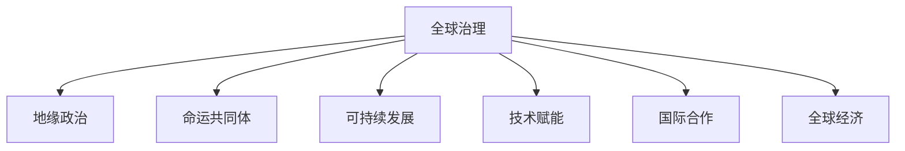

                 

# 2050年的全球治理：从地缘政治到全球命运共同体的理念更新

> 关键词：全球治理,地缘政治,命运共同体,可持续发展,技术赋能,国际合作,全球经济

## 1. 背景介绍

### 1.1 问题由来
随着全球化的深入发展，各国之间的联系日益紧密，国家间合作和竞争关系变得更加复杂。传统的地缘政治格局正面临前所未有的挑战和变革，世界秩序的重构迫在眉睫。如何在日益复杂多变的国际环境中，构建一个公正、公平、可持续的全球治理体系，成为全球各界关注的焦点。

### 1.2 问题核心关键点
2050年的全球治理核心在于构建一个基于互利共赢的全球命运共同体，这是面向未来全球秩序的重构，涵盖了经济、政治、安全、环境等多个领域。其关键点包括：
- 推动全球经济一体化，实现公平的资源分配和共享。
- 建立公正的国际秩序，维护国际法和多边机制。
- 加强全球合作，共同应对气候变化、疫情等全球性挑战。
- 推动技术赋能，利用数字化手段提升治理效率和透明度。
- 促进文化交流，增强国际间的相互理解和信任。

### 1.3 问题研究意义
研究2050年的全球治理体系，对于探索未来全球秩序的重构，推动全球合作与发展，具有重要的理论和实践意义。通过系统性地思考全球治理的演进趋势，可以为应对未来挑战提供理论指导和实践方案。

## 2. 核心概念与联系

### 2.1 核心概念概述

为更好地理解2050年全球治理的理念更新，本节将介绍几个关键概念：

- **全球治理**：指国际社会通过合作与协调，共同管理全球公共事务的过程。包括国际组织、国家政府、非政府组织等多种参与主体。
- **地缘政治**：指国家或地区之间的力量对比、利益冲突和战略互动。传统地缘政治关注权力争夺和国家安全。
- **命运共同体**：指国家间共同面对全球性挑战，共享命运，互利共赢的合作关系。
- **可持续发展**：指在满足当代人需求的同时，不损害后代人满足需求的能力。
- **技术赋能**：指利用先进技术手段，提升全球治理的效率、透明度和公平性。
- **国际合作**：指国家间在经济、政治、安全、环境等多领域的合作与协作。
- **全球经济**：指全球范围内的经济活动和资源流动，涵盖贸易、投资、金融等多个方面。

这些概念之间的逻辑关系可以通过以下Mermaid流程图来展示：



这个流程图展示了大语言模型的核心概念及其之间的关系：

1. 全球治理是地缘政治、命运共同体、可持续发展、技术赋能、国际合作和全球经济等概念的框架。
2. 地缘政治是全球治理的一部分，影响国际关系和冲突。
3. 命运共同体是全球治理的目标，体现互利共赢的原则。
4. 可持续发展是全球治理的重要方向，关注环境保护和公平。
5. 技术赋能是全球治理的手段，提升治理效率和透明度。
6. 国际合作是全球治理的基础，促进多边机制和共同发展。
7. 全球经济是全球治理的驱动力，推动全球资源分配和共享。

## 3. 核心算法原理 & 具体操作步骤
### 3.1 算法原理概述

2050年的全球治理体系构建，遵循的是“以人为中心”的理念，强调通过技术赋能、多边合作、共同发展来实现全球命运共同体的构建。其核心思想是通过算法和数据，提升全球治理的效率和透明度，实现公平的资源分配和共享。

### 3.2 算法步骤详解

构建2050年全球治理体系的过程包括以下几个关键步骤：

**Step 1: 构建全球治理模型**

- **数据收集与处理**：收集全球范围内的政治、经济、环境等数据，进行清洗和处理，确保数据的准确性和完整性。
- **特征工程**：根据全球治理的目标和问题，提取关键特征，如经济增长、环境指标、社会公平等。
- **模型构建**：选择合适的算法，如回归模型、分类模型、聚类模型等，构建全球治理模型。

**Step 2: 评估模型效果**

- **数据验证**：使用历史数据进行模型验证，确保模型能够准确预测未来趋势。
- **性能评估**：使用各种指标评估模型效果，如均方误差、准确率、召回率等。
- **模型优化**：根据评估结果，对模型进行优化，提升模型的预测精度和稳定性。

**Step 3: 应用模型进行全球治理**

- **政策制定**：根据模型的预测结果，制定相应的政策措施。
- **资源分配**：利用模型进行全球资源分配，确保公平性和可持续性。
- **监督与反馈**：建立监督和反馈机制，及时调整政策，确保政策实施效果。

**Step 4: 推动全球合作**

- **多边机制**：建立多边合作机制，促进各国在全球治理中的协调与合作。
- **文化交流**：推动文化交流，增强国际间的相互理解和信任。
- **技术支持**：提供技术支持，帮助各国提升治理能力。

### 3.3 算法优缺点

构建2050年全球治理体系的算法具有以下优点：
1. 数据驱动：通过大规模数据驱动模型构建，确保模型的预测准确性。
2. 透明度高：使用公开数据和算法，确保治理过程的透明性和可信度。
3. 效率高：通过技术赋能，提升全球治理的效率和效果。
4. 公平性强：利用模型进行资源分配，确保全球治理的公平性和可持续性。

同时，该算法也存在一定的局限性：
1. 数据依赖性强：模型的预测效果依赖于数据的准确性和完整性。
2. 模型复杂度高：大规模数据和复杂算法的应用，对计算资源和时间成本提出了较高要求。
3. 政策执行困难：模型预测结果需结合政策制定，但政策执行可能面临政治、经济、社会等多重因素的制约。
4. 伦理与安全问题：模型的应用可能涉及隐私、数据安全等问题，需要建立相应的伦理和安全保障机制。

尽管存在这些局限性，但就目前而言，构建基于数据的全球治理体系仍是解决全球治理问题的重要途径。未来相关研究的重点在于如何进一步优化算法模型，降低数据依赖，提高模型的公平性和鲁棒性，同时兼顾伦理与安全问题。

### 3.4 算法应用领域

2050年的全球治理体系构建，适用于多个领域，包括：

- **全球经济治理**：利用模型进行全球经济预测和资源分配，促进公平的全球经济一体化。
- **国际安全合作**：通过模型分析全球安全威胁，推动多边安全合作机制的建立。
- **环境保护与气候变化**：利用模型进行环境监测和气候预测，制定全球环境治理策略。
- **公共卫生合作**：利用模型分析疫情发展趋势，推动全球公共卫生合作机制的建立。
- **文化交流与合作**：利用模型促进国际间的文化交流与理解，增强国际信任。

## 4. 数学模型和公式 & 详细讲解 & 举例说明

### 4.1 数学模型构建

构建2050年全球治理体系的核心是构建一个能够预测全球治理效果的数学模型。这里以全球经济治理为例，构建一个基于线性回归的模型。

假设全球经济指标为 $X_i$，全球治理效果为 $Y$，则线性回归模型可表示为：

$$
Y = \beta_0 + \beta_1 X_1 + \beta_2 X_2 + \ldots + \beta_n X_n + \epsilon
$$

其中，$\beta_i$ 为回归系数，$\epsilon$ 为误差项。

### 4.2 公式推导过程

根据最小二乘法原理，回归系数 $\beta_i$ 的求解公式为：

$$
\beta_i = \frac{\sum_{i=1}^N (X_i - \bar{X})(Y_i - \bar{Y})}{\sum_{i=1}^N (X_i - \bar{X})^2}
$$

其中，$\bar{X}$ 和 $\bar{Y}$ 分别为 $X$ 和 $Y$ 的均值。

将公式代入上述线性回归模型，即可得到回归系数的求解公式。通过求解该公式，可以确定各个经济指标对全球治理效果的影响权重。

### 4.3 案例分析与讲解

假设我们收集了全球经济指标数据 $X = [GDP_{i1}, GDP_{i2}, GDP_{i3}, \ldots, GDP_{in}]$，其中 $GDP_{ij}$ 为第 $i$ 国的第 $j$ 年GDP数据。

利用收集到的数据，我们可以构建全球治理效果 $Y$ 的预测模型。在模型训练阶段，我们分别将 $X$ 和 $Y$ 标准化处理，以提升模型收敛速度和预测精度。

通过求解回归系数 $\beta_i$，可以得到经济指标对全球治理效果的影响权重。例如，如果 $\beta_1$ 表示GDP对全球治理效果的影响权重，则 $GDP_{i1}$ 对 $Y$ 的影响可以表示为：

$$
Y_i = \beta_1 X_{i1} + \beta_0
$$

## 5. 项目实践：代码实例和详细解释说明

### 5.1 开发环境搭建

在进行全球治理模型构建和训练时，我们需要准备好开发环境。以下是使用Python进行数据分析和模型训练的环境配置流程：

1. 安装Anaconda：从官网下载并安装Anaconda，用于创建独立的Python环境。

2. 创建并激活虚拟环境：
```bash
conda create -n global-governance python=3.8 
conda activate global-governance
```

3. 安装必要的Python库：
```bash
pip install pandas numpy scikit-learn statsmodels seaborn
```

4. 准备数据集：
- 收集全球经济指标数据和全球治理效果数据，存储为CSV格式。
- 使用Python中的Pandas库进行数据清洗和处理。

5. 启动Jupyter Notebook：
```bash
jupyter notebook
```

### 5.2 源代码详细实现

下面我们以全球经济治理为例，给出使用Python构建和训练线性回归模型的代码实现。

首先，定义模型：

```python
import statsmodels.api as sm
import pandas as pd
import numpy as np

# 定义回归模型
def global_economy_model(data, target):
    X = data.drop(target, axis=1)
    Y = data[target]
    model = sm.OLS(Y, X)
    results = model.fit()
    return results
```

然后，加载数据集：

```python
# 加载数据集
data = pd.read_csv('global_economy.csv')

# 选择经济指标和目标变量
X = data[['GDP', 'GNI']]
Y = data['GDP_growth']
```

接着，构建和训练模型：

```python
# 构建模型
results = global_economy_model(X, Y)

# 输出回归系数
print(results.params)
```

最后，评估模型效果：

```python
# 评估模型效果
y_pred = results.predict(X)
print(np.mean((y_pred - Y) ** 2))
```

以上就是使用Python构建和训练线性回归模型的完整代码实现。可以看到，Python和Pandas库的封装使得模型构建和训练的过程变得简洁高效。

### 5.3 代码解读与分析

让我们再详细解读一下关键代码的实现细节：

**global_economy_model函数**：
- 定义了一个简单的线性回归模型，使用了statsmodels库中的OLS类。
- 将自变量和因变量作为输入，返回模型训练结果。

**数据加载**：
- 使用Pandas库加载CSV格式的数据集。
- 根据任务需求，选择相应的经济指标和目标变量。

**模型构建与训练**：
- 调用global_economy_model函数，构建线性回归模型。
- 使用OLS类训练模型，得到回归系数。
- 使用predict方法进行预测，并计算预测结果与实际值的均方误差。

**结果输出**：
- 输出回归系数，以分析各个经济指标对全球治理效果的影响。
- 输出均方误差，评估模型的预测精度。

可以看出，Python和Pandas库为数据处理和模型构建提供了强大的支持，使得模型训练的过程变得高效便捷。

当然，在实际应用中，还需要对模型进行进一步的调参和优化，以提升预测精度和稳定性。此外，模型的解释和可解释性也需要进一步提升，以增强其可信度和透明度。

## 6. 实际应用场景

### 6.1 全球经济治理

基于构建的全球经济治理模型，可以为全球资源分配和公平性提供决策支持。例如，模型可以预测各国经济增长的趋势，帮助国际组织进行全球资源分配，确保资源分配的公平性和可持续性。

在技术实现上，可以定期收集全球经济数据，输入模型进行预测，并结合各国政策和经济情况，制定全球经济治理策略。通过这样的方式，可以在全球范围内实现资源的高效分配和共享。

### 6.2 国际安全合作

全球治理体系构建，同样适用于国际安全合作领域。通过模型分析全球安全威胁，可以制定更为科学、合理的安全策略。

例如，模型可以预测全球恐怖主义、网络安全等安全威胁的发展趋势，帮助各国制定相应的安全措施。通过多边合作机制，各国可以共同应对全球性安全挑战，提升全球安全水平。

### 6.3 环境保护与气候变化

全球治理体系构建，还可以应用于环境保护与气候变化领域。通过模型分析全球环境指标，制定环境保护和气候变化应对策略。

例如，模型可以预测全球气候变化的趋势，帮助各国制定碳减排和环境保护政策。通过国际合作和政策协调，各国可以共同应对气候变化，实现可持续发展。

### 6.4 公共卫生合作

全球治理体系构建，同样适用于公共卫生合作领域。通过模型分析疫情发展趋势，可以制定更为科学、合理的公共卫生策略。

例如，模型可以预测全球疫情的传播趋势，帮助各国制定相应的公共卫生措施。通过多边合作机制，各国可以共同应对疫情威胁，提升全球公共卫生水平。

## 7. 工具和资源推荐

### 7.1 学习资源推荐

为了帮助开发者系统掌握全球治理的理论基础和实践技巧，这里推荐一些优质的学习资源：

1. **《全球治理概论》系列书籍**：深入探讨全球治理的理论基础和实践应用，提供丰富的案例和政策建议。
2. **《全球治理框架》课程**：由国际知名学者授课，介绍全球治理的框架和机制，适合学术研究和政策制定。
3. **《全球治理在线资源库》**：提供大量关于全球治理的学术论文和政策报告，方便查找和学习。

通过对这些资源的学习实践，相信你一定能够快速掌握全球治理的精髓，并用于解决实际的全球治理问题。

### 7.2 开发工具推荐

高效的开发离不开优秀的工具支持。以下是几款用于全球治理模型开发的常用工具：

1. **Jupyter Notebook**：交互式的Python代码编辑器，方便进行数据处理和模型构建。
2. **Pandas**：数据处理和分析库，提供强大的数据清洗和处理功能。
3. **NumPy**：数学计算库，支持大规模数据的矩阵运算和数值分析。
4. **Scikit-learn**：机器学习库，提供丰富的算法和模型实现。
5. **Statsmodels**：统计分析库，提供多种统计模型和工具。

合理利用这些工具，可以显著提升全球治理模型开发的效率，加快创新迭代的步伐。

### 7.3 相关论文推荐

全球治理体系的研究源于学界的持续探索。以下是几篇奠基性的相关论文，推荐阅读：

1. **《全球治理的理论与实践》**：介绍了全球治理的基本理论和方法，探讨了全球治理的实践应用。
2. **《全球治理的未来》**：探讨了全球治理的发展趋势和未来方向，提出了全球治理的创新思路。
3. **《全球治理中的多边合作》**：研究了多边合作机制在实现全球治理中的作用和意义。
4. **《全球治理的技术支撑》**：探讨了技术赋能在全球治理中的重要性和应用场景。

这些论文代表了大语言模型微调技术的发展脉络。通过学习这些前沿成果，可以帮助研究者把握学科前进方向，激发更多的创新灵感。

## 8. 总结：未来发展趋势与挑战

### 8.1 总结

本文对构建2050年全球治理体系的方法进行了全面系统的介绍。首先阐述了全球治理的背景和核心概念，明确了全球命运共同体的构建理念。其次，从原理到实践，详细讲解了全球治理模型的构建步骤，给出了模型训练的完整代码实现。同时，本文还广泛探讨了全球治理模型在多个领域的应用场景，展示了其广泛的应用前景。此外，本文精选了全球治理的相关学习资源，力求为读者提供全方位的技术指引。

通过本文的系统梳理，可以看到，构建基于数据的全球治理体系是解决全球治理问题的有效途径。未来，伴随模型算法和数据技术的不断进步，全球治理体系必将在全球合作与发展中发挥更大作用。

### 8.2 未来发展趋势

展望未来，全球治理体系将呈现以下几个发展趋势：

1. **数据驱动**：全球治理将更加依赖大数据和机器学习算法，提升治理的科学性和精确性。
2. **多边合作**：全球治理将更加注重多边合作机制，增强国际社会的协同效应。
3. **技术赋能**：全球治理将更加依赖技术手段，提升治理的效率和透明度。
4. **可持续发展**：全球治理将更加注重可持续发展，平衡经济发展与环境保护。
5. **文化交流**：全球治理将更加注重文化交流，增强国际社会的相互理解和信任。
6. **智能治理**：全球治理将更加注重智能治理，利用AI等技术提升治理能力。

以上趋势凸显了全球治理的演进方向，为未来全球治理体系的重构提供了理论指导和实践方案。

### 8.3 面临的挑战

尽管全球治理体系构建已经取得了一定进展，但在迈向更加智能化、普适化应用的过程中，它仍面临着诸多挑战：

1. **数据质量问题**：模型的预测效果依赖于数据的准确性和完整性。如何获取高质量的数据，是一个重要的挑战。
2. **模型复杂性**：大规模数据的处理和复杂算法的应用，对计算资源和时间成本提出了较高要求。如何降低模型复杂性，是一个重要的研究方向。
3. **政策执行困难**：模型预测结果需结合政策制定，但政策执行可能面临政治、经济、社会等多重因素的制约。如何提高政策的执行效果，是一个重要的挑战。
4. **伦理与安全问题**：模型的应用可能涉及隐私、数据安全等问题，需要建立相应的伦理和安全保障机制。

尽管存在这些挑战，但全球治理体系构建仍然具有广阔的前景。未来相关研究的重点在于如何进一步优化算法模型，降低数据依赖，提高模型的公平性和鲁棒性，同时兼顾伦理与安全问题。

### 8.4 研究展望

面对全球治理体系构建所面临的挑战，未来的研究需要在以下几个方面寻求新的突破：

1. **探索无监督和半监督学习**：摆脱对大规模标注数据的依赖，利用自监督学习、主动学习等无监督和半监督范式，最大限度利用非结构化数据，实现更加灵活高效的治理。
2. **开发参数高效的模型**：开发更加参数高效的模型，在固定大部分预训练参数的同时，只更新极少量的任务相关参数。
3. **融合因果分析和博弈论**：通过引入因果推断和博弈论思想，增强治理模型建立稳定因果关系的能力，学习更加普适、鲁棒的语言表征，从而提升模型泛化性和抗干扰能力。
4. **引入更多先验知识**：将符号化的先验知识，如知识图谱、逻辑规则等，与神经网络模型进行巧妙融合，引导治理过程学习更准确、合理的语言模型。
5. **结合因果分析和博弈论工具**：将因果分析方法引入治理模型，识别出治理决策的关键特征，增强输出解释的因果性和逻辑性。借助博弈论工具刻画人机交互过程，主动探索并规避治理模型的脆弱点，提高系统稳定性。
6. **纳入伦理道德约束**：在治理目标中引入伦理导向的评估指标，过滤和惩罚有偏见、有害的输出倾向。加强人工干预和审核，建立治理行为的监管机制，确保输出符合人类价值观和伦理道德。

这些研究方向的探索，必将引领全球治理体系构建技术迈向更高的台阶，为构建安全、可靠、可解释、可控的治理系统铺平道路。面向未来，全球治理体系构建还需要与其他人工智能技术进行更深入的融合，如知识表示、因果推理、强化学习等，多路径协同发力，共同推动治理技术的进步。只有勇于创新、敢于突破，才能不断拓展治理体系的边界，让治理技术更好地服务于全球合作与发展。

## 9. 附录：常见问题与解答

**Q1：全球治理体系构建是否适用于所有国家？**

A: 全球治理体系构建适用于大多数国家，但对于一些小国或政治体制不同的国家，可能面临一定的困难。需要在治理体系设计时，充分考虑各国的国情和治理需求，确保治理的公平性和普适性。

**Q2：全球治理模型如何避免数据偏见？**

A: 为了避免数据偏见，可以采取以下措施：
1. 选择具有代表性的数据集，确保数据的多样性和全面性。
2. 对数据进行预处理，去除异常值和噪声，确保数据的准确性。
3. 在模型训练时，引入正则化和公平性约束，防止模型学习偏见。
4. 定期进行模型评估和更新，确保模型的公平性和鲁棒性。

**Q3：如何提高全球治理模型的可解释性？**

A: 为了提高全球治理模型的可解释性，可以采取以下措施：
1. 使用解释性较强的模型，如线性回归、决策树等。
2. 对模型进行可视化分析，理解模型决策的逻辑和特征重要性。
3. 引入领域专家的知识，提高模型输出的可信度和透明度。
4. 在模型训练时，引入可解释性约束，确保模型输出的可解释性。

**Q4：全球治理模型在落地部署时需要注意哪些问题？**

A: 将全球治理模型转化为实际应用，还需要考虑以下因素：
1. 模型裁剪：去除不必要的层和参数，减小模型尺寸，加快推理速度。
2. 量化加速：将浮点模型转为定点模型，压缩存储空间，提高计算效率。
3. 服务化封装：将模型封装为标准化服务接口，便于集成调用。
4. 弹性伸缩：根据请求流量动态调整资源配置，平衡服务质量和成本。
5. 监控告警：实时采集系统指标，设置异常告警阈值，确保服务稳定性。

全球治理模型的应用还需要考虑伦理、安全和隐私等问题，需要在模型设计时进行充分的考虑和保障。

---

作者：禅与计算机程序设计艺术 / Zen and the Art of Computer Programming

