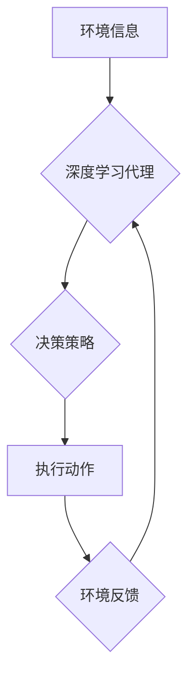

> 深度学习、代理决策、强化学习、神经网络、决策流程优化

## 1. 背景介绍

在当今数据爆炸的时代，人工智能（AI）正以惊人的速度发展，深度学习作为AI的核心技术之一，在图像识别、自然语言处理、语音识别等领域取得了突破性的进展。然而，深度学习在决策领域的应用还处于探索阶段。深度学习代理，即利用深度学习算法训练智能代理，使其能够在复杂环境中做出智能决策，是未来AI发展的重要方向之一。

传统的代理决策方法主要依赖于规则或模型，但这些方法难以应对复杂、动态的环境。深度学习代理能够学习环境的复杂关系，并通过强化学习算法不断优化决策策略，从而在动态环境中做出更优的决策。

## 2. 核心概念与联系

**2.1 深度学习代理**

深度学习代理是指利用深度学习算法训练的智能代理，它能够通过学习环境信息和用户反馈，并利用强化学习算法不断优化决策策略，从而在复杂环境中做出智能决策。

**2.2 强化学习**

强化学习是一种机器学习方法，它通过奖励和惩罚机制来训练智能代理，使其能够在环境中学习最优的策略。强化学习的核心概念包括：

* **状态（State）:** 环境的当前状态。
* **动作（Action）:** 代理可以采取的动作。
* **奖励（Reward）:** 代理采取动作后获得的反馈。
* **策略（Policy）:** 代理根据当前状态选择动作的规则。

**2.3 决策流程优化**

决策流程优化是指通过改进决策流程，提高决策效率和准确性。深度学习代理可以帮助优化决策流程，通过学习历史数据和用户反馈，识别决策中的瓶颈和改进点，从而提高决策效率和准确性。

**2.4 Mermaid 流程图**



## 3. 核心算法原理 & 具体操作步骤

**3.1 算法原理概述**

深度学习代理决策流程的核心算法是强化学习算法，其中最常用的算法是深度强化学习（Deep Reinforcement Learning，DRL）。DRL算法将深度神经网络与强化学习算法相结合，能够学习复杂环境中的决策策略。

**3.2 算法步骤详解**

1. **环境建模:** 建立一个模拟真实环境的模型，包括状态空间、动作空间和奖励函数。
2. **代理初始化:** 初始化深度神经网络，作为代理的决策策略。
3. **训练循环:**
    * 代理根据当前状态选择动作。
    * 环境反馈代理采取动作后的奖励和下一个状态。
    * 代理利用强化学习算法更新决策策略，使其能够获得更高的奖励。
4. **评估和部署:** 在测试环境中评估代理的性能，并部署到实际应用场景中。

**3.3 算法优缺点**

**优点:**

* 能够学习复杂环境中的决策策略。
* 不需要人工设计规则，能够自动学习。
* 能够适应动态变化的环境。

**缺点:**

* 训练时间长，需要大量的训练数据。
* 容易陷入局部最优解。
* 难以解释代理的决策过程。

**3.4 算法应用领域**

* **机器人控制:** 训练机器人自主导航、避障、抓取等行为。
* **游戏AI:** 训练游戏中的AI对手，使其能够与人类玩家进行对抗。
* **金融投资:** 训练智能代理进行股票交易、风险管理等。
* **医疗诊断:** 训练智能代理辅助医生进行疾病诊断和治疗方案制定。

## 4. 数学模型和公式 & 详细讲解 & 举例说明

**4.1 数学模型构建**

深度学习代理决策流程可以建模为马尔可夫决策过程（Markov Decision Process，MDP）。MDP由以下要素组成：

* 状态空间 S: 环境可能的状态集合。
* 动作空间 A: 代理可以采取的动作集合。
* 转移概率矩阵 P: 描述从一个状态到另一个状态的概率。
* 奖励函数 R: 描述代理采取动作后获得的奖励。
* 策略 π: 描述代理在每个状态下选择动作的策略。

**4.2 公式推导过程**

强化学习的目标是找到最优策略 π*, 使得代理在长期的奖励总和最大化。最优策略可以通过动态规划算法或蒙特卡罗方法求解。

**Bellman方程:**

$$
V^{\pi}(s) = \max_{a \in A} \left[ R(s, a) + \gamma \sum_{s' \in S} P(s' | s, a) V^{\pi}(s') \right]
$$

其中:

* $V^{\pi}(s)$ 是状态 s 下按照策略 π 的价值函数。
* $R(s, a)$ 是代理在状态 s 采取动作 a 后获得的奖励。
* $\gamma$ 是折扣因子，控制未来奖励的权重。
* $P(s' | s, a)$ 是从状态 s 采取动作 a 到状态 s' 的转移概率。

**4.3 案例分析与讲解**

例如，训练一个智能代理玩游戏，我们可以将游戏环境建模为 MDP。状态空间包括游戏中的所有可能的场景，动作空间包括游戏中的所有可能的行动，奖励函数则根据游戏规则定义，例如获得分数奖励，被击杀惩罚等。通过训练深度强化学习模型，代理可以学习到最优的策略，从而在游戏中取得胜利。

## 5. 项目实践：代码实例和详细解释说明

**5.1 开发环境搭建**

* Python 3.x
* TensorFlow 或 PyTorch 深度学习框架
* OpenAI Gym 游戏环境

**5.2 源代码详细实现**

```python
import gym
import tensorflow as tf

# 定义深度神经网络模型
model = tf.keras.models.Sequential([
    tf.keras.layers.Dense(64, activation='relu', input_shape=(4,)),
    tf.keras.layers.Dense(64, activation='relu'),
    tf.keras.layers.Dense(2, activation='softmax')
])

# 定义强化学习算法
optimizer = tf.keras.optimizers.Adam()
loss_fn = tf.keras.losses.CategoricalCrossentropy()

# 训练循环
for episode in range(1000):
    state = env.reset()
    done = False
    total_reward = 0

    while not done:
        # 选择动作
        action = model.predict(state.reshape(1, -1))[0]
        # 执行动作
        next_state, reward, done, _ = env.step(action)
        # 更新模型
        with tf.GradientTape() as tape:
            # 计算损失
            target = tf.one_hot(action, depth=2)
            loss = loss_fn(target, model.predict(state.reshape(1, -1)))
        # 反向传播
        gradients = tape.gradient(loss, model.trainable_variables)
        optimizer.apply_gradients(zip(gradients, model.trainable_variables))
        # 更新状态
        state = next_state
        total_reward += reward

    print(f"Episode {episode+1}, Total Reward: {total_reward}")

```

**5.3 代码解读与分析**

* 代码首先定义了深度神经网络模型，用于预测代理在每个状态下采取的动作。
* 然后定义了强化学习算法，使用 Adam 优化器和交叉熵损失函数。
* 训练循环中，代理与环境交互，根据环境反馈更新模型参数。
* 训练完成后，代理能够在环境中做出智能决策。

**5.4 运行结果展示**

训练完成后，代理能够在游戏环境中表现出智能行为，例如在游戏中取得胜利、避开障碍物等。

## 6. 实际应用场景

**6.1 智能机器人控制**

深度学习代理可以训练机器人自主导航、避障、抓取等行为，提高机器人工作效率和安全性。

**6.2 游戏AI**

深度学习代理可以训练游戏中的AI对手，使其能够与人类玩家进行对抗，提高游戏体验。

**6.3 金融投资**

深度学习代理可以训练智能代理进行股票交易、风险管理等，帮助投资者做出更优的投资决策。

**6.4 医疗诊断**

深度学习代理可以训练智能代理辅助医生进行疾病诊断和治疗方案制定，提高医疗诊断的准确性和效率。

**6.5 未来应用展望**

深度学习代理在未来将有更广泛的应用场景，例如自动驾驶、个性化教育、智能客服等。随着深度学习技术的不断发展，深度学习代理将成为人工智能领域的重要发展方向。

## 7. 工具和资源推荐

**7.1 学习资源推荐**

* **书籍:**
    * 深度学习
    * 强化学习：原理、算法和应用
* **在线课程:**
    * Coursera: 深度学习
    * Udacity: 强化学习
* **博客:**
    * OpenAI Blog
    * DeepMind Blog

**7.2 开发工具推荐**

* **深度学习框架:** TensorFlow, PyTorch
* **强化学习库:** OpenAI Gym, Stable Baselines3
* **编程语言:** Python

**7.3 相关论文推荐**

* Deep Reinforcement Learning: An Overview
* Mastering the Game of Go with Deep Neural Networks and Tree Search
* AlphaGo Zero: Mastering the Game of Go without Human Knowledge

## 8. 总结：未来发展趋势与挑战

**8.1 研究成果总结**

深度学习代理在过去几年取得了显著进展，在多个领域取得了突破性的成果。

**8.2 未来发展趋势**

* **更强大的模型:** 研究更强大的深度学习模型，例如Transformer、Generative Adversarial Networks (GANs) 等，提高代理的决策能力。
* **更有效的算法:** 研究更有效的强化学习算法，例如分布式强化学习、迁移学习等，提高代理的训练效率和泛化能力。
* **更安全的代理:** 研究更安全的深度学习代理，确保代理的行为符合人类的期望，并避免潜在的风险。

**8.3 面临的挑战**

* **数据获取和标注:** 深度学习代理需要大量的训练数据，获取和标注这些数据成本高昂。
* **训练效率:** 深度学习代理的训练时间长，需要大量的计算资源。
* **解释性:** 深度学习模型的决策过程难以解释，这使得代理的行为难以被理解和信任。

**8.4 研究展望**

未来，深度学习代理将继续朝着更强大、更安全、更可解释的方向发展，并在更多领域发挥重要作用。


## 9. 附录：常见问题与解答

**9.1 如何选择合适的深度学习框架？**

TensorFlow 和 PyTorch 是目前最流行的深度学习框架，选择哪个框架取决于个人喜好和项目需求。

* TensorFlow 更适合于生产环境，因为它具有更好的部署能力和可扩展性。
* PyTorch 更适合于研究和开发，因为它更加灵活和易于使用。

**9.2 如何获取训练数据？**

训练数据可以从公开数据集、Web 爬虫、传感器数据等多种渠道获取。

**9.3 如何评估深度学习代理的性能？**

深度学习代理的性能可以通过奖励总和、成功率、平均时间等指标进行评估。

**9.4 如何解决深度学习代理的训练效率问题？**

可以使用分布式训练、迁移学习、知识蒸馏等技术提高训练效率。


作者：禅与计算机程序设计艺术 / Zen and the Art of Computer Programming 
<end_of_turn>