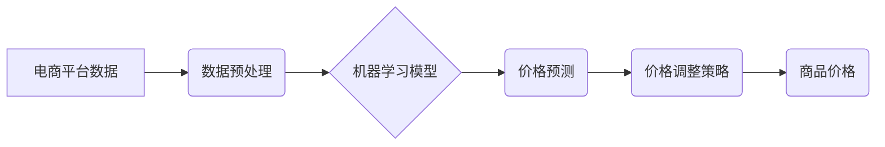

> 电商价格优化，人工智能，机器学习，深度学习，预测模型，需求预测，价格策略

## 1. 背景介绍

在当今激烈的电商市场竞争中，价格优化已成为企业提升利润率和市场份额的关键策略。传统的定价方法往往依赖于经验和主观判断，难以适应市场需求的快速变化和复杂性。随着人工智能（AI）技术的快速发展，AI在电商价格优化中的应用逐渐成为行业热点。

AI技术能够通过对海量数据进行分析和学习，建立精准的预测模型，从而帮助企业制定更科学、更有效的定价策略。AI驱动的价格优化系统能够实时监测市场动态、用户行为和竞争对手价格，并根据这些信息动态调整商品价格，以最大化利润。

## 2. 核心概念与联系

**2.1 核心概念**

* **电商价格优化:** 指通过运用数据分析、机器学习等技术手段，对电商平台商品价格进行科学调整，以实现利润最大化、市场份额提升等目标。
* **人工智能 (AI):**  模拟人类智能的计算机系统，能够通过学习和推理，完成复杂的认知任务，例如图像识别、自然语言处理、决策分析等。
* **机器学习 (ML):**  人工智能的一个子领域，通过算法训练模型，使模型能够从数据中学习规律，并对新数据进行预测或分类。
* **深度学习 (DL):**  机器学习的一个子领域，利用多层神经网络结构，能够学习更复杂的特征和模式，在图像识别、语音识别等领域取得突破性进展。

**2.2 架构关系**



## 3. 核心算法原理 & 具体操作步骤

**3.1 算法原理概述**

电商价格优化算法通常基于机器学习和深度学习技术，通过训练模型预测商品需求和价格敏感度，从而制定最优价格策略。常见的算法包括：

* **线性回归:**  用于预测商品价格与销量之间的线性关系。
* **逻辑回归:**  用于预测商品是否会被购买，以及购买概率。
* **决策树:**  用于根据商品特征和市场条件，构建决策规则，确定最佳价格。
* **支持向量机 (SVM):**  用于在高维特征空间中寻找最佳价格分割边界。
* **神经网络:**  能够学习更复杂的非线性关系，提高预测精度。

**3.2 算法步骤详解**

1. **数据收集:** 收集商品历史销售数据、市场价格数据、用户行为数据等相关信息。
2. **数据预处理:** 清洗、转换和格式化数据，使其适合模型训练。
3. **特征工程:**  提取和选择能够影响商品价格和销量的特征，例如商品类别、品牌、属性、季节、促销活动等。
4. **模型训练:**  选择合适的机器学习算法，训练模型，并根据训练结果评估模型性能。
5. **模型部署:** 将训练好的模型部署到生产环境中，实时预测商品需求和价格敏感度。
6. **价格策略制定:**  根据模型预测结果，制定动态调整商品价格的策略，例如降价促销、限时抢购、会员专属价格等。
7. **效果评估:**  持续监控价格调整策略的效果，并根据实际情况进行调整和优化。

**3.3 算法优缺点**

| 算法 | 优点 | 缺点 |
|---|---|---|
| 线性回归 | 简单易懂，计算效率高 | 只能处理线性关系，预测精度有限 |
| 逻辑回归 | 适用于分类问题，预测概率可解释性强 | 只能处理线性关系，对非线性关系处理能力弱 |
| 决策树 | 可解释性强，能够处理非线性关系 | 容易过拟合，预测精度可能较低 |
| 支持向量机 | 能够处理高维特征，预测精度较高 | 计算复杂度高，参数调优困难 |
| 神经网络 | 能够学习复杂非线性关系，预测精度高 | 计算复杂度高，训练时间长，参数调优困难 |

**3.4 算法应用领域**

* **电商平台:**  商品价格优化、促销活动策划、库存管理
* **旅游行业:**  机票价格预测、酒店价格调整
* **金融行业:**  股票价格预测、风险评估
* **医疗行业:**  疾病诊断、药物研发

## 4. 数学模型和公式 & 详细讲解 & 举例说明

**4.1 数学模型构建**

电商价格优化模型通常采用回归模型，目标是预测商品的销量与价格之间的关系。一个简单的线性回归模型可以表示为：

$$
y = mx + b
$$

其中：

* $y$：商品销量
* $x$：商品价格
* $m$：价格系数，表示价格变化对销量的影响
* $b$：截距，表示当价格为0时，销量的基准值

**4.2 公式推导过程**

线性回归模型的参数 $m$ 和 $b$ 可以通过最小二乘法进行估计。最小二乘法旨在找到一条直线，使所有数据点到直线的距离之和最小。

**4.3 案例分析与讲解**

假设我们收集了以下商品销售数据：

| 价格 (x) | 销量 (y) |
|---|---|
| 10 | 100 |
| 15 | 80 |
| 20 | 60 |
| 25 | 40 |

我们可以使用最小二乘法估计线性回归模型的参数 $m$ 和 $b$。

通过计算，得到 $m = -4$ 和 $b = 140$。因此，线性回归模型可以表示为：

$$
y = -4x + 140
$$

这个模型表明，商品价格每增加1元，销量就会减少4个。

## 5. 项目实践：代码实例和详细解释说明

**5.1 开发环境搭建**

* 操作系统：Windows/macOS/Linux
* Python 版本：3.6+
* 必要的库：pandas, numpy, scikit-learn

**5.2 源代码详细实现**

```python
import pandas as pd
from sklearn.linear_model import LinearRegression

# 1. 数据加载
data = pd.read_csv('sales_data.csv')

# 2. 特征选择
X = data[['price']]  # 输入特征：价格
y = data['sales']  # 输出目标：销量

# 3. 模型训练
model = LinearRegression()
model.fit(X, y)

# 4. 模型评估
# ...

# 5. 价格预测
new_price = 22
predicted_sales = model.predict([[new_price]])
print(f'预测销量：{predicted_sales[0]}')
```

**5.3 代码解读与分析**

* 代码首先加载销售数据，并选择价格作为输入特征，销量作为输出目标。
* 然后，使用 scikit-learn 库中的 LinearRegression 类创建线性回归模型，并使用 fit() 方法训练模型。
* 训练完成后，可以使用 predict() 方法预测新的价格对应的销量。

**5.4 运行结果展示**

运行代码后，会输出预测的销量值。

## 6. 实际应用场景

**6.1 电商平台价格优化**

* **动态调整商品价格:** 根据实时市场需求、竞争对手价格和用户行为，动态调整商品价格，以最大化利润。
* **个性化价格策略:**  根据用户的购买历史、浏览记录和偏好，制定个性化的价格策略，提高用户转化率。
* **促销活动优化:**  利用机器学习模型预测促销活动的效果，优化促销策略，提高营销效率。

**6.2 旅游行业价格预测**

* **机票价格预测:**  根据历史航班数据、市场需求和季节性因素，预测未来机票价格，帮助用户选择最佳购票时间。
* **酒店价格调整:**  根据酒店入住率、市场竞争和周边活动，动态调整酒店价格，提高酒店入住率和收益。

**6.3 金融行业风险评估**

* **股票价格预测:**  利用历史股票数据、市场新闻和经济指标，预测股票价格走势，帮助投资者做出投资决策。
* **风险评估:**  根据客户的信用评分、交易记录和市场风险，评估客户的贷款风险，帮助金融机构制定合理的贷款政策。

**6.4 未来应用展望**

随着人工智能技术的不断发展，AI在电商价格优化中的应用将更加广泛和深入。未来，我们可能会看到：

* **更精准的预测模型:**  利用更先进的机器学习算法和深度学习模型，提高价格预测的精度。
* **更个性化的价格策略:**  利用大数据分析和用户画像技术，为每个用户制定个性化的价格策略。
* **更智能的自动化决策:**  利用人工智能技术实现价格调整的自动化决策，提高效率和灵活性。

## 7. 工具和资源推荐

**7.1 学习资源推荐**

* **书籍:**
    * 《Python机器学习》
    * 《深度学习》
    * 《人工智能：一种现代方法》
* **在线课程:**
    * Coursera: 机器学习
    * edX: 深度学习
    * Udacity: AI Nanodegree

**7.2 开发工具推荐**

* **Python:**  主流的机器学习编程语言
* **scikit-learn:**  Python机器学习库
* **TensorFlow:**  深度学习框架
* **PyTorch:**  深度学习框架

**7.3 相关论文推荐**

* **《基于深度学习的电商商品价格预测模型》**
* **《利用机器学习技术进行电商价格优化》**
* **《人工智能在电商价格优化中的应用研究》**

## 8. 总结：未来发展趋势与挑战

**8.1 研究成果总结**

AI在电商价格优化中的应用取得了显著成果，能够帮助企业提高利润率、提升市场份额和优化运营效率。

**8.2 未来发展趋势**

* **模型精度提升:**  利用更先进的机器学习算法和深度学习模型，提高价格预测的精度。
* **个性化策略增强:**  利用大数据分析和用户画像技术，为每个用户制定更精准的个性化价格策略。
* **自动化决策:**  利用人工智能技术实现价格调整的自动化决策，提高效率和灵活性。

**8.3 面临的挑战**

* **数据质量:**  AI模型的性能依赖于数据质量，需要不断收集和清洗高质量的数据。
* **模型解释性:**  一些深度学习模型的决策过程难以解释，需要开发更可解释的模型。
* **伦理问题:**  AI价格优化可能会带来一些伦理问题，例如价格歧视和算法偏见，需要谨慎考虑和解决。

**8.4 研究展望**

未来，AI在电商价格优化领域的应用将更加广泛和深入，需要不断探索新的算法、模型和应用场景，并解决相关技术和伦理问题。


## 9. 附录：常见问题与解答

**9.1  常见问题**

* **AI价格优化会影响用户体验吗？**

* **AI价格优化是否会造成价格歧视？**

* **如何评估AI价格优化模型的性能？**

**9.2  解答**

* **AI价格优化会影响用户体验吗？**

AI价格优化旨在提高用户体验，例如通过个性化价格策略提供更优惠的价格，并根据用户需求推荐更合适的商品。

* **AI价格优化是否会造成价格歧视？**

AI价格优化需要遵循公平公正的原则，避免基于用户属性进行价格歧视。

* **如何评估AI价格优化模型的性能？**

可以使用多种指标评估AI价格优化模型的性能，例如预测精度、利润率、用户转化率等。

作者：禅与计算机程序设计艺术 / Zen and the Art of Computer Programming 


<end_of_turn>