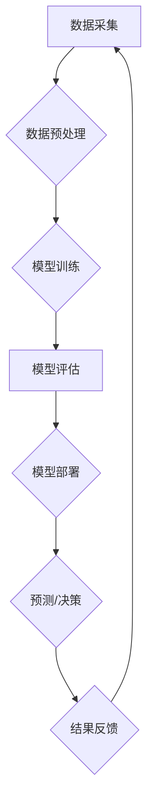

> 人工智能，机器学习，深度学习，自然语言处理，计算机视觉，应用场景，社会影响，伦理问题

## 1. 背景介绍

人工智能（AI）正以惊人的速度发展，从简单的规则系统演变为能够学习、推理和解决复杂问题的智能系统。AI技术的突破，特别是深度学习的兴起，为我们带来了前所未有的机遇，同时也引发了广泛的讨论和关注。

近年来，AI技术已渗透到各个领域，例如医疗保健、金融、交通、教育等，深刻地改变着我们的生活方式和社会结构。从智能语音助手到自动驾驶汽车，从精准医疗到个性化教育，AI正在以其强大的能力，为人类社会带来前所未有的便利和进步。

然而，AI技术的发展也面临着诸多挑战和风险。例如，AI算法的偏见问题、数据隐私安全问题、工作岗位替代问题等，都需要我们认真思考和解决。

## 2. 核心概念与联系

**2.1  人工智能（AI）**

人工智能是指模拟人类智能行为的计算机系统。它涵盖了多个子领域，例如机器学习、深度学习、自然语言处理、计算机视觉等。

**2.2  机器学习（ML）**

机器学习是人工智能的一个重要分支，它使计算机能够从数据中学习，并根据学习到的知识进行预测或决策。机器学习算法可以分为监督学习、无监督学习和强化学习三大类。

**2.3  深度学习（DL）**

深度学习是机器学习的一个子领域，它利用多层神经网络来模拟人类大脑的学习过程。深度学习算法能够处理海量数据，并从中提取出复杂的特征，从而实现更精准的预测和决策。

**2.4  自然语言处理（NLP）**

自然语言处理是指使计算机能够理解、处理和生成人类语言的技术。NLP技术广泛应用于聊天机器人、机器翻译、文本摘要等领域。

**2.5  计算机视觉（CV）**

计算机视觉是指使计算机能够“看”和理解图像的技术。计算机视觉技术应用于图像识别、物体检测、人脸识别等领域。

**2.6  AI应用场景**

AI技术已广泛应用于各个领域，例如：

* **医疗保健:** 疾病诊断、药物研发、个性化治疗
* **金融:** 风险评估、欺诈检测、投资决策
* **交通:** 自动驾驶、交通流量预测、智能交通管理
* **教育:** 个性化学习、智能辅导、自动批改
* **娱乐:** 游戏开发、内容推荐、虚拟现实

**2.7  AI技术架构**



## 3. 核心算法原理 & 具体操作步骤

### 3.1  算法原理概述

**3.1.1  监督学习**

监督学习算法利用标记数据进行训练，目标是学习一个映射关系，将输入数据映射到输出结果。例如，分类问题，输入数据为图像，输出结果为图像类别；回归问题，输入数据为房屋特征，输出结果为房屋价格。

**3.1.2  无监督学习**

无监督学习算法利用未标记数据进行训练，目标是发现数据中的潜在结构或模式。例如，聚类问题，将数据点分组到不同的类别；降维问题，将高维数据降维到低维空间。

**3.1.3  强化学习**

强化学习算法通过与环境交互学习，目标是找到一个策略，使智能体在环境中获得最大奖励。例如，游戏AI，通过与游戏环境交互学习，找到最优的游戏策略。

### 3.2  算法步骤详解

**3.2.1  监督学习算法步骤**

1. 数据采集和预处理
2. 模型选择
3. 模型训练
4. 模型评估
5. 模型部署

**3.2.2  无监督学习算法步骤**

1. 数据采集和预处理
2. 模型选择
3. 模型训练
4. 结果分析

**3.2.3  强化学习算法步骤**

1. 环境建模
2. 智能体设计
3. 策略选择
4. 环境交互
5. 奖励机制
6. 策略更新

### 3.3  算法优缺点

**3.3.1  监督学习算法**

* 优点：准确率高，可解释性强
* 缺点：需要大量标记数据，容易受到数据偏差的影响

**3.3.2  无监督学习算法**

* 优点：不需要标记数据，可以发现数据中的潜在结构
* 缺点：准确率相对较低，结果解释性较弱

**3.3.3  强化学习算法**

* 优点：能够学习复杂的任务，适应性强
* 缺点：训练时间长，需要设计合理的奖励机制

### 3.4  算法应用领域

* **监督学习:** 图像识别、语音识别、文本分类、欺诈检测
* **无监督学习:** 数据聚类、异常检测、降维
* **强化学习:** 游戏AI、机器人控制、自动驾驶

## 4. 数学模型和公式 & 详细讲解 & 举例说明

### 4.1  数学模型构建

**4.1.1  线性回归模型**

线性回归模型假设数据之间存在线性关系，可以用以下公式表示：

$$y = w_0 + w_1x_1 + w_2x_2 + ... + w_nx_n + \epsilon$$

其中：

* $y$ 是目标变量
* $x_1, x_2, ..., x_n$ 是输入特征
* $w_0, w_1, w_2, ..., w_n$ 是模型参数
* $\epsilon$ 是误差项

**4.1.2  逻辑回归模型**

逻辑回归模型用于二分类问题，将线性回归模型的输出映射到0到1之间的概率值。

$$P(y=1|x) = \frac{1}{1 + e^{-(w_0 + w_1x_1 + w_2x_2 + ... + w_nx_n)}}$$

### 4.2  公式推导过程

**4.2.1  梯度下降算法**

梯度下降算法是一种常用的优化算法，用于训练机器学习模型。其目标是找到模型参数，使模型的损失函数最小化。

梯度下降算法的基本原理是：沿着损失函数的负梯度方向更新模型参数。

**4.2.2  交叉熵损失函数**

交叉熵损失函数用于评估分类模型的性能。其定义如下：

$$Loss = - \sum_{i=1}^{N} y_i \log(p_i) + (1-y_i) \log(1-p_i)$$

其中：

* $N$ 是样本数量
* $y_i$ 是真实标签
* $p_i$ 是模型预测的概率

### 4.3  案例分析与讲解

**4.3.1  线性回归模型案例**

假设我们想要预测房屋价格，输入特征包括房屋面积、房间数量等。我们可以使用线性回归模型来建立房屋价格预测模型。

**4.3.2  逻辑回归模型案例**

假设我们想要判断邮件是否为垃圾邮件，输入特征包括邮件内容、发送者等。我们可以使用逻辑回归模型来建立垃圾邮件分类模型。

## 5. 项目实践：代码实例和详细解释说明

### 5.1  开发环境搭建

* Python 3.x
* TensorFlow/PyTorch
* Jupyter Notebook

### 5.2  源代码详细实现

```python
# 线性回归模型示例
import tensorflow as tf

# 定义模型
model = tf.keras.models.Sequential([
    tf.keras.layers.Dense(units=1, input_shape=[1])
])

# 编译模型
model.compile(optimizer='sgd', loss='mean_squared_error')

# 训练模型
model.fit(x_train, y_train, epochs=100)

# 预测
predictions = model.predict(x_test)
```

### 5.3  代码解读与分析

* `tf.keras.models.Sequential` 创建一个顺序模型，即层级结构的模型。
* `tf.keras.layers.Dense` 创建一个全连接层，输入特征维度为1，输出维度为1。
* `model.compile` 编译模型，指定优化器、损失函数等参数。
* `model.fit` 训练模型，输入训练数据和训练轮数。
* `model.predict` 使用训练好的模型进行预测。

### 5.4  运行结果展示

训练完成后，我们可以使用测试数据评估模型的性能，例如计算均方误差（MSE）。

## 6. 实际应用场景

### 6.1  医疗保健

* **疾病诊断:** 利用AI算法分析患者的医疗影像、病历等数据，辅助医生诊断疾病。
* **药物研发:** 利用AI算法加速药物研发过程，例如预测药物的有效性、安全性等。
* **个性化治疗:** 根据患者的基因信息、生活习惯等数据，为患者制定个性化的治疗方案。

### 6.2  金融

* **风险评估:** 利用AI算法分析客户的信用记录、财务状况等数据，评估客户的贷款风险。
* **欺诈检测:** 利用AI算法分析交易数据，识别异常交易行为，防止欺诈行为。
* **投资决策:** 利用AI算法分析市场数据，预测股票价格走势，辅助投资决策。

### 6.3  交通

* **自动驾驶:** 利用AI算法控制车辆行驶，实现自动驾驶功能。
* **交通流量预测:** 利用AI算法分析交通数据，预测交通流量变化，优化交通管理。
* **智能交通管理:** 利用AI算法控制交通信号灯、道路收费等，提高交通效率。

### 6.4  未来应用展望

AI技术的发展将继续推动社会进步，未来将有更多新的应用场景出现，例如：

* **个性化教育:** 根据学生的学习情况，提供个性化的学习内容和教学方式。
* **智能家居:** 利用AI算法控制家居设备，实现智能家居功能。
* **医疗机器人:** 利用AI算法控制医疗机器人，辅助医生进行手术、护理等。

## 7. 工具和资源推荐

### 7.1  学习资源推荐

* **在线课程:** Coursera、edX、Udacity
* **书籍:** 《深度学习》、《机器学习实战》
* **博客:** Towards Data Science、Machine Learning Mastery

### 7.2  开发工具推荐

* **Python:** 编程语言
* **TensorFlow/PyTorch:** 深度学习框架
* **Jupyter Notebook:** 数据分析和可视化工具

### 7.3  相关论文推荐

* **《ImageNet Classification with Deep Convolutional Neural Networks》**
* **《Attention Is All You Need》**
* **《Generative Adversarial Networks》**

## 8. 总结：未来发展趋势与挑战

### 8.1  研究成果总结

近年来，AI技术取得了长足的进步，在各个领域都取得了显著的应用成果。例如，图像识别、语音识别、自然语言处理等领域取得了突破性进展。

### 8.2  未来发展趋势

* **模型规模和复杂度提升:** 未来AI模型将更加庞大、复杂，能够处理更复杂的任务。
* **跨模态学习:** AI模型将能够处理多种模态数据，例如文本、图像、音频等，实现更全面的理解和分析。
* **边缘计算:** AI模型将部署到边缘设备，实现更快速的响应和更低的延迟。

### 8.3  面临的挑战

* **数据安全和隐私保护:** AI模型的训练和应用需要大量数据，如何保证数据安全和隐私保护是一个重要挑战。
* **算法偏见和公平性:** AI算法可能存在偏见，导致不公平的结果，需要研究如何解决算法偏见问题。
* **伦理问题:** AI技术的应用引发了诸多伦理问题，例如人工智能的责任、人工智能的控制等，需要进行深入的探讨和研究。

### 8.4  研究展望