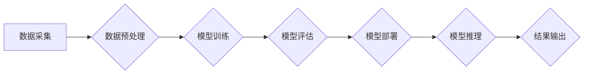

> AI大模型，创业，技术挑战，深度学习，自然语言处理，计算机视觉，伦理问题，可持续发展

## 1. 背景介绍

人工智能（AI）正以惊人的速度发展，其中，大模型的出现更是掀起了AI领域的革命浪潮。这些拥有数十亿甚至数千亿参数的模型，展现出强大的学习和推理能力，在自然语言处理、计算机视觉、语音识别等领域取得了突破性的进展。

然而，AI大模型的创业之路并非一帆风顺。技术挑战、伦理问题、可持续发展等诸多难题都需要创业者认真思考和应对。本文将深入探讨AI大模型创业的机遇与挑战，为创业者提供一些有价值的思考和建议。

## 2. 核心概念与联系

**2.1 AI大模型概述**

AI大模型是指参数规模庞大、训练数据海量的人工智能模型。它们通过深度学习算法从海量数据中学习，能够执行各种复杂的任务，例如：

* **自然语言处理 (NLP)：** 文本生成、机器翻译、问答系统、情感分析等。
* **计算机视觉 (CV)：** 图像识别、物体检测、图像分割、视频分析等。
* **语音识别和合成：** 语音转文本、文本转语音、语音助手等。

**2.2 核心技术架构**

AI大模型的构建和应用依赖于一系列核心技术，包括：

* **深度学习算法：** 

例如卷积神经网络 (CNN)、循环神经网络 (RNN)、Transformer等。

* **大规模数据处理：** 

需要高效处理海量数据，例如分布式存储、并行计算等技术。
* **模型训练和优化：** 

需要强大的计算资源和优化算法，例如梯度下降、Adam优化器等。
* **模型部署和推理：** 

需要将训练好的模型部署到实际应用场景中，并进行高效的推理。

**2.3  Mermaid 流程图**



## 3. 核心算法原理 & 具体操作步骤

**3.1 算法原理概述**

深度学习算法是AI大模型的核心，其灵感来源于人脑神经网络的结构和功能。深度学习模型由多个层级的神经元组成，每个神经元接收来自上一层的输入，并通过激活函数进行处理，最终输出到下一层。通过训练，模型的参数会不断调整，使得模型能够学习到数据的特征和规律。

**3.2 算法步骤详解**

1. **数据准备：** 收集、清洗和预处理数据，将其转换为模型可以理解的格式。
2. **模型构建：** 根据任务需求选择合适的深度学习模型架构，例如CNN、RNN、Transformer等。
3. **模型训练：** 使用训练数据训练模型，通过反向传播算法调整模型参数，使得模型的预测结果与真实值尽可能接近。
4. **模型评估：** 使用测试数据评估模型的性能，例如准确率、召回率、F1-score等。
5. **模型调优：** 根据评估结果，调整模型参数、学习率等超参数，以提高模型性能。
6. **模型部署：** 将训练好的模型部署到实际应用场景中，例如云平台、边缘设备等。

**3.3 算法优缺点**

**优点：**

* 强大的学习能力：能够从海量数据中学习到复杂的特征和规律。
* 高的准确率：在许多任务中，深度学习模型能够取得比传统算法更高的准确率。
* 可扩展性强：可以根据需要增加模型的规模和复杂度。

**缺点：**

* 数据依赖性强：需要大量的训练数据才能达到良好的性能。
* 计算资源消耗大：训练大型模型需要大量的计算资源和时间。
* 可解释性差：深度学习模型的决策过程难以理解，缺乏透明度。

**3.4 算法应用领域**

深度学习算法在各个领域都有广泛的应用，例如：

* **自然语言处理：** 机器翻译、文本摘要、情感分析、对话系统等。
* **计算机视觉：** 图像识别、物体检测、图像分割、视频分析等。
* **语音识别和合成：** 语音转文本、文本转语音、语音助手等。
* **医疗保健：** 疾病诊断、药物研发、医疗影像分析等。
* **金融科技：** 风险评估、欺诈检测、投资决策等。

## 4. 数学模型和公式 & 详细讲解 & 举例说明

**4.1 数学模型构建**

深度学习模型可以看作是一个复杂的数学模型，其核心是神经网络的结构和激活函数。

**4.2 公式推导过程**

深度学习模型的训练过程本质上是一个优化问题，目标是找到模型参数，使得模型的预测结果与真实值之间的误差最小化。常用的优化算法是梯度下降法，其核心公式如下：

$$
\theta = \theta - \alpha \nabla L(\theta)
$$

其中：

* $\theta$ 是模型参数
* $\alpha$ 是学习率
* $\nabla L(\theta)$ 是损失函数 $L(\theta)$ 对参数 $\theta$ 的梯度

**4.3 案例分析与讲解**

以线性回归为例，假设我们有一个数据集 $(x_1, y_1), (x_2, y_2), ..., (x_n, y_n)$，其中 $x_i$ 是输入特征，$y_i$ 是输出标签。线性回归模型的预测公式为：

$$
\hat{y} = w x + b
$$

其中 $w$ 是权重参数，$b$ 是偏置参数。损失函数通常选择均方误差：

$$
L(w, b) = \frac{1}{n} \sum_{i=1}^{n} (y_i - \hat{y}_i)^2
$$

通过梯度下降法，我们可以迭代更新 $w$ 和 $b$ 的值，使得损失函数最小化。

## 5. 项目实践：代码实例和详细解释说明

**5.1 开发环境搭建**

* Python 3.x
* TensorFlow 或 PyTorch 等深度学习框架
* Jupyter Notebook 或 VS Code 等代码编辑器

**5.2 源代码详细实现**

```python
import tensorflow as tf

# 定义模型
model = tf.keras.models.Sequential([
    tf.keras.layers.Dense(64, activation='relu', input_shape=(784,)),
    tf.keras.layers.Dense(10, activation='softmax')
])

# 编译模型
model.compile(optimizer='adam',
              loss='sparse_categorical_crossentropy',
              metrics=['accuracy'])

# 训练模型
model.fit(x_train, y_train, epochs=10)

# 评估模型
loss, accuracy = model.evaluate(x_test, y_test)
print('Test loss:', loss)
print('Test accuracy:', accuracy)
```

**5.3 代码解读与分析**

这段代码实现了简单的深度学习模型训练过程。

* 首先定义了一个包含两层全连接神经网络的模型。
* 然后使用Adam优化器、交叉熵损失函数和准确率指标编译模型。
* 最后使用训练数据训练模型，并使用测试数据评估模型性能。

**5.4 运行结果展示**

训练完成后，会输出模型在测试集上的损失值和准确率。

## 6. 实际应用场景

AI大模型在各个领域都有广泛的应用，例如：

* **自然语言处理：**

聊天机器人、机器翻译、文本摘要、情感分析等。

* **计算机视觉：**

图像识别、物体检测、图像分割、视频分析等。
* **语音识别和合成：**

语音助手、语音转文本、文本转语音等。

* **医疗保健：**

疾病诊断、药物研发、医疗影像分析等。
* **金融科技：**

风险评估、欺诈检测、投资决策等。

**6.4 未来应用展望**

随着AI技术的不断发展，AI大模型的应用场景将会更加广泛，例如：

* **个性化教育：**

根据学生的学习情况提供个性化的学习方案。
* **智能制造：**

提高生产效率、降低生产成本。
* **自动驾驶：**

实现无人驾驶汽车的自动驾驶功能。
* **科学研究：**

加速科学研究的进程，例如药物研发、材料科学等。

## 7. 工具和资源推荐

**7.1 学习资源推荐**

* **书籍：**

《深度学习》 (Ian Goodfellow, Yoshua Bengio, Aaron Courville)
* **在线课程：**

Coursera、edX、Udacity 等平台上的深度学习课程。
* **开源项目：**

TensorFlow、PyTorch、HuggingFace 等开源项目。

**7.2 开发工具推荐**

* **深度学习框架：**

TensorFlow、PyTorch、Keras 等。
* **代码编辑器：**

Jupyter Notebook、VS Code、PyCharm 等。
* **云平台：**

AWS、Azure、Google Cloud 等。

**7.3 相关论文推荐**

* **Transformer：**

Vaswani et al. (2017)
* **BERT：**

Devlin et al. (2018)
* **GPT-3：**

Brown et al. (2020)

## 8. 总结：未来发展趋势与挑战

**8.1 研究成果总结**

近年来，AI大模型取得了令人瞩目的进展，在各个领域都展现出强大的应用潜力。

**8.2 未来发展趋势**

* **模型规模的进一步扩大：**

更大的模型规模能够带来更高的性能。
* **模型训练效率的提升：**

探索新的训练方法和硬件架构，降低训练成本和时间。
* **模型可解释性的增强：**

研究更易于理解的模型架构和解释方法。
* **模型的泛化能力提升：**

使模型能够更好地适应不同的应用场景和数据分布。

**8.3 面临的挑战**

* **数据安全和隐私保护：**

AI大模型的训练需要大量数据，如何保证数据安全和隐私保护是一个重要挑战。
* **算法偏见和公平性：**

AI模型可能存在算法偏见，导致不公平的结果，需要采取措施解决这个问题。
* **模型的可靠性和安全性：**

确保AI模型的可靠性和安全性，避免模型在实际应用中出现错误或被恶意攻击。

**8.4 研究展望**

未来，AI大模型的研究将继续朝着更强大、更安全、更可解释的方向发展。

## 9. 附录：常见问题与解答

**9.1 如何选择合适的深度学习框架？**

选择深度学习框架需要根据具体项目需求和个人偏好。TensorFlow 和 PyTorch 是目前最流行的两个框架，各有优缺点。

**9.2 如何处理数据不平衡问题？**

数据不平衡问题可以通过数据增强、权重调整、过采样和欠采样等方法进行处理。

**9.3 如何评估模型性能？**

常用的模型性能指标包括准确率、召回率、F1-score、AUC等。选择合适的指标需要根据具体任务需求。


作者：禅与计算机程序设计艺术 / Zen and the Art of Computer Programming 
<end_of_turn>