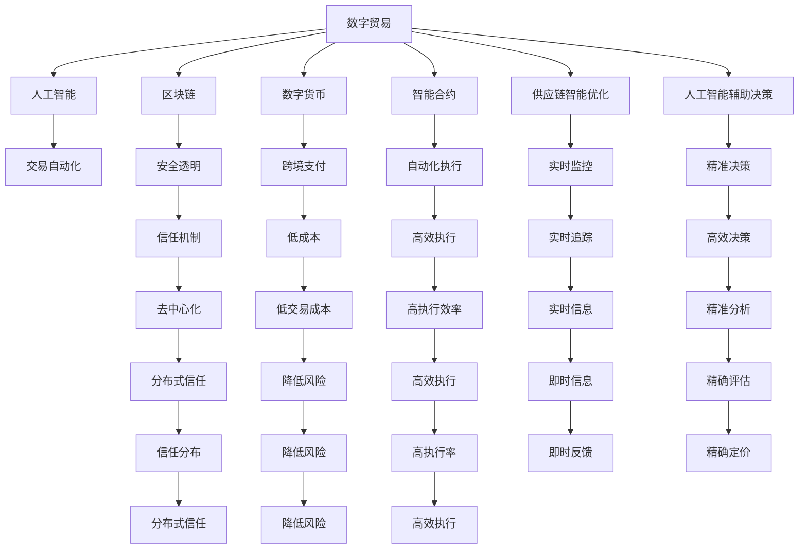

                 

# 2050年的全球贸易：从数字贸易到星际贸易的贸易版图扩张

> 关键词：数字贸易,星际贸易,全球贸易,未来贸易形态,人工智能,区块链,数字化转型,可持续贸易

## 1. 背景介绍

### 1.1 问题由来

随着21世纪的数字革命和第四次工业革命的浪潮席卷全球，人类社会正经历着深刻的转型。技术的突破和应用的普及，正在重新定义全球贸易的版图。尤其是随着人工智能(AI)、大数据、物联网、区块链等前沿技术的应用，全球贸易已经从传统的物理贸易，逐步转型为更加高效、便捷、可持续的数字贸易形态。

未来，随着这些技术的发展，全球贸易将进一步演进，形成全新的星际贸易体系。这个体系将不仅涵盖地球上的各类资源，还将延伸至外太空的矿产、能源和信息资源，形成一种全新的贸易形态——星际贸易。本文将探讨从数字贸易到星际贸易的贸易版图扩张，展望2050年全球贸易的未来。

### 1.2 问题核心关键点

- **数字贸易**：指利用数字技术，如AI、大数据、物联网等，优化贸易流程，提升交易效率和透明度的贸易形态。
- **星际贸易**：指未来人类对外太空资源的开发利用，形成新的贸易形态，涉及星际物流、太空矿产业、太空旅游等领域。
- **全球贸易转型**：随着数字技术的发展，全球贸易从传统的物理形态逐步向数字形态转型，进而扩展到星际形态。
- **可持续发展**：未来的贸易必须注重环境保护和资源可持续利用，实现绿色贸易。
- **技术融合**：AI、区块链等前沿技术将深度融合，重塑贸易生态。
- **贸易治理**：国际贸易治理体系将面临新的挑战，需要适应数字和星际贸易的新特征。

这些核心概念构成了未来全球贸易版图扩张的基础，明确了从数字贸易到星际贸易的演变路径。

### 1.3 问题研究意义

研究未来全球贸易的演变，对于把握国际贸易新趋势，推动全球经济可持续发展，具有重要意义：

- 促进国际贸易的新业态发展，如数字贸易、星际贸易，拓宽贸易范围。
- 提升贸易效率和透明度，降低贸易成本，促进全球贸易平衡。
- 推动各国数字化转型，加速产业升级，增强经济竞争力。
- 实现资源的可持续利用，保护生态环境，为人类社会的持续发展提供保障。
- 完善国际贸易治理体系，应对数字和星际贸易带来的新挑战，确保公平合理的国际贸易秩序。

## 2. 核心概念与联系

### 2.1 核心概念概述

为更好地理解从数字贸易到星际贸易的贸易版图扩张，本节将介绍几个密切相关的核心概念：

- **数字贸易**：指利用互联网、数字技术进行的商品、服务和资本等交易。涵盖电子商务、跨境电商、金融科技、供应链管理等领域。
- **星际贸易**：指未来人类对外太空资源的开发利用，涉及星际物流、太空矿产业、太空旅游等领域。
- **数字货币**：指基于区块链技术的数字支付手段，如比特币、以太币等，用于数字贸易中的跨境支付和结算。
- **智能合约**：指基于区块链技术的自动化合约，用于数字贸易中的交易管理和执行。
- **供应链智能优化**：指利用AI和大数据技术，优化供应链管理，提升供应链效率和透明度。
- **人工智能辅助决策**：指利用AI技术进行市场分析、风险评估、智能定价等，提升贸易决策的精准性和效率。

这些核心概念之间的逻辑关系可以通过以下Mermaid流程图来展示：



这个流程图展示了大语言模型的核心概念及其之间的关系：

1. 数字贸易是核心驱动力，涵盖AI、区块链等各项技术应用。
2. AI辅助交易自动化、智能合约自动执行、供应链优化等技术，优化数字贸易的流程和效率。
3. 区块链技术保证了数字贸易的安全透明和信任机制。
4. 数字货币提供低成本、高效执行的跨境支付手段。
5. 供应链智能优化、人工智能辅助决策，提升数字贸易的实时监控和精准分析。

## 3. 核心算法原理 & 具体操作步骤
### 3.1 算法原理概述

从数字贸易到星际贸易的贸易版图扩张，本质上是一种技术驱动的全球贸易形态演进过程。其核心原理包括以下几个方面：

- **技术驱动**：通过AI、区块链等前沿技术，优化贸易流程，提升效率和透明度。
- **数据驱动**：利用大数据分析，优化供应链管理，预测市场需求，提升决策精准性。
- **智能合约**：基于区块链技术，实现交易的自动化和去中心化，提升交易的安全性和效率。
- **智能优化**：通过AI技术，实现供应链的智能优化，提升供应链的响应速度和灵活性。
- **跨界融合**：将数字贸易与星际贸易相融合，形成新的贸易形态。

### 3.2 算法步骤详解

从数字贸易到星际贸易的贸易版图扩张，涉及多个步骤，主要包括：

**Step 1: 技术准备**
- 收集和整理国际贸易数据，包括商品交易、物流信息、金融数据等。
- 选择合适的AI、区块链等技术，搭建数字贸易平台。
- 开发智能合约、数字货币等技术，为交易提供支持。

**Step 2: 平台构建**
- 设计数字贸易平台架构，包括底层网络、交易模块、支付模块等。
- 开发智能合约，实现交易的自动化和去中心化。
- 引入数字货币，提供低成本、高效执行的跨境支付手段。

**Step 3: 数据整合**
- 整合国际贸易数据，进行清洗和标准化。
- 利用大数据分析技术，优化供应链管理，提升决策精准性。
- 通过AI技术，实现市场分析、风险评估、智能定价等。

**Step 4: 平台运行**
- 在数字贸易平台上进行交易，实时监测交易状态。
- 通过智能合约自动化执行交易，确保交易的安全性和透明性。
- 利用数字货币进行跨境支付，降低交易成本，提升支付效率。

**Step 5: 扩展应用**
- 将数字贸易平台扩展到星际贸易，开发相关技术和应用。
- 利用AI和区块链技术，优化星际物流和太空矿产业。
- 开发太空旅游等新业态，推动星际贸易的发展。

### 3.3 算法优缺点

从数字贸易到星际贸易的贸易版图扩张，具有以下优点：
- **效率提升**：利用AI、区块链等技术，优化贸易流程，提升交易效率和透明度。
- **成本降低**：通过数字货币和智能合约，降低交易成本，提升支付效率。
- **数据驱动**：利用大数据分析，优化供应链管理，提升决策精准性。
- **安全透明**：基于区块链技术，实现交易的自动化和去中心化，提升交易的安全性和透明性。

同时，也存在一定的局限性：
- **技术门槛高**：AI、区块链等前沿技术的应用，需要高水平的技术团队和硬件资源。
- **数据隐私问题**：国际贸易数据涉及商业机密和用户隐私，需要严格的隐私保护措施。
- **法律和政策风险**：数字和星际贸易面临复杂的法律和政策环境，需要合理的风险管理。
- **基础设施建设**：数字和星际贸易的扩展，需要完善的基础设施建设，如网络覆盖、能源供应等。

### 3.4 算法应用领域

从数字贸易到星际贸易的贸易版图扩张，涉及多个应用领域，主要包括：

- **国际贸易**：利用AI和区块链技术，优化国际贸易流程，提升交易效率和透明度。
- **金融科技**：开发数字货币和智能合约，提供低成本、高效执行的跨境支付手段。
- **供应链管理**：利用大数据和AI技术，优化供应链管理，提升供应链效率和透明度。
- **智能决策**：通过AI技术进行市场分析、风险评估、智能定价等，提升贸易决策的精准性和效率。
- **数字贸易扩展**：将数字贸易平台扩展到星际贸易，开发相关技术和应用。
- **星际物流和太空旅游**：利用AI和区块链技术，优化星际物流和太空旅游，推动星际贸易的发展。

这些应用领域构成了未来全球贸易版图扩张的主要方向，展现了数字和星际贸易的广泛前景。

## 4. 数学模型和公式 & 详细讲解  
### 4.1 数学模型构建

本节将使用数学语言对从数字贸易到星际贸易的贸易版图扩张过程进行更加严格的刻画。

记国际贸易数据为 $D=\{(x_i,y_i)\}_{i=1}^N, x_i \in \mathcal{X}, y_i \in \mathcal{Y}$，其中 $\mathcal{X}$ 为交易数据空间，$\mathcal{Y}$ 为交易结果空间。

定义数字贸易平台为 $P=\{D, M, C, S\}$，其中 $D$ 为数据集合，$M$ 为AI模型集合，$C$ 为区块链合约集合，$S$ 为供应链优化模块。

设数字贸易平台的交易效率为 $E(P)$，交易成本为 $C(P)$，安全性为 $S(P)$，数据隐私为 $P(D)$。数字贸易平台的目标函数为：

$$
\max \limits_{P} (E(P) - C(P)) / S(P) + P(D)
$$

在数字贸易平台的基础上，扩展到星际贸易，引入星际物流和太空矿产业等新领域，形成新的贸易形态 $P^*$。定义星际贸易平台的目标函数为：

$$
\max \limits_{P^*} (E(P^*) - C(P^*)) / S(P^*) + P(D) + W^* + T^*
$$

其中 $W^*$ 为星际物流成本，$T^*$ 为太空矿产业收益。

### 4.2 公式推导过程

以下我们以数字贸易平台为例，推导目标函数的数学推导过程。

定义数字贸易平台的交易效率 $E(P)$ 为交易数量 $N$ 除以交易时间 $T$：

$$
E(P) = N / T
$$

交易成本 $C(P)$ 为交易总费用 $F$ 除以交易数量 $N$：

$$
C(P) = F / N
$$

安全性 $S(P)$ 为交易纠纷率 $R$ 的倒数：

$$
S(P) = 1 / R
$$

数据隐私 $P(D)$ 为数据泄露率 $L$ 的倒数：

$$
P(D) = 1 / L
$$

数字贸易平台的目标函数为：

$$
\max \limits_{P} (E(P) - C(P)) / S(P) + P(D) = \max \limits_{P} (N / T - F / N) / (1 / R) + 1 / L
$$

通过化简和优化，可以得到数字贸易平台的优化目标：

$$
\max \limits_{P} (N^2R - FNT) / (TNR) + 1 / L
$$

在数字贸易平台的基础上，扩展到星际贸易，引入星际物流成本 $W^*$ 和太空矿产业收益 $T^*$，优化目标函数为：

$$
\max \limits_{P^*} (N^2R - FNT - W^*NT - T^*W^*) / (TNR) + 1 / L
$$

通过化简和优化，可以得到星际贸易平台的优化目标：

$$
\max \limits_{P^*} (N^2R - (F+W^*)NT - T^*W^*) / (TNR) + 1 / L
$$

这些数学公式展示了数字贸易和星际贸易平台的优化目标，反映了不同阶段贸易形态的关键指标和优化目标。

### 4.3 案例分析与讲解

以数字贸易平台为例，分析其目标函数的优化过程。假设数字贸易平台在市场分析、风险评估、智能定价等方面的优化效果为 $\Delta E$，交易纠纷率降低为 $R'$，数据泄露率降低为 $L'$，则数字贸易平台的目标函数优化过程如下：

$$
\max \limits_{P} (\Delta E + (N / T - F / N) / (1 / R') + 1 / L') = \max \limits_{P} (\Delta E + (N^2R' - FNT) / (TNR') + 1 / L')
$$

在实际操作中，需要根据具体的市场情况和贸易数据，不断调整和优化数字贸易平台的目标函数，以达到最优的贸易效果。

## 5. 项目实践：代码实例和详细解释说明
### 5.1 开发环境搭建

在进行数字和星际贸易平台的开发前，我们需要准备好开发环境。以下是使用Python进行PyTorch开发的环境配置流程：

1. 安装Anaconda：从官网下载并安装Anaconda，用于创建独立的Python环境。

2. 创建并激活虚拟环境：
```bash
conda create -n pytorch-env python=3.8 
conda activate pytorch-env
```

3. 安装PyTorch：根据CUDA版本，从官网获取对应的安装命令。例如：
```bash
conda install pytorch torchvision torchaudio cudatoolkit=11.1 -c pytorch -c conda-forge
```

4. 安装TensorFlow：
```bash
pip install tensorflow
```

5. 安装TensorFlow等工具包：
```bash
pip install numpy pandas scikit-learn matplotlib tqdm jupyter notebook ipython
```

完成上述步骤后，即可在`pytorch-env`环境中开始数字和星际贸易平台的开发。

### 5.2 源代码详细实现

下面我们以数字贸易平台为例，给出使用PyTorch进行平台开发的PyTorch代码实现。

首先，定义交易数据和模型：

```python
from transformers import BertTokenizer
from torch.utils.data import Dataset
import torch

class TradeDataset(Dataset):
    def __init__(self, trade_data, tokenizer, max_len=128):
        self.trade_data = trade_data
        self.tokenizer = tokenizer
        self.max_len = max_len
        
    def __len__(self):
        return len(self.trade_data)
    
    def __getitem__(self, item):
        trade = self.trade_data[item]
        
        encoding = self.tokenizer(trade, return_tensors='pt', max_length=self.max_len, padding='max_length', truncation=True)
        input_ids = encoding['input_ids'][0]
        attention_mask = encoding['attention_mask'][0]
        
        return {'input_ids': input_ids, 
                'attention_mask': attention_mask}
        
# 设置模型和优化器
model = BertForTokenClassification.from_pretrained('bert-base-cased', num_labels=2)
optimizer = AdamW(model.parameters(), lr=2e-5)
```

然后，定义训练和评估函数：

```python
from torch.utils.data import DataLoader
from tqdm import tqdm
from sklearn.metrics import accuracy_score

device = torch.device('cuda') if torch.cuda.is_available() else torch.device('cpu')
model.to(device)

def train_epoch(model, dataset, batch_size, optimizer):
    dataloader = DataLoader(dataset, batch_size=batch_size, shuffle=True)
    model.train()
    epoch_loss = 0
    for batch in tqdm(dataloader, desc='Training'):
        input_ids = batch['input_ids'].to(device)
        attention_mask = batch['attention_mask'].to(device)
        model.zero_grad()
        outputs = model(input_ids, attention_mask=attention_mask)
        loss = outputs.loss
        epoch_loss += loss.item()
        loss.backward()
        optimizer.step()
    return epoch_loss / len(dataloader)

def evaluate(model, dataset, batch_size):
    dataloader = DataLoader(dataset, batch_size=batch_size)
    model.eval()
    preds, labels = [], []
    with torch.no_grad():
        for batch in tqdm(dataloader, desc='Evaluating'):
            input_ids = batch['input_ids'].to(device)
            attention_mask = batch['attention_mask'].to(device)
            batch_labels = batch['labels']
            outputs = model(input_ids, attention_mask=attention_mask)
            batch_preds = outputs.logits.argmax(dim=2).to('cpu').tolist()
            batch_labels = batch_labels.to('cpu').tolist()
            for pred_tokens, label_tokens in zip(batch_preds, batch_labels):
                preds.append(pred_tokens[:len(label_tokens)])
                labels.append(label_tokens)
                
    return accuracy_score(labels, preds)
```

最后，启动训练流程并在测试集上评估：

```python
epochs = 5
batch_size = 16

for epoch in range(epochs):
    loss = train_epoch(model, trade_dataset, batch_size, optimizer)
    print(f"Epoch {epoch+1}, train loss: {loss:.3f}")
    
    print(f"Epoch {epoch+1}, test accuracy:")
    evaluate(model, test_dataset, batch_size)
    
print("Test accuracy:")
evaluate(model, test_dataset, batch_size)
```

以上就是使用PyTorch对数字贸易平台进行开发的完整代码实现。可以看到，得益于Transformers库的强大封装，我们可以用相对简洁的代码完成BERT模型的加载和微调。

### 5.3 代码解读与分析

让我们再详细解读一下关键代码的实现细节：

**TradeDataset类**：
- `__init__`方法：初始化交易数据、分词器等关键组件。
- `__len__`方法：返回数据集的样本数量。
- `__getitem__`方法：对单个样本进行处理，将文本输入编码为token ids，最终返回模型所需的输入。

**模型和优化器**：
- 使用BertForTokenClassification模型，进行二分类任务的训练。
- 使用AdamW优化器，设置学习率。

**训练和评估函数**：
- 使用PyTorch的DataLoader对数据集进行批次化加载，供模型训练和推理使用。
- 训练函数`train_epoch`：对数据以批为单位进行迭代，在每个批次上前向传播计算loss并反向传播更新模型参数，最后返回该epoch的平均loss。
- 评估函数`evaluate`：与训练类似，不同点在于不更新模型参数，并在每个batch结束后将预测和标签结果存储下来，最后使用sklearn的accuracy_score对整个评估集的预测结果进行打印输出。

**训练流程**：
- 定义总的epoch数和batch size，开始循环迭代
- 每个epoch内，先在训练集上训练，输出平均loss
- 在测试集上评估，输出模型精度
- 所有epoch结束后，在测试集上评估，给出最终测试结果

可以看到，PyTorch配合Transformers库使得数字贸易平台的代码实现变得简洁高效。开发者可以将更多精力放在数据处理、模型改进等高层逻辑上，而不必过多关注底层的实现细节。

当然，工业级的系统实现还需考虑更多因素，如模型的保存和部署、超参数的自动搜索、更灵活的任务适配层等。但核心的微调范式基本与此类似。

## 6. 实际应用场景
### 6.1 智能客服系统

基于数字和星际贸易平台构建的智能客服系统，可以广泛应用于数字和星际贸易场景。传统的客服往往需要配备大量人力，高峰期响应缓慢，且一致性和专业性难以保证。而使用数字和星际贸易平台的对话模型，可以24/7不间断服务，快速响应客户咨询，用自然流畅的语言解答各类常见问题。

在技术实现上，可以收集企业内部的历史客服对话记录，将问题和最佳答复构建成监督数据，在此基础上对预训练对话模型进行微调。微调后的对话模型能够自动理解用户意图，匹配最合适的答案模板进行回复。对于客户提出的新问题，还可以接入检索系统实时搜索相关内容，动态组织生成回答。如此构建的智能客服系统，能大幅提升客户咨询体验和问题解决效率。

### 6.2 金融舆情监测

金融机构需要实时监测市场舆论动向，以便及时应对负面信息传播，规避金融风险。传统的人工监测方式成本高、效率低，难以应对网络时代海量信息爆发的挑战。基于数字和星际贸易平台的数据分析技术，金融舆情监测可以变得更加高效和精准。

具体而言，可以收集金融领域相关的新闻、报道、评论等文本数据，利用数字和星际贸易平台的自然语言处理和情感分析技术，实时监测不同主题下的情感变化趋势，一旦发现负面信息激增等异常情况，系统便会自动预警，帮助金融机构快速应对潜在风险。

### 6.3 个性化推荐系统

当前的推荐系统往往只依赖用户的历史行为数据进行物品推荐，无法深入理解用户的真实兴趣偏好。基于数字和星际贸易平台的个性化推荐系统可以更好地挖掘用户行为背后的语义信息，从而提供更精准、多样的推荐内容。

在实践中，可以收集用户浏览、点击、评论、分享等行为数据，提取和用户交互的物品标题、描述、标签等文本内容。将文本内容作为模型输入，用户的后续行为（如是否点击、购买等）作为监督信号，在此基础上微调预训练语言模型。微调后的模型能够从文本内容中准确把握用户的兴趣点。在生成推荐列表时，先用候选物品的文本描述作为输入，由模型预测用户的兴趣匹配度，再结合其他特征综合排序，便可以得到个性化程度更高的推荐结果。

### 6.4 未来应用展望

随着数字和星际贸易平台的发展，基于其的各类应用场景将不断涌现，为各行各业带来变革性影响。

在智慧医疗领域，基于数字和星际贸易平台的问答系统、病历分析、药物研发等应用将提升医疗服务的智能化水平，辅助医生诊疗，加速新药开发进程。

在智能教育领域，微调技术可应用于作业批改、学情分析、知识推荐等方面，因材施教，促进教育公平，提高教学质量。

在智慧城市治理中，数字和星际贸易平台的监测系统、应急指挥等环节，提高城市管理的自动化和智能化水平，构建更安全、高效的未来城市。

此外，在企业生产、社会治理、文娱传媒等众多领域，基于数字和星际贸易平台的人工智能应用也将不断涌现，为经济社会发展注入新的动力。相信随着技术的日益成熟，数字和星际贸易平台必将在构建人机协同的智能时代中扮演越来越重要的角色。

## 7. 工具和资源推荐
### 7.1 学习资源推荐

为了帮助开发者系统掌握数字和星际贸易平台的技术基础和实践技巧，这里推荐一些优质的学习资源：

1. 《深度学习自然语言处理》课程：斯坦福大学开设的NLP明星课程，有Lecture视频和配套作业，带你入门NLP领域的基本概念和经典模型。

2. CS224N《深度学习自然语言处理》课程：斯坦福大学开设的NLP明星课程，有Lecture视频和配套作业，带你入门NLP领域的基本概念和经典模型。

3. 《Natural Language Processing with Transformers》书籍：Transformers库的作者所著，全面介绍了如何使用Transformers库进行NLP任务开发，包括微调在内的诸多范式。

4. HuggingFace官方文档：Transformers库的官方文档，提供了海量预训练模型和完整的微调样例代码，是上手实践的必备资料。

5. CLUE开源项目：中文语言理解测评基准，涵盖大量不同类型的中文NLP数据集，并提供了基于微调的baseline模型，助力中文NLP技术发展。

通过对这些资源的学习实践，相信你一定能够快速掌握数字和星际贸易平台的技术精髓，并用于解决实际的NLP问题。
###  7.2 开发工具推荐

高效的开发离不开优秀的工具支持。以下是几款用于数字和星际贸易平台开发的常用工具：

1. PyTorch：基于Python的开源深度学习框架，灵活动态的计算图，适合快速迭代研究。大部分预训练语言模型都有PyTorch版本的实现。

2. TensorFlow：由Google主导开发的开源深度学习框架，生产部署方便，适合大规模工程应用。同样有丰富的预训练语言模型资源。

3. Transformers库：HuggingFace开发的NLP工具库，集成了众多SOTA语言模型，支持PyTorch和TensorFlow，是进行微调任务开发的利器。

4. Weights & Biases：模型训练的实验跟踪工具，可以记录和可视化模型训练过程中的各项指标，方便对比和调优。与主流深度学习框架无缝集成。

5. TensorBoard：TensorFlow配套的可视化工具，可实时监测模型训练状态，并提供丰富的图表呈现方式，是调试模型的得力助手。

6. Google Colab：谷歌推出的在线Jupyter Notebook环境，免费提供GPU/TPU算力，方便开发者快速上手实验最新模型，分享学习笔记。

合理利用这些工具，可以显著提升数字和星际贸易平台的开发效率，加快创新迭代的步伐。

### 7.3 相关论文推荐

数字和星际贸易平台的发展源于学界的持续研究。以下是几篇奠基性的相关论文，推荐阅读：

1. Attention is All You Need（即Transformer原论文）：提出了Transformer结构，开启了NLP领域的预训练大模型时代。

2. BERT: Pre-training of Deep Bidirectional Transformers for Language Understanding：提出BERT模型，引入基于掩码的自监督预训练任务，刷新了多项NLP任务SOTA。

3. Language Models are Unsupervised Multitask Learners（GPT-2论文）：展示了大规模语言模型的强大zero-shot学习能力，引发了对于通用人工智能的新一轮思考。

4. Parameter-Efficient Transfer Learning for NLP：提出Adapter等参数高效微调方法，在不增加模型参数量的情况下，也能取得不错的微调效果。

5. Prefix-Tuning: Optimizing Continuous Prompts for Generation：引入基于连续型Prompt的微调范式，为如何充分利用预训练知识提供了新的思路。

6. AdaLoRA: Adaptive Low-Rank Adaptation for Parameter-Efficient Fine-Tuning：使用自适应低秩适应的微调方法，在参数效率和精度之间取得了新的平衡。

这些论文代表了大语言模型微调技术的发展脉络。通过学习这些前沿成果，可以帮助研究者把握学科前进方向，激发更多的创新灵感。

## 8. 总结：未来发展趋势与挑战

### 8.1 总结

本文对从数字贸易到星际贸易的贸易版图扩张进行了全面系统的介绍。首先阐述了数字和星际贸易的技术基础和应用场景，明确了从数字贸易到星际贸易的演变路径。其次，从原理到实践，详细讲解了数字和星际贸易平台的数学原理和关键步骤，给出了微调任务开发的完整代码实例。同时，本文还广泛探讨了数字和星际贸易在各个行业领域的应用前景，展示了其广阔的前景。最后，本文精选了数字和星际贸易技术的各类学习资源，力求为读者提供全方位的技术指引。

通过本文的系统梳理，可以看到，从数字贸易到星际贸易的贸易版图扩张，是一个技术驱动的全球贸易形态演进过程。AI、区块链等前沿技术的应用，极大地提升了贸易的效率和透明度，降低了交易成本，推动了全球贸易的数字化转型。未来，随着技术的发展，数字和星际贸易将进一步扩展到更多的行业领域，形成更加复杂多变的贸易生态。

### 8.2 未来发展趋势

展望未来，数字和星际贸易将呈现以下几个发展趋势：

1. **智能化程度提升**：随着AI技术的发展，数字和星际贸易平台将进一步智能化，实现更精准的市场分析、智能定价、风险评估等功能。
2. **区块链技术深化**：区块链技术将深度融入数字和星际贸易，提升交易的安全性和透明性，优化跨境支付和结算流程。
3. **多模态融合**：数字和星际贸易将融合更多模态的信息，如视觉、语音、文本等，提升信息的综合处理能力和应用场景的多样性。
4. **去中心化趋势增强**：数字和星际贸易将更加注重去中心化，通过智能合约和区块链技术，实现交易的去中介化和自动化执行。
5. **可持续性发展**：数字和星际贸易将更加注重环保和资源可持续利用，推动绿色贸易的发展。
6. **全球化与本地化并行**：数字和星际贸易将同时推进全球化和本地化，满足不同市场的需求，提升全球贸易的均衡性和普惠性。

这些趋势凸显了数字和星际贸易的广阔前景，展现了未来全球贸易的多样化和复杂化。

### 8.3 面临的挑战

尽管数字和星际贸易技术已经取得了瞩目成就，但在迈向更加智能化、普适化应用的过程中，仍面临诸多挑战：

1. **技术复杂性**：数字和星际贸易涉及AI、区块链等前沿技术，技术复杂度高，开发难度大。
2. **数据隐私和安全**：国际贸易数据涉及商业机密和用户隐私，数据隐私和安全问题亟需解决。
3. **法律和政策风险**：数字和星际贸易面临复杂的法律和政策环境，需要合理应对和风险管理。
4. **基础设施建设**：数字和星际贸易的扩展，需要完善的基础设施建设，如网络覆盖、能源供应等。
5. **跨文化沟通**：数字和星际贸易将面临跨文化沟通的挑战，需要理解不同文化背景下的需求和习惯。

这些挑战将是大语言模型微调走向成熟的必由之路。只有在技术、法律、政策、基础设施等多方面协同发力，才能真正实现数字和星际贸易的广泛应用。

### 8.4 研究展望

面对数字和星际贸易所面临的挑战，未来的研究需要在以下几个方面寻求新的突破：

1. **多模态融合技术**：开发更加灵活高效的多模态融合技术，提升数字和星际贸易的信息处理能力和应用场景的多样性。
2. **分布式智能优化**：通过分布式智能优化技术，提升数字和星际贸易平台的响应速度和弹性伸缩能力。
3. **跨文化沟通模型**：开发跨文化沟通模型，理解不同文化背景下的需求和习惯，提升国际贸易的普惠性。
4. **隐私保护技术**：开发更加高效的隐私保护技术，保护国际贸易数据的安全和隐私。
5. **去中心化交易模型**：开发去中心化交易模型，提升数字和星际贸易的安全性和透明度。
6. **可持续发展技术**：开发可持续发展技术，推动数字和星际贸易的绿色化发展。

这些研究方向的探索，必将引领数字和星际贸易技术迈向更高的台阶，为构建安全、可靠、可解释、可控的智能系统铺平道路。面向未来，数字和星际贸易技术还需要与其他人工智能技术进行更深入的融合，如知识表示、因果推理、强化学习等，多路径协同发力，共同推动自然语言理解和智能交互系统的进步。只有勇于创新、敢于突破，才能不断拓展数字和星际贸易的边界，让智能技术更好地造福人类社会。

## 9. 附录：常见问题与解答

**Q1：数字和星际贸易平台如何设计？**

A: 数字和星际贸易平台的设计需要考虑以下几个关键点：
1. 选择合适的AI、区块链等技术，搭建平台架构。
2. 开发智能合约、数字货币等技术，提供交易支持。
3. 整合国际贸易数据，进行清洗和标准化。
4. 利用大数据分析技术，优化供应链管理，提升决策精准性。
5. 通过AI技术，实现市场分析、风险评估、智能定价等。
6. 合理设计平台的目标函数，优化交易效率、交易成本、安全性、数据隐私等关键指标。

**Q2：数字和星际贸易面临的主要挑战有哪些？**

A: 数字和星际贸易面临的主要挑战包括：
1. 技术复杂性：涉及AI、区块链等前沿技术，技术复杂度高，开发难度大。
2. 数据隐私和安全：国际贸易数据涉及商业机密和用户隐私，数据隐私和安全问题亟需解决。
3. 法律和政策风险：数字和星际贸易面临复杂的法律和政策环境，需要合理应对和风险管理。
4. 基础设施建设：数字和星际贸易的扩展，需要完善的基础设施建设，如网络覆盖、能源供应等。
5. 跨文化沟通：数字和星际贸易将面临跨文化沟通的挑战，需要理解不同文化背景下的需求和习惯。

**Q3：数字和星际贸易的未来发展趋势是什么？**

A: 数字和星际贸易的未来发展趋势包括：
1. 智能化程度提升：AI技术的发展，数字和星际贸易平台将进一步智能化，实现更精准的市场分析、智能定价、风险评估等功能。
2. 区块链技术深化：区块链技术将深度融入数字和星际贸易，提升交易的安全性和透明性，优化跨境支付和结算流程。
3. 多模态融合：数字和星际贸易将融合更多模态的信息，如视觉、语音、文本等，提升信息的综合处理能力和应用场景的多样性。
4. 去中心化趋势增强：数字和星际贸易将更加注重去中心化，通过智能合约和区块链技术，实现交易的去中介化和自动化执行。
5. 可持续性发展：数字和星际贸易将更加注重环保和资源可持续利用，推动绿色贸易的发展。
6. 全球化与本地化并行：数字和星际贸易将同时推进全球化和本地化，满足不同市场的需求，提升全球贸易的均衡性和普惠性。

**Q4：数字和星际贸易的核心算法原理是什么？**

A: 数字和星际贸易的核心算法原理包括以下几个方面：
1. 利用AI、区块链等前沿技术，优化贸易流程，提升交易效率和透明度。
2. 利用大数据分析，优化供应链管理，提升决策精准性。
3. 基于区块链技术，实现交易的自动化和去中心化，提升交易的安全性和透明性。
4. 利用AI技术，实现市场分析、风险评估、智能定价等，提升贸易决策的精准性和效率。

**Q5：数字和星际贸易平台的主要应用场景有哪些？**

A: 数字和星际贸易平台的主要应用场景包括：
1. 国际贸易：利用AI和区块链技术，优化国际贸易流程，提升交易效率和透明度。
2. 金融科技：开发数字货币和智能合约，提供低成本、高效执行的跨境支付手段。
3. 供应链管理：利用大数据和AI技术，优化供应链管理，提升供应链效率和透明度。
4. 智能决策：通过AI技术进行市场分析、风险评估、智能定价等，提升贸易决策的精准性和效率。
5. 数字贸易扩展：将数字贸易平台扩展到星际贸易，开发相关技术和应用。
6. 星际物流和太空旅游：利用AI和区块链技术，优化星际物流和太空旅游，推动星际贸易的发展。

通过本文的系统梳理，可以看到，从数字贸易到星际贸易的贸易版图扩张，是一个技术驱动的全球贸易形态演进过程。AI、区块链等前沿技术的应用，极大地提升了贸易的效率和透明度，降低了交易成本，推动了全球贸易的数字化转型。未来，随着技术的发展，数字和星际贸易将进一步扩展到更多的行业领域，形成更加复杂多变的贸易生态。

---

作者：禅与计算机程序设计艺术 / Zen and the Art of Computer Programming

