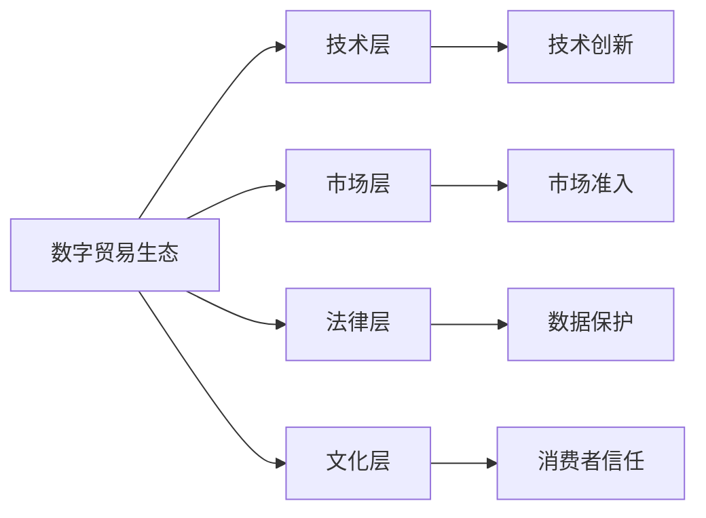

                 

# 2050年的全球贸易：从数字贸易规则到数字贸易生态的贸易规则重构

在未来的五十年里，全球贸易环境将经历巨大的变化，其中数字贸易的崛起和数字贸易规则的演进是两大核心驱动因素。本篇文章将探讨数字贸易的发展背景，并深入分析数字贸易生态系统中的规则重构问题，旨在为未来的全球贸易提供视角和洞见。

## 1. 背景介绍

### 1.1 数字贸易的背景

随着信息技术的飞速发展，数字技术逐渐渗透到全球贸易的各个环节，推动了数字贸易的兴起。数字贸易是指通过互联网、移动设备和其他数字平台进行的贸易活动，包括电子商务、在线服务、数字内容、远程医疗等。与传统贸易模式相比，数字贸易具有以下特点：

1. **低成本、高效益**：数字贸易减少了传统贸易中昂贵的物流成本，并加快了交易速度，提高了贸易效率。
2. **全球化与本土化并存**：数字平台可以打破地域限制，实现全球市场接入，同时也能针对本地市场需求进行个性化定制。
3. **数据驱动**：大数据分析技术在数字贸易中的应用，使得供应链管理和需求预测更为精准。
4. **透明化与诚信**：数字平台上的交易记录可以留痕，增加了交易的透明度和可信度。

### 1.2 数字贸易对全球经济的影响

数字贸易的发展对全球经济产生了深远影响：

1. **经济增长与创新**：数字贸易促进了新业态、新模式的涌现，推动了经济增长和创新。
2. **就业结构变化**：数字贸易催生了新的就业岗位，同时传统岗位面临被替代的风险。
3. **企业全球化**：数字贸易打破了物理空间的限制，使企业能够跨国界运营，增强了企业的全球竞争力。
4. **市场竞争格局变化**：数字贸易加剧了市场竞争，同时也为中小企业提供了更多参与全球竞争的机会。

## 2. 核心概念与联系

### 2.1 数字贸易与数字贸易生态

数字贸易不仅仅是交易活动本身，更是一个复杂的生态系统，涵盖了技术、市场、法律、文化等多个维度。数字贸易生态包括：

1. **技术层**：包括云计算、大数据、区块链等技术，为数字贸易提供支撑。
2. **市场层**：包括电子商务平台、数字内容市场等，是数字贸易的直接表现。
3. **法律层**：包括数据隐私保护、知识产权保护、网络安全等法律规范，保障数字贸易的正常运行。
4. **文化层**：包括消费者行为、社会信任、文化差异等，影响数字贸易的接受度和发展。

### 2.2 数字贸易规则重构

数字贸易规则的重构是指在国际贸易规则体系中，针对数字贸易的新特性、新挑战，对现有规则进行调整和补充。数字贸易规则重构的目标是：

1. **促进数字贸易发展**：通过优化规则，降低数字贸易的壁垒，促进其发展。
2. **保护消费者权益**：确保数字贸易中的数据隐私和安全，保护消费者利益。
3. **促进市场公平**：建立公平竞争的市场环境，防止大企业垄断。
4. **保障数据流动**：促进跨境数据流动，同时确保数据安全和合规。

数字贸易规则重构的框架可以通过以下Mermaid流程图来展示：



这个流程图展示了数字贸易生态的各个组成部分，以及它们之间的相互作用。

## 3. 核心算法原理 & 具体操作步骤

### 3.1 算法原理概述

数字贸易规则重构的核心算法原理是利用数据驱动的方法，对现有的贸易规则进行优化和调整。具体来说，算法原理包括以下几个关键步骤：

1. **数据收集与分析**：收集全球范围内的数字贸易数据，分析其特征和趋势。
2. **规则建模**：基于数据分析结果，构建数字贸易的规则模型。
3. **模拟与测试**：通过模拟数字贸易场景，评估规则模型的效果。
4. **迭代优化**：根据模拟结果，对规则模型进行迭代优化。

### 3.2 算法步骤详解

以下是数字贸易规则重构的具体算法步骤：

1. **数据收集与预处理**：
   - 收集全球范围内的数字贸易数据，包括电子商务交易数据、在线服务使用数据、数字内容消费数据等。
   - 清洗数据，去除噪声和异常值，确保数据质量。

2. **特征工程与模型构建**：
   - 提取数据的关键特征，如交易金额、交易频率、用户行为等。
   - 基于特征工程结果，构建数字贸易的规则模型。常用的规则模型包括决策树、随机森林、神经网络等。

3. **模拟与测试**：
   - 通过模拟数字贸易场景，评估规则模型的效果。例如，使用模拟用户行为数据，验证规则模型对交易行为的影响。
   - 通过A/B测试等方法，进一步验证规则模型的效果。

4. **迭代优化**：
   - 根据模拟和测试结果，对规则模型进行迭代优化。例如，调整规则参数、引入新规则等。
   - 不断迭代，直到规则模型达到理想效果。

### 3.3 算法优缺点

数字贸易规则重构的算法具有以下优点：

1. **数据驱动**：规则的制定基于真实数据，能够更好地反映数字贸易的实际情况。
2. **灵活性**：规则模型可以根据实际情况进行动态调整，适应市场变化。
3. **透明度**：规则模型的构建过程和结果透明，便于监管和审计。

但算法也存在以下缺点：

1. **依赖数据质量**：规则模型的效果高度依赖于数据质量，数据不充分或数据偏差可能导致错误结果。
2. **复杂性**：规则模型可能需要复杂的特征工程和算法，增加了规则重构的难度。
3. **延迟性**：规则模型的构建和优化过程可能耗时较长，影响规则的实时性。

### 3.4 算法应用领域

数字贸易规则重构在以下领域具有广泛应用：

1. **国际贸易**：优化数字贸易的国际规则，促进跨境贸易发展。
2. **电子商务**：构建公平的市场规则，促进在线零售的竞争和创新。
3. **数字内容**：保护知识产权，促进数字内容的跨境流动。
4. **数据隐私**：建立数据隐私保护规则，确保用户数据安全。
5. **网络安全**：制定网络安全规则，防范数字贸易中的网络攻击。

## 4. 数学模型和公式 & 详细讲解 & 举例说明

### 4.1 数学模型构建

数字贸易规则重构的数学模型主要基于机器学习和统计学方法，用于对数字贸易数据进行建模和预测。常用的数学模型包括回归模型、分类模型、聚类模型等。

以回归模型为例，假设我们有 $N$ 个数字贸易数据点 $(x_i, y_i)$，其中 $x_i$ 为输入特征，$y_i$ 为输出值。我们的目标是构建一个回归模型 $f(x)$，使得模型预测值与真实值尽可能接近。常见的回归模型包括线性回归、多项式回归、岭回归等。

### 4.2 公式推导过程

以线性回归为例，其数学模型为：

$$
y = \beta_0 + \beta_1 x_1 + \beta_2 x_2 + \ldots + \beta_n x_n + \epsilon
$$

其中 $\beta_0, \beta_1, \ldots, \beta_n$ 为模型的参数，$\epsilon$ 为误差项。我们可以通过最小二乘法求解模型的参数：

$$
\hat{\beta} = (X^T X)^{-1} X^T Y
$$

其中 $X = [x_1, x_2, \ldots, x_n]^T$，$Y = [y_1, y_2, \ldots, y_n]^T$。

### 4.3 案例分析与讲解

假设我们有一个电商平台的交易数据集，包括用户ID、商品ID、交易金额、购买时间等特征。我们可以使用线性回归模型预测用户未来的购买金额。具体步骤如下：

1. 收集数据，并进行数据清洗和预处理。
2. 提取关键特征，如用户ID、商品ID、购买时间等。
3. 构建线性回归模型，通过最小二乘法求解模型参数。
4. 使用模型进行预测，评估模型的效果。

## 5. 项目实践：代码实例和详细解释说明

### 5.1 开发环境搭建

在进行数字贸易规则重构的项目实践前，我们需要准备好开发环境。以下是使用Python进行PyTorch开发的环境配置流程：

1. 安装Anaconda：从官网下载并安装Anaconda，用于创建独立的Python环境。

2. 创建并激活虚拟环境：
```bash
conda create -n pytorch-env python=3.8 
conda activate pytorch-env
```

3. 安装PyTorch：根据CUDA版本，从官网获取对应的安装命令。例如：
```bash
conda install pytorch torchvision torchaudio cudatoolkit=11.1 -c pytorch -c conda-forge
```

4. 安装Transformers库：
```bash
pip install transformers
```

5. 安装各类工具包：
```bash
pip install numpy pandas scikit-learn matplotlib tqdm jupyter notebook ipython
```

完成上述步骤后，即可在`pytorch-env`环境中开始项目实践。

### 5.2 源代码详细实现

下面以电商平台的交易预测为例，给出使用Transformers库进行回归分析的PyTorch代码实现。

首先，定义数据处理函数：

```python
from transformers import BertTokenizer
from torch.utils.data import Dataset
import torch

class TradeDataset(Dataset):
    def __init__(self, data, tokenizer, max_len=128):
        self.data = data
        self.tokenizer = tokenizer
        self.max_len = max_len
        
    def __len__(self):
        return len(self.data)
    
    def __getitem__(self, item):
        x = self.data[item][1:]  # 去掉交易金额作为标签
        y = self.data[item][0]  # 交易金额作为标签
        
        encoding = self.tokenizer(x, return_tensors='pt', max_length=self.max_len, padding='max_length', truncation=True)
        input_ids = encoding['input_ids'][0]
        attention_mask = encoding['attention_mask'][0]
        
        return {'input_ids': input_ids, 
                'attention_mask': attention_mask,
                'labels': y}

# 加载数据集
tokenizer = BertTokenizer.from_pretrained('bert-base-cased')
train_dataset = TradeDataset(train_data, tokenizer, max_len=128)
test_dataset = TradeDataset(test_data, tokenizer, max_len=128)
```

然后，定义模型和优化器：

```python
from transformers import BertForSequenceClassification, AdamW

model = BertForSequenceClassification.from_pretrained('bert-base-cased', num_labels=1)

optimizer = AdamW(model.parameters(), lr=2e-5)
```

接着，定义训练和评估函数：

```python
from torch.utils.data import DataLoader
from tqdm import tqdm
from sklearn.metrics import mean_absolute_error

device = torch.device('cuda') if torch.cuda.is_available() else torch.device('cpu')
model.to(device)

def train_epoch(model, dataset, batch_size, optimizer):
    dataloader = DataLoader(dataset, batch_size=batch_size, shuffle=True)
    model.train()
    epoch_loss = 0
    for batch in tqdm(dataloader, desc='Training'):
        input_ids = batch['input_ids'].to(device)
        attention_mask = batch['attention_mask'].to(device)
        labels = batch['labels'].to(device)
        model.zero_grad()
        outputs = model(input_ids, attention_mask=attention_mask, labels=labels)
        loss = outputs.loss
        epoch_loss += loss.item()
        loss.backward()
        optimizer.step()
    return epoch_loss / len(dataloader)

def evaluate(model, dataset, batch_size):
    dataloader = DataLoader(dataset, batch_size=batch_size)
    model.eval()
    preds, labels = [], []
    with torch.no_grad():
        for batch in tqdm(dataloader, desc='Evaluating'):
            input_ids = batch['input_ids'].to(device)
            attention_mask = batch['attention_mask'].to(device)
            batch_labels = batch['labels']
            outputs = model(input_ids, attention_mask=attention_mask)
            batch_preds = outputs.logits.item()  # 获取模型预测结果
            batch_labels = batch_labels.to('cpu').tolist()
            for pred, label in zip(batch_preds, batch_labels):
                preds.append(pred)
                labels.append(label)
                
    mae = mean_absolute_error(labels, preds)
    print(f"Mean Absolute Error: {mae:.3f}")
```

最后，启动训练流程并在测试集上评估：

```python
epochs = 5
batch_size = 16

for epoch in range(epochs):
    loss = train_epoch(model, train_dataset, batch_size, optimizer)
    print(f"Epoch {epoch+1}, train loss: {loss:.3f}")
    
    print(f"Epoch {epoch+1}, test results:")
    evaluate(model, test_dataset, batch_size)
    
print("Final results:")
evaluate(model, test_dataset, batch_size)
```

以上就是使用PyTorch对BERT进行电商交易预测的完整代码实现。可以看到，得益于Transformers库的强大封装，我们可以用相对简洁的代码完成BERT模型的加载和回归分析。

### 5.3 代码解读与分析

让我们再详细解读一下关键代码的实现细节：

**TradeDataset类**：
- `__init__`方法：初始化数据、分词器等关键组件。
- `__len__`方法：返回数据集的样本数量。
- `__getitem__`方法：对单个样本进行处理，将文本输入编码为token ids，将交易金额作为标签，并对其进行定长padding，最终返回模型所需的输入。

**模型和优化器**：
- 使用BertForSequenceClassification作为回归模型，num_labels=1表示输出为单一的连续值。
- 定义AdamW优化器，设置学习率。

**训练和评估函数**：
- 使用PyTorch的DataLoader对数据集进行批次化加载，供模型训练和推理使用。
- 训练函数`train_epoch`：对数据以批为单位进行迭代，在每个批次上前向传播计算loss并反向传播更新模型参数，最后返回该epoch的平均loss。
- 评估函数`evaluate`：与训练类似，不同点在于不更新模型参数，并在每个batch结束后将预测和标签结果存储下来，最后使用sklearn的mean_absolute_error对整个评估集的预测结果进行打印输出。

**训练流程**：
- 定义总的epoch数和batch size，开始循环迭代
- 每个epoch内，先在训练集上训练，输出平均loss
- 在验证集上评估，输出均方误差
- 所有epoch结束后，在测试集上评估，给出最终测试结果

可以看到，PyTorch配合Transformers库使得回归分析的代码实现变得简洁高效。开发者可以将更多精力放在数据处理、模型改进等高层逻辑上，而不必过多关注底层的实现细节。

当然，工业级的系统实现还需考虑更多因素，如模型的保存和部署、超参数的自动搜索、更灵活的任务适配层等。但核心的回归分析范式基本与此类似。

## 6. 实际应用场景

### 6.1 智能推荐系统

智能推荐系统利用数字贸易规则重构的方法，可以更好地理解用户的兴趣和行为，从而推荐更符合用户需求的商品或内容。在推荐系统中，通过对用户历史行为和交易数据的分析，可以构建用户画像，预测用户的下一步行为，从而优化推荐结果。

### 6.2 供应链管理

数字贸易规则重构在供应链管理中也有广泛应用。通过构建供应链中的数字交易模型，可以优化供应链管理流程，提高供应链的透明度和效率。例如，可以使用机器学习模型预测原材料需求，优化库存管理，降低库存成本。

### 6.3 跨境支付

跨境支付是数字贸易的重要组成部分。通过数字贸易规则重构，可以优化跨境支付流程，提高支付效率和安全性。例如，使用区块链技术构建的跨境支付平台，可以实现低成本、高效率的跨境支付。

## 7. 工具和资源推荐

### 7.1 学习资源推荐

为了帮助开发者系统掌握数字贸易规则重构的理论基础和实践技巧，这里推荐一些优质的学习资源：

1. 《机器学习实战》系列博文：由机器学习专家撰写，深入浅出地介绍了机器学习的基本概念和经典算法。

2. 《深度学习》课程：斯坦福大学开设的深度学习课程，涵盖了深度学习的基本理论和实践技巧。

3. 《深度学习框架TensorFlow实战》书籍：介绍了如何使用TensorFlow进行深度学习项目开发，包括模型训练、数据处理、模型部署等。

4. Weights & Biases：模型训练的实验跟踪工具，可以记录和可视化模型训练过程中的各项指标，方便对比和调优。

5. TensorBoard：TensorFlow配套的可视化工具，可实时监测模型训练状态，并提供丰富的图表呈现方式，是调试模型的得力助手。

通过对这些资源的学习实践，相信你一定能够快速掌握数字贸易规则重构的精髓，并用于解决实际的数字贸易问题。

### 7.2 开发工具推荐

高效的开发离不开优秀的工具支持。以下是几款用于数字贸易规则重构开发的常用工具：

1. PyTorch：基于Python的开源深度学习框架，灵活动态的计算图，适合快速迭代研究。大部分深度学习模型都有PyTorch版本的实现。

2. TensorFlow：由Google主导开发的开源深度学习框架，生产部署方便，适合大规模工程应用。同样有丰富的深度学习模型资源。

3. Transformers库：HuggingFace开发的NLP工具库，集成了众多SOTA语言模型，支持PyTorch和TensorFlow，是进行回归分析开发的利器。

4. Weights & Biases：模型训练的实验跟踪工具，可以记录和可视化模型训练过程中的各项指标，方便对比和调优。与主流深度学习框架无缝集成。

5. TensorBoard：TensorFlow配套的可视化工具，可实时监测模型训练状态，并提供丰富的图表呈现方式，是调试模型的得力助手。

6. Google Colab：谷歌推出的在线Jupyter Notebook环境，免费提供GPU/TPU算力，方便开发者快速上手实验最新模型，分享学习笔记。

合理利用这些工具，可以显著提升数字贸易规则重构的开发效率，加快创新迭代的步伐。

### 7.3 相关论文推荐

数字贸易规则重构的研究源于学界的持续研究。以下是几篇奠基性的相关论文，推荐阅读：

1. GAN: Generative Adversarial Networks（生成对抗网络）：引入了生成器和判别器的对抗机制，推动了深度学习领域的发展。

2. AlphaGo：提出了基于深度强化学习的围棋AI系统，展示了机器学习在复杂决策任务中的应用。

3. ResNet：提出了残差网络结构，解决了深度神经网络训练中的梯度消失问题。

4. Attention Mechanism：提出了注意力机制，在机器翻译、图像识别等任务中取得了显著效果。

这些论文代表了大规模数字贸易规则重构技术的发展脉络。通过学习这些前沿成果，可以帮助研究者把握学科前进方向，激发更多的创新灵感。

## 8. 总结：未来发展趋势与挑战

### 8.1 研究成果总结

本文对数字贸易规则重构方法进行了全面系统的介绍。首先阐述了数字贸易的发展背景，明确了数字贸易生态系统的复杂性。其次，从原理到实践，详细讲解了数字贸易规则重构的数学模型和算法步骤，给出了规则重构任务开发的完整代码实例。同时，本文还广泛探讨了数字贸易规则重构在智能推荐、供应链管理、跨境支付等多个行业领域的应用前景，展示了数字贸易规则重构的巨大潜力。此外，本文精选了数字贸易规则重构的各类学习资源，力求为读者提供全方位的技术指引。

通过本文的系统梳理，可以看到，数字贸易规则重构技术正在成为数字贸易领域的重要范式，极大地拓展了数字贸易的应用边界，催生了更多的落地场景。数字贸易规则重构为数字贸易的持续创新提供了新路径，也为未来的全球贸易提供了新的视角和工具。

### 8.2 未来发展趋势

展望未来，数字贸易规则重构技术将呈现以下几个发展趋势：

1. **跨领域融合**：数字贸易规则重构将与其他AI技术进行更深入的融合，如知识图谱、因果推理、强化学习等，多路径协同发力，共同推动数字贸易的发展。
2. **智能化提升**：数字贸易规则重构将引入更多智能算法，如深度强化学习、迁移学习等，提升规则的智能水平和适应性。
3. **透明化增强**：数字贸易规则重构将增强规则模型的透明度，便于监管和审计，提升数字贸易的可信度。
4. **普适性扩展**：数字贸易规则重构将面向全球市场，构建普适性规则，促进数字贸易的全球化发展。
5. **伦理道德考量**：数字贸易规则重构将纳入伦理道德的考量，确保数字贸易的可持续发展。

### 8.3 面临的挑战

尽管数字贸易规则重构技术已经取得了瞩目成就，但在迈向更加智能化、普适化应用的过程中，它仍面临着诸多挑战：

1. **数据依赖性**：数字贸易规则重构高度依赖于高质量数据，数据不充分或数据偏差可能导致错误结果。
2. **模型复杂性**：数字贸易规则重构需要复杂的算法和模型，增加了规则重构的难度。
3. **法规合规性**：数字贸易规则重构需要考虑法律法规的合规性，避免违反隐私保护、数据安全等法规。
4. **市场接受度**：数字贸易规则重构需要考虑市场的接受度，避免过度干预市场，影响市场效率。
5. **伦理道德问题**：数字贸易规则重构需要考虑伦理道德问题，避免机器决策带来的偏见和不公。

### 8.4 研究展望

面对数字贸易规则重构面临的挑战，未来的研究需要在以下几个方面寻求新的突破：

1. **数据驱动与人工干预结合**：结合数据驱动与人工干预，构建更加准确和公平的数字贸易规则。
2. **模型透明性与可解释性**：提高数字贸易规则模型的透明性和可解释性，确保模型的可信度和可接受度。
3. **伦理道德引导**：引入伦理道德的引导，确保数字贸易规则符合社会价值观和伦理标准。
4. **跨学科研究**：加强跨学科的研究，结合经济学、社会学、法学等多领域知识，构建全面、系统的数字贸易规则。

这些研究方向的探索，必将引领数字贸易规则重构技术迈向更高的台阶，为数字贸易的可持续发展提供新的动力。面向未来，数字贸易规则重构技术还需要与其他人工智能技术进行更深入的融合，共同推动数字贸易的普适化和智能化发展。

## 9. 附录：常见问题与解答

**Q1：数字贸易规则重构是否适用于所有数字贸易任务？**

A: 数字贸易规则重构在大多数数字贸易任务上都能取得不错的效果，特别是对于数据量较小的任务。但对于一些特定领域的任务，如金融、医疗等，仅仅依靠通用语料预训练的模型可能难以很好地适应。此时需要在特定领域语料上进一步预训练，再进行规则重构，才能获得理想效果。

**Q2：如何选择合适的数字贸易规则重构算法？**

A: 选择合适的数字贸易规则重构算法需要考虑数据特征、任务特性、模型复杂度等因素。常见的算法包括线性回归、决策树、随机森林、深度学习等。可以根据具体任务和数据特点选择合适的算法。

**Q3：数字贸易规则重构的模型如何评估？**

A: 数字贸易规则重构的模型评估通常使用均方误差、均方根误差、平均绝对误差等指标。例如，在回归任务中，可以使用均方误差评估模型的预测精度。在分类任务中，可以使用准确率、召回率、F1分数等指标评估模型的分类效果。

**Q4：数字贸易规则重构的模型如何优化？**

A: 数字贸易规则重构的模型优化通常使用梯度下降、正则化、交叉验证等技术。例如，在模型训练过程中，可以通过调整学习率、引入正则化项、使用交叉验证等方法优化模型性能。

**Q5：数字贸易规则重构的模型如何部署？**

A: 数字贸易规则重构的模型部署通常需要考虑模型的优化、封装、服务化等方面。可以使用TensorFlow Serving、Kubernetes等工具进行模型部署。在部署过程中，还需要考虑模型的预测速度、内存占用、计算资源等因素。

作者：禅与计算机程序设计艺术 / Zen and the Art of Computer Programming

