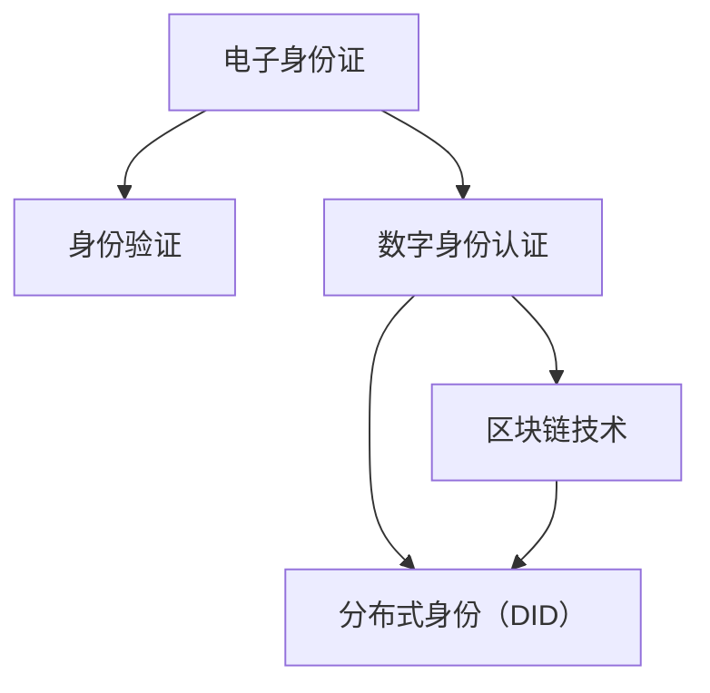

                 

# 2050年的数字身份：从电子身份证到数字公民的身份认证

## 1. 背景介绍

### 1.1 问题由来

随着数字经济和智能社会的快速发展，数字身份已成为人们数字化生活的重要基础。早在20世纪60年代，电子身份证作为第一个数字身份技术已出现在人类历史中，用于简化身份验证和资源访问的过程。然而，随着互联网和物联网的蓬勃发展，单一的电子身份证已经无法满足现代社会的多元化需求。如何构建一个全面、安全、互联的数字身份体系，以支持未来的数字社会，成为当前亟待解决的关键问题。

### 1.2 问题核心关键点

数字身份的本质是个体在数字世界中的唯一标识，旨在实现跨组织、跨平台、跨时间的身份认证、授权和可信信息的获取。一个有效的数字身份系统需要具备以下特性：

- **身份标识唯一性**：确保每个数字身份的唯一性，避免重复和冒名顶替。
- **安全性和隐私保护**：保障用户身份信息的安全，防止数据泄露和滥用。
- **互操作性和扩展性**：支持多种身份验证方式，适应不同的应用场景和需求。
- **可验证性和可信性**：具备不可伪造和篡改的特性，确保身份信息的真实可靠。
- **持续性和动态性**：能够随时间变化更新，适应个体身份的动态变化。

### 1.3 问题研究意义

数字身份系统的构建对数字经济、智能社会以及个人生活具有深远的影响：

1. **安全保障**：通过统一的数字身份系统，可以提高安全性和隐私保护水平，减少身份盗窃和欺诈风险。
2. **便利体验**：简化身份验证流程，提升用户体验，促进各类数字服务的便捷应用。
3. **数据流通**：为不同平台和组织间的身份信息共享提供安全保障，推动数据流通和资源优化配置。
4. **信任构建**：基于可信的数字身份，促进交易信任，降低社会交往中的信任成本。
5. **身份赋能**：使个体在数字世界中获得更多的权利和自由，增强个人自主权和隐私控制力。

本文将系统探讨从电子身份证到数字公民身份认证的演变过程，通过理解其核心概念和实现原理，旨在为构建未来的数字身份体系提供理论基础和实践指导。

## 2. 核心概念与联系

### 2.1 核心概念概述

数字身份系统的核心概念包括电子身份证、数字身份认证、区块链技术、分布式身份（DID）等。这些概念之间存在密切的联系，通过技术演进和应用实践，逐步构建起未来的数字公民身份认证体系。

- **电子身份证**：基于传统身份证的数字电子化形式，用于验证身份和访问权限。
- **数字身份认证**：通过多种技术手段，如生物识别、密码学、多因素认证等，验证用户身份的真实性。
- **区块链技术**：一种去中心化、不可篡改的数据存储和传输技术，用于增强身份认证的安全性和可信性。
- **分布式身份（DID）**：基于区块链技术的身份系统，实现用户身份信息的分布式管理和共享。

这些概念通过技术演进和融合，形成了从电子身份证到数字公民身份认证的完整框架。

### 2.2 核心概念原理和架构的 Mermaid 流程图



这个流程图展示了电子身份证向数字身份认证的演变过程，以及区块链和分布式身份技术在其中扮演的重要角色。电子身份证通过身份验证，逐步演变为更为安全和可信的数字身份认证系统。

## 3. 核心算法原理 & 具体操作步骤

### 3.1 算法原理概述

数字身份认证系统的核心算法包括密码学算法、区块链技术、多因素认证等。这些算法共同构建了一个安全、可扩展的身份认证体系。

- **密码学算法**：如哈希函数、对称加密、非对称加密等，用于保护身份信息的安全性和完整性。
- **区块链技术**：通过分布式账本和智能合约，实现身份信息的不可篡改和透明管理。
- **多因素认证**：结合多种身份验证方式，如密码、生物特征、地理位置等，提高身份验证的准确性和安全性。

这些算法相互配合，确保了数字身份认证系统的高效和可靠。

### 3.2 算法步骤详解

数字身份认证系统的一般操作步骤如下：

1. **身份注册**：用户通过官方渠道进行身份注册，获取电子身份证。
2. **身份验证**：用户登录或访问服务时，系统通过密码学算法和/或多因素认证技术验证用户身份。
3. **区块链记录**：用户身份信息及其验证结果被记录在区块链上，确保数据的透明性和不可篡改性。
4. **分布式管理**：用户身份信息分散存放在不同的节点上，增强系统的安全性和可靠性。
5. **授权访问**：系统根据用户身份信息授权其访问特定资源或服务，保障数据的安全性。

### 3.3 算法优缺点

数字身份认证系统的优点包括：

- **安全性高**：通过密码学算法和区块链技术，提高了身份信息的保护水平。
- **扩展性强**：支持多种身份验证方式，适应不同的应用场景。
- **透明可信**：区块链技术保证了身份信息的透明性和不可篡改性。
- **用户自主**：用户可以自主管理身份信息，增强了隐私保护。

但系统也存在一些缺点：

- **技术复杂**：实现和维护技术复杂，需要跨学科的专业知识。
- **成本高昂**：初期部署和维护成本较高，需要一定的技术投入和资源支持。
- **隐私风险**：过度依赖数据公开，存在隐私泄露的风险。

### 3.4 算法应用领域

数字身份认证系统在多个领域都有广泛的应用，如：

- **金融服务**：用于身份验证、交易授权、反欺诈等。
- **医疗保健**：用于患者身份验证、电子病历管理、药品追溯等。
- **公共安全**：用于出入管理、身份验证、事件监控等。
- **电子商务**：用于用户身份验证、交易保障、支付安全等。
- **智能城市**：用于交通管理、环境监测、公共服务认证等。

这些应用场景展示了数字身份认证系统的多样性和实用性。

## 4. 数学模型和公式 & 详细讲解 & 举例说明

### 4.1 数学模型构建

数字身份认证系统的数学模型通常包括身份验证模型、数据加密模型和智能合约模型。

1. **身份验证模型**：用于验证用户身份的合法性，常见公式如下：

   $$
   \text{Verify}(\text{ID}, \text{Secret}) = \begin{cases}
   \text{True}, & \text{if } \text{Hash}(\text{ID} + \text{Secret}) = \text{ID} \\
   \text{False}, & \text{otherwise}
   \end{cases}
   $$

   其中，$\text{ID}$ 为电子身份证，$\text{Secret}$ 为用户密码，$\text{Hash}$ 为哈希函数。

2. **数据加密模型**：用于保护用户身份信息的安全性，常见公式如下：

   $$
   \text{Encrypt}(\text{Data}, \text{Key}) = \text{E}(\text{Data}, \text{Key})
   $$

   其中，$\text{Data}$ 为用户身份信息，$\text{Key}$ 为加密密钥，$\text{E}$ 为加密算法。

3. **智能合约模型**：用于自动执行和管理身份认证过程，常见公式如下：

   $$
   \text{Contract}(\text{Condition}, \text{Action}) = 
   \begin{cases}
   \text{ExecuteAction}, & \text{if } \text{Condition} \\
   \text{Fail}, & \text{otherwise}
   \end{cases}
   $$

   其中，$\text{Condition}$ 为身份验证条件，$\text{Action}$ 为授权操作。

### 4.2 公式推导过程

以身份验证模型为例，推导验证过程如下：

1. **输入**：电子身份证 $\text{ID}$ 和用户密码 $\text{Secret}$。
2. **计算**：将 $\text{ID}$ 和 $\text{Secret}$ 拼接，通过哈希函数 $\text{Hash}$ 计算得到 $\text{Hash}(\text{ID} + \text{Secret})$。
3. **验证**：将计算结果 $\text{Hash}(\text{ID} + \text{Secret})$ 与 $\text{ID}$ 比较，判断是否相等。

   当且仅当 $\text{Hash}(\text{ID} + \text{Secret}) = \text{ID}$ 时，验证通过，用户身份合法。

### 4.3 案例分析与讲解

以电子支付为例，分析数字身份认证系统的应用：

1. **身份注册**：用户通过银行App进行身份注册，获取电子支付凭证。
2. **身份验证**：用户在支付时，输入电子支付凭证和登录密码，通过哈希函数和对称加密技术验证身份。
3. **交易记录**：支付交易信息被记录在区块链上，确保数据的透明性和不可篡改性。
4. **授权访问**：系统根据用户身份信息授权其访问特定的银行账户和资金，保障数据的安全性。

通过数字身份认证系统，用户可以在不泄露密码的前提下，安全地进行电子支付，提升支付体验。

## 5. 项目实践：代码实例和详细解释说明

### 5.1 开发环境搭建

搭建数字身份认证系统的开发环境，需要以下工具和资源：

1. **编程语言**：Python、Java等。
2. **开发框架**：Django、Spring Boot等。
3. **数据库**：MySQL、MongoDB等。
4. **区块链平台**：Hyperledger Fabric、Ethereum等。
5. **测试工具**：JUnit、Pytest等。

### 5.2 源代码详细实现

以一个简单的身份验证系统为例，使用Python和Flask框架实现：

```python
from flask import Flask, request
from hashlib import sha256
from base64 import b64encode

app = Flask(__name__)

@app.route('/verify', methods=['POST'])
def verify_identity():
    # 获取请求参数
    id = request.form.get('id')
    secret = request.form.get('secret')

    # 计算哈希值
    hash_value = sha256((id + secret).encode()).hexdigest()

    # 验证哈希值是否与ID相等
    if hash_value == id:
        return b64encode(id.encode()).decode() # 返回Base64编码的ID
    else:
        return 'Invalid ID or Secret'

if __name__ == '__main__':
    app.run(debug=True)
```

### 5.3 代码解读与分析

上述代码实现了一个简单的身份验证功能，主要包含以下步骤：

1. **获取请求参数**：通过`request.form`获取用户输入的电子身份证 $\text{ID}$ 和用户密码 $\text{Secret}$。
2. **计算哈希值**：将 $\text{ID}$ 和 $\text{Secret}$ 拼接，通过SHA-256计算哈希值。
3. **验证哈希值**：将计算结果与 $\text{ID}$ 比较，判断是否相等。
4. **返回结果**：如果验证通过，返回Base64编码的 $\text{ID}$；否则返回错误信息。

### 5.4 运行结果展示

在运行上述代码后，可以使用以下请求进行测试：

```
POST /verify HTTP/1.1
Host: localhost:5000
Content-Type: application/x-www-form-urlencoded

id=alice
secret=1234
```

期望返回结果：

```
alice
```

如果返回结果为"Invalid ID or Secret"，则说明身份验证失败。

## 6. 实际应用场景

### 6.1 智能身份认证

数字身份认证系统在智能身份认证场景中的应用非常广泛，如：

- **智能门禁**：通过电子身份证和生物识别技术，实现门禁的自动化管理。
- **智能合约**：通过区块链技术，实现自动化的合同执行和纠纷解决。
- **智能选举**：通过数字身份认证，确保选举过程的公正性和透明性。

### 6.2 数字资产管理

数字身份认证系统在数字资产管理场景中的应用包括：

- **数字身份证明**：用于证明数字资产所有权，防止资产丢失或被盗。
- **资产交易验证**：通过区块链技术，验证资产交易的真实性和安全性。
- **去中心化金融（DeFi）**：实现去中心化的借贷、投资等金融服务。

### 6.3 数字身份交易

数字身份认证系统在数字身份交易场景中的应用包括：

- **数字身份交换**：通过区块链技术，实现数字身份的安全交换。
- **数字身份租赁**：用户可以将自己的数字身份租借给第三方使用，获取经济收益。
- **身份保险**：为数字身份提供保险服务，降低身份盗用风险。

### 6.4 未来应用展望

未来，数字身份认证系统将进一步发展，包括以下方向：

1. **全链路安全**：从身份注册、验证到访问授权的全链路安全保障。
2. **跨平台互认**：实现不同平台和组织间的身份互认，促进数据流通。
3. **身份证明去中心化**：利用区块链技术，实现去中心化的身份证明和认证。
4. **隐私保护**：通过差分隐私和同态加密等技术，保护用户隐私。
5. **身份认证智能化**：结合AI和大数据技术，提升身份认证的智能化水平。

## 7. 工具和资源推荐

### 7.1 学习资源推荐

- **《区块链技术与应用》**：介绍区块链技术的基本原理和应用场景。
- **《分布式身份技术与应用》**：讲解DID技术的基本概念和实践应用。
- **《密码学基础》**：介绍密码学算法的基本原理和实现方法。
- **《多因素认证技术与应用》**：讲解多因素认证的基本原理和实践应用。

### 7.2 开发工具推荐

- **Flask**：轻量级Web框架，适合构建小型身份验证系统。
- **Spring Boot**：Java Web框架，适合构建大型的身份验证系统。
- **Hyperledger Fabric**：企业级区块链平台，适合构建去中心化的身份认证系统。
- **Ethereum**：开源区块链平台，适合构建去中心化的数字身份系统。

### 7.3 相关论文推荐

- **《基于区块链的数字身份认证系统研究》**：介绍基于区块链的数字身份认证系统。
- **《分布式身份系统及其应用》**：讲解DID系统及其应用场景。
- **《智能合约与安全多方计算》**：介绍智能合约及其安全性问题。
- **《多因素身份认证技术综述》**：综述多因素身份认证技术的研究现状和未来发展方向。

## 8. 总结：未来发展趋势与挑战

### 8.1 总结

本文详细探讨了从电子身份证到数字公民身份认证的演变过程，通过理解其核心概念和实现原理，为构建未来的数字身份体系提供了理论基础和实践指导。数字身份认证系统的构建对数字经济、智能社会以及个人生活具有深远的影响。

### 8.2 未来发展趋势

未来，数字身份认证系统将呈现以下发展趋势：

1. **全链路安全**：实现从身份注册、验证到访问授权的全链路安全保障。
2. **跨平台互认**：实现不同平台和组织间的身份互认，促进数据流通。
3. **去中心化**：利用区块链技术，实现去中心化的身份认证和资产管理。
4. **智能化**：结合AI和大数据技术，提升身份认证的智能化水平。
5. **隐私保护**：通过差分隐私和同态加密等技术，保护用户隐私。

### 8.3 面临的挑战

数字身份认证系统在构建和应用过程中，面临以下挑战：

1. **技术复杂性**：系统实现和维护需要跨学科的专业知识，技术难度较大。
2. **成本高昂**：初期部署和维护成本较高，需要一定的技术投入和资源支持。
3. **隐私风险**：过度依赖数据公开，存在隐私泄露的风险。
4. **安全性问题**：身份认证系统面临诸多安全威胁，如DDoS攻击、身份盗用等。
5. **互操作性**：不同平台和系统之间的互认和数据流通问题。

### 8.4 研究展望

未来，数字身份认证系统需要在以下方面进行深入研究：

1. **跨平台互认标准**：制定统一的身份互认标准，促进不同平台和组织之间的互认。
2. **隐私保护技术**：研究差分隐私和同态加密等隐私保护技术，保障用户隐私。
3. **身份认证算法**：研究新的身份认证算法，提高系统的安全性。
4. **区块链应用**：深入研究区块链技术在身份认证中的应用，提高系统的可靠性和透明性。
5. **智能身份认证**：结合AI和大数据技术，提升身份认证的智能化水平。

综上所述，数字身份认证系统在未来的数字化社会中将扮演重要的角色，需要不断进行技术创新和优化，以应对各种挑战，推动社会全面数字化转型。

---

作者：禅与计算机程序设计艺术 / Zen and the Art of Computer Programming

