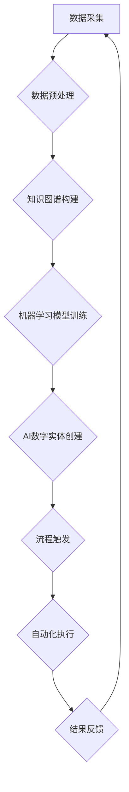

> AI数字实体、自动化、机器学习、自然语言处理、流程自动化、数据驱动、智能决策、未来趋势

## 1. 背景介绍

在当今数字化的时代，数据已成为企业最重要的资产。如何有效地利用数据，提升运营效率和创造价值，成为企业面临的重大挑战。人工智能（AI）技术的快速发展为数据驱动决策提供了强大的工具。其中，AI数字实体自动化技术作为一种新兴的应用领域，展现出巨大的潜力，能够帮助企业实现自动化、智能化和数据驱动的转型升级。

AI数字实体是指利用人工智能技术，将现实世界中的实体（如产品、服务、流程等）数字化，并赋予其智能感知、理解和决策的能力。通过对数字实体的自动化管理和操作，企业可以实现流程优化、资源配置、决策辅助等方面的突破。

## 2. 核心概念与联系

**2.1 AI数字实体的构成**

AI数字实体通常由以下几个核心组件构成：

* **数据模型:**  描述实体的属性、关系和行为的数据结构。
* **知识图谱:**  存储实体之间的知识关系和语义信息的知识库。
* **机器学习模型:**  用于分析数据、识别模式、预测未来行为的算法模型。
* **自然语言处理模型:**  用于理解和生成自然语言，实现人机交互的模型。
* **自动化引擎:**  用于执行实体的操作和决策的自动化系统。

**2.2 AI数字实体与自动化流程的联系**

AI数字实体自动化技术的核心是将数字实体与自动化流程相结合。通过对数字实体的智能感知和决策，可以自动触发和执行相应的流程操作，实现流程的自动化和智能化。

**2.3 AI数字实体自动化流程图**



## 3. 核心算法原理 & 具体操作步骤

**3.1 算法原理概述**

AI数字实体自动化的核心算法主要包括：

* **数据挖掘和分析算法:** 用于从海量数据中提取有价值的信息，识别模式和趋势。
* **机器学习算法:** 用于训练模型，使模型能够自动学习和预测。
* **自然语言处理算法:** 用于理解和生成自然语言，实现人机交互。
* **自动化流程引擎:** 用于执行自动化操作，实现流程的自动化和智能化。

**3.2 算法步骤详解**

1. **数据采集和预处理:** 收集相关数据，并进行清洗、转换和格式化等预处理操作。
2. **知识图谱构建:** 将数据转化为知识图谱，描述实体之间的关系和语义信息。
3. **机器学习模型训练:** 利用机器学习算法，训练模型，使模型能够识别模式、预测未来行为。
4. **AI数字实体创建:** 基于数据模型、知识图谱和机器学习模型，创建AI数字实体。
5. **流程设计和自动化:** 设计自动化流程，并与AI数字实体进行集成，实现流程的自动化和智能化。
6. **运行和监控:** 将自动化流程部署到生产环境，并进行监控和优化。

**3.3 算法优缺点**

**优点:**

* **自动化效率提升:** 自动化流程可以大幅提升效率，减少人工干预。
* **决策智能化:** AI数字实体可以基于数据分析和预测，提供智能决策支持。
* **数据驱动:** AI数字实体自动化基于数据驱动，能够不断学习和优化。

**缺点:**

* **数据依赖:** AI数字实体的性能依赖于数据的质量和数量。
* **算法复杂性:** 训练和维护复杂的机器学习模型需要专业技术。
* **伦理风险:** AI数字实体的决策可能存在伦理风险，需要谨慎考虑。

**3.4 算法应用领域**

AI数字实体自动化技术在各个领域都有广泛的应用，例如：

* **制造业:** 自动化生产流程、预测设备故障、优化库存管理。
* **金融业:** 自动化风控、智能理财、个性化服务。
* **医疗保健:** 自动化诊断、个性化治疗、药物研发。
* **零售业:** 个性化推荐、智能客服、库存管理。

## 4. 数学模型和公式 & 详细讲解 & 举例说明

**4.1 数学模型构建**

AI数字实体的数学模型通常基于图论、概率论和统计学等数学基础。

* **图论:** 用于描述实体之间的关系和结构。
* **概率论:** 用于描述实体的行为和状态的概率分布。
* **统计学:** 用于分析数据、识别模式和预测未来行为。

**4.2 公式推导过程**

例如，在预测设备故障的场景中，可以使用贝叶斯网络模型来描述设备状态和故障发生的概率关系。

$$P(故障|数据) = \frac{P(数据|故障) * P(故障)}{P(数据)}$$

其中：

* $P(故障|数据)$: 设备故障的概率，给定特定数据的情况下。
* $P(数据|故障)$: 给定设备故障的情况下，观察到特定数据的概率。
* $P(故障)$: 设备故障的先验概率。
* $P(数据)$: 观察到特定数据的概率。

**4.3 案例分析与讲解**

通过对历史数据进行分析，可以训练出预测设备故障的模型。当设备出现异常数据时，模型可以根据贝叶斯公式计算出设备故障的概率，并触发相应的预警机制。

## 5. 项目实践：代码实例和详细解释说明

**5.1 开发环境搭建**

* 操作系统: Ubuntu 20.04
* Python 版本: 3.8
* 必要的库: TensorFlow, PyTorch, scikit-learn, NLTK

**5.2 源代码详细实现**

```python
# 导入必要的库
import tensorflow as tf
from sklearn.model_selection import train_test_split

# 加载数据
data = ...

# 数据预处理
X = ...
y = ...

# 将数据分割为训练集和测试集
X_train, X_test, y_train, y_test = train_test_split(X, y, test_size=0.2)

# 创建模型
model = tf.keras.models.Sequential([
    tf.keras.layers.Dense(64, activation='relu', input_shape=(X_train.shape[1],)),
    tf.keras.layers.Dense(32, activation='relu'),
    tf.keras.layers.Dense(1, activation='sigmoid')
])

# 编译模型
model.compile(optimizer='adam', loss='binary_crossentropy', metrics=['accuracy'])

# 训练模型
model.fit(X_train, y_train, epochs=10, batch_size=32)

# 评估模型
loss, accuracy = model.evaluate(X_test, y_test)
print('Loss:', loss)
print('Accuracy:', accuracy)
```

**5.3 代码解读与分析**

这段代码展示了如何使用TensorFlow框架训练一个简单的机器学习模型。

* 首先，导入必要的库。
* 然后，加载数据并进行预处理。
* 接着，将数据分割为训练集和测试集。
* 然后，创建模型并编译模型。
* 最后，训练模型并评估模型的性能。

**5.4 运行结果展示**

训练完成后，可以查看模型的损失值和准确率。

## 6. 实际应用场景

**6.1 智能客服**

AI数字实体可以模拟人类客服人员，通过自然语言处理技术，理解用户的需求并提供相应的帮助。

**6.2 自动化流程管理**

AI数字实体可以自动触发和执行流程操作，例如审批流程、订单处理流程等，提高效率和准确性。

**6.3 个性化推荐**

AI数字实体可以根据用户的行为数据和偏好，提供个性化的产品或服务推荐。

**6.4 未来应用展望**

AI数字实体自动化技术的发展前景广阔，未来将应用于更多领域，例如：

* **虚拟助手:** 更智能、更人性化的虚拟助手，能够帮助用户完成各种任务。
* **数字孪生:** 创建数字化的实体模型，用于模拟和预测现实世界中的行为。
* **工业互联网:** 连接工业设备，实现智能制造和生产优化。

## 7. 工具和资源推荐

**7.1 学习资源推荐**

* **书籍:**
    * 《深度学习》
    * 《机器学习》
    * 《自然语言处理》
* **在线课程:**
    * Coursera
    * edX
    * Udacity

**7.2 开发工具推荐**

* **TensorFlow:** 开源深度学习框架
* **PyTorch:** 开源深度学习框架
* **scikit-learn:** 机器学习库
* **NLTK:** 自然语言处理库

**7.3 相关论文推荐**

* **《Attention Is All You Need》**
* **《BERT: Pre-training of Deep Bidirectional Transformers for Language Understanding》**
* **《Generative Adversarial Networks》**

## 8. 总结：未来发展趋势与挑战

**8.1 研究成果总结**

AI数字实体自动化技术取得了显著的进展，在各个领域都有广泛的应用。

**8.2 未来发展趋势**

* **模型更加智能化:** 模型将更加智能化，能够更好地理解和处理复杂数据。
* **应用场景更加广泛:** AI数字实体将应用于更多领域，例如医疗保健、教育、金融等。
* **技术更加融合:** AI数字实体技术将与其他技术融合，例如区块链、物联网等，形成更加强大的应用场景。

**8.3 面临的挑战**

* **数据质量:** AI数字实体的性能依赖于数据的质量和数量。
* **算法复杂性:** 训练和维护复杂的机器学习模型需要专业技术。
* **伦理风险:** AI数字实体的决策可能存在伦理风险，需要谨慎考虑。

**8.4 研究展望**

未来，AI数字实体自动化技术将继续发展，为人类社会带来更多价值。

## 9. 附录：常见问题与解答

**9.1 如何选择合适的AI数字实体自动化平台？**

选择合适的平台需要考虑以下因素：

* **功能需求:** 平台是否支持您需要的功能，例如数据采集、模型训练、流程自动化等。
* **技术架构:** 平台的技术架构是否符合您的需求，例如云计算、容器化等。
* **成本效益:** 平台的成本是否合理，是否能够满足您的预算。

**9.2 如何保证AI数字实体的安全性？**

* **数据加密:** 对敏感数据进行加密，防止数据泄露。
* **身份验证:** 对用户进行身份验证，防止未授权访问。
* **安全审计:** 对系统进行安全审计，及时发现和修复安全漏洞。


作者：禅与计算机程序设计艺术 / Zen and the Art of Computer Programming 
<end_of_turn>