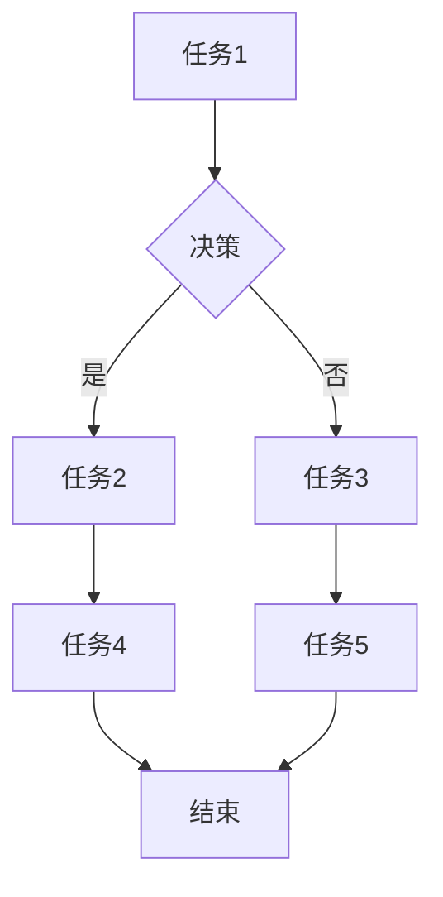

> AI智能体, 工作流, 设计模式, 协作, 自动化, 决策

## 1. 背景介绍

在当今数据爆炸和智能化浪潮席卷的时代，人工智能（AI）技术正在深刻地改变着各行各业。AI智能体作为一种新型的智能系统，具备学习、推理、决策和执行等能力，在自动化、协作和智能化应用中展现出巨大的潜力。然而，如何有效地设计和构建AI智能体的工作流，使其能够高效地完成复杂的任务，仍然是一个重要的挑战。

传统的软件开发模式难以满足AI智能体的需求，因为AI智能体通常需要处理大量的数据、进行复杂的推理和决策，并与其他智能体进行协作。因此，我们需要探索新的设计模式，以更好地支持AI智能体的开发和部署。

## 2. 核心概念与联系

**2.1 AI智能体工作流**

AI智能体工作流是指AI智能体执行任务的流程，它由一系列的步骤组成，每个步骤都由特定的任务和规则定义。工作流可以是线性的，也可以是分叉的，可以包含循环和条件判断等逻辑结构。

**2.2 设计模式**

设计模式是一种解决软件设计问题的通用解决方案，它提供了一种可重用的模板，可以帮助开发人员构建更健壮、可维护和可扩展的软件系统。

**2.3 联系**

将设计模式应用于AI智能体工作流，可以帮助我们更好地组织和管理AI智能体的任务执行流程，提高工作流的效率和可靠性。

**2.4 工作流设计模式的Mermaid流程图**



## 3. 核心算法原理 & 具体操作步骤

**3.1 算法原理概述**

AI智能体工作流的设计模式通常基于一些核心算法，例如：

* **状态机:** 状态机是一种用于描述系统状态转换的模型，可以用于表示AI智能体在不同任务阶段的行为。
* **决策树:** 决策树是一种树形结构，用于表示一系列的决策规则，可以用于指导AI智能体做出决策。
* **贝叶斯网络:** 贝叶斯网络是一种概率图模型，可以用于表示变量之间的依赖关系，可以用于AI智能体进行概率推理。

**3.2 算法步骤详解**

具体的操作步骤取决于所选用的设计模式和算法。以下是一个基于状态机的AI智能体工作流设计模式的示例：

1. **定义状态:** 首先，需要定义AI智能体可能处于的各种状态，例如“等待输入”、“处理数据”、“执行任务”等。
2. **定义状态转换:** 然后，需要定义状态之间的转换规则，例如当AI智能体接收到输入时，从“等待输入”状态转换到“处理数据”状态。
3. **定义状态行为:** 最后，需要定义每个状态下的行为，例如在“处理数据”状态下，AI智能体需要对数据进行分析和处理。

**3.3 算法优缺点**

* **优点:** 设计模式可以提高工作流的可读性、可维护性和可扩展性。
* **缺点:** 设计模式的应用需要一定的经验和技巧，如果应用不当，可能会导致工作流过于复杂或难以理解。

**3.4 算法应用领域**

AI智能体工作流的设计模式可以应用于各种领域，例如：

* **自动化流程:** 自动化办公流程、生产流程等。
* **智能客服:** 智能聊天机器人、语音助手等。
* **医疗诊断:** 基于AI的医疗诊断系统。
* **金融风险管理:** 基于AI的金融风险管理系统。

## 4. 数学模型和公式 & 详细讲解 & 举例说明

**4.1 数学模型构建**

AI智能体工作流可以抽象为一个状态转换图，其中每个状态代表一个任务或决策点，状态之间的转换依赖于一定的条件和规则。我们可以使用数学模型来描述状态转换图的结构和行为。

**4.2 公式推导过程**

假设一个AI智能体工作流包含n个状态，每个状态可以用一个整数i(1≤i≤n)表示。状态之间的转换可以用一个转移矩阵T表示，其中T(i,j)表示从状态i到状态j的转换概率。

状态转换图的动态行为可以用状态转移方程来描述：

$$P(i_t) = \sum_{i_{t-1}=1}^{n} T(i_{t-1}, i_t) * P(i_{t-1})$$

其中：

* $P(i_t)$ 表示在时间t处于状态i的概率。
* $T(i_{t-1}, i_t)$ 表示从状态$i_{t-1}$到状态$i_t$的转移概率。
* $P(i_{t-1})$ 表示在时间t-1处于状态$i_{t-1}$的概率。

**4.3 案例分析与讲解**

例如，一个简单的AI智能体工作流包含三个状态：等待输入、处理数据、执行任务。

转移矩阵T可以表示为：

$$T = \begin{bmatrix}
0 & 0.8 & 0.2 \\
0 & 0 & 1 \\
0 & 0 & 0
\end{bmatrix}$$

其中，0.8表示从“等待输入”状态到“处理数据”状态的转换概率，0.2表示从“等待输入”状态到“执行任务”状态的转换概率，1表示从“处理数据”状态到“执行任务”状态的转换概率。

通过状态转移方程，我们可以计算出AI智能体在不同时间处于不同状态的概率，从而分析工作流的动态行为。

## 5. 项目实践：代码实例和详细解释说明

**5.1 开发环境搭建**

* Python 3.x
* TensorFlow 或 PyTorch 等深度学习框架
* Jupyter Notebook 或 VS Code 等开发环境

**5.2 源代码详细实现**

```python
import tensorflow as tf

# 定义状态机
class AIWorkflow:
    def __init__(self):
        self.state = "waiting"
        self.model = tf.keras.Sequential([
            tf.keras.layers.Dense(10, activation="relu"),
            tf.keras.layers.Dense(1, activation="sigmoid")
        ])

    def process_input(self, input_data):
        # 处理输入数据
        # ...
        # 根据处理结果更新状态
        if ...:
            self.state = "processing"
        else:
            self.state = "executing"

    def execute_task(self):
        # 执行任务
        # ...

# 实例化AIWorkflow
workflow = AIWorkflow()

# 模拟输入数据
input_data = ...

# 处理输入数据
workflow.process_input(input_data)

# 根据状态执行相应的操作
if workflow.state == "processing":
    # ...
elif workflow.state == "executing":
    workflow.execute_task()
```

**5.3 代码解读与分析**

* 状态机类 `AIWorkflow` 定义了AI智能体的状态和行为。
* `process_input()` 方法处理输入数据并更新状态。
* `execute_task()` 方法执行任务。
* 代码示例展示了如何使用状态机来控制AI智能体的行为。

**5.4 运行结果展示**

运行代码后，AI智能体会根据输入数据和状态转换规则执行相应的任务。

## 6. 实际应用场景

**6.1 自动化流程**

AI智能体工作流可以用于自动化各种流程，例如：

* **客户服务自动化:** AI智能体可以处理客户的常见问题，例如订单查询、退货申请等。
* **生产流程自动化:** AI智能体可以监控生产设备，识别异常情况，并自动调整生产参数。
* **财务流程自动化:** AI智能体可以处理财务报表，识别异常交易，并自动生成财务报告。

**6.2 智能客服**

AI智能体工作流可以用于构建智能客服系统，例如：

* **聊天机器人:** AI智能体可以与用户进行对话，回答用户的问题，提供服务。
* **语音助手:** AI智能体可以理解用户的语音指令，执行相应的操作。

**6.3 医疗诊断**

AI智能体工作流可以用于辅助医疗诊断，例如：

* **影像分析:** AI智能体可以分析医学影像，识别病灶，辅助医生诊断。
* **症状分析:** AI智能体可以根据用户的症状，分析可能的疾病，提供诊断建议。

**6.4 未来应用展望**

随着AI技术的不断发展，AI智能体工作流将在更多领域得到应用，例如：

* **个性化教育:** AI智能体可以根据学生的学习情况，提供个性化的学习方案。
* **智能家居:** AI智能体可以控制家居设备，提供智能家居服务。
* **自动驾驶:** AI智能体可以控制自动驾驶汽车，实现无人驾驶。

## 7. 工具和资源推荐

**7.1 学习资源推荐**

* **书籍:**
    * 《设计模式：复现》
    * 《人工智能：一种现代方法》
* **在线课程:**
    * Coursera: AI for Everyone
    * edX: Artificial Intelligence
* **博客和网站:**
    * Towards Data Science
    * Machine Learning Mastery

**7.2 开发工具推荐**

* **Python:** 
    * TensorFlow
    * PyTorch
    * Keras
* **云平台:**
    * AWS
    * Azure
    * Google Cloud Platform

**7.3 相关论文推荐**

* **工作流管理:**
    * Workflow Management Systems: Concepts, Architectures, and Applications
* **AI智能体:**
    * Artificial Intelligence: A Modern Approach
    * Deep Learning

## 8. 总结：未来发展趋势与挑战

**8.1 研究成果总结**

AI智能体工作流的设计模式为构建高效、灵活、可扩展的AI智能体系统提供了新的思路和方法。

**8.2 未来发展趋势**

* **更智能化的工作流设计:** 利用机器学习和深度学习技术，自动生成和优化AI智能体的工作流。
* **更强大的协作能力:** 构建支持多智能体协作的工作流，实现更复杂的智能化应用。
* **更安全的AI智能体:** 研究和开发安全可靠的AI智能体工作流，防止恶意攻击和数据泄露。

**8.3 面临的挑战**

* **复杂性:** AI智能体的工作流通常非常复杂，需要复杂的算法和模型来实现。
* **可解释性:** AI智能体的决策过程通常难以理解，需要提高AI智能体的可解释性。
* **安全性:** AI智能体的工作流需要保证安全性，防止恶意攻击和数据泄露。

**8.4 研究展望**

未来，我们将继续研究和探索AI智能体工作流的设计模式，努力构建更智能、更安全、更可靠的AI智能体系统。

## 9. 附录：常见问题与解答

**9.1 如何选择合适的AI智能体工作流设计模式？**

选择合适的AI智能体工作流设计模式需要根据具体的应用场景和需求进行考虑。

**9.2 如何评估AI智能体工作流的性能？**

可以根据任务完成时间、准确率、资源消耗等指标来评估AI智能体工作流的性能。

**9.3 如何保证AI智能体工作流的安全性？**

需要采用安全可靠的算法和技术，例如身份验证、数据加密、访问控制等，来保证AI智能体工作流的安全性。


作者：禅与计算机程序设计艺术 / Zen and the Art of Computer Programming 
<end_of_turn>